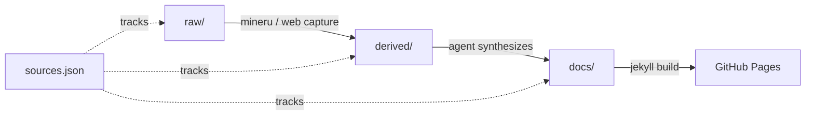

# zhongzhouTan-coder.github.io

An AI-maintained personal knowledge base — all content written by GitHub Copilot,
published on GitHub Pages. The goal: test whether an agent-driven workflow can
replace manual note-taking and do long-term knowledge precipitation
automatically.

**[Visit the website →](https://zhongzhoutan-coder.github.io/)**

**[Browse the wiki source →](docs/logs/index.md)**

## What's inside

Five topic categories covering the LLM inference and training stack, built from
primary sources (papers, codebases, technical blogs):

| Category | Topics |
|---|---|
| **Benchmarks** | Agent evaluation (DeepSWE, τ-bench, Pier, AutoJudger), serving performance (EvalScope Perf, AISBench) |
| **Frameworks** | vLLM, vLLM Ascend, SGLang, Triton, Triton Ascend, DSpark, Harbor, DeepSeek |
| **Algorithms** | FlashAttention (v1–v4), attention variants (MQA, GQA, MLA, Collaborative Attention), linear attention, DeepSeek-V3.2 sparse attention |
| **Training** | Foundation models (GPT-1/2/3, LLaMA), parallelism (Megatron-LM, GPipe, sequence parallelism), DeepSeek-V4, Kimi K3/Linear, efficient attention (MSA, SWAT, Gated DeltaNet), fine-tuning (intrinsic dimensionality, Socratic-SWE) |
| **Hardware** | Quantization (FlatQuant, NVFP4), accelerator numerics |

Every page links back to its original sources and related pages. See the
[wiki index](docs/logs/index.md) for the full catalogue and the
[knowledge base introduction](docs/README.md) for navigation conventions.

## How it works



1. **Capture** — PDFs and web pages land in `raw/` as immutable sources and are
   registered in `sources.json`.
2. **Extract** — PDFs convert to Markdown via MinerU; web pages render through
   a headless browser. Output lands in `derived/pdf-markdown/` or
   `derived/web-markdown/`.
3. **Synthesize** — An agent reads the extracted Markdown, writes a deep-dive
   docs page under `docs/`, cross-links related pages, creates term glossary
   entries, and updates the wiki index and change log.
4. **Publish** — Jekyll builds the site from `docs/` and deploys to GitHub
   Pages.

The full workflow rules live in [`AGENTS.md`](AGENTS.md).

## Quick start

**Browse the knowledge base:**

```bash
# Start with the categorized index
open docs/logs/index.md

# Or read the knowledge base introduction
open docs/README.md
```

**Search the wiki:**

```bash
npm run wiki:search -- "paged attention" --limit 5
npm run wiki:search -- "pipeline bubble" --category training --json
```

**Inspect the link graph:**

```bash
npm run wiki:graph -- --top 10
npm run wiki:graph -- --json
npm run wiki:graph-data
```

**Run integrity checks:**

```bash
python3 scripts/checks/repository_integrity.py --json
python3 scripts/checks/source_names.py --json
```

**Serve locally:**

```bash
bash scripts/serve-local.sh
```

Repository code references use relative `external-repos/` targets in their
Markdown source, so editor previews open the local dependency checkout. Jekyll
pages resolve the same references to provider-correct GitHub or GitCode links
pinned to the inspected commit.

Repository-backed docs must put those targets inside the revision-aware HTML
`code-link` anchor documented in
[`repo-reading.instructions.md`](.github/instructions/repo-reading.instructions.md).
Do not copy a checkout file into an ordinary Markdown link: that link breaks in
another agent workspace where the ignored checkout is absent, and
`scripts/checks/code_links.py` rejects it during docs lint.

**Refresh repository evidence:**

```bash
# Fetch latest upstream and compare only the subsystem being studied. Relevant
# changes are deferred until the current evidence revision is 14 days old.
./scripts/run-in-workspace.sh python scripts/repositories/worktree.py sync \
  vllm-a0c092ee72c0 \
  --path vllm/v1/core \
  --sparse vllm/v1/core

# Retire or restore an inactive pinned worktree without losing its evidence.
./scripts/run-in-workspace.sh python scripts/repositories/worktree.py retire \
  vllm-a0c092ee72c0
./scripts/run-in-workspace.sh python scripts/repositories/worktree.py materialize \
  vllm-a0c092ee72c0
```

The helper keeps one partial bare object cache per upstream repository. It
creates a detached revision worktree only when the requested paths changed and
the default 14-day revision interval has elapsed. A deferred sync reports the
next eligible date without creating a snapshot. Use
`--min-revision-interval-days N` to tune the cadence, or
`--force-new-revision` for an intentional urgent refresh. This keeps immutable
evidence reproducible without producing a snapshot for every upstream change.

**Prepare external repositories in a fresh workspace:**

```bash
# Offline report: which registered pinned checkouts are locally readable?
./scripts/bootstrap-external-repos.sh --status

# Materialize only the repositories needed for the current task.
./scripts/bootstrap-external-repos.sh vllm-a0c092ee72c0 vllm-ascend-32a59d4e349c

# Or materialize every registered revision.
./scripts/bootstrap-external-repos.sh
```

The tracked [`docs/_data/code_repositories.json`](docs/_data/code_repositories.json)
file is the portable lock table: it records each checkout path, provider URL,
and exact commit. The ignored `external-repos/` directory remains a disposable
workspace cache. Repository hydration is explicit because cloning every codebase
can consume substantial network bandwidth and disk space.

**Lint docs:**

```bash
./scripts/lint-docs.sh
```

Use the wrapper without adding a repository-wide Markdown glob. The configured
scope covers this wiki's docs, instructions, source records, and derived
repository notes while explicitly excluding read-only third-party Markdown in
`external-repos/`. Normal lint validates registered code-link metadata without
requiring every external checkout to be present. After materializing the
checkout used by a repository insight, optionally verify its pinned revision,
files, and line numbers with:

```bash
./scripts/run-in-workspace.sh python scripts/checks/code_links.py --local
```

## Web source capture

Install dependencies and capture a web page:

```bash
npm ci
npm run ingest:web -- \
  --url "https://example.com/article" \
  --category frameworks \
  --slug example-article
```

The command saves immutable HTML and metadata under `raw/`, writes readable
Markdown under `derived/web-markdown/`, preserves inline SVG diagrams as local
sidecar assets, and registers the captured revision in `sources.json`. See
[the web source instructions](.github/instructions/web-source.instructions.md)
for renderer choices and the `captured` → `ingested` workflow.

## Project structure

```text
.
├── raw/                   Canonical source files (never modified)
├── derived/
│   ├── pdf-markdown/      Markdown extracted from PDFs
│   ├── web-markdown/      Markdown extracted from web pages
│   └── repo-analysis/     Code-reading notes from checked-out repos
├── docs/                  Published knowledge pages (Jekyll site root)
│   ├── algorithms/        Inference algorithms and kernels
│   ├── benchmarks/        Benchmark designs and evaluation
│   ├── frameworks/        Serving systems and runtimes
│   ├── hardware/          Numerics, quantization, accelerators
│   ├── training/          Pretraining, fine-tuning, parallelism
│   ├── terms/             Cross-paper technical glossary
│   └── logs/              Wiki index and chronological change log
├── scripts/               Ingest, lint, search, and graph utilities
├── external-repos/        Third-party repo checkouts (git-ignored)
├── sources.json           Manifest linking raw → derived → docs
├── kb-categories.json     Canonical category registry
└── AGENTS.md              Agent workflow rules
```
