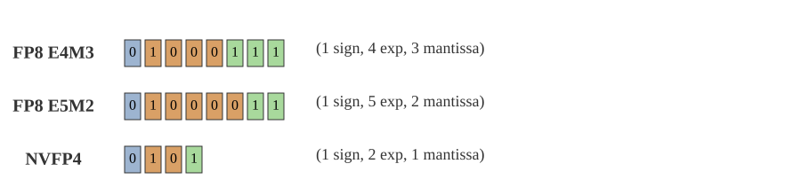
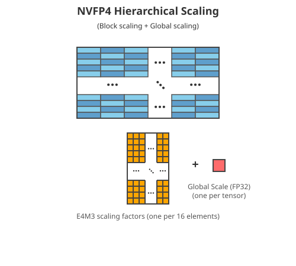
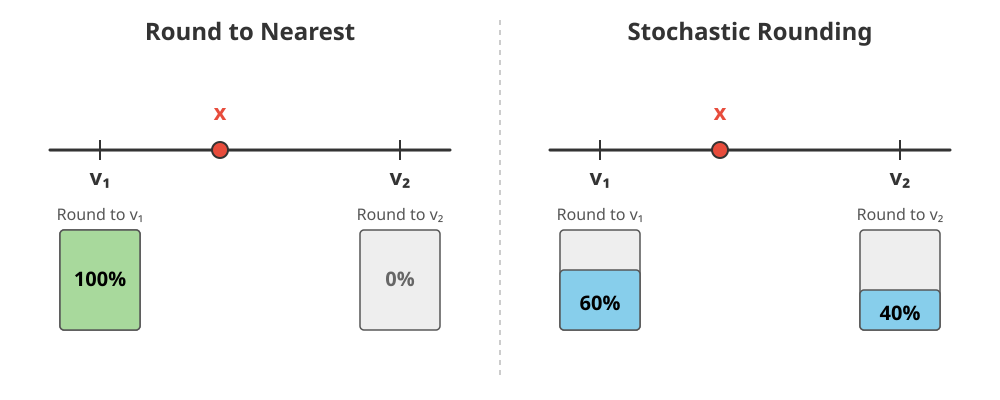
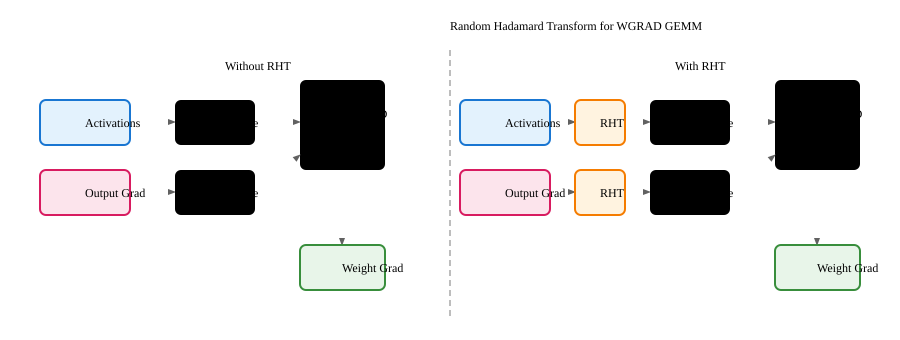
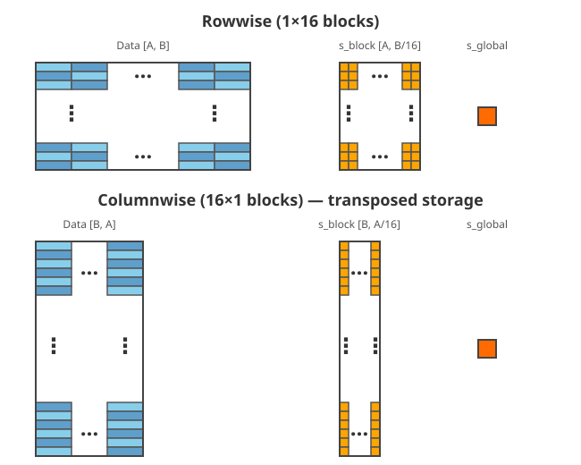
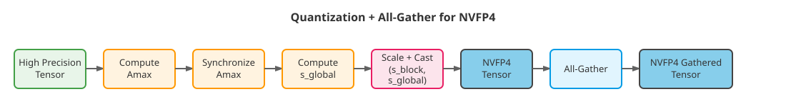

NVFP4
-----

NVFP4 is the first 4-bit recipe introduced in Transformer Engine – please refer to the [NVFP4 paper](https://arxiv.org/abs/2509.25149) for more details. It is a more complex recipe than the previous ones – apart from the new data format, it introduces multiple features which help training stability.

Data Format
-----------

The NVFP4 datatype consists of 1 sign bit, 2 exponent bits, and 1 mantissa bit (E2M1). It can represent values of magnitude up to +/- 6. NVFP4 uses a hierarchical block scaling approach where multiple scaling factors are combined to recover the high precision value.



*Figure 1. Bit layout comparison between standard FP8 formats (E4M3 and E5M2) and NVFP4 (E2M1).*

The representation of an NVFP4 tensor element `x` is given by:

```python
x = x_e2m1 * s_block * s_global
```

where

-   `x_e2m1` is the 4-bit value,

-   `s_block` is a local **FP8 E4M3** scaling factor shared by a block of 16 consecutive elements,

-   `s_global` is a global **FP32** scaling factor applied to the entire tensor.

**Scaling Factor Computation**

The scaling factors are computed as follows:

1.  Global scaling factor (`s_global`):

```python
s_global = global_amax / (fp8_max * fp4_max)
# where:
# - global_amax: maximum absolute value across the entire tensor
# - fp8_max: maximum representable value in FP8 E4M3 (448.0)
# - fp4_max: maximum representable value in NVFP4 E2M1 (6.0)
```

1.  Block scaling factor (`s_block`):

```python
s_block = (block_amax / fp4_max) / s_global
# where:
# - block_amax: maximum absolute value within the block
# - fp4_max: maximum representable value in NVFP4 E2M1 (6.0)
# - s_block is stored in FP8 E4M3 format
```



*Figure 2. NVFP4 hierarchical scaling structure showing the combination of block-level and global scaling factors.*

This hierarchical structure uses fine-grained block scaling to handle the tensor’s dynamic range, while the FP4 values represent the block-level dynamic range. The global scaling factor aligns values to the representable range of the E4M3 × E2M1 combination.

**2D weight scaling**

NVFP4 can be:

-   1 dimensional - each block of 16 consecutive elements shares a scaling factor,

-   2 dimensional - each block of 16x16 elements shares a scaling factor.

By default, NVFP4 uses 2D scaling for weights and 1D scaling for activations and gradients. Set `disable_2d_quantization=True` in the recipe configuration to force 1D scaling for weights as well (activations and gradients always use 1D). The motivation for using 2D scaling for weights is to ensure that rowwise and columnwise quantized tensors are numerically equivalent. Please refer to the [NVFP4 paper](https://arxiv.org/abs/2509.25149) for more details.

Stochastic Rounding
-------------------

Stochastic rounding is applied when casting scaled values to NVFP4 format. Instead of deterministic rounding (always rounding to nearest even value), each scaled value is probabilistically rounded to one of the two nearest representable NVFP4 values. The probability of rounding to a given value is inversely proportional to the distance to that value, which ensures that the expected value of the quantized tensor equals the original value, eliminating systematic quantization bias during training. Stochastic rounding is hardware-accelerated using native GPU instructions introduced with the Blackwell architecture.



*Figure 3. Stochastic rounding illustration. Given a value* `x` *to be quantized, and the two nearest representable NVFP4 values* `v1` *(lower) and* `v2` *(higher), deterministic rounding always rounds to the nearest value, while stochastic rounding probabilistically rounds to either value. If* `x` *is 40% of the way from* `v1` *to* `v2`, *there is a 60% chance of rounding to* `v1` *and a 40% chance of rounding to* `v2`.

Stochastic rounding is enabled only for gradients. It can be disabled by setting `disable_stochastic_rounding=True` in the recipe configuration.

Random Hadamard Transform
-------------------------

Random Hadamard Transform (RHT) applies an orthogonal rotation to the tensor **before quantization**, smoothing outliers in the tensor distributions and making them easier to represent accurately in NVFP4. RHT is applied to columnwise quantization of inputs and gradients, which are operands for the **wgrad GEMM**. This GEMM is particularly sensitive to quantization errors, hence the additional outlier smoothing. RHT is supported only for BF16 inputs/gradients.

The transform is defined as:

\\\[x' = x H\\\]

where \\(H\\) is the RHT matrix defined below. The quantization scale factor is computed from the rotated tensor \\(x'\\).

**Hadamard matrix**

The \\(d \\times d\\) Hadamard matrix has elements \\(\\pm 1\\) and satisfies \\(H\_d H\_d^T = d I\\). When normalized by \\(1/\\sqrt{d}\\), the matrix becomes orthogonal and can be applied to both operands of a matrix multiplication:

\\\[C = (AH)(H^T B) = AB\\\]

where the transforms cancel within the dot-product since \\(H H^T = I\\).

**Sign matrix**

In the RHT implementation, a \\(d\\)-dimensional diagonal sign matrix \\(S\_d\\) is applied together with the Hadamard matrix:

\\\[H = \\frac{1}{\\sqrt{d}} S\_d H\_d\\\]

where diagonal entries of \\(S\_d\\) are \\(\\{-1, 1\\}\\) and flip the signs of different rows of \\(H\_d\\). As described in the paper, a single random sign vector is shared across all linear layers throughout training. In the implementation, this vector is fixed and the RHT matrix is computed once at initialization and cached.

**Tiled implementation**

The Hadamard transform is performed in a tiled approach along the last dimension of the tensor. For an \\(m \\times k\\) tensor, the data is reshaped to \\((mk/d) \\times d\\) and multiplied by the \\(d \\times d\\) matrix \\(H\\). In this implementation, \\(d = 16\\).



*Figure 4. WGRAD GEMM pipeline comparison: without RHT (left) and with RHT applied (right).*

Handling transposes
-------------------

Like [MXFP8](https://docs.nvidia.com/deeplearning/transformer-engine/user-guide/features/low_precision_training/mxfp8/mxfp8.html), NVFP4 requires both rowwise and columnwise quantized tensors for different GEMM operands. Unlike MXFP8 which supports multiple layouts (TN, NT, NN), **NVFP4 GEMM only supports the TN layout**.

NVFP4 stores columnwise data and scaling factors in a **transposed layout**:

-   **Rowwise**: data `[A, B]` with 1×16 horizontal blocks, `scales` shape `[A, B/16]`

-   **Columnwise**: data `[B, A]` (transposed) with 1×16 horizontal blocks, `scales` shape `[B, A/16]`

Scale tensors are padded for hardware alignment: first dimension to a multiple of 128, second dimension to a multiple of 4 (e.g. rowwise: `[roundup(A, 128), roundup(B/16, 4)]`).



*Figure 5. NVFP4 rowwise vs columnwise quantization layout. Unlike MXFP8, columnwise scales are stored transposed.*

Distributed training
--------------------

**Amax reduction**

Block scaling factors (`s_block`) do not require synchronization between nodes, as each scaling factor is local to its block of 16 elements. However, the global scaling factor (`s_global`) requires amax synchronization for gathered tensors. For tensors that are gathered (e.g., input and gradient in sequence parallelism), amax reduction is performed before quantization. If before synchronization there was `amax_1` on node 1, `amax_2` on node 2, etc., after synchronization there will be `max(amax_1, amax_2, ...)` on all nodes.

**Quantized all-gather**

NVFP4 all-gather is supported.



*Figure 6. Quantization and all-gather flow for NVFP4 showing amax synchronization and hierarchical scaling.*

Examples
--------

Here’s how to use NVFP4 recipe in PyTorch and JAX. The examples show how to configure features like 2D weight quantization and Random Hadamard Transform (RHT):

```python
import torch
import transformer_engine.pytorch as te
from transformer_engine.common.recipe import NVFP4BlockScaling

# Define NVFP4 recipe
# 2D weight quantization and RHT are enabled by default
recipe = NVFP4BlockScaling()
# To disable features, use:
#   recipe = NVFP4BlockScaling(disable_rht=True, disable_2d_quantization=True)

# Create a linear layer with bfloat16 parameters
layer = te.Linear(1024, 1024, params_dtype=torch.bfloat16)

# Forward and backward pass
inp = torch.randn(32, 128, 1024, dtype=torch.bfloat16, device="cuda")

with te.autocast(enabled=True, recipe=recipe):
    output = layer(inp)
    loss = output.sum()

loss.backward()
```

Supported devices
-----------------

-   **Training**: SM 10.0, SM 10.3

-   **Inference**: SM 10.0+

* * *

Developer Notes
---------------

This section contains implementation details that may be useful for developers but are not required for using NVFP4 in practice.

### Swizzling scaling factors

NVFP4 requires swizzling of block scaling factors (`s_block`) before GEMM operations, similar to [MXFP8](https://docs.nvidia.com/deeplearning/transformer-engine/user-guide/features/low_precision_training/mxfp8/mxfp8.html). Key differences:

-   Block size is 16 (vs 32 for MXFP8)

-   Both rowwise and columnwise scaling factors are swizzled, but thanks to the transposed columnwise layout, a single rowwise swizzle kernel handles both cases.

-   Scaling factors are stored as FP8 E4M3 (vs E8M0 for MXFP8)

### All-gather of columnwise tensors

All-gather of columnwise tensors is supported. To enable quantized all-gather, all nodes must use the same `s_global`, which is computed from the synchronized global amax. This is automatically enabled for column-parallel and row-parallel linear layers.
