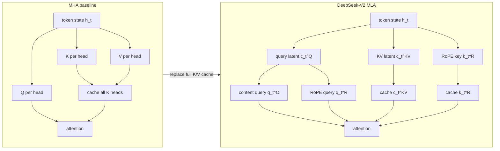
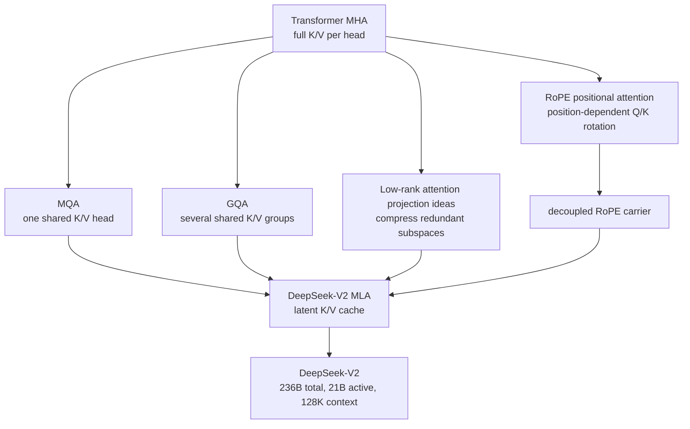

# DeepSeek-V2 Multi-Head Latent Attention

**Paper:** DeepSeek-V2: A Strong, Economical, and Efficient Mixture-of-Experts Language Model  
**Authors:** DeepSeek-AI  
**arXiv:** 2405.04434 - May 7, 2024  

**Related pages:** [The Transformer](../foundations/transformer.md) · [Multi-Query Attention](multi-query-attention.md) · [Grouped-Query Attention in Llama 2](grouped-query-attention/index.md) · [FlashAttention-2](../flashattention/flashattention-2.md)

## TL;DR

**What:** DeepSeek-V2 introduces Multi-head Latent Attention (MLA), an attention layout that caches a low-rank latent vector for keys and values instead of caching full per-head K/V tensors.

**How:** MLA jointly compresses K and V into a shared latent state, absorbs the K/V up-projections into query and output projections during inference, and adds a small decoupled RoPE key so position information does not break that absorption trick.

**The number:** In DeepSeek-V2, MLA uses KV cache equivalent to about **2.25 GQA groups**, and the full system reports **93.3% lower KV cache** and **5.76x maximum generation throughput** versus DeepSeek 67B.

## The Big Picture

*1. MHA stores full key and value tensors for every head. 2. MLA stores a compressed latent K/V vector plus a small RoPE key. 3. At inference time, the up-projections are folded into surrounding projections, so the cache stays latent instead of expanding back to full K/V form.*

## Why This Exists

Imagine serving a 128K-context chat model where many users are generating tokens at once. The compute for the current token is only part of the problem; the server must also keep and reread the prefix K/V cache for every active sequence.

With full multi-head attention, that cache grows with layers, sequence length, head count, and per-head dimension. With MQA or GQA, the server stores fewer K/V heads, but the model gives up some key/value diversity. DeepSeek-V2's pressure is sharper because it is a 236B-parameter MoE model designed to activate only 21B parameters per token. Sparse FFNs reduce compute, so **attention cache traffic becomes an even clearer serving bottleneck**.

MLA tries to avoid the old tradeoff: do not store one K/V pair per head, but also do not force all heads to share a single raw K/V head. Store a learned latent memory, then let heads decode it differently.

## The Landscape

*MLA inherits the KV-cache motivation from MQA and GQA, but changes the stored object: instead of choosing fewer K/V heads, it stores a low-rank latent representation from which K and V can be recovered or algebraically absorbed.*

## The Core Idea

MLA treats the KV cache as a compression problem rather than only a head-sharing problem. Each token writes a compact latent vector that jointly represents its future keys and values. During decoding, the model does not need to materialize full keys and values for every cached token, because the K up-projection can be folded into the query path and the V up-projection can be folded into the output path. RoPE would normally break this trick, so DeepSeek-V2 separates position-carrying dimensions into a small extra query/key channel and keeps the large content channel compressible.

## Why Store the Latent?

The key reason is that **the latent is sufficient for future attention, while full K/V is unnecessarily large**. The paper defines $c_t^{KV}=W^{DKV}h_t$, then derives content keys and values as $k_t^C=W^{UK}c_t^{KV}$ and $v_t^C=W^{UV}c_t^{KV}$. If the server cached $k_t^C$ and $v_t^C$, it would store the expanded per-head tensors. By caching only $c_t^{KV}$, it stores the compact common source that both K and V are derived from.

The second reason is algebraic: during inference, $W^{UK}$ can be absorbed into the query-side projection, and $W^{UV}$ can be absorbed into the output projection. That means the attention computation can use the cached latent directly without first expanding every historical token back into full K and V. The latent is not just a compressed archive; it is the runtime representation the optimized attention path is designed around.

RoPE is the complication. Because RoPE is position-dependent, applying it to the compressed content key would put a token-position-specific rotation between $W^Q$ and $W^{UK}$, blocking the absorption trick. DeepSeek-V2 therefore stores one extra small decoupled RoPE key $k_t^R$ alongside $c_t^{KV}$. The final cached state is $(c_t^{KV}, k_t^R)$, with size $(d_c+d_h^R)l$ rather than MHA's $2n_hd_hl$.

## Symbol Map

The paper's superscripts are easier to read if you treat them as labels, not powers. **`C` means content**, **`R` means RoPE/position**, **`KV` means the shared key-value latent**, **`D` means down-projection**, and **`U` means up-projection**.

| Symbol | Human name | Shape / scope | Plain meaning |
|---|---|---|---|
| $t$ | current token index | one position | The token being processed now. |
| $j$ | prefix token index | one prior-or-current position | A token the current token may attend to. |
| $i$ | attention head index | one of $n_h$ heads | Which query head is reading the memory. |
| $l$ | number of layers | model-wide | Used in cache formulas because each layer has its own cache. |
| $h_t$ | token hidden state | model width $d$ | The layer input for token $t$. |
| $n_h$ | number of attention heads | 128 in DeepSeek-V2 | How many query heads read attention memory. |
| $d_h$ | per-head content dimension | 128 in DeepSeek-V2 | Width of each content attention head. |
| $d_c$ | KV compression dimension | 512 in DeepSeek-V2 | Width of the cached latent K/V memory. |
| $d_c'$ | query compression dimension | 1536 in DeepSeek-V2 | Width of the temporary compressed query path. |
| $d_h^R$ | RoPE side-channel dimension | 64 in DeepSeek-V2 | Width of the decoupled positional key/query. |
| $c_t^{KV}$ | cached K/V latent | $d_c$ | The compact memory stored for token $t$ instead of full K and V. |
| $c_t^Q$ | query latent | $d_c'$ | A temporary compressed query representation for token $t$. |
| $k_t^C$ | content key | expanded per-head content key | The semantic key derived from $c_t^{KV}$. Usually not cached in expanded form. |
| $v_t^C$ | content value | expanded per-head content value | The semantic value derived from $c_t^{KV}$. Usually not cached in expanded form. |
| $q_{t,i}^C$ | content query for head $i$ | per-head content query | The semantic query for the current token and head. |
| $q_{t,i}^R$ | RoPE query for head $i$ | per-head position query | The positional query side channel after RoPE. |
| $k_t^R$ | shared RoPE key | $d_h^R$ | The small cached positional key shared across heads. |
| $W^{DKV}$ | K/V down-projection | $d_c \times d$ | Compresses $h_t$ into $c_t^{KV}$. |
| $W^{UK}$ | key up-projection | $d_hn_h \times d_c$ | Expands the latent into content keys; absorbed into query path at inference. |
| $W^{UV}$ | value up-projection | $d_hn_h \times d_c$ | Expands the latent into content values; absorbed into output path at inference. |
| $W^{DQ}$ | query down-projection | $d_c' \times d$ | Compresses $h_t$ into $c_t^Q$. |
| $W^{UQ}$ | query up-projection | content-query expansion | Expands $c_t^Q$ into content queries. |
| $W^{QR}$ | RoPE query projection | RoPE-query expansion | Produces $q^R$ before RoPE is applied. |
| $W^{KR}$ | RoPE key projection | $d_h^R \times d$ | Produces $k^R$ before RoPE is applied. |
| $W^O$ | output projection | model output projection | Mixes all head outputs back into the model width. |

The practical cache rule is:

| Quantity | Cached during generation? | Why |
|---|---|---|
| $c_t^{KV}$ | Yes | It is the compact source for both content keys and values. |
| $k_t^R$ | Yes | It carries token-position information needed by future queries. |
| $k_t^C$ | No, not as the main stored form | It can be represented through $c_t^{KV}$ and absorbed projection math. |
| $v_t^C$ | No, not as the main stored form | It can be represented through $c_t^{KV}$ and absorbed projection math. |
| $q_{t,i}^C$, $q_{t,i}^R$ | No | Queries are for the current token only and are recomputed each decoding step. |

## Deep Dive

### Low-Rank Joint K/V Compression

**What it does:** Replaces the cached full keys and values with a single latent vector $c_t^{KV}$ per token.

**Why it matters:** In the 128K serving scenario, every saved element in the per-token cache multiplies across layers, users, and context length.

**How it works:**

| Component | MHA | MLA |
|---|---|---|
| Stored key memory | $n_h$ key heads | compressed latent $c_t^{KV}$ |
| Stored value memory | $n_h$ value heads | same compressed latent $c_t^{KV}$ |
| Cache per token | $2n_hd_hl$ elements | $d_cl$ before RoPE carrier |
| DeepSeek-V2 setting | $n_h=128$, $d_h=128$ | $d_c=512=4d_h$ |

Training still learns up-projections from the latent vector into content keys and values. During inference, the paper notes that $W^{UK}$ can be absorbed into the query projection and $W^{UV}$ can be absorbed into the output projection, so the runtime does not need to expand and cache full content K/V tensors.

**The intuition:** The prefix cache becomes a compact memory card, not a full shelf of per-head key/value copies.

**A concrete example:** In the 128K serving scenario, full MHA would store K and V for 128 heads. MLA stores a 512-dimensional latent content vector per token before adding the RoPE carrier. That is why the paper frames MLA as attacking the actual deployed cache, not just the parameter count.

**Remember:** MLA's main move is **jointly compressing keys and values into one cached latent vector**.

### Decoupled RoPE

**What it does:** Separates positional information into a small RoPE query/key channel while leaving the main content K/V path compressible.

**Why it matters:** RoPE is position-sensitive. If RoPE is applied directly to the compressed content keys, the K up-projection can no longer be cleanly absorbed into the query path during inference.

**How it works:**

| Channel | Query side | Key side | Cached? | Purpose |
|---|---|---|---|---|
| Content | $q_t^C$ from query latent | $k_t^C$ from KV latent | latent only | semantic matching and values |
| Position | $q_{t,i}^R$ with RoPE | shared $k_t^R$ with RoPE | yes, small | relative position signal |
| Combined attention | concatenate content + position query | concatenate content + position key | latent + RoPE key | preserve RoPE without expanding K/V |

DeepSeek-V2 sets the decoupled RoPE per-head dimension $d_h^R$ to 64. The final cache is therefore $(d_c + d_h^R)l$ elements, which the paper simplifies to about $\frac{9}{2}d_hl$ for its settings.

**The intuition:** RoPE is kept as a small side channel so it can carry position without contaminating the compressed content memory.

**A concrete example:** In the 128K serving scenario, the server stores each token's 512-dimensional content latent plus a 64-dimensional RoPE key carrier, instead of storing full K/V tensors for all 128 heads.

**Remember:** Decoupled RoPE is the patch that makes low-rank KV caching compatible with rotary position embeddings.

### Query Compression

**What it does:** Adds a low-rank query latent $c_t^Q$ for the current token's query path.

**Why it matters:** Query compression does not reduce the persistent KV cache, but it reduces activation pressure during training and keeps the architecture balanced around low-rank bottlenecks.

**How it works:**

| Quantity | DeepSeek-V2 value | Role |
|---|---:|---|
| Attention heads $n_h$ | 128 | independent attention heads |
| Per-head content dim $d_h$ | 128 | content attention dimension |
| KV compression dim $d_c$ | 512 | cached K/V latent |
| Query compression dim $d_c'$ | 1536 | transient query latent |
| RoPE dim $d_h^R$ | 64 | position carrier |

The query latent is expanded into content queries and RoPE queries for the current token. Since queries for future tokens are recomputed when needed, this path is not the main inference-cache win.

**The intuition:** K/V compression saves the long-lived memory; query compression trims the short-lived work around it.

**A concrete example:** In the 128K serving scenario, only the prefix K/V cache accumulates across 128K tokens. The current query is transient, but compressing it still helps train and run a very large model with many attention heads.

**Remember:** Query compression is useful, but **the KV latent is the serving-critical piece**.

### DeepSeekMoE Context

**What it does:** Combines MLA with a sparse FFN stack based on DeepSeekMoE.

**Why it matters:** The paper's efficiency claim is not MLA alone. DeepSeek-V2 gets its full economic profile from attention-cache reduction plus sparse expert activation.

**How it works:**

| System part | DeepSeek-V2 choice | Efficiency role |
|---|---:|---|
| Total parameters | 236B | capacity pool |
| Activated parameters/token | 21B | sparse compute path |
| Transformer layers | 60 | model depth |
| Shared experts/layer | 2 | common knowledge path |
| Routed experts/layer | 160 | specialist pool |
| Routed experts active/token | 6 | sparse FFN compute |
| Device-limited routing | at most 3 devices/token | bounds expert communication |

DeepSeekMoE uses fine-grained expert segmentation and shared expert isolation. The serving implication is that MLA and MoE solve different bottlenecks: MLA shrinks attention memory, while MoE shrinks active FFN compute.

**The intuition:** MLA makes the long context cheaper to remember; MoE makes the large model cheaper to think with.

**A concrete example:** In the 128K serving scenario, a generated token activates only a subset of the FFN parameters, but it still attends over the cached prefix. Without MLA, the attention cache can erase much of the practical benefit of sparse activation.

**Remember:** DeepSeek-V2's efficiency story is **MLA for memory plus MoE for compute**.

## Putting It Together

1. A prompt enters DeepSeek-V2 and each token is embedded into a hidden state.
2. MLA down-projects each token into a compact $c_t^{KV}$ latent for content keys and values.
3. MLA also computes a small RoPE key $k_t^R$ to preserve positional attention.
4. The serving system caches $c_t^{KV}$ and $k_t^R$ for every prefix token.
5. For the next generated token, MLA forms content and RoPE queries from the query path.
6. Attention combines the current query with the latent content memory and the decoupled RoPE key.
7. The output flows into sparse MoE FFNs, where only selected routed experts plus shared experts are active.
8. The resulting system can support long context and larger batches because the persistent cache is much smaller than full MHA.

## What This Buys You

### The headline claim

MLA lets DeepSeek-V2 keep strong multi-head attention behavior while making long-context MoE serving practical.

### How We Know: Attention and System Evidence

| Evidence | Baseline | MLA / DeepSeek-V2 result | Interpretation |
|---|---:|---:|---|
| KV cache formula | MHA: $2n_hd_hl$ | MLA: $(d_c+d_h^R)l$ | cache depends on latent width, not head count |
| DeepSeek-V2 cache equivalence | GQA group count varies | about 2.25 GQA groups | smaller than common GQA layouts while preserving more capability |
| Large MoE ablation cache | MHA: 860.2K elements/token | MLA: 34.6K elements/token | about 4% of MHA cache |
| Large MoE MMLU | MHA: 57.5 | MLA: 59.0 | lower cache without measured quality loss in this ablation |
| Full-system throughput | DeepSeek 67B baseline | 5.76x max generation throughput | deployment benefit comes from MLA plus FP8, KV quantization, and MoE |
| Full-system training cost | DeepSeek 67B baseline | 42.5% fewer GPU hours per trillion tokens | sparse activation changes training economics |

### The mechanism behind the numbers

The ablation matters because ordinary cache-saving mechanisms often lose quality. In the paper's dense 7B comparison, MHA beats both MQA and GQA on BBH, MMLU, C-Eval, and CMMLU. MLA is different because it does not merely collapse K/V heads; it learns a latent content memory and keeps a separate positional channel, so it can reduce cache while preserving more attention flexibility.

### Caution: How to read these numbers

The 5.76x throughput result is a deployed-system comparison against DeepSeek 67B using FP8 parameters, KV-cache quantization, MLA, and MoE. It should not be read as the isolated speedup of the MLA attention formula alone.

## Where It Breaks

| Failure mode | When it happens | Impact |
|---|---|---|
| Latent width too small | $d_c$ cannot preserve enough K/V information for the model scale | quality may fall like aggressive MQA-style sharing |
| RoPE coupling handled incorrectly | RoPE is applied directly to compressed content keys in a way that prevents projection absorption | inference must recompute or materialize more K/V state |
| Kernel support is missing | Serving stack cannot exploit latent-cache attention efficiently | theoretical cache savings may not become throughput |
| Cache is not the bottleneck | short contexts or tiny batches dominate elsewhere | MLA complexity buys little in practice |
| System-level attribution error | throughput gains are credited only to MLA | misses FP8, KV quantization, MoE sparsity, routing, and custom kernels |
| Language/domain mismatch | users rely on DeepSeek-V2 outside its mostly Chinese/English training distribution | the model paper warns capability is less reliable in other languages |

## One Thing to Remember

MLA is **KV-cache compression without giving up the idea of many attention heads**. MQA and GQA reduce memory by sharing raw K/V heads; DeepSeek-V2 instead caches a learned latent memory, keeps RoPE in a small side channel, and uses that attention design to make a 236B-total-parameter, 21B-active MoE model practical for long-context generation.

## Go Deeper

- **Read:** `raw/algorithms/deepseek-v2-multi-head-latent-attention--arxiv-2405.04434.pdf` for the DeepSeek-V2 architecture, training, inference, and ablation details.
- **Build on:** [Multi-Query Attention](multi-query-attention.md) and [Grouped-Query Attention in Llama 2](grouped-query-attention/index.md) for the earlier KV-cache-reduction line.
- **Understand the context:** [The Transformer](../foundations/transformer.md) for standard MHA and [FlashAttention-2](../flashattention/flashattention-2.md) for the kernel family DeepSeek-V2 says its MLA implementation builds on.
- **Reproduce:** DeepSeek reports model checkpoints and code at `https://github.com/deepseek-ai/DeepSeek-V2`; this page only ingests the local PDF source.
