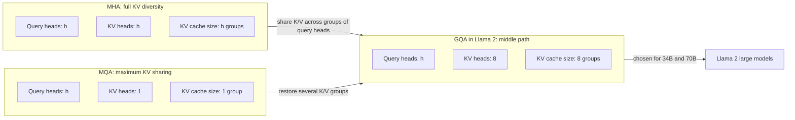
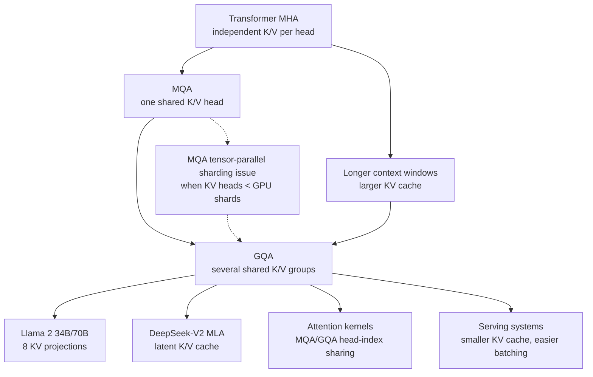

# Grouped-Query Attention in Llama 2

**Paper:** Llama 2: Open Foundation and Fine-Tuned Chat Models  
**Authors:** Hugo Touvron, Louis Martin, Kevin Stone, et al. (Meta)  
**arXiv:** 2307.09288 - July 18, 2023

**Related pages:** [Multi-Query Attention](../multi-query-attention.md) · [DeepSeek-V2 Multi-Head Latent Attention](../deepseek-v2-mla.md) · [The Transformer](../../foundations/transformer.md) · [FlashAttention-2](../../flashattention/flashattention-2.md) · [vLLM: PagedAttention Serving Framework](../../../frameworks/vllm/vllm-framework.md)

## TL;DR

**What:** Grouped-Query Attention (GQA) is the middle point between full multi-head attention and multi-query attention: many query heads share a smaller number of key/value heads.

**How:** Llama 2 uses 8 KV projections for its larger 34B and 70B models, reducing KV-cache growth while avoiding the strongest quality and tensor-parallel serving drawbacks of single-KV-head MQA.

**The number:** In Llama 2's 30B, 150B-token ablation, GQA is comparable to MHA on most tasks, beats MQA on average, and lets MQA/GQA continue at batch and context settings where MHA runs out of memory.

## The Big Picture

*Diagram source: [gqa-big-picture.mmd](gqa-big-picture.mmd). 1. MHA keeps one K/V set per attention head, maximizing expressivity but growing the KV cache with the head count. 2. MQA collapses K/V to one shared set, minimizing KV-cache traffic but giving up key/value diversity. 3. GQA keeps multiple query heads but assigns them to a smaller number of KV groups, giving Llama 2 a practical quality, memory, and serving compromise.*

## Why This Exists

Imagine serving a 70B chat model with a 4096-token context window on 8 A100 80 GB GPUs. Every generated token needs to attend over the prior tokens, so the server keeps a **[KV cache](../../../terms/kv-cache.md)** for the sequence instead of recomputing keys and values from scratch. As context length and batch size grow, that cache becomes a first-order memory bottleneck.

Full MHA stores K/V per head. MQA stores one shared K/V head. GQA asks a more production-shaped question: can the model keep enough independent K/V groups for quality and tensor-parallel deployment, while still shrinking the cache enough to support large-batch, long-context inference?

Llama 2's answer is yes for its larger models. The 7B and 13B variants keep ordinary attention, while the 34B and 70B variants adopt GQA because the cache pressure only becomes decisive at larger scale.

## The Landscape

*Diagram source: [gqa-landscape.mmd](gqa-landscape.mmd). **GQA inherits the KV-cache motivation from MQA**, but Llama 2 frames it as a scaling and deployment choice for long-context, large-parameter models.*

## The Core Idea

GQA is **controlled KV sharing**. Instead of asking every query head to carry its own key and value memory, or forcing every query head to share a single key/value memory, GQA partitions query heads into groups. Heads inside one group share K/V, but different groups keep different K/V projections. That gives the serving system a smaller cache and gives the model more representational room than MQA.

## Deep Dive

### KV-Cache Pressure

**What it does:** Reduces the number of cached key/value tensors that must be stored and read during autoregressive decoding.

**Why it matters:** In the 70B serving scenario, KV cache grows with batch size, sequence length, layers, and KV heads; shrinking KV heads makes long-context batching possible.

**How it works:**

| Attention form | Query heads | KV heads | Cache effect | Quality risk |
|---|---:|---:|---|---|
| MHA | h | h | Largest cache | Lowest sharing risk |
| MQA | h | 1 | Smallest cache | Most K/V sharing |
| GQA | h | g, where 1 < g < h | Middle-sized cache | Middle sharing risk |

In the Llama 2 appendix, the GQA variant uses 8 KV projections. The paper does not expose the exact query-head count in the extracted section, but the central relation is clear: **the KV-cache multiplier is the number of KV groups, not the number of query heads**.

**The intuition:** The model still has many ways to ask questions, but it stores fewer copies of the memory those questions read from.

**A concrete example:** In the 70B serving scenario, replacing MHA with GQA means a batch of conversations no longer needs a separate K/V cache for every attention head. The saved memory can become larger batches, longer contexts, or fewer out-of-memory failures.

**Remember:** GQA optimizes the part of attention that persists across decoding steps: the cached keys and values.

### Quality Middle Ground

**What it does:** Keeps more K/V diversity than MQA while still sharing K/V across multiple query heads.

**Why it matters:** The Llama 2 ablation shows MQA is not the only memory-saving option; GQA preserves more benchmark quality on average.

**How it works:**

| Model variant | BoolQ | HellaSwag | ARC-e | NQ | TQA | MMLU | GSM8K | HumanEval |
|---|---:|---:|---:|---:|---:|---:|---:|---:|
| MHA | 71.0 | 75.1 | 71.2 | 12.4 | 44.7 | 28.0 | 4.9 | 7.9 |
| MQA | 70.6 | 74.5 | 71.6 | 14.5 | 42.8 | 26.5 | 4.8 | 7.3 |
| GQA | 69.4 | 75.4 | 72.1 | 14.0 | 46.2 | 26.9 | 5.3 | 7.9 |

The ablation uses fixed 30B models trained on 150B tokens. Llama 2 compensates for the reduced attention parameters by increasing FFN dimensions: 1.33x for MQA and 1.3x for GQA.

**The intuition:** MQA asks whether one shared memory is enough; GQA says several shared memories are cheap enough and often better.

**A concrete example:** In the same 70B serving scenario, choosing GQA over MQA gives the model multiple K/V groups for tasks where one shared K/V projection may blur useful distinctions, while still avoiding the full MHA cache.

**Remember:** In this source, the empirical reason to prefer GQA is not one single benchmark win; it is the average quality profile plus serving practicality.

### Tensor-Parallel Serving

**What it does:** Makes the attention layout easier to shard across the 8-GPU serving setup used for Llama 2's largest models.

**Why it matters:** A theoretically smaller KV cache is less useful if it creates awkward distributed serving behavior.

**How it works:**

| Choice | Serving consequence on 8 A100s |
|---|---|
| MHA | Many KV heads can shard naturally, but cache is large |
| MQA | One KV head cannot shard cleanly across attention heads; duplicating KV removes much of the memory advantage |
| GQA | 8 KV projections line up with the 8-GPU deployment more naturally |

The appendix says that with MQA, if the number of KV heads is lower than the number of GPU shards, sharding across heads no longer works cleanly. Duplicating KV values on every GPU makes MQA's cache look like GQA, while batch-dimension sharding complicates the service and depends on sufficiently large batches.

**The intuition:** GQA is not just a model-quality compromise; it is also a deployment-shape compromise.

**A concrete example:** In the 70B serving scenario, 8 KV groups fit the 8-GPU single-node tensor-parallel setup better than a single KV group that must either be copied everywhere or handled with a more complicated batch-sharding strategy.

**Remember:** Llama 2 chose GQA because inference systems care about sharding boundaries, not only parameter counts.

## Putting It Together

1. A user sends a long chat prompt to a large Llama 2 model.
2. Prefill computes keys and values for prompt tokens and stores them in the KV cache.
3. During decoding, each new token reuses the cached K/V instead of recomputing all prior states.
4. With MHA, the cache grows with every attention head, which limits batch size and context length.
5. With MQA, the cache is smaller, but one KV group can hurt quality and complicate 8-way tensor-parallel serving.
6. With GQA, query heads are mapped onto 8 KV groups, shrinking cache pressure while retaining multiple K/V projections.
7. The serving system can push to larger batches and contexts; the Llama 2 paper reports MHA out-of-memory cases where MQA and GQA continue running.

## What This Buys You

### The headline claim

Llama 2 uses GQA because it is **the best practical compromise** among MHA, MQA, and production tensor-parallel serving for larger models.

### How We Know: 30B Attention Ablation

| Evidence | What the paper shows | Interpretation |
|---|---|---|
| Quality | GQA performs comparably to MHA on most listed tasks and better than MQA on average | GQA gives back enough K/V diversity to avoid MQA's broadest quality loss |
| Throughput | MQA and GQA enable higher throughput at larger batch sizes | Smaller KV caches matter most as batch and context increase |
| Memory | MHA runs out of memory at batch size 1024 with 256-token context and batch size 128 with 2k context | The cache limit is operational, not just theoretical |
| Serving | MQA sharding can require KV duplication or batch sharding | The smallest mathematical cache is not always the simplest deployed cache |

### The Mechanism Behind the Numbers

GQA reduces memory pressure in the same direction as MQA, but it does not force all query heads through one K/V projection. That extra K/V diversity appears to recover some benchmark behavior, while the lower KV-head count still improves high-batch throughput compared with MHA.

### Caution: How to Read These Numbers

The ablation is from the Llama 2 paper, not the original GQA paper. It compares 30B models trained for 150B tokens and reports downstream benchmark scores plus serving behavior. It supports the Llama 2 engineering choice, but it is not a complete proof that 8 KV groups is universally optimal.

## Where It Breaks

| Failure mode | When it happens | Impact |
|---|---|---|
| Too few KV groups | Quality-sensitive tasks need more K/V diversity than the selected group count provides | MQA-style degradation can reappear |
| Too many KV groups | The model approaches MHA-like cache size | Throughput and batch-size gains shrink |
| Hardware mismatch | KV group count does not align with tensor-parallel shards or kernel implementation | The theoretical cache reduction may not translate into simple serving wins |
| Small-model over-optimization | KV cache is not the bottleneck for a small model or short context | GQA adds architectural complexity without meaningful deployment benefit |
| Source limitation | The available source is the Llama 2 paper, not the Ainslie et al. GQA paper | Details about checkpoint conversion and full GQA training procedure are out of scope here |

## One Thing to Remember

GQA is **MQA made deployable for large models that still need some K/V diversity**. It keeps many query heads, shares keys and values inside groups, and in Llama 2's largest models gives a cleaner balance among benchmark quality, KV-cache memory, and 8-GPU tensor-parallel serving than either full MHA or single-KV-head MQA.

## Go Deeper

- **Read:** `raw/algorithms/grouped-query-attention-llama-2--paper.pdf` for the Llama 2 appendix section that motivates GQA in the 34B and 70B models.
- **Build on:** [Multi-Query Attention](../multi-query-attention.md) for the ancestor mechanism that collapses K/V to a single write head.
- **Understand the context:** [vLLM: PagedAttention Serving Framework](../../../frameworks/vllm/vllm-framework.md) for a complementary serving-system view of KV-cache pressure.
- **Dig into the mechanism:** [PagedAttention](../../../terms/pagedattention.md) for the paged KV-cache layout that powers the vLLM serving framework.
- **Reproduce:** The source references the original GQA paper by Ainslie et al. (2023), but that standalone paper is not present in `raw/` at the time of this page.
