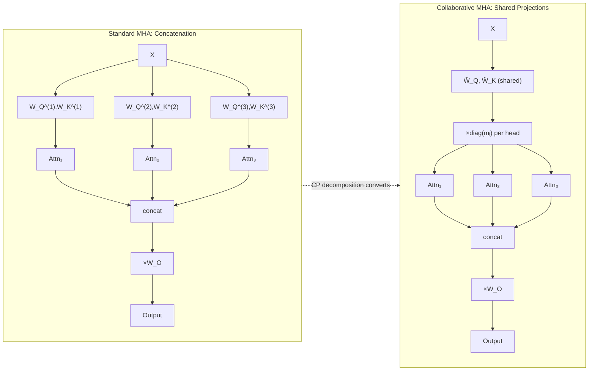
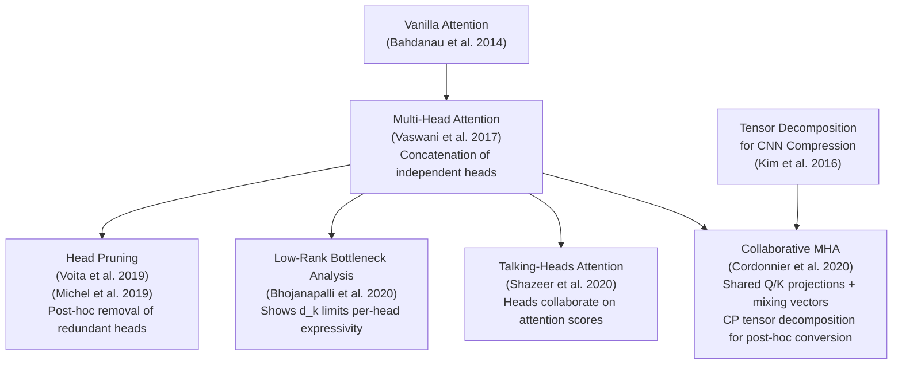

# Collaborative Multi-Head Attention: Collaborate Instead of Concatenate

**Paper:** Multi-Head Attention: Collaborate Instead of Concatenate
**Authors:** Jean-Baptiste Cordonnier, Andreas Loukas, Martin Jaggi (EPFL)
**arXiv:** 2006.16362v2

**Related pages:** [The Transformer](transformer.md) · [FlashAttention](flashattention.md) · [Softmax](softmax.md) · [Algorithms Index](index.md)

## TL;DR

**What:** A re-design of multi-head attention where heads share key/query projection matrices instead of each head learning independent $W_Q^{(i)}, W_K^{(i)}$ — making heads collaborate rather than compete for representational space.

**How:** Shared $\tilde{W}_Q, \tilde{W}_K$ project into a common space of dimension $\tilde{D}_k$, and each head $i$ applies a learned mixing vector $m_i$ (via $\operatorname{diag}(m_i)$) to select its own weighted subspace. This is equivalent to a CP tensor decomposition of the stacked $W_Q W_K^\top$ products across heads.

**The number:** Key/query dimension can be reduced **4×** without accuracy loss on NMT (WMT14 EN-DE), and pretrained models (BERT, DistilBERT, DeiT) can be compressed post-hoc with $<1.5\%$ average GLUE score drop at $2\times$–$3\times$ compression, without retraining from scratch.

## The Big Picture

*① Standard MHA: each head learns independent $W_Q^{(i)}, W_K^{(i)}$ → independent attention scores → concatenate → project. ② Collaborative MHA: shared $\tilde{W}_Q, \tilde{W}_K$ project to common space → each head mixes dimensions via learned $m_i$ → identical mathematical expressivity at full rank, but with parameter sharing. ③ The CP tensor decomposition of the stacked $W_Q W_K^\top$ tensor yields $M$, $\tilde{W}_Q$, $\tilde{W}_K$ — enabling post-hoc conversion of any pretrained MHA model.*

## Why This Exists

Take a pretrained BERT-base model with $N_h = 12$ heads and $d_k = 64$ per head ($D_k = 768$ total key/query dimension). Each head independently learns $W_Q^{(i)} \in \mathbb{R}^{768 \times 64}$ and $W_K^{(i)} \in \mathbb{R}^{768 \times 64}$ — in total, $12 \times 2 \times 768 \times 64 \approx 1.18\text{M}$ parameters just for key and query projections.

**The problem:** Heads are not independent. When you stack the $W_Q^{(i)} W_K^{(i)\top}$ matrices across all heads and run PCA, one-third of the dimensions captures nearly all the energy. This means heads are redundantly learning the same input-space relationships — they "pay attention" to the same subspaces but with slightly different rotations.

**Why existing fixes aren't enough:** Head pruning (Voita et al., Michel et al.) can remove redundant heads, but requires first training the full model and then identifying which heads to discard — it's a post-hoc amputation, not a design fix. The root cause is the **concatenation structure itself**: by giving each head its own independent projection, the architecture encourages wasteful duplication of learned features.

**What collaborative MHA changes:** Instead of $N_h$ independent Q/K projection pairs, learn one shared pair $\tilde{W}_Q, \tilde{W}_K$ and give each head a mixing vector $m_i$ that selects which dimensions of the shared space it attends to. The architecture now **encodes** the insight that heads should share common features and differentiate only where needed.

## The Landscape

*Collaborative MHA sits at the intersection of two lines of work: (1) diagnosing and fixing MHA redundancy (head pruning showed heads are redundant; low-rank bottleneck showed per-head capacity is limited), and (2) tensor decomposition for neural network compression (Kim et al. used Tucker decomposition to factorize CNN filters — this work applies CP decomposition to attention heads). Unlike head pruning (post-hoc removal) and Talking-Heads (collaboration on attention scores), collaborative MHA addresses the root cause — redundant projections — by structural weight sharing.*

## The Core Idea

Standard multi-head attention concatenates independent heads, but their key/query projections are redundant because all heads end up attending to the same input subspaces. Instead of giving each head its own projection matrices, learn **one shared pair** of key/query projections and let each head apply a learned diagonal scaling (mixing vector) to select its own weighted combination of the shared dimensions. The mixing structure is exactly the CP (PARAFAC) tensor decomposition of the stacked $W_Q W_K^\top$ tensor, which means any pretrained attention layer can be converted to collaborative form without any retraining — just run CP decomposition, extract $M$, $\tilde{W}_Q$, $\tilde{W}_K$, and you get the same attention scores up to the decomposition rank.

## Deep Dive

### The Redundancy Discovery: PCA on Stacked QK Products

**What it does:** Measures how much of the variance in the stacked $W_Q W_K^\top$ matrices (concatenated across all heads) is captured by the top principal components.

**Why it matters:** If heads were truly learning independent features, the concatenated $W_Q W_K^\top$ would be full-rank. Low rank = heads are sharing subspaces = wasted parameters.

**How it works:**

| Step | Action |
|---|---|
| 1 | For each head $i$, compute $P_i = W_Q^{(i)} W_K^{(i)\top} \in \mathbb{R}^{D_{in} \times D_{in}}$ |
| 2 | Concatenate: $P = [P_1 | P_2 | \ldots | P_{N_h}] \in \mathbb{R}^{D_{in} \times D_k}$ |
| 3 | Run PCA on $P$ and plot cumulative explained variance |
| 4 | Compare against the concatenated raw $W_Q$ and $W_K$ individually |

Key finding: Individual $P_i$ matrices are **not** low-rank (each is ~rank 64), but the **concatenated** $P$ is highly low-rank — ~33% of dimensions capture nearly all energy. The heads are exploring the same space from different angles.

**The intuition:** Imagine 12 people each independently drawing a map of the same city. Each map looks different in its raw coordinates (different rotations, scales), but when you overlay them, they all highlight the same streets and landmarks. The concatenation is redundant — you only need one shared base map plus per-person annotations of which streets they care about most.

**A concrete example:** In BERT-base ($D_{in}=768$, $N_h=12$, $d_k=64$), $D_k = 768$. PCA on the stacked QK products shows that ~256 dimensions ($\tilde{D}_k = D_k / 3$) captures almost all the energy. This means the effective key/query subspace that heads collectively use is much smaller than the allocated $768$ dimensions.

**Remember:** **Concatenated heads' key/query projections are low-rank in aggregate, even though each individual head's projection appears full-rank.** This is the central observation that motivates the entire method.

### Collaborative MHA: Shared Projections + Per-Head Mixing

**What it does:** Replaces $N_h$ independent $(W_Q^{(i)}, W_K^{(i)})$ pairs with one shared $(\tilde{W}_Q, \tilde{W}_K)$ pair plus $N_h$ mixing vectors $m_i \in \mathbb{R}^{\tilde{D}_k}$.

**Why it matters:** This is the architectural fix. Instead of letting heads waste parameters on redundant projections and then pruning later, collaborative MHA bakes parameter sharing into the design.

**How it works:**

For each head $i$, the query projection becomes $\tilde{W}_Q \operatorname{diag}(m_i)$, and the key projection remains $\tilde{W}_K$ (unmixed):

$$H^{(i)} = \operatorname{Attention}(X \tilde{W}_Q \operatorname{diag}(m_i),\; Y \tilde{W}_K,\; Y W_V^{(i)})$$

The attention score between token $x_n$ and $y_m$ for head $i$:

$$a^{(i)}_{n,m} = (x_n^\top \tilde{W}_Q) \operatorname{diag}(m_i) (\tilde{W}_K^\top y_m)$$

| Component | Standard MHA | Collaborative MHA |
|---|---|---|
| Q projection | $W_Q^{(i)} \in \mathbb{R}^{D_{in} \times d_k}$ per head | $\tilde{W}_Q \in \mathbb{R}^{D_{in} \times \tilde{D}_k}$ shared |
| K projection | $W_K^{(i)} \in \mathbb{R}^{D_{in} \times d_k}$ per head | $\tilde{W}_K \in \mathbb{R}^{D_{in} \times \tilde{D}_k}$ shared |
| Head differentiation | Independent projection matrices | Mixing vector $m_i \in \mathbb{R}^{\tilde{D}_k}$ |
| Total QK params | $2 D_{in} D_k$ | $(2 D_{in} + N_h) \tilde{D}_k$ |
| Compression ratio | — | $\approx D_k / \tilde{D}_k$ |

**The intuition:** Standard MHA is a special case of collaborative MHA where the mixing matrix $M$ (rows = $m_i$) has a "blocks-of-1" structure: each head gets exactly its own $d_k$ dimensions with weight 1 and all other dimensions with weight 0. Collaborative MHA removes this hard partitioning — heads can use overlapping dimensions with different weights, which is more expressive for the same parameter budget.

**A concrete example:** Back to BERT-base with $D_k = 768$. Standard MHA allocates $768$ dimensions as 12 blocks of 64. Collaborative MHA with $\tilde{D}_k = 256$ shares 256 dimensions across all 12 heads. Each head's mixing vector $m_i \in \mathbb{R}^{256}$ learns which of those 256 shared features matter most for that head. At $\tilde{D}_k = 256$, params drop from $2 \times 768 \times 768 = 1.18\text{M}$ to $(2 \times 768 + 12) \times 256 \approx 0.40\text{M}$ for Q/K — a 3× compression.

**Remember:** **Standard concatenated MHA is a special case of collaborative MHA with a block-diagonal mixing matrix.** Collaborative MHA generalizes this to learned, overlapping mixing vectors, enabling the same or better expressivity with fewer parameters.

### Content vs. Context Decomposition

**What it does:** Decomposes the attention score computation to show that the key bias $b_K$ has no effect on attention probabilities.

**Why it matters:** This is a side contribution that clarifies a discrepancy between theory and common implementations. Many transformer implementations include biases in key/query linear layers that the original paper omitted. Understanding which terms matter lets you correctly handle biases during the collaborative re-parametrization.

**How it works:** Expanding the dot-product attention score with biases:

$$QK^\top = \underbrace{X W_Q W_K^\top Y^\top}_{\text{context (pairwise)}} + \underbrace{\mathbf{1} b_Q^\top W_K^\top Y^\top}_{\text{content (key-only)}} + \underbrace{X W_Q b_K \mathbf{1}^\top + \mathbf{1} b_Q^\top b_K}_{\text{constant per row (ignored by softmax)}}$$

The last two terms are constant across all positions in the same row, so softmax (which is shift-invariant) cancels them out. Only two terms survive:

- **Context term** ($X W_Q W_K^\top Y^\top$): pairwise interaction between query and key tokens.
- **Content term** ($\mathbf{1} b_Q^\top W_K^\top Y^\top$): attention based purely on key content, independent of the query. Means some tokens get high attention regardless of what's asking.

**The intuition:** The key bias $b_K$ is irrelevant — it always drops out. The query bias $b_Q$ matters because it creates content-based attention (some keys are "inherently interesting" regardless of the query). This means you can always disable $b_K$ without consequences.

**A concrete example:** When re-parametrizing a pretrained model with biases to collaborative form, the bias is handled by storing per-head vectors $v_i = W_K^{(i)} b_Q^{(i)}$ that capture the content-based attention component. The collaborative attention score becomes:

$$\text{score}^{(i)} \approx X \tilde{W}_Q \operatorname{diag}(m_i) \tilde{W}_K^\top Y^\top + \mathbf{1} v_i^\top Y^\top$$

**Remember:** **The key bias $b_K$ can always be set to zero — softmax shift-invariance cancels it.** Only the query bias $b_Q$ matters, and it encodes content-based (query-independent) attention.

### Post-Hoc Re-Parametrization via CP Tensor Decomposition

**What it does:** Converts any pretrained MHA model to collaborative form without retraining, by applying CP (PARAFAC) decomposition to the stacked $W_Q W_K^\top$ tensor.

**Why it matters:** Pretraining transformers from scratch is expensive. Being able to compress an already-pretrained model in minutes (not days) makes collaborative MHA immediately practical.

**How it works:**

1. Stack all heads' $W_Q^{(i)} W_K^{(i)\top} \in \mathbb{R}^{D_{in} \times D_{in}}$ into a 3D tensor $\mathsf{W}_{QK} \in \mathbb{R}^{N_h \times D_{in} \times D_{in}}$.
2. Apply CP decomposition with rank $\tilde{D}_k$:
   $$\mathsf{W}_{QK} \approx \sum_{r=1}^{\tilde{D}_k} a_r \circ b_r \circ c_r = [\![A, B, C]\!]$$
3. Extract:
   - Mixing matrix: $M = A \in \mathbb{R}^{N_h \times \tilde{D}_k}$
   - Shared query projections: $\tilde{W}_Q = B \in \mathbb{R}^{D_{in} \times \tilde{D}_k}$
   - Shared key projections: $\tilde{W}_K = C \in \mathbb{R}^{D_{in} \times \tilde{D}_k}$
4. For biases: compute and store per-head $v_i = W_K^{(i)} b_Q^{(i)}$.

| Property | Value |
|---|---|
| Decomposition time for BERT-base | ~3 minutes on single GPU |
| $\tilde{D}_k = D_k$ (no compression) | Exact (zero accuracy loss) |
| $\tilde{D}_k = D_k / 2$ | <1.5% average GLUE drop |
| $\tilde{D}_k = D_k / 3$ | Recoverable with 2nd fine-tune |
| No fine-tuning needed up to | $1.5\times$ compression |

**The intuition:** The stacked QK products form a 3D tensor with one mode for heads and two modes for input dimensions. CP decomposition finds a low-rank approximation by factorizing into three matrices — and these matrices map directly to the collaborative MHA parameters. It's not a heuristic compression; it's the mathematically optimal low-rank approximation for the squared Frobenius norm.

**A concrete example:** Starting from fine-tuned BERT-base on MNLI, you run CP decomposition with $\tilde{D}_k = 384$ (2× compression). In 3 minutes, you get $\tilde{W}_Q, \tilde{W}_K, M, \{v_i\}$. Without any additional training, MNLI accuracy stays within ~1% of the original. With a second fine-tuning pass, you recover virtually all accuracy. Compare this to training BERT-base from scratch (~4 days on 16 TPUs).

**Remember:** **CP tensor decomposition of the stacked QK products directly yields collaborative MHA parameters — no training, no approximation beyond the chosen rank, and exact at full rank.** This is what makes collaborative attention a drop-in post-hoc compression tool.

## Putting It Together

A complete walkthrough of converting a pretrained BERT-base model to compressed collaborative form:

1. **Fine-tune BERT-base** on your target task (e.g., MNLI). The model has standard concatenated MHA with $D_k = 768$, $N_h = 12$, $d_k = 64$.

2. **For each attention layer**, stack all heads' $W_Q^{(i)} W_K^{(i)\top}$ into $\mathsf{W}_{QK} \in \mathbb{R}^{12 \times 768 \times 768}$.

3. **Run CP decomposition** with $\tilde{D}_k = 384$ (2× compression). Extract $M \in \mathbb{R}^{12 \times 384}$, $\tilde{W}_Q \in \mathbb{R}^{768 \times 384}$, $\tilde{W}_K \in \mathbb{R}^{768 \times 384}$. For biases: compute $v_i = W_K^{(i)} b_Q^{(i)}$ per head. This takes ~3 minutes total for all layers.

4. **Replace** every MHA layer with collaborative MHA using the extracted parameters. The model now has $(2 \times 768 + 12) \times 384 \approx 595\text{K}$ Q/K params per layer instead of $1.18\text{M}$ — a ~50% reduction in attention parameters.

5. **Optionally fine-tune again** for 3 epochs on the target task. For 2× compression, this second fine-tune typically recovers all lost accuracy. For 3× compression ($\tilde{D}_k = 256$), it recovers most but not all.

6. **Result:** A compressed model with 6-8% fewer total parameters (since $W_V$, $W_O$, and FFN layers are untouched) and comparable accuracy, obtained in minutes instead of retraining.

## What This Buys You

### The headline claim

Collaborative MHA matches or exceeds standard concatenated MHA accuracy while using **4× fewer key/query parameters** when training from scratch, and can compress pretrained models by **2×–3×** with $<1.5\%$ accuracy loss via post-hoc decomposition.

### How we know: NMT from scratch (WMT14 EN-DE)

| $D_k$ | Concat BLEU | Collab BLEU | Concat params | Collab params |
|---|---:|---:|---:|---:|
| 512 (baseline) | 27.40 | **27.58** | 60.9M | 61.0M |
| 256 | 27.10 | **27.41** | 56.2M | 56.2M |
| **128** | 26.89 | **27.40** | 53.8M | 53.8M |
| 64 | 26.77 | **27.31** | 52.6M | 52.7M |

At $D_k = 128$ (4× compression), collaborative MHA matches the baseline BLEU of 27.40, while concatenated MHA drops 0.5 points. The collaborative version at $D_k = 64$ still outperforms concat at $D_k = 128$.

### How we know: Post-hoc GLUE compression

| Model | $\tilde{D}_k$ | Params | Avg GLUE | Δ from original |
|---|---|---|---|---|
| BERT-base (orig) | — | 108.3M | 83.0 | — |
| BERT collab | 768 (no comp.) | 108.5M | 83.2 | **+0.2** |
| BERT collab | 384 (2×) | 101.4M | 82.5 | −0.5 |
| BERT collab | 256 (3×) | 99.0M | 81.7 | −1.3 |
| DistilBERT (orig) | — | 66.4M | 80.0 | — |
| DistilBERT collab | 384 (2×) | 62.9M | 79.1 | −0.9 |

### The mechanism behind the numbers

Collaborative MHA's advantage grows as compression increases because it **shares** rather than **shrinks**. Standard MHA at $D_k = 64$ gives each head only $d_k = 8$ dimensions — too narrow for meaningful attention. Collaborative MHA at $\tilde{D}_k = 64$ gives each head access to all 64 shared dimensions, weighted by $m_i$. The head can still express complex attention patterns because it's not confined to a tiny independent subspace.

### ⚠️ How to read these numbers

- The parameter savings apply only to Q/K projections. $W_V$, $W_O$, and FFN layers are untouched, so total model compression is ~6–11%, not 4×.
- ALBERT compresses worse than BERT/DistilBERT because its weight-tied layers force heads to use different projections across depth, reducing the redundancy that collaborative MHA exploits.
- Post-hoc decomposition without a second fine-tune works well up to ~1.5× compression. Beyond that, the approximation error accumulates and you need the fine-tune recovery pass.

## Where It Breaks

| Failure mode | When it happens | Impact |
|---|---|---|
| ALBERT weight-tied degradation | Weight-tied layers (same attention layer repeated across depth) force heads to diversify, reducing redundancy | 1.5× compression only (vs. 3× for BERT); 3.2% avg GLUE drop at 2× |
| Fine-tune required for aggressive compression | Post-hoc $\tilde{D}_k < D_k / 1.5$ without second fine-tune | Approximation error from low-rank CP decomposition causes accuracy drop; recoverable with additional fine-tune |
| Value/output matrices untouched | Always — collaborative MHA only compresses Q/K | Total parameter savings limited to ~6–11% of model; not a replacement for full model compression |
| No benefit at full dimension | $\tilde{D}_k = D_k$ — the CP decomposition is exact | No compression; slight accuracy gain observed but no parameter savings |
| Small head count limits mixing expressivity | $N_h < 4$ (e.g., tiny models) | Mixing matrix $M$ has too few rows for the decomposition to capture meaningful head differentiation |

## One Thing to Remember

**The concatenation in multi-head attention is arbitrary — heads don't need independent projections; they only need different *weightings* of a shared projection space.** CP tensor decomposition reveals this structure mathematically, enabling both architectural redesign (training collaborative MHA from scratch with 4× smaller Q/K) and post-hoc compression (converting any pretrained transformer in minutes). The key bias $b_K$ is always ignorable; only the query bias $b_Q$ encodes content-based attention.

## Go Deeper

- **Read:** [arXiv:2006.16362v2](https://arxiv.org/abs/2006.16362)
- **Build on:** Head pruning (Voita et al. 2019, Michel et al. 2019), Talking-Heads Attention (Shazeer et al. 2020), Low-rank bottleneck (Bhojanapalli et al. 2020)
- **Understand the context:** [The Transformer](transformer.md) (the original MHA architecture) · [FlashAttention](flashattention.md) (IO-aware attention computation) · [Softmax](softmax.md) (the attention nonlinearity) · [FlashAttention-2](flashattention-2.md) (GPU work partitioning)
- **Reproduce:** Code available at the paper's GitHub repository (linked from arXiv)
