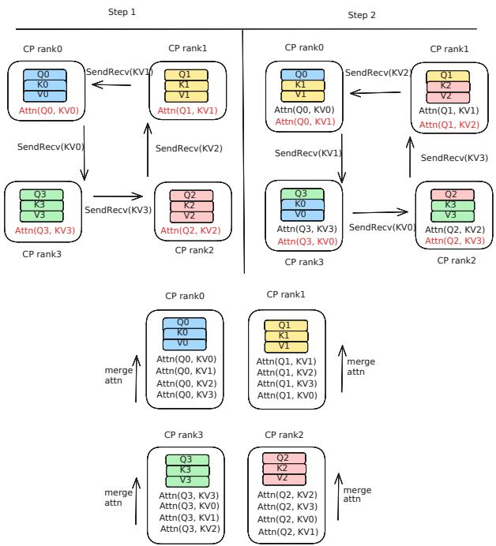
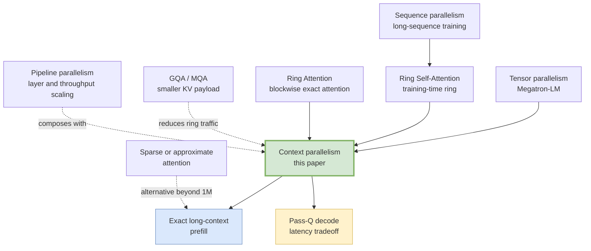
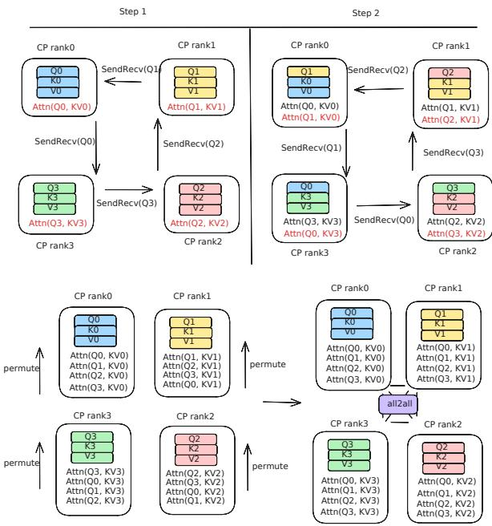
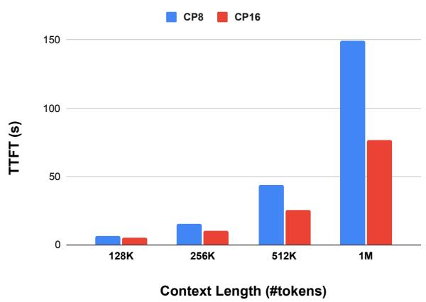

# Context Parallelism for Scalable Million-Token Inference

**Paper:** Context Parallelism for Scalable Million-Token Inference  
**Authors:** Amy (Jie) Yang, Jingyi Yang, Aya Ibrahim, Xinfeng Xie, Bangsheng Tang, Grigory Sizov, Jeremy Reizenstein, Jongsoo Park, Jianyu Huang  
**arXiv:** [2411.01783v3](https://arxiv.org/abs/2411.01783v3) (published November 4, 2024; revised April 21, 2025)

**Related pages:** [Sequence Parallelism](../../training/parallelism/sequence-parallelism/index.md), [DeepSeek-V2 MLA](../attention-variants/deepseek-v2-mla.md), [FlashAttention](../flashattention/flashattention.md), [vLLM-Ascend Architecture](../../frameworks/vllm-ascend/architecture.md)

## TL;DR

**What:** [Context parallelism](../../terms/context-parallelism.md) distributes a long input sequence and its KV state across ranks so more GPUs can reduce exact prefill latency.

**How:** It uses exact [ring attention](../../terms/ring-attention.md) with two directions of traffic: pass-KV keeps queries local and circulates keys/values, while pass-Q keeps keys/values local and circulates queries.

**The number:** On Llama3 405B, the system prefills 1M tokens in 77 seconds on 128 H100 GPUs, with 93% parallelization efficiency and 63% FLOPS utilization; 128K takes 3.8 seconds on the same 16-node configuration.

## The Big Picture

*Source: [Context Parallelism for Scalable Million-Token Inference](https://arxiv.org/abs/2411.01783v3), Figure 3. ① Each rank starts with a local query and KV chunk. ② KV chunks circulate around the ring while each rank computes partial attention. ③ The partial results are merged into exact attention over the full context.*

**The central move is to distribute the sequence dimension without changing the dense attention result.** The paper treats communication as part of the attention schedule and chooses which tensor to circulate based on new-token length, cached-token length, model head layout, and network bandwidth.

## Why This Exists

Consider a single request that asks Llama3 405B to prefill a 128K-token prompt. The paper reports roughly 60 seconds on one eight-GPU H100 host; extrapolating the same setup to 1M tokens reaches about 1,200 seconds. [Tensor parallelism](../../terms/tensor-parallelism.md) can split the model weights, but scaling it across hosts makes frequent all-reduces expensive. [Pipeline parallelism](../../terms/pipeline-parallelism.md) improves throughput through stages, but it does not remove the latency of processing one long prompt.

The memory problem grows alongside the latency problem. A [KV cache](../../terms/kv-cache.md) stores keys and values for every context token, so a single host eventually runs out of capacity even when the model weights fit. The paper asks a deliberately conservative question: **can more hosts share the exact dense attention work and KV storage while leaving the model architecture unchanged?**

## The Landscape

*This is a synthesis of the paper's lineage: [sequence parallelism](../../terms/sequence-parallelism.md) and ring-attention ideas supply the communication pattern, tensor and pipeline parallelism remain complementary scaling dimensions, and GQA makes KV traffic small enough for cross-node rings. The paper's exact CP path is a sibling of sparse attention, not a replacement for retrieval when exact quadratic work becomes too expensive.*

*Editable source: [landscape.mmd](assets/landscape.mmd).*

## The Core Idea

**Split the context, not the model's meaning.** Every rank owns a slice of the sequence and a slice of the [KV cache](../../terms/kv-cache.md), then sees the missing attention operands one chunk at a time through an exact ring. A numerically stable merge of partial softmax results reconstructs the same dense attention output that one device would compute, while the system uses more devices to shorten each local attention problem.

## Symbol Map

The paper uses $T$ for newly prefetched query tokens and $P$ for already cached tokens. Subscripts identify a rank; a superscript such as $Q_k^s$ means a query currently on rank $k$ that originated on rank $s$. The model uses separate query and KV head counts, which is why [GQA](../../terms/grouped-query-attention.md) affects the communication choice.

| Symbol | Human name | Shape / scope | Plain meaning |
|---|---|---|---|
| $N_H$ | query-head count | per layer | Number of attention heads producing queries. |
| $N_{KV}$ | KV-head count | per layer | Number of key/value heads stored and communicated. |
| $D_H$ | head dimension | per head | Width of one attention head. |
| $D$ | model dimension | $D_H N_H$ | Hidden width used in the paper's cost model. |
| $T$ | new-token length | per request | Tokens computed in the current full or partial prefill. |
| $P$ | cached-token length | per request | Existing KV tokens reused by a partial prefill or decode. |
| $N$ | CP rank count | group-wide | Number of context-parallel ranks, usually one GPU per node inside a TP group. |
| $Q,K,V$ | attention tensors | per layer | Query, key, and value embeddings that participate in exact attention. |
| $L^i$ | padded sequence length | per sequence and rank group | Maximum local KV length used to equalize fused variable-length messages. |
| $CP_N+TP8$ | parallel topology | deployment | TP8 shards the model within each host; CP over $N$ hosts shards the context across hosts. |
| $TTFT$ / $TTIT$ | latency metrics | serving | Time to first token for prefill and time to incremental token for decode. |

## Deep Dive

### Context parallelism adds a sequence dimension to model parallelism

**What it does:** It assigns different token ranges to different ranks while keeping each rank's model weights intact.

**Why it matters:** The long-context bottleneck is the sequence dimension, whereas tensor parallelism primarily addresses model-weight size and pipeline parallelism primarily addresses throughput.

**How it works:** The paper keeps TP8 inside every H100 host, then forms a CP group from one corresponding GPU per host for each KV head. In the full-prefill cost comparison, TP communicates activations from two linear layers while CP communicates KV tensors at the attention layer:

| Aspect | [Tensor parallelism](../../terms/tensor-parallelism.md) | Context parallelism | [Pipeline parallelism](../../terms/pipeline-parallelism.md) |
|---|---|---|---|
| Primary split | Weight and hidden/head dimensions | Sequence tokens and KV state | Layer depth |
| Main benefit | Fit and compute a large model | Lower long-context prefill latency and spread KV capacity | Increase throughput with staged work |
| Cross-rank pressure | Frequent [All-Reduce](../../terms/all-reduce.md) operations | Ring send/recv of Q or KV, plus merge traffic | Activation transfers and pipeline bubbles |
| Limitation here | Inter-host all-reduce scales poorly | Model weights are replicated across CP hosts | One long request still takes every stage in order |

For Llama3 405B, $N_H=128$ and $N_{KV}=8$. Communicating eight KV heads rather than 128 query heads makes the CP attention payload 16 times smaller than a query-shaped payload, before considering the different number of linear-layer collectives.

**The intuition:** TP splits the machine's arithmetic; CP splits the request's history.

**A concrete example:** With TP8 per host and CP4 across four hosts, each host still owns a complete TP-sharded model, but each CP rank owns only about one quarter of the context's tokens and KV entries.

**Remember:** CP is a complementary parallelism dimension, not a cheaper replacement for weight sharding.

### Load-balanced sharding makes causal work and memory land evenly

**What it does:** It distributes tokens so no CP rank receives the heavy end of the causal attention triangle or the entire stream of new decode KV entries.

**Why it matters:** A naive contiguous split gives later tokens more keys to attend to, so the rank holding the end of a sequence becomes the compute and memory bottleneck.

**How it works:** For $N$ ranks, each sequence is divided into $2N$ chunks, $C_0$ through $C_{2N-1}$. Rank $i$ receives the pair $(C_i, C_{2N-i-1})$, pairing an early chunk with a late chunk. Fused variable-length inputs are padded per sequence to a common local length $L^i$ for equal-sized ring messages, while new query tokens are balanced independently from cached KV tokens.

**The intuition:** Give every worker one cheap edge of the triangle and one expensive edge instead of assigning the entire expensive edge to one worker.

**A concrete example:** With CP2, four chunks are assigned as $(C_0,C_3)$ and $(C_1,C_2)$. During decode, the implementation also offsets the owner rank on each iteration so one rank does not accumulate every new token's KV entry.

**Remember:** The sharding rule balances both causal FLOPs and the KV-cache footprint; it is not just an even token count.

### Pass-KV keeps queries local and circulates keys and values

**What it does:** It computes each rank's query block against every rank's KV block through a ring.

**Why it matters:** Full prefill has many new queries, so attention work can be large enough to hide the ring's KV communication.

**How it works:** Rank $k$ starts with $Q_k$ and its local $KV_k$. On every hop it sends its current KV block, receives the previous rank's block, computes partial attention, and continues until all $N$ KV blocks have been visited. Unlike an [All-Gather](../../terms/all-gather.md), the ring keeps only one moving block in flight. Each partial result also keeps a log-sum-exp value. The exact merge is:

$$
O_k = \frac{\sum_{s=0}^{N-1} O_k^s \exp(\operatorname{LSE}_k^s - \operatorname{LSE}_k^{\max})}{\sum_{s=0}^{N-1} \exp(\operatorname{LSE}_k^s - \operatorname{LSE}_k^{\max})}.
$$

*Source: [Context Parallelism for Scalable Million-Token Inference](https://arxiv.org/abs/2411.01783v3), Figure 3. ① KV moves to the next rank. ② Each rank computes its local query against the received block. ③ The local rank merges all partial softmax results.*

**The intuition:** Keep the questions still and walk every memory bank past them.

**A concrete example:** In the 128K full-prefill case, each CP rank holds its local query chunk while the other ranks' KV chunks arrive one by one; the attention kernel can overlap SendRecv with the next partial computation when the chunk is large enough.

**Remember:** Pass-KV is lossless because it merges exact partial softmax statistics, not approximate attention scores.

### Pass-Q keeps KV stationary for cache-heavy turns

**What it does:** It circulates query blocks through ranks that already hold their local cached KV blocks.

**Why it matters:** In a multi-turn conversation, $P$ can be much larger than $T$. Moving the entire persistent KV history would waste bandwidth when only a small prompt suffix is new.

**How it works:** Each rank keeps $KV_k$ stationary, sends $Q_k^s$ and its batch id around the ring, and computes partial attention wherever the query arrives. The partial outputs are then permuted and restored with an [All-to-All](../../terms/all-to-all.md) exchange before the exact merge. The extra exchange is on the critical path, so a smaller ring payload does not automatically mean lower latency.

*Source: [Context Parallelism for Scalable Million-Token Inference](https://arxiv.org/abs/2411.01783v3), Figure 4. ① Queries circulate while each rank keeps KV. ② Each rank computes partial outputs for queries from other ranks. ③ An All-to-All exchange returns partial outputs to their source ranks before merging.*

**The intuition:** Move the small number of new questions to the stored history instead of moving the history to every question.

**A concrete example:** At a 2.5% cache miss rate for a 128K context, the paper measures pass-Q at 1,046.43 ms versus pass-KV at 1,110.18 ms on CP4, despite pass-Q's exposed All-to-All.

**Remember:** Pass-Q trades cheap ring traffic for a mandatory output redistribution.

### A runtime heuristic chooses the ring direction

**What it does:** It chooses pass-KV or pass-Q from the new-token length, cache miss rate, model head ratio, compute peak, and network bandwidth.

**Why it matters:** A fixed ring direction cannot be optimal for both full prefill and one-token decode.

**How it works:** For a GQA model, the relevant tensor shapes are:

$$
\operatorname{shape}(Q)=[T,N_H,D_H],\qquad
\operatorname{shape}(K)=\operatorname{shape}(V)=[T+P,N_{KV},D_H].
$$

The basic message-size crossover is:

$$
\frac{T}{T+P} \le 2\frac{N_{KV}}{N_H}.
$$

Below this ratio, Q is smaller than the paired KV payload, so pass-Q is attractive. At larger ratios, enough new-token attention work is available to overlap pass-KV communication. The paper also derives a compute/bandwidth threshold and an appendix correction for pass-Q's All-to-All, then fits an empirical heuristic for practical switching.

**The intuition:** Choose the operand that is cheaper to move, unless the other direction has enough computation to hide its movement.

**A concrete example:** For Llama3's $N_{KV}/N_H=8/128$, the basic crossover is 12.5% cache miss rate. The measured tipping point is near 5% on the tested CP4 system because overlap and All-to-All costs shift the ideal threshold.

**Remember:** The 5% result is a hardware-and-workload measurement, not a universal constant.

### Pass-Q decode protects capacity but can hurt TTIT

**What it does:** It batches one-token queries, rotates their rank assignment between decode iterations, and uses pass-Q to avoid moving the long KV history.

**Why it matters:** Decode has too little arithmetic to hide communication, and a fixed rank assignment would fill one rank's KV memory before the others.

**How it works:** Each query travels through all CP ranks with its batch id, each rank computes against its resident KV entry for that request, and partial outputs return through permutation plus All-to-All. The current implementation pads query batches to be divisible by the CP group size, so more CP ranks can mean more processed query slots and more communication.

**The intuition:** CP can make the long prompt cheaper while making the one-token tail more expensive.

**A concrete example:** At 128K and batch size 1, the paper reports TTFT falling from 42,010 ms with TP8 to 10,950 ms with CP4+TP8, while TTIT rises from 46.26 ms to 71.31 ms.

**Remember:** The strongest deployment shape is usually prefill-heavy CP combined with a separately optimized decode pool.

## Putting It Together

1. **Place the model:** Use TP8 inside each H100 host and form CP groups across hosts, one matching GPU per KV head group.
2. **Shard the request:** Split each sequence into $2N$ chunks, pair early and late chunks per rank, and pad fused variable-length KV blocks to equal message sizes.
3. **Materialize state:** Project new tokens into $Q$, $K$, and $V$; retain new and past keys/values in the distributed KV cache.
4. **Choose traffic:** Use pass-KV when the new-token work and KV head ratio make KV movement overlap well; use pass-Q when the persistent cache makes Q the smaller payload.
5. **Run exact attention:** Circulate the selected operand for $N-1$ hops, compute partial attention, and merge with log-sum-exp statistics.
6. **Return the output:** Pass-KV merges locally; pass-Q adds permutation and All-to-All to restore each query's partial outputs.
7. **Decode continuously:** Rotate one-token query ownership across ranks to balance cache growth, accepting that TTIT may rise as the CP group grows.

## What This Buys You

### The headline claim

**Context parallelism makes exact long-context prefill scale nearly linearly across hosts when attention work can hide ring communication.** It also spreads KV-cache capacity, allowing the same dense model to process a million-token prompt without changing the model architecture.

### How we know: latency and scale

| Configuration | Context | TTFT | TTIT |
|---|---:|---:|---:|
| TP8 | 128K | 42,010 ms | 46.26 ms |
| CP2 + TP8 | 128K | 21,042 ms | 60.23 ms |
| CP4 + TP8 | 128K | 10,950 ms | 71.31 ms |

The same study reaches **3.8 seconds for 128K** and **77 seconds for 1M** on CP16 with 128 H100 GPUs. At 1M tokens, the paper calculates 502 TFLOPS per H100 against a 540 TFLOPS standalone FlashAttention 3 reference, yielding 93% parallelization efficiency and approximately 63% FLOPS utilization on its power-limited H100 configuration.

*Source: [Context Parallelism for Scalable Million-Token Inference](https://arxiv.org/abs/2411.01783v3), Figure 8. CP16 lowers time to first token relative to CP8 at every measured context length, while the superlinear latency growth beyond 512K reflects the increasing dominance of quadratic attention work.*

### The mechanism behind the numbers

The prefill gain comes from three effects working together: each rank sees a shorter local query block, GQA keeps KV messages small, and SendRecv can overlap the attention kernel. The capacity gain comes from distributing the KV cache across CP ranks. The pass-KV/pass-Q switch adds a fourth effect for multi-turn serving by adapting traffic to cache reuse.

The tradeoff is visible in the table: doubling CP from 1 to 4 roughly quarters 128K TTFT in the reported setup, but TTIT increases because decode has less computation to hide SendRecv and All-to-All, and query padding grows with the rank count.

### How to read these numbers

**These are prefill and attention-system measurements, not an end-to-end quality benchmark.** The attention is exact, but the 1M result still has quadratic dense-attention work; adding GPUs reduces wall-clock time by distributing that work rather than changing its asymptotic complexity. The comparison also uses batch size 1 and a specific H100 network topology, so the crossover changes with bandwidth, model head ratio, batch shape, and cache-hit rate.

## Where It Breaks

| Failure mode | When it happens | Impact |
|---|---|---|
| Decode communication dominates | Small decode batches or many CP hosts leave too little compute per ring hop | TTIT rises even while local attention kernels get faster. |
| Query padding wastes work | Batch size or query count is not divisible by the CP group size | More query slots are processed, reducing the benefit of extra ranks. |
| Pass-Q's All-to-All is exposed | Cache hit rate is high but the final partial-output exchange cannot overlap | The smaller Q message does not translate into lower TTFT. |
| CP replicates model weights | Model weights do not fit in one host's TP-sharded memory | CP cannot replace TP for model-capacity scaling. |
| Inter-host bandwidth is too low | Context chunks are too short to hide SendRecv | Ring traffic becomes the critical path; scaling flattens. |
| Exact attention reaches a new regime | Contexts grow well beyond 1M or the batch is large | Quadratic attention FLOPs dominate, so sparse retrieval or approximate attention may be needed. |
| Workloads are irregular | Variable-length sequences or uneven cache histories are poorly padded/sharded | One rank becomes the straggler or memory bottleneck. |

## One Thing to Remember

**Context parallelism is exact attention made wider, not cheaper.** It turns a long request into a distributed sequence of local attention problems, then uses ring communication and stable softmax merging to recover the original result. The practical win is largest for prefill when computation hides communication; for decode, the same distribution can expose communication and padding costs.

## Go Deeper

- **Read:** [Context Parallelism for Scalable Million-Token Inference](https://arxiv.org/abs/2411.01783v3)
- **Build on:** [Ring Attention with Blockwise Transformers](https://arxiv.org/abs/2310.01889), [Sequence Parallelism](../../training/parallelism/sequence-parallelism/index.md), and [FlashAttention](../flashattention/flashattention.md)
- **Understand the context:** [DeepSeek-V2 Multi-Head Latent Attention](../attention-variants/deepseek-v2-mla.md), [GQA in Llama 2](../attention-variants/grouped-query-attention/index.md), and [vLLM-Ascend Architecture](../../frameworks/vllm-ascend/architecture.md)
- **Reproduce:** No implementation repository is linked in the paper; the reported setup uses Llama3 405B, [FP8](../../terms/fp8.md) weights, FlashAttention 3 for prefill, and H100 Grand Teton hosts.
