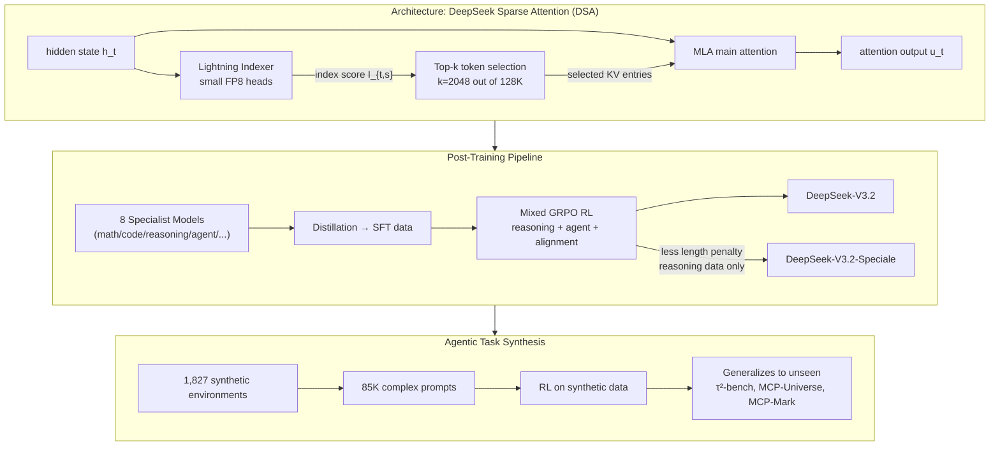
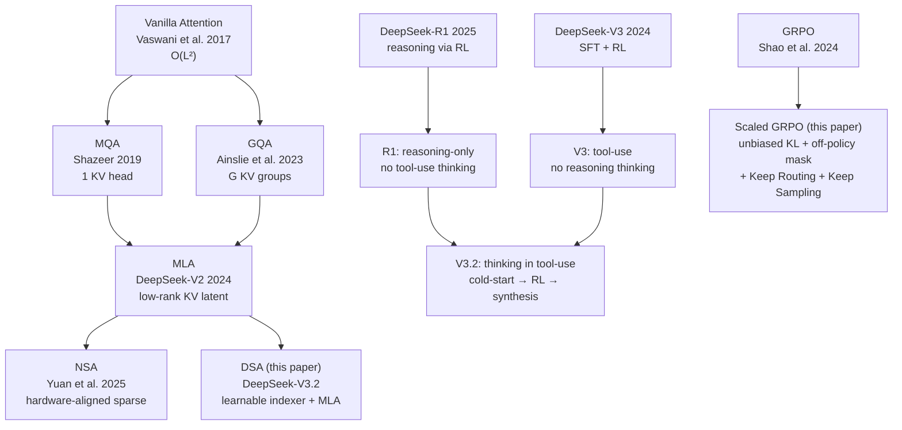
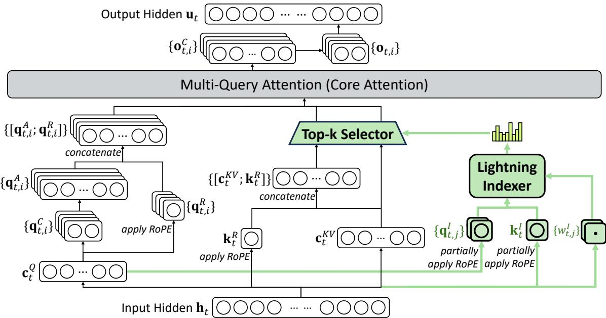
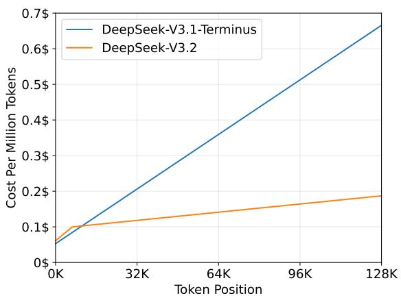
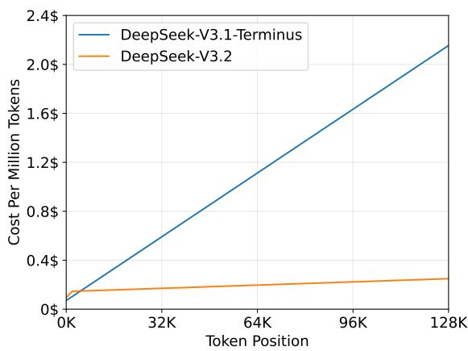
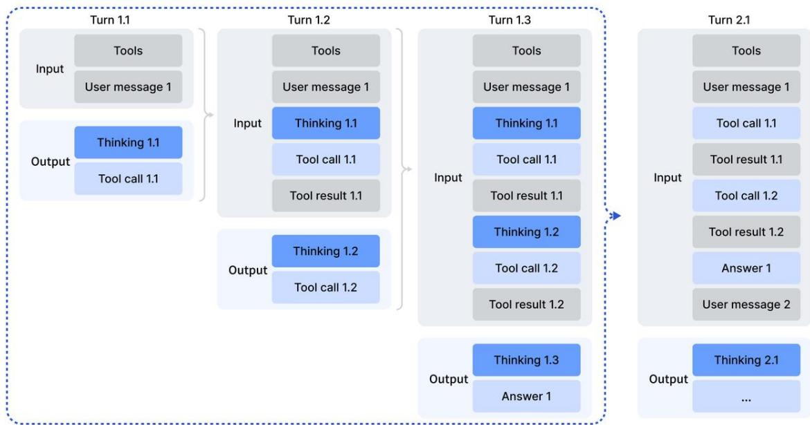
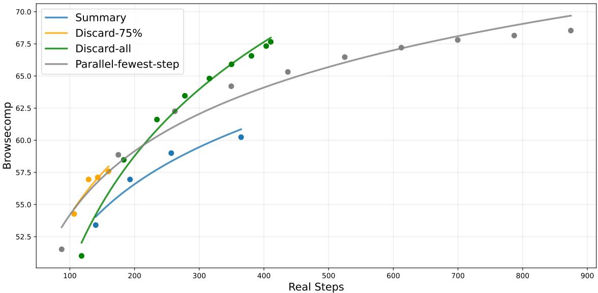
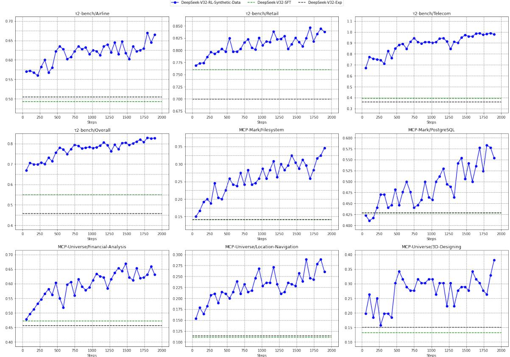
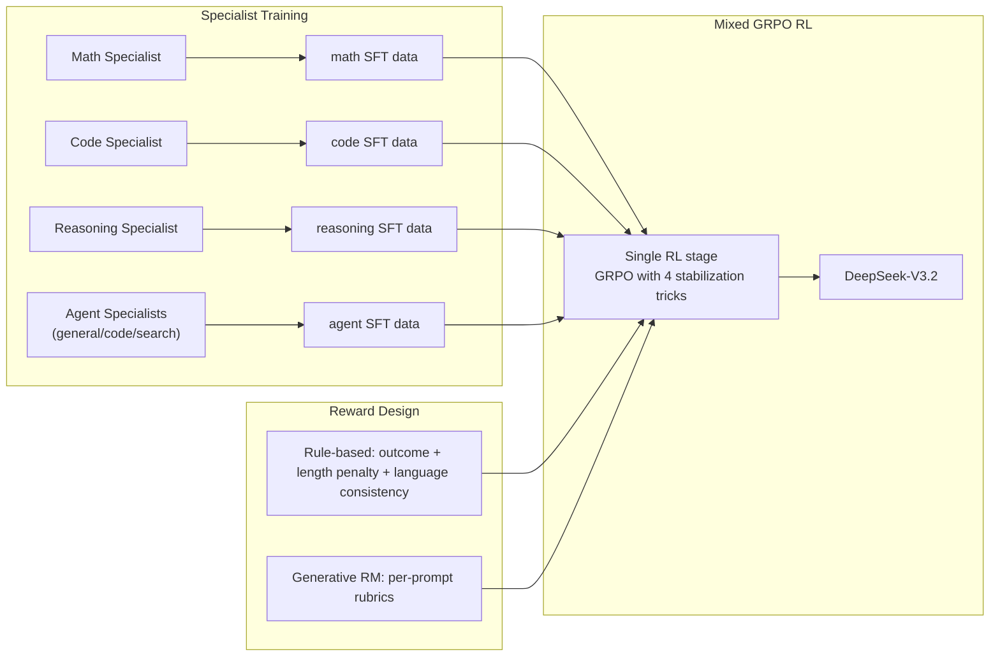
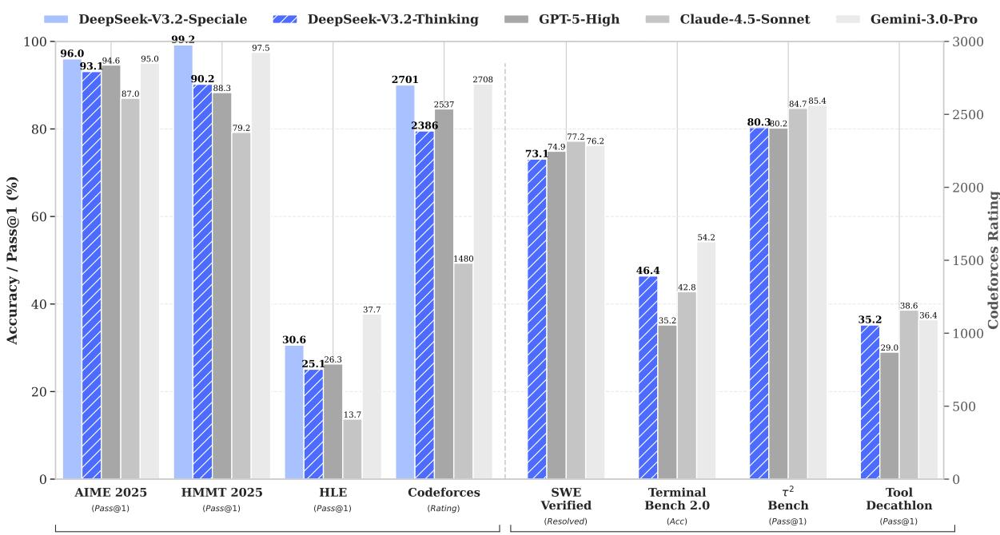

# DeepSeek-V3.2: Sparse Attention, Scaled RL, and Thinking in Tool-Use

**Paper:** DeepSeek-V3.2: Pushing the Frontier of Open Large Language Models  
**Authors:** DeepSeek-AI  
**arXiv:** 2026 (<research@deepseek.com>)  

**Related pages:** [DeepSeek-V2 Multi-Head Latent Attention](../deepseek-v2-mla.md) · [Grouped-Query Attention in Llama 2](../grouped-query-attention/index.md) · [Multi-Query Attention](../multi-query-attention.md) · [The Transformer](../transformer.md)

## TL;DR

**What:** DeepSeek-V3.2 is a sparse-attention MoE model that matches GPT-5 on reasoning benchmarks while introducing thinking-in-tool-use for agentic scenarios; its high-compute variant DeepSeek-V3.2-Speciale achieves gold-medal performance at IMO, IOI, ICPC World Finals, and CMO 2025.

**How:** Three innovations: (1) DeepSeek Sparse Attention (DSA), a learnable lightning indexer that selects top-k KV entries per query, reducing attention from $O(L^2)$ to $O(Lk)$; (2) a scaled GRPO recipe with unbiased KL estimation, off-policy sequence masking, and Keep Routing/Keep Sampling Mask for stable MoE RL; (3) a cold-start + synthesized agentic task pipeline (1,827 environments, 85K prompts) that teaches reasoning during tool calls.

**The number:** DeepSeek-V3.2 achieves **25.1% on HLE** (text-only), **93.1% on AIME 2025**, **73.1% on SWE-bench Verified**, and **67.6% on BrowseComp** (with context management), all at substantially lower token cost than Kimi-K2 Thinking.

## The Big Picture

*① A lightning indexer with small FP8 heads computes $I_{t,s}$ scores to select top-k KV entries per query. ② MLA main attention only attends to selected entries, reducing core complexity to $O(Lk)$. ③ Eight domain specialists are distilled into SFT data, then merged into one mixed GRPO stage. ④ Synthetic agentic tasks are auto-generated (environment + tools + verifier) and used for RL, producing out-of-domain generalization.*

## Why This Exists

Imagine you are serving a 128K-context reasoning model. Every token generated must attend to 128K past tokens. With MLA's per-token KV-cache compression, the cache is already smaller than MHA, but the *attention computation* over all 128K tokens still costs $O(L^2)$. When you have thousands of concurrent users running long reasoning chains, this quadratic cost is the bottleneck — not the cache size, not the model weights, but the raw attention FLOPs.

Now imagine you want your reasoning model to also use tools (web search, code execution, bash). You try a naive approach: wrap the reasoning in `<think>` tags and interleave tool calls. But you discover that discarding reasoning context after each tool call (as DeepSeek-R1 did for multi-turn) forces the model to re-reason from scratch on every subsequent call — wasting tokens and degrading performance on multi-step agentic tasks.

Finally, imagine you need to train this combined reasoning+agent model with RL. You try standard GRPO at scale, but MoE routing mismatches between inference and training frameworks cause training instability. Off-policy mini-batch updates accumulate noise. These are the three problems DeepSeek-V3.2 solves.

## The Landscape

*DSA sits in the sparse-attention lineage alongside NSA but targets continued training from MLA checkpoints. The post-training innovation fuses two previously separate capabilities — chain-of-thought reasoning and tool-use — into a single model via cold-start prompting and synthetic environment RL.*

## The Core Idea

Instead of computing attention over all 128K tokens, DSA trains a tiny "lightning indexer" to predict which tokens each query will attend to, then runs the expensive MLA computation only on the top 2,048 selected tokens. The indexer is so small (few heads, FP8) that its own $O(L^2)$ cost is negligible. For post-training, the model learns to interleave reasoning and tool calls by retaining thinking context across tool interactions (discarding only on new user messages), and training stability during MoE RL is achieved through four concrete tricks: unbiased KL estimation, off-policy sequence masking, preserving inference-time expert routing, and preserving sampling truncation masks.

## Symbol Map

DSA notation. The indexer uses its own small attention heads (superscript $I$), separate from the main model.

| Symbol | Human name | Shape / scope | Plain meaning |
|---|---|---|---|
| $I_{t,s}$ | index score | per query-per past token | How much query $t$ wants to attend to past token $s$ |
| $H^I$ | indexer head count | scalar | Number of attention heads in the lightning indexer (small) |
| $d^I$ | indexer head dim | scalar | Dimension per indexer head (small, FP8-friendly) |
| $\mathbf{q}_{t,j}^I$ | indexer query | per-head | Query projection for indexer head $j$ at position $t$ |
| $\mathbf{k}_s^I$ | indexer key | per-token | Shared key projection for past token $s$ (not per-head) |
| $w_{t,j}^I$ | indexer head weight | scalar per-head | Learned weight combining indexer head $j$ output |
| $\mathbf{c}_s$ | KV latent entry | per-token | MLA's cached latent vector, used as key-value entry |
| $k$ | selection budget | scalar | Number of KV entries selected per query (2048 in V3.2) |

## Deep Dive

### DeepSeek Sparse Attention (DSA)

**What it does:** DSA replaces dense $O(L^2)$ attention with a two-stage process: a cheap indexer scores all past tokens, then only the top-$k$ are fed to the expensive MLA attention.

**Why it matters:** At 128K context, dense attention dominates inference cost. DSA reduces the core attention complexity from proportional to $L^2$ to proportional to $L \cdot k$, where $k = 2048 \ll 128\text{K}$. The indexer's own $O(L^2)$ cost is minimized through small dimensions and FP8 execution.

**How it works:**

| Step | What happens | Computational cost |
|---|---|---|
| 1. Indexer scoring | For query $\mathbf{h}_t$, compute $I_{t,s} = \sum_j w_{t,j}^I \cdot \text{ReLU}(\mathbf{q}_{t,j}^I \cdot \mathbf{k}_s^I)$ for all $s < t$ | $O(L \cdot H^I \cdot d^I)$ — cheap |
| 2. Top-k selection | Select $\{\mathbf{c}_s \mid I_{t,s} \in \text{Top-k}(I_{t,:})\}$ | $O(L \log k)$ — sorting |
| 3. Sparse attention | $\mathbf{u}_t = \text{Attn}(\mathbf{h}_t, \{\text{selected } \mathbf{c}_s\})$ | $O(k \cdot d)$ per query |

**How the indexer projections work.** The paper states that $\mathbf{q}_{t,j}^I$, $w_{t,j}^I$, and $\mathbf{k}_s^I$ are "derived from" their respective hidden states and defers exact formulas to the open-source implementation. Based on the architecture and standard attention patterns, these are learned linear projections — small weight matrices that map $\mathbf{h}_t$ and $\mathbf{h}_s$ into the indexer's low-dimensional space:

| Component | Likely form | Key property |
|---|---|---|
| $\mathbf{q}_{t,j}^I$ | $\mathbf{W}_{q,j}^I \, \mathbf{h}_t$ | **Per-head** — each indexer head $j$ has its own projection matrix, producing diverse "perspectives" |
| $\mathbf{k}_s^I$ | $\mathbf{W}_k^I \, \mathbf{h}_s$ | **Shared** — a single projection used by all $H^I$ indexer heads, unlike standard attention where keys are also per-head |
| $w_{t,j}^I$ | $\mathbf{w}_j^I \cdot \mathbf{h}_t$ (or a learned scalar) | **Per-head gate** — combines the per-head ReLU dot products into a single $I_{t,s}$ |

This design has two critical differences from standard multi-head attention: (1) the key is **not** per-head — it's shared to keep the indexer cheap; (2) the head outputs are fused via learned scalar weights $w_{t,j}^I$ rather than concatenation. The indexer input is also **detached** from the main model's computational graph during sparse training, so the indexer optimizes solely from $\mathcal{L}^I$ while the main model optimizes from the LM loss — they evolve independently.

**Training DSA.** Continued pre-training from DeepSeek-V3.1-Terminus happens in two stages:

1. **Dense warm-up (1,000 steps, 2.1B tokens):** Freeze all model weights except the indexer. Train indexer to match the main attention distribution via KL-divergence: $\mathcal{L}^I = \sum_t D_{KL}(p_{t,:} \| \text{Softmax}(I_{t,:}))$, where $p_{t,:}$ is the L1-normalized sum of main attention scores across heads.

2. **Sparse training (15,000 steps, 943.7B tokens):** Unfreeze all parameters. Apply top-k selection ($k = 2048$). KL loss is computed only over selected tokens. The indexer gradient is detached from the main model — each optimizes independently (indexer from $\mathcal{L}^I$, main model from LM loss).

**The intuition:** The lightning indexer is a "cheap preview" — it quickly scans the entire context with 99% less compute per token-pair than the main attention, and only the promising candidates get the full treatment.

**A concrete example:** At position 100,000 in a 128K sequence, the main MLA attention would compute 100,000 attention scores. DSA's indexer also computes 100,000 scores — but each indexer score costs a tiny fraction of an MLA attention score (few heads × small dim × FP8 vs. many heads × large dim). Then only 2,048 of those get the expensive MLA computation. The net result: ~2% of the original attention FLOPs.

**Remember:** DSA is instantiated under MLA's MQA mode — each selected KV latent is shared across all query heads of a token, enabling efficient kernel implementation.

*The DSA architecture instantiated under MLA. The green portion shows how the lightning indexer selects top-k KV entries (latent vectors) for each query token. Only selected entries participate in the expensive MLA attention computation.*

### DSA Instantiation Under MLA

**What it does:** DSA is built on MLA's MQA mode, where one latent vector serves as the key-value entry for all query heads of a token — analogous to how MQA shares one KV head.

**Why it matters:** At the kernel level, each KV entry must be shared across multiple queries for computational efficiency. MLA already supports an MQA mode used during decoding in DeepSeek-V3.1-Terminus; DSA uses this mode for both training and inference.

**How it works:** In MLA's MHA mode (used for training/prefilling in V3.1), each query head has its own KV projection. In MQA mode (used for decoding), all query heads share one KV latent per token. DSA operates in MQA mode, selecting top-$k$ latent vectors and feeding them as shared KV entries to all query heads. The open-source release specifies the exact kernel details.

**The intuition:** Think of MLA's MQA mode as "one set of notes per token" rather than "one set of notes per head." DSA picks which tokens' notes to read — and all heads read the same selection.

**Remember:** DSA's MQA-mode instantiation means the selection is at the token level (not the head level), which is simpler to implement and more cache-friendly.

**Inference cost savings.** DSA reduces the core attention complexity from $O(L^2)$ to $O(Lk)$. The lightning indexer still runs at $O(L^2)$ but with far fewer FLOPs. On H800 GPUs:

*Per-token prefill cost vs. token position. DSA (V3.2) shows near-constant cost as sequence length grows, while dense MLA (V3.1-Terminus) grows quadratically.*

*Per-token decode cost vs. token position. DSA maintains flat cost at long contexts while dense attention cost climbs.*

### Scaling GRPO: Four Stabilization Tricks

**What it does:** Four concrete techniques stabilize large-scale GRPO training of MoE models with off-policy mini-batch updates.

**Why it matters:** Without these tricks, MoE RL training at scale suffers from routing inconsistencies between inference and training frameworks, noisy gradient updates from stale off-policy samples, and sampling-space mismatches from top-p/top-k truncation.

**How it works:**

| Technique | Problem it solves | How |
|---|---|---|
| **Unbiased KL Estimate** | K3 estimator produces biased gradients when $\pi_\theta \ll \pi_{ref}$ | Correct with importance-sampling ratio: $D_{KL} = \frac{\pi_\theta}{\pi_{old}}(\frac{\pi_{ref}}{\pi_\theta} - \log\frac{\pi_{ref}}{\pi_\theta} - 1)$ |
| **Off-Policy Sequence Masking** | Stale negative samples from old policy destabilize optimization | Mask sequences where $\frac{1}{\vert o_i\vert}\sum_t \log\frac{\pi_{old}}{\pi_\theta} > \delta$ AND advantage is negative |
| **Keep Routing** | Inference/training framework discrepancy causes different expert routing for same input | Preserve expert routing paths from inference and enforce them during training |
| **Keep Sampling Mask** | Top-p/top-k truncation creates mismatched action spaces between $\pi_{old}$ and $\pi_\theta$ | Preserve truncation masks from sampling and apply to $\pi_\theta$ during loss computation |

**The intuition:** RL training of MoE models is like updating a moving target — the model changes, the routing changes, and the data distribution changes. Each trick locks down one source of variance: unbiased KL locks the gradient, off-policy masking locks the data quality, Keep Routing locks the expert assignment, and Keep Sampling Mask locks the token space.

**A concrete example:** Suppose during inference, Expert 3 was activated for token $t$. During the subsequent training step with a slightly updated model, Expert 7 would now be activated instead. The gradient flows into Expert 7 — which never saw this token during inference. This "routing drift" accumulates and destabilizes training. Keep Routing prevents this by recording and replaying the original expert assignment.

**Remember:** Keep Routing has been used in DeepSeek's RL pipeline since DeepSeek-V3-0324 and was found *crucial* for MoE RL stability.

### Thinking in Tool-Use: Context Management

**What it does:** A context management policy retains reasoning traces across tool-call turns and discards them only when a new user message arrives — unlike R1's approach of discarding reasoning at every turn.

**Why it matters:** Without this, the model redundantly re-reasons through the entire problem for each subsequent tool call, wasting tokens and degrading multi-step agent performance.

**How it works:**

| Event | R1 behavior (discard reasoning) | V3.2 behavior (retain reasoning) |
|---|---|---|
| User message arrives | Discard old reasoning | Discard old reasoning |
| Tool output arrives | Discard old reasoning | **Retain** reasoning — add tool output to context |
| Another tool output | Discard old reasoning | **Retain** reasoning — continue building context |
| Tool call history | Lost with reasoning | **Preserved** even when reasoning is discarded |

*Illustration of V3.2's context management in tool-calling scenarios. Reasoning content (brown) is retained across tool-call turns and discarded only when a new user message arrives. Tool call history (blue) is preserved even when reasoning is removed.*

**The intuition:** A user message signals a genuinely new topic — reset reasoning. A tool output is a continuation of the *same* problem — keep reasoning so the model doesn't start from scratch.

**⚠️ Compatibility note:** Agent frameworks that simulate tool interactions via *user* messages (e.g., Roo Code, Terminus) will trigger reasoning-discard on every tool call. DeepSeek recommends non-thinking mode for these frameworks.

**Remember:** This context management also enables the **Discard-all** strategy for search-agents exceeding 128K context — discarding all tool-call history (but not the thinking) works surprisingly well, achieving 67.6% on BrowseComp versus 51.4% without it.

*BrowseComp accuracy under different test-time compute expansion strategies. Discard-all achieves the best accuracy-efficiency tradeoff, matching parallel scaling (Parallel-fewest-step) with significantly fewer total steps.*

### Thinking in Tool-Use: Cold-Start

**What it does:** A prompting-based cold-start that instructs the model to interleave `<think>` reasoning and tool calls within the same trajectory, producing initial training data for subsequent RL.

**Why it matters:** Reasoning data (non-agentic) and agentic data (non-reasoning) exist separately. Cold-start bridges them without requiring new human annotations.

**How it works:** Three system prompts define three behaviors:

1. **Reasoning prompt:** "Please first reason before giving the final answer. The reasoning process enclosed within `<think> </think>`." → produces pure reasoning trajectories.
2. **Agent prompt:** Standard tool-calling system prompt with tool descriptions and format guidance. → produces pure tool-use trajectories.
3. **Reasoning-in-agent prompt:** "You may use the Python tool **multiple times** during your reasoning... Call the Python tool early in your reasoning to aid in solving the task." → produces interleaved reasoning + tool-call trajectories.

The model, already capable of following explicit instructions, occasionally produces the desired interleaved pattern. These successful trajectories seed the RL process.

**The intuition:** You don't need to teach the model *how* to think during tool-use — you just need to *ask* it to, and the model's existing instruction-following ability handles the rest. RL then amplifies what works.

**Remember:** Cold-start trajectories may lack robustness, but they provide the basis for RL — which is where the real generalization happens.

### Large-Scale Agentic Task Synthesis

**What it does:** An automated pipeline generates 1,827 task-oriented environments with custom tools, hard-but-verifiable tasks, and Python verifier functions — plus 85K+ prompts spanning code agent, search agent, code interpreter, and general agent domains.

**Why it matters:** Diverse RL tasks prevent overfitting to narrow prompt distributions. Synthetic environments can be designed to be "hard to solve, easy to verify" — ideal for RL reward design.

**How it works:** The synthesis workflow for general agent tasks:

| Step | What happens |
|---|---|
| 1. Environment setup | Agent uses bash + search tools in a sandbox to gather/generate data and store it in a sandbox database |
| 2. Tool synthesis | Agent writes task-specific Python functions as the tool API |
| 3. Task + solution + verifier | Agent proposes a simple task → writes solution (tool-only, no DB access) → writes verifier → iteratively increases difficulty until toolset is saturated |
| 4. RL filtering | Run RL with DeepSeek-V3.2; retain only environments with non-zero pass@100 |

For code agents: mine millions of GitHub issue-PR pairs → filter with heuristics + LLM → auto-build executable environments with dependency resolution → validate via JUnit F2P/P2F test counts. Tens of thousands of reproducible environments across Python, Java, JavaScript, TypeScript, C, C++, Go, and PHP.

For search agents: multi-agent pipeline samples long-tail entities → question-construction agent explores with search → multiple answer agents produce diverse candidates → verification agent validates → hybrid reward model scores.

**The intuition:** The synthesis pipeline is a "factory for RL problems." Each environment is self-contained (tools + data + verifier), so the model can practice thousands of distinct scenarios without human labeling.

**A concrete example — Trip Planning:** The synthesized environment provides 14 tool functions (get_all_cities, get_all_hotels_by_city, get_weather_by_city_date, etc.) and a task: "Plan a 3-day trip from Hangzhou with budget-dependent hotel/restaurant/attraction constraints across 3 different cities." The solution must satisfy all constraints (no repeats, city-location matching, budget-tier rules) — hard to find, but the Python verifier checks all constraints in milliseconds.

**Remember:** RL on synthetic general-agent data alone (no code/search RL) produces substantial gains on τ²-bench, MCP-Mark, and MCP-Universe — proving these synthetic tasks teach transferable agentic reasoning.

*RL training of DeepSeek-V3.2-SFT using exclusively synthetic general agent data. Performance on τ²-bench, MCP-Mark, and MCP-Universe improves steadily with RL steps, demonstrating that synthetic tasks teach transferable agentic reasoning.*

## The Landscape: Post-Training

*Specialist distillation + mixed RL avoids catastrophic forgetting across domains. Rule-based rewards handle verifiable tasks (math, code); generative reward models handle subjective tasks (general QA, writing).*

## What This Buys You

### The headline claim

DeepSeek-V3.2 achieves GPT-5-level reasoning performance at substantially lower inference cost (fewer output tokens), while being the first open model to demonstrate strong thinking-in-tool-use capability.

*Benchmark overview of DeepSeek-V3.2 and its counterparts across reasoning and agentic capabilities. For HMMT 2025, the February competition is reported, consistent with baselines. For HLE, the text-only subset is reported.*

### How we know: reasoning benchmarks

| Benchmark | GPT-5 High | Gemini-3.0 Pro | Kimi-K2 Think | **V3.2 Think** | **V3.2 Speciale** |
|---|---|---|---|---|---|
| AIME 2025 | 94.6 (13k) | 95.0 (15k) | 94.5 (24k) | 93.1 (16k) | **96.0** (23k) |
| HMMT Feb 2025 | 88.3 (16k) | **97.5** (16k) | 89.4 (31k) | 92.5 (19k) | 99.2 (27k) |
| LiveCodeBench | 84.5 (13k) | **90.7** (13k) | 82.6 (29k) | 83.3 (16k) | 88.7 (27k) |
| HLE (text-only) | 26.3 (15k) | **37.7** (15k) | 23.9 (24k) | 25.1 (21k) | 30.6 (35k) |

*Parentheses show average output tokens in thousands. V3.2 matches or beats K2-Thinking with 25-40% fewer output tokens.*

### How we know: agentic benchmarks

| Benchmark | Claude-4.5 | GPT-5 High | **V3.2 Think** |
|---|---|---|---|
| SWE-bench Verified | 77.2 | 74.9 | 73.1 |
| SWE Multilingual | 68.0 | 55.3 | **70.2** |
| Terminal Bench 2.0 | 42.8 | 35.2 | **46.4** |
| τ²-bench (avg) | — | — | 80.3 |
| BrowseComp | 24.1 | 54.9 | **67.6**\* |
| MCP-Universe | — | — | 45.9 |

*\*With context management (Discard-all). Without: 51.4.*

### The mechanism behind the numbers

V3.2's reasoning performance comes from scaled RL compute: the post-training budget already exceeds 10% of pre-training cost, and the authors hypothesize further gains with more. The agent performance comes from synthetic data generalization: RL on 1,827 synthetic environments transfers to unseen benchmarks (MCP-Universe, MCP-Mark, τ²-bench), while RL restricted to only code+search environments does *not* improve on these same benchmarks.

### ⚠️ How to read these numbers

1. **V3.2 vs. Speciale is a length tradeoff.** Speciale removes the length penalty and trains only on reasoning — yielding +2-3 points but at 50-80% more output tokens. This is not "better training"; it's the same model with relaxed constraints.
2. **BrowseComp 67.6% uses Discard-all context management.** Without it, the score is 51.4%. The 16-point gap is a *deployment* choice, not a *model* capability difference.
3. **Terminal Bench 2.0 uses Claude Code framework** (not Terminus), because V3.2's thinking-mode context management is incompatible with Terminus's user-message simulation. Non-thinking mode with Terminus scores 39.3.

## Where It Breaks

| Failure mode | When it happens | Impact |
|---|---|---|
| DSA indexer misses critical tokens | When a key token ranks just below top-2048 — the indexer is trained via KL to the main attention distribution, so it can drop low-attention tokens that turn out to be important | Slight quality degradation on long-context tasks vs. dense attention (paper reports parity, but edge cases may exist) |
| Thinking-mode incompatible with user-message-based agent frameworks | Frameworks like Roo Code or Terminus simulate tool interactions as user messages — which triggers reasoning discard per V3.2's context management | Forced to use non-thinking mode, losing 5-9 points on agent benchmarks |
| Redundant self-verification in tool-use | V3.2 frequently engages in excessive self-verification, generating long trajectories that exceed 128K context | ~20% of BrowseComp cases exceed 128K; MCP-Mark GitHub/Playwright tasks truncated — hurts final scores |
| Token efficiency vs. Gemini-3.0-Pro | V3.2 uses more output tokens than Gemini-3.0-Pro to achieve similar quality on most benchmarks | Higher deployment cost for equivalent output quality |
| World knowledge lags proprietary models | Fewer total training FLOPs than Gemini/OpenAI | Performance capped on knowledge-intensive tasks (e.g., HLE 25.1 vs. Gemini 37.7) |
| Synthetic agentic tasks may not cover all real-world patterns | Environments are auto-generated from a finite set of categories; RL filtering (pass@100 > 0) may miss hard-but-important tasks | Unexplored agentic domains may not benefit from synthetic RL |

## One Thing to Remember

**DeepSeek-V3.2 proves that sparse attention does not have to sacrifice quality, that thinking and tool-use can be unified in a single model through cold-start prompting plus synthetic RL, and that MoE RL training can be stabilized at scale through four concrete, independent tricks —** all while keeping the model open-source. The key architectural insight is that a tiny, detached indexer trained to mimic the main attention distribution can offload the $O(L^2)$ burden from the expensive attention computation, and the key training insight is that synthetic "hard to solve, easy to verify" environments teach transferable agentic reasoning.

## Go Deeper

- [DeepSeek-V2 Multi-Head Latent Attention](../deepseek-v2-mla.md) — The MLA architecture that DSA builds upon.
- [Grouped-Query Attention in Llama 2](../grouped-query-attention/index.md) — The GQA predecessor to MLA's MQA mode.
- [Multi-Query Attention](../multi-query-attention.md) — The original shared-KV-head insight.
- [The Transformer](../transformer.md) — The vanilla attention baseline.
- [DSpark: Confidence-Scheduled Speculative Decoding](../../frameworks/dspark/index.md) — DeepSeek's speculative decoding framework deployed on V4.
- Open-source code: DeepSeek-V3.2 implementation specifies DSA kernel details.
