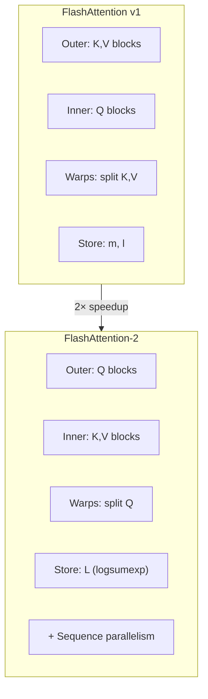
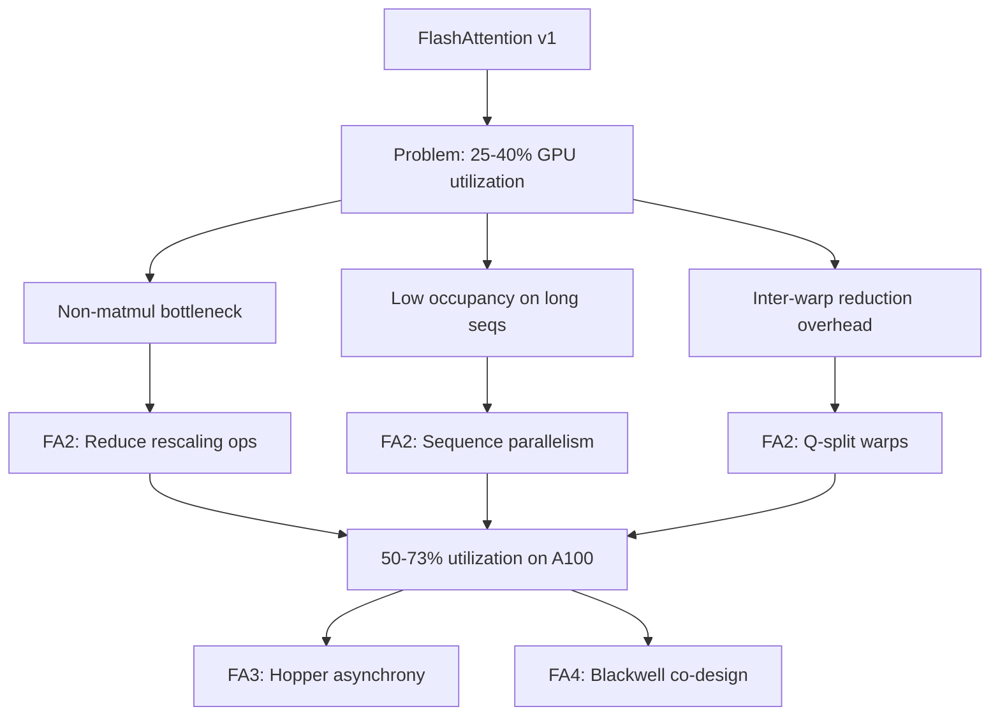
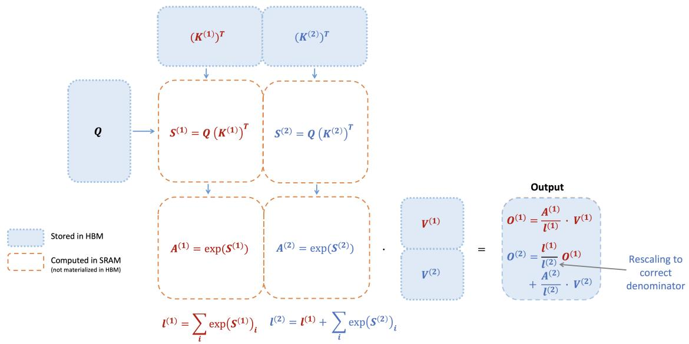
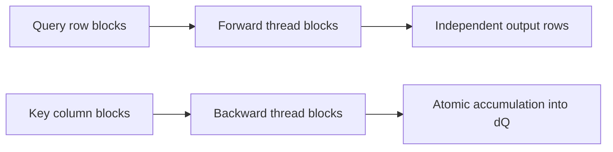

# FlashAttention-2: Better Parallelism and Work Partitioning

**Paper:** FlashAttention-2: Faster Attention with Better Parallelism and Work Partitioning
**Author:** Tri Dao
**arXiv:** 2307.08691v1 - 17 Jul 2023

**Related pages:** [FlashAttention](flashattention.md), [FlashAttention-3](flashattention-3.md), [FlashAttention-4](flashattention-4.md), [vLLM: PagedAttention Serving Framework](../frameworks/vllm-framework.md)

## TL;DR

**What:** FlashAttention-2 keeps the exact, IO-aware attention algorithm but reorganizes GPU work for higher utilization.
**How:** It reduces non-matmul operations, adds sequence-level parallelism for long contexts, and re-partitions work across warps to avoid inter-warp reductions.
**The number:** About 2× faster than FlashAttention, reaching 50-73% of theoretical peak FLOPs/s on A100 and up to 225 TFLOPs/s for end-to-end GPT training.

## The Core Idea

FlashAttention already avoids the $N \times N$ HBM bottleneck, but on A100 it only reaches 25-40% of peak FLOPs/s. The remaining gap comes from non-matmul work (softmax, reductions, masking) which is much slower than tensor-core matmul. FA2 reorganizes parallelism and work partitioning to close this gap without changing the attention algorithm itself.

## The Big Picture



*① FA2 swaps the loop order: outer over Q blocks (not K,V) so different query rows can be parallelized independently. ② Warps split Q instead of K,V — each warp owns its own output slice, eliminating inter-warp reductions. ③ Stores a single logsumexp value L instead of two statistics (m and l). ④ Adds sequence-level parallelism for long-context, small-batch regimes.*

## The Landscape

FlashAttention-2 addresses a specific gap left by FlashAttention v1:



**Parent:** FlashAttention v1 — FA2 preserves the exact same attention output and IO-aware tiling foundation but restructures GPU work partitioning.

**Siblings (contemporary):** xFormers memory-efficient attention, Triton attention kernels — all targeting similar utilization gaps but with different partitioning strategies.

**What FA2 uniquely does:** It identifies that *how* you parallelize attention matters as much as *what* you compute. By swapping loop order and warp assignments, it doubles throughput without changing the attention formula.

## Why This Exists

FlashAttention avoids materializing the full attention matrix in HBM, but attention still contains operations that tensor cores do not accelerate well:

- softmax exponentials;
- row-wise max and sum reductions;
- output rescaling for online softmax;
- masking;
- dropout and elementwise gradient work.

On A100, FP16/BF16 tensor-core matmul peak is far higher than FP32 non-matmul throughput. The paper gives 312 TFLOPs/s for FP16/BF16 matmul versus 19.5 TFLOPs/s for FP32 scalar work, so a non-matmul FLOP can be much more expensive than a tensor-core FLOP. FA2 therefore optimizes the parts around the matmuls instead of treating FLOPs uniformly.

## Algorithm Changes

FA2 makes two specific algorithmic tweaks to FlashAttention's online softmax that reduce non-matmul FLOPs while producing the exact same output.

### Tweak 1: Unscaled Output Accumulator

FlashAttention v1 rescales the output at every step by dividing by the running normalizer $\ell$. FA2 defers the division to the very end by maintaining an **unscaled** accumulator $\tilde{O}$:

**FlashAttention v1** (rescales both terms at each step):

$$O^{(2)} = \text{diag}(\ell^{(1)} / \ell^{(2)})^{-1} \, O^{(1)} + \text{diag}(\ell^{(2)})^{-1} \, e^{S^{(2)} - m^{(2)}} \, V^{(2)}$$

**FlashAttention-2** (keeps unscaled accumulator, divides once at the end):

$$\tilde{O}^{(2)} = \text{diag}(e^{m^{(1)} - m^{(2)}})^{-1} \, \tilde{O}^{(1)} + e^{S^{(2)} - m^{(2)}} \, V^{(2)}$$

Only at the very end: $O = \text{diag}(\ell^{(\text{last})})^{-1} \, \tilde{O}^{(\text{last})}$

This eliminates one elementwise division per block per row — each of which is a non-matmul FLOP running at 1/16th the speed of tensor-core matmul on A100.

### Tweak 2: Logsumexp Instead of Separate m and ℓ

FlashAttention v1 stores both the row max $m$ and the exponential sum $\ell$ for the backward pass. FA2 stores a single scalar per row:

$$L = m + \log(\ell)$$

During backward, the softmax probabilities are recomputed directly from $L$:

$$P_{ij} = \exp(S_{ij} - L_i)$$

This saves memory bandwidth (one scalar per row instead of two) and simplifies the backward pass — the softmax gradient computation no longer needs to track two separate statistics.

### Forward Pass in Detail



The full FA2 forward pass (Algorithm 1 from the paper) works as follows:

```text
1. Divide Q into T_r row blocks, K and V into T_c column blocks.
2. For each row block i (1 to T_r):
   a. Load Q_i into SRAM.
   b. Initialize Õ_i = 0, ℓ_i = 0, m_i = -∞ on chip.
   c. For each column block j (1 to T_c):
      - Load K_j, V_j into SRAM.
      - Compute S_i^{(j)} = Q_i K_j^T           ← matmul (fast)
      - Update m_i = max(m_i, rowmax(S_i^{(j)}))
      - Compute P̃_i^{(j)} = exp(S_i^{(j)} - m_i)
      - Update ℓ_i = e^{m_i_old - m_i} · ℓ_i + rowsum(P̃_i^{(j)})
      - Update Õ_i = diag(e^{m_i_old - m_i})^{-1} · Õ_i + P̃_i^{(j)} V_j   ← matmul (fast)
   d. Finalize: O_i = diag(ℓ_i)^{-1} · Õ_i     ← one division at the end
   e. Compute L_i = m_i + log(ℓ_i)              ← store one scalar per row
   f. Write O_i and L_i to HBM.
```

The key insight: steps (c) spend the vast majority of time in two matmul operations ($Q_i K_j^T$ and $\tilde{P}_i^{(j)} V_j$), which run at full tensor-core speed. The rescaling operations are kept minimal.

### Backward Pass

The backward pass in FA2 is similar to FlashAttention v1 but uses $L$ to recompute probabilities:

```text
For each column block j:
  Load K_j, V_j into SRAM.
  For each row block i:
    Load Q_i, O_i, dO_i, L_i from HBM.
    Recompute S_i^{(j)} = Q_i K_j^T
    Recompute P_i^{(j)} = exp(S_i^{(j)} - L_i)   ← using logsumexp, not separate m,ℓ
    Compute dV_j += (P_i^{(j)})^T dO_i
    Compute dP_i^{(j)} = dO_i V_j^T
    Compute dS_i^{(j)} = P_i^{(j)} ∘ (dP_i^{(j)} - D_i)   ← D = rowsum(dO ∘ O)
    Update dQ_i += dS_i^{(j)} K_j   (with atomic adds across thread blocks)
    Update dK_j += (dS_i^{(j)})^T Q_i
  Write dK_j, dV_j to HBM.
```

The backward pass performs **5 matmuls** per inner iteration (vs 2 in forward), which is why it's harder to optimize. FA2's sequence-level parallelism and Q-split warp partitioning are especially important here.

### Multi-Query and Grouped-Query Attention

FA2 natively supports MQA and GQA — where multiple query heads share the same KV head. Instead of duplicating K and V in memory, FA2 manipulates head indices to implicitly share them. In the backward pass, gradients dK and dV are summed across the heads that share them.

### Causal Mask Optimization

For causal (autoregressive) attention, FA2 exploits the block structure:

- **Block skip:** Any block where all column indices exceed all row indices is entirely masked out — skip it completely. For large $N$, this skips approximately half the blocks, yielding 1.7-1.8× speedup.
- **Partial mask:** Only the diagonal block needs actual masking; all blocks with row indices guaranteed $<$ column indices need no mask at all.

## Sequence-Level Parallelism

The first FlashAttention implementation parallelizes mainly over batch and attention heads: one thread block processes one attention head. That works well when `batch_size * num_heads` is large, but long-context training often has small batch size, leaving GPU multiprocessors underused.

FA2 also parallelizes over sequence blocks:

- In the forward pass, each thread block owns a block of query rows.
- Different row blocks do not communicate, so this increases occupancy cleanly.
- In the backward pass, each thread block owns a block of columns.
- Backward uses atomic adds where different thread blocks contribute to the same `dQ`.



This scheduling is especially important for long sequences, where sequence length is large but batch size and number of heads may be small.

## Warp-Level Work Partitioning

FA2 also changes how work is split across warps inside a thread block.

In FlashAttention's forward pass, warps split `K` and `V` while sharing `Q`. This split-K style requires warps to write intermediate output slices to shared memory, synchronize, and reduce partial results.

FA2 instead splits `Q` across warps while keeping `K` and `V` available to all warps:

- each warp computes its own slice of `Q K^T`;
- each warp multiplies by the shared `V` tile;
- each warp produces its own output slice;
- no inter-warp reduction is needed in forward.

The backward pass uses a similar principle: choose partitions that avoid split-K style communication where possible, reducing shared-memory reads/writes and synchronization.

## Block-Size Tuning

FA2 tunes block sizes around the tradeoff between shared-memory traffic and register pressure. Larger blocks reduce shared-memory loads and stores, but they can require too many registers or too much shared memory. The paper says typical choices are `{64, 128} x {64, 128}` depending on head dimension and device shared memory.

The paper manually tunes these few choices by head dimension and notes that autotuning could remove that manual work.

## Empirical Results

The paper benchmarks attention on A100 80GB SXM4 with sequence lengths from 512 to 16k, total tokens fixed at 16k, hidden dimension 2048, and head dimensions 64 or 128.

Main reported attention-kernel results:

| Comparison | Result |
|---|---|
| Versus FlashAttention | 1.7-3.0x faster |
| Versus FlashAttention in Triton | 1.3-2.5x faster |
| Versus standard PyTorch attention | 3-10x faster |
| Forward peak on A100 | Up to 230 TFLOPs/s, 73% of theoretical max |
| Forward plus backward | Around 2x faster than FlashAttention |
| H100, same implementation without Hopper-specific instructions | Up to 335 TFLOPs/s |

End-to-end GPT-style training on 8 x A100 80GB reports:

| Model setting | Without FlashAttention | FlashAttention | FlashAttention-2 |
|---|---:|---:|---:|
| GPT3-1.3B, 2k context | 142 TFLOPs/s | 189 TFLOPs/s | 196 TFLOPs/s |
| GPT3-1.3B, 8k context | 72 TFLOPs/s | 170 TFLOPs/s | 220 TFLOPs/s |
| GPT3-2.7B, 2k context | 149 TFLOPs/s | 189 TFLOPs/s | 205 TFLOPs/s |
| GPT3-2.7B, 8k context | 80 TFLOPs/s | 175 TFLOPs/s | 225 TFLOPs/s |

The strongest gains appear when attention is a larger share of the workload, such as longer context lengths.

## Relationship to Other Attention Work

FA2 sits between the original IO-aware algorithm and later architecture-specific kernels:

- [FlashAttention](flashattention.md) establishes exact tiled attention with online softmax and recomputation.
- FlashAttention-2 keeps the same exact-attention semantics but improves GPU occupancy and work partitioning.
- [FlashAttention-3](flashattention-3.md) targets Hopper with TMA/WGMMA asynchrony, warp specialization, and FP8 forward attention.
- [FlashAttention-4](flashattention-4.md) targets Blackwell with TMEM, larger MMA tiles, exponential emulation, 2-CTA backward, and load-balanced scheduling.

Compared with [vLLM](../frameworks/vllm-framework.md), FA2 is a kernel-level attention optimization. vLLM manages serving-time KV-cache memory and scheduling, while FA2 makes exact attention kernels faster for training, finetuning, and inference.

## Where It Breaks

| Failure mode | When it happens | Impact |
|---|---|---|
| Architecture lock-in | Implementation tied to NVIDIA A100/H100 CUDA; AMD or other GPUs | Requires separate porting effort |
| Small batch sizes with short sequences | When $N$ is short and batch size is already large | Sequence parallelism adds no benefit; overhead dominates |
| Compiler dependency | Manual tuning of block sizes per head dimension | Fragile across models; autotuning not yet available |
| Non-matmul bottleneck persists | FP32 softmax still limits throughput on newer architectures | Future GPUs (H100, B200) shift bottleneck; motivates FA3 and FA4 |

These boundaries directly motivate the later FlashAttention-3 (Hopper asynchrony) and FlashAttention-4 (Blackwell co-design) papers.

## One Thing to Remember

FlashAttention-2's speedup comes **not from a better algorithm but from better GPU work organization** — it reaches 2× the throughput of FlashAttention by reducing non-matmul overhead and increasing parallelism, while computing exactly the same attention.

## Go Deeper

- **Read:** [FlashAttention-2 paper (arXiv:2307.08691)](https://arxiv.org/abs/2307.08691)
- **Build on:** [FlashAttention](flashattention.md), [FlashAttention-3](flashattention-3.md), [FlashAttention-4](flashattention-4.md)
- **Understand the context:** [vLLM: PagedAttention Serving Framework](../frameworks/vllm-framework.md)
- **Reproduce:** [Official implementation at github.com/Dao-AILab/flash-attention](https://github.com/Dao-AILab/flash-attention)

## Key Takeaways

- FA2 is exact attention, not an approximation.
- The main improvement over FlashAttention is better GPU work organization.
- Reducing non-matmul FLOPs matters because scalar FP32 work is much slower than tensor-core matmul on A100.
- Sequence-parallel thread blocks improve occupancy for long-context, small-batch regimes.
- Splitting `Q` across warps avoids forward-pass inter-warp reductions and shared-memory traffic.
- FA2 becomes the practical baseline that FA3 and FA4 optimize against on newer GPU architectures.
