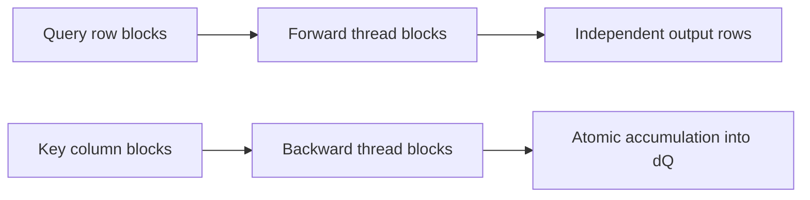

# FlashAttention-2: Better Parallelism and Work Partitioning

**Paper:** FlashAttention-2: Faster Attention with Better Parallelism and Work Partitioning
**Author:** Tri Dao
**arXiv:** 2307.08691v1 - 17 Jul 2023

**Related pages:** [FlashAttention](flashattention.md), [FlashAttention-3](flashattention-3.md), [FlashAttention-4](flashattention-4.md), [vLLM: PagedAttention Serving Framework](../frameworks/vllm-framework.md)

## Summary

FlashAttention-2 (FA2) keeps FlashAttention's exact, IO-aware attention algorithm but improves how the work is arranged on GPUs. The paper observes that the first FlashAttention implementation is already much faster than standard attention, yet it reaches only about 25-40% of theoretical peak FLOPs/s on A100. FA2 raises utilization by reducing non-matmul operations, adding more parallelism for long sequences, and changing how warps split work inside each thread block.

The reported result is about 2x speedup over FlashAttention, 50-73% of theoretical maximum FLOPs/s on A100 for attention kernels, and up to 225 TFLOPs/s per A100 GPU for end-to-end GPT-style training.

## Motivation

FlashAttention avoids materializing the full attention matrix in HBM, but attention still contains operations that tensor cores do not accelerate well:

- softmax exponentials;
- row-wise max and sum reductions;
- output rescaling for online softmax;
- masking;
- dropout and elementwise gradient work.

On A100, FP16/BF16 tensor-core matmul peak is far higher than FP32 non-matmul throughput. The paper gives 312 TFLOPs/s for FP16/BF16 matmul versus 19.5 TFLOPs/s for FP32 scalar work, so a non-matmul FLOP can be much more expensive than a tensor-core FLOP. FA2 therefore optimizes the parts around the matmuls instead of treating FLOPs uniformly.

## Algorithm Changes

FA2 changes the forward pass bookkeeping around online softmax:

- It keeps an unscaled output accumulator and applies the final scaling only at the end.
- It stores the row-wise logsumexp value `L = m + log(l)` instead of storing both the running row max `m` and exponential sum `l`.
- The backward pass uses `L` directly when recomputing probabilities.

This reduces rescaling and other non-matmul work while preserving exact attention:

```text
O = softmax(Q K^T) V
```

As in FlashAttention, FA2 uses `O(N^2 d)` FLOPs and only `O(N)` extra memory beyond inputs and output.

For causal masking, the block structure lets the kernel skip blocks where all keys are to the future of all queries. The paper reports about 1.7-1.8x speedup from this skip relative to the same attention shape without exploiting causal structure.

## Sequence-Level Parallelism

The first FlashAttention implementation parallelizes mainly over batch and attention heads: one thread block processes one attention head. That works well when `batch_size * num_heads` is large, but long-context training often has small batch size, leaving GPU multiprocessors underused.

FA2 also parallelizes over sequence blocks:

- In the forward pass, each thread block owns a block of query rows.
- Different row blocks do not communicate, so this increases occupancy cleanly.
- In the backward pass, each thread block owns a block of columns.
- Backward uses atomic adds where different thread blocks contribute to the same `dQ`.



This scheduling is especially important for long sequences, where sequence length is large but batch size and number of heads may be small.

## Warp-Level Work Partitioning

FA2 also changes how work is split across warps inside a thread block.

In FlashAttention's forward pass, warps split `K` and `V` while sharing `Q`. This split-K style requires warps to write intermediate output slices to shared memory, synchronize, and reduce partial results.

FA2 instead splits `Q` across warps while keeping `K` and `V` available to all warps:

- each warp computes its own slice of `Q K^T`;
- each warp multiplies by the shared `V` tile;
- each warp produces its own output slice;
- no inter-warp reduction is needed in forward.

The backward pass uses a similar principle: choose partitions that avoid split-K style communication where possible, reducing shared-memory reads/writes and synchronization.

## Block-Size Tuning

FA2 tunes block sizes around the tradeoff between shared-memory traffic and register pressure. Larger blocks reduce shared-memory loads and stores, but they can require too many registers or too much shared memory. The paper says typical choices are `{64, 128} x {64, 128}` depending on head dimension and device shared memory.

The paper manually tunes these few choices by head dimension and notes that autotuning could remove that manual work.

## Empirical Results

The paper benchmarks attention on A100 80GB SXM4 with sequence lengths from 512 to 16k, total tokens fixed at 16k, hidden dimension 2048, and head dimensions 64 or 128.

Main reported attention-kernel results:

| Comparison | Result |
|---|---|
| Versus FlashAttention | 1.7-3.0x faster |
| Versus FlashAttention in Triton | 1.3-2.5x faster |
| Versus standard PyTorch attention | 3-10x faster |
| Forward peak on A100 | Up to 230 TFLOPs/s, 73% of theoretical max |
| Forward plus backward | Around 2x faster than FlashAttention |
| H100, same implementation without Hopper-specific instructions | Up to 335 TFLOPs/s |

End-to-end GPT-style training on 8 x A100 80GB reports:

| Model setting | Without FlashAttention | FlashAttention | FlashAttention-2 |
|---|---:|---:|---:|
| GPT3-1.3B, 2k context | 142 TFLOPs/s | 189 TFLOPs/s | 196 TFLOPs/s |
| GPT3-1.3B, 8k context | 72 TFLOPs/s | 170 TFLOPs/s | 220 TFLOPs/s |
| GPT3-2.7B, 2k context | 149 TFLOPs/s | 189 TFLOPs/s | 205 TFLOPs/s |
| GPT3-2.7B, 8k context | 80 TFLOPs/s | 175 TFLOPs/s | 225 TFLOPs/s |

The strongest gains appear when attention is a larger share of the workload, such as longer context lengths.

## Relationship to Other Attention Work

FA2 sits between the original IO-aware algorithm and later architecture-specific kernels:

- [FlashAttention](flashattention.md) establishes exact tiled attention with online softmax and recomputation.
- FlashAttention-2 keeps the same exact-attention semantics but improves GPU occupancy and work partitioning.
- [FlashAttention-3](flashattention-3.md) targets Hopper with TMA/WGMMA asynchrony, warp specialization, and FP8 forward attention.
- [FlashAttention-4](flashattention-4.md) targets Blackwell with TMEM, larger MMA tiles, exponential emulation, 2-CTA backward, and load-balanced scheduling.

Compared with [vLLM](../frameworks/vllm-framework.md), FA2 is a kernel-level attention optimization. vLLM manages serving-time KV-cache memory and scheduling, while FA2 makes exact attention kernels faster for training, finetuning, and inference.

## Limitations and Future Directions

The paper points to several follow-up directions:

- optimize specifically for H100 features such as TMA, fourth-generation tensor cores, and FP8;
- extend support to AMD GPUs and other devices;
- combine low-level kernel optimization with higher-level attention variants such as local, dilated, and block-sparse attention;
- improve compiler support so these optimizations are easier to program.

These directions are directly connected to the later FlashAttention-3 and FlashAttention-4 papers.

## Key Takeaways

- FA2 is exact attention, not an approximation.
- The main improvement over FlashAttention is better GPU work organization.
- Reducing non-matmul FLOPs matters because scalar FP32 work is much slower than tensor-core matmul on A100.
- Sequence-parallel thread blocks improve occupancy for long-context, small-batch regimes.
- Splitting `Q` across warps avoids forward-pass inter-warp reductions and shared-memory traffic.
- FA2 becomes the practical baseline that FA3 and FA4 optimize against on newer GPU architectures.
