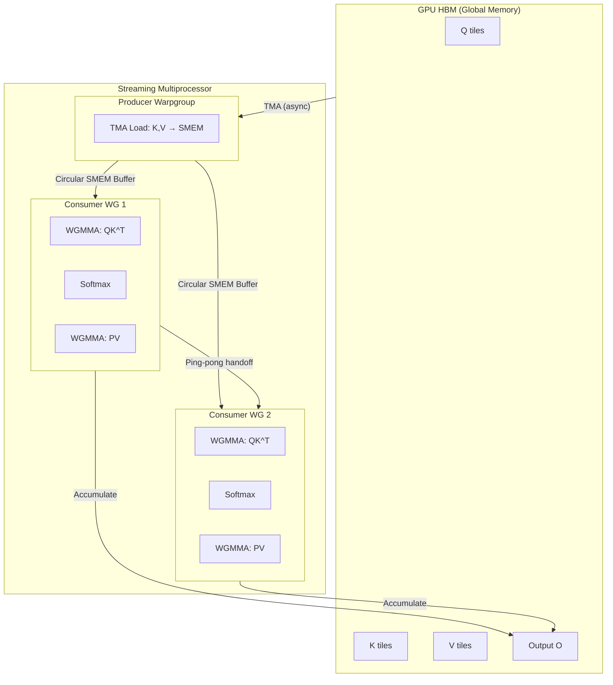
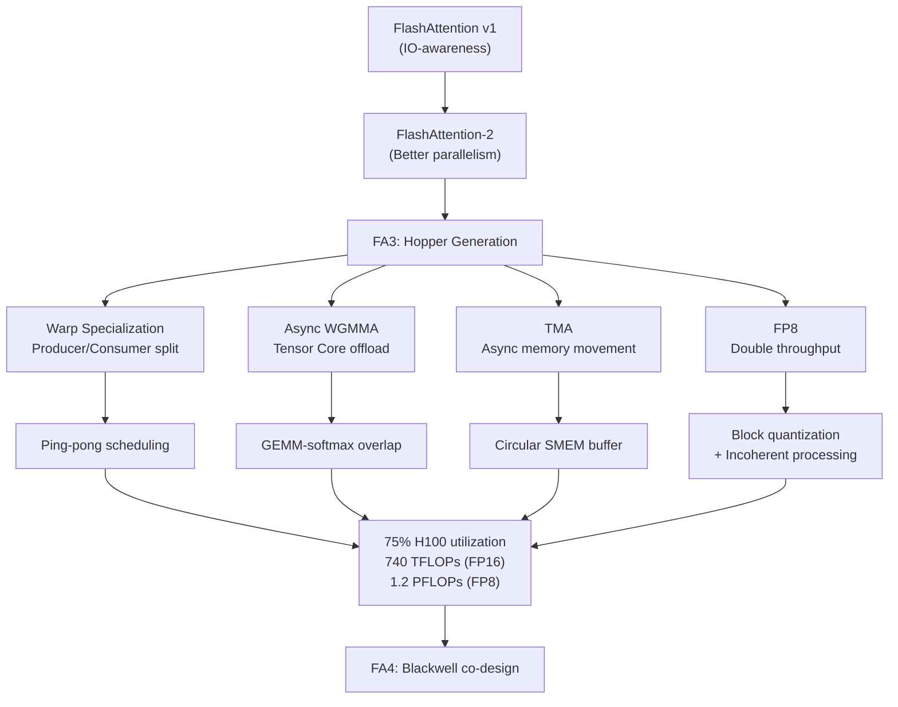
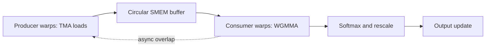

# FlashAttention-3: Hopper Asynchrony and FP8 Attention

**Paper:** FlashAttention-3: Fast and Accurate Attention with Asynchrony and Low-precision
**Authors:** Jay Shah, Ganesh Bikshandi, Ying Zhang, Vijay Thakkar, Pradeep Ramani, Tri Dao
**arXiv:** 2407.08608v2 - 12 Jul 2024

**Related pages:** [FlashAttention](flashattention.md), [FlashAttention-2](flashattention-2.md), [FlashAttention-4](flashattention-4.md)

## TL;DR

**What:** FlashAttention-3 adapts exact attention to NVIDIA Hopper GPUs by exploiting hardware asynchrony (TMA, WGMMA) and low-precision FP8.
**How:** It uses warp specialization to overlap data movement with compute, ping-pong scheduling to hide softmax latency, and a two-stage WGMMA-softmax pipeline with FP8 layout engineering.
**The number:** 1.5-2.0× faster than FlashAttention-2 in FP16/BF16, up to 740 TFLOPs/s, and nearly 1.2 PFLOPs/s for FP8 forward attention.

## The Core Idea

FlashAttention-2 reaches only about 35% utilization on H100, while optimized GEMM kernels reach 80-90%. FA3 closes this gap by making attention look more like a fully asynchronous, overlapped GPU pipeline — where data movement (TMA), matrix multiplication (WGMMA), and softmax execute concurrently rather than sequentially.

## The Big Picture

*① Producer warpgroup issues asynchronous TMA loads from HBM into a circular shared-memory buffer. ② Two consumer warpgroups (WG1, WG2) operate in ping-pong: while WG1 runs softmax on the current tile, WG2 runs WGMMA matmul for the next tile. ③ Within each consumer warpgroup, the WGMMA for QK^T and PV are further overlapped with softmax via a two-stage pipeline. ④ All softmax intermediate values stay in FP32 for accuracy. ⑤ Only final output O is written back to HBM.*

## The Landscape

FlashAttention-3 is the first version to exploit a GPU generation's *new hardware capabilities* rather than just reorganizing existing primitives:

**Parent:** FlashAttention-2 — FA3 keeps the Q-outer loop and sequence-parallel structure but replaces the synchronous execution model with asynchronous, warp-specialized pipelines.

**Siblings:** ThunkerKitten, cuDNN 9 — both showed that Hopper-specific instructions and tile-based abstractions could speed up attention, but FA3 is the first open-source implementation combining all Hopper features.

**What FA3 uniquely does:** It recognizes that on Hopper, attention is *not just an IO problem but also an asynchrony problem* — the GPU has hardware units (TMA, Tensor Cores) that can run independently of CUDA cores, and FA3 designs a software pipeline to keep all of them busy simultaneously.

## Why This Exists

FA3 targets Hopper features:

| Hopper feature | FA3 use |
|---|---|
| TMA | Asynchronous global-to-shared-memory transfers |
| WGMMA | Asynchronous warpgroup matrix multiply on tensor cores |
| Warp specialization | Separate producer and consumer warpgroups |
| `setmaxnreg` | Reallocate registers from producer warps to compute-heavy consumer warps |
| FP8 tensor cores | Higher-throughput low-precision forward attention |

The paper observes that FlashAttention-2 reaches only about 35% utilization on H100, while optimized GEMM kernels can reach 80-90%. FA3 closes part of this gap by making attention look more like a fully asynchronous, overlapped GPU pipeline.

## Producer-Consumer Pipeline

FA3 uses warp specialization inside each CTA:

- producer warps issue TMA loads for `Q_i`, `K_j`, and `V_j`;
- consumer warps execute WGMMA and softmax;
- a circular shared-memory buffer stages `K` and `V` tiles;
- synchronization barriers coordinate producer/consumer progress.

This lets memory movement proceed independently from compute when dependencies allow it.

## Ping-Pong Scheduling

FA3 uses two consumer warpgroups in a ping-pong schedule. While one warpgroup runs softmax for one tile, the other warpgroup runs GEMM for another tile. Then they swap roles.

This matters because Hopper's FP16 tensor core throughput is far higher than special-function throughput for operations such as exponential. The paper notes H100 SXM5 has 989 TFLOPs/s of FP16 matmul but only 3.9 TFLOPs/s of special functions. In FP8, matmul throughput doubles again while exponential throughput does not.

## Two-Stage WGMMA-Softmax Pipeline

Within a consumer warpgroup, FA3 further overlaps blockwise GEMM and softmax using a two-stage pipeline:

1. Issue WGMMA for the next `QK^T` score block.
2. While that WGMMA runs asynchronously, compute softmax for the current or previous score block.
3. Issue WGMMA for the `P V` output update.
4. Rescale accumulated output as needed for online softmax.

This requires reordering parts of the FlashAttention-2 computation to break apparent sequential dependencies. The paper also discusses a three-stage variant, but notes practical register and compiler scheduling constraints.

## FP8 Forward Attention

FA3 adapts forward attention to Hopper FP8 tensor cores. The core difficulty is that FP8 WGMMA has stricter layout requirements than FP16/BF16 WGMMA: operands must be in `k-major` layout. Attention fuses two GEMMs, so the output layout of the first GEMM must be transformed into an operand layout suitable for the second.

FA3 uses:

- in-kernel transpose for `V` tiles loaded into shared memory;
- accumulator layout transformations so the first WGMMA's FP32 accumulator can feed the second WGMMA;
- FP32 intermediate softmax and rescaling for accuracy where needed.

## Accuracy Techniques

Naive FP8 attention has large error when activations have outlier features. FA3 reduces FP8 error with two techniques:

| Technique | Purpose |
|---|---|
| Block quantization | Use per-block scaling for `Q`, `K`, and `V` instead of one tensor-wide scale |
| Incoherent processing | Multiply `Q` and `K` by an orthogonal transform before quantizing, reducing outlier impact while preserving `QK^T` |

The paper reports FP8 FA3 with block quantization and incoherent processing has 2.6x lower numerical error than a baseline FP8 attention path.

## Backward Pass

The paper describes backward details in the appendix. The backward pass also uses warp specialization:

- producer warps issue TMA loads;
- consumer warps perform the matmuls and softmax-gradient work;
- asynchronous operations reduce stalls compared with a synchronous pipeline.

Reported result: FP16/BF16 backward is 1.5-1.75x faster than FlashAttention-2 on H100.

## Empirical Results

Main reported results:

| Area | Result |
|---|---|
| FP16/BF16 forward | 1.5-2.0x faster than FlashAttention-2 |
| FP16/BF16 backward | 1.5-1.75x faster than FlashAttention-2 |
| FP16/BF16 peak | Up to 740 TFLOPs/s, about 75% utilization |
| FP8 forward | Close to 1.2 PFLOPs/s |
| Versus standard attention | Up to 3-16x faster |
| Long sequence comparison | FP16 FA3 can outperform cuDNN; FP8 is competitive in selected settings |
| Pipeline ablation | Warp specialization and WGMMA-softmax overlap improve non-causal FP16 from 570 to 661 TFLOPs |
| FP8 numerical error | 2.6x lower error than baseline FP8 attention |

The paper reports that FP16 FA3 has the same numerical error as FlashAttention-2 and lower error than standard attention because intermediate values such as softmax rescaling remain in FP32.

## Where It Breaks

| Failure mode | When it happens | Impact |
|---|---|---|
| Hopper-only | Non-Hopper GPUs (A100, AMD, Intel) lack TMA/WGMMA | Implementation does not transfer; FA2 is the fallback |
| FP8 precision risk | When attention accuracy is critical and FP8 errors accumulate | Requires careful layout engineering and accuracy controls |
| Inference not optimized | Training-focused pipeline design | Persistent kernel design for inference not yet integrated |
| Large-scale training unknown | FP8 attention at scale | Low-precision attention behavior in large-scale training still under-explored |

## One Thing to Remember

FA3's key insight is that **on Hopper GPUs, attention becomes an asynchrony problem, not just an IO problem** — overlapping TMA data movement, WGMMA matmul, and softmax through warp specialization is what unlocks the next 2× speedup over FA2.

## Go Deeper

- **Read:** [FlashAttention-3 paper (arXiv:2407.08608)](https://arxiv.org/abs/2407.08608)
- **Build on:** [FlashAttention](flashattention.md), [FlashAttention-2](flashattention-2.md), [FlashAttention-4](flashattention-4.md)
- **Understand the context:** [NVFP4: Blackwell 4-Bit Floating Point](../hardware/nvfp4.md)
- **Reproduce:** [Official implementation at github.com/Dao-AILab/flash-attention](https://github.com/Dao-AILab/flash-attention)

## Key Takeaways

- FA3 keeps the FlashAttention/FlashAttention-2 IO-aware exact attention foundation but adds Hopper-specific asynchrony.
- Warp-specialized producer/consumer structure overlaps TMA data movement with compute.
- Ping-pong and two-stage scheduling hide softmax under asynchronous WGMMA work.
- FP8 support requires both layout engineering and accuracy controls.
- FA3 is the bridge between IO-aware FlashAttention and the Blackwell-focused FA4 pipeline redesign.
