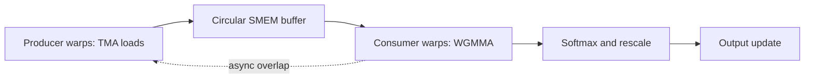

# FlashAttention-3: Hopper Asynchrony and FP8 Attention

**Paper:** FlashAttention-3: Fast and Accurate Attention with Asynchrony and Low-precision
**Authors:** Jay Shah, Ganesh Bikshandi, Ying Zhang, Vijay Thakkar, Pradeep Ramani, Tri Dao
**arXiv:** 2407.08608v2 - 12 Jul 2024

**Related pages:** [FlashAttention](flashattention.md), [FlashAttention-2](flashattention-2.md), [FlashAttention-4](flashattention-4.md)

## Summary

FlashAttention-3 (FA3) adapts FlashAttention to NVIDIA Hopper GPUs. FlashAttention and FlashAttention-2 minimize HBM reads/writes, but FA3 argues that newer GPUs also require explicit use of hardware asynchrony and low precision. On Hopper H100, tensor cores and Tensor Memory Accelerator (TMA) can run asynchronously from ordinary CUDA-core work. FA3 restructures the attention kernel so data movement, matrix multiplication, and softmax overlap more effectively.

The paper reports FP16/BF16 forward speedups of 1.5-2.0x over FlashAttention-2, backward speedups of 1.5-1.75x, up to 740 TFLOPs/s for FP16/BF16, and nearly 1.2 PFLOPs/s for FP8 forward attention.

## Hopper Motivation

FA3 targets Hopper features:

| Hopper feature | FA3 use |
|---|---|
| TMA | Asynchronous global-to-shared-memory transfers |
| WGMMA | Asynchronous warpgroup matrix multiply on tensor cores |
| Warp specialization | Separate producer and consumer warpgroups |
| `setmaxnreg` | Reallocate registers from producer warps to compute-heavy consumer warps |
| FP8 tensor cores | Higher-throughput low-precision forward attention |

The paper observes that FlashAttention-2 reaches only about 35% utilization on H100, while optimized GEMM kernels can reach 80-90%. FA3 closes part of this gap by making attention look more like a fully asynchronous, overlapped GPU pipeline.

## Producer-Consumer Pipeline

FA3 uses warp specialization inside each CTA:

- producer warps issue TMA loads for `Q_i`, `K_j`, and `V_j`;
- consumer warps execute WGMMA and softmax;
- a circular shared-memory buffer stages `K` and `V` tiles;
- synchronization barriers coordinate producer/consumer progress.

This lets memory movement proceed independently from compute when dependencies allow it.

## Ping-Pong Scheduling

FA3 uses two consumer warpgroups in a ping-pong schedule. While one warpgroup runs softmax for one tile, the other warpgroup runs GEMM for another tile. Then they swap roles.

This matters because Hopper's FP16 tensor core throughput is far higher than special-function throughput for operations such as exponential. The paper notes H100 SXM5 has 989 TFLOPs/s of FP16 matmul but only 3.9 TFLOPs/s of special functions. In FP8, matmul throughput doubles again while exponential throughput does not.

## Two-Stage WGMMA-Softmax Pipeline

Within a consumer warpgroup, FA3 further overlaps blockwise GEMM and softmax using a two-stage pipeline:

1. Issue WGMMA for the next `QK^T` score block.
2. While that WGMMA runs asynchronously, compute softmax for the current or previous score block.
3. Issue WGMMA for the `P V` output update.
4. Rescale accumulated output as needed for online softmax.

This requires reordering parts of the FlashAttention-2 computation to break apparent sequential dependencies. The paper also discusses a three-stage variant, but notes practical register and compiler scheduling constraints.

## FP8 Forward Attention

FA3 adapts forward attention to Hopper FP8 tensor cores. The core difficulty is that FP8 WGMMA has stricter layout requirements than FP16/BF16 WGMMA: operands must be in `k-major` layout. Attention fuses two GEMMs, so the output layout of the first GEMM must be transformed into an operand layout suitable for the second.

FA3 uses:

- in-kernel transpose for `V` tiles loaded into shared memory;
- accumulator layout transformations so the first WGMMA's FP32 accumulator can feed the second WGMMA;
- FP32 intermediate softmax and rescaling for accuracy where needed.

## Accuracy Techniques

Naive FP8 attention has large error when activations have outlier features. FA3 reduces FP8 error with two techniques:

| Technique | Purpose |
|---|---|
| Block quantization | Use per-block scaling for `Q`, `K`, and `V` instead of one tensor-wide scale |
| Incoherent processing | Multiply `Q` and `K` by an orthogonal transform before quantizing, reducing outlier impact while preserving `QK^T` |

The paper reports FP8 FA3 with block quantization and incoherent processing has 2.6x lower numerical error than a baseline FP8 attention path.

## Backward Pass

The paper describes backward details in the appendix. The backward pass also uses warp specialization:

- producer warps issue TMA loads;
- consumer warps perform the matmuls and softmax-gradient work;
- asynchronous operations reduce stalls compared with a synchronous pipeline.

Reported result: FP16/BF16 backward is 1.5-1.75x faster than FlashAttention-2 on H100.

## Empirical Results

Main reported results:

| Area | Result |
|---|---|
| FP16/BF16 forward | 1.5-2.0x faster than FlashAttention-2 |
| FP16/BF16 backward | 1.5-1.75x faster than FlashAttention-2 |
| FP16/BF16 peak | Up to 740 TFLOPs/s, about 75% utilization |
| FP8 forward | Close to 1.2 PFLOPs/s |
| Versus standard attention | Up to 3-16x faster |
| Long sequence comparison | FP16 FA3 can outperform cuDNN; FP8 is competitive in selected settings |
| Pipeline ablation | Warp specialization and WGMMA-softmax overlap improve non-causal FP16 from 570 to 661 TFLOPs |
| FP8 numerical error | 2.6x lower error than baseline FP8 attention |

The paper reports that FP16 FA3 has the same numerical error as FlashAttention-2 and lower error than standard attention because intermediate values such as softmax rescaling remain in FP32.

## Limitations

The paper focuses on Hopper. The authors state the algorithmic ideas apply to architectures with robust asynchronous execution and low-precision hardware, but the concrete implementation is architecture-specific.

Noted future directions include:

- optimizing for LLM inference;
- integrating persistent kernel design into FP8 kernels;
- understanding low-precision attention in large-scale training.

## Key Takeaways

- FA3 keeps the FlashAttention/FlashAttention-2 IO-aware exact attention foundation but adds Hopper-specific asynchrony.
- Warp-specialized producer/consumer structure overlaps TMA data movement with compute.
- Ping-pong and two-stage scheduling hide softmax under asynchronous WGMMA work.
- FP8 support requires both layout engineering and accuracy controls.
- FA3 is the bridge between IO-aware FlashAttention and the Blackwell-focused FA4 pipeline redesign.
