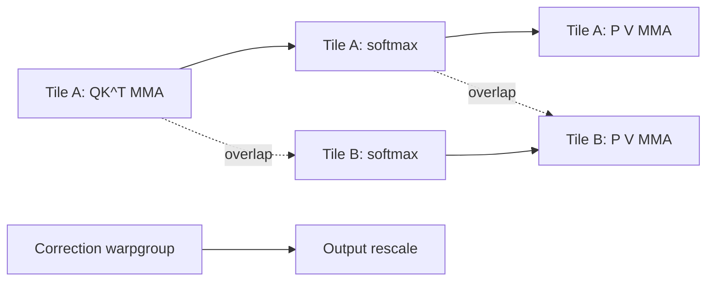

# FlashAttention-4: Blackwell Attention Kernel Co-Design

**Paper:** FlashAttention-4: Algorithm and Kernel Pipelining Co-Design for Asymmetric Hardware Scaling
**Authors:** Ted Zadouri, Markus Hoehnerbach, Jay Shah, Timmy Liu, Vijay Thakkar, Tri Dao
**arXiv:** 2603.05451v1 - 5 Mar 2026

**Related pages:** [FlashAttention](flashattention.md), [FlashAttention-2](flashattention-2.md), [FlashAttention-3](flashattention-3.md), [vLLM: PagedAttention Serving Framework](../frameworks/vllm-framework.md), [NVFP4: Blackwell 4-Bit Floating Point](../hardware/nvfp4.md)

## Summary

FlashAttention-4 (FA4) is an exact attention algorithm and GPU-kernel implementation designed for NVIDIA Blackwell datacenter GPUs. Its core premise is that Blackwell changes the bottleneck: tensor core BF16/FP16 throughput roughly doubles versus Hopper, while shared-memory bandwidth and exponential-function throughput scale much less. As a result, a Blackwell attention kernel cannot focus only on matrix multiplication. It must also reduce or hide softmax work, shared-memory traffic, atomics, and scheduling imbalance.

FA4 keeps the FlashAttention family goal of computing exact attention without materializing the full attention matrix in HBM, but redesigns the forward and backward pipelines around Blackwell features: asynchronous MMA into tensor memory (TMEM), larger MMA tiles, 2-CTA tensor core mode, software-emulated exponentials, conditional online-softmax rescaling, and load-balanced tile scheduling.

## Hardware Motivation

The paper describes Blackwell B200 / GB200 as asymmetrically scaled relative to Hopper:

| Resource | Blackwell behavior relevant to FA4 |
|---|---|
| Tensor cores | BF16 MMA throughput doubles to 8192 ops / clock / SM |
| Exponential unit | MUFU exponential throughput remains 16 ops / clock / SM on B200 / GB200 |
| Shared memory | Read throughput remains about 128 bytes / clock / SM |
| Tensor memory | New 256 KB TMEM per SM for tensor core accumulator storage |
| MMA tile shape | Blackwell supports larger 128 x N MMA tiles |
| 2-CTA MMA | Two CTAs can cooperatively execute one MMA and split operand staging |

This means attention performance shifts toward non-matmul bottlenecks. In the paper's roofline analysis, forward attention is limited by MMA and exponential throughput, while backward attention is primarily limited by shared-memory traffic.

## Attention Computation

For one attention head with query, key, and value matrices `Q`, `K`, and `V`, attention computes:

```text
S = alpha Q K^T
P = softmax(S)
O = P V
```

Backward attention computes gradients through the same structure:

```text
dV = P^T dO
dP = dO V^T
dS = dsoftmax(dP)
dQ = alpha dS K
dK = alpha dS^T Q
```

FA4's algorithmic work is not a new approximate attention formula. It is exact attention with a different blocking, pipelining, and hardware-resource allocation strategy.

## Forward Pass

### Pipeline Overlap

FA4 uses a ping-pong pipeline similar in spirit to FlashAttention-3, but adapted to Blackwell:

- two output tiles are computed per thread block;
- while one tile runs tensor core MMA, the other tile runs softmax work;
- Blackwell accumulators live in TMEM rather than registers;
- 128 x 128 accumulator tiles replace Hopper's smaller 64 x 128 pattern;
- softmax warpgroups process full rows, reducing inter-warp shuffle needs;
- output rescaling is moved to a separate correction warpgroup, taking it out of the critical path.



The forward roofline table in the paper shows, for common tile sizes, that MMA compute and exponentials are both primary bottlenecks. This motivates two additional forward-pass changes: exponential emulation and skipped rescaling.

### Software-Emulated Exponentials

Softmax needs many exponentials, but Blackwell's MUFU unit does not scale with tensor cores. FA4 increases effective exponential throughput by computing a fraction of `2^x` calls on FMA and integer units instead of MUFU.

The emulation uses range reduction:

```text
2^x = 2^floor(x) * 2^(x - floor(x))
```

The integer power is handled through floating-point exponent-bit manipulation. The fractional part on `[0, 1)` is approximated with a polynomial evaluated by FMA instructions.

The paper does not use polynomial emulation for every exponential because it increases register pressure and latency. Instead, it applies emulation to roughly 10-25% of entries in each softmax row and leaves the rest on hardware `MUFU.EX2`.

Accuracy result:

| Approximation | FP32 max relative error | BF16 max relative error after rounding |
|---|---:|---:|
| Hardware MUFU.EX2 | 1.41e-7 | 3.89e-3 |
| Degree 3 polynomial | 8.77e-5 | 3.90e-3 |
| Degree 4 polynomial | 3.05e-6 | 3.89e-3 |
| Degree 5 polynomial | 1.44e-7 | 3.89e-3 |

The key point is that BF16 quantization dominates the polynomial error for degree 3 and above, so the lower-precision attention path can tolerate the approximation.

### Conditional Online-Softmax Rescaling

FlashAttention processes attention blocks while maintaining an online softmax max and normalizer. Standard online softmax rescales prior partial output whenever a new block raises the running maximum.

FA4 observes:

- rescaling is only needed when the new row maximum is larger;
- small increases can be tolerated temporarily if final statistics are tracked correctly.

FA4 therefore rescales only when the increase exceeds a threshold `tau`, typically `log2(256) = 8.0`. If the increase is smaller, the kernel accumulates using the previous max and fixes the final output with the true final normalizer.

This reduces vector rescaling operations while preserving correctness through final normalization.

## Backward Pass

The backward pass is harder because it performs five MMAs and more intermediate data movement. The paper's roofline analysis for `M = N = d = 128` shows shared memory taking 3328 cycles versus 2560 cycles for MMA compute and 1024 cycles for exponentials, making shared memory the main bottleneck.

### TMEM-Based Pipeline

FlashAttention-3 stored accumulators in registers, creating ordering constraints. FA4 uses Blackwell TMEM to keep more intermediate accumulator tiles live and overlap:

- recomputing `S`;
- computing `dP`;
- accumulating `dV`;
- computing `dQ`;
- computing `dK`;
- softmax-gradient elementwise work.

Because TMEM cannot hold every accumulator tile at once, FA4 deliberately aliases storage: for example, `S` and `P` share one TMEM region, and `dP`, `dS`, and `dQ` share another in the 1-CTA schedule.

### 2-CTA Backward Mode

FA4 uses Blackwell's 2-CTA MMA mode to reduce shared-memory traffic. Two CTAs cooperate on a larger tile. Each CTA stages only half of one operand and owns part of the output accumulator.

For the `dQ` step, this creates a reduction-axis issue. FA4 uses distributed shared memory (DSMEM) between the CTA pair to exchange half of the `dS` tile, repacking it so each CTA can run the correct `dQ` MMA over a doubled reduction dimension.

The 2-CTA design has two benefits:

- it reduces shared-memory traffic from MMA operands;
- it halves global atomic reductions for `dQ`, because each CTA writes only half of the `dQ` tile.

The paper's backward roofline table shows total shared-memory cycles dropping from 3328 in 1-CTA mode to 2688 in 2-CTA mode for the representative configuration.

### Deterministic Backward

The normal backward kernel can be nondeterministic because inter-CTA reductions use global atomics. FA4 adds a deterministic mode by serializing reductions with semaphore locks in a predefined order.

To reduce lock stalls, FA4 combines swizzling and scheduling:

- batch/head swizzling improves locality and reduces stalls;
- for causal masking, KV blocks launch in descending order;
- query blocks traverse from the diagonal upward;
- `dQ` reductions use descending query-block order.

The paper reports deterministic backward can reach up to 75% of the speed of the nondeterministic 1-CTA backward pass.

## Scheduling

FA4 uses longest-processing-time-first (LPT) scheduling for imbalanced attention grids, especially causal masking and variable-length attention.

For causal attention, later query blocks have more valid keys than earlier blocks. Naive grid order can assign short work before long work, leaving SMs imbalanced. FA4 instead orders work to process long tiles earlier while preserving cache locality:

- batches stay outermost;
- heads are swizzled in L2-cache-sized sections;
- `mblocks` are traversed in reverse order;
- MQA/GQA traverses all query heads per KV head before changing blocks.

For variable-length attention, FA4 can run a preprocessing kernel that sorts batches by maximum per-worktile execution time and writes a virtual-to-actual batch-index map. The paper states this metadata can be cached, avoiding sorting overhead on repeated use.

## CuTe-DSL Implementation

FA4 is implemented entirely in CuTe-DSL embedded in Python, not CUDA C++. The authors present this as part of the contribution because previous FlashAttention implementations relied heavily on C++ template metaprogramming.

Reported single-kernel compile times:

| Method | Forward compile | Backward compile |
|---|---:|---:|
| FlashAttention-3 | 55s | 45s |
| FlashAttention-4 | 2.5s | 1.4s |
| Speedup | 22x | 32x |

The framework exposes reusable primitives for masking, block sparsity, variable-length handling, and scheduling, so other attention variants such as FlexAttention and block-sparse attention can be built on top of the same implementation.

## Evaluation

The main text benchmarks FA4 against PyTorch, FlashAttention-2, Triton, Gluon, and cuDNN on Blackwell. It reports:

| Result | Claim |
|---|---|
| Best BF16 throughput | Up to 1613 TFLOPs/s |
| Hardware utilization | About 71% of B200 theoretical max |
| Versus cuDNN 9.13 | Up to 1.3x faster |
| Versus Triton | Up to 2.7x faster |
| Forward pass | 1.1-1.3x faster than cuDNN 9.13 and 2.1-2.7x faster than Triton |
| Strongest forward setting | Medium and long sequences, especially 4k+ |
| Backward pass | Consistent speedups across long sequence lengths and causal masking |

Benchmark settings in the main paper:

- BF16 inputs;
- sequence lengths from 1k to 32k;
- total tokens fixed at 32k by changing batch size;
- head dimensions 64, 128, and `(192, 128)` for DeepSeek-V3-style attention;
- causal and non-causal attention.

## Source Caveat

The source contains one hardware-name inconsistency. The main paper repeatedly describes the experiments as B200 GPU benchmarks and reports B200 utilization. Appendix A.1 says the speed is benchmarked on a "B100 180GB SXM6 (1000W)." This page preserves the main-text B200 claims but notes the contradiction because it appears directly in the source.

## Relationship to Other Attention Work

FA4 sits after FlashAttention-1/2/3:

- **FlashAttention:** avoids materializing the full attention matrix in HBM by tiled exact attention.
- **FlashAttention-2:** improves parallelism and work partitioning.
- **FlashAttention-3:** targets Hopper with asynchronous execution and warp specialization.
- **FlashAttention-4:** targets Blackwell asymmetry by reducing non-matmul bottlenecks and exploiting TMEM, asynchronous MMA, larger tiles, and 2-CTA mode.

Compared with [vLLM](../frameworks/vllm-framework.md), FA4 is a lower-level attention-kernel algorithm. vLLM manages KV-cache memory and serving throughput at the system level, while FA4 optimizes the exact attention forward/backward kernels themselves.

## Key Takeaways

- FA4 is exact attention, not an approximation, though it uses BF16-tolerant exponential emulation inside softmax.
- The algorithm is driven by Blackwell's asymmetric scaling: tensor cores are no longer the only limiting resource.
- Forward speedups come from overlapping matmul and softmax, partially emulating exponentials, and skipping most unnecessary online-softmax rescaling.
- Backward speedups come from TMEM-enabled pipeline overlap, 2-CTA MMA, less shared-memory traffic, and fewer `dQ` atomics.
- LPT scheduling improves causal and variable-length attention by assigning long-running tiles earlier while preserving cache locality.
- CuTe-DSL is part of the practical contribution: it keeps low-level control while cutting compile time enough to make kernel iteration faster.
