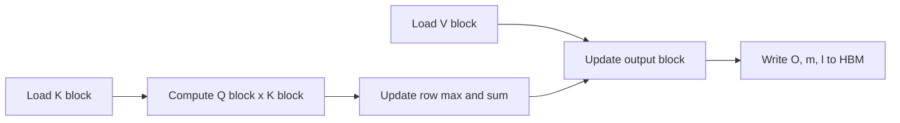

# FlashAttention: IO-Aware Exact Attention

**Paper:** FlashAttention: Fast and Memory-Efficient Exact Attention with IO-Awareness
**Authors:** Tri Dao, Daniel Y. Fu, Stefano Ermon, Atri Rudra, Christopher Ré
**arXiv:** 2205.14135v2 - 23 Jun 2022

**Related pages:** [FlashAttention-2](flashattention-2.md), [FlashAttention-3](flashattention-3.md), [FlashAttention-4](flashattention-4.md), [vLLM: PagedAttention Serving Framework](../frameworks/vllm-framework.md)

## Summary

FlashAttention is an exact attention algorithm designed around GPU memory hierarchy. Standard attention materializes the attention score matrix `S = QK^T` and probability matrix `P = softmax(S)` in HBM, causing quadratic memory traffic in sequence length. FlashAttention avoids writing those large intermediate matrices to HBM by tiling `Q`, `K`, and `V`, computing softmax statistics block by block in SRAM, and recomputing attention blocks during backward instead of saving the full attention matrix.

The central idea is IO-awareness: optimize reads and writes between slow GPU HBM and fast on-chip SRAM, not just FLOPs.

## Problem

For one attention head:

```text
S = Q K^T
P = softmax(S)
O = P V
```

With sequence length `N` and head dimension `d`, standard attention uses `O(N^2)` memory for intermediate matrices. This is expensive because many attention operations are memory-bound: masking, softmax, dropout, and intermediate reads/writes dominate wall-clock time even when FLOPs are not reduced.

Approximate attention methods reduce theoretical compute, but the paper argues many fail to produce practical speedups because they do not reduce memory movement enough.

## Algorithm

FlashAttention splits inputs into blocks sized to fit in SRAM:

- `K_j` and `V_j` blocks are loaded from HBM into SRAM.
- For each query block `Q_i`, the kernel computes a local score block `S_ij = Q_i K_j^T`.
- It computes local row maxima and exponent sums.
- It updates each output block `O_i` using online softmax rescaling.
- It writes only the running output block and per-row softmax statistics back to HBM.

The algorithm keeps running per-row statistics:

```text
m_i = running row max
l_i = running exponential sum
O_i = running output block
```

When a new score block changes the row max, prior output is rescaled so the final result is exactly the same as full softmax over all keys.



## Recomputation in Backward

Standard training stores `S` or `P` for backward, which costs quadratic memory. FlashAttention instead stores:

- output `O`;
- softmax row max `m`;
- softmax normalizer `l`.

During backward, it reloads blocks of `Q`, `K`, and `V`, recomputes local attention probabilities on chip, and uses them to compute `dQ`, `dK`, and `dV`. This increases FLOPs, but reduces HBM traffic enough that backward is faster in practice.

The paper frames this as selective gradient checkpointing that saves memory without the usual speed penalty.

## IO Complexity

For SRAM size `M`, sequence length `N`, and head dimension `d`, with `d <= M <= Nd`:

| Method | HBM accesses |
|---|---|
| Standard attention | `Theta(Nd + N^2)` |
| FlashAttention | `Theta(N^2 d^2 / M)` |

For typical GPU SRAM sizes and head dimensions such as `d = 64` or `128`, FlashAttention makes far fewer HBM accesses. The paper also gives a lower-bound argument that no exact attention algorithm can asymptotically improve on this bound for all SRAM sizes in the stated range.

The paper reports a GPT-2 medium example where forward plus backward attention has higher FLOPs with FlashAttention but much lower HBM traffic:

| Metric | Standard attention | FlashAttention |
|---|---:|---:|
| GFLOPs | 66.6 | 75.2 |
| HBM read/write | 40.3 GB | 4.4 GB |
| Runtime | 41.7 ms | 7.3 ms |

## Block-Sparse FlashAttention

The paper extends FlashAttention to block-sparse attention by skipping zero blocks under a predefined block sparsity mask. The algorithm is otherwise the same tiled exact-attention procedure over nonzero blocks.

If `s` is the fraction of nonzero blocks, block-sparse FlashAttention has HBM accesses:

```text
Theta(Nd + N^2 d^2 s / M)
```

The paper uses a fixed butterfly sparsity pattern in downstream experiments and reports block-sparse FlashAttention is 2-4x faster than dense FlashAttention for long sparse workloads.

## Empirical Results

Key reported results:

| Setting | Result |
|---|---|
| BERT-large sequence length 512 | 15% faster than the MLPerf 1.1 training speed record |
| GPT-2 sequence length 1K | Up to 3x faster than HuggingFace and 1.7x faster than Megatron-LM |
| Long Range Arena | 2.4x speedup for FlashAttention; 2.8x for block-sparse FlashAttention |
| GPT-2 small with 4K context | Still 30% faster than Megatron-LM with 1K context, with 0.7 better perplexity |
| Long-document classification | Longer sequence lengths improve micro-F1 by 4.3 points on MIMIC-III and 8.5 points on ECtHR |
| Path-X | First reported Transformer above random performance: 61.4% accuracy |
| Path-256 | Block-sparse FlashAttention reaches 63.1% accuracy |
| Attention runtime benchmark | Up to 3x faster than PyTorch exact attention |
| Memory footprint | Linear in sequence length and up to 20x more memory-efficient than exact attention baselines |

## Limitations

The paper identifies several limits and future directions:

- Writing new IO-aware kernels in CUDA requires substantial engineering effort.
- Implementations may not transfer cleanly across GPU architectures.
- The paper focuses on single-GPU IO optimality; multi-GPU attention adds another communication layer.
- The authors call for compiler support that lets users write high-level attention variants while still generating IO-aware kernels.

## Key Takeaways

- FlashAttention is exact attention; its speedup comes from memory traffic reduction, not approximation.
- It avoids materializing `N x N` attention matrices in HBM.
- Online softmax statistics make blockwise exact softmax possible.
- Recomputation in backward trades extra FLOPs for much less HBM traffic.
- The algorithm established IO-awareness as a core design principle for later FlashAttention versions.
