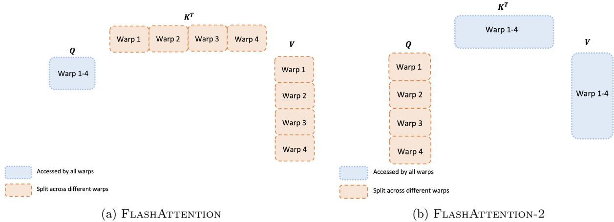
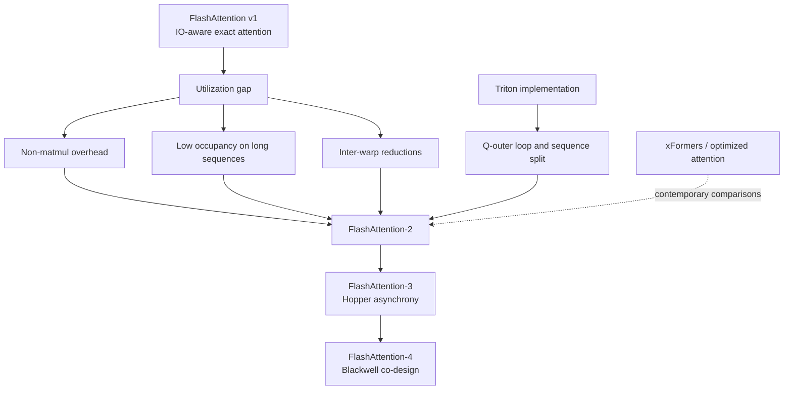
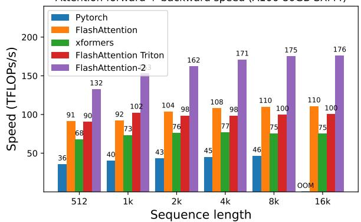

# FlashAttention-2: Better Parallelism and Work Partitioning

**Paper:** FlashAttention-2: Faster Attention with Better Parallelism and Work Partitioning
**Author:** Tri Dao
**arXiv:** 2307.08691v1 - 17 Jul 2023

**Related pages:** [FlashAttention](flashattention.md), [FlashAttention-3](flashattention-3.md), [FlashAttention-4](flashattention-4.md), [General Matrix Multiply (GEMM)](../../terms/gemm.md), [vLLM: PagedAttention Serving Framework](../../frameworks/vllm/vllm-framework.md)

## TL;DR

**What:** FlashAttention-2 preserves exact IO-aware attention while reorganizing work across thread blocks and warps.
**How:** It removes avoidable non-matmul work, parallelizes over sequence tiles, and gives each warp an independent query slice instead of reducing split-key partials.
**The number:** The paper reports 1.7-3.0x speedup over FlashAttention, up to 230 TFLOPs/s or 73% of A100 peak for forward attention, and up to 225 TFLOPs/s per GPU in GPT-style training.

## The Big Picture

*Source: [FlashAttention-2, Figure 3](https://arxiv.org/abs/2307.08691). ① FlashAttention splits K and V across warps, so partial outputs must pass through shared memory and be reduced. ② FA-2 makes Q the split dimension while K and V remain available to all warps. ③ Each warp can finish its own output rows without an inter-warp reduction.*

The figure captures FA-2's central change in ownership. The same paper also changes the loop order, adds sequence-level parallelism, and stores a cheaper backward state; all three changes target utilization rather than the mathematical attention result.

## Why This Exists

FlashAttention already avoids writing the full `N x N` score and probability matrices to [HBM](../../terms/global-memory.md), but its A100 implementation reaches only about 25-40% of theoretical peak throughput. The remaining work includes softmax exponentials, row reductions, masking, rescaling, and gradient elementwise operations that do not run on the tensor-core [GEMM](../../terms/gemm.md) path.

The paper gives an A100 example of 312 TFLOPs/s for FP16/BF16 matmul versus 19.5 TFLOPs/s for FP32 non-matmul work. A non-matmul operation can therefore consume much more time than its FLOP count suggests. Long-context training creates a second problem: when batch size and number of heads are small, one thread block per head leaves many streaming multiprocessors without work.

FA-2 exists for the combination of these pains. It keeps the exact tiled algorithm, but asks three scheduling questions: can non-matmul work be reduced, can one long head be split across thread blocks, and can each warp finish its own output without a reduction?

## The Landscape

FA-2 is the utilization-focused successor to FA-1, between IO-aware tiling and later GPU-generation-specific scheduling.

Editable source: [FA-2 landscape diagram](./assets/fa2-landscape.mmd).

**Parent:** [FlashAttention](flashattention.md) supplies exact online-softmax tiling and recomputation.

**Implementation neighbor:** The paper credits the Triton implementation with first suggesting and implementing the Q-outer loop and sequence-level split that FA-2 adopts in its CUDA implementation.

**What changes here:** The optimization target moves from avoiding HBM traffic to using the GPU's tensor cores, warps, shared memory, and streaming multiprocessors more evenly. FA-3 and FA-4 later continue that progression for Hopper and Blackwell, including an [FP8](../../terms/fp8.md) forward path in FA-3.

## The Core Idea

FA-2 does not make attention sparser or approximate. It keeps the same exact score, softmax, and value computation, then changes the ownership of tiles: query rows become independent work units, warps own query slices, and only one final normalization is performed. The result is more tensor-core work per unit of overhead and more active GPU resources when the sequence is long.

## Symbol Map

The subscript `i` denotes a query-row tile and `j` a key/value-column tile. A superscript `(j)` means the state after processing tile `j`; `dX` means the gradient of `X`.

| Symbol | Human name | Shape or scope | Plain meaning |
|---|---|---|---|
| $Q$, $K$, $V$ | query, key, value | $N \times d$ per head | Inputs to exact attention. |
| $S$, $P$, $O$ | scores, probabilities, output | $N \times N$, $N \times N$, $N \times d$ | The attention intermediates and result. |
| $N$ | sequence length | per head | Number of query and key positions. |
| $d$ | head dimension | per head | Width of each query, key, and value vector. |
| $B_r$, $B_c$ | row and column tile sizes | per thread block | Query rows and key/value rows processed together. |
| $m_i$ | running row maximum | one value per query row | Maximum score seen while scanning key tiles. |
| $\ell_i$ | max-shifted normalizer | one value per query row | Running sum of exponentials after max subtraction. |
| $\widetilde{O}_i$ | unnormalized output numerator | $B_r \times d$ | Accumulator kept relative to the current row maximum. |
| $L_i$ | log-sum-exp | one value per query row | $m_i + \log(\ell_i)$, saved for backward probability reconstruction. |
| $dQ$, $dK$, $dV$ | input gradients | same logical scope as Q, K, V | Backward-pass gradient outputs. |
| $D_i$ | softmax-gradient row scalar | one value per query row | Row-wise $dO \cdot O$ term used in $dS$. |

| GPU scope | FA-2 ownership |
|---|---|
| Thread block | A query-row tile in forward, or a key-column tile in backward. |
| Warp | A query slice in forward; a communication-minimizing partition in backward. |
| HBM | Inputs, final outputs, gradients, and saved $O,L$ state. |
| Shared memory | Tile staging and any remaining intra-block communication. |

## Deep Dive

### Unscaled accumulator and log-sum-exp state

**What it does:** It removes repeated output normalization from the inner key-tile loop while retaining the exact softmax result.

**Why it matters:** A division or rescale for every row and every key tile is non-matmul work on the slow path, even though the two surrounding GEMMs are tensor-core work.

**How it works:** For row tile `i` and key/value tile `j`, FA-2 computes:

$$m_i^{(j)} = \max\left(m_i^{(j-1)}, \operatorname{rowmax}(S_i^{(j)})\right)$$

$$\widetilde{P}_i^{(j)} = \exp\left(S_i^{(j)} - m_i^{(j)}\right)$$

$$\ell_i^{(j)} = e^{m_i^{(j-1)}-m_i^{(j)}}\ell_i^{(j-1)} + \operatorname{rowsum}\left(\widetilde{P}_i^{(j)}\right)$$

The unnormalized numerator uses the same max correction:

$$\widetilde{O}_i^{(j)} = e^{m_i^{(j-1)}-m_i^{(j)}}\widetilde{O}_i^{(j-1)} + \widetilde{P}_i^{(j)}V_j$$

After the last key tile, FA-2 performs the only output division:

$$O_i = \left(\ell_i^{(T_c)}\right)^{-1}\widetilde{O}_i^{(T_c)}, \qquad L_i = m_i^{(T_c)} + \log\left(\ell_i^{(T_c)}\right)$$

The factor is $e^{m_{old}-m_{new}}$, not its inverse: an increase in the running maximum deflates the old numerator. During backward, the saved $L_i$ reconstructs probabilities directly as $P_i^{(j)} = \exp(S_i^{(j)} - L_i)$.

**The intuition:** Carry the numerator in the current max's units, postpone normalization, and use one scalar log-sum-exp record to recover the global denominator later.

**A concrete example:** With scores `[2, 5]` followed by `[1, 8]`, the old numerator is multiplied by $e^{5-8}=e^{-3}$ before the second block is added; the final division by `ell` gives the same four-score softmax as FA-1.

**Remember:** FA-2 changes the bookkeeping around softmax, not the attention probabilities.

### Sequence-level parallelism

**What it does:** It turns independent sequence tiles into separate thread blocks in addition to batch and head parallelism.

**Why it matters:** One block per attention head underfills the GPU when a long-context batch has too few heads or sequences to occupy all streaming multiprocessors.

**How it works:**

1. In forward, make the query-row tile the outer work unit; each block loads one `Q_i`, scans all `K_j,V_j`, and writes independent output rows.
2. In backward, make the key-column tile the outer work unit; each block accumulates its local `dK_j` and `dV_j` while contributing to `dQ`.
3. Different forward row workers do not communicate. Backward workers use atomic adds when their `dS K` contributions target the same `dQ` rows.

*Source: [FlashAttention-2, Figure 2](https://arxiv.org/abs/2307.08691). The forward panel shows each worker owning a different block of attention rows; the paper uses the analogous column ownership for backward.*

**The intuition:** When a single head is too large for one worker to be enough, cut it along rows or columns so more workers can run at once.

**A concrete example:** In a long sequence with small batch size, several query-row blocks from the same head can occupy different SMs instead of leaving one SM responsible for the whole head.

**Remember:** Sequence parallelism improves occupancy only when the workload has too few batch-head work units; it does not change the attention result.

### Warp-level query partitioning

**What it does:** It assigns different query rows to different warps inside one thread block.

**Why it matters:** FA-1 splits K and V across warps, forcing partial outputs through shared memory, synchronization, and an inter-warp reduction.

**How it works:**

1. Keep `K_j` and `V_j` accessible to every warp in the block.
2. Give each warp a slice of `Q_i` and the matching output rows.
3. Each warp computes its score slice, applies online softmax to its rows, and multiplies by the shared value tile.
4. Because output ownership is disjoint by query rows, the forward path needs no split-K reduction.

The backward path still has dependencies among `Q`, `K`, `V`, outputs, and gradients, so it cannot remove every synchronization. It nevertheless avoids the worst split-K communication pattern.

**The intuition:** Reduce across rows that never need to meet, rather than splitting keys and later rebuilding one output from partial answers.

**A concrete example:** For four warps processing one `Q_i`, warp 1 can finish its query rows and output slice while warp 2 works on different rows; neither writes a partial result that the other must add.

**Remember:** FA-2's warp win is less shared-memory traffic and less reduction, not fewer attention interactions.

### Backward column workers

**What it does:** It partitions the five-matmul backward computation by key/value columns and accumulates the shared `dQ` result atomically.

**Why it matters:** Backward recomputes probabilities and has more dependencies than forward, so a naive split can trade low occupancy for excessive gradient communication.

**How it works:** Each column worker loads `K_j,V_j`, scans query tiles, reconstructs $P_i^{(j)}$ from $L_i$, and accumulates `dK_j` and `dV_j` locally. Its `dS_i^{(j)}K_j` contribution is atomically added to the corresponding `dQ_i`; the worker then writes its completed key/value gradients.

**The intuition:** Give each worker a gradient it can finish locally, and make the unavoidable shared gradient update explicit rather than hiding it behind a serial loop.

**A concrete example:** Several column workers can all contribute to the same `dQ_i` for the `N = 1024, d = 64` head, so each worker owns a distinct `dK_j,dV_j` tile while atomic adds combine the row-gradient pieces.

**Remember:** Forward sequence parallelism is embarrassingly parallel; backward gains occupancy but pays for atomic `dQ` accumulation.

### Causal block skipping

**What it does:** It uses the block geometry of a causal mask to skip fully invalid tiles and mask only the diagonal tile.

**Why it matters:** Autoregressive attention spends no useful work on keys to the right of the current query position.

**How it works:**

1. Skip a block when every key column is greater than every query row in that block.
2. Process a block without per-element masking when all its keys are valid.
3. Apply the causal mask only where the query and key ranges overlap, typically the diagonal block for square tiles.

The paper reports approximately 1.7-1.8x speedup from this structure compared with the corresponding unmasked attention configuration.

**The intuition:** A tile that is entirely above the causal diagonal contains no possible contribution, so its GEMMs should never launch.

**A concrete example:** In a lower-triangular 1024-token score matrix, a worker processing query rows 0-63 skips key columns 64-1023 and masks only the tile that crosses the diagonal.

**Remember:** Block skipping saves work for a known structured mask; it is not a general sparse-attention algorithm.

### MQA and GQA head sharing

**What it does:** It supports multiple query heads reading one shared key/value head without physically duplicating K and V.

**Why it matters:** MQA and GQA reduce KV-cache size for inference, but a kernel still needs to map many query heads to the same K/V data.

**How it works:** FA-2 reuses the K/V head index while computing each query head. During backward, gradients for all query heads that share a K/V head are summed into that shared `dK` and `dV`.

**The intuition:** Several readers can point to one stored K/V tile, but their gradient contributions must return to the same owner.

**A concrete example:** If eight query heads share one K/V head, forward reads one logical K/V stream for those heads and backward reduces the eight resulting gradient streams into one `dK,dV`.

**Remember:** Head sharing changes data ownership and gradient accumulation, not the exact per-query attention calculation.

### Block-size tuning

**What it does:** It chooses tile dimensions that balance shared-memory reuse against register and shared-memory capacity.

**Why it matters:** Larger tiles reduce staging traffic, but they can reduce occupancy, spill registers, or make the kernel impossible to launch.

**How it works:** The paper typically chooses row and column sizes from `{64, 128}` based on head dimension and device shared memory, then manually tunes the small set of combinations. Automatic tuning is left as future work.

**The intuition:** A tile is useful only when its reuse pays for the resources it occupies.

**A concrete example:** For the same long head, increasing a tile beyond the useful range may reduce shared-memory loads but add enough registers to spill, making the whole kernel slower.

**Remember:** FA-2's partitioning is hardware-aware and still depends on per-head-dimension block choices.

## Putting It Together

The trace follows one long `N = 1024, d = 64` attention head through the FA-2 forward and backward schedules:

| Step | Actor | Input state | Action | Output state |
|---:|---|---|---|---|
| 1 | Forward scheduler | Q, K, V in HBM; few batch-head work units | Splits Q into row tiles and assigns each row tile to a thread block. | Multiple independent forward workers. |
| 2 | Forward worker | `Q_i` plus `K_j,V_j` tiles | Computes `S_i^(j)` and updates `m_i, ell_i` and the max-shifted `O_tilde_i`. | Exact partial state after key tile `j`. |
| 3 | Tensor-core and warp owners | One query tile inside a block | Splits Q rows across warps, so each warp writes only its own output slice. | No forward split-K reduction. |
| 4 | Forward epilogue | Final `O_tilde_i, ell_i, m_i` | Divides once to form `O_i`, computes `L_i = m_i + log(ell_i)`, and writes `O_i,L_i`. | Normalized output and one backward scalar per row. |
| 5 | Backward scheduler | K/V column tiles and upstream `dO` | Assigns one column tile to each worker, which reloads Q/K/V and reconstructs `P_i^(j) = exp(S_i^(j) - L_i)`. | Local `dK_j,dV_j` accumulators and `dQ` contributions. |
| 6 | Gradient writers | Several workers target the same `dQ_i` | Atomically adds each `dS_i^(j)K_j` contribution, then writes completed gradients. | Exact `dQ,dK,dV` with higher occupancy and explicit contention. |

## What This Buys You

### The headline claim

FA-2 roughly doubles FlashAttention's attention throughput in the paper's A100 tests by spending less time on scalar overhead and exposing more independent work, while preserving exact attention.

### How we know: A100 attention and training benchmarks

*Source: [FlashAttention-2, Figure 4](https://arxiv.org/abs/2307.08691). This extracted panel shows forward-plus-backward throughput across sequence lengths for one A100 configuration; the paper reports separate causal and head-dimension settings as well.*

| Evidence | Reported result | What it shows |
|---|---:|---|
| A100 attention vs FlashAttention | 1.7-3.0x faster | Work partitioning improves the established IO-aware kernel. |
| A100 attention vs Triton FlashAttention | 1.3-2.5x faster | The CUDA implementation's partitioning beats the compared Triton kernels in tested settings. |
| A100 attention vs PyTorch | 3-10x faster | Exact fused attention remains far ahead of the standard materializing path. |
| A100 forward / backward peak | 230 TFLOPs/s forward, 73% peak; up to 63% peak backward | The two passes have different utilization ceilings. |
| H100, same code without Hopper-specific instructions | Up to 335 TFLOPs/s | Hardware helps, but this is not a Hopper-optimized FA-3 result. |

End-to-end GPT-style training on 8 x A100 GPUs reports:

| Model setting | Without FlashAttention | FlashAttention | FlashAttention-2 |
|---|---:|---:|---:|
| GPT3-1.3B, 2K context | 142 TFLOPs/s | 189 TFLOPs/s | 196 TFLOPs/s |
| GPT3-1.3B, 8K context | 72 TFLOPs/s | 170 TFLOPs/s | 220 TFLOPs/s |
| GPT3-2.7B, 2K context | 149 TFLOPs/s | 189 TFLOPs/s | 205 TFLOPs/s |
| GPT3-2.7B, 8K context | 80 TFLOPs/s | 175 TFLOPs/s | 225 TFLOPs/s |

### The mechanism behind the numbers

The gains stack by regime. The unscaled accumulator removes repeated normalization from every tile; query-row workers raise occupancy when batch-head parallelism is scarce; query-split warps remove forward shared-memory reductions; and causal skipping removes invalid blocks. That is why the largest end-to-end improvements appear at 8K context, where attention occupies more of the workload and the original parallelism leaves more resources exposed.

### How to read these numbers

> **Warning:** These are kernel throughput and selected end-to-end training results on A100, not a device-independent speed guarantee. The reported TFLOPs/s convention counts attention FLOPs according to the paper's comparison formula, and the H100 number comes from running the same implementation without Hopper-specific instructions. FA-2 remains quadratic in attention computation as sequence length grows; its improvement is utilization and linear extra memory, not a linear-time attention algorithm.

## Where It Breaks

| Failure mode | When it happens | Impact |
|---|---|---|
| Too many existing work units | Batch size and head count already provide enough thread blocks, or the sequence is short. | Sequence-level parallelism adds little occupancy and can add scheduling overhead. |
| Atomic gradient contention | Many backward column workers contribute to the same `dQ` tile. | Atomic updates can serialize or vary in order, limiting backward scaling and reproducibility. |
| Tile resource pressure | A larger `{64, 128}` tile exceeds register or shared-memory capacity. | Register spills, lower occupancy, or an unlaunchable kernel erase the expected gain. |
| Architecture-specific tuning | The target is not the A100-style NVIDIA CUDA path, or a newer GPU exposes different bottlenecks. | Block choices and instructions need a separate implementation; FA-3 and FA-4 address newer generations. |
| Non-matmul work remains scarce | Softmax and reductions do not scale with tensor-core throughput. | FA-2 cannot hide all scalar work; later asynchronous pipelines target this gap directly. |
| Exact long-context scaling | Sequence length becomes very large without structured sparsity. | Attention arithmetic is still quadratic even though the saved activation state is linear. |

## One Thing to Remember

**FA-2 is a better schedule for the same exact attention.** FA-1 solved the HBM problem; FA-2 fills the GPU by reducing scalar overhead, splitting long sequences across thread blocks, and assigning query rows so warps do not need to rebuild one output through shared memory.

## Go Deeper

- **Read:** [FlashAttention-2 paper (arXiv:2307.08691)](https://arxiv.org/abs/2307.08691)
- **Build on:** [FlashAttention](flashattention.md), [FlashAttention-3](flashattention-3.md), and [FlashAttention-4](flashattention-4.md)
- **Understand the context:** [Sequence Parallelism](../../terms/sequence-parallelism.md), [GEMM](../../terms/gemm.md), [Global Memory](../../terms/global-memory.md), and [PagedAttention](../../terms/pagedattention.md)
- **Compare serving concerns:** [vLLM: PagedAttention Serving Framework](../../frameworks/vllm/vllm-framework.md)
- **Reproduce:** [Official implementation at Dao-AILab/flash-attention](https://github.com/Dao-AILab/flash-attention)
