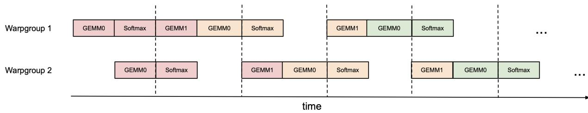
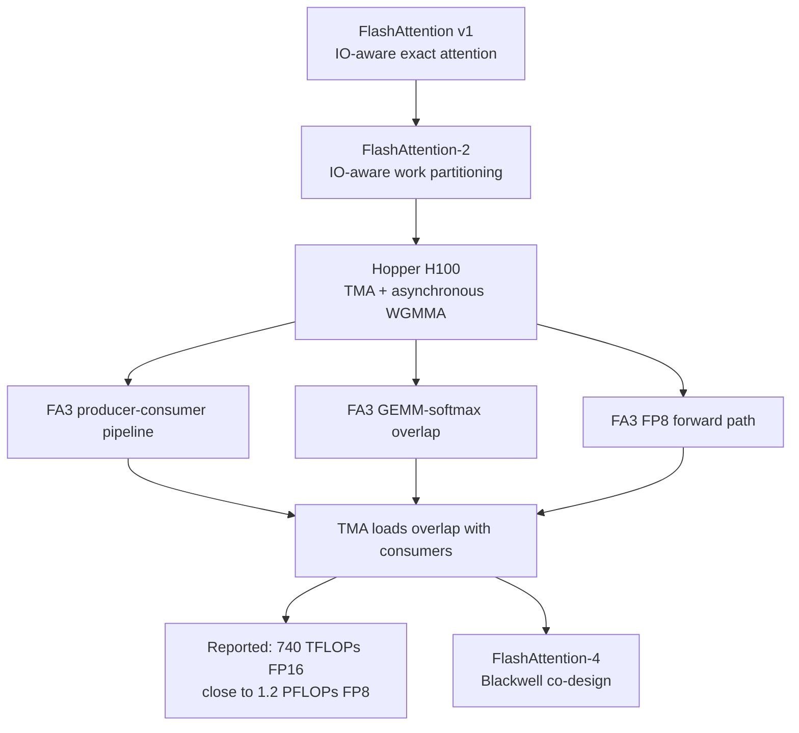
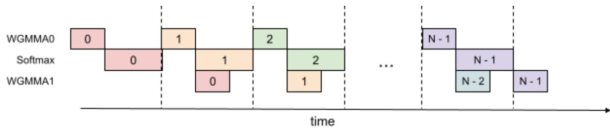

# FlashAttention-3: Hopper Asynchrony and FP8 Attention

**Paper:** FlashAttention-3: Fast and Accurate Attention with Asynchrony and Low-precision
**Authors:** Jay Shah, Ganesh Bikshandi, Ying Zhang, Vijay Thakkar, Pradeep Ramani, Tri Dao
**arXiv:** 2407.08608v2 - 12 Jul 2024

**Related pages:** [FlashAttention](flashattention.md), [FlashAttention-2](flashattention-2.md), [FlashAttention-4](flashattention-4.md)

## TL;DR

**What:** FlashAttention-3 redesigns exact attention for NVIDIA Hopper by treating asynchronous data movement and tensor-core execution as first-class algorithmic resources.
**How:** It separates TMA producers from WGMMA consumers, overlaps softmax with neighboring GEMMs, and adapts the forward path to [FP8](../../terms/fp8.md) with layout and quantization controls.
**The number:** On H100, it reports 1.5-2.0x faster FP16/BF16 forward attention than FlashAttention-2, 1.5-1.75x faster backward attention, up to 740 TFLOPs/s in FP16, and close to 1.2 PFLOPs/s in FP8 forward attention.

## The Big Picture

*Source: [FlashAttention-3, Figure 1](https://arxiv.org/abs/2407.08608v2). ① Warpgroup 1 and warpgroup 2 alternate between GEMM work and softmax. ② `GEMM0` computes the next score block and `GEMM1` updates the output from a neighboring block. ③ Barriers make the desired overlap more likely, so softmax uses a period when the other warpgroup is issuing tensor-core work.*

The figure shows the central scheduling idea rather than the full attention formula: FA3 tries to keep the high-throughput WGMMA path busy while the much slower softmax work runs on the other warpgroup.

## Why This Exists

Consider one long-context head on an H100 SXM5. FlashAttention-2 already avoids writing the full $N \times N$ attention matrix to [global memory](../../terms/global-memory.md), but its synchronous-looking loop still leaves tensor cores and softmax competing for different execution resources. The paper gives H100 throughput of about 989 TFLOPs/s for FP16 matmul versus 3.9 TFLOPs/s for special functions such as exponential. For FP16 attention with head dimension 128, matmul has 512 times as many FLOPs as exponential, while exponential has 256 times lower throughput, so softmax can consume about half of the cycle budget. FP8 doubles the matmul rate without doubling exponential throughput.

FA3 therefore targets the schedule, not the mathematical definition of attention:

| Hopper capability | Role in FA3 |
|---|---|
| TMA | Moves query, key, and value tiles from HBM to shared memory asynchronously. |
| Asynchronous WGMMA | Runs the two attention GEMMs without waiting for every scalar operation to finish. |
| Warp specialization | Assigns data movement and computation to different warps. |
| `setmaxnreg` | Gives register capacity to compute-heavy consumers and takes it from the producer. |
| FP8 tensor cores | Raises forward GEMM throughput when layout and numerical error are controlled. |

## The Landscape

The lineage is a progression from reducing memory traffic, to exposing more parallel work, to scheduling across specialized hardware units:

Editable source: [FA3 landscape diagram](./assets/fa3-landscape.mmd).

**Parent:** [FlashAttention-2](flashattention-2.md) supplies the exact tiled algorithm, query-outer loop, sequence parallelism, and log-sum-exp bookkeeping.

**Hardware neighbors:** ThunkerKitten and cuDNN 9 showed that Hopper-specific instructions and tile abstractions could improve attention, but the FA3 paper combines those ideas with an explicit producer-consumer and GEMM-softmax schedule.

**What changes at this point:** The main optimization target moves from HBM traffic and occupancy to overlap among TMA, WGMMA, and the scalar or special-function work around softmax.

## The Core Idea

FA3 makes attention a staged assembly line. One group of warps keeps fetching tiles, two groups take turns running matrix multiplies and softmax, and barriers hand each tile to the next stage only when its data is ready. The output is still the exact tiled attention result in FP16/BF16; FP8 adds a controlled low-precision path whose layout and scaling are part of the algorithm rather than an afterthought.

## Symbol Map

The superscript $(j)$ marks the key/value tile currently being processed, while the subscript $i$ marks the query and output tile owned by one CTA. `SS-GEMM` means both WGMMA inputs come from shared memory; `RS-GEMM` means one input is in registers.

| Symbol | Human name | Shape or scope | Plain meaning |
|---|---|---|---|
| $Q_i$ | query tile | $B_r \times d$ | The query rows assigned to one CTA. |
| $K_j$, $V_j$ | key/value tiles | $B_c \times d$ | The streamed context tiles for one inner-loop iteration. |
| $S_i^{(j)}$ | score tile | $B_r \times B_c$ | The local product $Q_i K_j^T$. |
| $\widetilde{P}_i^{(j)}$ | unnormalized probability tile | $B_r \times B_c$ | Exponentiated scores after subtracting the running row maximum. |
| $O_i$ | output tile | $B_r \times d$ | The running attention numerator, normalized at the end. |
| $m_i$, $\ell_i$ | online softmax state | one value per query row | Running maximum and max-subtracted exponential sum. |
| $L_i$ | log-sum-exp state | one value per query row | $m_i + \log(\ell_i)$, stored for backward recomputation. |
| `TMA` | Tensor Memory Accelerator | Hopper data path | Asynchronous HBM-to-SMEM movement. |
| `WGMMA` | warpgroup matrix multiply-accumulate | Hopper tensor-core instruction | Asynchronous GEMM used for $QK^T$ and $PV$. |

## Deep Dive

### Producer-consumer asynchrony

**What it does:** It assigns tile movement to producer warps and attention computation to consumer warps inside the same CTA.

**Why it matters:** A synchronous loop makes the consumer wait for loads and makes the producer wait for computation, leaving specialized hardware idle.

**How it works:**

1. The producer deallocates a planned number of registers with `setmaxnreg`, loads $Q_i$, and streams $K_j$ and $V_j$ into an $s$-stage circular shared-memory buffer with TMA.
2. Completion barriers notify consumers that each buffer stage is ready.
3. Consumers reallocate the released registers, run WGMMA and online softmax, and release each stage after its $K_j$ and $V_j$ data is no longer needed.

**The intuition:** The loader and calculator work on different tiles at the same time, like two workers passing trays through a small rotating shelf.

**A concrete example:** For the 8,192-token H100 head, the producer can fetch the next key/value tile while the consumers finish the current $Q_iK_j^T$ and $PV$ work; the circular buffer prevents the producer from overwriting a tile that consumers still own.

**Remember:** Warp specialization is the ownership rule that makes asynchronous overlap schedulable: producers move data, consumers compute.

### Ping-pong scheduling

**What it does:** It alternates two consumer warpgroups so one performs softmax while the other issues neighboring GEMMs.

**Why it matters:** Exponential and other non-GEMM operations are much slower than Hopper tensor-core matmul, so running them in a separate time window wastes the GPU.

**How it works:**

1. Barriers encourage warpgroup 1 to issue its `GEMM1` and the next `GEMM0` before warpgroup 2 enters the same critical section.
2. Warpgroup 1 then performs softmax while warpgroup 2 issues its GEMMs.
3. The roles swap on the next interval; the paper's Figure 1 shows the repeating schedule.

**The intuition:** One warpgroup keeps the tensor cores busy while the other pays the expensive scalar softmax cost, then they exchange jobs.

**A concrete example:** In the same H100 head, FP8 makes GEMM even faster relative to exponential, so ping-pong becomes more valuable rather than less: the softmax window is hidden under the other warpgroup's tensor-core work.

**Remember:** Ping-pong hides softmax by changing *which* warpgroup is active, not by making exponential itself faster.

### Two-stage WGMMA-softmax pipeline

*Source: [FlashAttention-3, Figure 2](https://arxiv.org/abs/2407.08608v2). ① `WGMMA0` starts the next score tile. ② Softmax consumes the score tile that is ready. ③ `WGMMA1` updates the output from the preceding probability tile. ④ The stages advance across the key/value loop.*

**What it does:** It overlaps the two GEMMs and softmax even within one consumer warpgroup by carrying a score tile across loop iterations.

**Why it matters:** The naive order `QK^T -> softmax -> PV` has true data dependencies, but the next score GEMM and the previous value GEMM can be in flight while scalar work proceeds.

**How it works:**

1. Issue $S_{next}=Q_iK_j^T$ with WGMMA and commit it without waiting.
2. Issue the preceding $PV$ WGMMA using the probability tile already computed.
3. Wait for $S_{next}$, compute its row maximum, exponentials, and normalizer, and keep it as the current stage.
4. Wait for the preceding $PV$ result, apply the online-softmax rescale, and rotate the stage buffers.

The second stage needs an extra score tile in registers. The paper also evaluates a three-stage variant, but more stages increase register pressure and make compiler scheduling harder.

**The intuition:** The kernel starts tomorrow's multiply before today's bookkeeping has finished, then joins the results at the next safe handoff.

**A concrete example:** While the H100 computes the $j+1$ score tile, the same warpgroup can finish the exponential and row sum for tile $j$ and retire the $PV$ update from tile $j-1$.

**Remember:** The speedup comes from pipelining across iterations; the score and probability dependencies are delayed, not ignored.

### FP8 layout conformance

**What it does:** It rearranges tiles so both fused GEMMs satisfy FP8 WGMMA's stricter operand layouts.

**Why it matters:** Inputs are commonly contiguous in the head dimension, but FP8 WGMMA accepts only the required `k-major` layout for the relevant shared-memory operands. The first GEMM's accumulator layout also does not automatically match the second GEMM's operand layout.

**How it works:**

1. Load $V$ in its ordinary layout and transpose each tile inside the kernel with LDSM/STSM instructions, avoiding a separate global-memory transpose.
2. Byte-permute the FP32 accumulator from the first WGMMA so it becomes a valid operand fragment for the second WGMMA.
3. Write the transposed $V$ tile with the matching row permutation, so the logical $PV$ product remains unchanged.

**The intuition:** FP8 is not just a smaller data type; it changes the physical arrangement that the tensor-core instruction will accept.

**A concrete example:** For the same $Q_iK_j^T$ then $PV$ pair, FA3 changes the in-kernel $V_j$ layout and the intermediate accumulator layout instead of materializing a separately transposed $V$ tensor in HBM.

**Remember:** The FP8 path must make the output layout of GEMM 1 legal as the input layout of GEMM 2.

### FP8 accuracy controls

**What it does:** It reduces FP8 error caused by outlier features while preserving the attention score geometry.

**Why it matters:** FP8 e4m3 has fewer mantissa and exponent bits than FP16/BF16, and one tensor-wide scale lets a few outliers waste the available range for most values.

**How it works:**

| Technique | Operation | Effect |
|---|---|---|
| Block quantization | Keep one scale for each $Q$, $K$, or $V$ block. | Uses the natural attention tiles to fit each local value range more closely. |
| Incoherent processing | Multiply both $Q$ and $K$ by the same orthogonal matrix $M$ before quantization. | Since $(QM)(KM)^T=QK^T$, the scores are unchanged before rounding while outliers are spread across features. |

The paper uses products of random sign diagonals and a Hadamard matrix so the transform costs $O(d\log d)$ rather than $O(d^2)$ and can be fused with rotary embedding.

**The intuition:** Block scales spend precision locally, while an orthogonal rotation spreads a spike across coordinates without changing the dot product in exact arithmetic.

**A concrete example:** In the paper's outlier-stress test, the combined block-quantized and incoherently processed FP8 path reaches RMSE $9.1\times10^{-3}$ versus $2.4\times10^{-2}$ for the per-tensor FP8 baseline.

**Remember:** FP8 speed requires both legal instruction layouts and a quantization strategy; either one alone is incomplete.

### Backward warp specialization

**What it does:** It extends the producer-consumer split with a separate writer for the locally computed $dQ$ tile.

**Why it matters:** Backward attention has five MMAs and several reductions. If the same consumers also wait for every global $dQ$ atomic update, the next matrix multiply stalls.

**How it works:**

1. Producers load $K_j$, $V_j$, then stream $Q_i$ and $dO_i$ through a circular shared-memory buffer.
2. Consumers recompute $S_i^{(j)}$ and $P_i^{(j)}$ from $L_i$, form $dP$, $dS$, $dV$, and $dK$, and write a local $dQ$ tile to shared memory.
3. A dQ-writer warp waits for that local tile and atomically adds it to global $dQ$ using the paper's semaphore protocol.

**The intuition:** The compute warps hand off reduction work instead of stopping their matrix-multiply pipeline to perform it.

**A concrete example:** During the backward pass for the same long head, a consumer can move on to the next $K_j,V_j$ tile after publishing local $dQ$; the writer handles the contended global update separately.

**Remember:** FA3's backward contribution is an asynchronous role split around the existing exact gradient computation, while its most detailed two-stage overlap is presented for forward attention.

## Putting It Together

The following trace follows one query tile $Q_i$ from an 8,192-token, head-dimension-128 H100 attention head. The optional FP8 actions are shown at the point where layout and scaling matter.

| Step | Actor | Input state | Action | Output state |
|---:|---|---|---|---|
| 1 | Producer warpgroup | $Q_i$, $K_j$, $V_j$ in HBM; circular SMEM stage free | TMA-loads $Q_i$ and streams $K_j,V_j$ into the next stage; signals barriers. | Consumer-visible tiles in SMEM. |
| 2 | Consumer warpgroup 1 | Ready $Q_i,K_j$ | Issues WGMMA for $S_i^{(j)}=Q_iK_j^T$ and commits the asynchronous operation. | Score tile in the current pipeline stage. |
| 3 | Consumer warpgroup 2 | A neighboring score or probability tile | Issues the neighboring `GEMM0`/`GEMM1` pair while warpgroup 1 owns the softmax window. | Tensor-core work overlaps scalar work. |
| 4 | Active consumer | Score tile and online state $(m_i,\ell_i)$ | Computes row max, exponentials, row sum, and the next online-softmax state; the two-stage path keeps the next score tile in flight. | $\widetilde{P}_i^{(j)}$ and updated normalizer. |
| 5 | Consumer warpgroup | Probability tile and $V_j$ | Issues $PV$ WGMMA, applies the needed numerator rescale, and rotates the pipeline buffers. | Updated output numerator $O_i$. |
| 6 | FP8 forward path, if selected | $Q,K,V$ with outlier-prone features | Uses block scales, the orthogonal transform for $Q,K$, in-kernel $V$ transpose, and accumulator permutation. | Legal FP8 WGMMA operands with controlled error. |
| 7 | Epilogue | Final $O_i$, $m_i$, $\ell_i$ | Divides the output numerator by $\ell_i$, computes $L_i=m_i+\log(\ell_i)$, and writes only $O_i,L_i$ to HBM. | Exact-attention FP16/BF16 output and backward metadata. |

## What This Buys You

### The headline claim

On H100, FA3 turns Hopper's asynchronous hardware into a useful attention-level pipeline: the paper reports large gains over FA2 without changing the exact-attention result in FP16/BF16, and it makes FP8 forward attention practical enough to approach a different throughput regime.

### How we know: H100 attention benchmarks

| Evidence | Reported result |
|---|---|
| FP16/BF16 forward | 1.5-2.0x faster than FlashAttention-2; up to 740 TFLOPs/s, about 75% of H100 theoretical peak. |
| FP16/BF16 backward | 1.5-1.75x faster than FlashAttention-2. |
| Standard attention baseline | Up to 3-16x faster in the tested settings. |
| FP8 forward | Close to 1.2 PFLOPs/s. |
| Pipeline ablation | 661 TFLOPs/s with both techniques, versus 582 without GEMM-softmax pipelining and 570 without warp specialization. |
| FP8 numerical test | RMSE $9.1\times10^{-3}$ with both controls versus $2.4\times10^{-2}$ for the per-tensor FP8 baseline, a 2.6x reduction. |

The experiments use an H100 80 GB SXM5, sequence lengths from 512 to 16K, total tokens fixed at 16K by changing batch size, and head dimensions 64, 128, or 256. For sequences of 1K and above, the paper reports that FP16 FA3 surpasses its cuDNN comparison in the tested settings, while FP8 is competitive.

### The mechanism behind the numbers

The gains are complementary. TMA and warp specialization remove load/compute waiting; ping-pong schedules softmax under the other warpgroup's tensor-core work; the two-stage pipeline removes a second dependency bubble; and FP8 raises the GEMM ceiling after layout and quantization are repaired. The ablation is important because it attributes the 570-to-661 TFLOPs/s change to the two scheduling ideas rather than to a single Hopper instruction.

### How to read these numbers

> **Warning:** These are attention-kernel throughput results, not an unconditional end-to-end model speedup. The FP8 number also belongs to a lower-precision path with different numerical error, and the comparisons depend on sequence length, head dimension, causal masking, and the chosen baseline.

## Where It Breaks

| Failure mode | When it happens | Impact |
|---|---|---|
| Hopper-specific instruction set | The target lacks TMA, asynchronous WGMMA, or Hopper's warpgroup register controls. | The schedule and layout assumptions do not transfer directly; the FA2-style path is the portable fallback. |
| Register pressure | The two-stage pipeline, larger tiles, or FP8 fragments need more registers than the CTA can sustain. | Spills or smaller tiles can erase the intended overlap. |
| Compiler schedule drift | The compiler reorders the idealized instruction sequence differently from the pseudocode. | WGMMA and softmax overlap can weaken even when the algorithm is logically correct. |
| FP8 outliers or strict accuracy requirements | Activations are outlier-heavy, block scales are unavailable, or the application cannot accept the FP8 error profile. | Use the FP16/BF16 path or retain the full block quantization and incoherent-processing controls. |
| Inference-oriented deployment | The workload needs a persistent, decode-focused kernel rather than a training-oriented pipeline. | The paper identifies persistent FP8 inference integration and broader LLM inference optimization as open work. |
| Large-scale low-precision training | FP8 attention is used in a full large-model training run. | The paper does not establish its behavior across all such optimization and convergence regimes. |

## One Thing to Remember

**On Hopper, attention is a scheduling problem as much as an IO problem.** FA3 keeps the exact tiled algorithm, then fills the GPU's asynchronous pipeline by assigning data movement, WGMMA, and softmax to stages that can run at the same time; FP8 works only after its physical layouts and numerical range are designed into that schedule.

## Go Deeper

- **Read:** [FlashAttention-3 paper, arXiv:2407.08608v2](https://arxiv.org/abs/2407.08608v2)
- **Build on:** [FlashAttention-2](flashattention-2.md) for the synchronous baseline and [FlashAttention-4](flashattention-4.md) for the next generation's non-MMA bottleneck response.
- **Understand the context:** [General Matrix Multiply (GEMM)](../../terms/gemm.md), [FP8](../../terms/fp8.md), [Global Memory](../../terms/global-memory.md), and [Matrix Tiling](../../terms/matrix-tiling.md).
- **Reproduce:** [Dao-AILab/flash-attention](https://github.com/Dao-AILab/flash-attention).
