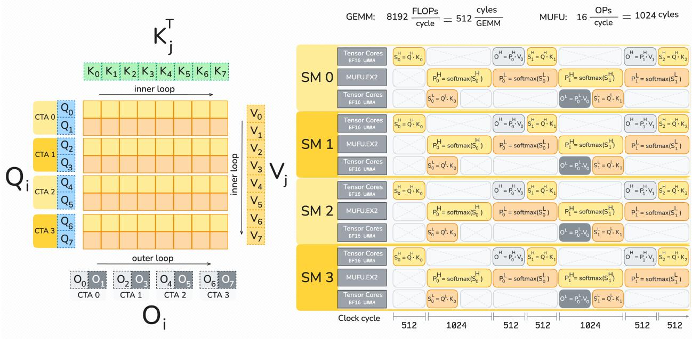
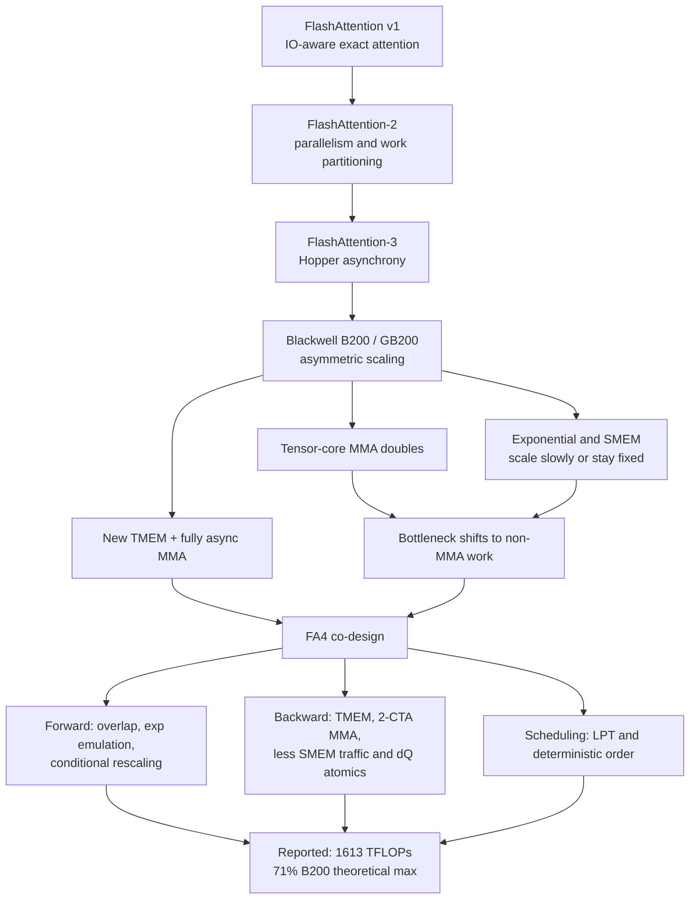
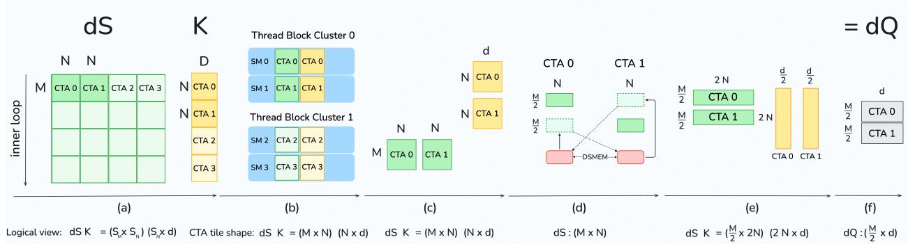
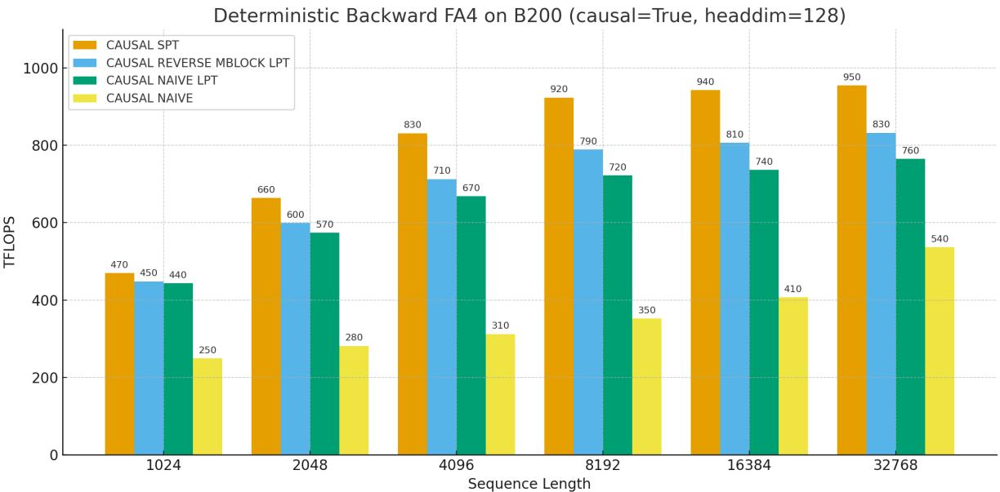

# FlashAttention-4: Blackwell Attention Kernel Co-Design

**Paper:** FlashAttention-4: Algorithm and Kernel Pipelining Co-Design for Asymmetric Hardware Scaling
**Authors:** Ted Zadouri, Markus Hoehnerbach, Jay Shah, Timmy Liu, Vijay Thakkar, Tri Dao
**arXiv:** 2603.05451v1 - 5 Mar 2026

**Related pages:** [FlashAttention](flashattention.md), [FlashAttention-2](flashattention-2.md), [FlashAttention-3](flashattention-3.md), [vLLM: PagedAttention Serving Framework](../../frameworks/vllm/vllm-framework.md), [NVFP4: Blackwell 4-Bit Floating Point](../../hardware/quantization/nvfp4.md)

## TL;DR

**What:** FlashAttention-4 co-designs exact attention and its kernel pipeline for NVIDIA Blackwell, where tensor-core throughput grows faster than softmax and shared-memory throughput.
**How:** It overlaps large asynchronous MMA tiles with softmax in TMEM, moves some exponentials to FMA and integer units, skips small online-softmax rescalings, and uses 2-CTA backward plus load-balanced scheduling.
**The number:** The paper reports up to 1613 TFLOPs/s, about 71% of the B200 theoretical maximum, with 1.1-1.3x speedup over cuDNN 9.13 and 2.1-2.7x over Triton in the reported forward settings.

## The Big Picture

*Source: [FlashAttention-4, Figure 1](https://arxiv.org/abs/2603.05451v1). ① The query block is split into high and low tiles, each with its own score, probability, and output work. ② Tensor cores execute asynchronous BF16 MMA while the MUFU path handles exponentials for another tile. ③ A correction warpgroup moves output rescaling away from the main MMA-softmax critical path. ④ The pipeline is sized around the actual B200 resource rates, not around a uniform FLOP model.*

The figure is the page's main mental model: FA4 is a resource schedule in which the kernel deliberately places different parts of attention on different Blackwell units.

## Why This Exists

Take the paper's representative forward tiles on Blackwell. For a $128^3$ tile, MMA compute and the exponential unit each take about 1024 cycles while shared-memory reads take 768 cycles. For a larger $256 \times 128^2$ tile, MMA and exponentials each take 2048 cycles and shared memory takes 1536 cycles. The tensor cores are no longer the only obvious limiter, so simply porting the Hopper kernel leaves a long softmax or memory tail behind the MMA work.

The backward imbalance is sharper. At $M=N=d=128$, the paper estimates 2560 cycles of MMA work, 1024 cycles of exponential work, and 3328 cycles of shared-memory traffic. FA4's design follows those two observations:

| Resource or feature | Blackwell fact used by FA4 |
|---|---|
| BF16 MMA | 8192 operations per clock per SM, about twice Hopper's rate. |
| MUFU exponential | 16 operations per clock per SM on B200/GB200, the same as Hopper in the paper's model. |
| Shared memory | About 128 bytes per clock per SM in the paper's measurement. |
| TMEM | 256 KB per SM for tensor-core accumulator storage, allocated in 16 KB / 32-column granules. |
| MMA tile | 128 x N tiles, larger than Hopper's 64 x N pattern. |
| 2-CTA MMA | A CTA pair stages complementary operands and partitions the output tile. |

## The Landscape

The FlashAttention line evolves from reducing HBM traffic, to exposing more parallel work, to balancing increasingly asymmetric on-chip resources:

Editable source: [FA4 landscape diagram](./assets/fa4-landscape.mmd).

**Parent:** [FlashAttention-3](flashattention-3.md) contributes the warp-specialized, asynchronous execution model. FA4 keeps that spirit but moves accumulators into TMEM and targets Blackwell's 128 x N MMA and 2-CTA features.

**Siblings:** SageAttention explores low-precision attention on other GPU targets; Triton and Gluon provide programmable kernel alternatives; cuDNN provides vendor-tuned attention. They are comparison points, not interchangeable implementations of FA4's pipeline.

**What changes at this point:** The bottleneck question becomes "which non-MMA operation is exposed when MMA gets faster?" FA4 answers with a different intervention for each resource: software exponential, fewer rescalings, TMEM overlap, reduced shared-memory traffic, and a better CTA order.

## The Core Idea

FA4 treats attention as work shared among unequal machines. It stores more intermediate results in Blackwell's TMEM, lets large MMAs run asynchronously, uses ordinary arithmetic units to take some pressure off the exponential unit, and orders tiles so long or contended work starts early. The attention formula stays exact; the novelty is the order, location, and ownership of each intermediate operation.

## Symbol Map

Here $M$ and $N$ are tile sizes along the query and key sequence dimensions, while $d$ is the head or reduction dimension. A superscript such as $H$ or $L$ identifies the high or low query tile in the forward pipeline; `dX` means the gradient of `X`.

| Symbol | Human name | Shape or scope | Plain meaning |
|---|---|---|---|
| $Q$, $K$, $V$ | query, key, value | $N \times d$ per head | Inputs to exact attention. |
| $S$, $P$, $O$ | scores, probabilities, output | $N \times N$, $N \times N$, $N \times d$ | The attention intermediates and result. |
| $M$, $N$, $d$ | query tile, key tile, head dimension | per MMA tile | Dimensions used in the roofline and tile schedule. |
| $dQ$, $dK$, $dV$ | input gradients | same logical scope as $Q,K,V$ | Backward-pass updates. |
| $\tau$ | rescaling threshold | scalar | The maximum-update threshold below which intermediate output rescaling is deferred. |
| `SMEM` | shared memory | CTA-local | Stages operands and communicates within a CTA. |
| `TMEM` | tensor memory | SM-local, 256 KB in the paper's model | Holds asynchronous MMA accumulators without consuming the register file. |
| `DSMEM` | distributed shared memory | CTA-cluster scope | Exchanges a partial tile between the two CTAs in 2-CTA backward. |
| `1-CTA`, `2-CTA` | MMA execution modes | one CTA or a paired CTA cluster | Selects how an MMA tile and its operands are partitioned. |
| `LPT` | longest-processing-time first | grid scheduling policy | Starts longer worktiles earlier to reduce the final tail. |

## Deep Dive

### Forward TMEM pipeline

*Source: [FlashAttention-4, Figure 1](https://arxiv.org/abs/2603.05451v1). The source's high/low tile labels are retained; the resource rows show why the two tiles can cover one another's softmax and MMA work.*

**What it does:** It runs two output tiles per thread block and uses TMEM to keep their accumulators available while MMA and softmax proceed asynchronously.

**Why it matters:** Hopper's register-held accumulators impose ordering and register constraints that become more costly when Blackwell MMA tiles grow to 128 x 128.

**How it works:**

1. A tensor-core/TMA warpgroup drives the asynchronous MMA and tile movement.
2. Two softmax warpgroups load full rows, compute maxima, exponentials, conversions, and sums, and avoid the inter-warp shuffle pattern used by the Hopper layout.
3. The $P$ tiles move through TMEM, allowing a separate correction warpgroup to apply output rescaling outside the main critical path.
4. The remaining TMEM space is partitioned so two output tiles coexist with score/probability storage; the paper chooses an aliasing arrangement that can start with two score tiles.

**The intuition:** TMEM is a waiting room for tensor-core results, so softmax can consume one tile while tensor cores produce another without forcing every accumulator through registers.

**A concrete example:** In the $128^3$ forward case, while one tile occupies MMA, the other tile's softmax can use the MUFU and scalar resources; this is why the source Figure 1 shows separate resource rows rather than one serial timeline.

**Remember:** FA4's forward pipeline is shaped by TMEM capacity and resource overlap, not just by choosing a larger GEMM tile.

### Software-emulated exponentials

**What it does:** It evaluates some $2^x$ operations with FMA and integer instructions so the MUFU exponential unit is not the only path through softmax.

**Why it matters:** On B200/GB200, the paper models 8192 MMA operations per clock per SM but only 16 MUFU operations, making exponentials visible in the critical path.

**How it works:**

$$
2^x = 2^{\lfloor x \rfloor} 2^{x-\lfloor x \rfloor}
$$

1. Clamp the input to avoid underflow.
2. Extract $\lfloor x \rfloor$ with a round-down and bit-manipulation sequence.
3. Approximate $2^{x-\lfloor x\rfloor}$ on $[0,1)$ with a polynomial evaluated by Horner-style FMAs.
4. Recombine the integer power through the IEEE 754 exponent field.

The degree-3 polynomial already matches the BF16-rounded error regime in the paper's test; higher degrees mainly improve the raw FP32 approximation.

| Approximation | FP32 max relative error | BF16 max relative error after rounding |
|---|---:|---:|
| Hardware `MUFU.EX2` | 1.41e-7 | 3.89e-3 |
| Degree 3 polynomial | 8.77e-5 | 3.90e-3 |
| Degree 4 polynomial | 3.05e-6 | 3.89e-3 |
| Degree 5 polynomial | 1.44e-7 | 3.89e-3 |

**The intuition:** When one specialist unit is scarce, approximate its work with plentiful general arithmetic, then let both paths run in parallel.

**A concrete example:** In the $256 \times 128^2$ forward tile, the exponential work is estimated at 2048 cycles. Moving part of that work to FMA and integer units gives the asynchronous MMA pipeline another way to make progress.

**Remember:** The emulation is a throughput trade: BF16 rounding hides much of the polynomial error, but extra instructions and registers mean it should not be applied blindly to every entry.

### Conditional online-softmax rescaling

**What it does:** It defers small running-maximum corrections and performs them only when the new maximum exceeds a threshold.

**Why it matters:** Online softmax normally multiplies the whole partial output vector whenever a later block raises the row maximum, adding expensive non-MMA work to every block transition.

**How it works:** Let $m_j$ be the new block maximum and $m_{j-1}$ the tracked maximum. FA4 follows the source's rule:

$$
O_j =
\begin{cases}
\exp(m_{j-1}-m_j)O_{j-1} + \exp(S_j-m_j)V_j, & m_j-m_{j-1}>\tau,\\
O_{j-1} + \exp(S_j-m_{j-1})V_j, & m_j-m_{j-1}\leq\tau.
\end{cases}
$$

The paper typically sets $\tau=\log_2(256)=8$. In the second branch, the kernel keeps enough statistics to normalize by the true final maximum and normalizer at the end; the deferred correction is therefore bookkeeping, not an approximation to the attention formula.

**The intuition:** Do not rescale a long vector for a tiny change that the final normalization can absorb; spend the vector operation only when the change is materially large.

**A concrete example:** If the next $K_j$ block raises a row maximum by less than the threshold, FA4 adds its exponentials relative to the old maximum and leaves the accumulated output vector untouched until the final correction.

**Remember:** Skipping the intermediate vector multiply is correct only when the deferred scaling statistics are tracked consistently.

### TMEM backward pipeline

*Source: [FlashAttention-4, Figure 2](https://arxiv.org/abs/2603.05451v1). ① The prologue reconstructs the first score and probability state. ② The main loop overlaps score, gradient, and reduction work across iterations. ③ The tail finishes the $dK$ and $dQ$ updates.*

**What it does:** It uses TMEM to keep multiple accumulator tiles live while the five backward MMAs and softmax-gradient operations are reordered.

**Why it matters:** Backward attention has more MMAs and more intermediate movement than forward attention. Register-held accumulators in FA3 force a nearly serial `S -> dP -> dV -> dQ -> dK` order.

**How it works:**

1. Recompute $S$ and $P$ from $Q$, $K$, and the saved log-sum-exp state.
2. Form $dP$, $dS$, and the five matrix products for $dV$, $dK$, and $dQ$ in a schedule that overlaps elementwise work with MMAs from another iteration.
3. Alias TMEM deliberately: in the 1-CTA schedule, $S$ and $P$ share one region, while $dP$, $dS$, and $dQ$ share another; $dV$ and $dK$ need their own accumulation space.

**The intuition:** More on-chip accumulator capacity turns a forced dependency chain into a graph with several live branches.

**A concrete example:** At $M=N=d=128$, the source estimates 3328 cycles of shared-memory traffic against 2560 cycles of MMA. TMEM cannot remove that traffic by itself, but it lets the kernel hide more of it behind independent MMA and softmax work.

**Remember:** TMEM's main backward benefit is schedule freedom; it is not merely a larger register file.

### 2-CTA backward and $dQ$

*Source: [FlashAttention-4, Figure 3](https://arxiv.org/abs/2603.05451v1). ① Each CTA owns half of the output rows. ② DSMEM exchanges the missing half of $dS$. ③ Each CTA then forms a full doubled reduction for its $dQ$ slice.*

**What it does:** It pairs two CTAs so each stages only half of one operand and writes only its portion of the output accumulator.

**Why it matters:** In the 1-CTA backward roofline, shared-memory traffic is the dominant resource. The same decomposition can also reduce the number of contending global $dQ$ atomics.

**How it works:**

1. For most MMAs, the pair uses a $256 \times 128$ tile; each CTA stages half of operand $B$ and owns half of the output in the $M$ dimension.
2. The $dQ$ reduction naturally needs a doubled reduction dimension, so a simple output split is not enough.
3. The CTAs exchange half of $dS$ through DSMEM, repack it into each CTA's row slice, and run the paired MMA with the full $2N$ reduction.
4. Each CTA writes half of $dQ$, which halves the global atomic reductions compared with the 1-CTA counterpart.

The roofline table in the paper reports total shared-memory cycles falling from 3328 in 1-CTA mode to 2688 in the representative 2-CTA mode. The `dQ` MMA is a special case in that comparison: it uses a smaller output tile with a doubled reduction.

**The intuition:** Two CTAs share the operand staging burden and exchange only the partial information needed to make each local gradient complete.

**A concrete example:** For the same $dS K$ update, CTA 0 owns the first half of rows and CTA 1 the second half; DSMEM supplies the complementary reduction fragments before the pair writes its two $dQ$ slices.

**Remember:** 2-CTA reduces traffic and atomics, but it also imposes a fixed CTA pairing and cluster-level execution contract.

### Deterministic backward

*Source: [FlashAttention-4, Figure 7](https://arxiv.org/abs/2603.05451v1). The chart compares causal SPT, reverse-mblock LPT, naive LPT, and naive ordering on B200.*

**What it does:** It serializes inter-CTA reductions with semaphore locks so repeated runs use a predefined update order.

**Why it matters:** Global atomic accumulation into $dQ$ is nondeterministic, which is undesirable for reproducible training and debugging.

**How it works:**

1. A CTA acquires the semaphore for its shared gradient tile in the prescribed order.
2. It performs the reduction, uses the required visibility fence, and releases the lock.
3. Batch/head swizzling and a causal traversal beginning at the diagonal reduce the time later CTAs spend waiting for the first write.

The source calls the causal lock order a shortest-processing-time-first (SPT) schedule in this deterministic context. That lock order and the general LPT grid policy are related load-balancing ideas, but they are not the same ordering rule.

**The intuition:** Determinism turns a race into a queue; careful queue order keeps the queue from becoming the entire kernel.

**A concrete example:** For causal backward on B200, the paper's best deterministic schedule reaches up to 75% of the speed of the nondeterministic 1-CTA backward pass.

**Remember:** Deterministic mode is a reproducibility contract with a measurable synchronization cost.

### LPT scheduling for imbalanced grids

**What it does:** It launches longer-running attention worktiles earlier, while preserving enough batch/head locality for the L2 cache.

**Why it matters:** In causal attention, later query blocks see more valid keys than earlier blocks. In variable-length or mixed prefill/decode batches, worktile lengths differ even without a causal diagonal.

**How it works:**

1. Keep batches outermost and divide heads into L2-sized swizzled sections.
2. Traverse `mblocks` in reverse order so longer causal work starts earlier.
3. For MQA/GQA, process all query heads for a KV head before changing `mblocks`.
4. For variable length, optionally sort batches in a preprocessing kernel by maximum worktile time and cache the virtual-to-actual batch map.

The paper reports 4-8% FLOPs gains for MHA and 7-14% for MQA in the measured H200 scheduling experiment.

**The intuition:** A GPU finishes when the last CTA finishes, so starting the longest CTAs early matters more than giving every CTA the same nominal tile count.

**A concrete example:** With a causal 32K sequence, a reverse `mblock` order places the work-rich diagonal-side tiles before short nearly masked tiles, reducing the final SM tail without throwing away KV-head locality.

**Remember:** LPT is cache-aware load balancing, not just sorting all grid coordinates by duration.

### CuTe-DSL as a kernel framework

**What it does:** It expresses FA4 in Python-embedded CuTe-DSL, lowers it to PTX, and keeps direct access to low-level instructions without CUDA C++ template metaprogramming.

**Why it matters:** Attention variants otherwise require many architecture- and shape-specific kernels, and compile time slows down the iteration loop for each one.

**How it works:**

1. Write composable masking, block-sparse, variable-length, and scheduling primitives in CuTe-DSL.
2. Use PTX escape hatches for capabilities not yet wrapped by the DSL.
3. JIT-compile a specialized kernel and let `ptxas` produce the final SASS.

| Method | Forward compile | Backward compile |
|---|---:|---:|
| FlashAttention-3 | 55 s | 45 s |
| FlashAttention-4 | 2.5 s | 1.4 s |
| FA4 speedup | 22x | 32x |

**The intuition:** The language is part of the performance story because faster specialization makes it practical to explore the schedule itself.

**A concrete example:** A new block-sparse or FlexAttention-like variant can reuse FA4's common primitives instead of rebuilding the entire Blackwell pipeline in C++ templates.

**Remember:** FA4 contributes a reusable kernel construction framework as well as one high-performance attention implementation.

## Putting It Together

This trace follows a BF16 causal training step on a B200-style target with 32K total tokens and head dimension 128.

| Step | Actor | Input state | Action | Output state |
|---:|---|---|---|---|
| 1 | LPT scheduler | Causal grid with short and long worktiles | Keeps batches outermost, swizzles heads by cache-sized sections, and visits `mblocks` in reverse order. | Long and cache-friendly CTAs enter the grid early. |
| 2 | Forward producer/TMA stage | $Q$, $K$, $V$ in global memory | Stages operands for two query tiles while asynchronous MMA begins. | Two TMEM-backed score/output pipelines are live. |
| 3 | Softmax warpgroups | Score tile $S$ and running statistics | Computes row maxima and $2^x$ values; some exponentials use FMA/integer emulation and small rescalings are deferred under $\tau$. | Probability tile $P$ and corrected statistics. |
| 4 | Tensor cores and correction warpgroup | $P$, $V$, TMEM accumulators | Executes $PV$ MMA for one tile while another tile's softmax proceeds; applies output correction separately. | Forward output tile $O$. |
| 5 | Backward 2-CTA pair | $Q$, $K$, $V$, $O$, $dO$, saved LSE | Recomputes $S/P$, forms $dS$, exchanges partial $dS$ through DSMEM, and runs paired MMAs for $dQ$, $dK$, and $dV$. | Gradient slices with fewer shared-memory reads and fewer $dQ$ atomics. |
| 6 | Deterministic reduction, if requested | Contended global gradient tiles | Acquires semaphores in the chosen order, performs each update, and releases the lock. | Reproducible gradient accumulation with lower throughput. |
| 7 | CuTe-DSL runtime | Shape, mask, and scheduling specialization | JIT-compiles the selected kernel variant to PTX and SASS. | A reusable Blackwell kernel rather than a one-off formula translation. |

## What This Buys You

### The headline claim

FA4 moves the performance frontier by addressing the units that Blackwell did not accelerate in proportion to tensor cores. The result is a faster forward kernel on the paper's B200 comparisons and a backward path that spends less time moving operands and reducing $dQ$.

### How we know: Blackwell benchmarks and ablations

| Evidence | Reported result |
|---|---|
| Best BF16 forward throughput | Up to 1613 TFLOPs/s, about 71% of the B200 theoretical maximum. |
| Forward versus cuDNN 9.13 | 1.1-1.3x faster in the reported settings. |
| Forward versus Triton | 2.1-2.7x faster in the reported settings. |
| Sequence-length regime | Gains are most consistent at medium and long lengths, especially 4K and above; causal gains benefit from LPT scheduling. |
| Backward | Consistent speedups across long sequences and causal masking; the roofline's shared-memory estimate falls from 3328 to 2688 cycles in the representative 2-CTA comparison. |
| Deterministic backward | Up to 75% of the nondeterministic 1-CTA backward speed in the source's comparison. |
| Single-kernel compilation | 22x faster forward compilation and 32x faster backward compilation than the FA3 comparison. |
| Scheduling ablation | 4-8% FLOPs gain for MHA and 7-14% for MQA in the measured H200 scheduling experiment. |

The main benchmark uses BF16 inputs, sequence lengths from 1K to 32K with total tokens fixed at 32K, head dimensions 64, 128, and `(192, 128)`, and both causal and non-causal attention. The `(192, 128)` case matches the asymmetric query/key-value dimensions used by DeepSeek-V3-style attention.

### The mechanism behind the numbers

Forward gains come from covering softmax with asynchronous MMA, reducing MUFU pressure with software exponentials, and avoiding most small output rescalings. Backward gains come from TMEM-held intermediates, overlap across the five-MMAs graph, 2-CTA operand staging, and half as many global $dQ$ atomics. LPT scheduling matters most when the grid is inherently uneven; CuTe-DSL matters when many shape and masking variants must be compiled and iterated.

### How to read these numbers

> **Warning:** The paper's main text labels the experiments as B200 benchmarks, but Appendix A.1 says the measured system is a B100 180 GB SXM6 at 1000 W. The page preserves the main-text B200 claims and records the appendix inconsistency rather than silently choosing one hardware name.

The paper also notes that newer cuDNN versions incorporated several FA4 techniques and can reach similar performance. The comparison is therefore a dated implementation snapshot, not a permanent vendor ranking.

## Where It Breaks

| Failure mode | When it happens | Impact |
|---|---|---|
| Blackwell-specific hardware contract | The target lacks TMEM, 128 x N asynchronous MMA, 2-CTA MMA, or cluster DSMEM. | The pipeline cannot be transplanted directly; FA3 is the closer Hopper fallback. |
| TMEM capacity and aliasing | A shape needs more live accumulator tiles than the chosen TMEM partition can hold. | The schedule must spill, reload, or serialize stages, reducing overlap. |
| Exponential emulation trade-off | Register pressure, FMA latency, or the application's error tolerance makes polynomial work too expensive. | Keep more work on MUFU or use a higher-precision path, giving back some throughput. |
| 2-CTA pairing constraints | CTAs cannot be launched as fixed active pairs in one cluster or the kernel mixes incompatible tensor-memory modes. | The shared-memory and atomic-reduction savings are unavailable. |
| Deterministic reduction stalls | Many CTAs contend for the same gradient tile or the lock order is poorly matched to work duration. | Reproducibility costs throughput and can create long semaphore waits. |
| LPT overhead or weak imbalance | Very short or already balanced grids have few tiles to reorder; variable-length metadata changes frequently. | Sorting and scheduling logic adds complexity without a meaningful tail reduction. |
| Benchmark provenance ambiguity | The B200/B100 hardware naming differs between main text and appendix, or cuDNN has absorbed the techniques. | Reported ratios should be treated as source-scoped measurements, not universal hardware constants. |

## One Thing to Remember

**Blackwell makes the rest of attention visible.** Once tensor cores double, the practical path to faster exact attention is to overlap or replace the now-exposed softmax, shared-memory, and reduction work; FA4 packages that idea into TMEM and 2-CTA pipelines, cache-aware scheduling, and a faster kernel language.

## Go Deeper

- **Read:** [FlashAttention-4 paper, arXiv:2603.05451v1](https://arxiv.org/abs/2603.05451v1)
- **Build on:** [FlashAttention-3](flashattention-3.md) for Hopper's producer-consumer pipeline and [FlashAttention-2](flashattention-2.md) for the work-partitioning baseline.
- **Understand the context:** [General Matrix Multiply (GEMM)](../../terms/gemm.md), [Matrix Tiling](../../terms/matrix-tiling.md), [Global Memory](../../terms/global-memory.md), and [NVFP4: Blackwell 4-Bit Floating Point](../../hardware/quantization/nvfp4.md).
- **System-level contrast:** [PagedAttention](../../terms/pagedattention.md) and [vLLM: PagedAttention Serving Framework](../../frameworks/vllm/vllm-framework.md) manage KV-cache memory and serving, while FA4 optimizes the attention kernel itself.
- **Reproduce:** [Dao-AILab/flash-attention](https://github.com/Dao-AILab/flash-attention/tree/main/flash_attn/cute).
