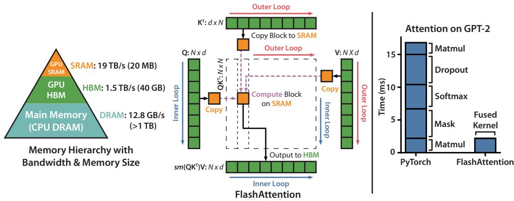
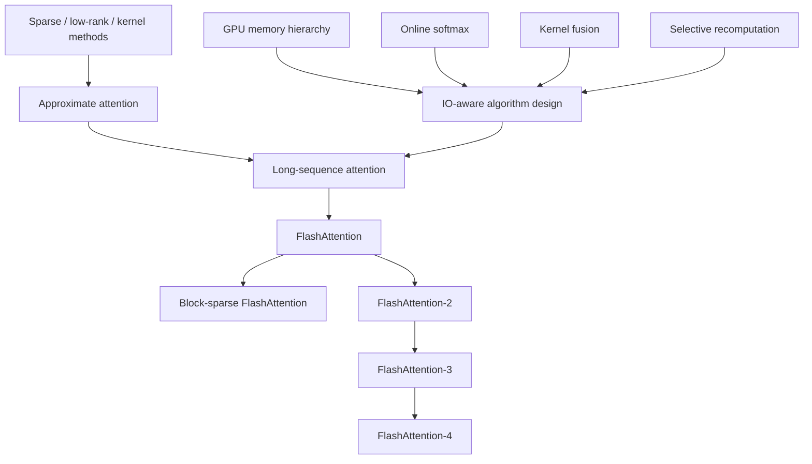
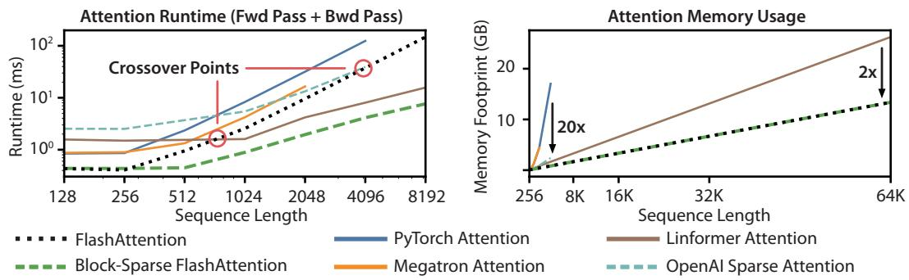

# FlashAttention: IO-Aware Exact Attention

**Paper:** FlashAttention: Fast and Memory-Efficient Exact Attention with IO-Awareness
**Authors:** Tri Dao, Daniel Y. Fu, Stefano Ermon, Atri Rudra, Christopher Ré
**arXiv:** 2205.14135v2 - 23 Jun 2022

**Related pages:** [FlashAttention-2](flashattention-2.md), [FlashAttention-3](flashattention-3.md), [FlashAttention-4](flashattention-4.md), [The Transformer](../foundations/transformer.md), [vLLM: PagedAttention Serving Framework](../../frameworks/vllm/vllm-framework.md)

## TL;DR

**What:** FlashAttention computes the same softmax attention as the standard formula without materializing the $N \times N$ attention intermediates in GPU [HBM](../../terms/global-memory.md).
**How:** It combines [matrix tiling](../../terms/matrix-tiling.md), online softmax, and selective backward recomputation so score and probability tiles stay on chip.
**The number:** The paper reports up to 3x faster attention, up to 20x lower attention memory, 15% faster BERT-large training, and 3x faster GPT-2 training than its baselines.

## The Big Picture



*Source: [FlashAttention, Figure 1](https://arxiv.org/abs/2205.14135). ① The kernel loads K and V tiles from HBM into faster on-chip SRAM. ② It computes a local QK product and softmax update without writing the full score or probability matrix to HBM. ③ It writes the output after the tile loop, trading repeated on-chip work for much less slow-memory traffic.*

The paper's central hardware observation is visible on the left: the A100 example has about 1.5 TB/s HBM bandwidth versus an estimated 19 TB/s SRAM bandwidth. The center and right explain why a fused tiled kernel can be faster even when it performs extra recomputation.

## Why This Exists

Consider one GPT-2 attention head with sequence length `N = 1024` and head dimension `d = 64`:

```text
S = Q K^T       # N x N scores
P = softmax(S)  # N x N probabilities
O = P V         # N x d output
```

The two `N x N` intermediates are large enough that standard attention writes them to HBM between matrix multiplication, masking, softmax, dropout, and the final `P V` multiplication. Those elementwise and reduction steps are often memory-bound, so lower theoretical FLOPs from an approximate method do not automatically produce lower wall-clock time. This compute concern is separate from [PagedAttention](../../terms/pagedattention.md), which manages KV-cache storage for serving.

FlashAttention asks a different question: can each score tile be consumed before it is written out? The answer requires two pieces that must work together: a blockwise exact softmax merge and a backward pass that recomputes the discarded score and probability tiles.

## The Landscape

The lineage is a convergence of memory-hierarchy thinking and numerically stable streaming reductions, with approximate-attention methods as a contrast rather than a direct parent.



Editable source: [FA-1 landscape diagram](./assets/fa1-landscape.mmd).

**Parents:** IO-complexity analysis, GPU memory hierarchy, online normalizer calculation, kernel fusion, and gradient recomputation.

**Contrast:** Sparse, low-rank, and kernel-based attention reduce mathematical work, but the paper emphasizes that their wall-clock behavior also depends on memory access and kernel efficiency.

**What this paper establishes:** Exact attention can be reorganized around the fast-memory working set. That becomes the foundation for FA-2's work partitioning and the hardware-specific schedules in FA-3 and FA-4.

## The Core Idea

FlashAttention changes the unit of execution from a sequence-wide attention matrix to SRAM-sized tiles. It keeps a query tile resident while key/value tiles stream past it, merges each tile's softmax contribution with running row statistics, and writes only the final output and small per-row metadata. The backward pass reloads inputs and recreates the missing tiles instead of asking HBM to store a quadratic activation.

## Symbol Map

The subscript `i` identifies a query-row tile and `j` identifies a key/value-column tile. A tilde marks statistics or matrices computed for the current tile before they are merged into the running state.

| Symbol | Human name | Shape or scope | Plain meaning |
|---|---|---|---|
| $Q$, $K$, $V$ | query, key, value | $N \times d$ per head | Inputs to one attention head. |
| $S$ | score matrix | $N \times N$ | All pairwise query-key dot products. |
| $P$ | probability matrix | $N \times N$ | Row-wise softmax of the scores. |
| $O$ | attention output | $N \times d$ | Weighted sum of values for each query row. |
| $N$ | sequence length | per head | Number of query and key positions. |
| $d$ | head dimension | per head | Width of each query, key, and value vector. |
| $B_r$, $B_c$ | row and column tile sizes | SRAM-sized | Number of query rows and key/value rows processed together. |
| $m_i$ | running row maximum | one value per query row | Max score seen so far for row block $i$. |
| $\ell_i$ | max-shifted normalizer | one value per query row | Sum of exponentials after subtracting the running maximum. |
| $M$ | SRAM capacity | per SM | Fast on-chip memory available to the tile working set. |

| State | Stored or recomputed | Why |
|---|---|---|
| $O$, $m$, $\ell$ | Stored after forward | Enough to finalize output and reconstruct probabilities in backward. |
| $S$, $P$ | Recomputed tile by tile | Avoids writing quadratic intermediates to HBM. |

## Deep Dive

### Tiling and kernel fusion

**What it does:** It arranges the computation so a small score tile and its softmax work fit in SRAM.

**Why it matters:** Standard attention repeatedly moves `N x N` data through HBM between otherwise related operations.

**How it works:**

1. Choose row and column tile sizes from the SRAM capacity and head dimension.
2. Load one `K_j, V_j` pair into SRAM, then stream query tiles `Q_i` through it in the original FA-1 loop order.
3. Compute `S_ij = Q_i K_j^T`, softmax statistics, and the value update while the tile is on chip.
4. Fuse matrix multiplication, softmax, masking, and optional dropout in one CUDA kernel, then write only the output and row statistics.

**The intuition:** Keep a reusable working set in the fast memory and pay for HBM only when a result must survive the kernel.

**A concrete example:** For the `N = 1024, d = 64` head, no `1024 x 1024` score tile is ever written to HBM; each local tile is consumed before the next key/value tile arrives.

**Remember:** Tiling reduces IO by controlling where intermediates live, not by changing the attention function.

### Online softmax merge

**What it does:** It computes one exact row-wise softmax across many score tiles using a running maximum and normalizer.

**Why it matters:** Softmax normally couples every key position in a row, which appears to require the whole score row at once.

**How it works:** For a query tile `i` and current key/value tile `j`, let `m_local` be the local row maximum, `P_tilde` the exponentiated scores after subtracting it, and `ell_tilde` its row sum. Merge those local statistics with the prior state:

$$m_i^{new} = \max(m_i, \widetilde{m}_{ij})$$

$$\ell_i^{new} = e^{m_i-m_i^{new}}\ell_i + e^{\widetilde{m}_{ij}-m_i^{new}}\widetilde{\ell}_{ij}$$

If $O_i$ is the already-normalized output for processed keys, the exact update is:

$$O_i^{new} = (\ell_i^{new})^{-1}\left(e^{m_i-m_i^{new}}\ell_i O_i + e^{\widetilde{m}_{ij}-m_i^{new}}\widetilde{P}_{ij}V_j\right)$$

Equivalently, the kernel can carry the numerator $U_i = \ell_i O_i$ and divide once after the last tile. For scores `[2, 5, 1, 8]` in two blocks, the second block raises the maximum from 5 to 8, so the first block's contribution is multiplied by $e^{-3}$; the final ratio is the same as a four-score softmax.

**The intuition:** A later larger score changes the reference point, so every earlier contribution is deflated by the same factor before the new contribution is added.

**A concrete example:** In the `N = 1024, d = 64` head, each query row sees only the current `K_j` tile, yet its running $(m_i, \ell_i, O_i)$ state represents all keys processed so far.

**Remember:** The rescaling is what makes blockwise softmax exact; omitting it changes the attention distribution.

### Recomputation in backward

**What it does:** It trades extra arithmetic for a linear-size saved state.

**Why it matters:** Saving `S` or `P` for backpropagation would restore the quadratic activation memory that tiling was meant to remove.

**How it works:**

1. Save the output `O` and the per-row softmax statistics `m` and `ell` from forward.
2. During backward, reload `Q`, `K`, and `V` in compatible tiles.
3. Recompute the local scores and probabilities in SRAM, then form `dQ`, `dK`, and `dV` from the usual attention derivatives.
4. Keep the recomputed matrices on chip and write only gradient tiles to HBM.

The backward pass has five matrix multiplications per inner iteration rather than the two forward multiplications, but it avoids reading a stored `N x N` probability matrix.

**The intuition:** Recalculate a cheap local fact when needed instead of carrying every fact through the whole training run.

**A concrete example:** For the `N = 1024` head, backward reconstructs each `S_ij` and `P_ij` from the same Q/K/V tiles instead of loading a million-entry probability matrix from HBM.

**Remember:** FlashAttention's memory saving comes from discarding quadratic intermediates and making backward regenerate them.

### IO complexity and the lower bound

**What it does:** It turns the memory-hierarchy intuition into an asymptotic HBM-access bound.

**Why it matters:** A kernel can perform more FLOPs and still finish sooner if it makes substantially fewer slow-memory transfers.

**How it works:** With SRAM capacity $M$ and $d \leq M \leq Nd$, the paper gives:

| Method | HBM accesses |
|---|---:|
| Standard attention | $\Theta(Nd + N^2)$ |
| FlashAttention | $\Theta(N^2d^2/M)$ |

The outer key/value tiles cause repeated passes over query blocks, while the working set stays bounded by SRAM. The paper also proves that no exact attention algorithm can be asymptotically better than the FlashAttention term for all SRAM sizes in this range.

**The intuition:** Once the fast-memory working set is fixed, the number of times the large matrices must cross the HBM boundary becomes the real cost model.

**A concrete example:** In the paper's GPT-2 medium benchmark, FlashAttention uses 4.4 GB of HBM reads and writes versus 40.3 GB for standard attention, despite using 75.2 rather than 66.6 GFLOPs.

**Remember:** The theorem is an HBM-access result under stated size assumptions, not a guarantee of a fixed speedup on every GPU or sequence length.

### Block-sparse extension

**What it does:** It skips predefined zero blocks while retaining the same on-chip softmax merge for the blocks that remain.

**Why it matters:** Exact dense attention still has quadratic work for very long sequences; structured sparsity can remove selected interactions before they reach the kernel.

**How it works:**

1. Require a block-form mask so an entire `B_r x B_c` tile is either selected or skipped.
2. Visit only the nonzero blocks and merge their contributions with online softmax.
3. If `s` is the fraction of nonzero blocks, the HBM bound becomes $\Theta(Nd + N^2d^2s/M)$.
4. Use the fixed butterfly pattern in the paper's experiments; this extension is approximate because the mask removes attention entries.

**The intuition:** The dense algorithm makes each selected tile cheap to move; block sparsity makes the number of selected tiles smaller.

**A concrete example:** For a 64K-token Path-256 input, the block-sparse variant lets the model run at a length where dense attention would not fit, but its fixed pattern is no longer the exact dense attention operator.

**Remember:** Block-sparse FlashAttention is a sparse approximation built on the exact tiled primitive, not a claim that arbitrary learned sparsity is free.

## Putting It Together

The trace follows one `N = 1024, d = 64` query head through forward and backward:

| Step | Actor | Input state | Action | Output state |
|---:|---|---|---|---|
| 1 | Tile scheduler | Q, K, V in HBM | Splits Q into row tiles and K/V into column tiles sized for SRAM. | Tile indices `i, j` and a bounded working set. |
| 2 | Fused forward kernel | `Q_i` plus `K_j, V_j` in HBM | Loads the current tiles into SRAM and computes `S_ij`. | Local score tile, local max, and local exponential sum. |
| 3 | Online softmax state | Prior `m_i, ell_i, O_i` plus local statistics | Merges the new maximum and normalizer, rescaling the prior contribution when needed. | Exact state for all keys through block `j`. |
| 4 | Fused forward kernel | Updated state and next `K_j, V_j` | Repeats the tile update without materializing `S` or `P` in HBM. | Final normalized `O_i` and saved `m_i, ell_i`. |
| 5 | Backward kernel | Q, K, V, O, gradients, and saved row statistics | Reloads tiles, reconstructs `S_ij` and `P_ij`, and accumulates `dQ, dK, dV`. | Gradient tiles with no quadratic saved activation. |
| 6 | HBM writeback | Final output and gradients | Writes only O, dQ, dK, dV, and small per-row metadata. | Linear additional memory in sequence length. |

## What This Buys You

### The headline claim

FlashAttention makes exact attention practical at longer context by reducing HBM movement and activation storage, not by approximating the dense attention formula.

### How we know: training and attention benchmarks



*Source: [FlashAttention, Figure 3](https://arxiv.org/abs/2205.14135). ① Runtime remains quadratic in sequence length, but FlashAttention is below the standard exact-attention baselines in the tested range. ② Its attention memory grows linearly, with up to 20x savings against exact baselines. ③ Approximate methods can cross over for runtime, while block-sparse FlashAttention remains competitive across the plotted lengths.*

| Evidence | Reported result | What it shows |
|---|---:|---|
| BERT-large, 8 x A100 | 17.4 +/- 1.4 minutes vs 20.0 +/- 1.5 | 15% faster to the MLPerf target accuracy. |
| GPT-2 medium, 8 x A100 | 6.9 days vs 21.0 days for HuggingFace | 3x end-to-end training speedup at comparable perplexity. |
| Long Range Arena | 2.4x FlashAttention; 2.8x block-sparse | IO-aware kernels improve both dense and structured sparse attention. |
| Attention benchmark | Up to 3x vs PyTorch exact attention | Fused tiling wins for common sequence lengths up to 2K. |
| Long-context quality | 61.4% Path-X; 63.1% Path-256 with block sparsity | Lower memory enables sequence lengths of 16K and 64K in the reported tasks. |

### The mechanism behind the numbers

The speed and memory results share one cause: local score and probability tiles are consumed in SRAM, so the kernel avoids the repeated HBM traffic that dominates standard attention. Recomputation adds FLOPs in backward, but it removes the much larger quadratic activation transfer. At longer sequences, that trade makes memory capacity and bandwidth the limiting resource rather than the nominal attention formula alone.

### How to read these numbers

> **Warning:** The 20x figure is attention memory, not a 20x reduction in total model memory. The speedups also depend on sequence length, head dimension, masking, dropout, GPU, and baseline implementation. Block-sparse quality and speed use a fixed approximate mask and should not be compared as if they were dense exact attention.

## Where It Breaks

| Failure mode | When it happens | Impact |
|---|---|---|
| Kernel engineering cost | A new attention variant or GPU architecture needs an IO-aware CUDA implementation. | Porting and maintenance require low-level device expertise. |
| Cross-device communication | Attention is partitioned across multiple GPUs. | The single-GPU HBM analysis does not account for inter-GPU traffic. |
| Small or unfavorable tiles | The head dimension is too large for the stated SRAM regime, or the sequence is too short for HBM traffic to dominate. | Tiling and fusion may provide little advantage over a simpler kernel. |
| Block-mask quality | The block-sparse extension uses a predefined butterfly pattern. | Dynamic sparsity and arbitrary masks are outside the demonstrated method, and approximation can change quality. |
| Other work becomes dominant | Larger tiles reduce HBM traffic until arithmetic or other kernel costs take over. | Further tile-size increases no longer improve runtime. |

## One Thing to Remember

**FlashAttention is exact attention reorganized around the memory hierarchy.** Keep only SRAM-sized tiles in flight, merge softmax statistics so the result stays exact, and recompute discarded tiles during backward; the decisive saving is avoiding the quadratic HBM traffic.

## Go Deeper

- **Read:** [FlashAttention paper (arXiv:2205.14135)](https://arxiv.org/abs/2205.14135)
- **Build on:** [FlashAttention-2](flashattention-2.md), [FlashAttention-3](flashattention-3.md), and [FlashAttention-4](flashattention-4.md)
- **Understand the context:** [Matrix Tiling](../../terms/matrix-tiling.md), [Global Memory](../../terms/global-memory.md), and [The Transformer](../foundations/transformer.md)
- **Compare serving concerns:** [vLLM: PagedAttention Serving Framework](../../frameworks/vllm/vllm-framework.md)
- **Reproduce:** [Official implementation at Dao-AILab/flash-attention](https://github.com/Dao-AILab/flash-attention)
