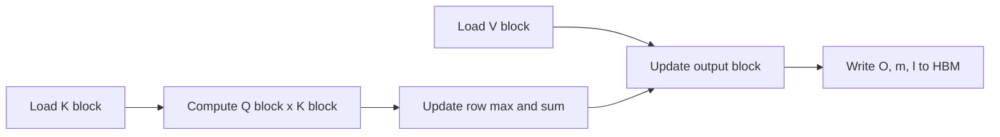
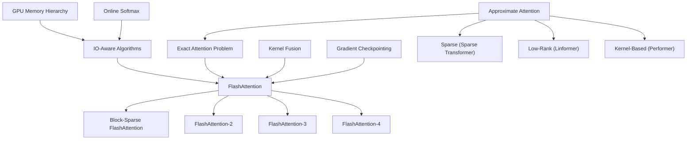

# FlashAttention: IO-Aware Exact Attention

**Paper:** FlashAttention: Fast and Memory-Efficient Exact Attention with IO-Awareness
**Authors:** Tri Dao, Daniel Y. Fu, Stefano Ermon, Atri Rudra, Christopher Ré
**arXiv:** 2205.14135v2 - 23 Jun 2022

**Related pages:** [FlashAttention-2](flashattention-2.md), [FlashAttention-3](flashattention-3.md), [FlashAttention-4](flashattention-4.md), [vLLM: PagedAttention Serving Framework](../../frameworks/vllm/vllm-framework.md)

## TL;DR

**What:** FlashAttention is an exact attention algorithm that avoids materializing the $N \times N$ attention matrix in GPU [HBM](../../terms/global-memory.md).
**How:** It tiles Q, K, V into SRAM-sized blocks, uses online softmax to compute exact attention block-by-block, and recomputes intermediates during backward instead of storing them.
**The number:** Up to 3× faster than standard attention, with up to 20× less memory — training speed records for BERT-large and GPT-2.

## The Core Idea

The central insight is **IO-awareness**: optimize reads and writes between slow GPU HBM and fast on-chip SRAM, not just FLOPs. Standard attention is memory-bound — masking, softmax, dropout, and intermediate reads/writes dominate wall-clock time. By keeping computation in SRAM and only writing final results to HBM, FlashAttention turns a memory-bound operation into a compute-bound one.

## The Big Picture



*① Load K and V blocks from HBM into SRAM. ② Compute local Q×K scores. ③ Update running softmax statistics (row max and sum). ④ Rescale and accumulate output. ⑤ Write only final O and statistics back to HBM — the N×N attention matrix never leaves SRAM.*

## The Landscape

FlashAttention sits at the intersection of three lines of work:



**Parents:** IO-aware algorithms (database joins, image processing), online softmax (Milakov & Gimelshein 2018; Rabe & Staats 2021), kernel fusion compilers.

**Siblings (approximate attention):** Sparse Transformer, Reformer, Linformer, Performer, Big Bird — all reduce FLOPs but often fail to deliver wall-clock speedup because they ignore memory access costs.

**What FlashAttention uniquely does:** It combines online softmax [tiling](../../terms/matrix-tiling.md) with recomputation-based backward to compute *exact* attention with dramatically fewer HBM accesses. It proved that the right optimization target is memory bandwidth, not FLOP count.

## Why This Exists

For one attention head:

```text
S = Q K^T
P = softmax(S)
O = P V
```

With sequence length `N` and head dimension `d`, standard attention uses $O(N^2)$ memory for intermediate matrices. This is expensive because many attention operations are memory-bound: masking, softmax, dropout, and intermediate reads/writes dominate wall-clock time even when FLOPs are not reduced.

Approximate attention methods reduce theoretical compute, but the paper argues many fail to produce practical speedups because they do not reduce memory movement enough.

### Tiling and Online Softmax

FlashAttention splits inputs into blocks sized to fit in SRAM:

- `K_j` and `V_j` blocks are loaded from HBM into SRAM.
- For each query block `Q_i`, the kernel computes a local score block `S_ij = Q_i K_j^T`.
- It computes local row maxima and exponent sums.
- It updates each output block `O_i` using online softmax rescaling.
- It writes only the running output block and per-row softmax statistics back to HBM.

The algorithm keeps running per-row statistics:

```text
m_i = running row max
l_i = running exponential sum
O_i = running output block
```

When a new score block changes the row max, prior output is rescaled so the final result is exactly the same as full softmax over all keys.


#### How Online Softmax Works

The key question: how can you compute softmax — which normally needs *all* scores at once — in blocks?

**The answer: maintain two running statistics ($m$, $\ell$) and rescale when the max changes.**

Say you've processed block 1 and have $(m^{(1)}, \ell^{(1)}, O^{(1)})$. Now block 2 arrives.

**Step 1 — Check if the max changes:**

$$m_{new} = \max(m^{(1)}, \max(S^{(2)}))$$

**Step 2 — Rescale old statistics if needed.** If $m_{new} > m^{(1)}$, the old exponentials were computed relative to a smaller max, so multiply by a correction factor $\exp(m^{(1)} - m_{new})$:

$$\ell_{new} = \underbrace{\ell^{(1)} \cdot \exp(m^{(1)} - m_{new})}_{\text{rescaled old sum}} + \underbrace{\sum_{j \in \text{block 2}} \exp(S_j^{(2)} - m_{new})}_{\text{new contributions}}$$

$$O_{new} = \underbrace{O^{(1)} \cdot \exp(m^{(1)} - m_{new})}_{\text{rescaled old output}} + \underbrace{\sum_{j \in \text{block 2}} P_j^{(2)} V_j^{(2)}}_{\text{new contributions}}$$

If $m_{new} = m^{(1)}$ (max unchanged), no rescaling needed — just add.

**Why $O$ is stored unnormalized and divided by $\ell$ only at the end.** The running output $O$ accumulates $\sum \exp(S_j - m) \cdot V_j$ **without** dividing by $\ell$. This is deliberate: if you tried to maintain the already-normalized $O/\ell$ incrementally, rescaling when the max changes becomes messy — both numerator and denominator shift. By keeping $O$ and $\ell$ separate, you rescale both by the *same factor* and the ratio stays correct:

$$\frac{O_{old} \cdot \exp(m_{old} - m_{new})}{\ell_{old} \cdot \exp(m_{old} - m_{new})} = \frac{O_{old}}{\ell_{old}}$$

The final division $O / \ell$ happens once at the end, yielding the exact softmax attention output with zero approximation error.

**Concrete example.** Scores `[2, 5, 1, 8]` processed in two blocks:

*Block 1 `[2, 5]`:* $m^{(1)} = 5, \ell^{(1)} = e^{-3} + 1 \approx 1.05$

*Block 2 `[1, 8]`:* $m_{new} = 8$ (max ↑). Rescale old by $e^{5-8} = e^{-3} \approx 0.05$. New $\ell = 1.05 \cdot 0.05 + e^{-7} + 1 \approx 1.052$. Final output $O / \ell$ matches computing softmax over all 4 scores at once.

**Intuition:** Think of it as voting with adjustable weights. You tally votes as they arrive. If a much more popular candidate appears later, you **deflate** all previous vote counts proportionally. The final normalization preserves the exact proportions.

#### The Log-Sum-Exp View

The rescaling form above carries a running **max** `m` and a running **sum** `l`, then divides `O / l` at the very end. The same tiling can be expressed in **log space**, and that is the form most implementations actually persist.

**One scalar per row.** Because `l` is accumulated with the max already subtracted, the max factors back out exactly:

$$L_i = \log\sum_j \exp(S_{ij}) = m_i + \log l_i$$

The left side is the **log-sum-exp (LSE)** of row `i`; the right side shows the two running statistics collapsing into it. Computing `m + log(l)` once at the end costs one log per row and yields a number that stays tame no matter how large the raw sum `l` grows.

**What changes in the process.** Nothing about the output — attention still needs the ratio `O / l`, and that division still happens. The change is bookkeeping: instead of discarding the denominator, the kernel records `L = m + log(l)` as one scalar per row. This is precisely what the implementation's final `m += log(l)` step computes before storing the result.

**Why only the denominator skips the rescale.** The log function turns multiplication by a rescale into addition — $\log(\ell \cdot e^x) = \log \ell + x$ — so the denominator absorbs the max update for free; that is why `L` needs no `alpha`. The numerator $O = \sum_j e^{S_j - m} V_j$ is a *vector* sum with no log equivalent, so it cannot be made absolute: whenever the max (or the LSE) moves, `O` must be re-expressed. The correction never disappears — it only changes form:

- **In-loop (max-rescale):** `O <- O * alpha`, the same `alpha = exp(m_old - m_new)` applied to `l`.
- **At-merge (log-space):** each block's locally normalized output is weighted by `exp(l_b - L_global)`, its share of the global denominator.

**Why log space.**

- **Overflow safety.** `l` is a sum of up to `N` exponentials and can overflow in fixed precision; its logarithm cannot.
- **The backward pass wants `L`, not `l`.** The softmax gradient is expressible through the probabilities and `L`, so a backward kernel recomputes `P` on chip and needs only `O` and `L` — never the huge raw denominator.

**Equivalent update rule.** You can also maintain `L` directly across blocks. For a new block with local log-sum-exp `l_b = log(sum_j exp(S_j - m_b)) + m_b`:

$$L_{new} = \max(L_{old}, l_b) + \log\left(1 + \exp(-|L_{old} - l_b|)\right)$$

**Where the `max` comes from.** The merge starts from the exact definition $L_{new} = \log(e^{L_{old}} + e^{l_b})$, but evaluating $e^{L_{old}}$ directly overflows once the LSEs grow large. So factor out the larger of the two, $M = \max(L_{old}, l_b)$:

$$e^{L_{old}} + e^{l_b} = e^M\left(e^{L_{old}-M} + e^{l_b-M}\right)$$

Taking logs gives $L_{new} = M + \log(e^{L_{old}-M} + e^{l_b-M})$. Because $M$ is the max, one of the two exponents is now $0$ and the other is $-|L_{old}-l_b|$, so the bracket collapses to $1 + e^{-d}$. The `max(...)` term is the dominant answer, and $\log(1 + e^{-d})$ is a correction bounded in $[0, \log 2)$ that shrinks to $0$ as the gap between the two LSEs grows.

**Merge trace.** Block 1's local LSE is $L_{old} = 5 + \log(1.0498) \approx 5.049$; block 2's local LSE is $l_b = 8 + \log(1.0009) \approx 8.001$. Merging them:

$$\log(e^{5.049} + e^{8.001}) = 8.001 + \log(e^{-2.952} + 1) = 8.001 + \log(1.0522) \approx 8.052$$

matching the running $L$ after block 2 in the example below. This is the same tally re-expressed as the numerically stable `logaddexp` (`max` + `log1p`); it produces identical output to the max-rescale form, and the only difference is which statistics travel between blocks.

**The same example.** Scores `[2, 5, 1, 8]` in two blocks:

- Block 1: `m = 5`, `l ≈ 1.05` → `L = 5 + log(1.05) ≈ 5.05`
- Block 2: `m = 8`, `l ≈ 1.052` → `L = 8 + log(1.052) ≈ 8.05`

Direct check: `log(e^2 + e^5 + e^1 + e^8) = 8 + log(1 + e^{-3} + e^{-6} + e^{-7}) ≈ 8.05`. The output `O / l` is unchanged — `L` is just the denominator's logarithm, kept for reuse.

**Intuition:** Max-rescale and log-sum-exp are **the same tally in two number systems** — one tracks the count, the other tracks its logarithm. The output needs the count (`O / l`); the backward pass prefers the logarithm (`L`), which is why kernels write `m + log(l)`.

> **Important:** `L = m + log(l)` is exact only because `l` was accumulated with the max subtracted. A naive raw sum without the max would overflow and break the identity.

This same `L` is what context-parallel and multi-device attention use to merge partial softmax results — see [vLLM DCP attention](../../frameworks/vllm/dcp-attention/index.md).

### Recomputation in Backward

Standard training stores `S` or `P` for backward, which costs quadratic memory. FlashAttention instead stores:

- output `O`;
- softmax row max `m`;
- softmax normalizer `l`.

Equivalently, the two statistics `m` and `l` collapse into one per-row log-sum-exp $L = m + \log l$ (see the Log-Sum-Exp View above) — the single scalar a backward pass actually needs.

During backward, it reloads blocks of `Q`, `K`, and `V`, recomputes local attention probabilities on chip, and uses them to compute `dQ`, `dK`, and `dV`. This increases FLOPs, but reduces HBM traffic enough that backward is faster in practice.

The paper frames this as selective gradient checkpointing that saves memory without the usual speed penalty.

### IO Complexity

For SRAM size `M`, sequence length `N`, and head dimension `d`, with `d <= M <= Nd`:

| Method | HBM accesses |
|---|---|
| Standard attention | `Theta(Nd + N^2)` |
| FlashAttention | `Theta(N^2 d^2 / M)` |

For typical GPU SRAM sizes and head dimensions such as `d = 64` or `128`, FlashAttention makes far fewer HBM accesses. The paper also gives a lower-bound argument that no exact attention algorithm can asymptotically improve on this bound for all SRAM sizes in the stated range.

The paper reports a GPT-2 medium example where forward plus backward attention has higher FLOPs with FlashAttention but much lower HBM traffic:

| Metric | Standard attention | FlashAttention |
|---|---:|---:|
| GFLOPs | 66.6 | 75.2 |
| HBM read/write | 40.3 GB | 4.4 GB |
| Runtime | 41.7 ms | 7.3 ms |

### Block-Sparse FlashAttention

The paper extends FlashAttention to block-sparse attention by skipping zero blocks under a predefined block sparsity mask. The algorithm is otherwise the same tiled exact-attention procedure over nonzero blocks.

If `s` is the fraction of nonzero blocks, block-sparse FlashAttention has HBM accesses:

```text
Theta(Nd + N^2 d^2 s / M)
```

The paper uses a fixed butterfly sparsity pattern in downstream experiments and reports block-sparse FlashAttention is 2-4x faster than dense FlashAttention for long sparse workloads.

## What This Buys You

### Empirical Results

Key reported results:

| Setting | Result |
|---|---|
| BERT-large sequence length 512 | 15% faster than the MLPerf 1.1 training speed record |
| GPT-2 sequence length 1K | Up to 3x faster than HuggingFace and 1.7x faster than Megatron-LM |
| Long Range Arena | 2.4x speedup for FlashAttention; 2.8x for block-sparse FlashAttention |
| GPT-2 small with 4K context | Still 30% faster than Megatron-LM with 1K context, with 0.7 better perplexity |
| Long-document classification | Longer sequence lengths improve micro-F1 by 4.3 points on MIMIC-III and 8.5 points on ECtHR |
| Path-X | First reported Transformer above random performance: 61.4% accuracy |
| Path-256 | Block-sparse FlashAttention reaches 63.1% accuracy |
| Attention runtime benchmark | Up to 3x faster than PyTorch exact attention |
| Memory footprint | Linear in sequence length and up to 20x more memory-efficient than exact attention baselines |

## Where It Breaks

| Failure mode | When it happens | Impact |
|---|---|---|
| Kernel engineering overhead | Writing new IO-aware CUDA kernels per architecture | High maintenance cost; implementations don't transfer cleanly across GPU generations |
| Single-GPU focus | Multi-GPU attention with cross-device communication | Adds another communication layer not addressed by this work |
| Small SRAM or short sequences | When head dimension $d$ exceeds SRAM size or $N$ is very small | Tiling benefits diminish; standard attention may be competitive |
| Fixed sparsity patterns only | Block-sparse variant uses predefined butterfly mask | Dynamic or learned sparsity not supported |

## One Thing to Remember

FlashAttention achieves its speedup **by reducing HBM traffic, not by approximating attention** — it's exact attention made faster through IO-awareness. The algorithm never writes the $N \times N$ attention matrix to HBM.

## Go Deeper

- **Read:** [FlashAttention paper (arXiv:2205.14135)](https://arxiv.org/abs/2205.14135)
- **Build on:** [FlashAttention-2](flashattention-2.md), [FlashAttention-3](flashattention-3.md), [FlashAttention-4](flashattention-4.md)
- **Understand the context:** [vLLM: PagedAttention Serving Framework](../../frameworks/vllm/vllm-framework.md), [NVFP4: Blackwell 4-Bit Floating Point](../../hardware/quantization/nvfp4.md)
- **Dig into the mechanism:** [PagedAttention](../../terms/pagedattention.md) for the paged KV-cache layout behind the vLLM serving framework.
- **Reproduce:** [Official implementation at github.com/Dao-AILab/flash-attention](https://github.com/Dao-AILab/flash-attention)

## Key Takeaways

- FlashAttention is exact attention; its speedup comes from memory traffic reduction, not approximation.
- It avoids materializing `N x N` attention matrices in HBM.
- Online softmax statistics make blockwise exact softmax possible.
- Recomputation in backward trades extra FLOPs for much less HBM traffic.
- The algorithm established IO-awareness as a core design principle for later FlashAttention versions.
