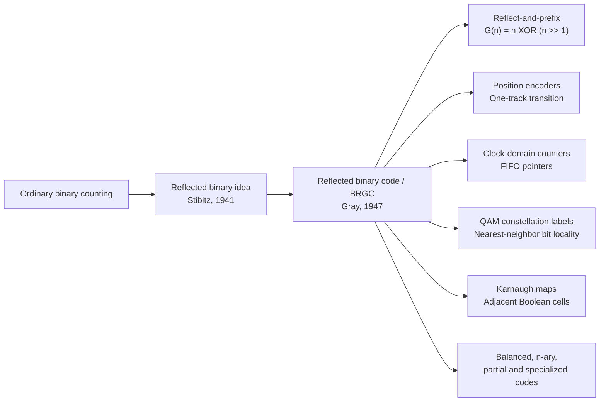

# Gray Code: One-Bit Transitions for Safe State Changes

**Source:** [Gray code — HandWiki](https://handwiki.org/wiki/Gray_code), captured on 2026-08-24.

**Scope:** The source uses “Gray code” broadly. This insight focuses on the standard binary-reflected Gray code (BRGC), then uses the source’s applications and variants to explain the design trade-off.

**Related pages:** [Algorithms](../../index.md) · [Foundations](../index.md)

> **Evidence:** HandWiki is a broad reference article with historical notes, implementation details, applications, and citations to primary sources. The explanations below are a focused synthesis of that captured page; they are not a survey of every generalized Gray-code family.

## TL;DR

**What:** A Gray code orders codewords so that adjacent entries differ in exactly one bit, giving a Hamming distance of one between neighboring states.

**How:** The binary-reflected form is built by reflecting and prefixing smaller lists, or computed directly as `G(n) = n XOR (n >> 1)`; decoding is a prefix XOR.

**The number:** A `w`-bit BRGC contains all `2^w` codewords exactly once and is cyclic, so the final and first entries also differ by one bit.

## The Big Picture

The reader question is: **what does one-bit adjacency buy when a multi-bit value is changing physically or across a timing boundary?**

| Transition | Ordinary binary | Bits that change | 4-bit BRGC | Bits that change |
|---|---|---:|---|---:|
| `3 → 4` | `0011 → 0100` | 3 | `0010 → 0110` | 1 |
| `7 → 8` | `0111 → 1000` | 4 | `0100 → 1100` | 1 |
| `15 → 0` (wrap) | `1111 → 0000` | 4 | `1000 → 0000` | 1 |

Ordinary binary is numerically convenient, but a physical reader or another clock domain can observe bits at slightly different times. BRGC spends one bit change per neighboring step, so a sample taken during a one-step transition can be old or new—or, with analog/mechanical imperfections, locally ambiguous—rather than a combination assembled from several simultaneous changes.

## Why This Exists

Imagine a three-track position sensor moving from binary position `3` (`011`) to position `4` (`100`). All three tracks are supposed to change together. Real switches, optical edges, wires, and logic gates do not have identical timing, so an observer can briefly see `001`, `101`, or another transient pattern. A downstream sequential circuit may store that transient as if it were a real position.

The three-bit BRGC labels those same neighboring positions `3` and `4` as `010` and `110`. Only one track changes. A sample at the boundary therefore has a much smaller worst-case positional error: it can be interpreted as one of the adjacent states rather than a far-away binary value assembled from unrelated bit transitions.

## The Landscape

The editable source for this synthesis is [landscape.mmd](assets/landscape.mmd).



*Synthesized landscape from the captured [HandWiki article](https://handwiki.org/wiki/Gray_code): ① ordinary binary counting creates multi-bit carry transitions; ② the reflected binary construction supplies the standard cyclic one-bit path; ③ the same adjacency invariant branches into sensing, clock-domain transfer, modulation, logic minimization, and generalized-code applications.*

## The Core Idea

Gray code turns a numeric sequence into a path through neighboring bit patterns. It gives up the usual property that each bit has an independent positional weight in exchange for a stronger transition guarantee: **when you move one step in the ordered sequence, only one coordinate changes**. That is why it is useful at boundaries where “the value is changing” and “the value is being sampled” may happen at nearly the same time.

## Symbol Map

The notation below separates the numeric input, the encoded value, and the distance property.

| Symbol | Human name | Scope | Plain meaning |
|---|---|---|---|
| `n` | binary input | Non-negative integer | The ordinary binary number being encoded. |
| `w` | bit width | Fixed codeword width | The number of bits in each codeword; BRGC then has `2^w` entries. |
| `G(n)` | Gray encoding | One input value | The BRGC codeword associated with `n`. |
| `g_i`, `b_i` | Gray and binary bits | One bit position | Bits used in the inverse prefix-XOR relation. |
| `d_H(a, b)` | Hamming distance | Two equal-width codewords | The number of positions in which `a` and `b` differ. |

The source’s standard conversion uses bitwise XOR (`XOR`) and a right shift (`>>`). Bit positions in the decoding recurrence are read from the most significant bit toward the least significant bit.

## Deep Dive

### One-bit adjacency limits transition ambiguity

**What it does:** It makes every consecutive pair of codewords differ in exactly one bit, including the wrap from the last codeword back to the first in the cyclic BRGC.

**Why it matters:** A reader, sampler, or receiving clock domain can otherwise combine several old and new bits into a codeword that was never a valid state.

**How it works:**

1. Natural binary counting carries through trailing ones. The transition `0111 → 1000` changes four bits.
2. BRGC reorders the same `0` through `2^w - 1` values so that each neighbor has Hamming distance one.
3. The cyclic boundary is also safe: `1000 → 0000` changes only the most significant Gray bit in the four-bit example.
4. The code does not make arbitrary pairs close. The guarantee applies to neighboring entries in the chosen sequence.

**The intuition:** Gray code is a one-lane path through the hypercube: each step crosses one edge, never a diagonal.

**A concrete example:** At the `3 → 4` boundary, the binary labels `0011` and `0100` have three changed bits, while the Gray labels `0010` and `0110` have one changed bit.

**Remember:** The valuable invariant is `d_H(G(i), G(i + 1)) = 1`, not “all Gray codewords are one bit apart.”

### Reflect-and-prefix constructs the cyclic sequence

**What it does:** It grows an `n`-bit BRGC from the `(n - 1)`-bit list without losing adjacency or cyclic closure.

**Why it matters:** The construction explains both the name “reflected” and why the boundary between the two halves does not introduce a two-bit jump.

**How it works:** Start with `G₂ = [00, 01, 11, 10]`. To make `G₃`:

| Construction step | Result |
|---|---|
| Original list | `00, 01, 11, 10` |
| Reflect it | `10, 11, 01, 00` |
| Prefix original with `0` | `000, 001, 011, 010` |
| Prefix reflected list with `1` | `110, 111, 101, 100` |
| Concatenate | `000, 001, 011, 010, 110, 111, 101, 100` |

The last word in the first half (`010`) and the first word in the second half (`110`) share the old suffix and differ only in the new prefix. The final word (`100`) and the first word (`000`) also differ only in that prefix, which gives the cycle.

**The intuition:** Copy the old path, turn around, and use one new bit to join the two directions.

**A concrete example:** The four-codeword path `00 → 01 → 11 → 10` becomes two three-bit paths, `0·G₂` and `1·reverse(G₂)`, joined at `010 → 110` and closed at `100 → 000`.

**Remember:** Reflection is not just a way to print the list; it is the reason the recursive boundary remains one-bit adjacent.

### Bitwise conversion makes encoding cheap

**What it does:** It maps ordinary binary to BRGC with one shift and one XOR, then recovers binary by a cumulative XOR across Gray bits.

**Why it matters:** Hardware counters, encoders, and software enumeration can keep ordinary arithmetic while exposing a transition-safe representation at the interface.

**How it works:**

1. Encode with

   $$
   G(n) = n \mathbin{\operatorname{XOR}} (n \mathbin{\gg} 1).
   $$

2. In bit terms, each Gray bit is the XOR of one binary bit and the next more-significant binary bit.
3. Decode from the most significant bit: `b₀ = g₀`, then `bᵢ = gᵢ XOR bᵢ₋₁`.
4. For `g = 110`, the prefix XOR gives `b = 100`, so Gray code `110` represents decimal `4`.
5. A simple loop performs the prefix XOR serially; a parallel-prefix or SWAR sequence can reduce the depth for fixed machine-word widths.

```c
unsigned binary_to_gray(unsigned n) {
    return n ^ (n >> 1);
}

unsigned gray_to_binary(unsigned g) {
    for (unsigned mask = g >> 1; mask != 0; mask >>= 1) {
        g ^= mask;
    }
    return g;
}
```

**The intuition:** Encoding compares adjacent binary bits; decoding accumulates the Gray differences back into absolute bits.

**A concrete example:** `n = 4` is `100`; shifting gives `010`; XOR gives `110`. Decoding `110` by prefix XOR returns `100`.

**Remember:** Gray representation is for ordering and transport; decode it before doing ordinary numeric arithmetic or interpreting parity.

### Hardware boundaries use the guarantee directly

**What it does:** It makes position tracks, event counters, and FIFO pointers safer to sample while the producer and consumer are not perfectly synchronized.

**Why it matters:** Mechanical delay, wire skew, and clock-domain sampling can expose a mixture of old and new bits precisely at a count transition.

**How it works:**

- A linear or rotary encoder places successive positions on adjacent Gray codewords, so only one physical track changes at a boundary.
- A counter crossing between clock domains can expose a Gray-coded pointer. If each bit arrives as either its old or new value and only one bit is changing, the sampled word is constrained to the old or new neighboring count rather than a multi-bit hybrid.
- A dual-port FIFO can use Gray-coded read and write pointers to communicate empty/full state across clock domains, while the actual clock-domain design still needs appropriate synchronizers and metastability handling.
- If a binary counter is converted through an unregistered combinational circuit, skew inside the binary input can create a transient Gray output. Counting in Gray directly or registering the converted result avoids presenting that glitch to the receiver.

**The intuition:** Gray code narrows the set of plausible observations at a boundary; it does not make timing uncertainty disappear.

**A concrete example:** For the `3 → 4` sensor transition, a receiver can see the old Gray word `010` or the new word `110` as the one changing track settles, rather than four unrelated tracks changing at once.

**Remember:** Gray code is one part of a safe clock-domain or sensor interface, not a replacement for synchronization, debouncing, or sampling discipline.

### Spatial neighbors and modulation neighbors get local bit labels

**What it does:** It assigns labels so that physically or logically adjacent points differ by one bit.

**Why it matters:** When a system makes a small neighbor mistake, a one-bit label error is easier to handle than a label with several corrupted bits.

**How it works:**

1. In a QAM constellation, arrange the bit labels so nearby signal points have one-bit Hamming distance.
2. If noise moves a received point into a neighboring decision region, the resulting symbol error tends to become one bit error.
3. Forward error correction can then operate on a smaller bit-error burden; Gray labeling itself does not correct the error.
4. Karnaugh maps use the same adjacency idea on Boolean axes: neighboring cells differ in one variable, so groups correspond to simplified logic terms.

**The intuition:** Put similar physical locations next to similar bit labels so a small geometric mistake stays small in the digital representation.

**A concrete example:** A QAM receiver that slips into a nearest constellation point may flip one labeled bit instead of several, making a single-bit error-correcting code more effective for that common error pattern.

**Remember:** Gray labeling improves the error shape of likely nearest-neighbor mistakes; it is not a standalone error-correcting code.

## Putting It Together

Follow one three-bit rotary-encoder reading as it crosses from position `3` to position `4`.

| Step | Actor | Input state | Action | Output state |
|---:|---|---|---|---|
| 1 | Encoder disk | Physical position `3` | Emit the BRGC label for `3`. | Tracks read `010`. |
| 2 | Moving boundary | Position changes toward `4` | Change only the one track that differs between `010` and `110`. | One signal edge is in flight. |
| 3 | Sampler | Edge may arrive before or after the sampling instant | Capture the currently settled or transitioning Gray word. | The observation is constrained near `010` or `110`, rather than a four-track binary carry pattern. |
| 4 | Decoder | Gray word `110` after the edge settles | Apply prefix XOR: `1 → 1 XOR 1 = 0 → 0 XOR 0 = 0`. | Binary `100`, decimal position `4`. |
| 5 | Consumer | Decoded position `4` | Continue interpreting later positions in the same Gray ordering. | Future one-step changes remain one-bit transitions. |

The trace shows the division of labor: the code controls the shape of adjacent states, the physical interface controls how those states are emitted, and the decoder restores ordinary numeric meaning at the point where arithmetic or display is needed.

## What This Buys You

### The headline claim

Gray code trades ordinary binary bit weights for a **unit-distance ordering** that makes one-step transitions locally observable and cyclic.

### How we know: structural guarantees and uses

| Reader question | BRGC property | Practical consequence |
|---|---|---|
| How many states are covered? | Every `w`-bit word appears once. | The full `0` through `2^w - 1` range remains available. |
| What changes between neighbors? | Hamming distance one. | Sensors and sampled counters avoid multi-bit carry transitions. |
| What happens at wrap-around? | The sequence is cyclic. | The final-to-first boundary is also one-bit adjacent. |
| How is it computed? | `n XOR (n >> 1)`. | Encoding is cheap in software and hardware. |
| Where does locality help? | Encoders, FIFO pointers, QAM labels, Karnaugh maps, puzzles, and state enumeration. | The same invariant serves physical, communication, and combinational-layout problems. |

### The mechanism behind the value

The benefit is not that Gray code makes a number smaller, more redundant, or intrinsically more reliable. It changes the topology of the ordered state space: consecutive values become edges of a hypercube. That topology limits what a one-step transition can look like when timing is imperfect, and it makes nearest-neighbor mistakes map to small Hamming changes in applications such as modulation.

### ⚠️ How to read these claims

“Error reduction” means a likely neighboring-state or neighboring-symbol error produces fewer changed bits. Gray code alone does not detect or correct arbitrary bit flips, guarantee a correct sample when multiple steps occur between samples, or replace forward error correction and clock-domain safety circuits.

## Where It Breaks

| Failure mode | When it happens | Impact |
|---|---|---|
| Non-adjacent jump | The source advances several positions before the receiver samples. | The one-step guarantee no longer identifies a unique nearby state. |
| Arbitrary bit corruption | A bit flips without corresponding to a neighboring codeword. | Gray code supplies no redundancy for correction; the decoded value may be wrong. |
| Unregistered binary-to-Gray conversion | Skewed binary inputs reach the XOR network at different times. | The combinational output can briefly leave the intended Gray sequence. |
| Non-power-of-two range | A standard `w`-bit cycle is truncated to a custom number of states. | The custom end boundary may lose cyclic adjacency; a specialized code or explicit transition must be designed. |
| Numeric interpretation | Code is treated as ordinary binary before decoding. | Arithmetic order, parity, and magnitude appear unintuitive. |
| Clock-domain shortcut | Gray pointers are used without synchronizers or metastability analysis. | The code limits multi-bit ambiguity but cannot make an unsafe CDC design safe by itself. |
| Modulation overclaim | Gray-labeled QAM is treated as a full error-correcting scheme. | Non-neighbor noise and burst errors still require an appropriate coding and demodulation design. |
| Variant mismatch | A balanced, n-ary, partial, or application-specific Gray code is assumed to have BRGC’s exact formula. | Construction, wrap-around, and conversion rules may differ. |

## One Thing to Remember

**Gray code is a topology change for transitions:** it keeps the same set of states but arranges them so a one-step move crosses one bit edge at a time. That single invariant is why it reduces boundary ambiguity in encoders and clock-domain counters, keeps nearest-neighbor modulation errors local, and labels adjacent Boolean cells usefully—while still requiring decoding, synchronization, and real error-correction machinery around it.

## Go Deeper

- **Read:** [Gray code — HandWiki](https://handwiki.org/wiki/Gray_code), the captured source behind this insight.
- **Check the definition:** [NIST’s Dictionary of Algorithms and Data Structures entry for Gray code](https://xlinux.nist.gov/dads/HTML/graycode.html).
- **Implement:** Use the [binary-to-Gray and Gray-to-binary formulas](https://handwiki.org/wiki/Gray_code#Converting_to_and_from_Gray_code) and test both ordinary neighbors and the cyclic wrap-around.
- **Understand the geometry:** The source’s [tesseract visualization](https://handwiki.org/wiki/Gray_code#Invention) and [construction section](https://handwiki.org/wiki/Gray_code#Constructing_an_n-bit_Gray_code) connect the sequence to hypercube paths and reflection.
- **Reuse the synthesis:** [landscape.mmd](assets/landscape.mmd) is the editable Mermaid source for the history-and-application map.
