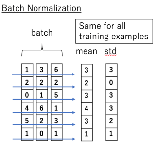
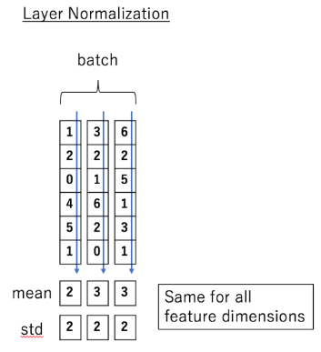

# Layer Normalization in Transformers

**Requested source:** [Transformer中的归一化（五）：Layer Norm 的原理和实现 & 为什么 Transformer 要用 LayerNorm](https://zhuanlan.zhihu.com/p/492803886)

**Captured evidence:** [Batch Normalization 和 Layer Normalization](https://penpenf28.github.io/2023/10/25/Batch-Normalization%E5%92%8CLayer-Normalization/index.html), by Hongwen Xin (2023-10-25)

**Related pages:** [The Transformer](../transformer.md) · [Layer Normalization term](../../../terms/layer-normalization.md)

> **Evidence:** Zhihu's verification layer blocked both HTTP and Chromium capture. The immutable local evidence is an accessible article that explicitly cites and summarizes the requested Zhihu page. The explanation below is therefore medium-confidence synthesis, and it corrects several implementation-level ambiguities in the fallback source.

## TL;DR

**What:** [Layer normalization](../../../terms/layer-normalization.md) standardizes each token's hidden vector across its feature dimension, independently of every other token and example.

**How:** For a hidden vector, subtract its feature mean, divide by the square root of its feature variance plus a small epsilon, then apply learned per-feature scale and shift parameters.

**The number:** For a Transformer tensor shaped `[batch, sequence, hidden]`, LayerNorm reduces only the final `hidden` axis; its statistics have shape `[batch, sequence, 1]` and do not depend on batch size or sequence length.

## The Big Picture: The Axis Is the Difference

| Batch Normalization | Layer Normalization |
|---|---|
|  |  |
| One feature is compared across examples. | One example is compared across features. |

*Source figures: [captured fallback article](https://penpenf28.github.io/2023/10/25/Batch-Normalization%E5%92%8CLayer-Normalization/index.html), credited there to [Transformer Illustrated](http://fancyerii.github.io/2019/03/09/transformer-illustrated/). ① BatchNorm follows each horizontal feature row across examples. ② LayerNorm follows each vertical example across features. ③ The arithmetic is similar; the reduction axis changes what information is shared.*

The figures use a two-dimensional matrix. In a Transformer, expand each column-like example into one token vector: **LayerNorm gives every token its own mean and variance**, while reusing the learned scale and shift across tokens.

## Why Transformers Need a Batch-Independent Stabilizer

Consider two requests processed together. The first contains the token `bank` in "river bank"; the second contains `bank` in "bank loan". A batch-based statistic makes the normalization of one request depend on what happened to be batched beside it. Change the batch size, padding pattern, or neighboring request and the normalized activation can change.

Transformers also process variable-length sequences and are often decoded one token at a time. A normalization layer that requires reliable batch statistics would create a training–inference mismatch exactly where serving batches are smallest and most dynamic. **LayerNorm avoids that coupling by computing statistics from the token being normalized.**

## The Core Idea: Standardize Locally, Then Restore Expressiveness

LayerNorm first removes the overall offset and scale of one hidden vector. That makes the next sublayer less sensitive to uncontrolled activation magnitude. It then applies learned per-feature parameters so the network is not forced to keep every feature at zero mean and unit variance.

This does **not** make activations normally distributed. It guarantees zero mean and unit population variance before the learned affine transform, subject to numerical precision.

## Notation Guide

For a Transformer activation `X` with shape `[B, L, D]`, `B` is batch size, `L` is sequence length, and `D` is hidden width.

| Symbol | Human name | Shape / scope | Plain meaning |
|---|---|---|---|
| $x$ | token hidden vector | $D$ | The features for one token. |
| $\mu$ | feature mean | scalar per token | Average of the token's $D$ features. |
| $\sigma^2$ | feature variance | scalar per token | Population variance of those features. |
| $\epsilon$ | stability constant | scalar | Prevents division by zero. |
| $\gamma$ | learned scale | $D$ | Restores useful feature-specific magnitude. |
| $\beta$ | learned shift | $D$ | Restores useful feature-specific offset. |

## Deep Dive

### 1. Choose the Hidden Axis, Not the Batch Axis

**What it does:** Computes a separate mean and variance for every `[B, L]` token position by reducing its `D` hidden features.

**Why it matters:** The `bank` token from one request is unaffected by the other examples sharing its runtime batch.

**How it works:** For token $x=(x_1,\ldots,x_D)$,

$$
\mu=\frac{1}{D}\sum_{j=1}^{D}x_j,\qquad
\sigma^2=\frac{1}{D}\sum_{j=1}^{D}(x_j-\mu)^2
$$

Framework implementations usually express this as `LayerNorm(D)` or normalization over the last dimension.

**The intuition:** Let each token set its own volume level; do not let unrelated tokens vote on it.

**A concrete example:** Whether `bank` is served alone or beside 31 other requests, its mean and variance come from its own hidden features.

**Remember:** **The defining choice is the reduction axis.**

### 2. Normalize, Then Learn Scale and Shift

**What it does:** Produces normalized features and then gives the model back control over their scale and offset.

**Why it matters:** Pure standardization would constrain the representation more than necessary.

**How it works:**

$$
y_j=\gamma_j\frac{x_j-\mu}{\sqrt{\sigma^2+\epsilon}}+\beta_j
$$

Take the four-feature token $x=[1,3,5,7]$. Its mean is $4$, its population variance is $5$, and the pre-affine normalized vector is approximately `[-1.342, -0.447, 0.447, 1.342]`. Learned $\gamma$ and $\beta$ can amplify, suppress, or shift each feature afterward.

**The intuition:** Standardization creates a stable coordinate system; the affine transform lets the model choose how to use it.

**A concrete example:** The `bank` vector loses its global offset and scale but retains relative feature structure, which learned parameters can reshape.

**Remember:** **$\mu$ and $\sigma^2$ are recomputed statistics; $\gamma$ and $\beta$ are learned parameters.**

### 3. Use the Same Rule During Training and Inference

**What it does:** Recomputes mean and variance from the current token in both modes.

**Why it matters:** There are no running batch statistics to become stale when sequence length, batch size, or traffic mix changes.

**How it works:** Training updates $\gamma$ and $\beta$ through backpropagation. Inference freezes those learned parameters, but it still computes $\mu$ and $\sigma^2$ from each incoming token vector.

**The intuition:** The calibration travels with the token instead of living in a history of training batches.

**A concrete example:** The first decoded token of a single-request batch follows the same normalization rule as a token in a packed training batch.

**Remember:** **LayerNorm has learned affine parameters but no running mean or running variance.**

### 4. Place Normalization Around Transformer Sublayers

**What it does:** Stabilizes the residual stream around attention and feed-forward sublayers.

**Why it matters:** Deep residual stacks can accumulate poorly scaled activations and gradients.

**How it works:** The original Transformer used post-norm,

$$
y=\operatorname{LayerNorm}(x+F(x)),
$$

while many later models use pre-norm,

$$
y=x+F(\operatorname{LayerNorm}(x)).
$$

The axis and LayerNorm arithmetic are unchanged; only its position relative to the residual branch changes.

**The intuition:** LayerNorm controls the scale of information moving through the residual highway, while pre-norm and post-norm choose where the checkpoint sits.

**A concrete example:** The `bank` token is normalized independently before or after its attention update, depending on the architecture.

**Remember:** **LayerNorm and residual placement are separate design choices.**

## Putting It Together: One Token Through LayerNorm

| Step | Actor | Input state | Action | Output state |
|---:|---|---|---|---|
| 1 | Transformer block | `X[B,L,D]` | Selects the hidden vector for token `[b,l]`. | `x[D]` |
| 2 | Statistics | `x=[1,3,5,7]` | Reduces only `D`: computes $\mu=4$, $\sigma^2=5$. | Two scalars for this token |
| 3 | Standardization | `x`, $\mu$, $\sigma^2$ | Applies $(x-\mu)/\sqrt{\sigma^2+\epsilon}$. | Approximately `[-1.342,-0.447,0.447,1.342]` |
| 4 | Affine transform | Normalized vector, $\gamma[D]$, $\beta[D]$ | Scales and shifts featurewise. | `y[D]` |
| 5 | Next sublayer | `y[D]` | Consumes the stable token representation. | No dependency on other batch members |

## What This Buys You

| Property | BatchNorm | LayerNorm in a Transformer |
|---|---|---|
| Statistics depend on neighboring examples | Yes | No |
| Needs running statistics for inference | Usually | No |
| Handles batch size 1 naturally | Often fragile | Yes |
| Handles variable sequence lengths naturally | Layout-dependent | Yes |
| Preserves batch-level distribution information | Yes | No |

The source provides a conceptual comparison and reference implementation, not a controlled Transformer ablation. The strongest supported conclusion is therefore architectural: **LayerNorm matches variable-length, dynamically batched sequence processing because its statistics are local to each token.** It does not prove that LayerNorm is universally better than every alternative normalization.

> **Warning:** The fallback article's illustrative PyTorch code divides by `std + eps`. Standard LayerNorm instead uses `sqrt(var + eps)`, and PyTorch's variance setting must match population variance (`unbiased=False` or the equivalent correction setting). Use `torch.nn.LayerNorm` unless implementing the operator for study.

## Where It Breaks

| Failure mode | When it happens | Impact |
|---|---|---|
| Near-zero feature variance | A token's hidden features are almost identical | The result becomes epsilon-sensitive; poor low-precision kernels may amplify error. |
| Useful absolute scale is removed | A task relies directly on cross-feature magnitude before the affine transform | Normalization may erase signal the model would otherwise use. |
| Batch information would help | A vision or other workload benefits from population-level channel statistics | BatchNorm or another normalization can outperform LayerNorm. |
| Wrong normalized shape | An implementation reduces sequence or batch dimensions along with hidden features | Tokens become coupled and the operator is no longer standard Transformer LayerNorm. |
| Misplaced epsilon or sample variance | Hand-written code uses `std + eps` or an unbiased variance estimator | Results differ from framework LayerNorm and can be numerically unstable. |

## One Thing to Remember

**LayerNorm is an axis decision before it is an equation:** in a Transformer, every token computes its own statistics across hidden features, so normalization behaves the same regardless of what else is in the batch; learned scale and shift then restore feature-level expressiveness.

## Go Deeper

- **Read:** [Requested Zhihu article](https://zhuanlan.zhihu.com/p/492803886) and the [captured fallback source](https://penpenf28.github.io/2023/10/25/Batch-Normalization%E5%92%8CLayer-Normalization/index.html).
- **Understand the architecture:** [The Transformer](../transformer.md), especially residual connections and normalization placement.
- **Understand the original method:** [Layer Normalization](https://arxiv.org/abs/1607.06450) by Ba, Kiros, and Hinton.
- **Implement safely:** [PyTorch `LayerNorm`](https://pytorch.org/docs/stable/generated/torch.nn.LayerNorm.html).
