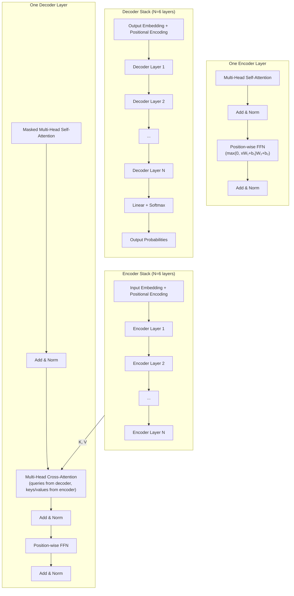
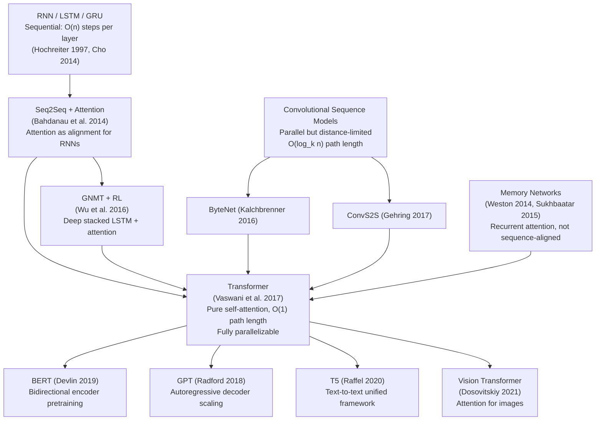

# The Transformer: Attention Is All You Need

**Paper:** Attention Is All You Need
**Authors:** Ashish Vaswani, Noam Shazeer, Niki Parmar, Jakob Uszkoreit, Llion Jones, Aidan N. Gomez, Łukasz Kaiser, Illia Polosukhin (Google Brain / Google Research)
**arXiv:** 1706.03762 (2017), published at NeurIPS 2017

**Related pages:** [Collaborative Multi-Head Attention](../attention-variants/collaborative-attention.md) · [FlashAttention](../flashattention/flashattention.md) · [Softmax](softmax.md) · [vLLM Framework](../../frameworks/vllm/vllm-framework.md)

## TL;DR

**What:** The Transformer — the first sequence transduction model that replaces all recurrence and convolution with multi-head self-attention, establishing the dominant architecture that now powers virtually all modern LLMs (GPT, BERT, etc.).

**How:** Stacked encoder-decoder layers where every token directly attends to every other token via scaled dot-product attention ($\operatorname{softmax}(QK^\top/\sqrt{d_k})V$), with multiple parallel "heads" capturing different representation subspaces, plus sinusoidal positional encodings to inject sequence order.

**The number:** 28.4 BLEU on WMT14 EN-DE (beating all prior ensembles by >2 BLEU) and 41.0 BLEU on EN-FR, while requiring only $3.3 \times 10^{18}$ FLOPs for the base model — a fraction of the compute used by recurrent competitors.

## The Big Picture



*① Input tokens are embedded, summed with sinusoidal positional encodings, and fed through 6 identical encoder layers. ② Each encoder layer runs multi-head self-attention (every token attends to all tokens in the input) followed by a position-wise FFN, with residual connections and layer normalization around each. ③ The decoder receives the encoder's output as keys and values for cross-attention. ④ The decoder's self-attention is causally masked — position $i$ can only attend to positions $\leq i$. ⑤ The decoder output passes through a linear layer and softmax to produce next-token probabilities.*

## Why This Exists

Before the Transformer, the best sequence models were built on RNNs (LSTMs, GRUs). These had a fundamental limitation:

**The sequential bottleneck.** To compute $h_t$ (the hidden state at position $t$), an RNN must first compute $h_{t-1}$. You cannot process token 50 until you've processed tokens 1–49. This means:

- **Training is slow.** A sequence of 100 tokens requires 100 sequential steps — you can't parallelize across positions. GPUs sit mostly idle.
- **Long-range dependencies are hard.** The signal must travel through $O(n)$ sequential transformations to connect distant tokens. Gradients vanish or explode (Hochreiter et al. 2001).
- **Memory limits batching.** Long sequences consume large activation memory, limiting batch sizes.

Convolutional alternatives (ByteNet, ConvS2S) improved parallelism but introduced distance-dependent path lengths: connecting distant positions required $O(\log_k n)$ or $O(n/k)$ layers. The Transformer solves both problems: **constant $O(1)$ path length** between any two positions (every token directly attends to every other) and **fully parallelizable** computation within each layer — all positions are processed simultaneously.

## The Landscape



*The Transformer unified two lineages: (1) the RNN + attention line, which had shown attention's power as a supplement to recurrence, and (2) the convolutional line, which demonstrated that parallel architectures could work for sequences. The key insight: if attention is so effective as a supplement, why not make it the only mechanism? The result eliminated the $O(n)$ sequential bottleneck entirely, enabling the scaling that would later birth BERT, GPT, and the modern LLM era.*

## The Core Idea

Replace recurrence with self-attention. In an RNN, information flows sequentially from token to token through hidden states — position $i$ can only influence position $j$ after $|j-i|$ sequential steps. In self-attention, every token directly queries every other token's key representation, producing attention weights in a single parallelizable matrix multiplication. To prevent this from collapsing into a single averaged representation, the model uses multiple "heads" — each head learns its own query, key, and value projections, allowing different heads to attend to different relationships (syntax, semantics, position, co-reference) simultaneously. Position information is injected via sinusoidal encodings added to the input embeddings, so the model can distinguish "dog bites man" from "man bites dog" despite having no built-in sequential structure.

## Deep Dive

### Scaled Dot-Product Attention

**What it does:** Computes a weighted sum of value vectors, where the weight of each value is determined by the compatibility ([dot product](../../terms/inner-product.md)) between a query and the corresponding key, scaled by $1/\sqrt{d_k}$.

**Why it matters:** This is the atomic operation that replaces recurrence. Every token interaction is a single matrix multiplication — $O(1)$ sequential steps instead of $O(n)$.

**How it works:**

Given queries $Q \in \mathbb{R}^{n \times d_k}$, keys $K \in \mathbb{R}^{n \times d_k}$, and values $V \in \mathbb{R}^{n \times d_v}$:

$$\operatorname{Attention}(Q, K, V) = \operatorname{softmax}\left(\frac{QK^\top}{\sqrt{d_k}}\right)V$$

| Step | Computation | Shape |
|---|---|---|
| 1. Scores | $S = QK^\top$ | $n \times n$ |
| 2. Scale | $S' = S / \sqrt{d_k}$ | $n \times n$ |
| 3. Normalize | $A = \operatorname{softmax}(S')$ (row-wise) | $n \times n$ |
| 4. Weight | $O = AV$ | $n \times d_v$ |

**The scaling factor $\sqrt{d_k}$:** Without scaling, as $d_k$ grows, dot products get larger in magnitude. This pushes softmax into regions with extremely small gradients (near 0 or 1). The $\sqrt{d_k}$ scaling keeps the variance of dot products stable, preserving gradient flow. This is why additive attention (Bahdanau) outperformed unscaled dot-product for large $d_k$ — the scaling fixes it.

**The intuition:** Imagine each token asking "which other tokens are relevant to me?" The query $q_i$ is the question token $i$ is asking. Every token $j$ publishes a key $k_j$ advertising what it contains. The dot product $q_i \cdot k_j$ measures relevance. The softmax normalizes these into a probability distribution, and the values $v_j$ are the actual information contributed. The output for token $i$ is the relevance-weighted blend of all values.

**A concrete example:** In the sentence "The cat sat on the mat because it was tired," the token "it" should attend strongly to "cat" (its referent). The query for "it" would produce a high dot product with the key for "cat," giving "cat's" value vector high weight in the output for "it."

**Remember:** **The $\sqrt{d_k}$ scaling is not cosmetic — without it, dot-product attention's gradients vanish for typical head dimensions, making the model untrainable.** The scaling normalizes dot-product variance to ~1.

### Multi-Head Attention

**What it does:** Runs $h$ independent attention operations in parallel, each with its own learned linear projections $W_i^Q, W_i^K, W_i^V$, then concatenates outputs and projects back.

**Why it matters:** A single attention head averages across different kinds of relationships. Multiple heads let the model attend to different representation subspaces simultaneously — one head might track syntax, another semantics, another positional proximity.

**How it works:**

$$\operatorname{MultiHead}(Q, K, V) = \operatorname{Concat}(\text{head}_1, \ldots, \text{head}_h) W^O$$
$$\text{head}_i = \operatorname{Attention}(QW_i^Q, KW_i^K, VW_i^V)$$

| Hyperparameter | Value (base model) | Rationale |
|---|---|---|
| $h$ (number of heads) | 8 | Empirically optimal; 1 head loses 0.9 BLEU, 32 heads loses 0.4 BLEU |
| $d_k, d_v$ (per-head dim) | 64 | $d_{\text{model}} / h = 512/8$; keeps total compute ~same as single-head |
| Total Q/K/V params | $3 \cdot d_{\text{model}}^2$ | $W_i^Q, W_i^K, W_i^V$ each project $d_{\text{model}} \to d_k$, summed over $h$ heads |

**Single head vs. multi-head: the shape breakdown.** The softmax **always operates over the sequence-length dimension**, producing an $[n \times n]$ attention matrix. The difference is how many independent attention matrices you get:

| | Single head ($h=1$, $d_k=512$) | Multi-head ($h=8$, $d_k=64$) |
|---|---|---|
| **Q, K, V projections** | $W^Q, W^K, W^V$: one set | $W_i^Q, W_i^K, W_i^V$: 8 independent sets |
| **Attention matrices** | **1** matrix per token, shape $[n \times n]$ | **8** matrices per token, each $[n \times n]$ |
| **Softmax distributions** | **1** probability distribution per token position | **8 different** probability distributions per token position |
| **What it asks** | "Which tokens are relevant to me?" — one blended answer | 8 different questions about relevance, each with its own answer |

**Why one head cannot do the work of many.** A single attention head, regardless of its dimensionality, produces exactly one softmax distribution per query token — one weighted average of value vectors. No matter how large $d_k$ is, a single softmax $\operatorname{softmax}(qK^\top/\sqrt{d_k})$ cannot simultaneously express "attend to the subject noun" AND "attend to the previous punctuation mark." These are fundamentally different attention patterns requiring different query/key projections — different questions asked of the same sequence. Multi-head gives you $h$ independent questions and $h$ independent answers, which $W^O$ then combines.

**What different heads actually learn.** Empirical inspection of attention distributions (shown in the paper's Appendix) reveals that heads spontaneously specialize:

| Head specialization | Pattern observed |
|---|---|
| **Syntactic dependencies** | Verb attends to its subject ("sat" → "cat"), noun attends to its modifier |
| **Co-reference resolution** | Pronoun attends to its antecedent ("it" → "cat"), relative pronoun to head noun |
| **Positional proximity** | Higher weight on adjacent or nearby tokens in the sequence |
| **Semantic similarity** | Tokens with related meaning cluster attention weights |
| **Delimiter and punctuation** | Periods, commas, sentence boundaries as attention anchors |
| **Diagonal/self-attention** | Token attends primarily to itself (identity-like behavior) |

**Too many heads hurt.** At $h=32$ with $d_k=16$, BLEU drops by 0.4 points. The reason: each head gets only $d_k=16$ dimensions for computing query-key compatibility — too narrow to form meaningful comparisons. This is the **low-rank bottleneck**: the per-head dimension $d_k = d_{\text{model}} / h$ shrinks as $h$ grows, and at some point the dot product $q \cdot k$ in $\mathbb{R}^{16}$ cannot reliably distinguish relevant from irrelevant tokens. The sweet spot ($h=8$, $d_k=64$) balances head specialization against per-head expressivity.

**The intuition:** Think of each head as a different "lens" through which the model views the sequence. Head 1 asks "which tokens are syntactically dependent on me?" Head 2 asks "which tokens share my semantic category?" Head 3 asks "which tokens are nearby in position?" Each head produces its own $[n \times n]$ attention map — a complete answer to its question for every token pair. The concatenation + projection step blends these complementary perspectives into one unified representation per token.

**A concrete example:** In "The cat sat on the mat because it was tired," a single-head model must blend all relationships into one attention distribution — averaging the syntactic link "sat→cat", the co-reference "it→cat", and positional proximity patterns into a single muddled weighting. A multi-head model can cleanly separate them: head 3 handles "sat→cat" (syntax), head 7 handles "it→cat" (co-reference), and head 1 handles positional adjacency — each producing a crisp, specialized attention pattern that $W^O$ later recombines.

**Remember:** **Multi-head attention gives the model $h$ independent softmax distributions per token — $h$ different answers to "which tokens matter?" — while single-head collapses this to one blended answer.** The softmax dimension is always the sequence length $n$, not $d_k$; what changes is how many distinct question-answering mechanisms operate in parallel.

### Three Flavors of Attention in the Transformer

**What it does:** The Transformer uses attention in three distinct configurations within the encoder-decoder architecture. Although all three use the same scaled dot-product formula, the source of $Q$, $K$, $V$ and the presence of masking give each a completely different role.

**Why it matters:** Understanding which type goes where and what data flows through each is essential for grasping the architecture's information flow. The three types are not interchangeable — each solves a different sub-problem.

| Type | Queries from | Keys/Values from | Masked? | Role |
|---|---|---|---|---|
| Encoder self-attention | Previous encoder layer (or embedding) | Same layer: keys and values built from the same input tokens | No | Every source token looks at every other source token to build a contextualized understanding |
| Decoder masked self-attention | Previous decoder layer (or embedding) | Same layer: keys and values built from the same decoder tokens | Yes (causal) | Every generated token looks at all **previous** generated tokens — but not future ones |
| Decoder cross-attention | Decoder layer output (after masked self-attn) | **Encoder output** (final layer of encoder stack) | No | Every decoder position looks at the entire source sentence to decide what to translate next |

#### Encoder Self-Attention in Detail

The encoder processes the entire source sentence **in one forward pass** (no autoregression). For source sentence "The cat sat":

```text
After embedding + positional encoding, we have:
  x₀ = embed("The") + PE₀    [512-dim]
  x₁ = embed("cat") + PE₁    [512-dim]  
  x₂ = embed("sat") + PE₂    [512-dim]

Stack into matrix X = [x₀; x₁; x₂]  → shape [3 × 512]

Self-attention projects X through W^Q, W^K, W^V for each head:
  Q = X·W^Q    [3 × 64] per head    ← "What am I looking for?"
  K = X·W^K    [3 × 64] per head    ← "What do I contain?"
  V = X·W^V    [3 × 64] per head    ← "What information do I contribute?"

Attention scores (one head):
  S = Q·K^T / √64    → [3 × 3]
  
  For token "cat" (row 1):
    S[1,:] = [score("cat"↔"The"), score("cat"↔"cat"), score("cat"↔"sat")]
  
  Softmax over each row:
    A[1,:] = [0.15, 0.60, 0.25]   ← "cat" attends mostly to itself, some to "sat", little to "The"
```

The encoder output for "cat" becomes $0.15 \cdot v_{\text{The}} + 0.60 \cdot v_{\text{cat}} + 0.25 \cdot v_{\text{sat}}$ — a contextualized representation enriched with information from surrounding words. This happens simultaneously for all positions.

#### Decoder Masked Self-Attention: The Causal Mask

The causal mask is used in **both training and inference** — it's a structural property of the decoder, not a training-only trick. What differs is the scenario, which changes how the mask *looks* but not what it *does*.

**During training (teacher forcing):** The entire target sentence is fed to the decoder at once. The causal mask prevents the model from cheating by looking at future tokens. This is the scenario shown below:

```text
Target: "<SOS> Die Katze saß"    (German translation)

Attention score matrix S (before softmax), shape [4 × 4]:
         <SOS>   Die   Katze  saß
<SOS>  [ s₀₀    s₀₁    s₀₂    s₀₃  ]
Die    [ s₁₀    s₁₁    s₁₂    s₁₃  ]
Katze  [ s₂₀    s₂₁    s₂₂    s₂₃  ]
saß    [ s₃₀    s₃₁    s₃₂    s₃₃  ]

Apply causal mask (set future positions to -∞):
         <SOS>   Die   Katze  saß
<SOS>  [ s₀₀    -∞     -∞     -∞   ]   ← <SOS> can only see itself
Die    [ s₁₀    s₁₁    -∞     -∞   ]   ← "Die" can see <SOS> and itself
Katze  [ s₂₀    s₂₁    s₂₂    -∞   ]   ← "Katze" can see <SOS>, "Die", itself
saß    [ s₃₀    s₃₁    s₃₂    s₃₃  ]   ← "saß" can see everything before it

After softmax (each row sums to 1, -∞ → 0):
         <SOS>   Die   Katze  saß
<SOS>  [ 1.0    0      0      0    ]
Die    [ 0.3    0.7    0      0    ]
Katze  [ 0.2    0.3    0.5    0    ]
saß    [ 0.1    0.2    0.3    0.4  ]
```

All four positions are computed **in parallel** despite the mask — this is why training is fast. The mask simply zeros out the forbidden attention weights after softmax.

**During inference (autoregressive generation):** The decoder runs one step at a time. The mask still applies, but the matrix is smaller because you only have the tokens generated so far:

```text
Step 1: input = ["<SOS>"]           mask: [1×1] — trivial
Step 2: input = ["<SOS>", "Die"]    mask: [2×2] lower-triangular
Step 3: input = ["<SOS>", "Die", "Katze"]  mask: [3×3] lower-triangular
Step 4: input = ["<SOS>", "Die", "Katze", "saß"]  mask: [4×4] lower-triangular
```

At each step, the newest position can attend to all previous positions but not to positions that haven't been generated yet (which don't even exist). The mask is still needed because the matrix multiplication $QK^\top$ would otherwise create entries for those non-existent positions, and also to maintain consistency with the training-time behavior the model learned.

**Why the mask must exist in both modes:** If the model learned during training that "Katze" could see "saß" (no mask), but at inference "saß" hasn't been generated yet, the model would produce garbage. The causal mask ensures that **training conditions and inference conditions are identical**: every position always sees only the prefix ending at itself.

#### Decoder Cross-Attention: Linking Source to Target

This is where translation actually happens. After the decoder's masked self-attention builds a representation of "what I've generated so far," cross-attention connects it to the source sentence:

```text
Q comes from:  decoder layer (output of masked self-attention + add & norm)
               → represents "what the decoder currently knows"
K, V come from: encoder final output (all 6 encoder layers)
               → represents "the fully understood source sentence"

For head i:
  Q_dec = DecoderOutput · W_i^Q_dec    [4 × 64]   4 decoder positions
  K_enc = EncoderOutput · W_i^K_enc    [3 × 64]   3 source positions  
  V_enc = EncoderOutput · W_i^V_enc    [3 × 64]   3 source positions
  
  Scores = Q_dec · K_enc^T / √64      [4 × 3]
  
         The(en)  cat(en)  sat(en)
<SOS>  [ 0.1      0.1      0.1    ]   ← <SOS> attends uniformly (no content yet)
Die    [ 0.6      0.2      0.1    ]   ← "Die" strongly attends to "The"
Katze  [ 0.1      0.7      0.1    ]   ← "Katze" strongly attends to "cat"  
saß    [ 0.1      0.1      0.6    ]   ← "saß" strongly attends to "sat"
```

This is the alignment magic: the model learns to map each target-language token to the relevant source-language token(s). "Katze" queries the encoder and finds that "cat"'s key matches best. The cross-attention weights are what you typically visualize as "attention heatmaps" in translation papers.

**The intuition:** Encoder self-attention is "understand the input by looking at all of it." Decoder masked self-attention is "understand what I've generated so far, without peeking at the future." Decoder cross-attention is "given what I've generated so far, which parts of the input are relevant next?" — this is the bridge between languages.

**A concrete example — why the causal mask is necessary:** Without the mask during training, when generating "Katze" (the 3rd token), the model could simply look at the ground-truth token "saß" (the 4th token) and memorize the pattern. At inference time, "saß" hasn't been generated yet, so the model would fail. The causal mask ensures training and inference conditions match exactly.

**Remember:** **The causal mask in decoder self-attention ensures training mirrors inference — position $i$ can only see positions $1 \ldots i$.** Cross-attention has no mask because the entire source sentence is available at all times during both training and inference. The encoder runs once on the source; the decoder runs autoregressively, one new token per step, cross-attending to the same encoder output at every step.

### Position-wise Feed-Forward Networks

**What it does:** A two-layer MLP ($\text{ReLU}(xW_1 + b_1)W_2 + b_2$) applied identically to every position independently.

**Why it matters:** Attention mixes information across positions but is essentially linear (weighted sum). The FFN adds nonlinear capacity and position-specific processing. Together, attention handles the "where to look" and FFN handles the "what to do with it."

| Parameter | Value | Note |
|---|---|---|
| Input/output dim | $d_{\text{model}} = 512$ | Same as residual stream |
| Hidden dim | $d_{ff} = 2048$ | 4× expansion |
| Activation | ReLU | $\max(0, \cdot)$ |

**The intuition:** After attention has gathered relevant information from other positions, the FFN processes each position's enriched representation through two dense layers. The 4× expansion gives the model enough capacity to transform the representation meaningfully before projecting back.

**Remember:** **The FFN is applied per-position with shared weights — it's equivalent to two 1×1 convolutions across the sequence dimension.** Every position gets the same transformation, but the input to each position differs because attention already mixed information across positions.

### Positional Encoding

**What it does:** Adds a fixed (non-learned) sinusoidal signal to input embeddings so the model can distinguish token order despite having no recurrence or convolution.

**Why it matters:** Self-attention is permutation-equivariant — shuffling the input tokens shuffles the output in the same way. Without positional encoding, "dog bites man" and "man bites dog" produce identical representations (just permuted). The positional encoding breaks this symmetry.

**How it works:**

$$PE_{(pos, 2i)} = \sin(pos / 10000^{2i/d_{\text{model}}})$$
$$PE_{(pos, 2i+1)} = \cos(pos / 10000^{2i/d_{\text{model}}})$$

| Property | Mechanism |
|---|---|
| Different positions → different encodings | Sinusoids with different frequencies |
| Relative position is learnable | $PE_{pos+k}$ is a linear function of $PE_{pos}$ for any fixed $k$ |
| Extrapolates to longer sequences | Formula works for any $pos$, not just those seen in training |
| Learned vs. sinusoidal | Nearly identical results (Table 3 row E), sinusoidal chosen for extrapolation |

**The intuition:** Each dimension of the positional encoding is a sinusoid at a different frequency. Low dimensions oscillate slowly (encoding coarse position), high dimensions oscillate fast (encoding fine position). The combination across all dimensions creates a unique "signature" for each position — like a barcode with varying stripe widths.

**A concrete example:** For position 0 and dimension $i=0$: $PE_{(0,0)} = \sin(0) = 0$. For position 1: $PE_{(1,0)} = \sin(1/10000^0) = \sin(1) \approx 0.84$. The encoding shifts smoothly with position, and the model can learn to attend to tokens with specific positional offsets by learning to combine these sinusoidal features.

**Remember:** **The sinusoidal encoding is not learned — it's a deterministic function of position — yet it works as well as learned embeddings and generalizes to sequence lengths unseen during training.** This is because $PE_{pos+k}$ is a linear function of $PE_{pos}$, letting the model learn relative position through linear combinations.

### Residual Connections and Layer Normalization

**What it does:** Wraps every sub-layer (attention and FFN) with [LayerNorm](../../terms/layer-normalization.md): $\operatorname{LayerNorm}(x + \operatorname{Sublayer}(x))$.

**Why it matters:** Without residual connections, deep transformers are impossible to train. The residuals create "gradient highways" that let training signal flow directly from the output back to the input, bypassing the sub-layer. LayerNorm stabilizes activations.

**The order matters:** The Transformer uses **post-layer-norm**: add residual first, then normalize. Later architectures (GPT-2, etc.) switched to **pre-layer-norm** (normalize first, then add residual) for better training stability, but the original Transformer's post-norm design is what the paper uses.

| Component | Purpose |
|---|---|
| Residual connection ($x + \operatorname{Sublayer}(x)$) | Gradient flow, identity shortcut |
| LayerNorm | Stabilize activation distribution across features |

**Remember:** **Every sub-layer in the Transformer — attention and FFN in both encoder and decoder — has its own residual connection and layer normalization.** This "Add & Norm" pattern became standard in virtually all subsequent transformer architectures.

### Training Recipe

**What it does:** The specific optimization and regularization choices that make the Transformer trainable.

| Component | Setting | Why |
|---|---|---|
| Optimizer | Adam ($\beta_1=0.9$, $\beta_2=0.98$, $\epsilon=10^{-9}$) | Standard at the time |
| Learning rate schedule | Warmup (4000 steps) + inverse sqrt decay | $lr = d_{\text{model}}^{-0.5} \cdot \min(step^{-0.5}, step \cdot warmup^{-1.5})$ |
| Dropout | $P_{drop} = 0.1$ (base), 0.1–0.3 (big) | Applied to every sub-layer output and embedding sums |
| Label smoothing | $\epsilon_{ls} = 0.1$ | Hurts perplexity but improves BLEU (model is less overconfident) |
| Checkpoint averaging | Last 5 (base) / 20 (big) checkpoints | Reduces variance from optimizer noise |

**The warmup schedule is critical:** Without it, the model diverges early in training. The linear warmup phase lets the optimizer establish reasonable parameter scales before the learning rate decays, preventing the large initial gradients from destabilizing the residual connections.

**Remember:** **Label smoothing + dropout + checkpoint averaging form a regularization triad.** Label smoothing prevents overconfidence, dropout prevents co-adaptation, and checkpoint averaging reduces variance. All three contribute to the final BLEU score.

## Putting It Together

A detailed end-to-end trace through the Transformer during English-to-German translation at **inference time**. The source sentence is "The cat sat" (tokenized as `["The", "cat", "sat"]`).

### Phase 1: Encode the Source (One Pass)

This runs exactly once — the encoder output is cached and reused for every decoder step.

```text
Step 1.1 — Embed + Positional Encode:
  "The" → embed("The") + PE₀  = x₀  [512-dim]
  "cat" → embed("cat") + PE₁  = x₁  [512-dim]
  "sat" → embed("sat") + PE₂  = x₂  [512-dim]
  Stacked: X = [x₀; x₁; x₂]  →  [3 × 512]

Step 1.2 — Encoder Layer 1 (of 6):
  a) Multi-Head Self-Attention:
     For each head h ∈ {1..8}:
       Q_h = X · W_h^Q   [3 × 64]
       K_h = X · W_h^K   [3 × 64]    ← same X: "self"-attention
       V_h = X · W_h^V   [3 × 64]
       A_h = softmax(Q_h·K_h^T / √64) · V_h   [3 × 64]
     Concat all 8 heads → [3 × 512], project with W^O → [3 × 512]
     Add residual: X' = LayerNorm(X + AttentionOutput)  [3 × 512]

  b) Position-wise FFN:
     For each position independently:
       FFN(x) = ReLU(x·W₁ + b₁)·W₂ + b₂   [512 → 2048 → 512]
     Add residual: X'' = LayerNorm(X' + FFNOutput)  [3 × 512]

Step 1.3 — Repeat for layers 2–6:
  Each layer takes the previous layer's output as its X.
  After 6 layers: EncoderOutput = [3 × 512]

Key insight: "cat" at position 1 now contains information from "The" and "sat"
because attention mixed them. The encoder output is a contextualized matrix where
every token "knows about" every other token.
```

### Phase 2: Generate the Target (Autoregressive Loop)

The decoder generates one token at a time. Each step uses the **same** encoder output but a **growing** decoder input sequence.

```text
Initial state: decoder_input = ["<SOS>"]   (start-of-sequence token)
```

#### Decoder Step 1: Generate the first target token

```text
Step 2.1 — Embed + Positional Encode the decoder input so far:
  decoder_input = ["<SOS>"]
  y₀ = embed("<SOS>") + PE₀   [512-dim]
  Y = [y₀]   [1 × 512]

Step 2.2 — Decoder Layer 1 (of 6):

  a) Masked Self-Attention:
     Q = Y · W^Q   [1 × 64]
     K = Y · W^K   [1 × 64]
     V = Y · W^V   [1 × 64]
     
     Scores = Q·K^T / √64   [1 × 1] — just one score
     Mask: no masking needed (only one position exists)
     A = softmax(Scores) · V   [1 × 64]
     
     After all 8 heads + concat + W^O: SelfAttnOutput = [1 × 512]
     Add & Norm: Y' = LayerNorm(Y + SelfAttnOutput)   [1 × 512]

  b) Cross-Attention (the critical step!):
     Q comes from Y' (decoder):  Q_cross = Y' · W_cross^Q   [1 × 64]
     K comes from encoder:       K_cross = EncoderOutput · W_cross^K   [3 × 64]
     V comes from encoder:       V_cross = EncoderOutput · W_cross^V   [3 × 64]
     
     Scores = Q_cross · K_cross^T / √64   [1 × 3]
            The(en)  cat(en)  sat(en)
     <SOS> [ 0.33     0.33     0.33   ]   ← uniform: <SOS> has no content yet
     
     CrossAttnOutput = softmax(Scores) · V_cross   [1 × 64]
     After all heads + W^O: [1 × 512]
     Add & Norm: Y'' = LayerNorm(Y' + CrossAttnOutput)   [1 × 512]

  c) FFN (same as encoder):
     Y''' = LayerNorm(Y'' + FFN(Y''))   [1 × 512]

Step 2.3 — Repeat decoder layers 2–6:
  Each layer has masked self-attn → cross-attn → FFN.
  After 6 layers: DecoderOutput = [1 × 512]

Step 2.4 — Output Projection:
  logits = DecoderOutput · W_vocab   [1 × 37000]
  probs = softmax(logits)            [1 × 37000]
  
  Highest probability token: "Die" (score 0.42)
  
  Generated so far: ["<SOS>", "Die"]
```

#### Decoder Step 2: Generate the second target token

```text
Step 3.1 — Embedding + Positional Encoding:
  Now decoder_input = ["<SOS>", "Die"]
  y₀ = embed("<SOS>") + PE₀   [512-dim]
  y₁ = embed("Die")   + PE₁   [512-dim]
  Y = [y₀; y₁]  →  [2 × 512]    ← TWO positions now

Step 3.2 — Masked Self-Attention:
  Q = Y · W^Q   [2 × 64]
  K = Y · W^K   [2 × 64]
  V = Y · W^V   [2 × 64]
  
  Scores (before mask) = Q·K^T / √64   [2 × 2]:
            <SOS>    Die
    <SOS>  [ 0.8      0.2  ]
    Die    [ 0.3      0.7  ]

  Apply causal mask (set upper triangle to -∞):
            <SOS>    Die
    <SOS>  [ 0.8      -∞  ]    ← <SOS> can only see itself
    Die    [ 0.3      0.7 ]    ← "Die" can see <SOS> and itself

  After softmax:
            <SOS>    Die
    <SOS>  [ 1.0      0    ]
    Die    [ 0.4      0.6  ]
  
  Each position's output is a weighted blend of visible positions' values.

Step 3.3 — Cross-Attention:
  Q comes from decoder (after self-attn + norm):  [2 × 64]
  K, V come from encoder (same as step 1!):       [3 × 64]
  
  Scores = Q_cross · K_cross^T / √64   [2 × 3]:
            The(en)  cat(en)  sat(en)
    <SOS>  [ 0.25     0.30     0.45   ]    ← still somewhat uniform
    Die    [ 0.65     0.20     0.15   ]    ← "Die" strongly attends to "The"!

  This is alignment: the model learned that German "Die" corresponds to English "The".

Step 3.4 — FFN → Output Projection:
  After all 6 decoder layers:
  logits for position 1 ("Die"'s output): [37000-dim]
  Highest probability token: "Katze" (score 0.38)
  
  Generated so far: ["<SOS>", "Die", "Katze"]
```

#### Decoder Step 3: Generate the third token

```text
decoder_input = ["<SOS>", "Die", "Katze"]   [3 × 512]

Masked Self-Attention (causal mask grows):
         <SOS>   Die    Katze
<SOS>  [ 1.0      0      0    ]
Die    [ 0.35     0.65   0    ]    ← "Die" sees <SOS> and itself
Katze  [ 0.15     0.25   0.60 ]    ← "Katze" sees all three

Cross-Attention:
         The(en)  cat(en)  sat(en)
<SOS>  [ 0.20     0.40     0.40   ]
Die    [ 0.60     0.25     0.15   ]
Katze  [ 0.10     0.75     0.15   ]    ← "Katze" strongly aligns to "cat"

Output: highest probability token is "saß"

Generated so far: ["<SOS>", "Die", "Katze", "saß"]
```

#### Decoder Step 4: Generate the end

```text
decoder_input = ["<SOS>", "Die", "Katze", "saß"]   [4 × 512]

After all sub-layers and output projection:
  Highest probability token: "<EOS>" (end-of-sequence)
  
Final output: "Die Katze saß"  ("The cat sat")
```

### Summary of the Data Flow

| Phase | What runs | How many times | Key property |
|---|---|---|---|
| Encoder | 6 layers of self-attention + FFN | **Once** per input sentence | Fully parallel: all tokens processed simultaneously |
| Decoder | 6 layers of (masked self-attn → cross-attn → FFN) | **Once per output token** | Sequential: each step depends on all previous outputs |
| Cross-attention K,V | Encoder final output | **Reused every decoder step** | Never changes — the source is fully known upfront |
| Causal mask | Decoder self-attention | **Grows each step** | Position $i$ sees positions $0 \ldots i$ only |

### Training vs. Inference: The Key Difference

During **training**, the decoder receives the entire target sentence at once with teacher forcing. The causal mask still prevents looking ahead, but all positions are computed in parallel — no autoregressive loop. The loss is computed by comparing each position's prediction to the ground-truth next token.

During **inference**, the decoder truly runs autoregressively: generate token 1, feed it back as input, generate token 2, feed it back, etc. The encoder output is computed once and cached. This is why inference is slower than training per token — you can't parallelize across decoder positions.

## What This Buys You

### The headline claim

The Transformer achieves better translation quality than all prior approaches (including ensembles) while being **faster to train by an order of magnitude** and fully parallelizable — establishing the architecture that now dominates all of NLP and beyond.

### How we know: Machine Translation

| Model | EN-DE BLEU | EN-FR BLEU | Training FLOPs |
|---|---|---|---|
| GNMT + RL (Wu 2016) | 24.6 | 39.92 | $2.3 \times 10^{19}$ / $1.4 \times 10^{20}$ |
| ConvS2S (Gehring 2017) | 25.16 | 40.46 | $9.6 \times 10^{18}$ / $1.5 \times 10^{20}$ |
| **Transformer (base)** | **27.3** | **38.1** | **$3.3 \times 10^{18}$** |
| **Transformer (big)** | **28.4** | **41.0** | $2.3 \times 10^{19}$ |
| GNMT + RL Ensemble | 26.30 | 41.16 | $1.8 \times 10^{20}$ |
| ConvS2S Ensemble | 26.36 | 41.29 | $7.7 \times 10^{19}$ |

The base Transformer beats all previous single models and ensembles on EN-DE at **~1/7 the training FLOPs** of the next-best single model (ConvS2S). The big model beats the best ensemble by >2 BLEU on EN-DE.

### How we know: Ablation experiments

| Ablation | BLEU (dev) | Δ | Lesson |
|---|---|---|---|
| Base (8 heads, $d_k=64$) | 25.8 | — | Baseline |
| Single head ($h=1$, $d_k=512$) | 24.9 | −0.9 | Multi-head is essential |
| 32 heads ($d_k=16$) | 25.4 | −0.4 | Too many heads (too small per-head) hurts |
| $d_k=16$ (smaller keys) | 25.1 | −0.7 | Key dimension matters for compatibility |
| $N=2$ layers | 23.7 | −2.1 | Depth is critical |
| No dropout | — | worse | Dropout prevents overfitting |
| Learned positional encoding | ~25.8 | ~0 | Equivalent to sinusoidal |

### The mechanism behind the numbers

The Transformer's advantage comes from two sources: (1) **parallelizability** — all positions are processed simultaneously, so you can train on more data in less time, and (2) **constant path length** — any two positions are connected through exactly one attention operation (plus the FFN), making gradient flow independent of sequence length.

### ⚠️ How to read these numbers

- The EN-FR base model BLEU (38.1) is lower than some competitors because the base model is under-parameterized for the much larger EN-FR dataset (36M sentence pairs vs. 4.5M for EN-DE). The big model closes this gap.
- Training FLOPs are estimated, not directly measured — computed as `training_time × num_GPUs × sustained_FP32_TFLOPS_per_GPU`.
- BLEU scores are on newstest2014, which later models have since surpassed. The point is the architectural innovation, not the absolute number.

## Where It Breaks

| Failure mode | When it happens | Impact |
|---|---|---|
| Quadratic complexity ($O(n^2)$ memory/time) | Long sequences ($n > 1000$) | Memory explodes for long documents, genomes, high-res images; motivates later sparse/[linear attention](../../terms/linear-attention.md) work (FlashAttention, Performer, etc.) |
| No built-in positional structure | Tasks requiring precise relative positioning beyond what sinusoids capture | Sinusoidal encoding captures relative position but may struggle with hierarchical or recursive structure; learned positional encodings or relative position biases (Shaw 2018, T5) later improved this |
| Autoregressive decoding is still sequential | Generation at inference time | Training is parallel, but generation still produces one token at a time — each step depends on all previous steps; motivates speculative decoding, non-autoregressive models |
| Post-layer-norm training instability | Deep models or large learning rates | The original "Add then Norm" order can cause training instability in very deep networks; GPT-2 and later switched to pre-norm (Norm then Add) |
| Limited context window | Fixed positional encoding implies a maximum sequence length | The sinusoidal encoding works for any position, but the model was trained on a finite range and may not generalize perfectly; modern models use RoPE, ALiBi, or longer training windows |
| Label smoothing hurts perplexity | Perplexity is used as a training metric | Label smoothing makes the model less confident (higher perplexity) even though BLEU improves — don't judge training quality by perplexity alone |

## One Thing to Remember

**The Transformer replaced the $O(n)$ sequential bottleneck of RNNs with a constant $O(1)$ path length between any two tokens — every token directly attends to every other token.** This single insight — that attention alone, without recurrence or convolution, is sufficient for sequence transduction — enabled the parallel training that made scaling to billions of parameters practical. Multi-head attention ensures the model doesn't collapse into a single averaged representation; positional encoding injects order into an otherwise order-agnostic architecture; and residual connections with layer normalization make the deep stack trainable. **The architecture is deceptively simple: scaled dot-product attention, multi-head parallelism, feed-forward processing, and positional sinusoids — four ideas that together reshaped machine learning.**

## Go Deeper

- **Read:** [arXiv:1706.03762](https://arxiv.org/abs/1706.03762) · The Annotated Transformer (Harvard NLP)
- **Build on:** BERT (Devlin et al. 2019), GPT series (Radford et al.), T5 (Raffel et al. 2020), Vision Transformer (Dosovitskiy et al. 2021)
- **Understand the context:** [Collaborative Multi-Head Attention](../attention-variants/collaborative-attention.md) (head redundancy) · [FlashAttention](../flashattention/flashattention.md) (IO-aware attention) · [Softmax](softmax.md) (the attention nonlinearity) · [vLLM Framework](../../frameworks/vllm/vllm-framework.md) (Transformer serving with PagedAttention)
- **Dig into the mechanism:** [PagedAttention](../../terms/pagedattention.md) for the paged KV-cache layout behind vLLM's Transformer serving.
- **Reproduce:** Original code at `tensorflow/tensor2tensor` (GitHub)
