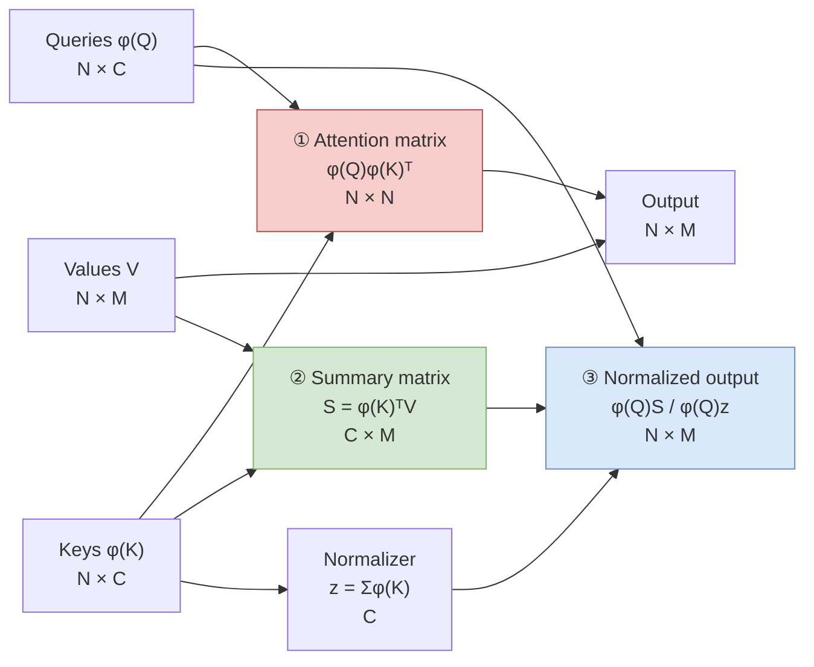
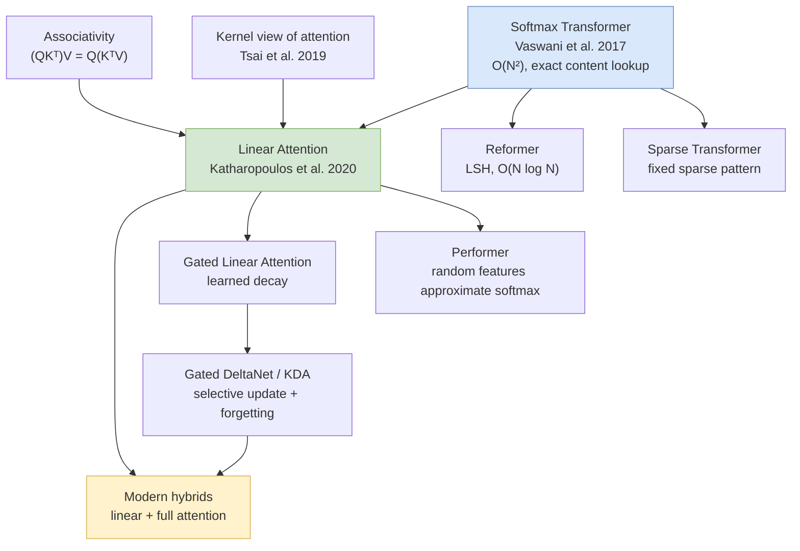

# Transformers Are RNNs: Linear Attention

**Paper:** Transformers are RNNs: Fast Autoregressive Transformers with Linear Attention  
**Authors:** Angelos Katharopoulos, Apoorv Vyas, Nikolaos Pappas, and François Fleuret  
**arXiv:** [2006.16236v3](https://arxiv.org/abs/2006.16236) (June 2020; revised August 2020)

**Related pages:** [The Transformer](../transformer.md), [FlashAttention](../flashattention.md), [Kimi Linear](../../training/kimi-linear/index.md)

## TL;DR

**What:** The paper introduces [linear attention](../../terms/linear-attention.md), an attention variant whose time and memory scale linearly rather than quadratically with sequence length.

**How:** It replaces softmax attention with a non-negative feature-map kernel and computes $\phi(Q)(\phi(K)^T V)$ instead of $(\phi(Q)\phi(K)^T)V$; under causal masking, two prefix sums become a recurrent state.

**The number:** On the paper's CIFAR-10 autoregressive benchmark, the implementation generated 17.85 images/s versus 0.004 for its uncached softmax baseline—reported as 4,462× throughput—while reaching 3.40 versus 3.47 bits/dim.

## The Big Picture

*① Ordinary attention materializes all query–key pair scores. ② Reordering computes a compact key–value summary first. ③ Every query reads that summary and uses a second key summary for normalization; the red $N \times N$ matrix disappears.*

*Editable source: [associative-reordering.mmd](./assets/associative-reordering.mmd).*

**The novelty is not faster multiplication of the same softmax matrix.** It changes the similarity function so the computation can be reassociated without ever constructing that matrix.

## Why This Exists

Consider generating a $32 \times 32$ RGB image one channel value at a time: the sequence contains 3,072 steps. At step 3,000, ordinary causal attention compares the new query with every preceding key, and an uncached implementation recomputes the growing history. Even with a [key/value cache](../../terms/kv-cache.md), the stored history and work per new token grow with sequence length.

The paper asks whether the history can instead be compressed into a fixed-size summary. Its answer trades exact softmax retrieval for a recurrent matrix that accumulates key–value associations. In the same CIFAR-10 scenario, each new pixel-channel updates and queries that state in constant work with respect to elapsed sequence length.

## The Landscape

*Softmax attention spawned sparse approximations that retain selected pairwise comparisons, while the kernel view plus associativity produced a different branch: fixed-size recurrent summaries. Performer later approximated the softmax kernel; gated and hybrid descendants made the recurrent memory more selective.*

*Editable source: [landscape.mmd](./assets/landscape.mmd).*

## The Core Idea

**Summarize the past before asking a question of it.** If query–key similarity factors into a dot product of feature maps, all past keys and values can be folded into one small matrix. A query then reads that matrix directly. With causal attention, updating the matrix one token at a time is exactly a recurrent computation.

## Symbol Map

$N$ is sequence length, $D$ the query/key dimension, $M$ the value dimension, and $C$ the feature-map dimension. Subscript $i$ means “up to the current causal position.”

| Symbol | Human name | Shape / scope | Plain meaning |
|---|---|---|---|
| $\phi(\cdot)$ | kernel feature map | $\mathbb{R}^D \to \mathbb{R}^C$ | Maps queries and keys to non-negative features. |
| $S_i$ | key–value state | $C \times M$ | Prefix sum of outer products $\sum_{j \le i}\phi(K_j)V_j^T$. |
| $Z_i$ | key normalizer state | $C$ | Prefix sum $\sum_{j \le i}\phi(K_j)$. |
| $V'_i$ | attention output | $M$ | Normalized read from $S_i$ using the current query. |

## Deep Dive

### Factor the Similarity Kernel

**What it does:** Replaces $\exp(q^Tk/\sqrt D)$ with a non-negative kernel $\phi(q)^T\phi(k)$.

**Why it matters:** Softmax's exact exponential kernel does not have a practical finite-dimensional exact feature map, so it blocks the desired reordering.

**How it works:** The experiments use $\phi(x)=\operatorname{ELU}(x)+1$. Positivity keeps similarities and the normalization denominator non-negative. This is a different attention rule, not an exact softmax algorithm.

**The intuition:** Turn each key and query into coordinates in which similarity is an ordinary dot product.

**A concrete example:** Each earlier CIFAR-10 pixel-channel becomes a positive feature vector rather than one row in a growing softmax score matrix.

**Remember:** The linear complexity comes from **changing the kernel**, not merely changing implementation order.

### Reassociate the Products

**What it does:** Computes $\phi(Q)(\phi(K)^TV)$ instead of $(\phi(Q)\phi(K)^T)V$.

**Why it matters:** The first order creates an $N \times N$ intermediate; the second creates a $C \times M$ summary.

**How it works:**

$$
V'_i =
\frac{\phi(Q_i)^T\left(\sum_j \phi(K_j)V_j^T\right)}
{\phi(Q_i)^T\left(\sum_j \phi(K_j)\right)}.
$$

For fixed $C$ and $M$, computing the summaries and reading them for all $N$ queries costs $O(NCM)$ rather than softmax attention's $O(N^2\max(D,M))$.

**The intuition:** Add documents to an index once, then answer each query from the index.

**A concrete example:** The CIFAR-10 model folds all 3,072 earlier pixel-channel associations into one per-head matrix instead of retaining 3,072 separate score entries for every query.

**Remember:** Associativity removes sequence length from the size of the intermediate state.

### Turn Causal Attention into a Recurrence

**What it does:** Maintains the two summaries as prefix states:

$$
S_i=S_{i-1}+\phi(K_i)V_i^T,\qquad
Z_i=Z_{i-1}+\phi(K_i).
$$

**Why it matters:** Autoregressive decoding cannot parallelize across future tokens, so constant work and constant state per step are more important than full-sequence parallelism.

**How it works:** After updating $S_i$ and $Z_i$, the layer outputs

$$
V'_i=\frac{\phi(Q_i)^TS_i}{\phi(Q_i)^TZ_i},
$$

where the numerator is an $M$-dimensional weighted sum of past values and the denominator is a scalar (the sum of the same similarity weights used to scale them). The shapes differ — $S_i$ is $C \times M$, $Z_i$ is $C$ — so the two $\phi(Q_i)^T$ products do not cancel.

The paper also derives forward and reverse cumulative-sum gradients so causal training remains linear-time without storing every $S_i$ matrix.

**The intuition:** A causal linear-attention layer is an RNN whose hidden state is a key–value association table plus its normalizer.

**A concrete example:** After emitting each pixel-channel, the generator performs one rank-one state update; the state shape is unchanged at pixel 10 and pixel 3,000.

**Remember:** The Transformer–RNN equivalence is an operational recurrence, not just an analogy.

## Putting It Together

1. **Project:** The current pixel embedding becomes $Q_i$, $K_i$, and $V_i$.
2. **Map:** Apply $\operatorname{ELU}(x)+1$ to the query and key.
3. **Write:** Add the current key–value outer product to $S_i$ and the key feature to $Z_i$.
4. **Read:** Contract the current query feature with both states.
5. **Normalize:** Divide the value read by the scalar normalizer read.
6. **Predict:** Feed the result through the rest of the Transformer block to predict the next pixel-channel, carrying only $S_i$ and $Z_i$ forward.

## What This Buys You

### The headline claim

**The recurrent formulation makes long autoregressive generation dramatically faster in the paper's implementation while preserving near-baseline image density modeling.**

### How we know: autoregressive image generation

| CIFAR-10 method | Bits/dim ↓ | Images/s ↑ | Reported throughput vs. softmax |
|---|---:|---:|---:|
| Softmax (uncached PyTorch baseline) | 3.47 | 0.004 | 1× |
| LSH-1 | 3.39 | 0.015 | 3.75× |
| Linear attention | 3.40 | 17.85 | 4,462× |

The supplementary stateful-softmax baseline, which caches keys and values, reached 0.32 images/s; linear attention was still about 56× faster in that throughput setup. At batch size 1, however, linear attention took 61.3 seconds per CIFAR-10 image versus 70.4 seconds for stateful softmax—a much smaller 1.14× latency advantage.

### The mechanism behind the numbers

The benchmark amplifies the benefit because generation is long, sequential, and highly batchable. The linear model's fixed state allows a batch of many simultaneous generations, whereas the baselines' growing histories constrain batch size and repeat more work.

### ⚠️ How to read these numbers

The famous 4,000× figure is **throughput against the paper's uncached softmax implementation, not a universal latency speedup over modern cached attention kernels**. Batch sizes differed in the main CIFAR-10 comparison, hardware and software are from 2020, and the model changes the attention kernel. The speech-recognition result also shows the quality trade: softmax reached 5.12 phoneme error rate versus linear attention's 8.08, although linear trained 3.3× faster per epoch.

## Where It Breaks

| Failure mode | When it happens | Impact |
|---|---|---|
| Exact retrieval is required | A query must select one precise old token from many similar items | The fixed-size summary can collide or overwrite associations; full attention retains explicit token access. |
| Feature dimension is not small | $C$ or $M$ is comparable to or larger than sequence length | $O(NCM)$ may lose its practical advantage despite being linear in $N$. |
| Softmax behavior must be preserved | Replacing a pretrained softmax layer without retraining | $\operatorname{ELU}+1$ attention is not exact softmax, so outputs and learned behavior change. |
| Denominator becomes poorly conditioned | Query features have very weak overlap with accumulated key features | Normalization can become numerically unstable and needs an epsilon in practice. |
| Task favors exact global comparison | The WSJ speech-recognition setup in this paper | Linear attention was faster but had 8.08 PER versus softmax's 5.12. |
| Headline throughput is generalized | Comparing with cached, fused modern attention at batch size 1 | The paper's 4,462× headline can greatly overstate the deployment advantage. |

## One Thing to Remember

**Linear attention turns the token history into a recurrent key–value summary.** The identity $\phi(Q)(\phi(K)^TV)$ removes the quadratic attention matrix, and causal prefix sums make decoding constant-state—but that efficiency is purchased by replacing exact softmax attention with a lossy fixed-capacity memory.

## Go Deeper

- **Read:** [arXiv paper](https://arxiv.org/abs/2006.16236) and the repository source PDF.
- **Build on:** [Performer](https://arxiv.org/abs/2009.14794) for random-feature softmax approximation; [Kimi Linear](../../training/kimi-linear/index.md) for modern gated, hybrid linear attention.
- **Understand the context:** [The Transformer](../transformer.md) for softmax attention; [FlashAttention](../flashattention.md) for exact, IO-aware softmax attention.
- **Reproduce:** [idiap/fast-transformers](https://github.com/idiap/fast-transformers), the authors' implementation.
- **Edit diagrams:** [Associative reordering](./assets/associative-reordering.mmd) and [landscape](./assets/landscape.mmd).
