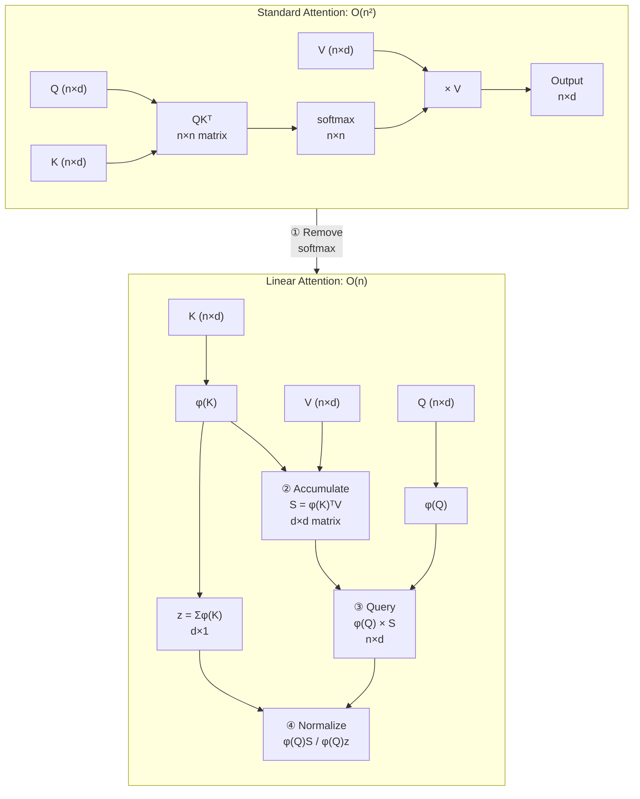
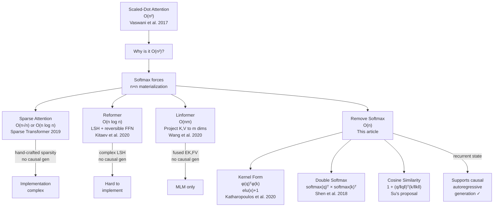

# 线性Attention的探索：Attention必须有个Softmax吗？

**Article:** 线性Attention的探索：Attention必须有个Softmax吗？  
**Author:** 苏剑林 (Su Jianlin)  
**Published:** 2020-07-04, [spaces.ac.cn/archives/7546](https://spaces.ac.cn/archives/7546)

**Related pages:** [Recurrent Neural Networks](../foundations/recurrent-neural-networks/index.md), [The Transformer](../foundations/transformer.md), [Linear Attention (Transformers Are RNNs)](index.md), [The Softmax Function](../foundations/softmax.md), [Linear Attention term](../../terms/linear-attention.md)

**Capture note:** The source site applies strict anti-crawling measures (HTTP 403). This capture was obtained through the Wayback Machine archive snapshot dated 2025-01-17.

## TL;DR

**What:** A survey-style blog post that identifies softmax as the root cause of attention's $\mathcal{O}(n^2)$ complexity and surveys three approaches to linear attention — kernel feature maps, double-softmax normalization, and a cosine-similarity Taylor approximation — all achieving $\mathcal{O}(n)$ complexity.

**How:** Removing softmax allows the matrix product $QK^\top V$ to be re-associated as $Q(K^\top V)$, collapsing the $n \times n$ attention matrix into a $d \times d$ summary; the non-negativity constraint $\text{sim}(q, k) \geq 0$ is satisfied via activation functions, per-dimension softmax, or $l_2$ normalization with a Taylor expansion.

**The number:** The post does not report its own experiments; it catalogs the theoretical $\mathcal{O}(n)$ reduction and identifies that these approaches all support autoregressive generation — unlike Linformer.

## The Big Picture

*① Removing softmax from standard attention re-associates matrix products so the expensive $n \times n$ attention matrix never materializes. ② Instead, keys and values are first accumulated into a compact $d \times d$ summary. ③ Queries then read from this summary. ④ Each output position is independently normalized by dividing through the accumulated key weights.*

## Why This Exists

Consider a transformer processing a 4096-token sequence with standard attention. The $QK^\top$ step produces a $4096 \times 4096$ attention matrix — 16 million entries. For a 32K context, that's over a billion entries. For a 1M context, one trillion. The softmax is what forces this intermediate matrix: it operates element-wise over $QK^\top$, so there's no way to compute it without first materializing the full $n \times n$ product.

Su's key observation is that softmax is *the only thing* preventing us from exploiting matrix associativity. If we replace $e^{q_i^\top k_j}$ with any decomposable similarity $\phi(q_i)^\top \varphi(k_j)$, we can compute $\phi(Q)(\varphi(K)^\top V)$ instead — the [inner product](../../terms/inner-product.md) $\varphi(K)^\top V$ is only $d \times d$, independent of sequence length.

## The Landscape

The landscape shows two broad strategies for reducing attention complexity: *sparsify the attention pattern* (left branch) or *remove the element-wise softmax to enable associativity* (right branch). The left-branch methods — Sparse Attention, Reformer, Linformer — either use hand-crafted sparsity patterns or fuse sequence information in ways that break causal masking. The linear attention methods all preserve per-token independence, making autoregressive generation possible through a recurrent state formulation.

## The Core Idea

Standard attention computes a weighted average of values, where the weights are normalized exponential dot products: $\text{softmax}(q_i^\top k_j)$. The softmax normalization is the bottleneck — it forces computing all $q_i^\top k_j$ pairs before normalization. The core insight is that any non-negative similarity function $\text{sim}(q_i, k_j) \geq 0$ that factorizes as $\phi(q_i)^\top \varphi(k_j)$ lets us reorder operations: accumulate $\varphi(k_j)v_j^\top$ into a fixed-size state, then query it with $\phi(q_i)$. The denominator $\sum \text{sim}(q_i, k_j)$ also accumulates as a running sum of $\varphi(k_j)$. The result is $\mathcal{O}(n d^2)$ instead of $\mathcal{O}(n^2 d)$ — and since $d \ll n$ in practice, this is effectively linear.

## Symbol Map

Notation follows the article's conventions. $n$ is sequence length, $d$ is the per-head dimension (typically 64–128). All vectors are column vectors.

| Symbol | Human name | Shape | Plain meaning |
|---|---|---|---|
| $Q, K, V$ | query, key, value | $n \times d$ | Input projections from the token representation |
| $q_i, k_j, v_j$ | per-token vectors | $d \times 1$ | Row vectors of $Q, K, V$ for positions $i$ and $j$ |
| $\text{sim}(q_i, k_j)$ | similarity function | scalar | Non-negative weight for token $j$'s contribution to position $i$ |
| $\phi(\cdot), \varphi(\cdot)$ | feature maps | $\mathbb{R}^d \to \mathbb{R}^d_{\ge 0}$ | Non-negative activation functions applied to queries and keys |
| $S_i$ | recurrent state | $d \times d$ | Accumulated $\sum_{j \le i} \varphi(k_j)v_j^\top$ at position $i$ |
| $z_i$ | normalizer state | $d \times 1$ | Accumulated $\sum_{j \le i} \varphi(k_j)$ at position $i$ |

## Deep Dive

### The General Attention Form

Su defines a general attention form that subsumes softmax attention and all linear variants:

$$Attention(Q, K, V)_i = \frac{\sum_{j=1}^n \text{sim}(q_i, k_j) v_j}{\sum_{j=1}^n \text{sim}(q_i, k_j)}$$

The only constraint is $\text{sim}(q_i, k_j) \geq 0$ — this preserves the interpretation as a weighted average. Standard attention uses $\text{sim}(q_i, k_j) = e^{q_i^\top k_j}$, which satisfies non-negativity but prevents associativity because the exponentiation must happen after computing the dot product.

### Approach 1: Kernel Feature Maps

The most direct factorization: apply non-negative activation functions to queries and keys independently, then use their inner product as similarity:

$$\text{sim}(q_i, k_j) = \phi(q_i)^\top \varphi(k_j)$$

The paper *Transformers are RNNs* (Katharopoulos et al., 2020) uses $\phi(x) = \varphi(x) = \text{elu}(x) + 1$, which maps all values to $(0, \infty)$. This connects to kernel methods — $\phi$ acts as a kernel feature map, and $\phi(q_i)^\top \phi(k_j)$ approximates the Gaussian kernel $e^{q_i^\top k_j}$ via random Fourier features.

### Approach 2: Double Softmax

From *Efficient Attention* (Shen et al., 2018): apply softmax independently to $Q$ along the feature dimension and to $K$ along the sequence dimension:

$$Attention(Q, K, V) = \text{softmax}_2(Q) \, \text{softmax}_1(K)^\top V$$

Here $\text{softmax}_2$ normalizes each query vector (each row sums to 1) and $\text{softmax}_1$ normalizes each key vector across the sequence (each column sums to 1). Since each normalization is applied before the multiplication, the matrices can be re-associated. This is a special case of the kernel form with $\phi(q_i) = \text{softmax}(q_i)$ and $\varphi(k_j) = \text{softmax}(k_j)$. This design also appears in CV work like A²-Nets.

### Approach 3: Cosine Similarity via Taylor Expansion (Su's Proposal)

Su's own approach starts from a Taylor expansion of the exponential rather than an arbitrary factorization:

$$e^{q_i^\top k_j} \approx 1 + q_i^\top k_j$$

To guarantee non-negativity ($1 + q_i^\top k_j \ge 0$), both vectors are $l_2$-normalized so the dot product falls in $[-1, 1]$:

$$\text{sim}(q_i, k_j) = 1 + \left(\frac{q_i}{\|q_i\|}\right)^\top \left(\frac{k_j}{\|k_j\|}\right)$$

This is theoretically closer to the original softmax attention than arbitrary kernel functions, since it directly approximates the exponential's first-order Taylor term. However, Su later notes that practical performance was mixed compared to the kernel approach.

### Autoregressive Generation

A key advantage of linear attention over Linformer and sparse attention is native support for causal masking. For autoregressive generation, the sum $\sum_{j=1}^n$ simply becomes $\sum_{j=1}^i$:

$$Attention_i = \frac{\phi(q_i)^\top \sum_{j=1}^i \varphi(k_j) v_j^\top}{\phi(q_i)^\top \sum_{j=1}^i \varphi(k_j)}$$

This enables two implementation modes:

1. **RNN mode (inference):** Maintain running states $S_i = S_{i-1} + \varphi(k_i)v_i^\top$ and $z_i = z_{i-1} + \varphi(k_i)$. Each new token costs $\mathcal{O}(d^2)$. Space is constant — no growing [KV cache](../../terms/kv-cache.md).

2. **Parallel mode (training):** Compute all $\varphi(k_j)v_j^\top$ [outer products](../../terms/outer-product.md) simultaneously ($n \times d \times d$ tensor), then perform a cumulative sum over the sequence dimension. Fast but memory-intensive ($\mathcal{O}(n d^2)$).

In practice, the RNN mode dominates for decoding, while parallel mode is preferred when $n d^2$ fits in memory.

## Comparison: Linear Attention vs. Standard vs. Other Approaches

| Approach | Complexity | Causal Masking | Implementation | Key Limitation |
|---|---|---|---|---|
| **Standard Softmax Attention** | $\mathcal{O}(n^2 d)$ | ✓ | Straightforward | Quadratic in $n$ |
| **Sparse Attention** | $\mathcal{O}(n \sqrt{n})$ | Partial | Kernel-level redesign | Hand-crafted sparsity patterns |
| **Reformer (LSH)** | $\mathcal{O}(n \log n)$ | ✓ | Very complex | LSH hashing + reversible backprop |
| **Linformer** | $\mathcal{O}(n m)$ | ✗ (MLM only) | Moderate | $m$ may need to grow with $n$ |
| **Kernel Linear Attention** | $\mathcal{O}(n d^2)$ | ✓ (RNN mode) | Simple | Fixed-capacity state loses exact retrieval |
| **Double Softmax** | $\mathcal{O}(n d^2)$ | ✓ (RNN mode) | Simple | Less interpretable similarity |
| **Cosine Linear Attention** | $\mathcal{O}(n d^2)$ | ✓ (RNN mode) | Simple | Taylor truncation error; mixed empirical results |

## Limitations and Open Questions

- **All methods were untested on NLP at publication time.** Su notes that the kernel and double-softmax approaches came from CV, and his cosine approach was purely theoretical. This was a call for NLP practitioners to experiment.
- **The fixed-size state introduces a representational bottleneck.** Unlike standard attention which can retrieve any past token exactly, linear attention compresses all history into a $d \times d$ matrix. For $d=64$, this is only 4096 numbers — the same as a standard attention vector for a single query.
- **The cosine-similarity variant's Taylor truncation drops higher-order terms.** Su later acknowledged that $1 + \cos(q, k)$ did not perform as well as the kernel approach in follow-up experiments, leading to further development of linear attention variants.
- **The $d^2$ constant factor matters.** While asymptotically $\mathcal{O}(n)$, the $d^2$ term in $\mathcal{O}(n d^2)$ means linear attention can be *slower* than standard attention for short sequences. The crossover point depends on $d$ and hardware.

## Article Summary

Su concludes that removing softmax from attention is the most principled path to linear complexity: it preserves all token-to-token interactions (unlike sparse attention), requires no complex infrastructure (unlike Reformer's LSH), and naturally supports autoregressive generation (unlike Linformer). The three approaches — kernel maps, double softmax, and cosine similarity — form a family of practical linear attention mechanisms that were, at the time of writing, underexplored in NLP and ripe for experimentation. This blog post became one of the most widely cited Chinese-language references on efficient attention and helped popularize the linear attention paradigm in the Chinese ML community.
