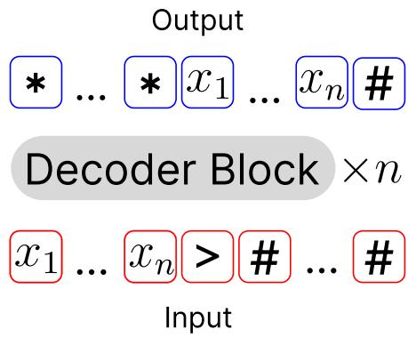
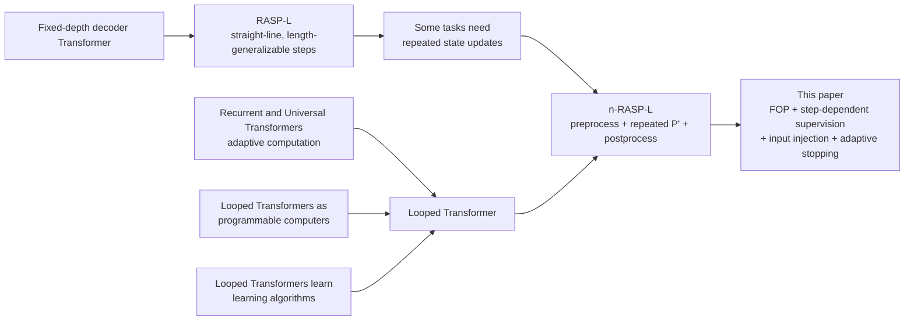
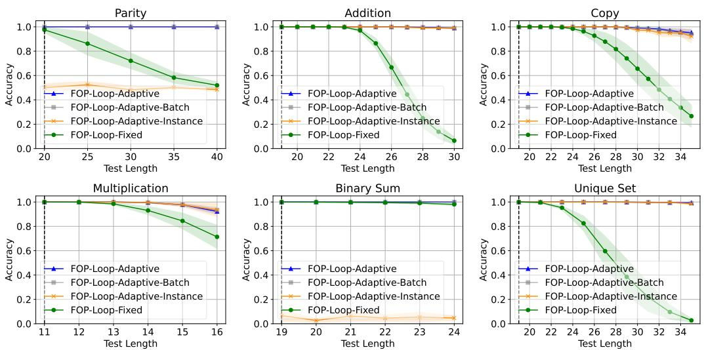
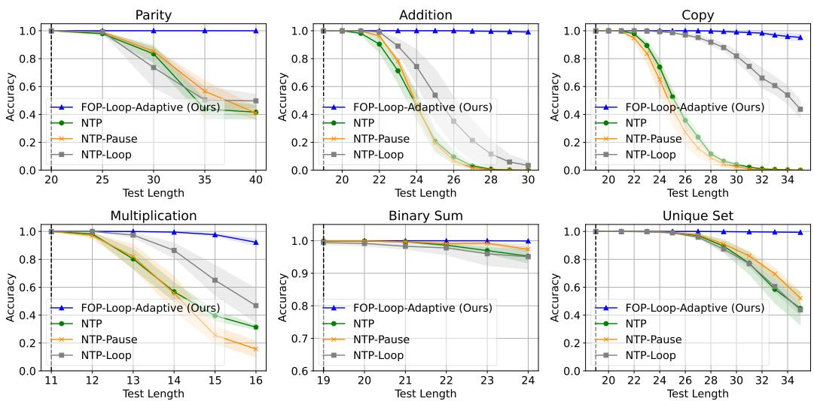

# Looped Transformers for Length Generalization

**Paper:** Looped Transformers for Length Generalization  
**Authors:** Ying Fan, Yilun Du, Kannan Ramchandran, and Kangwook Lee  
**arXiv:** [2409.15647v5](https://arxiv.org/abs/2409.15647v5); submitted 2024-09-24, revised 2025-05-12

**Related pages:** [The Transformer](../foundations/transformer.md) · [Transformers Are RNNs: Linear Attention](../linear-attention/index.md) · [Recurrent Neural Networks: From RNN to LSTM](../foundations/recurrent-neural-networks/index.md)

## TL;DR

**What:** The paper makes Transformer depth reusable and input-dependent for a class of iterative algorithmic problems that ordinary fixed-depth next-token prediction does not length-generalize on.

**How:** It reuses one decoder block, injects the original input at every loop, and trains only the final answer at a known step count across examples with different lengths and step counts.

**The number:** Trained on lengths up to 20, the looped model solves parity at more than 40 digits near perfectly and remains almost perfect on addition and copy at roughly 10 digits beyond the training limit.

## The Big Picture

*Source: [Figure 1 of the paper](https://arxiv.org/abs/2409.15647v5). 1. The query is padded with EOS slots so the model can predict the full answer in parallel. 2. One decoder block is reused for the required number of loop steps. 3. The answer is supervised after the final step, while the repeated block learns reusable intermediate transformations.*

The visual shows the paper's central trade: **parameters stay fixed while effective depth grows with the problem**. The model uses full-output prediction rather than forcing each answer token to be generated one at a time.

## Why This Exists

Consider binary addition trained only on numbers with 1 to 20 digits. A fixed-depth next-token model can fit the training range, but a 30-digit test case requires the learned computation to propagate information through ten more positions than it saw during training. The paper reports that this baseline fails around the extrapolation point, while a looped model can keep applying the same learned update for the longer input.

The important distinction is not simply "more layers." A deeper fixed model still has one fixed computation schedule. The [looped model](../../terms/looped-transformers.md) learns a **single algorithmic step** and runs that step as many times as the input requires, much like applying one carry-propagation update repeatedly.

## The Landscape

[Editable Mermaid source](assets/landscape.mmd)

**The paper sits at the intersection of two lines of work:** RASP-L explains which single-pass Transformer programs can generalize by length, while recurrent and Universal Transformer work supplies adaptive depth. The contribution is to define a useful class that needs both: a length-independent Transformer step repeated a length-dependent number of times.

## The Core Idea

**Teach one Transformer block to behave like one iteration of an algorithm, then let inference choose how many iterations to run.** The training set supplies only the input, final answer, and required step count; variation in lengths and step counts indirectly teaches the same block to produce useful intermediate states. Because the block is reused, a longer problem receives more sequential computation without adding new parameters or requiring labeled scratchpad traces.

## Symbol Map

The paper uses $n$ for input length and $T(n)$ for the number of algorithmic iterations needed at that length. A prime denotes the reusable loop body, while `pre` and `post` denote setup and cleanup around it.

| Symbol | Human name | Shape / scope | Plain meaning |
|---|---|---|---|
| $P$ | full program | whole sequence | The complete algorithm being represented. |
| $P_{pre}$ | preprocessing | once per input | Aligns or initializes the sequence before looping. |
| $P'$ | loop body | one iteration | A fixed-size RASP-L operation implemented by one decoder block. |
| $P_{post}$ | postprocessing | once per input | Converts the final working state into the returned answer. |
| $T(n)$ | step schedule | scalar per input length | How many times the loop body must run. |
| $M_\theta$ | shared decoder block | fixed parameter set | The learned Transformer applied at every loop step. |
| $f_t(M_\theta, x)$ | $t$-step execution | sequence after $t$ loops | The model output after applying the shared block $t$ times. |
| FOP | full-output prediction | all answer positions | Predicts the answer in parallel after internal looping. |
| NTP | next-token prediction | one next position | Autoregressively predicts one token at a time. |
| NoPE | no positional embedding | model setting | Removes positional encoding so the experiment isolates the looped computation. |

The paper's defining decomposition is:

$$
P = P_{pre} \circ (P')^{T(n)} \circ P_{post}.
$$

## Deep Dive

### 1. n-RASP-L turns length into a computation schedule

**What it does:** n-RASP-L extends RASP-L with an external loop whose iteration count can depend on input length.

**Why it matters:** A single straight-line RASP-L program can express one bounded-depth transformation, but parity, repeated-token copy, and binary addition need state to move through the sequence repeatedly.

**How it works:**

| Task | Reusable loop body | Step count in the paper |
|---|---|---:|
| Copy | Shift the working sequence by one position | $T(n)=n$ |
| Parity | Shift, then combine the running answer with XOR | $T(n)=n$ |
| Addition | Shift the XOR partial sum while carrying the AND state | $T(n)=n+1$ |

The formal class is $P = P_{pre} \circ (P')^{T(n)} \circ P_{post}$, where each component belongs to RASP-L and only the repetition count grows with $n$.

**The intuition:** The model does not need a new rule for position 27; it needs to apply the same local rule 27 times.

**A concrete example:** For the 30-digit addition case, preprocessing aligns the two operands and initializes the carry state. The same addition step then moves the partial sum and carry one position per loop until the final carry is resolved.

**Remember:** n-RASP-L separates **what one step does** from **how many steps the input needs**.

### 2. A shared decoder block provides adaptive depth

**What it does:** The architecture applies the same decoder-only block repeatedly and adds the original input embedding to the previous step's output before the next step.

**Why it matters:** Reusing weights makes effective depth adjustable, while input injection keeps the original query available after many transformations instead of forcing the recurrent state to preserve every detail alone.

**How it works:** The paper uses full-output prediction (FOP): the query is supplied once, answer positions are padded with EOS tokens, and the model predicts all answer positions after the internal loop. This differs from next-token prediction (NTP), which appends one generated token at a time. The experiments also use NoPE so positional encoding does not become a second source of length behavior.

| Property | Vanilla NTP | Looped FOP in this paper |
|---|---|---|
| Effective depth | Fixed for the model | Chosen by the number of loop steps |
| Answer formation | One token per generation step | All answer positions after looping |
| Parameters across steps | Usually distinct layers | One decoder block is reused |
| Original input | Must survive through the sequence state | Injected at every loop |
| Extrapolation control | Fixed computation schedule | Increase the loop count with input length |

**The intuition:** The block is a reusable instruction, and the loop count is the model's runtime budget.

**A concrete example:** For binary addition, the same decoder block can update the partial sum and carry for digit 1, then digit 2, and so on; a 30-digit input simply receives more applications of that block than a 20-digit training example.

**Remember:** Adaptive depth comes from weight tying plus a variable number of block applications, not from making one giant fixed network.

### 3. Step-dependent supervision teaches hidden intermediate states

**What it does:** It trains the final answer after a supplied number of loop steps without requiring the intermediate answers as labels.

**Why it matters:** Scratchpad or chain-of-thought supervision can be expensive or unavailable. The method uses the known algorithmic step count as a weaker but sufficient structural signal for these tasks.

**How it works:** Each training example contains $(x,y,T_i,L_i)$: input, final answer, required loop count, and sequence length. The training objective is cross-entropy after exactly $T_i$ applications:

$$
\min_\theta \; \mathbb{E}_{(x,y,T)\sim D}\left[\operatorname{CE}\left(f_T(M_\theta,x), y\right)\right].
$$

There is no target for the state after steps $1,2,\ldots,T-1$. However, other examples are supervised at those counts, so the shared block is repeatedly constrained across different depths and lengths. The intended consequence is that each intermediate state becomes useful as input to the next application rather than being a disposable hidden activation.

**The intuition:** Different examples supervise different stopping points, so the same block learns a ladder of reusable states without seeing the ladder's labels explicitly.

**A concrete example:** A length-5 copy example may be supervised after five shifts, while a length-3 example supervises the same block after three. The model never receives a labeled "after shift 2" target for the first example, but the shared weights encounter that depth elsewhere.

**Remember:** The extra supervision signal is the **step count**, not a human-written reasoning trace.

### 4. Adaptive stopping turns confidence into a halting rule

**What it does:** It chooses when to stop either from an oracle step count or from the lowest cross-entropy among decoded outputs at candidate steps.

**Why it matters:** A looped model needs a runtime rule, not only a training architecture. Knowing the exact $T(n)$ is clean for controlled experiments, but a deployed system may need to infer when another iteration is no longer helping.

*Source: [Figure 6 of the paper](https://arxiv.org/abs/2409.15647v5). The adaptive looped variants stay close to the oracle across the studied tasks, while a fixed-depth loop and per-instance confidence can degrade on non-converging tasks.*

**How it works:** The paper compares two rules:

1. **Oracle:** use the known $T(n)$.
2. **Maximum confidence:** run up to $T_{max}$ and choose the step with the lowest cross-entropy against the model's decoded output. The choice can be made over a batch of same-length examples ($B=N_{test}$) or per sample ($B=1$).

For addition, copy, multiplication, and unique set, the outputs often converge after the answer is found, so per-sample selection works nearly as well as batch selection. Parity and binary sum are less forgiving because their output trajectories do not converge as cleanly.

**The intuition:** Stop at the point where another pass stops making the model more certain, but remember that confidence is a task-dependent signal rather than a universal halting guarantee.

**A concrete example:** If a length-35 copy output becomes stable at step 35 and remains stable through step 40, the confidence curve has a broad usable basin. If a parity output oscillates after the correct step, selecting the minimum loss independently for each sample is less reliable.

**Remember:** The oracle isolates the architecture's capability; confidence-based stopping tests whether the model can discover its own useful depth.

## Putting It Together

Follow one binary addition input, `010 + 011 >`, through the paper's looped formulation. The sequence is padded with EOS slots for FOP, and the exact intermediate bit pattern is less important than the state ownership: aligned operands, a partial answer, and a carry sequence.

| Step | Actor | Input state | Action | Output state |
|---:|---|---|---|---|
| 1 | $P_{pre}$ | Two length-3 operands and an empty answer region | Split and align the operands; initialize the partial-answer and carry sequences | Aligned working sequences ready for one-step updates |
| 2 | Shared $M_\theta$ | Partial answer and carry at the first position | Approximate the addition loop: XOR the current operands, shift the partial result, and compute AND as carry | First position updated; carry moves toward the next position |
| 3 | Shared $M_\theta$ | Updated partial answer plus the remaining carry | Apply the identical block again | Second position incorporates the incoming carry |
| 4 | Shared $M_\theta$ | State after two updates | Apply the identical block again | Third position and any final carry are resolved |
| 5 | $P_{post}$ / FOP decoder | Final working state and EOS mask | Select answer slots and emit the full result in parallel | Completed answer sequence |

For an $n$-digit addition, the paper uses $T(n)=n+1$, so the same trace extends by adding more applications of the same block. That is the runtime contract: **the input length changes the number of state transitions, not the parameter set**.

## What This Buys You

*Source: [Figure 4 of the paper](https://arxiv.org/abs/2409.15647v5). Across parity, addition, copy, multiplication, binary sum, and unique set, the adaptive looped model remains substantially more accurate beyond the dashed maximum training length than the fixed-depth NTP variants.*

### The headline claim

**For tasks with a single iterative n-RASP-L solution, adaptive loop depth is a stronger length-generalization mechanism than simply allocating comparable fixed compute.**

### How we know: length extrapolation

| Evidence slice | Training regime | Reported observation |
|---|---|---|
| Parity | Lengths 1-20; test beyond 40 digits | The looped model generalizes near perfectly to more than 40 digits. |
| Addition | Lengths 1-20; test at length 30 | The looped model stays almost perfect while NTP fails around the extrapolation range. |
| Copy | Lengths 1-20; test about 10 digits longer | The looped model remains almost perfect while NTP collapses. |
| Broader task set | Parity, copy, addition, multiplication, binary sum, and unique set | The adaptive looped model outperforms vanilla NTP, pause-token NTP, and fixed-step weight-tied NTP across the studied plots. |

### The mechanism behind the numbers

The baseline models have a fixed maximum computation pattern even when their training FLOPs are made comparable. The looped model instead learns a transition that can be composed more times at test time. Input injection protects access to the original sequence, and step-dependent supervision exposes the shared block to a range of effective depths. Together, those choices make extrapolation look like continuing an algorithm rather than asking a fixed circuit to stretch beyond its trained width or depth.

### How to read these numbers

> **Warning:** These are controlled algorithmic experiments, not evidence that arbitrary language-model reasoning will length-generalize. The tasks are selected because their solutions have a known single-loop structure, training uses a known step count, the model is a 256-dimensional GPT-2-style decoder with NoPE, and the reported accuracy is exact match over 6,400 random test samples with five seeds.

The result is therefore strongest as an architectural lesson: **sequential compute that scales with problem size can matter more than adding a fixed amount of parallel or fixed-depth compute** when the target algorithm itself is iterative.

## Where It Breaks

| Failure mode | When it happens | Impact |
|---|---|---|
| Step-count supervision is unavailable | Training data has $(x,y)$ but not the required $T(n)$ | The proposed training objective cannot directly select the supervision depth; ordinary end-to-end training would need a replacement signal. |
| The task needs multiple different loops | The solution requires one iterative process followed by another, outside the paper's single repeated $P'$ definition | The current n-RASP-L class does not cover the task. |
| Training needs many loop steps | Longer target lengths require large unrolled computations and backpropagation through them | Direct looped training becomes expensive; the paper suggests gradient truncation as future work rather than validating it. |
| Confidence is not monotonic | Parity and binary sum can have non-converging output trajectories | Per-sample maximum-confidence stopping performs worse than batch selection or the oracle. |
| Positional encoding changes the regime | A future implementation adds a positional scheme instead of NoPE | The paper does not establish whether the same length-generalization behavior survives or improves. |
| The task is outside the tested algorithmic class | The problem has no known one-step decomposition or needs richer memory | The paper's results do not justify extrapolating to general natural-language reasoning. |

## One Thing to Remember

**Make depth a runtime variable, not a fixed architectural constant.** Looped Transformers learn one reusable sequence transformation and apply it as many times as the problem length demands; the paper's step-dependent supervision makes those hidden intermediate states useful without requiring labeled scratchpad traces. The approach works because the target tasks already have an iterative algorithmic shape, and its limits are exactly where that shape, the step count, or a reliable stopping signal is missing.

## Go Deeper

- **Read:** [Looped Transformers for Length Generalization](https://arxiv.org/abs/2409.15647v5)
- **Build on:** [Looped Transformer code](https://github.com/UW-Madison-Lee-Lab/looped-tf) and the paper's references to Universal Transformers, RASP-L, and scratchpad supervision.
- **Understand the context:** [The Transformer](../foundations/transformer.md), [Transformers Are RNNs: Linear Attention](../linear-attention/index.md), and [Recurrent Neural Networks: From RNN to LSTM](../foundations/recurrent-neural-networks/index.md)
- **Follow up:** [Universal YOCO for Efficient Depth Scaling](../../training/efficient-attention/yoco/universal-yoco.md) applies shared-depth recursion inside an efficient-attention self-decoder so depth scales with a one-piece KV cache.
- **Reproduce:** [UW-Madison-Lee-Lab/looped-tf](https://github.com/UW-Madison-Lee-Lab/looped-tf)
