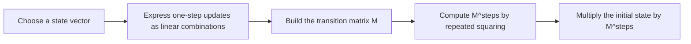

# Matrix Exponentiation for Linear Transitions

Matrix exponentiation turns many repeated linear updates into logarithmic-time computations. The method is useful when a state vector advances through the same linear transition at every step, including linear recurrences, prefix sums of recurrences, coupled sequences, and dynamic programs with fixed transition rules.

**Related page:** [Algorithms](index.md)

## Matrix multiplication

If `A` has dimensions `n x k` and `B` has dimensions `k x m`, their product `C = A * B` has dimensions `n x m`:

```text
C[i][j] = sum(A[i][t] * B[t][j], t = 0..k-1)
```

The standard algorithm costs `O(nmk)`. Multiplying two square `n x n` matrices therefore costs `O(n^3)`.

The properties needed for exponentiation are:

- multiplication is associative, so products may be regrouped;
- multiplication is generally not commutative, so operand order must be preserved;
- the identity matrix `I` satisfies `IA = AI = A`.

## Binary matrix exponentiation

For a square matrix `A`, define `A^0 = I` and `A^x` as `x` copies of `A` multiplied together. Performing `x` multiplications costs `O(n^3 x)`. Binary exponentiation instead decomposes `x` into powers of two and repeatedly squares the current matrix:

```text
function matrix_power(A, x):
    result = identity_matrix(size(A))
    while x > 0:
        if x is odd:
            result = result * A
        A = A * A
        x = floor(x / 2)
    return result
```

The loop runs once per bit of `x`, so the total cost is `O(n^3 log x)` with standard multiplication. For example, `75 = 1 + 2 + 8 + 64`, so `A^75` combines only the corresponding precomputed powers of two.

The invariant is that `result * A^x` remains equal to the original requested power. This also explains why a power-of-two exponent works: repeated halving eventually makes `x = 1`, at which point the current squared matrix is multiplied into `result`.

## Converting a recurrence into a matrix

The main modeling step is to choose a state vector containing enough values to compute the next state. Then build a matrix `M` such that:

```text
next_state = current_state * M
```

The source uses row vectors. Under this convention, column `j` of `M` contains the coefficients used to compute element `j` of the next state. Code using column vectors must transpose the matrix and reverse the multiplication order.

### Fibonacci example

For the source's definition `F_0 = F_1 = 1` and `F_i = F_(i-1) + F_(i-2)`:

```text
[F_(i-2), F_(i-1)] * [[0, 1],
                       [1, 1]]
= [F_(i-1), F_i]
```

Therefore:

```text
[F_0, F_1] * M^(N-1) = [F_(N-1), F_N]
```

This computes `F_N` modulo a chosen modulus in `O(log N)` time because the matrix size is fixed at `2 x 2`.

### General order-k linear recurrence

For:

```text
A_i = c_1 A_(i-1) + c_2 A_(i-2) + ... + c_k A_(i-k)
```

use a state containing `k` consecutive terms. The `k x k` transition matrix shifts the last `k - 1` values forward and computes the newest value as a linear combination of the previous values. In the source's row-vector, oldest-to-newest convention:

- the subdiagonal entries are `1`, implementing the shift;
- the last column is `[c_k, c_(k-1), ..., c_1]`.

Starting from `[A_0, A_1, ..., A_(k-1)]`, raising this matrix to `N - k + 1` produces a state whose last element is `A_N`. The cost is `O(k^3 log N)`.

## Extending the state

Matrix exponentiation is not limited to one recurrence. Any additional quantity that evolves linearly can be included as another state component.

### Prefix sums

To compute `P_i = A_0 + A_1 + ... + A_i`, include both `P_i` and the recurrence values needed for the next step. For Fibonacci, a state such as `[P_(i-1), F_(i-2), F_(i-1)]` can advance to `[P_i, F_(i-1), F_i]` with one fixed `3 x 3` matrix. The same construction works for prefix sums of any linear recurrence.

### Coupled recurrences

If one sequence depends linearly on another, combine them in one vector. Each matrix column expresses the next value of one sequence in terms of all current values. Powers of two can themselves be treated as a recurrence, such as `P_i = 2P_(i-1)`, and included in the same state.

## Accelerating dynamic programming

A dynamic program can use matrix exponentiation when both conditions hold:

1. The transition from step `i` to `i + 1` is the same for every `i`.
2. Every next-state value is a linear combination of current-state values.

For example, let `dp[length][letter]` count valid strings ending in each lowercase letter, and let `allowed[a][b]` indicate whether `b` may follow `a`. Then:

```text
dp[length + 1] = dp[length] * allowed
```

Instead of applying the transition `L - 1` times in `O(L * 26^2)`, compute `allowed^(L-1)` and apply it once. Standard matrix multiplication gives `O(26^3 log L)` time.



## Implementation guidance

A reusable implementation needs:

- dimension-checked matrix multiplication;
- construction of an identity matrix;
- binary exponentiation for square matrices;
- modular arithmetic when values can grow large.

For a modulus near `10^9`, multiply entries in a 64-bit type before reducing modulo the modulus; multiplying two 32-bit values directly can overflow first. The source's C++ example forces this promotion with multiplication by `1LL`.

For many queries using the same transition matrix, precompute:

```text
M, M^2, M^4, M^8, ...
```

Each query then multiplies only the powers corresponding to set bits in its exponent. This removes repeated squaring from individual queries, although each query still needs up to `O(log x)` matrix products.

## Limits and common mistakes

- Matrix exponentiation applies to fixed linear transitions, not arbitrary nonlinear updates such as products of two state variables.
- The matrix must be square to be raised to a power.
- Row-vector and column-vector conventions produce transposed transition matrices; mixing them gives incorrect results.
- Off-by-one errors are common when choosing the initial state and exponent. Verify what state is represented at exponent `0` and after one multiplication.
- Fast exponentiation improves dependence on the number of steps, but standard multiplication still costs cubic time in the number of states. An unnecessarily large state can dominate runtime.
- For real-world numerical linear algebra, optimized libraries are preferable; the article's hand-written implementation targets learning and competitive programming.

## Key takeaways

- Repeated squaring computes `A^x` in `O(n^3 log x)` instead of `O(n^3 x)`.
- Model enough history in the state vector to make the next update a fixed linear transformation.
- Transition-matrix columns encode how current row-vector components contribute to each next component.
- Linear recurrences, prefix sums, coupled sequences, and time-invariant linear DP transitions all fit the same pattern.
- Precomputing powers of a shared transition matrix is useful when answering many exponentiation queries.
