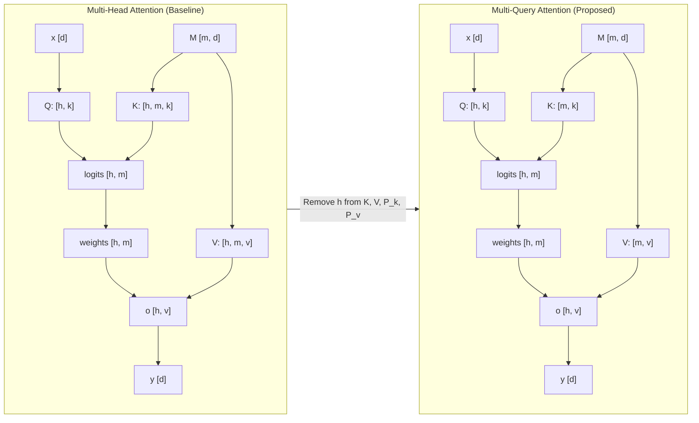
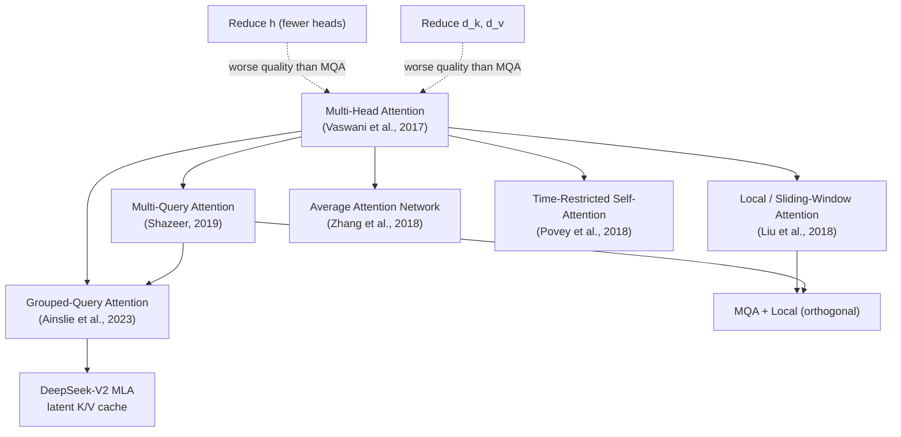

# Multi-Query Attention: One Write-Head is All You Need

**Paper:** Fast Transformer Decoding: One Write-Head is All You Need
**Authors:** Noam Shazeer (Google)
**arXiv:** 1911.02150 - November 7, 2019

**Related pages:** [The Transformer](transformer.md) · [Collaborative Multi-Head Attention](collaborative-attention.md) · [Grouped-Query Attention in Llama 2](grouped-query-attention/index.md) · [DeepSeek-V2 Multi-Head Latent Attention](deepseek-v2-mla.md) · [Algorithms Index](index.md)

## TL;DR

**What:** Multi-Query Attention (MQA) is a simple architectural modification to multi-head attention where all attention heads share a single set of keys and values, while keeping independent per-head queries.

**How:** By removing the "heads" dimension from the K and V tensors — shrinking their total memory footprint by a factor of $h$ — the memory-bandwidth bottleneck of incremental inference is dramatically reduced without changing the mathematical structure of the queries or the output projections.

**The number:** Incremental decoder inference is **12× faster** (3.8 µs vs 46 µs per token on TPUv2) with only a **0.1 BLEU drop** on WMT14 EN-DE and **+0.3 perplexity** on the Billion-Word LM benchmark.

## The Big Picture



*① Multi-Head Attention: each of $h$ heads has its own projected keys and values, producing K of shape $[h, m, k]$ and V of shape $[h, m, v]$. During incremental decoding, the full K and V must be reloaded from memory at every step — the dominant cost. ② Multi-Query Attention: a single shared K of shape $[m, k]$ and V of shape $[m, v]$ serves all $h$ query heads — the heads dimension is eliminated from the memory. ③ Queries remain per-head ($[h, k]$), preserving multi-head representational diversity; the output projection $P_o$ also remains per-head, giving each head its own subspace for the weighted value sum.*

## Why This Exists

Consider incremental autoregressive decoding of a Transformer with $h = 8$ heads, $d = 1024$, and sequence length $n = 128$.

At each decoding step, the model must:

1. Compute the query $q$ for the current position — a tiny vector.
2. Load the **entire** keys $K$ and values $V$ tensors from the previous positions — size $b \cdot h \cdot m \cdot k = b \cdot h \cdot n^2 / h = b n^2$ per step.
3. Compute attention scores, weighted sum, and output projection.

The problem: step 2 dominates. For $b = 1$, the ratio of memory access to arithmetic operations is $\Theta(\frac{n}{d} + \frac{1}{b}) \approx \Theta(1)$. This means **every FLOP is accompanied by a memory read**, making the operation memory-bandwidth-bound. On modern GPUs/TPUs where compute capacity exceeds memory bandwidth by ~100×, the hardware sits idle most of the time.

Concretely, the baseline Transformer decoder takes **46 µs per token** on TPUv2, while the encoder — which can be parallelized — takes only **1.7 µs per token**. The decoder is 27× slower, purely because of the K/V reload cost.

Prior solutions attacked this by limiting sequence length (local attention) or compressing memory positions. MQA attacks the root cause directly: **shrink the tensors being reloaded.**

## The Landscape



**Parent:** Multi-Head Attention (Vaswani et al., 2017) — the standard Transformer attention mechanism with $h$ independent key, query, value, and output projections per head.

**Siblings (inference-speed optimizations):**

- **Local/Sliding-Window Attention** — restrict each query to attend only to nearby positions, reducing $n$; orthogonal to MQA (they compose).
- **Average Attention Network** — compress all past key-value pairs into a single running average vector.
- **Time-Restricted Self-Attention** — limit the temporal span of attention for ASR tasks.

**Dead ends (simpler alternatives that don't work as well):**

- **Reduce $h$** (fewer heads): dropping from $h=8$ to $h=1$ also shrinks K and V by 8×, but perplexity degrades from 29.9 to 31.2 on Billion-Word LM — much worse than MQA's 30.2.
- **Reduce $d_k, d_v$** (smaller per-head dimension): shrinking from 128 to 16 (while keeping $h=8$) also degrades to 30.9 perplexity — worse than MQA.

**Descendant:** Grouped-Query Attention (GQA, Ainslie et al., 2023) — generalizes MQA by using $g$ key-value groups where $1 < g < h$, interpolating between MQA ($g=1$) and MHA ($g=h$). GQA is used in Llama 2, Llama 3, and other modern LLMs. [DeepSeek-V2 Multi-Head Latent Attention](deepseek-v2-mla.md) continues the same KV-cache reduction line, but stores a low-rank latent K/V memory instead of choosing a smaller number of raw K/V heads.

## The Core Idea

Multi-head attention is bottlenecked during inference not by the number of attention computations, but by the size of the key and value tensors that must be reloaded from memory at every step. Since each head already sees the same input sequence, there is inherent redundancy in having $h$ independent key and value projections. MQA eliminates this redundancy by sharing one K and one V across all heads, while keeping queries head-specific — preserving the multi-head model's ability to attend to different aspects of the sequence. The result: K and V shrink by a factor of $h$, memory bandwidth pressure drops proportionally, and inference speed improves by an order of magnitude with minimal quality loss.

## Deep Dive

### The Memory-Bandwidth Bottleneck

**What it does:** Quantifies why incremental Transformer decoding is slow despite being computationally simple.

**Why it matters:** This analysis is the entire motivation for MQA — without understanding that K/V reload dominates, the architectural change seems arbitrary.

**How it works:**

| Operation | Arithmetic Ops | Memory Access | Ratio (Mem/Compute) |
|-----------|---------------|---------------|---------------------|
| Batched MHA (training) | $\Theta(b n d^2)$ | $O(b n d + b h n^2 + d^2)$ | $O(\frac{1}{k} + \frac{1}{b n})$ |
| Incremental MHA (inference) | $\Theta(b n d^2)$ | $\Theta(b n^2 d + n d^2)$ | $\Theta(\frac{n}{d} + \frac{1}{b})$ |
| Incremental MQA (inference) | $\Theta(b n d^2)$ | $\Theta(b n d + b n^2 k + n d^2)$ | $\Theta(\frac{1}{d} + \frac{n}{d h} + \frac{1}{b})$ |

The key insight: in incremental MHA, the ratio $\frac{n}{d}$ is close to 1 when $n \approx d$ (typical for moderate-length sequences). MQA reduces this term by a factor of $h$, pushing the ratio down to $\frac{n}{d h}$.

**The intuition:** The K and V tensors are like a $h$-channel video that you must re-watch in full before every single frame — MQA collapses it to a single grayscale channel. The queries still have $h$ different "lenses" to interpret that single channel.

**A concrete example:** For the WMT14 EN-DE baseline ($h=8, d=1024, n=128, b=1024$): in incremental MHA, loading K and V costs $b h n k = 1024 \times 8 \times 128 \times 128 \approx 134$M elements per step. In MQA, it drops to $b n k = 1024 \times 128 \times 128 \approx 16.8$M — an **8× reduction**. The amortized per-token decoder cost drops from 46 µs to 3.8 µs.

**Remember:** The speedup comes purely from reducing memory traffic — the total number of arithmetic operations is identical between MHA and MQA.

### The Architectural Change

**What it does:** Modifies the projection tensors $P_k$ and $P_v$ from per-head ($[h, d, k]$ and $[h, d, v]$) to shared ($[d, k]$ and $[d, v]$), while keeping $P_q$ ($[h, d, k]$) and $P_o$ ($[h, d, v]$) per-head.

**Why it matters:** This is the minimal code change — remove the "h" letter from the einsum equations for K, V, $P_k$, and $P_v$.

**How it works:**

```python
# Multi-Head Attention: K and V have a heads dimension
K = tf.einsum("bmd, hdk->bhmk", M, P_k)  # [b, h, m, k]
V = tf.einsum("bmd, hdv->bhmv", M, P_v)  # [b, h, m, v]
logits = tf.einsum("bhnk, bhmk->bhnm", Q, K)
O = tf.einsum("bhnm, bhmv->bhnv", weights, V)

# Multi-Query Attention: K and V are headless — broadcast across h
K = tf.einsum("bmd, dk->bmk", M, P_k)    # [b, m, k]
V = tf.einsum("bmd, dv->bmv", M, P_v)    # [b, m, v]
logits = tf.einsum("bhnk, bmk->bhnm", Q, K)  # K broadcasts across h
O = tf.einsum("bhnm, bmv->bhnv", weights, V) # V broadcasts across h
```

The `einsum` broadcasting handles the interaction between per-head queries and shared keys/values: `"bhnk, bmk->bhnm"` implicitly replicates K across the $h$ dimension.

**The intuition:** Each head still asks a different question (different $P_q$) and writes a different answer (different $P_o$), but they all read from the same shared memory (same K, V). Think of $h$ detectives interrogating the same evidence — each asks different questions and draws different conclusions, but the evidence itself is the same.

**A concrete example:** Returning to the WMT14 EN-DE scenario: during incremental decoding, the `tf.concat` step that appends the new key to `prev_K` now operates on shape $[b, m, k]$ instead of $[b, h, m, k]$, a factor-of-$h$ smaller concatenation and subsequent read.

**Remember:** MQA is parameter-matched — the FFN hidden layer is widened from 4096 to 5440 (or 8192 to 9088 for LM) to compensate for the reduced K/V projection parameters, keeping total parameter count equal (211M for MT, 192M for LM).

### Empirical Results

**What it does:** Validates that MQA's speed gains are real and that quality degradation is negligible across two tasks (WMT14 EN-DE translation and Billion-Word LM).

**Why it matters:** The paper must convince that MQA is not just theoretically faster but practically better than alternative ways to reduce K/V size (fewer heads, smaller $d_k/d_v$).

**How it works:**

Key results from WMT14 EN-DE translation:

| Attention Type | $h$ | $d_k, d_v$ | Dev PPL | Dev BLEU | Test BLEU (beam 1 / 4) |
|:---|---:|---:|---:|---:|---:|
| **multi-head (baseline)** | 8 | 128 | 1.424 | 26.7 | 27.7 / 28.4 |
| **multi-query** | 8 | 128 | 1.439 | 26.5 | 27.5 / 28.5 |
| multi-head (fewer heads) | 1 | 128 | 1.518 | 25.8 | 26.8 / 27.9 |
| multi-head (smaller $d_k$) | 8 | 16 | 1.513 | 25.8 | 26.8 / 27.9 |
| MQA + local | 8 | 128 | 1.437 | 26.5 | 27.6 / 28.2 |

Key inference speed results (TPUv2 µs/token, WMT14 EN-DE, seq len 128):

| Attention Type | Training | Encoder | Decoder | Beam-4 Decoder |
|:---|---:|---:|---:|---:|
| multi-head | 13.2 | 1.7 | **46** | **203** |
| multi-query | 13.0 | 1.5 | **3.8** | **32** |
| MHA + local | 13.2 | 1.7 | 23 | 47 |
| MQA + local | 13.0 | 1.5 | **3.3** | **16** |

Billion-Word LM results:

| Attention Type | $h$ | $d_k, d_v$ | $d_{ff}$ | Dev PPL |
|:---|---:|---:|---:|---:|
| **multi-head** | 8 | 128 | 8192 | **29.9** |
| **multi-query** | 8 | 128 | 9088 | **30.2** |
| multi-head (h=1) | 1 | 128 | 9984 | 31.2 |
| multi-head ($d_k$=16) | 8 | 16 | 9984 | 30.9 |

**The intuition:** MQA's quality sits in a sweet spot — slightly worse than full MHA, but dramatically better than any alternative that achieves similar memory savings by shrinking heads or dimensions. The speed gains are real and compounding: MQA + local attention yields the best of both worlds (3.3 µs decoder, 16 µs beam-4).

**A concrete example:** In beam-4 search (where the decoder cost dominates even more heavily due to 4× the candidate sequences), MQA reduces decoder cost from 203 µs to 32 µs — a **6.3× speedup**. Combined with local attention, it drops further to 16 µs — a **12.7× speedup** over baseline beam search.

**Remember:** MQA and local attention are orthogonal and stack multiplicatively — MQA shrinks the per-token KV size, while local attention shrinks the number of tokens attended to.

### Why Reducing Heads is Worse than Sharing K/V

**What it does:** Demonstrates that naively reducing $h$ (the number of heads) degrades quality far more than MQA, even though both reduce K/V memory by the same factor.

**Why it matters:** This proves that multi-head *queries* are valuable even when keys and values are shared — the representational benefit of multi-head attention comes primarily from diverse queries and output projections, not from diverse key/value spaces.

**How it works:** Reducing $h=8 \to 1$ removes 8 independent query, key, value, and output projections. MQA removes only the independent key and value projections — keeping 8 independent query and output projections. The quality gap ($\Delta$PPL = 1.0 vs 0.3 on LM; $\Delta$BLEU = −1.7 vs −0.2 on dev) shows that ~80% of multi-head attention's benefit comes from the query diversity.

**The intuition:** Keys and values encode *what* information is available; queries encode *how* to look at it. Having multiple ways to *look* is more important than having multiple copies of *what* to look at.

**Remember:** MQA preserves the full multi-head query expressivity while eliminating key/value redundancy — it keeps the "read heads" but consolidates the "write head."

## Putting It Together

Here is the end-to-end flow for incremental decoding with MQA:

1. **Input:** Current token embedding $x$ of shape $[b, d]$.
2. **Query projection (per-head):** $q = \text{einsum}("bd, hdk \to bhk", x, P_q)$ — produces $h$ different queries.
3. **Key projection (shared):** $\Delta K = \text{einsum}("bd, dk \to bk", x, P_k)$ — single new key.
4. **Value projection (shared):** $\Delta V = \text{einsum}("bd, dv \to bv", x, P_v)$ — single new value.
5. **KV cache append:** Append $\Delta K$ and $\Delta V$ to `prev_K` and `prev_V` — both shape $[b, m, k/v]$, not $[b, h, m, k/v]$.
6. **Attention scores:** $\text{logits} = \text{einsum}("bhk, bmk \to bhm", q, \text{prev\_K})$ — K broadcasts across $h$.
7. **Softmax:** `weights = softmax(logits)`.
8. **Weighted sum:** $o = \text{einsum}("bhm, bmv \to bhv", \text{weights}, \text{prev\_V})$ — V broadcasts across $h$.
9. **Output projection (per-head):** $y = \text{einsum}("bhv, hdv \to bd", o, P_o)$ — each head writes through its own projection.

The critical difference from MHA is in steps 5-8: `prev_K` and `prev_V` are $h$ times smaller, making every subsequent read $h$ times cheaper in memory bandwidth.

## What This Buys You

- **12× faster incremental decoder inference** (46→3.8 µs/token on TPUv2 for WMT14 EN-DE with seq len 128), with beam-search speedups up to 12.7× when combined with local attention.
- **Near-identical model quality:** −0.2 BLEU on WMT14 EN-DE dev, +0.3 perplexity on Billion-Word LM — quality degradation is statistically in the noise compared to training variance.
- **Orthogonal to other speedup methods:** MQA composes with local/sliding-window attention (yielding another ~2× improvement), and with batch-size increases (the $\frac{1}{b}$ term).
- **Drop-in replacement:** The code change is literally removing one letter ("h") from a handful of einsum equations — no architectural redesign needed.
- **No training overhead:** Training speed is identical (13.2 vs 13.0 µs/token), since batched training is already compute-bound, not memory-bound.

## Where It Breaks

| Failure Mode | Cause | Mitigation |
|:---|:---|:---|
| **Long sequences degrade more** | The $\frac{n}{d h}$ term grows with $n$; for very long $n$, even MQA's reduced K/V becomes large | Combine with local/sparse attention to cap $n$ |
| **Small models may suffer more** | With fewer total parameters, the shared K/V may be insufficiently expressive | Widen FFN layers more aggressively, or use GQA as a middle ground |
| **Not a win for training** | Training is compute-bound, not memory-bandwidth-bound; MQA saves no training time | Accept the zero-cost training tradeoff; MQA is purely an inference optimization |
| **Extreme quality-sensitive tasks** | The 0.1-0.3 quality loss, while small, may matter for tasks where every fraction of a point counts | Use GQA with $g > 1$ to interpolate between MQA and MHA |

## One Thing to Remember

> MQA proves that in multi-head attention, **key/value diversity is largely redundant** — what matters is having multiple *lenses* (queries and output projections) to interpret a single shared memory. Eliminating K/V heads shrinks the inference memory-bandwidth bottleneck by a factor of $h$, yielding a 12× speedup for essentially free.

## Go Deeper

- The original Transformer paper ["Attention Is All You Need"](transformer.md) — for full background on multi-head attention.
- [Collaborative Multi-Head Attention](collaborative-attention.md) — another approach to reducing key/query redundancy via shared projections.
- [Grouped-Query Attention (GQA)](https://arxiv.org/abs/2305.13245) — generalizes MQA to $g$ KV groups, used in Llama 2/3.
- [FlashAttention](flashattention.md) — a complementary approach that optimizes attention *computation* via IO-aware tiling, while MQA optimizes attention *memory footprint* via parameter sharing.
- The [vLLM PagedAttention framework](../frameworks/vllm-framework.md) — another inference-focused KV-cache optimization that composes with MQA/GQA.
