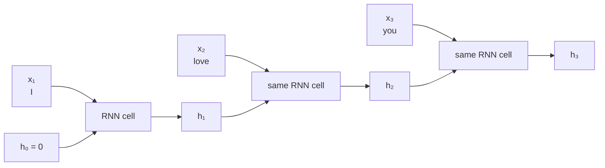

# Recurrent Neural Networks: From RNN to LSTM

**Article:** 神经网络详解（RNN/LSTM)  
**Original URL:** [Zhihu article 123211148](https://zhuanlan.zhihu.com/p/123211148)  
**Accessible source:** [attributed mirror](https://www.cnblogs.com/aabbcc/p/14321333.html)

**Related pages:** [The Transformer](../transformer.md), [Linear Attention](../linear-attention/index.md), [Linear Attention Without Softmax](../linear-attention-without-softmax.md)

**Capture note:** Zhihu returned HTTP 403 to both HTTP and browser-assisted capture. The local source is an accessible mirror that names the supplied Zhihu URL as its original source. Because authorship and completeness could not be verified directly against Zhihu, this page uses `confidence: medium`.

## The One-Sentence Idea

**An RNN processes a sequence one item at a time and carries a fixed-size hidden state forward, so the current result depends on both the current input and a compressed summary of the past.**

## Why Sequence Order Matters

The article uses the word “apple” to motivate recurrence:

- In “I like eating apple,” nearby words suggest a fruit.
- In “Apple is a great company,” nearby words suggest an organization.

A classifier that sees only the isolated word receives the same input in both cases. A sequence model instead lets earlier words influence the representation used at the current position. The same principle applies to speech frames, sensor readings, and other ordered data.

## The Big Picture

The boxes are repeated uses of the **same parameters**, not three independently trained networks. The hidden state changes at every step; the weights do not.

*Editable source: [rnn-unrolled.mmd](./assets/rnn-unrolled.mmd).*

## Vanilla RNN, Step by Step

At sequence position \(t\), a basic RNN computes:

\[
h_t=\tanh(W_xx_t+W_hh_{t-1}+b_h)
\]

\[
y_t=g(W_yh_t+b_y)
\]

| Symbol | Meaning |
|---|---|
| \(x_t\) | Current token or time-step input |
| \(h_{t-1}\) | Summary carried from the preceding step |
| \(h_t\) | Updated summary after reading \(x_t\) |
| \(y_t\) | Optional output at the current step |
| \(W_x,W_h,W_y\) | Learned weights shared at every sequence position |

The recurrence is the important part:

\[
\boxed{\text{previous state }h_{t-1}+\text{ current input }x_t
\longrightarrow \text{ new state }h_t}
\]

Unrolling the loop makes the history dependence visible:

\[
h_3=f(x_3,h_2)=f(x_3,f(x_2,f(x_1,h_0))).
\]

Changing the input order generally changes every later state and output.

## What “Memory” Really Means

The hidden state is not a list of all previous tokens. It is a **fixed-size, learned compression** of the prefix. New input repeatedly rewrites that compression.

This corrects a useful but overly literal reading of the source article: a vanilla RNN does not store every piece of information. It learns what can survive in \(h_t\), but the limited state and repeated nonlinear transformations make precise long-range memory difficult.

## Why Long Sequences Are Hard

Training uses backpropagation through time: gradients travel backward through all unfolded copies of the recurrent computation. The influence of an early state includes a product of many Jacobians:

$$
\frac{\partial h_t}{\partial h_{t-k}}
=
\prod_{j=t-k+1}^{t}
\frac{\partial h_j}{\partial h_{j-1}}.
$$

Repeated factors smaller than one make the gradient vanish; repeated factors larger than one can make it explode. Consequently, a vanilla RNN often struggles to learn dependencies separated by many steps.

## How LSTM Changes the State Update

An LSTM is still recurrent, but it separates:

- \(c_t\): the cell state, a long-lived memory path;
- \(h_t\): the exposed hidden/output state.

It learns three sigmoid gates and one candidate update:

\[
\begin{aligned}
f_t &= \sigma(W_f[x_t,h_{t-1}]+b_f) && \text{forget gate}\\
i_t &= \sigma(W_i[x_t,h_{t-1}]+b_i) && \text{input gate}\\
o_t &= \sigma(W_o[x_t,h_{t-1}]+b_o) && \text{output gate}\\
\widetilde c_t &= \tanh(W_c[x_t,h_{t-1}]+b_c) && \text{candidate memory}
\end{aligned}
\]

The state update is:

\[
c_t=f_t\odot c_{t-1}+i_t\odot\widetilde c_t,
\qquad
h_t=o_t\odot\tanh(c_t).
\]

The gates are vectors between zero and one:

- \(f_t\) controls how much old cell state survives.
- \(i_t\) controls how much candidate information is written.
- \(o_t\) controls how much cell content is exposed as \(h_t\).

The additive path through \(c_t\) gives gradients a more direct route across time. LSTM mitigates long-term dependency problems; it does not guarantee unlimited memory.

## The Bridge to Linear Attention

Causal linear attention has the same recurrent **execution pattern**, although its state and update rule differ:

| Model | Recurrent state | Update |
|---|---|---|
| Vanilla RNN | Vector \(h_t\) | Nonlinear rewrite of \(h_{t-1}\) using \(x_t\) |
| LSTM | Vectors \((c_t,h_t)\) | Gated forget-and-write update |
| Linear attention | Matrix/vector pair \((S_t,z_t)\) | Add current key–value statistics |

For linear attention:

\[
S_t=S_{t-1}+\phi(k_t)v_t^\top,
\qquad
z_t=z_{t-1}+\phi(k_t),
\]

\[
o_t=\frac{\phi(q_t)^\top S_t}{\phi(q_t)^\top z_t}.
\]

This matches the general RNN template:

\[
\operatorname{state}(t)=F(\operatorname{state}(t-1),x_t),
\qquad
\operatorname{output}(t)=G(\operatorname{state}(t),x_t).
\]

That is why linear attention is said to have an **RNN mode** during autoregressive decoding. It carries fixed-size state forward rather than retaining and rereading an ever-growing KV cache. It is not a vanilla RNN: it retains Transformer-style query, key, and value projections, uses a matrix-valued associative state, and can exploit parallel prefix computations during training.

## Common Confusions

- **“Recurrent” does not mean the network runs forever.** It means the same state-transition rule is reused along an ordered sequence.
- **The hidden state is not the output history.** It is a learned summary used to produce outputs.
- **LSTM does not simply add three Boolean switches.** Its gates are differentiable vectors, so different state dimensions can be retained or changed by different amounts.
- **RNN mode is not a separate linear-attention model.** It is the sequential evaluation form used for causal decoding; training can use an algebraically equivalent parallel form.
- **Fixed-size memory is not free unlimited context.** Both recurrent neural networks and recurrent linear attention must compress history and can lose exact details.

## A Practical Reading Order

1. Understand \(h_t=f(x_t,h_{t-1})\) on this page.
2. Understand why the same weights are reused across all sequence positions.
3. Learn the distinction between the LSTM cell state \(c_t\) and hidden state \(h_t\).
4. Read [Transformers Are RNNs: Linear Attention](../linear-attention/index.md) and replace the abstract RNN state with \((S_t,z_t)\).
5. Compare their failure mode: both use fixed-size history summaries, while full softmax attention retains explicit token-level access.

## One Thing to Remember

**RNN is a computation pattern: update a carried state from the previous state and current input. Linear attention qualifies because causal decoding updates and queries a carried key–value summary at every token.**
