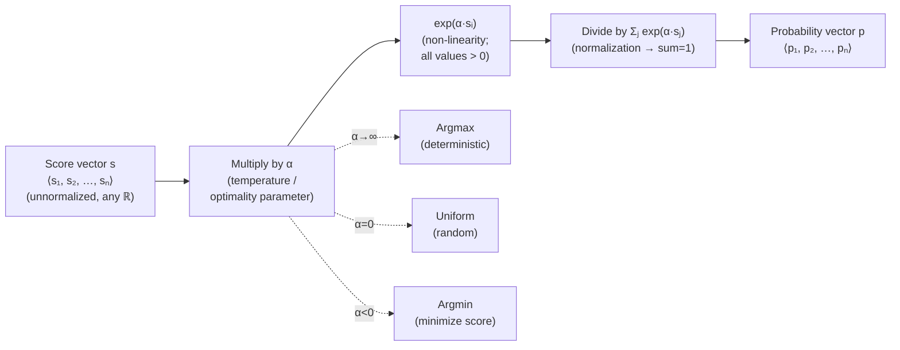
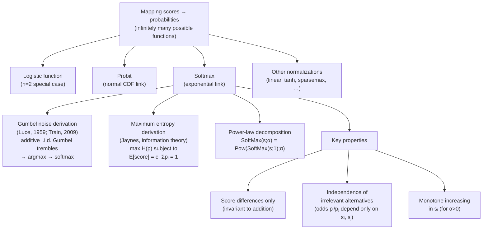

# The Softmax Function: Properties, Motivation, and Interpretation

**Paper:** *The softmax function: Properties, motivation, and interpretation* (Franke & Degen, tutorial)
**Authors:** Michael Franke & Judith Degen
**arXiv:** Not available in the source PDF; this is a tutorial/educational paper.

**Related pages:** [FlashAttention: IO-Aware Exact Attention](flashattention.md), [FlashAttention-2](flashattention-2.md), [FlashAttention-3](flashattention-3.md), [FlashAttention-4](flashattention-4.md)

## TL;DR

**What:** A comprehensive tutorial explaining the softmax function — the ubiquitous mapping from unnormalized score vectors to probability distributions — covering its mathematical properties, the role of the temperature parameter α, and three distinct conceptual justifications for its use.

**How:** Softmax exponentiates and normalizes scores: $p_i = \frac{\exp(\alpha s_i)}{\sum_j \exp(\alpha s_j)}$. The only thing that matters to the output is score *differences* (not absolute values), and the parameter α controls how sharply the distribution concentrates on high-scoring options.

**The number:** At α = 5, a unit score difference yields odds of exp(5) ≈ 150:1 in favor of the higher-scoring option; at α = 0, the output is uniform regardless of scores.

## The Big Picture

*① Scores s are unconstrained real numbers — they don't need to sum to 1 or be positive. ② The exponential ensures all intermediate values are strictly positive. ③ Normalization produces a valid probability vector. ④ α controls the "sharpness": higher α → more mass on the argmax, α = 0 → uniform, α < 0 → argmin.*

## Why This Exists

Softmax is just one of infinitely many functions that map scores to probabilities. So why does almost every model — from multinomial regression to Transformer attention to cognitive models — use *this* particular function?

**The concrete scenario:** Alex faces a three-way choice with scores s = ⟨0, 1, 1⟩. Options 2 and 3 are equally good (and better than option 1). Alex uses a stochastic choice policy that yields an expected score of 0.75. There are infinitely many policies that achieve this:

- Policy A: p = ⟨0.25, 0.75, 0⟩ — never chooses option 3, despite it having the same score as option 2. **Why?** Where does the asymmetry between equally-scored options come from?
- Policy B: p = ⟨0.25, 0.375, 0.375⟩ — respects the scores (equal score → equal probability). This is the softmax policy for α ≈ 0.41.

Without understanding *why* we use softmax, we cannot explain why Policy B is the "right" answer and Policy A is an arbitrary, unjustified assumption. For internally-meaningful (IM) models like cognitive models and agent simulations, this justification matters. For input-output (IO) models like neural networks, the mathematical properties matter more — but knowing them still prevents mistakes.

## The Landscape

*The softmax function sits in a family of link functions for categorical data. It is distinguished by three properties: (1) it can be derived from Gumbel noise-perturbed argmax, (2) it is the maximum-entropy distribution for a given expected score, and (3) its probabilities depend only on score differences, ensuring independence of irrelevant alternatives (IIA).*

## The Core Idea

Softmax transforms unconstrained real-valued scores into a probability distribution where **only score differences matter**, and the parameter α controls **how much** those differences matter. A unit difference in scores translates to odds of exp(α):1. This single insight — $p_i/p_j = \exp(\alpha(s_i - s_j))$ — unlocks every mathematical property, every interpretation of α, and every conceptual motivation for using softmax over any alternative.

## Deep Dive

### The α Parameter: Temperature, Optimality, and Sharpness

**What it does:** α modulates how concentrated the output distribution is on high-scoring options. Higher α → sharper distribution → more deterministic choice.

**Why it matters:** Without understanding α, you cannot interpret model outputs, set priors in Bayesian models, or compare results across different studies.

**How it works:**

| α value | Behavior | Limiting case |
|--------:|----------|---------------|
| α → ∞ | Probability mass collapses onto argmax | Deterministic best-choice |
| α = 5 | Unit score difference → odds ≈ 150:1 | Very sharp |
| α = 1 | Standard softmax (base case) | Moderate |
| α = 0 | All scores multiplied by 0 → uniform output | Complete randomness |
| α < 0 | Higher probability on *lower* scores | Minimization (argmin as α → −∞) |

**The intuition:** Think of α as a "decisiveness dial." Turn it up, and the agent becomes increasingly certain about the best option. Turn it to zero, and the agent flips a fair coin regardless of preference.

**A concrete example:** For Alex's scores s = ⟨0, 1, 1⟩:

- At α = 0.41: p ≈ ⟨0.25, 0.375, 0.375⟩ (expected score 0.75)
- At α = 5: p ≈ ⟨0.006, 0.497, 0.497⟩ (almost never picks option 1)
- At α = −1: p ≈ ⟨0.576, 0.212, 0.212⟩ (favors the *lowest*-scoring option)

**Remember:** α is the log-odds for a unit score difference: α = log(pᵢ/pⱼ) when sᵢ − sⱼ = 1.

### Score Differences Are All That Matter

**What it does:** Softmax output depends only on differences between scores, not absolute values. Adding a constant to all scores leaves the output unchanged.

**Why it matters:** This means scores are meaningful only *relative to each other*, not in absolute terms. It also means you cannot recover the absolute scale of scores from observed probabilities.

**How it works:**

$$\frac{p_i}{p_j} = \frac{\exp(\alpha s_i)}{\sum_k \exp(\alpha s_k)} \cdot \frac{\sum_k \exp(\alpha s_k)}{\exp(\alpha s_j)} = \exp(\alpha(s_i - s_j))$$

The normalizing constant Z = Σⱼ exp(α sⱼ) cancels out, leaving only the exponential of the score difference.

**The intuition:** Softmax doesn't care how "good" an option is in absolute terms — only how much better it is than the alternatives. A score of 100 vs. 99 produces the same output as a score of 1 vs. 0.

**A concrete example:** For scores s = ⟨−5, −4, −2, 2, 2, 3, 2, 7, 3, 10⟩, adding 5 to all scores (making them ⟨0, 1, 3, 7, 7, 8, 7, 12, 8, 15⟩) produces **exactly the same** softmax output. But multiplying all scores by 0.25 changes the output because it compresses score differences.

**Remember:** $\text{SoftMax}(\mathbf{s} + a; \alpha) = \text{SoftMax}(\mathbf{s}; \alpha)$ for any constant $a$. This is invariance under translation.

### Interpretation 1: Noise-Perturbed Selection (Mechanistic)

**What it does:** Derives softmax as the expected choice distribution when an agent repeatedly makes optimal (argmax) choices from scores corrupted by additive Gumbel noise.

**Why it matters:** This provides a mechanistic, process-level justification: if you believe choices are subject to random "trembles" with a specific noise structure, softmax falls out naturally.

**How it works:**

1. Each time a choice is made, sample independent noise εᵢ ~ Gumbel(μ=0, β=1/α) for each option i.
2. The agent sees perturbed scores sᵢ' = sᵢ + εᵢ and chooses argmaxⱼ(sⱼ').
3. Over many choices, the frequency of choosing option i converges to softmax: $p_i = \frac{\exp(\alpha s_i)}{\sum_j \exp(\alpha s_j)}$.

**The intuition:** The agent always picks the best option *as they perceive it in the moment*. But their perception is noisy. If option A is slightly better than B, noise sometimes makes B look better — but the bigger the true gap, the less likely noise flips the ranking.

**A concrete example:** With s = ⟨0, 1, 1⟩ and α = 0.8, over 1000 simulated noisy choices, the empirical frequencies converge to the closed-form softmax probabilities. The option with score 1 is chosen about 2.2× as often as the option with score 0 (odds = exp(0.8 × 1) ≈ 2.23).

**Remember:** This interpretation requires specifically Gumbel-distributed noise. A similar derivation does **not** work for normally-distributed errors (probit, not softmax).

### Interpretation 2: Maximum Entropy — The Most Neutral Choice

**What it does:** Shows that softmax is the probability distribution that maximizes entropy (minimizes unjustified assumptions) subject to a fixed expected score.

**Why it matters:** When you know the scores and the expected outcome but nothing else about the noise process, softmax is the *least assuming* distribution you can pick. Any other distribution implicitly encodes additional assumptions.

**How it works:**

| Step | Description |
|------|-------------|
| 1. Constraints | Σᵢ pᵢ = 1 (valid probability), p · s = c (known expected score) |
| 2. Lagrangian | $\mathcal{L}(\mathbf{p}, \alpha, \beta) = -\sum p_i \log p_i + \alpha(\sum p_i s_i - c) + \beta(\sum p_i - 1)$ |
| 3. Solve ∂ℒ/∂pᵢ = 0 | pᵢ = exp(α sᵢ) / Σⱼ exp(α sⱼ) |

**The intuition:** Entropy measures "surprisal on average." A high-entropy distribution hedges bets — it avoids over-committing to any particular outcome beyond what the constraints force. Softmax is the distribution that satisfies the expected-score constraint while being maximally non-committal about everything else.

**A concrete example:** Bo's scores are s = ⟨0, 0.5, 1⟩ with expected score c = 0.75. Two policies that satisfy this: p₁ = ⟨0.15, 0.2, 0.65⟩ (entropy ≈ 0.887) and p₂ = ⟨0.116, 0.269, 0.616⟩ (entropy ≈ 0.901). Softmax yields p₂ — the higher-entropy, less-assuming policy.

**Remember:** Softmax maximizes H(p) = −Σ pᵢ log pᵢ subject to E[score] = c. This is the Jaynes maximum entropy principle applied to categorical choice.

### Interpretation 3: Exploration-Exploitation Tradeoff

**What it does:** Reframes softmax not as sub-optimal noise but as *optimal hedging* — the ideal balance between exploiting known good options and exploring to detect changes.

**Why it matters:** In dynamic environments where scores may change, always choosing the argmax is brittle. Softmax provides a principled way to "play maximally random" while maintaining a target expected score.

**How it works:**

| Perspective | Interpretation 1 (Noise) | Interpretation 3 (Explore-Exploit) |
|-------------|-------------------------|-------------------------------------|
| Stochasticity | Error / imperfection | Feature / adaptation |
| Agent's goal | Maximize score | Maintain expected score + learn |
| Environment | Static | Dynamic (scores may shift) |
| Justification | Gumbel noise assumption | Maximum entropy + ecological rationality |

**The intuition:** If you always order your favorite dish at a restaurant, you'll never discover the new chef's special. Softmax says: "Keep your average satisfaction at a target level, but within that constraint, be as exploratory as possible." Maximum entropy formalizes "as exploratory as possible."

**A concrete example:** Alex (s = ⟨0, 1, 1⟩) wants an expected score of 0.75. The softmax policy gives options 2 and 3 equal probability, creating the most opportunity to detect if one of them suddenly becomes better or worse — while still hitting the satisfaction target.

**Remember:** This interpretation flips the narrative: softmax isn't "argmax plus error," it's "controlled exploration within a satisfaction budget."

### The IO vs. IM Distinction

**What it does:** Classifies models into two categories that demand different levels of softmax understanding.

**Why it matters:** Knowing which camp your model falls into determines whether you need a conceptual justification for softmax or just its mathematical properties.

**How it works:**

| Aspect | IO Models (Input-Output) | IM Models (Internally-Meaningful) |
|--------|--------------------------|-----------------------------------|
| Goal | Accurate prediction | Explanation + prediction |
| Examples | Neural networks, regression | Cognitive models, agent simulations |
| Scores | Learned, uninterpretable | Independently meaningful (e.g., utilities) |
| α importance | Often clamped to 1 (model is overspecified otherwise) | Crucial — needs interpretation, priors |
| Softmax justification | Mathematical properties suffice | Conceptual motivation needed |

**The intuition:** A neural network doesn't need to "explain" why it uses softmax — it just needs the gradients to flow. A cognitive model of human decision-making *does* need to justify why softmax rather than, say, an epsilon-greedy policy reflects actual human behavior.

**Remember:** If both scores and α are free parameters in your model, the model is overspecified (Fact 8: SoftMax(s; α) = SoftMax(a·s; α/a)). Fix one or add a prior.

## Putting It Together

Here is how the three interpretations interact for a single decision-maker:

1. **The agent** has internal scores (utilities, preferences, evidence) for each option.
2. **If the environment is static and noise is well-modeled as Gumbel:** Interpretation 1 applies — softmax is the expected outcome of noisy optimal choice.
3. **If the noise process is unknown but the expected score is known:** Interpretation 2 applies — softmax is the most neutral, least-assuming distribution.
4. **If the environment is dynamic and exploration matters:** Interpretation 3 applies — softmax is the optimal exploration-exploitation balance.
5. **In all cases:** α controls the "temperature." Low α → more uniform (more noise/more exploration). High α → closer to argmax (less noise/more exploitation).
6. **Practical takeaway for IO models:** Clamp α = 1 if scores are freely learned; vary α only when scores are meaningfully constrained.
7. **Practical takeaway for IM models:** Choose a log-normal prior on α (since α is a log-odds), and interpret α as "degree of optimization" using expected score or negative entropy metrics.

## What This Buys You

### The headline claim

Understanding softmax deeply — not just its formula but *why* it's the right function — prevents modeling mistakes, enables principled prior specification, and provides defensible justifications for reviewers and consumers of your models.

### How we know: mathematical proofs

The paper provides rigorous proofs for every claim:

| Claim | Proof |
|-------|-------|
| Softmax maps any ℝⁿ to a valid probability vector | Fact 1 (exponential > 0, normalization) |
| Only score differences matter | Fact 2 (normalizing constant cancels) |
| Invariant to addition, not multiplication | Facts 6, 7 |
| α recovers multiplicative scaling | Fact 8 (model without score constraints is overspecified) |
| Gumbel noise → softmax | Fact 4 (derivation via convolution of Gumbel CDFs) |
| Maximum entropy → softmax | Fact 5 (Lagrangian optimization) |

### The mechanism behind the numbers

The key mathematical insight is that the exponential function converts additive score differences into multiplicative odds ratios: $s_i - s_j \mapsto \exp(\alpha(s_i - s_j)) = p_i/p_j$. This single property simultaneously explains:

- Why translation invariance holds (differences unchanged)
- Why IIA holds (odds independent of third alternatives)
- Why the n=2 case reduces to the logistic function
- Why α is naturally interpretable as a log-odds

### ⚠️ How to read these numbers

- **Do not interpret α in isolation.** α = 5 means different things for scores on a [0,1] scale versus a [0,100] scale. Always consider α jointly with the score scale.
- **Do not assume the Gumbel noise interpretation without justification.** It requires specific noise structure. If you have domain knowledge about the actual noise process, model it directly.
- **The maximum entropy interpretation assumes entropy is the right measure of "neutrality."** This is a modeling choice, not a fact about the world.

## Where It Breaks

| Failure mode | When it happens | Impact |
|---|---|---|
| Overspecification | Both scores and α are freely estimated from data | Model is unidentifiable — infinite (s, α) pairs produce the same output |
| Wrong noise model | You use softmax but the actual noise is Gaussian (or has different structure) | Predictions are systematically biased; probit would be more appropriate |
| IIA violation | The presence/absence of a third alternative *should* affect choice between two options | Softmax cannot capture context effects like the attraction/compromise effect in consumer choice |
| Score-scale misinterpretation | You compare α across models with different score scales | Meaningless comparison — α and score scale are confounded (Fact 8) |
| Zero-frequency problem | A category never appears in training data | Softmax still assigns it positive probability — may be unrealistic for some applications |
| Numerical instability | Scores have large magnitude differences | exp(large score) overflows; use log-sum-exp trick: $p_i = \exp(s_i - \max_k s_k) / \Sigma_j \exp(s_j - \max_k s_k)$ |

## One Thing to Remember

**Softmax is not just a convenient normalization — it is the unique function that (1) makes probabilities depend only on score differences through exponential odds ratios, (2) emerges from Gumbel-noise-perturbed optimal choice, and (3) is the maximum-entropy distribution for a given expected score.** Every property — translation invariance, IIA, the logistic special case, and α's interpretation as log-odds — follows from the single equation $p_i/p_j = \exp(\alpha(s_i - s_j))$.

## Go Deeper

- **Read:** The original tutorial paper (`raw/algorithm/softmax.pdf`) for complete proofs (Appendices A, B) and R code for solving α from expected scores (Appendix C).
- **Build on:** Luce (1959) for the original choice axiom; Train (2009) for discrete choice models; Jaynes for maximum entropy foundations.
- **Understand the context:** [FlashAttention](flashattention.md) — online softmax in tiled attention; [FlashAttention-2](flashattention-2.md) — logsumexp softmax bookkeeping in kernel optimization.
- **Reproduce:** R code provided in the paper's Appendix C for numerical solution of α given expected scores.
