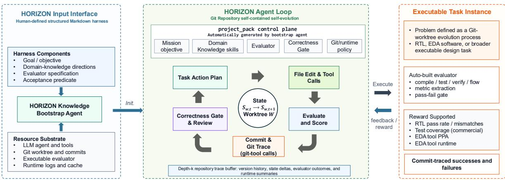
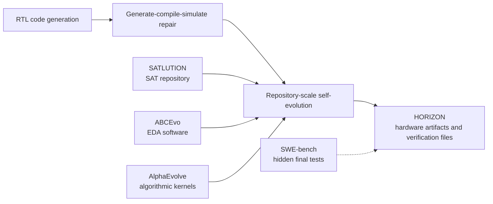
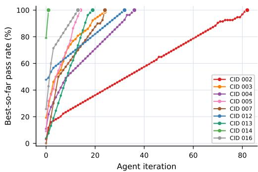

# HORIZON: Agentic Hardware Design as Repository-Level Code Evolution

**Paper:** Agentic Hardware Design as Repository-Level Code Evolution
**Authors:** Cunxi Yu, Chenhui Deng, Nathaniel Pinckney, Brucek Khailany (NVIDIA Research)
**arXiv:** [2606.28279v1 (26 Jun 2026)](https://arxiv.org/abs/2606.28279)

**Related pages:** [Agent Evaluation Benchmarks](../index.md) · [Pier: Coding-Agent Evaluation Harness](../pier/index.md) · [Harbor: Agent Evaluation Framework](../../../frameworks/harbor/index.md) · [Socratic-SWE: Self-Evolving Coding Agents](../../../training/fine-tuning/socratic-swe/index.md)

## TL;DR

**What:** HORIZON makes an RTL design problem a self-contained repository that an agent can edit, test, review, commit, or reject without human intervention.

**How:** A Markdown harness is compiled into a project pack containing domain knowledge, an executable evaluator, an acceptance predicate, and git/runtime policy; each repair attempt becomes a traced repository transition.

**The number:** One GPT-5.3 agent loop reaches 100% best-so-far pass rate across ChipBench, RTLLM-2.0, Verilog-Eval v2, and nine CVDP categories, but requires 1 to 82 iterations and 209.9M cumulative tokens.

## The Big Picture

*Source: [HORIZON paper, Figure 1](https://arxiv.org/abs/2606.28279). ① A human writes a structured Markdown harness. ② The bootstrap agent compiles it into a project pack with mission, domain skills, evaluator, correctness gate, and runtime policy. ③ A hands-free loop edits the worktree, runs the evaluator, and records accepted commits or rejected attempts as replayable evidence.*

## Why This Exists

Plausible Verilog is not a working hardware design. A candidate can compile while still violating cycle timing, reset behavior, bit widths, ready-valid conventions, memory semantics, or corner cases. A single-turn generator also has nowhere to put the code, run a simulator, inspect a failure trace, and repair the design.

Consider a completion task that initially passes only 3.2% of CVDP CID 002. A one-shot score calls this a model failure. HORIZON instead places the candidate in a repository, exposes simulator feedback, and lets the agent revise it across iterations. The important question becomes **how much executable evidence and search budget are needed to converge**, not only whether the first generation was correct.

## The Landscape

*Editable source: [horizon-landscape.mmd](assets/horizon-landscape.mmd). The lineage moves from first-attempt RTL generation, through tool-assisted repair and repository-level software evolution, to HORIZON's use of the same evidence-gated substrate for RTL and verification artifacts. SWE-bench is a contrast: it separates repair-time feedback from hidden final evaluation, a separation HORIZON identifies as important future work.*

## The Core Idea

HORIZON treats **the repository history as both the workspace and the experience trace**. The agent does not merely emit Verilog; it evolves a versioned design under an executable gate. Diffs reveal what changed, evaluator outputs explain what failed, commits mark accepted checkpoints, and rejected attempts remain available for replay and analysis. This makes benchmark completion measurable as a convergence process, while also exposing the cost and reliability limits hidden by a final pass rate.

## Symbol Map

The paper uses $p$ for the compiled project pack, $E_p$ for its evaluator, $A_p$ for its acceptance predicate, and $s_t$ for the repository snapshot at outer iteration $t$. An option $a_t$ is a variable-length episode of edits and tool calls between two checkpoints; this is bookkeeping for replay, not a claim that the LLM is Markovian or that the paper trains an RL policy.

| Symbol | Human name | Scope | Plain meaning |
|---|---|---|---|
| $m$ | Markdown harness | task input | Human-defined objective, context, evaluation, and acceptance rules. |
| $p$ | Project pack | compiled task | Agent policy, evaluator, acceptance gate, git/runtime policy, and domain skills. |
| $E_p$ | Executable evaluator | per attempt | Compilation, simulation, coverage, assertion, or other task-specific checks. |
| $A_p$ | Acceptance predicate | per attempt | Rule deciding whether evaluator evidence is sufficient to commit. |
| $s_t$ | Repository state | checkpoint $t$ | Worktree tree plus project pack, campaign state, logs, artifacts, and allowed memory. |
| $y_t$ | Evaluator evidence | attempt $t$ | Outputs used to score and review the candidate. |

## Deep Dive

### Harness compilation into a project pack

**What it does:** Converts a short, structured task description into an executable and policy-complete repository task.

**Why it matters:** The agent needs domain invariants and a trustworthy gate, not just a natural-language prompt.

**How it works:** The bootstrap agent reads the Markdown harness and produces five coupled pieces: an agent policy/tool contract, evaluator, acceptance predicate, version-control and artifact policy, and domain knowledge. For RTL, the evaluator may invoke compilation, simulation, coverage extraction, and assertion checks; the same interface can host unit tests, profilers, formal tools, or synthesis flows.

**The intuition:** The harness is a recipe; the project pack is the runnable lab in which the agent can conduct experiments.

**A concrete example:** For a broken RTL module, the pack supplies the simulator command, expected artifacts, failure logs, and the exact condition that makes a commit acceptable.

**Remember:** The benchmark task is defined by an executable repository contract, not by a prompt alone.

### Git as state, trace, and review substrate

**What it does:** Makes every accepted design version and rejected repair attempt inspectable and replayable.

**Why it matters:** Long-horizon hardware repair needs persistent state; chat history alone does not tell us which edit changed behavior or why a candidate was accepted.

**How it works:** The agent edits an isolated worktree, inspects staged diffs, runs the evaluator, and submits to an independent review/correctness gate. Passing candidates become commits with evaluator evidence in messages or git notes; failures are logged without advancing the accepted state. The trace therefore contains both positive repair strategies and negative examples of failed edits.

**The intuition:** Git turns an opaque debugging session into a sequence of named experiments.

**A concrete example:** If a reset fix compiles but fails simulation, the failed diff and its evaluator output remain attached to the attempt instead of disappearing when the next prompt is issued.

**Remember:** A commit is an evidence-backed checkpoint, not merely a save operation.

### Feedback-driven convergence

**What it does:** Replaces first-attempt accuracy with best-so-far progress over repeated evaluator-guided iterations.

**Why it matters:** RTL correctness is often discoverable only after the simulator exposes temporal or bit-level behavior.

**How it works:** At iteration $t$, the agent proposes an artifact delta $\Delta_t$, invokes tools, obtains $y_t = E_p(w_t \oplus \Delta_t)$, and either commits or reject-logs according to $A_p(y_t)$. The outer depth is determined by the campaign budget or convergence rule. Persistent sessions make roughly 91% of the reported tokens cached input, reducing marginal prompt cost even when repair takes many iterations.

**The intuition:** A hard task may be solvable by a patient debugger even when it is not solvable in one guess.

**A concrete example:** CVDP CID 002 begins at 3.2% and reaches 100% only at iteration 82, while CID 014 reaches 100% after one iteration; both have the same final score but very different search costs.

**Remember:** Final pass rate hides the actual research target: convergence efficiency.

### Acceptance is not exhaustive correctness

**What it does:** Defines exactly what HORIZON measures and exposes the gap between passing the visible harness and robust design semantics.

**Why it matters:** Rich repair feedback helps the agent debug, but it can also let the agent specialize to evaluator artifacts or visible stimuli.

**How it works:** The current loop stops when the benchmark’s pass condition is satisfied. Coverage is observed rather than optimized: CID 012 reaches 100% pass with 97.9% average parsed coverage. The paper recommends a two-level protocol: expose diagnostics during repair, but reserve hidden randomized tests, independent reference models, formal equivalence checks, or held-out simulator configurations for final scoring.

**The intuition:** A design can pass the test the agent saw without being correct under tests it never saw.

**A concrete example:** A generated stimulus suite may satisfy the CVDP acceptance gate while leaving some legal behaviors unexercised; passing does not imply coverage closure.

**Remember:** HORIZON demonstrates benchmark convergence, not production signoff.

## Putting It Together

1. **Describe:** A user writes a Markdown harness for an RTL completion, modification, reuse, stimulus, checker, assertion, or debugging task.
2. **Compile:** The bootstrap agent creates a project pack with domain instructions, evaluator commands, acceptance rules, and git/runtime policy.
3. **Initialize:** The task becomes an isolated worktree containing the design artifacts, tests, and runtime state.
4. **Explore:** The agent edits RTL or verification files, invokes compilation/simulation/EDA tools, and reads the resulting evidence.
5. **Review:** A correctness gate checks the candidate; accepted versions are committed with traces, while failed candidates are reject-logged.
6. **Converge:** The loop repeats until the suite’s pass condition is met or the budget ends; later analysis reports iteration count, tokens, coverage, and failure modes.

## What This Buys You

### The headline claim

**Executable repository feedback can drive every evaluated RTL suite to a 100% best-so-far pass rate**, but the effort required varies dramatically by task family.

### How we know: benchmark convergence

| Suite or category | First iteration | Best iteration | Final pass |
|---|---:|---:|---:|
| ChipBench | 20.0% | 5 | 100.0%* |
| RTLLM-2.0 | 78.0% | 2 | 100.0% |
| Verilog-Eval v2 | 86.2% | 2 | 100.0% |
| CVDP CID 002: completion | 3.2% | 82 | 100.0% |
| CVDP CID 013: checker generation | 3.8% | 19 | 100.0% |
| CVDP CID 014: assertion generation | 79.1% | 1 | 100.0% |

*The one original ChipBench miss is attributed to a specification-harness mismatch; counting it as resolved yields 100%.*

*Source: [HORIZON paper, Figure 2b](https://arxiv.org/abs/2606.28279). The curves show why “100% complete” is not a sufficient summary: CVDP categories have very different repair trajectories, with CID 002 carrying an 82-iteration long tail.*

### The mechanism behind the numbers

The loop is especially valuable on verification-oriented tasks, where single-shot models have little chance to infer a correct checker or assertion from prose alone. But completion is expensive: the campaign consumes 209.9M tokens through earliest-best iterations, 97.1% of them in the nine CVDP categories, and 56.0M in CID 002 alone. The paper reports about 91% cached input tokens, so these figures are effort proxies rather than direct dollar costs.

### ⚠️ How to read these numbers

The reported iteration-0 pass rate is the repository state after the first agent iteration, **not** standalone model Pass@1. Likewise, 100% pass means the supplied acceptance predicate was satisfied; it does not establish hidden-test robustness, PPA quality, formal equivalence, or readiness for a production chip flow.

## Where It Breaks

| Failure mode | When it happens | Impact |
|---|---|---|
| Reward hacking or over-solving | The agent sees detailed simulator traces or the same harness used for final scoring | A candidate may specialize to evaluator artifacts rather than implement general semantics. |
| Incomplete verification | Passing stops the loop before coverage or property closure | A passing design can still leave legal behaviors untested. |
| Slow reward turnaround | Evaluation requires synthesis, placement, routing, timing, power, or long regressions | Edit-evaluate-repair becomes too slow for naive iteration. |
| Specification-harness mismatch | The benchmark’s prose and executable checker disagree | A failure may reflect the benchmark rather than the design. |
| Narrow benchmark proxy | The task omits changing constraints, downstream integration, human review, or PPA trade-offs | Results do not transfer directly to production chip design. |

## One Thing to Remember

**HORIZON makes hardware design legible as a sequence of evidence-backed repository changes:** a harness defines the mission, a project pack makes it executable, git preserves the search, and the evaluator decides which versions survive. The striking result is not simply 100% benchmark completion; it is that correctness becomes comparatively easy once feedback is exposed, while convergence cost and protection against evaluator-specific overfitting become the harder problems.

## Go Deeper

- **Read:** [Agentic Hardware Design as Repository-Level Code Evolution (arXiv:2606.28279)](https://arxiv.org/abs/2606.28279)
- **Build on:** [AutoChip](https://arxiv.org/abs/2311.04887), [VerilogCoder](https://arxiv.org/abs/2408.08927), [CVDP](https://arxiv.org/abs/2506.14074), [ABCEvo](https://arxiv.org/abs/2604.15082)
- **Understand the context:** [Pier: Coding-Agent Evaluation Harness](../pier/index.md) · [Harbor: Agent Evaluation Framework](../../../frameworks/harbor/index.md) · [DeepSWE](../deepswe/index.md)
- **Reproduce:** The paper reports a fixed GPT-5.3 backbone and hands-free single-agent campaigns on an AMD EPYC 9334 host with 512 GB RAM; no public HORIZON implementation is identified in the source.
- **Editable diagram:** [horizon-landscape.mmd](assets/horizon-landscape.mmd)
