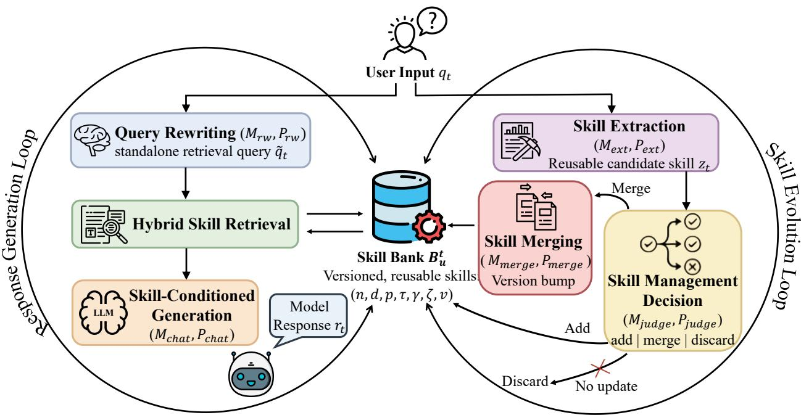
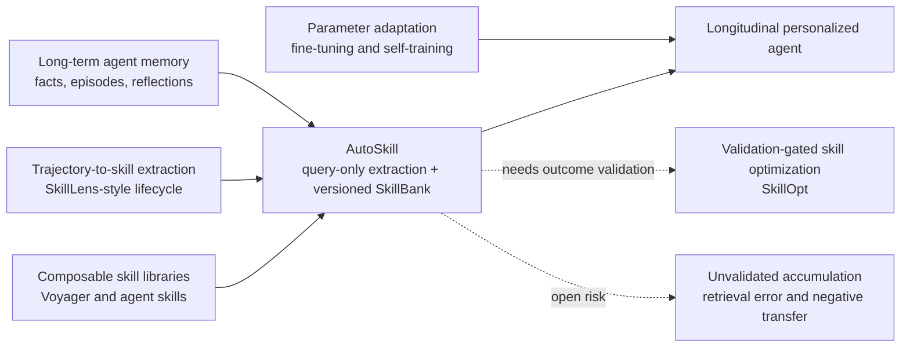
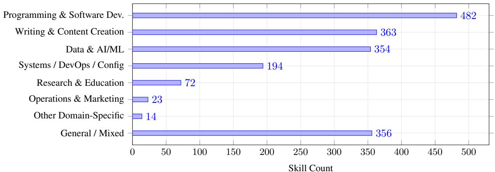

# AutoSkill: Experience-Driven Lifelong Learning

**Paper:** [AutoSkill: Experience-Driven Lifelong Learning via Skill Self-Evolution](https://arxiv.org/abs/2603.01145v2)  
**Authors:** Yutao Yang, Junsong Li, Qianjun Pan, Bihao Zhan, Yuxuan Cai, Lin Du, Jie Zhou, Kai Chen, Qin Chen, Xin Li, Bo Zhang, Liang He  
**arXiv:** [2603.01145v2 (March 2026)](https://arxiv.org/abs/2603.01145v2)  
**Code:** [ECNU-ICALK/AutoSkill](https://github.com/ECNU-ICALK/AutoSkill)

**Related pages:** [Agent Evaluation Benchmarks](../index.md) · [SkillLens](../skilllens/index.md) · [SkillOpt](../skillopt/index.md) · [Socratic-SWE](../../../training/fine-tuning/socratic-swe/index.md)

## TL;DR

**What:** AutoSkill is a training-free layer that converts recurring user-side interaction patterns into explicit, inspectable [agent skills](../../../terms/agent-skill.md).  
**How:** One loop rewrites the current query, retrieves matching skills, and injects them into generation; a second loop extracts a candidate and decides to add, merge, or discard it in a versioned SkillBank.  
**The number:** The reported WildChat study extracts **1,858 skills from 22,511 conversations and 596,693 messages** across four language/model subsets, but it does not measure whether those skills improve later task success.

## The Big Picture

*Source: [AutoSkill paper, Figure 1](../../../../raw/benchmarks/autoskill-experience-driven-lifelong-learning--arxiv-2603.01145v2.pdf). ① The response loop rewrites a request, retrieves relevant skills, and conditions the answer. ② The evolution loop extracts a reusable candidate from user inputs. ③ A local management decision adds, merges, or discards the candidate. ④ Both loops meet at a persistent, versioned SkillBank; no model weights are updated.*

The figure answers the architectural question: **where does lifelong adaptation live?** AutoSkill places it in ordinary external artifacts and retrieval state, not in the base model. That makes adaptation inspectable and reversible, while also moving correctness risk into extraction, retrieval, merging, and prompt obedience.

## Why This Exists

Imagine a user repeatedly asks for executive summaries that avoid jargon, preserve exact numbers, and end with a three-item action list. A chat-history memory can retrieve old requests, but the model must infer the operating rule again each time. Fine-tuning could internalize the preference, but it is heavy, opaque, and awkward to update after one correction.

AutoSkill instead tries to crystallize the repeated pattern into one durable artifact: a description, triggers, tags, examples, executable instructions, and a version. On the next related request, the system retrieves that artifact and injects it as behavior guidance. If the user later says “keep acronyms, but define them once,” the maintainer should merge that reusable correction into the same skill rather than create another overlapping memory.

**The practical problem is not remembering the old conversation; it is maintaining a reusable behavioral rule without silently accumulating duplicates or one-off details.**

## The Landscape

*Editable source: [autoskill-landscape.mmd](assets/autoskill-landscape.mmd). AutoSkill sits between long-term memory and explicit skill libraries: it operationalizes remembered preferences as versioned instructions. [SkillLens](../skilllens/index.md) supplies the missing lifecycle-level utility test, while [SkillOpt](../skillopt/index.md) illustrates validation-gated artifact updates.*

## The Core Idea

**Treat repeated interaction as source material for an editable operating manual.** The current request uses the relevant pages of that manual; later corrections revise those pages. This is a lighter and more legible form of adaptation than weight updates, but the manual is only useful if the system learns the right rule, retrieves it for the right request, and refuses to merge unrelated behavior.

## Symbol Map

The paper uses $q$ and $r$ for user and model turns, $B$ for the persistent skill bank, and $M$ for prompt-instantiated model roles. Subscript $t$ means “at the current turn,” while subscript $u$ scopes state to one user.

| Symbol | Human name | Shape / scope | Plain meaning |
|---|---|---|---|
| $q_t$ / $r_t$ | query / response | one dialogue turn | The current user input and generated answer. |
| $\tilde q_t$ | rewritten query | one retrieval string | A standalone, retrieval-oriented form of the current request. |
| $B_u^t$ | user SkillBank | user × turn | The versioned skills available for user $u$ after turn $t$. |
| $s=(n,d,p,\tau,\gamma,\xi,v)$ | stored skill | one artifact | Name, description, prompt, triggers, tags, examples, and version. |
| $z_t$ | candidate skill | one proposed artifact | Reusable behavior extracted from recent user queries. |
| $\mathcal H_t$ | injected skill set | up to top-$K$ skills | Retrieved skills whose combined relevance exceeds threshold $\eta$. |
| $a_t$ | maintenance action | add, merge, or discard | The judge's decision for the candidate. |
| $\lambda$ / $\alpha$ | retrieval weights | scalar in $[0,1]$ | Dense-versus-BM25 balance for response-time and maintenance-time retrieval. |

| Path | Critical state | Latency role | Evidence used |
|---|---|---|---|
| Response generation | $q_t \rightarrow \tilde q_t \rightarrow \mathcal H_t \rightarrow r_t$ | Foreground | Current query, recent history, stored skills. |
| Skill evolution | user queries $\rightarrow z_t \rightarrow a_t \rightarrow B_u^{t+1}$ | Background | User-side queries; model responses are explicitly excluded from extraction evidence. |

## Deep Dive

### Rewrite and retrieve the behavioral intent

**What it does:** It turns a context-dependent user turn into a standalone search query, then combines dense similarity with lexical BM25 relevance.

**Why it matters:** A follow-up such as “and keep the numbers exact” contains a reusable constraint but omits the task anchor needed to find the executive-summary skill.

**How it works:** The rewriter preserves the current task for continuations, replaces it on topic switches, resolves references, and keeps only retrieval-critical constraints. For every skill, AutoSkill min-max normalizes dense and BM25 scores, blends them with weight $\lambda$, ranks the bank, and injects only top-$K$ results above threshold $\eta$. If nothing clears the threshold, generation proceeds without a skill.

**The intuition:** Dense retrieval recognizes meaning; lexical retrieval protects exact triggers and named constraints.

**A concrete example:** “Keep the numbers exact” becomes a query anchored to executive-summary writing, allowing both semantic similarity and the exact “numbers” constraint to retrieve the right artifact.

- **Remember:** Retrieval has an explicit abstention path, but the paper does not report threshold values or retrieval accuracy.

### Extract only portable user-side rules

**What it does:** It proposes structured skill candidates from a recent window of user queries.

**Why it matters:** Saving every request would turn the SkillBank into a noisy transcript rather than a reusable manual.

**How it works:** A prompt-driven extractor looks for durable constraints, policies, workflows, templates, and recurring corrections. It removes case-specific entities, rejects generic or one-shot requests, and emits a name, description, Markdown prompt, triggers, tags, examples, and confidence. The formal method deliberately excludes assistant responses from extraction evidence.

**The intuition:** Learn what the user consistently asks the system to do, not what the system happened to say.

**A concrete example:** The extractor keeps “preserve exact numbers and end with three actions,” but drops the company name and quarterly figures from the current report.

- **Remember:** Query-only extraction reduces self-contamination, but it cannot directly tell whether an earlier assistant behavior succeeded or failed.

### Decide locally: add, merge, or discard

**What it does:** It prevents every candidate from becoming a new artifact.

**Why it matters:** Without consolidation, the same summary preference could fragment into many contradictory prompt snippets.

**How it works:** The candidate is itself used as a hybrid-retrieval query. A judge compares it with the most relevant existing skill across job-to-be-done, deliverable, hard constraints, and required workflow. A distinct durable capability is added; a continuation of the same capability is merged; a generic, low-signal, non-portable, or library-covered candidate is discarded.

**The intuition:** Find the nearest manual page before deciding whether to create another one.

**A concrete example:** “Define acronyms once” merges into the executive-summary skill, while a reusable spreadsheet-validation workflow becomes a separate skill.

- **Remember:** The local comparison is scalable, but a wrong nearest neighbor can turn an appropriate add into a harmful merge.

### Preserve identity through versioned merging

**What it does:** It evolves one skill by semantic union instead of concatenating old and new text.

**Why it matters:** Blind append-only updates accumulate stale constraints and can erase the artifact's original scope.

**How it works:** The merge prompt preserves capability identity, imports only reusable non-conflicting additions, removes case details, deduplicates sections and triggers, and retains important checks. The stored version is then bumped. The paper's `professional_text_rewrite` case reaches version `0.1.34`, illustrating repeated consolidation into one artifact.

**The intuition:** Revise a living specification; do not pile sticky notes onto it.

**A concrete example:** The executive-summary skill retains its exact-number check, gains the acronym rule, and advances version without copying the current report's names or facts.

- **Remember:** Version numbers make change visible, but the paper does not define rollback, conflict resolution, or validation before promotion.

## Putting It Together

Follow one executive-summary preference from a new request to the next stored version:

| Step | Actor | Input state | Action | Output state |
|---:|---|---|---|---|
| 1 | Query rewriter | “Also define every acronym once” plus recent summary task | Restores the task anchor and keeps the new constraint. | Standalone retrieval query $\tilde q_t$. |
| 2 | Hybrid retriever | $\tilde q_t$ and $B_u^t$ | Blends normalized dense and BM25 scores; applies top-$K$ and $\eta$. | Existing executive-summary skill in $\mathcal H_t$. |
| 3 | Response model | Request, history, rendered skill context | Produces the current summary under the stored rules. | User-visible response $r_t$. |
| 4 | Extractor | Recent user queries only | Abstracts “define acronyms once” as a reusable candidate and removes report-specific facts. | Candidate $z_t$. |
| 5 | Management judge | $z_t$ and nearest existing skill | Recognizes the same capability and chooses `merge`. | Target skill ID plus rationale. |
| 6 | Merger | Existing artifact and $z_t$ | Performs semantic union, preserves checks, deduplicates, and bumps the version. | Updated $B_u^{t+1}$. |
| 7 | Next request | New summary task and updated bank | Retrieves the evolved artifact. | The acronym rule carries across sessions without weight updates. |

The foreground response and background update are logically separate. **The current answer may use the old skill while the reusable correction becomes available for a later turn.**

## What This Buys You

### The headline claim

**AutoSkill demonstrates extraction and organization at corpus scale, not validated improvement in agent behavior.** Its strongest evidence is that one prompt-driven pipeline can produce a multilingual, inspectable skill repository with diverse domains and repeatedly versioned artifacts.

### How we know: WildChat extraction scale

| Subset | Conversations | Messages | Average messages / conversation | Extracted skills |
|---|---:|---:|---:|---:|
| Chinese GPT-3.5 | 5,912 | 134,670 | 22.78 | 400 |
| English GPT-3.5 | 10,243 | 267,681 | 26.13 | 631 |
| Chinese GPT-4 | 1,145 | 36,834 | 32.17 | 224 |
| English GPT-4 | 5,211 | 157,508 | 30.23 | 603 |
| **Total** | **22,511** | **596,693** | — | **1,858** |

*Source: AutoSkill paper, Table 1. The total row is a repository-derived sum of the four source-reported subsets.*

*Source: [AutoSkill paper, Figure 2](../../../../raw/benchmarks/autoskill-experience-driven-lifelong-learning--arxiv-2603.01145v2.pdf). Programming and software development is the largest category at 482 skills, followed by writing/content creation at 363, general/mixed at 356, and data/AI/ML at 354.*

### The mechanism behind the numbers

Long conversations provide repeated constraints from which the extractor can abstract a portable artifact. The category spread and the two qualitative cases show representational breadth: one schema can encode interpersonal style, strict rewriting rules, programming workflows, and platform-specific behavior. The version-`0.1.34` rewrite example also shows that the storage model can represent repeated evolution without proliferating files.

### ⚠️ How to read these numbers

The counts establish **production volume**, not precision, usefulness, safety, or retention. The paper reports no no-skill baseline, held-out downstream score, retrieval recall, human correctness rating, negative-transfer rate, ablation, or longitudinal forgetting measure. Compare this with [SkillLens](../skilllens/index.md), where polished skills sometimes hurt the target, and [SkillOpt](../skillopt/index.md), where candidate updates must improve held-out validation before promotion.

## Where It Breaks

| Failure mode | When it happens | Impact |
|---|---|---|
| Query-only blind spot | Success or failure is visible only in the assistant response, tool result, or outcome rather than in the user's wording | The extractor can preserve a requested rule without knowing whether it worked, and may miss lessons from execution traces. |
| Retrieval miss or false match | Query rewriting drops the task anchor, score normalization is unstable in a small bank, or $K$, $\eta$, and $\lambda$ are poorly tuned | A useful skill is absent, or an irrelevant instruction steers the current response. |
| Wrong local neighbor | The most similar retrieved skill is not the correct capability family | The judge may merge unrelated behavior and corrupt an existing artifact. |
| Ungated merge regression | A fluent merged artifact is promoted without behavioral validation | New wording can delete an important check or cause negative transfer while still earning a higher version. |
| Corpus-selection bias | Only WildChat conversations longer than eight turns are retained | The reported distribution may not represent short sessions, enterprise workflows, tool traces, or other deployment populations. |
| Extraction-quality uncertainty | The unspecified extraction model or prompt configuration changes, or unsafe user patterns look reusable | Skill counts remain high while correctness, safety, and reproducibility remain unknown. |
| Privacy and scope leakage | Personal and common banks are mixed incorrectly, or retrieved artifacts contain sensitive specifics that abstraction failed to remove | Preferences or private details can influence the wrong user or task. |
| Concurrent-update race | Multiple background extractions update the same skill without explicit conflict control | Versions can overwrite, reorder, or inconsistently combine corrections; the paper does not specify concurrency semantics. |

> **Inference:** AutoSkill's architecture is a credible artifact-management design, but its central empirical claim should be read as “skills can be extracted and organized at scale,” not “lifelong learning improves outcomes.” The latter needs held-out behavioral evaluation and update gating.

## One Thing to Remember

**AutoSkill turns conversation into a living operating manual.** Its two-loop design makes personalization inspectable, portable, and training-free by retrieving instructions for today's answer and revising them for tomorrow; the unresolved question is whether each revision makes the agent better rather than merely making the manual larger.

## Go Deeper

- **Read:** [AutoSkill paper](https://arxiv.org/abs/2603.01145v2)
- **Build on:** [SkillLens utility-grounded lifecycle](../skilllens/index.md) · [SkillOpt validation-gated updates](../skillopt/index.md) · [Socratic-SWE trace-derived skills](../../../training/fine-tuning/socratic-swe/index.md)
- **Understand the context:** [Agent Skill glossary](../../../terms/agent-skill.md) · [Agent Evaluation Benchmarks](../index.md)
- **Reproduce:** [ECNU-ICALK/AutoSkill](https://github.com/ECNU-ICALK/AutoSkill); the paper describes an SDK, Web UI, and OpenAI-compatible proxy, but does not report the exact model and retrieval hyperparameters used for the WildChat extraction.
- **Source extraction:** [MinerU Markdown](../../../../derived/pdf-markdown/benchmarks/autoskill-experience-driven-lifelong-learning/autoskill-experience-driven-lifelong-learning.md)
- **Editable diagram:** [autoskill-landscape.mmd](assets/autoskill-landscape.mmd)
