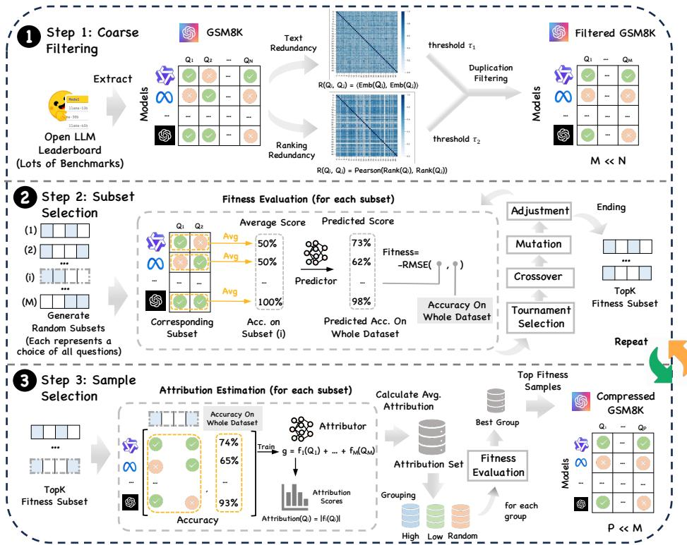
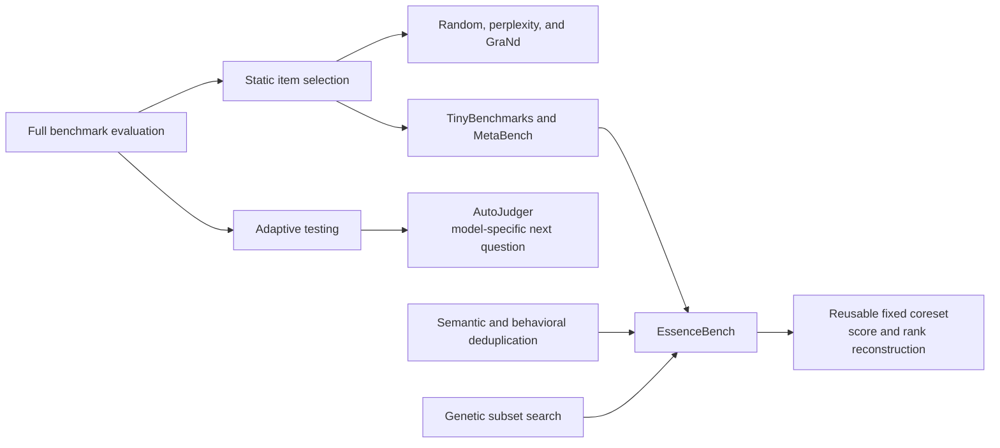
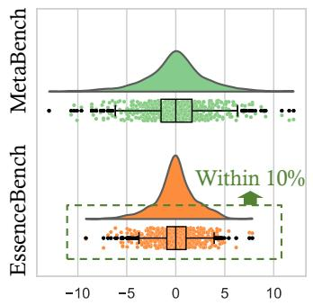

# EssenceBench: LLM Evaluation with 200x Less Data

**Paper:** Rethinking LLM Evaluation: Can We Evaluate LLMs with 200x Less Data?  
**Authors:** Shaobo Wang, Cong Wang, Wenjie Fu, Yue Min, Mingquan Feng, Isabel Guan, Xuming Hu, Conghui He, Cunxiang Wang, Kexin Yang, Xingzhang Ren, Fei Huang, Dayiheng Liu, Linfeng Zhang  
**arXiv:** [2510.10457v1 (14 Oct 2025)](https://arxiv.org/abs/2510.10457)

**Related pages:** [Agent Evaluation Benchmarks](../index.md) · [AutoJudger](../autojudger.md)

## TL;DR

**What:** EssenceBench turns [benchmark compression](../../../terms/benchmark-compression.md) into a score-reconstruction problem: choose a fixed small subset whose scores predict the full benchmark's scores and model ordering.

**How:** It removes textually or behaviorally redundant items, evolves fixed-size subsets with a genetic algorithm scored by held-out reconstruction RMSE, and repeatedly narrows the search with sample attributions from elite subsets.

**The number:** On 10,000-item HellaSwag, the detailed results report that 50 items (200x compression) keep 94.6% of models within 10% of their true rank, while 400 items (25x compression) keep every model within 5%; the abstract's stronger 200x/5% wording conflicts with its own detailed table.

## The Big Picture

*Source: [EssenceBench paper, Figure 3](../../../../raw/benchmarks/rethinking-llm-evaluation-200x-less-data--arxiv-2510.10457v1.pdf). ① Coarse filtering removes a later item when its text embedding or across-model response pattern is too similar to an earlier item. ② Genetic search evolves fixed-size masks and rewards subsets whose scores reconstruct full-benchmark accuracy. ③ An explainable boosting model attributes the elite subsets' predictive value to individual items, splits them into high-, low-, and random-attribution groups, and restarts search inside the best group.*

The figure's central idea is **learn the evaluation subset from a history of model-by-item outcomes**. EssenceBench is therefore an offline benchmark-design procedure, not a cheaper scoring rule that can be applied without prior full-benchmark results.

## Why This Exists

Suppose a leaderboard evaluates every new model on all 10,000 HellaSwag items. Most of those decisions are repeated across models: near-duplicate prompts test the same semantics, while behaviorally redundant items produce nearly the same correct/incorrect pattern across the leaderboard. The full run remains expensive even though many columns in the historical response matrix carry overlapping information.

Now compress HellaSwag to 50 items. Random sampling may accidentally overrepresent easy or repetitive cases, moving close models many leaderboard positions. A hand-picked set can be diverse yet still fail to reproduce full-set accuracy. **The hard part is not finding 50 plausible questions; it is finding 50 questions whose joint outcomes predict how unseen model rows would score on all 10,000.** EssenceBench uses the historical matrix to optimize that joint property directly.

## The Landscape

*Editable source: [essencebench-landscape.mmd](assets/essencebench-landscape.mmd). Static heuristics rank items individually; IRT-based methods emphasize item discrimination; AutoJudger adapts each interview to the model being tested. EssenceBench instead combines redundancy removal with population-level search for one reusable subset whose aggregate score reconstructs the full leaderboard.*

The closest sibling here is [AutoJudger](../autojudger.md), but the operating contract differs. AutoJudger selects the next question online for each model; EssenceBench spends more effort offline to publish one fixed coreset that every later model answers.

## The Core Idea

**A good compressed benchmark is a team of questions, not a list of individually important questions.** EssenceBench first removes obvious duplicates, then searches over whole subsets because two useful items can still be redundant together. It learns which combinations reconstruct historical full-benchmark scores, uses the best combinations to estimate per-item contribution, and repeats the search in deliberately different attribution regions so an early local optimum does not define the final benchmark.

## Symbol Map

The paper uses capital letters for datasets and matrices, lowercase vectors for a model's aggregate scores or a subset mask, and $k$ for the strict evaluation budget.

| Symbol | Human name | Shape or scope | Plain meaning |
|---|---|---|---|
| $\mathcal{D}$ | full benchmark | $N$ items | Every original evaluation item. |
| $\mathbf{S}$ | response matrix | models x items | Binary correctness of each historical model on each item. |
| $\mathbf{y}$ | full-score vector | one value per model | Accuracy computed on all $N$ items. |
| $\mathbf{m}$ | subset mask | $N$ binary entries | Selects exactly $k$ benchmark items. |
| $k$ | coreset budget | fixed integer | Number of items a future model must answer. |
| $M$ | filtered size | $M \leq N$ | Candidate count after redundancy filtering. |
| $P$ | refined pool size | $P < M$ | Candidate count after attribution grouping. |
| $\mathcal{R}_{text}$ | text redundancy | item pair | Similarity between item embeddings. |
| $\mathcal{R}_{ranking}$ | behavioral redundancy | item pair | Correlation between across-model outcome patterns. |
| $A_j$ | sample attribution | item $j$ | Average EBM contribution of an item across elite subsets containing it. |

## Deep Dive

### Dual redundancy filtering removes two kinds of duplicates

**What it does:** Greedily drops an item if either its embedding similarity or its response-pattern correlation with a previously retained item crosses a threshold.

**Why it matters:** The 50-item HellaSwag coreset cannot spend two slots asking nearly the same semantic question or eliciting the same model ordering.

**How it works:** BGE-M3 embeds the item text for semantic similarity. The leaderboard response matrix supplies each item's vector of model outcomes for behavioral correlation. Iterating in original dataset order, EssenceBench keeps the first item from a redundant pair and removes the later one; MMLU receives looser thresholds because its curriculum structure naturally produces similar items.

**The intuition:** Text similarity catches “same question, new wording,” while response similarity catches “different story, same diagnostic signal.”

**A concrete example:** The paper finds two locker-volume questions with almost identical arithmetic wording, and separately finds two differently worded multi-step arithmetic problems that produce similar model behavior. Both pairs waste scarce HellaSwag-style subset capacity for different reasons.

- **Remember:** Filtering is an efficiency-oriented candidate cleanup, not the final subset decision.

### Genetic search optimizes item combinations

**What it does:** Evolves a population of exactly-$k$ item masks toward low full-score reconstruction error.

**Why it matters:** A benchmark of $N$ items has $\binom{N}{k}$ possible coresets, and item value depends on which other items are selected.

**How it works:** Each mask produces subset accuracies for historical models. A generalized additive model maps those subset accuracies to full-benchmark accuracies, and validation RMSE becomes fitness. Tournament selection retains stronger parents; crossover recombines their masks; mutation flips entries; adjustment restores exactly $k$ selected items; elites survive for the next stage.

**The intuition:** Treat each candidate benchmark as a chromosome and let prediction error decide which combinations reproduce the leaderboard.

**A concrete example:** For the 50-item HellaSwag budget, two individually discriminative questions may still cover the same group of models. A competing mask that replaces one with a complementary question wins if its aggregate score better predicts all 10,000-item accuracies.

- **Remember:** Fitness belongs to a whole subset, so EssenceBench can capture interactions that top-$k$ item rankings miss.

### Attribution-guided refinement escapes one search basin

**What it does:** Uses elite masks to estimate each item's contribution, then reruns genetic search inside high-, low-, and random-attribution candidate groups.

**Why it matters:** Repeated crossover among the same elites can converge prematurely and exclude useful items that were unlucky early in the search.

**How it works:** An explainable boosting machine is fitted to response features from the elite masks. The norm of each item's learned component becomes its attribution within a mask; values are averaged across elites. Equal-size high, low, and random groups are formed, a new genetic search evaluates each group, and the lowest-error group becomes the next round's candidate pool.

**The intuition:** Exploit what the best subsets already know, but force the search to check neglected and random regions before shrinking the pool again.

**A concrete example:** If early HellaSwag elites favor common-sense items answered by the same middle-ranked models, the low- or random-attribution group can reintroduce an unusual item that separates two otherwise tied models.

- **Remember:** Attribution guides where to search next; it is not simply a command to keep the highest-attribution items.

### Iteration trades offline search for cheaper future evaluation

**What it does:** Repeats subset search and attribution grouping while preserving the globally best mask.

**Why it matters:** More refinement rounds consistently lower the reported small-budget RMSE, whereas merely increasing genetic generations can overexplore an unhelpful candidate pool.

**How it works:** On GSM8K with a 50-item budget, five refinement rounds improve RMSE over two rounds at every reported generation setting. With 1,000 generations, the paper reports 2.77 RMSE at two rounds and 2.47 at five; at five rounds, increasing generations from 1,000 to 3,000 further improves RMSE from 2.47 to 2.40.

**The intuition:** First improve the search space, then search it harder.

**A concrete example:** The HellaSwag coreset is expensive to discover once, but after publication every new model runs only the retained 50 or 400 items and uses the learned predictor to estimate its full score.

- **Remember:** EssenceBench shifts cost from every evaluation run into a one-time, leaderboard-specific optimization campaign.

## Putting It Together

Follow one 50-item HellaSwag coreset from the 10,000-item benchmark to a predicted full score:

| Step | Actor | Input state | Action | Output state |
|---:|---|---|---|---|
| 1 | Data builder | Historical model-by-item outcomes | Remove low-performing models and low-variance items, then form stratified train/test model splits | Calibration matrix and held-out model rows |
| 2 | Coarse filter | 10,000 candidate items | Remove later textually or behaviorally redundant items | Filtered pool of $M$ items |
| 3 | Genetic algorithm | Random 50-item masks | Select, cross, mutate, and repair masks using validation RMSE | Elite 50-item masks |
| 4 | EBM attributer | Elite masks and response features | Estimate per-item contribution and aggregate across masks | Attribution $A_j$ for candidate items |
| 5 | Group search | High-, low-, and random-attribution pools | Run GA in each pool and retain the lowest-error region | Smaller candidate pool for the next round |
| 6 | Global selector | Best mask from every round | Keep the lowest-RMSE mask seen | Published 50-item coreset plus score predictor |
| 7 | New-model evaluator | One new model's 50 binary outcomes | Compute subset accuracy and map it through the learned predictor | Estimated 10,000-item score and leaderboard rank |

## What This Buys You

### The headline claim

Across GSM8K, ARC, HellaSwag, WinoGrande, and MMLU, **EssenceBench reports lower score-reconstruction RMSE than Random, perplexity, GraNd, and MetaBench for every tested coreset size from 50 to 500**.

### How we know: score reconstruction at tight budgets

| Benchmark | Coreset size | Full size reported | MetaBench RMSE | EssenceBench RMSE |
|---|---:|---:|---:|---:|
| GSM8K | 50 | 1,000 | 3.5283 | **2.7685** |
| GSM8K | 200 | 1,000 | 1.7597 | **0.8635** |
| GSM8K | 500 | 1,000 | 0.9579 | **0.3769** |
| ARC | 200 | 400 | 1.4471 | **0.8023** |
| HellaSwag | 400 | 10,000 | 0.9120 | **0.6150** |
| WinoGrande | 200 | 44,000 | 1.5297 | **0.7772** |
| MMLU | 200 | 15,000 | 1.5292 | **1.1126** |

The paper highlights the GSM8K 500-item result as a 60.7% RMSE reduction versus MetaBench. The advantage is largest at small budgets; the coarse-filter and attribution ablations both lose much of their advantage once the subset grows beyond roughly 400 items.

*Source: [EssenceBench paper, Figure 5a](../../../../raw/benchmarks/rethinking-llm-evaluation-200x-less-data--arxiv-2510.10457v1.pdf). At $k=200$, EssenceBench's HellaSwag rank shifts fall inside the paper's 10% tolerance band, while MetaBench has a wider distribution. This panel answers how the same score budget affects individual leaderboard positions, which RMSE alone cannot show.*

### The mechanism behind the numbers

Coarse filtering prevents a tiny coreset from wasting capacity on duplicate signals. Genetic search then evaluates interactions among retained items, while attribution-guided regrouping prevents the population from repeatedly exploring one narrow family of masks. The result is strongest where every slot matters; larger subsets are already likely to contain enough informative items that the specialized stages yield diminishing returns.

### ⚠️ How to read these numbers

The result is **leaderboard-conditional reconstruction**, not proof that 50 questions measure the whole capability distribution of language models. The method learns from historical full-response matrices after removing low-performing models and low-variance items, and it is evaluated with a stratified 90/10 split of those records. The paper does not test temporal transfer to substantially newer model families, generative or judge-scored tasks, multimodal inputs, or agent trajectories.

The source also uses “ranking error within $p$%” for a higher-is-better fraction of models whose displacement is *no greater than* the tolerance. For HellaSwag at $k=50$, detailed Table 5 reports 0.738 within 5% and 0.946 within 10%. Those values support the body text's “about 95% within 10%” claim, not the abstract's “95% within 5%” wording.

## Where It Breaks

| Failure mode | When it happens | Impact |
|---|---|---|
| No historical response matrix | A new benchmark has not yet been run across many diverse models | Redundancy correlation, subset fitness, attribution, and the score predictor cannot be calibrated as proposed. |
| Model-family or temporal shift | Future models fail on different items than the leaderboard models used for selection | The fixed coreset may reconstruct historical rankings well but misrank new systems. |
| Greedy, order-dependent deduplication | Several items cross a redundancy threshold and a weaker representative appears first | The first item is retained regardless of which member would be most diagnostic downstream. |
| Search instability or insufficient budget | Genetic populations, generations, or refinement rounds are too small | A stochastic local optimum can become the published benchmark; more search also increases offline cost. |
| Evaluation format changes | Tasks use free-form judges, multimodal inputs, interactive tools, or long-horizon trajectories instead of binary item correctness | The binary score-matrix formulation and reported five-benchmark evidence do not transfer directly. |
| Public-subset overfitting | The same fixed compressed set becomes a long-lived optimization target | Models can improve on the coreset without improving on the hidden full distribution; this is a repository-level inference, not an experiment in the paper. |
| Claim and metric ambiguity | Readers rely only on the abstract or interpret “ranking error” as lower-is-better | The 200x HellaSwag guarantee is overstated or read backward. |
| Incomplete reproduction details | Threshold values, complete artifacts, or an implementation are unavailable | The pseudocode explains the loop, but exact reconstruction of the reported subsets remains difficult. |

## One Thing to Remember

**EssenceBench compresses a leaderboard, not just a dataset.** Its 50-item subset is valuable because the items work together to reconstruct historical full-benchmark scores and ranks; redundancy filtering, genetic search, and attribution refinement are all in service of that joint objective. The savings can be dramatic, but the guarantee lasts only as long as future models behave like the model population used to learn the coreset.

## Go Deeper

- **Read:** [Rethinking LLM Evaluation: Can We Evaluate LLMs with 200x Less Data?](https://arxiv.org/abs/2510.10457)
- **Build on:** [TinyBenchmarks](https://arxiv.org/abs/2402.14992) · [MetaBench](https://arxiv.org/abs/2407.12844)
- **Understand the context:** [AutoJudger's adaptive, model-specific alternative](../autojudger.md) · [Agent Evaluation Benchmarks](../index.md)
- **Reproduce:** The paper provides detailed pseudocode but does not identify a public code repository in the source; reproduce from the Open LLM Leaderboard response matrix and validate on held-out model rows.
- **Editable diagram:** [essencebench-landscape.mmd](assets/essencebench-landscape.mmd)
