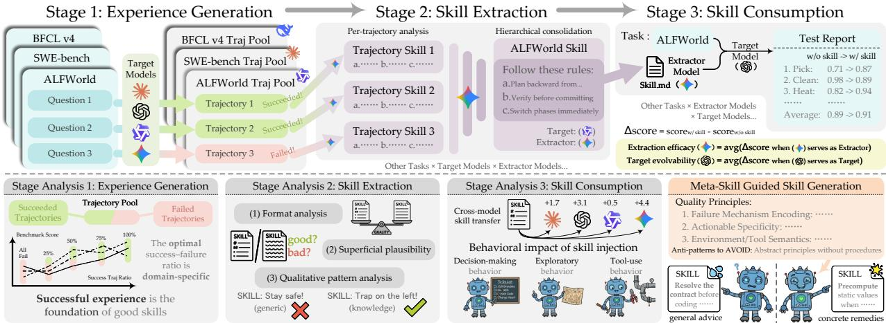
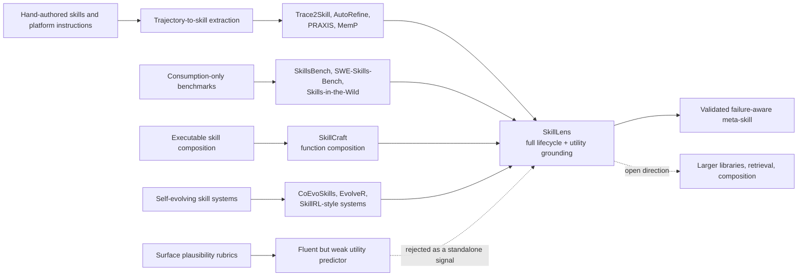
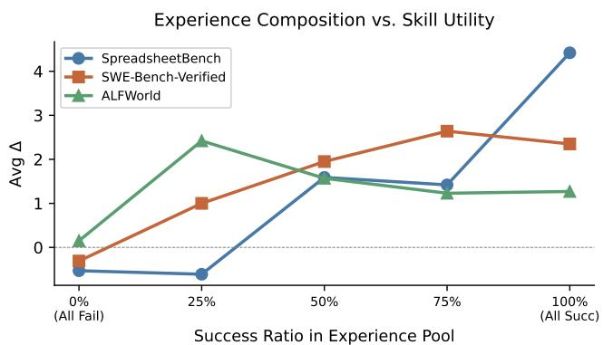
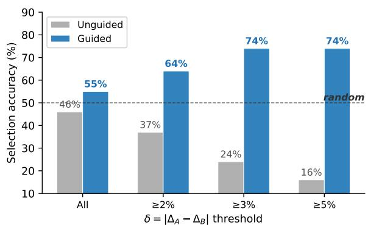
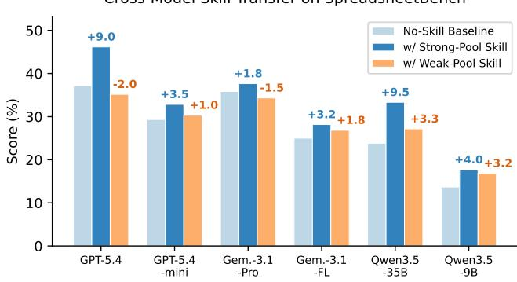
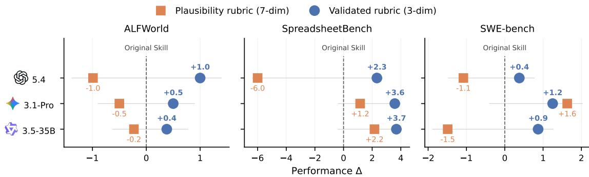

# From Raw Experience to Skill Consumption: Model-Generated Agent Skills

**Paper:** [From Raw Experience to Skill Consumption: A Systematic Study of Model-Generated Agent Skills](https://arxiv.org/abs/2605.23899)  
**Authors:** Zisu Huang, Jingwen Xu, Yifan Yang, Ziyang Gong, Qihao Yang, Muzhao Tian, Xiaohua Wang, Changze Lv, Xuemei Gao, Qi Dai, Bei Liu, Kai Qiu, Xue Yang, Dongdong Chen, Xiaoqing Zheng, Chong Luo  
**arXiv:** [2605.23899v1 (May 2026)](https://arxiv.org/abs/2605.23899)  
**Code:** <https://aka.ms/SkillLens>

**Related pages:** [Agent Evaluation Benchmarks](../index.md) · [EssenceBench](../essencebench/index.md) · [Socratic-SWE](../../../training/fine-tuning/socratic-swe/index.md) · [Pier](../pier/index.md)

## TL;DR

**What:** SkillLens is a utility-grounded study of [agent skills](../../../terms/agent-skill.md) across experience generation, skill extraction, and skill consumption.  
**How:** A target model produces successful and failed trajectories, an extractor turns them into a single structured domain skill, and the same target consumes that skill on a held-out split.  
**The number:** Skills improve 75% of the main extractor-target cases but cause negative transfer in 25%; a three-criterion meta-skill improves all nine tested guidance cells by an average of 1.55 percentage points over the original extractor prompt.

## The Big Picture

*Source: [SkillLens paper, Figure 1](../../../../raw/benchmarks/from-raw-experience-to-skill-consumption--arxiv-2605.23899v1.pdf). ① A target model generates a mixed pool of successful and failed trajectories. ② An extractor analyzes trajectories, consolidates patterns, and writes a schema-conformant skill. ③ The target consumes that skill on unseen tasks, while EE and TE summarize extractor- and target-side effects. ④ Lifecycle analysis produces a validated meta-skill that favors concrete failure mechanisms and remedies.*

The figure answers the central reader question: **where can a reusable skill fail?** It can be missing from the experience pool, distorted during extraction, or unusable for the target that receives it. SkillLens measures all three boundaries instead of treating “skill quality” as a property of text alone.

## Why This Exists

Consider a SpreadsheetBench task that asks an agent to populate formula-dependent output cells. An agent can write formula strings into a workbook and finish without an exception, yet a headless host may never evaluate those formulas; the evaluator then sees stale or empty values. A generic skill saying “resolve the contract and edit carefully” sounds sensible but leaves the failure mechanism intact.

The useful artifact is more specific: compute the final scalar values in Python, locate cells from semantic anchors rather than fixed coordinates, preserve workbook metadata, and reopen the saved file to verify the result. **The paper asks whether model-generated skills reliably preserve this kind of operational knowledge when they are extracted from traces and handed back to an agent.**

## The Landscape

*Editable source: [skilllens-landscape.mmd](assets/skilllens-landscape.mmd). This synthesis places [consumption-only skill benchmarks](../index.md), trajectory extractors, executable composition, and self-evolution systems as sibling lines that SkillLens joins into one controlled lifecycle; the paper’s own rejected path is the assumption that surface plausibility predicts utility.*

## The Core Idea

**A skill is useful only if it changes behavior in the right direction on unseen tasks.** SkillLens therefore treats downstream performance delta—not fluency, format, or model scale—as the ground truth. The practical implication is that the best extractor is the one that writes concrete, target-executable remedies from the target’s own experience, and the best consumer is the one that can absorb those remedies without replacing a robust policy with a brittle one.

## Symbol Map

The paper uses $M$ for a target model and $E$ for an extractor; the same $M$ both generates the experience pool and consumes the resulting skill. $D$ identifies a task domain, while $\Delta$ is always a change in the domain’s task metric measured in percentage points.

| Symbol | Human name | Shape / scope | Plain meaning |
|---|---|---|---|
| $M$ | target model | one model | Generates trajectories and later performs held-out tasks with or without a skill. |
| $E$ | extractor model | one model | Converts trajectories into reusable patterns and a skill. |
| $D$ | domain | one benchmark/task family | ALFWorld, SpreadsheetBench, SWE-bench-Verified, SEAL-0, or BFCL-v4. |
| $\mathcal{T}_{M,D}$ | experience pool | target × domain | Successful and failed training-split trajectories produced by $M$. |
| $\mathcal{S}_{E,M,D}$ | extracted skill | one domain-level artifact | The schema-conformant skill distilled by $E$ from $M$’s pool. |
| $\Delta(E,M,D)$ | skill utility | one extractor-target-domain cell | Held-out performance with the skill minus the no-skill baseline. |
| $\operatorname{EE}(E,D)$ | extraction efficacy | extractor × domain | Mean $\Delta$ across targets: how reliably $E$ produces useful skills. |
| $\operatorname{TE}(M,D)$ | target evolvability | target × domain | Mean $\Delta$ across extractors: how much $M$ benefits from extracted skills. |

## Deep Dive

### The three-stage evaluation contract

**What it does:** It isolates the effect of a domain-level skill by holding the target, domain, task split, and evaluation protocol fixed while varying the extractor.

**Why it matters:** Without this contract, a higher score could come from a different task sample, a better retrieval policy, or extra agent scaffolding rather than from the extracted knowledge.

**How it works:**

| Stage | Input state | Operation | Resulting state |
|---|---|---|---|
| 1. Experience generation | 1:1 generation/test split for domain $D$ | Target $M$ runs the generation split and records successes and failures | $\mathcal{T}_{M,D}$ |
| 2. Skill extraction | Trajectories in $\mathcal{T}_{M,D}$ | $E$ extracts up to three modes per trajectory, merges groups of ten, then synthesizes at most one skill of 3,000 characters | $\mathcal{S}_{E,M,D}$ |
| 3. Skill consumption | The same held-out test split | Inline the single skill in $M$’s system prompt and run three independent evaluation rounds | $\Delta(E,M,D)$ |

The main study uses six target models and five extractors across five domains. Qwen3.5-9B is a target but not an extractor because it could not reliably follow the structured extraction protocol. The metric is:

$$
\Delta(E,M,D)=\operatorname{Perf}(M\mid\mathcal{S}_{E,M,D},Q_D^{\mathrm{test}})-\operatorname{Perf}(M\mid Q_D^{\mathrm{test}}).
$$

**The intuition:** The experiment asks, “Can this extractor turn this target’s own mistakes and successes into advice that the same target can use on a new task?”

**A concrete example:** For the workbook above, the generation pool contains both traces that wrote correct static values and traces that trusted unevaluated formulas. The extractor must preserve the distinction; the test task then reveals whether the target changes its execution policy.

**Remember:** Utility is a held-out behavior change, not a score assigned to the skill document in isolation.

### Experience composition: failures add constraints, successes supply procedures

*Source: [SkillLens paper, Figure 2](../../../../raw/benchmarks/from-raw-experience-to-skill-consumption--arxiv-2605.23899v1.pdf). ① All-failure pools are consistently weak. ② SpreadsheetBench benefits most from success-heavy pools. ③ ALFWorld peaks with a failure-heavy mix. ④ SWE-bench-Verified peaks with mostly successful experience, showing that the best ratio is domain-specific.*

**What it does:** It tests how the success/failure mixture of the experience pool changes the utility of the extracted skill.

**Why it matters:** A pipeline that collects only wins misses constraints and dead ends; a pipeline that collects only failures lacks positive procedures for the consumer to follow.

**How it works:** GPT-5.4-mini extracts skills from pools with success ratios of 0%, 25%, 50%, 75%, and 100%. The resulting skills are evaluated on SpreadsheetBench, SWE-bench-Verified, and ALFWorld with three targets. The source finds that all-failure pools are consistently the worst, while the optimum differs by domain: SpreadsheetBench prefers successful trajectories, SWE-bench-Verified favors a mostly successful mix, and ALFWorld gains useful information from failure-heavy pools because invalid actions and dead-end states are informative.

**The intuition:** Success tells an agent which road works; failure tells it which bridges are out.

**A concrete example:** A successful workbook trace can teach “compute and write static values,” while a failed trace can teach “formula injection does not trigger calculation in this host.” The skill needs both the remedy and the reason the remedy exists.

**Remember:** Successful experience is the foundation, but the right amount of failure evidence depends on the domain’s error structure.

### Extraction efficacy is not executor strength

**What it does:** EE and TE separate the extractor’s ability to produce useful artifacts from the target’s ability to benefit from them.

**Why it matters:** Choosing the strongest task-solving model as the extractor assumes that execution and abstraction are the same capability; the paper’s matrix shows they are not.

**How it works:** For each domain, EE averages $\Delta$ over the six targets for one extractor, while TE averages $\Delta$ over the five extractors for one target.

| Domain | Source-backed contrast from Table 1 | Interpretation |
|---|---|---|
| SpreadsheetBench | Gemini-3.1-Flash-Lite has the highest EE at **+5.86 pp**, while GPT-5.4 is at **+1.67 pp** despite the strongest baseline among the targets. | Extraction quality is not ordered by model scale or baseline accuracy. |
| ALFWorld | GPT-5.4 has TE **+4.93 pp**, while Qwen3.5-9B has TE **−1.69 pp**. | Consumer-side evolvability can reverse within the same domain. |
| SEAL-0 | GPT-5.4-mini has the highest EE at **+4.85 pp**, while Qwen3.5-35B is slightly negative at **−0.12 pp**. | The best extractor can change with the domain. |

**The intuition:** An extractor is a teacher of procedures, not simply a better student at the task.

**A concrete example:** In the workbook scenario, a strong executor may produce a fluent summary of “inspect, normalize, and verify,” while a lighter extractor may notice the decisive host-specific rule that formulas remain unevaluated. The latter can create the more useful skill even if it solves fewer raw tasks.

**Remember:** Select extractors by downstream compatibility, not by leaderboard rank alone.

### Surface form is a poor utility proxy

*Source: [SkillLens paper, Figure 3](../../../../raw/benchmarks/from-raw-experience-to-skill-consumption--arxiv-2605.23899v1.pdf). Gray bars show unguided selection falling from 46% overall to 16% on pairs with at least a 5-point utility gap; blue bars show the stronger guided results in the wider-gap buckets. The paper’s prose and chart disagree on the guided overall value; the discrepancy is recorded in “How to read these numbers.”*

**What it does:** It tests whether a skill’s formatting or textual plausibility can stand in for actual downstream utility.

**Why it matters:** A reviewer may prefer a polished, general document over a terse document containing an obscure but decisive failure remedy—the exact choice that can produce negative transfer.

**How it works:** The authors rewrite the same SpreadsheetBench skills as ordered lists, unordered lists, checklists, and prose. Format has no detectable effect for any target ($p>0.34$ and all $\sigma$-ratios below 1), while changing the extractor has a significant effect for five of six targets ($p<0.005$ and $\sigma$-ratios above 1). Separately, GPT-5.4 judges 151 high-gap skill pairs with nine randomized votes per pair. Unguided selection is 46.4% accurate overall and only 15.8% accurate when the true utility gap is at least 5 percentage points.

**The intuition:** Good-looking advice is not the same as advice that prevents the next concrete error.

**A concrete example:** “Resolve the contract before coding” is plausible but abstract. “Do not inject formulas into a headless workbook; precompute the scalar in Python and verify the saved cell” names the failure mechanism and gives an executable remedy.

**Remember:** Preserve semantic content first; changing the document’s surface format does not make the underlying skill more useful.

### Skill consumption is target-dependent

*Source: [SkillLens paper, Figure 4](../../../../raw/benchmarks/from-raw-experience-to-skill-consumption--arxiv-2605.23899v1.pdf). ① The same strong-pool skill helps every shown target, from +1.8 pp on Gemini-3.1-Pro to +9.5 pp on Qwen3.5-35B. ② The weak-pool skill ranges from −2.0 pp on GPT-5.4 to positive but smaller gains elsewhere. ③ The baseline bars show that transfer is a change relative to each target’s own no-skill score.*

**What it does:** It holds the skill text fixed and measures how differently target models consume it.

**Why it matters:** A skill can be correct yet harmful if it pushes a consumer toward a procedure that the consumer cannot execute reliably.

**How it works:** GPT-5.4-mini extracts two SpreadsheetBench skills: one from GPT-5.4’s strong experience pool and one from Qwen3.5-9B’s weak pool. Both are injected into all six targets. GPT-5.4 tends to shift from writing final formulas toward Python computation, anchor-based addressing, bounded write-back, and post-write checks. Qwen3.5-9B shifts from simpler dataframe-style rewriting toward more workbook-native in-place editing with `openpyxl`; this can preserve structure but also adds execution complexity and can reduce robustness on fine-grained tasks.

**The intuition:** A skill is a policy prior; each model decides how strongly and literally to enact that prior.

**A concrete example:** The static-value rule fixes GPT-5.4’s formula-injection failure because it corrects a strategy choice. The same general “preserve workbook structure” guidance can make Qwen3.5-9B attempt a more complex workflow than it can execute safely.

**Remember:** Skill portability is an empirical property of the consumer, not a guarantee of the skill text.

### Utility-grounded guidance becomes a meta-skill

*Source: [SkillLens paper, Figure 5](../../../../raw/benchmarks/from-raw-experience-to-skill-consumption--arxiv-2605.23899v1.pdf). Orange squares are changes from the original prompt after adding a seven-dimension plausibility rubric; blue circles are changes after adding the three dimensions validated against downstream utility.*

**What it does:** It converts the study’s diagnosis into a generation-time instruction that guides extractors toward utility-bearing content.

**Why it matters:** If an LLM cannot reliably identify a useful skill by reading it, extraction needs a grounded prior that tells the model what evidence to preserve.

**How it works:**

1. A naive seven-dimension rubric asks for clarity, completeness, concision, structure, formatting, tone, and generality. It is plausible but not grounded in observed outcomes.
2. A contrastive pipeline compares 17 high-gap pairs, extracts what distinguishes the higher-utility skill, and consolidates seven candidate dimensions.
3. Pairwise validation retains three dimensions with the strongest utility alignment: **Failure Mechanism Encoding** (65.5%), **Actionable Specificity** (66.0%), and **High-Risk Action Blacklist** (64.6%).
4. The three-dimension rubric is inserted into the extractor’s prompt without changing the extraction pipeline. It improves all nine tested cells by an average of **+1.55 pp**, while the plausibility rubric decreases the average by **−0.59 pp** and hurts six of nine cells.

**The intuition:** Use evaluation outcomes to teach the extractor what “actionable” means, instead of asking it to guess from writing style.

**A concrete example:** The validated guidance favors recording the formula-injection fallacy, dynamic addressing, and index-shifting hazards because each names a failure and a remedy. It does not reward a generic paragraph merely for being orderly.

**Remember:** The meta-skill is a compact, drop-in prior: it changes what the extractor writes, not the surrounding lifecycle machinery.

## Putting It Together

The following trace reuses the workbook example and follows one concrete artifact through the full lifecycle.

| Step | Actor | Input state | Action | Output state |
|---:|---|---|---|---|
| 1 | Target $M$ | Generation split contains workbook tasks; no reusable skill exists | Solve tasks and retain successful and failed traces, including formula-injection failures | $\mathcal{T}_{M,\text{SpreadsheetBench}}$ contains procedures plus constraints |
| 2 | Extractor $E$ | Mixed trajectory pool | Map each trace to up to three modes, reduce groups of ten, and synthesize one schema-conformant skill | A short skill names static-value computation, semantic anchors, preservation, and verification |
| 3 | Target $M$ as consumer | Held-out workbook task; skill absent from baseline prompt | Inline the skill in the system prompt and choose actions under its guidance | The target is more likely to compute in Python and verify saved output rather than trust unevaluated formulas |
| 4 | Target tools and host | Workbook has formulas, merged cells, and shifting rows | Inspect structure, address cells from anchors, mutate only the intended range, and save | The workbook preserves required structure and contains concrete output values |
| 5 | Evaluator | Skill and no-skill runs on the same held-out split | Average three independent runs and subtract the no-skill score | $\Delta(E,M,D)>0$ if the skill’s policy change improves task performance; otherwise it is neutral or negative transfer |

The same trace also explains the paper’s caution: if the consumer cannot execute the more complex workbook-native policy, step 4 can become longer and less reliable even when the extracted instructions are factually sound.

## What This Buys You

### The headline claim

**Model-generated skills are useful on average, but their utility is conditional.** The paper’s strongest practical recommendation is to evaluate skills by held-out behavior and to extract concrete failure-aware remedies rather than optimizing for polished prose.

### How we know: lifecycle and intervention evidence

| Evidence | Source result | What it establishes |
|---|---:|---|
| Main extractor-target matrix | 75% positive, 25% negative-transfer cases | Average benefit hides a material regression risk. |
| Domain sensitivity | 13% negative in SpreadsheetBench and SWE-bench-Verified; 47% in ALFWorld | Skill reliability depends on the task environment. |
| Surface controls | Format $p>0.34$ for every target; extractor effect significant for 5/6 targets | Semantic content matters more than presentation format. |
| Utility-validated meta-skill | −0.59 pp for plausibility guidance versus +1.55 pp for validated guidance; all 9 validated cells improve | Contrastive, outcome-grounded criteria can improve extraction without new infrastructure. |
| Alternative SpreadsheetBench harnesses | +0.4 pp average across a small Claude Code/Codex subset, with substantial variance | The main direction is not obviously an artifact of one scripted harness, but the check is limited. |

### The mechanism behind the numbers

Positive transfer occurs when the skill exposes a domain-specific failure mechanism, supplies an executable countermeasure, and matches a policy the target can carry out. Negative transfer occurs when a weak pool produces generic or misleading advice, or when the target treats a correct but complex procedure as a mandatory replacement for a simpler robust strategy. This is why the paper’s target-side TE and extractor-side EE vary independently.

### ⚠️ How to read these numbers

The paper’s prose reports that validated rubric guidance raises the pairwise judge’s overall accuracy from 46.4% to 73.8%. Figure 3 instead labels the guided **All** bar at 55%, with 64%, 74%, and 74% for the $\delta\geq2$, $\delta\geq3$, and $\delta\geq5$ buckets. Those values are not interchangeable, so this page treats the prose/chart mismatch as an unresolved source inconsistency. Also, all $\Delta$ values are percentage-point changes within a domain-specific held-out split—not universal accuracy gains—and the meta-skill result covers only nine cells.

## Where It Breaks

| Failure mode | When it happens | Impact |
|---|---|---|
| Negative transfer | The extracted skill changes the target’s default policy in a harmful direction; 25% of main cases are negative, rising to 47% in ALFWorld | A reusable artifact can lower task performance while still sounding reasonable. |
| Wrong success/failure mixture | The harvesting policy assumes one optimal ratio across domains | Failure-heavy pools can help ALFWorld but not replace success-heavy evidence in SpreadsheetBench or SWE-bench-Verified. |
| Extractor-target mismatch | The extractor writes advice the consumer cannot execute, or the consumer’s own pool contains weak evidence | EE and TE become poor proxies for one another; the same skill can help one target and hurt another. |
| Surface-quality selection | A reviewer ranks skills by fluency, structure, or generic completeness | Polished but abstract advice can beat concrete remedies in human or LLM judgment while losing on downstream utility. |
| Single-skill prompt setup | A skill is directly inlined into the system prompt rather than retrieved from a large library | The study does not establish behavior under retrieval errors, skill composition, interference, or library-scale selection. |
| Extractor coverage gap | Qwen3.5-9B cannot reliably follow the structured extraction protocol and is excluded as an extractor | Cross-model extractor comparisons are not a fully balanced six-by-six matrix. |
| Evaluation uncertainty | Each condition is averaged over three runs and most experiments use five domains and one fixed protocol | Small deltas may be sensitive to task sampling, provider behavior, and harness details; broader replication is still needed. |
| Unsafe or biased traces | The experience pool contains unsafe shortcuts or systematic errors | Better extraction can make harmful behavior more reusable, a risk the authors identify for larger deployments. |

## One Thing to Remember

**A skill is a tested policy intervention, not a polished summary.** Its value comes from turning the target’s own successes and failures into concrete, executable rules that improve held-out behavior; because both the extractor and consumer shape that change, every skill library needs outcome-based validation and a guard against negative transfer.

## Go Deeper

- **Read:** [From Raw Experience to Skill Consumption](https://arxiv.org/abs/2605.23899)
- **Build on:** [Socratic-SWE’s trace-derived skills](../../../training/fine-tuning/socratic-swe/index.md) · [Trace2Skill](https://arxiv.org/abs/2603.25158) · [SkillsBench](https://arxiv.org/abs/2602.12670)
- **Understand the context:** [Agent Evaluation Benchmarks](../index.md) · [EssenceBench’s fixed benchmark compression](../essencebench/index.md) · [Pier’s agent evaluation harness](../pier/index.md) · [Harbor’s evaluation framework](../../../frameworks/harbor/index.md)
- **Reproduce:** [SkillLens code](https://aka.ms/SkillLens); expect provider API access, benchmark-specific environments, and the paper’s single-skill prompt protocol.
- **Source extraction:** [MinerU Markdown](../../../../derived/pdf-markdown/benchmarks/from-raw-experience-to-skill-consumption/from-raw-experience-to-skill-consumption.md)
- **Editable diagram:** [skilllens-landscape.mmd](assets/skilllens-landscape.mmd)
