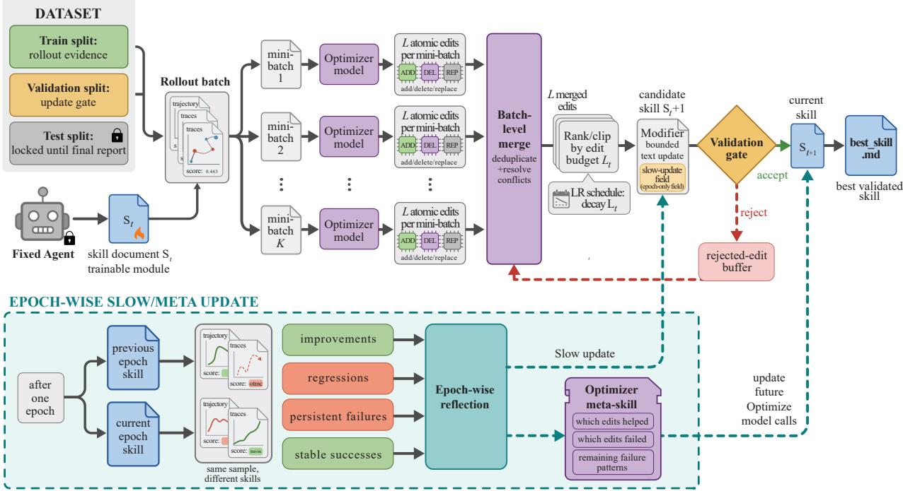
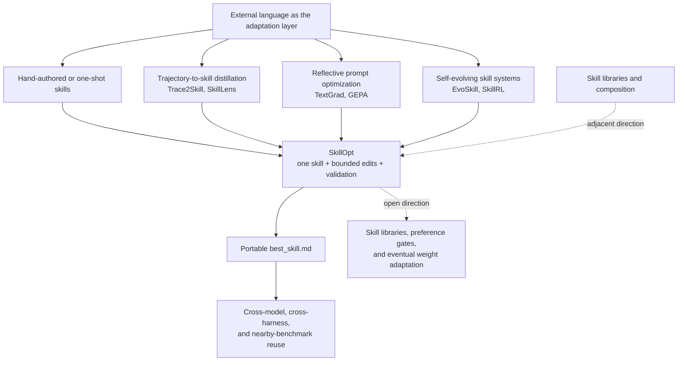
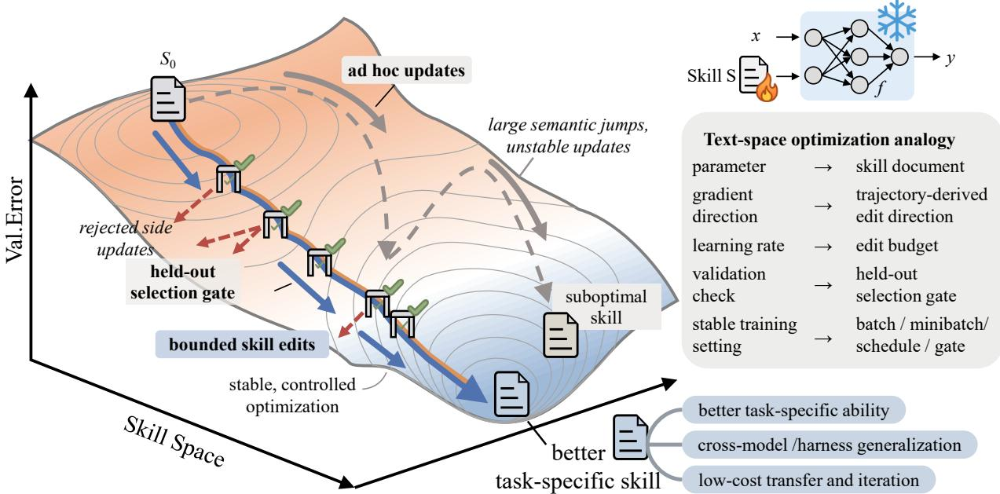
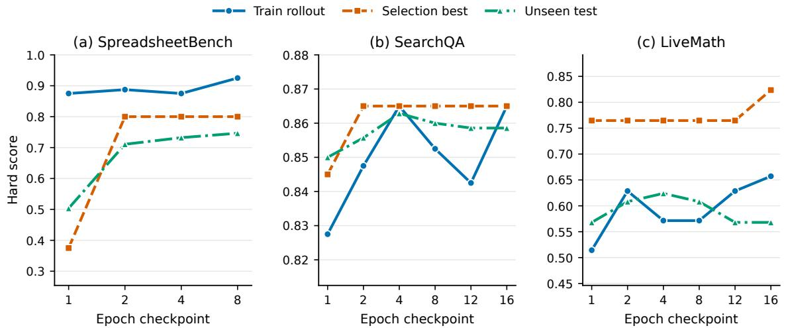
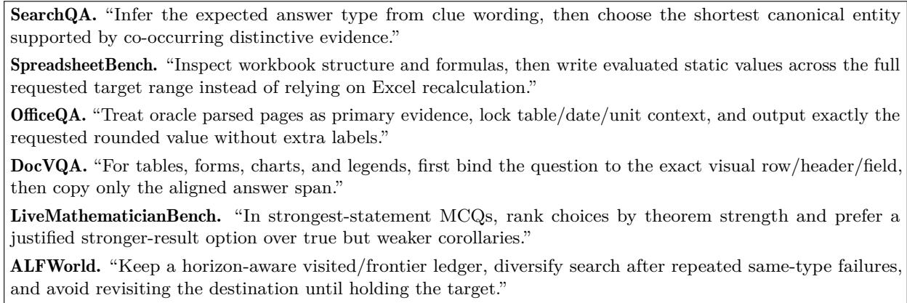

# SkillOpt: Executive Strategy for Self-Evolving Agent Skills

**Paper:** [SkillOpt: Executive Strategy for Self-Evolving Agent Skills](https://arxiv.org/abs/2605.23904v2)  
**Authors:** Yifan Yang, Ziyang Gong, Weiquan Huang, Qihao Yang, Ziwei Zhou, Zisu Huang, Yan Li, Xuemei Gao, Qi Dai, Bei Liu, Kai Qiu, Yuqing Yang, Dongdong Chen, Xue Yang, and Chong Luo  
**arXiv:** [2605.23904v2 (May 25, 2026)](https://arxiv.org/abs/2605.23904v2)  
**Code:** [SkillOpt](https://aka.ms/SkillOpt)

**Related pages:** [Agent Evaluation Benchmarks](../index.md) · [From Raw Experience to Skill Consumption](../skilllens/index.md) · [AutoJudger](../autojudger.md) · [Socratic-SWE](../../../training/fine-tuning/socratic-swe/index.md)

## TL;DR

**What:** SkillOpt makes an [agent skill](../../../terms/agent-skill.md)—a portable procedural document—the external state that is adapted while the target model stays frozen.  
**How:** A separate optimizer model turns scored rollout trajectories into bounded add/delete/replace edits, and a strict held-out validation gate accepts only candidates that improve the current score; rejected edits and epoch-level slow/meta memory stabilize later updates.  
**The number:** Across six benchmarks, seven target models, and three execution harnesses, SkillOpt is best or tied-best in all 52 measured cells; for GPT–5.5 it adds **+23.5 percentage points** in direct chat, **+24.8** in Codex, and **+19.1** in Claude Code over no skill.

## The Big Picture

*Source: [SkillOpt paper, Figure 2](../../../../raw/benchmarks/skillopt-executive-strategy-for-self-evolving-agent-skills--arxiv-2605.23904v2.pdf). ① The fixed target agent runs a rollout batch on the training split. ② The optimizer reflects on failure and success minibatches and proposes atomic edits. ③ A merge/rank stage clips the update to the current edit budget. ④ A candidate skill is accepted only when it improves the validation split; rejected edits return to the buffer, while the locked test split is used only for the final report.*

The pipeline answers the first practical question: **where does improvement happen?** It happens in the text artifact between executions, not in the target model’s weights. The same `best_skill.md` can then be injected into a direct chat, Codex, or Claude Code run without invoking the optimizer at inference time.

## Why This Exists

Consider a SpreadsheetBench task that asks an agent to fill formula-dependent cells. A zero-shot agent may insert an `INDEX/MATCH` or `XLOOKUP` formula into the workbook and finish successfully from the tool’s point of view, while the evaluator reads cached cell values from a host that never recalculates those formulas. The workbook looks edited, but the answer cells remain stale and the task fails.

A generic instruction such as “inspect the workbook carefully and verify your work” is plausible but underspecified. The useful rule is procedural: inspect the workbook structure and formulas, compute the requested scalar values in Python, write evaluated static values across the full target range, preserve unrelated formatting, save, reopen, and check boundary rows and remaining blanks. SkillOpt asks whether such a rule can be discovered from scored traces, added in a small edit, and kept only when it helps unseen tasks.

## The Landscape

*Editable source: [skillopt-landscape.mmd](assets/skillopt-landscape.mmd). The synthesis places [SkillLens](../skilllens/index.md) beside trajectory distillation, [GEPA](https://arxiv.org/abs/2507.19457) and TextGrad beside reflective prompt optimization, and EvoSkill beside broader skill-evolution systems. SkillOpt’s narrower contribution is to train one portable domain skill with explicit update size, validation, and negative-feedback controls.*

## The Core Idea

**Treat the skill document like a small, auditable parameter vector.** Rollouts reveal which procedures are missing, the optimizer proposes a direction for changing the document, the edit budget limits the semantic step size, and held-out validation decides whether the new document survives. This turns “rewrite the instructions until they sound better” into a conservative training loop whose output is still ordinary text.

*Source: [SkillOpt paper, Figure 1](../../../../raw/benchmarks/skillopt-executive-strategy-for-self-evolving-agent-skills--arxiv-2605.23904v2.pdf). The source contrasts unstable ad hoc semantic jumps with a controlled path of bounded edits, and maps parameters, gradient direction, learning rate, and validation to a skill document, edit direction, edit budget, and held-out gate.*

## Symbol Map

The paper uses lowercase symbols for the skill-optimization state and uppercase symbols for the models. A subscript such as `cur`, `best`, `tr`, `sel`, or `test` identifies the current state or dataset role; `t` identifies an optimization step.

| Symbol | Human name | Shape / scope | Plain meaning |
|---|---|---|---|
| $s$ | skill document | one portable text artifact | Natural-language procedure injected into the target agent. |
| $M$ | target model | frozen model | Executes benchmark tasks; its weights never change. |
| $O$ | optimizer model | training-time model | Reads trajectory evidence and proposes or ranks skill edits. |
| $h$ | execution harness | direct chat, Codex, or Claude Code | Injects the skill, runs the task, and returns trajectory plus score. |
| $x$ | task | one benchmark instance | Input given to the target agent. |
| $\tau$ | trajectory | one execution trace | Messages, tool calls, observations, outputs, and verifier feedback. |
| $r$ | task score | scalar in $[0, 1]$ | Native hard-success or exact-match result for one task. |
| $D_{\mathrm{tr}}$ | training split | rollout evidence | Tasks used to collect experience and propose edits. |
| $D_{\mathrm{sel}}$ | selection split | validation gate | Held-out tasks used to accept or reject a candidate skill. |
| $D_{\mathrm{test}}$ | test split | final report | Locked tasks used only after the best skill has been selected. |
| $L_t$ | edit budget | per optimization step | Maximum number of atomic edits allowed at step $t$; the text-space learning-rate analogue. |
| $s_{\mathrm{cur}}$ / $s_{\mathrm{best}}$ | current / best skill | optimizer state | The candidate used for the next rollout versus the highest-scoring accepted version. |
| $B$ | rejected-edit buffer | epoch-local memory | Failed proposals and observed failure patterns supplied to later reflections. |
| $m_{\mathrm{meta}}$ | optimizer meta skill | optimizer-only memory | Longitudinal guidance about what edits helped or hurt; it is not deployed. |

## Deep Dive

### A clean train/selection/test contract

**What it does:** It separates evidence collection, candidate selection, and final reporting so that the optimizer does not train directly on the test score.

**Why it matters:** If the same tasks both generate edits and choose the winner, a skill can memorize local examples while appearing to improve.

**How it works:** For a task $x$, the harness runs the frozen model with skill $s$ and returns a trajectory and score:

$$
(\tau(s), r(s)) = h(M, x, s), \qquad r(s) \in [0,1].
$$

| Split | The optimizer may do | The optimizer must not do |
|---|---|---|
| Training $D_{\mathrm{tr}}$ | Run rollouts, inspect successes and failures, and draft edits. | Treat a single trace as proof that an edit generalizes. |
| Selection $D_{\mathrm{sel}}$ | Score a candidate and accept it only when it is strictly better than the current skill. | Accept a tie or use the test set to decide. |
| Test $D_{\mathrm{test}}$ | Report the final score of $s_{\mathrm{best}}$ once. | Feed the result back into the training loop. |

The implementation also caches scores by skill hash, so revisiting an identical text artifact does not create a new evaluation claim. In the paper’s default dataset-backed protocol, the split is typically 2:1:7 for train, selection, and test; the exact benchmark configuration can override batch sizes and available examples.

**The intuition:** Training discovers a rule, selection asks whether the rule survives unseen examples, and test answers only how well the final rule generalizes.

**A concrete example:** Spreadsheet rollouts expose the formula-cache failure in $D_{\mathrm{tr}}$; a candidate static-value rule must improve a separate workbook set in $D_{\mathrm{sel}}$; the headline SpreadsheetBench score comes from $D_{\mathrm{test}}$, not from the workbook that inspired the edit.

**Remember:** The test split is a locked report, not another source of reflection feedback.

### Reflection turns trajectories into edits

**What it does:** It converts batches of successful and failed executions into reusable add, delete, or replace operations on the current skill.

**Why it matters:** A one-off diagnosis can overfit a single task; repeated patterns across a minibatch are more likely to describe a domain procedure.

**How it works:**

| Stage | Input state | Operation | Output state |
|---:|---|---|---|
| 1 | Rollout batch from the current skill | Record messages, tool calls, observations, outputs, and scores. | Evidence batch of trajectories. |
| 2 | Mixed successes and failures | Partition the evidence by outcome. | Failure group and success group. |
| 3 | Each outcome group | Split into reflection minibatches; the default is size 8. | Several small evidence sets. |
| 4 | One minibatch plus current skill | $O$ identifies common patterns and emits structured edits. | Local failure or success proposals. |
| 5 | All local proposals | Merge failure proposals, merge success proposals, then perform a failure-prioritized merge. | Deduplicated candidate edit pool. |

Failure analysis supplies missing or corrective rules; success analysis records behavior worth preserving. The merge stage filters contradictions and task-specific patches before ranking the pool under $L_t$.

**The intuition:** Failures say which bridge is out; successes show a road that is already safe to keep.

**A concrete example:** Several spreadsheet traces may independently show that formulas remain unevaluated and that the agent stops before filling blank boundary cells. Reflection turns those repeated observations into general rules instead of naming one workbook or one cell coordinate.

**Remember:** The unit of learning is a recurring pattern across trajectories, not the most vivid individual failure.

### Bounded text updates are the learning rate

**What it does:** It limits how far one skill version can move by allowing at most $L_t$ ranked atomic edits at an optimization step.

**Why it matters:** An unrestricted rewrite can erase a working rule, introduce conflicting instructions, or make a local fix look like a new global policy.

**How it works:** The optimizer supports `append`, `insert_after`, `replace`, and `delete` in patch mode, with rewrite-from-suggestions as an alternative. The default protocol runs four epochs with rollout batches of 40, reflection minibatches of 8, an edit budget of 4 that decays by a cosine schedule to a floor of 2, and a held-out gate. Constant, linear, cosine, and autonomous schedules are supported. The slow-update field is protected from step-level edits so fast local changes cannot overwrite epoch-level guidance.

The analogy is intentionally operational: batch size controls evidence noise, the edit budget controls semantic step size, the schedule controls how that step size changes, and the gate supplies validation.

**The intuition:** Small patches let the optimizer remember which direction helped instead of jumping to an unrelated document.

**A concrete example:** If the spreadsheet skill already says to preserve workbook formatting, a new failure should append a static-value verification rule rather than rewrite the entire skill and risk deleting the preservation constraint.

**Remember:** The edit budget is a safety control on meaning, not a limit on the number of tokens in one sentence.

### The validation gate turns reflection into learning

**What it does:** It tests each candidate skill on the selection split and commits it only when the score is strictly greater than the current score.

**Why it matters:** A fluent diagnosis can still make the target model worse; the gate makes behavioral evidence stronger than textual plausibility.

**How it works:**

1. Apply the ranked edit set to produce candidate $\tilde{s}$.
2. Reuse a cached score if the candidate hash has already been evaluated; otherwise run $M$ through $h$ on $D_{\mathrm{sel}}$.
3. If $\operatorname{score}(\tilde{s}) > \operatorname{score}(s_{\mathrm{cur}})$, promote the candidate to $s_{\mathrm{cur}}$; if it also exceeds the historical best, save it as `best_skill.md`.
4. If it ties or loses, leave the current skill unchanged and place the observed failure pattern, proposed edits, and score drop in $B$.

The rejected buffer is training-time negative feedback. Later reflection calls see it and can avoid repeating a harmful edit or revisit an unresolved failure from a different angle. There are no optimizer calls at deployment.

**The intuition:** The optimizer may suggest many ideas, but only a measured improvement earns the right to change the artifact.

**A concrete example:** If “always add a formula” lowers SpreadsheetBench selection accuracy because the host does not recalculate, the candidate is rejected and the failed idea becomes evidence for the later static-value rule.

**Remember:** Strict improvement means ties are rejected, so the skill does not drift merely because a rewrite is different.

### Slow/meta updates preserve long-horizon lessons

**What it does:** It compares the same sampled tasks under adjacent epoch-end skills and records durable improvements, regressions, persistent failures, and stable successes.

**Why it matters:** Step-level reflection sees a narrow batch and can forget a useful rule or repeatedly rediscover a failure after several local edits.

**How it works:** At the end of an epoch, an optimizer model writes longitudinal guidance into a protected slow-update field; that candidate still passes through the selection gate. Separately, $m_{\mathrm{meta}}$ summarizes which edits helped, which were rejected, and which failure patterns remain. The meta skill is prepended to future optimizer prompts for analysis, merging, and ranking, but it is not included in the deployed `best_skill.md`.

The ablation is sharp on SpreadsheetBench: removing both the meta skill and slow update reduces the reported score from 77.5 to 55.0 in the matched component comparison, a 22.5-point drop. Removing only the meta skill reduces it to 75.7, while removing the rejected buffer reduces it to 72.9.

**The intuition:** Fast edits learn today’s mistake; slow memory prevents tomorrow’s edit from undoing yesterday’s progress.

**A concrete example:** If a new workbook rule fixes formulas but causes regressions on formatting-heavy tasks, the adjacent-epoch comparison can preserve the regression warning in optimizer guidance even when the next rollout batch contains no formatting example.

**Remember:** Slow/meta state improves training decisions while remaining separate from the artifact that the target agent consumes.

### One artifact can cross harness boundaries

**What it does:** It uses a lightweight adapter to inject the same skill format into direct chat, Codex, and Claude Code execution loops.

**Why it matters:** A domain procedure should not need to be rediscovered merely because the surrounding tool interface changes.

**How it works:** Each adapter constructs the train/selection/test batches, places the current skill in the target context, runs the native harness, and returns scored trajectories. Direct chat prepends the skill to the system/developer instruction; Codex and Claude Code expose it as persistent workspace guidance alongside task files. The optimizer is offline, so deployment consists of the target model plus a static `best_skill.md`.

**The intuition:** The harness is the vehicle, but the skill is the portable driving rule.

**A concrete example:** A spreadsheet procedure learned in Codex transfers to Claude Code even though the command and file surfaces differ, because the surviving rule emphasizes workbook structure, value materialization, and verification rather than one CLI spelling.

**Remember:** Harness agnosticism is an adapter contract, not a claim that every tool-specific instruction will transfer unchanged.

## Putting It Together

Follow one spreadsheet task from an empty starting skill to deployment:

| Step | Actor | Input state | Action | Output state |
|---:|---|---|---|---|
| 1 | Splitter and target | Initial $s_0$, benchmark tasks | Keep train, selection, and test tasks disjoint; run the frozen target with $s_0$. | Rollout traces and a baseline selection score. |
| 2 | Harness $h$ | Spreadsheet task plus workbook | Target inspects sheets, writes formulas, and returns a score or verifier feedback. | A trace showing the formula-cache or incomplete-range failure. |
| 3 | Reflection workers and $O$ | A minibatch of similar failures and successes | Separate failure from success evidence and propose general static-value, full-range, and reopen-and-check edits. | Structured candidate edits. |
| 4 | Merge/rank stage | Candidate edit pool | Deduplicate conflicts and clip the ranked patch to $L_t$. | Bounded candidate skill $\tilde{s}$. |
| 5 | Selection evaluator | $\tilde{s}$ and $D_{\mathrm{sel}}$ | Run the same target and harness; compare strictly with the current selection score. | Accepted $s_{\mathrm{cur}}$ or unchanged skill plus rejected buffer entry. |
| 6 | Epoch boundary | Previous and current skills on the same sampled tasks | Classify improvements, regressions, persistent failures, and stable successes; validate slow guidance and update $m_{\mathrm{meta}}$. | Longer-horizon optimizer memory, still outside deployment. |
| 7 | Exporter and target harness | Highest-scoring accepted skill | Write `best_skill.md`, then inject it into direct chat, Codex, or Claude Code on locked test tasks. | Final held-out score and a reusable text artifact. |

The important handoff is step 5: reflection proposes a semantic change, but the selection gate—not the optimizer’s confidence—decides whether that change becomes state.

## What This Buys You

### The headline claim

SkillOpt reports unusually broad gains for a no-weight-update method: it is best or tied-best on all 52 measured model/benchmark/harness cells, improves every measured cell over that cell’s no-skill baseline, and beats the strongest per-cell baseline by an average of 5.4 points in the GPT–5.5 direct-chat comparison.

### How we know: held-out benchmark matrix

The clearest direct-chat result is GPT–5.5. Scores below are the paper’s held-out hard scores; gains are absolute percentage points, not relative percentages.

| Benchmark | No skill | SkillOpt | Gain |
|---|---:|---:|---:|
| SearchQA | 77.7 | **87.3** | **+9.6** |
| SpreadsheetBench | 41.8 | **80.7** | **+38.9** |
| OfficeQA | 33.1 | **72.1** | **+39.0** |
| DocVQA | 78.8 | **91.2** | **+12.4** |
| LiveMathematicianBench | 37.6 | **66.9** | **+29.3** |
| ALFWorld | 83.6 | **95.5** | **+11.9** |

The six-benchmark average moves from 58.8 to 82.3, or +23.5 points. The largest gains occur where success depends on procedural discipline—workbook state, exact document evidence, answer formatting, or multi-step action—not where the no-skill model is already near a ceiling.

*Source: [SkillOpt paper, Figure 3](../../../../raw/benchmarks/skillopt-executive-strategy-for-self-evolving-agent-skills--arxiv-2605.23904v2.pdf). The three panels compare training rollout, selection-best, and unseen-test scores across checkpoints for SpreadsheetBench, SearchQA, and LiveMath; the selection curve is the checkpoint-selection signal, while the green curve is the final generalization check.*

### The mechanism behind the numbers

The improvement is not just “more instructions.” The learned rules target recurring execution boundaries: compute values before writing a workbook, bind a document question to the exact visual field, infer the expected answer type before choosing an entity, rank theorem statements by strength, or maintain a visited/frontier ledger in an embodied environment. These are small procedural constraints that a frozen model often knows in principle but fails to apply consistently.

The transfer results support that interpretation, but with smaller and more conditional gains:

| Shift | Reported evidence | What it suggests |
|---|---|---|
| Cross-model | A GPT–5.4 SpreadsheetBench skill adds +9.4 to GPT–5.4-mini and +3.0 to GPT–5.4-nano; a LiveMath skill adds +4.5 and +5.6 respectively. | Some procedures survive model-scale changes. |
| Cross-harness | A Codex-trained SpreadsheetBench skill adds **+59.7** when moved to Claude Code; the reverse transfer adds **+43.6**. | The strongest rules are not merely CLI recipes. |
| Cross-benchmark | An OlympiadBench skill adds +3.7, +1.8, and +1.3 on Omni-MATH for GPT–5.4, GPT–5.4-mini, and GPT–5.4-nano. | Some mathematical procedures survive a nearby task shift. |

### Compact artifact, few accepted edits

The optimizer proposes many changes, but the deployed artifact stays small because only validation-passing edits are committed. In the six GPT–5.5 case studies, final skills range from 379 to 1,995 tokens and require only 1–4 accepted edits.

| Benchmark | Final skill tokens | Accepted edits | Training tokens per test point |
|---|---:|---:|---:|
| SearchQA | 857 | 4 | 37.9M |
| SpreadsheetBench | 1,995 | 4 | 0.6M |
| OfficeQA | 883 | 1 | 1.1M |
| DocVQA | 959 | 3 | 46.4M |
| LiveMath | 379 | 1 | 3.6M |
| ALFWorld | 1,321 | 2 | 15.9M |

*Source: [SkillOpt paper, Figure 4](../../../../raw/benchmarks/skillopt-executive-strategy-for-self-evolving-agent-skills--arxiv-2605.23904v2.pdf). The examples are source-reported excerpts from the final `best_skill.md` files: canonical-entity selection, static spreadsheet values, exact office-document output, visual evidence binding, theorem-strength ranking, and frontier-aware embodied search.*

The cost picture is asymmetric. SpreadsheetBench, OfficeQA, and LiveMath reach a test-point gain with 0.6–3.6 million training tokens per point, while long trajectories or rich multimodal context make SearchQA and DocVQA much more expensive. That cost is paid during offline skill training; using the exported text adds no optimizer calls or weight updates.

### ⚠️ How to read these numbers

The paper reports hard scores on held-out splits, not confidence intervals or a cost-normalized comparison across all baselines. “52/52” means every measured cell in the reported matrix—not every possible model, harness, or task. The transfer table is also deliberately narrow: positive results on nearby models, harnesses, and math benchmarks do not establish safety under a large domain shift. Finally, the validation gate reduces harmful accumulation but cannot rescue a noisy or biased selection signal.

## Where It Breaks

| Failure mode | When it happens | Impact |
|---|---|---|
| No trustworthy reward | The task is open-ended, subjective, multi-dimensional, or expensive to judge, so the selection split cannot provide a reliable scalar gate. | Plausible edits may be accepted or useful edits rejected; human or stronger model evaluation is needed. |
| Offline training cost dominates | The skill is used for one task or one short-lived deployment, so rollout and optimizer calls cannot be amortized. | A no-weight-update method may still be too expensive compared with manual instructions. |
| One skill is too coarse | A domain contains many disjoint procedures that do not fit in one compact artifact. | A single `best_skill.md` can underfit the domain; a library, retrieval, or composition layer is needed. |
| Transfer shift is too large | The target model, harness, answer contract, or benchmark differs more than the tested transfer settings. | Domain-specific heuristics can become irrelevant or harmful even though nearby transfers were positive. |
| Selection signal is noisy *(inference)* | The validation split is small, stochastic, or poorly matched to deployment tasks. | Strict improvement can select a lucky candidate and slow learning, while still providing false confidence. |
| Missing capability is not in the text *(inference)* | The frozen target lacks the knowledge, tool access, or reasoning capacity required by the task. | A skill can organize existing capability but cannot directly add model weights, new tools, or guaranteed factual knowledge. |

## One Thing to Remember

**SkillOpt is “validation-gated SGD for a text artifact.”** A frozen agent supplies scored evidence, a separate optimizer proposes small procedural edits, and only a strict held-out improvement changes the skill; the result is a compact `best_skill.md` that can be audited and reused without paying the optimizer cost at inference time.

## Go Deeper

- **Read:** [SkillOpt on arXiv](https://arxiv.org/abs/2605.23904v2)
- **Build on:** [GEPA](https://arxiv.org/abs/2507.19457) for reflective prompt evolution; [Trace2Skill](https://arxiv.org/abs/2603.25158) for trajectory-local skill distillation; [SkillLens](../skilllens/index.md) for utility-grounded skill extraction and consumption.
- **Understand the context:** [Agent Skill](../../../terms/agent-skill.md), [AutoJudger](../autojudger.md), and [Socratic-SWE](../../../training/fine-tuning/socratic-swe/index.md).
- **Reproduce:** [SkillOpt code](https://aka.ms/SkillOpt); the paper describes the optimizer protocol, benchmark adapters, and prompt contracts, while this page records the reported source results rather than a local rerun.
- **Editable diagram:** [skillopt-landscape.mmd](assets/skillopt-landscape.mmd)
