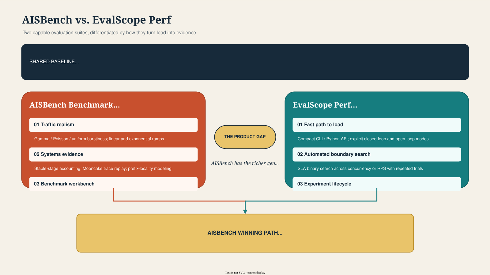

# AISBench Benchmark vs. EvalScope Perf

**Products:** [AISBench Benchmark](https://github.com/AISBench/benchmark) and [EvalScope Perf](https://github.com/modelscope/evalscope)
**Scope:** Service-side inference performance and stress testing, with adjacent accuracy-evaluation capabilities
**Method:** Documentation and repository analysis as of 2026-07-17; no controlled head-to-head runtime experiment was performed

**Related pages:** [EvalScope Perf deep dive](evalscope-perf.md) · [Benchmarks overview](index.md)

## TL;DR

**What:** AISBench and EvalScope overlap on OpenAI-compatible service testing, concurrency/rate control, synthetic and real datasets, multi-turn workloads, TTFT/TPOT/ITL reporting, and accuracy evaluation; neither is merely a thin HTTP load generator.
**How:** AISBench is stronger as an OpenCompass-compatible benchmark workbench with traffic-shape control, explicit steady-state analysis, high-concurrency pressure testing, Mooncake trace replay, and recomputable metric stages, while EvalScope Perf is stronger as an accessible performance product with a compact CLI/Python API, explicit open-loop mode, SLA auto-tuning, broader endpoint types, and integrated experiment storage.
**The number:** The most important result is not a throughput number but a roadmap: AISBench should close four product gaps first—SLA search, a first-class open-loop CLI, embedding/rerank performance paths, and a queryable cross-run result store—while preserving its differentiated traffic and trace capabilities.

## The Competitive Picture

*① Both products share a substantial evaluation and performance-testing baseline. ② AISBench differentiates through traffic realism, stable-state evidence, trace replay, and benchmark composition. ③ EvalScope differentiates through explicit load modes, automated SLA-boundary search, endpoint breadth, and experiment lifecycle. ④ AISBench's winning path is to add the missing controller and result lifecycle without weakening its richer workload generator.*

## Executive Verdict

| Decision dimension | Leader | Why |
|---|---|---|
| First performance test in minutes | EvalScope | Direct `evalscope perf` arguments avoid locating and editing multiple task configuration files |
| Controlled concurrency testing | Tie | Both bound in-flight work and expose concurrency/request-count controls |
| Explicit open-loop rate testing | EvalScope | The mode and its no-backpressure semantics are directly documented and exposed in the CLI |
| Traffic-shape realism | AISBench | Gamma/Poisson/uniform burstiness, linear/exponential ramp-up, expected-vs-actual RPS visualization, and timestamped trace scheduling |
| Automatic capacity boundary discovery | EvalScope | Binary-search SLA auto-tuning over concurrency or request rate |
| Stable-state measurement | AISBench | Dedicated stable-stage summarizer excludes ramp-up/drain portions and documents confidence conditions |
| Trace and prefix-cache workload modeling | AISBench | Mooncake trace support includes timestamps, `hash_ids`, deterministic prompt generation, caching, and time-window selection |
| Endpoint/model-type breadth in perf testing | EvalScope | Text generation, Responses, embedding, rerank, multimodal, local Transformers, and local vLLM are documented under one command |
| Multi-turn performance testing | Tie | Both support multi-turn workloads; EvalScope exposes richer trace/cache-oriented metrics, while AISBench documents ShareGPT/MTBench across vLLM, MindIE, and SGLang |
| Metrics and percentiles | Tie | Both cover the standard vLLM-aligned latency, token, error, and throughput families |
| Post-hoc recomputation | AISBench | Sampling, calculation, and summarization are explicitly decoupled; alternate percentile sets can be recomputed from existing samples |
| Cross-run storage and tracking | EvalScope | SQLite plus WandB, SwanLab, and ClearML integration is more suitable for longitudinal analysis |
| Multi-task benchmark orchestration | AISBench | Model × dataset task composition, parallel task execution, live task UI, and dumped configs favor benchmark campaigns |
| Strategic position | AISBench can lead | Its workload engine is more differentiated, but its capacity-planning and product UX gaps are highly visible |

**Bottom line:** EvalScope currently presents the clearer product for an application or serving team asking “what load can this endpoint sustain?” AISBench is the more distinctive foundation for a systems benchmark lab asking “how does this deployment behave under controlled, steady, bursty, or trace-replayed workloads?”

## Scope and Positioning

### AISBench Benchmark

AISBench is built on OpenCompass and retains compatibility with its configuration system, dataset structure, and model backends while extending service-deployed model evaluation. Its performance path is a scenario within the same model-task × dataset-task × summarizer framework used for broader benchmarking.

This creates two consequences:

- **Strength:** accuracy and performance campaigns can reuse benchmark datasets, prompt construction, model definitions, task orchestration, and result summarization.
- **Cost:** a simple endpoint test requires understanding task names and editing model/dataset configuration files, creating more setup friction than a flag-oriented load-test CLI.

### EvalScope Perf

EvalScope is a one-stop evaluation framework, but `evalscope perf` behaves like a focused sub-product. A user supplies the endpoint, model, concurrency/rate, dataset, and output settings through CLI flags or a Python `Arguments` object.

This also creates two consequences:

- **Strength:** the conceptual path from endpoint to first result is shorter and easier to automate in CI.
- **Cost:** its performance workflow is less visibly coupled to the rich benchmark-task composition that differentiates AISBench.

## Capability Matrix

Legend: **Strong** means first-class and documented; **Partial** means possible but narrower or less explicit; **Not documented** means the reviewed primary sources do not establish support.

| Capability | AISBench Benchmark | EvalScope Perf | Competitive implication |
|---|---|---|---|
| OpenAI chat/completions service | Strong | Strong | Table stakes |
| Streaming metrics | Strong; performance mode requires streaming service APIs | Strong; streaming defaults on and is required for TTFT | Table stakes |
| Non-streaming performance | Not documented in the reviewed performance guide | Strong | EvalScope has a broader basic API path |
| Local model execution in perf command | Offline model backends exist in the wider framework; service perf guide focuses on deployed APIs | Strong: local Transformers and local vLLM | EvalScope has simpler single-machine benchmarking |
| Fixed concurrency | Strong via `batch_size` | Strong via `--parallel` | Parity |
| Fixed request rate | Strong via `request_rate` | Strong via `--rate` | Parity at constant-rate level |
| Explicit open-loop/no backpressure | Behavior is rate-scheduled, including timestamp traffic, but not documented with an equivalent named mode and semantics | Strong via `--open-loop`; concurrency ignored | EvalScope communicates the model more clearly |
| Burst traffic | Strong via burstiness distributions | Poisson arrival documented; arbitrary burst model not documented | AISBench advantage |
| Ramp traffic | Strong: linear and exponential | Multi-rate sweeps; continuous ramp not documented | AISBench advantage |
| Trace replay | Strong: Mooncake timestamps, prefix hash IDs, deterministic generation | Custom datasets and multi-turn traces; timestamp replay not established | AISBench advantage |
| Pressure duration | Strong via `--pressure-time`, up to 24 hours | Strong via `--duration` soft exit | Similar, with different lifecycle semantics |
| Stable-stage calculation | Strong, dedicated summarizer | Warmup exists; equivalent concurrency-plateau windowing not documented | AISBench advantage |
| SLA auto-tuning | Not documented | Strong: binary search, repeats, AND/OR constraints, extrema | Highest-priority AISBench gap |
| Warmup exclusion | API warmup announced; details less central in reviewed guide | Strong via absolute or proportional `--warmup-num` | EvalScope UX advantage |
| Synthetic text/token IDs | Strong: string and token-ID modes with configurable distributions | Strong: random tokenized datasets and target lengths | Parity |
| Real benchmark datasets | Strong through OpenCompass-compatible catalog | Strong through EvalScope datasets | Both broad; ecosystems differ |
| Multimodal performance | Custom multimodal performance support is announced | Strong: random and real VL datasets | EvalScope documentation is easier to discover |
| Embedding performance | Not documented | Strong | EvalScope advantage |
| Rerank performance | Not documented | Strong | EvalScope advantage |
| Multi-turn | Strong: ShareGPT/MTBench; vLLM/MindIE/SGLang | Strong: real/synthetic datasets and trace-level output | Both capable |
| Custom API | New service backends can be added through model/client extension points | First-class custom API guide | Both extensible |
| Custom dataset | Strong through dataset configs and OpenCompass structure | First-class custom dataset guide | Both extensible |
| Multi-task Cartesian campaigns | Strong | General evaluation supports many tasks; perf CLI is primarily one workload configuration/sweep | AISBench advantage |
| Live task monitoring | Strong terminal task dashboard | Progress/log output; comparable task dashboard not established | AISBench advantage |
| Result files | CSV per-request, JSON aggregate, detailed JSON/HDF5, HTML plots, dumped configs/logs | Text/log output and SQLite; detailed persisted records | Different strengths |
| External experiment tracking | Not documented | WandB, SwanLab, ClearML | EvalScope advantage |
| Post-hoc metric recomputation | Strong via `perf_viz --reuse` and calculator/summarizer configuration | Custom result analysis exists; equivalent raw-sample reuse flow not established | AISBench advantage |
| Reported concurrency ceiling | Project states 30,000+ concurrent requests | No comparable published ceiling found | AISBench claim needs reproducible qualification |

## Load Semantics: The Most Important Technical Difference

### Closed loop, open loop, and ramp are not interchangeable

| Model | Question answered | AISBench | EvalScope |
|---|---|---|---|
| Closed loop | “How does the server behave with at most N clients waiting for replies?” | `batch_size` bounds concurrency; pressure mode continuously recycles dataset requests | Default `--parallel`; workers wait for completion before sending again |
| Constant-rate open loop | “What happens when requests arrive at R req/s regardless of backlog?” | `request_rate` schedules request issuance, but documentation does not label or contract an explicit unbounded open-loop mode | `--open-loop --rate R`; no concurrency backpressure |
| Bursty open loop | “What happens when arrivals cluster?” | `burstiness` selects Gamma, Poisson, or low-burst uniform behavior | Poisson timing is documented; configurable Gamma burstiness is not |
| Ramp load | “Where does latency collapse as traffic grows continuously?” | Linear/exponential RPS ramp from start to end | Discrete concurrency/rate sweeps; automatic binary search can find an SLA boundary |
| Trace replay | “What happens with production timing and prefix locality?” | Dataset timestamps plus Mooncake `hash_ids` and prompt generation | Custom workload construction is possible, but equivalent trace scheduling is not documented |

**Interpretation:** AISBench has the richer *traffic generator*. EvalScope has the stronger *capacity-search controller*. These are complementary capabilities, and AISBench should add search above its existing generator rather than replace the generator.

### Stable-state accounting

AISBench defines a stable calculation window from the first request started after observed concurrency reaches the configured maximum through the last interval at maximum concurrency. This explicitly separates ramp-up, stable operation, and drain.

That is valuable but carries a documented validity condition: throughput confidence is considered sufficient only when the maximum single-request end-to-end latency is less than one third of the stable benchmark duration. The tool should surface this condition as a machine-readable validity flag, not leave it as a documentation caveat.

EvalScope instead provides warmup requests that are excluded from metrics, repeated test points for SLA search, and duration-based stopping. These reduce cold-start noise but do not establish the same concurrency-plateau calculation.

## Workloads and Datasets

### AISBench’s defensible differentiation

AISBench’s strongest workload story is not simply “more datasets.” It is the combination of:

1. **Benchmark-native datasets:** reuse of OpenCompass-compatible tasks connects performance measurements to recognizable prompt distributions.
2. **Synthetic control:** random string or token-ID input with configurable input/output distributions.
3. **Traffic control:** burstiness and continuous ramps, with expected-versus-actual RPS plots.
4. **Production trace replay:** Mooncake JSONL timestamps, prefix `hash_ids`, deterministic seeds, generated-prompt caching, and selected time windows.
5. **Post-hoc analysis:** raw timing samples can be recalculated with different percentile summaries.

Together, these support reproducible studies of batching, prefill/decode balance, prefix-cache locality, overload transitions, and steady-state behavior.

### EvalScope’s broader service coverage

EvalScope packages more endpoint-specific performance workloads into the same perf interface:

- Text generation through chat/completions, completions, and Responses APIs.
- Local Transformers and local vLLM execution.
- Synthetic and real vision-language inputs.
- Embedding requests.
- Rerank query-document requests.
- Real and synthetic multi-turn conversations.

For platform teams owning a heterogeneous model gateway, this breadth is a stronger immediate fit than AISBench’s current text-generation-centered performance guide.

## Metrics: Similar Names Do Not Guarantee Comparable Numbers

### Shared core

Both tools report:

- End-to-end latency.
- TTFT.
- TPOT.
- ITL.
- Input and output token counts.
- Request, output-token, and total-token throughput.
- Success/failure counts.
- Average and tail percentile distributions.

AISBench additionally exposes prefill token throughput and a per-request output-token-throughput distribution. EvalScope exposes decode rate, multi-turn trace/cache measures, speculative-decoding measures, and time-oriented workload throughput.

### Metric-contract risks

| Risk | Why results diverge | Required comparison control |
|---|---|---|
| Endpoint/template | Chat templates alter prompt length and preprocessing | Use the same endpoint and exact rendered prompts |
| Tokenizer | Client and server may count tokens differently | Pin tokenizer repository and revision |
| Output termination | EOS creates variable output lengths | Set identical `ignore_eos`, max tokens, seed, and sampling |
| Failed/empty response rules | Success definitions can differ | Compare raw status classification, not only success totals |
| TTFT timestamp | First byte, first SSE chunk, and first decoded token are different | Document and test the event used by each client |
| TPOT denominator | Common definitions use either output tokens or output tokens minus one | Verify formulas against raw samples |
| Benchmark duration | First-send-to-last-finish differs from stable-window duration | Compare total and steady-state throughput separately |
| Arrival process | Closed-loop throughput is not comparable to open-loop offered load | Match scheduler semantics, rate, and concurrency cap |
| Warmup and connection reuse | JIT, KV cache, DNS/TLS, and pools change latency | Align warmup count and HTTP session behavior |
| Client saturation | Generator CPU/event-loop limits can masquerade as server limits | Record achieved RPS, client CPU, lag, and in-flight count |

**Rule:** A head-to-head result is valid only after comparing raw event timestamps and token counts for a one-request case, then validating the load generator’s achieved schedule before increasing concurrency.

## Architecture and Extensibility

| Layer | AISBench | EvalScope Perf |
|---|---|---|
| User configuration | Python/MMEngine task configs selected by CLI aliases | Primarily CLI flags or Python `Arguments` |
| Composition model | Models × datasets × summarizer tasks | Dataset + API protocol + scheduler + result analyzer |
| Request execution | Refactored model/client and inferencer components using multiprocessing plus coroutines | Async performance engine with bounded or open-loop scheduling |
| Extension style | Add model backend, dataset/evaluator, inferencer, or summarizer | Add custom API, dataset, or result analyzer |
| Result pipeline | Sampling → calculation → summarization, explicitly reusable | Run → analyze → persist/visualize |
| Best fit | Reproducible benchmark campaigns and systems research | Endpoint qualification, capacity planning, and experiment tracking |

AISBench’s architecture is more compositional but exposes internal configuration concepts to routine users. EvalScope’s architecture is easier at the surface but still offers extension hooks. The product lesson is to add an opinionated facade over AISBench configs, not discard them.

## User Experience and Operations

### AISBench friction

A first-time user typically must search for model/dataset config paths, edit Python configuration, prepare a dataset in a prescribed location, then invoke performance mode. This is powerful for checked-in benchmark recipes but expensive for an ad-hoc URL test.

The performance guide also states that only streaming service interfaces are supported for service performance, narrowing basic endpoint qualification. Multi-task runs can overwrite results when two selected configs resolve to the same dataset type, which is a correctness and usability hazard.

### EvalScope friction

EvalScope’s large argument surface can create invalid combinations, particularly across closed/open loop, multi-turn, duration, and SLA modes. Its convenience also makes it easy to run an apparently valid but semantically mismatched test—for example, comparing a chat endpoint to a completions endpoint or treating offered request rate as achieved throughput.

Its main operational advantage is result lifecycle: SQLite enables queries across configurations, while WandB/SwanLab/ClearML support remote comparison and collaboration.

## SWOT for AISBench Benchmark

| Strengths | Weaknesses |
|---|---|
| OpenCompass compatibility and benchmark-task reuse | Higher setup cost for a simple URL test |
| Bursty, ramped, steady-state, pressure, and trace-replay workloads | No documented SLA boundary search |
| Mooncake prefix-locality modeling and deterministic prompt caching | No equally explicit open-loop CLI contract |
| Decoupled sampling/calculation/summarization | No documented embedding/rerank perf path |
| Multi-task orchestration and live task dashboard | File-oriented results are weaker for longitudinal queries |
| Documented 30,000+ concurrency support | Ceiling claim lacks a published reproducible client-capacity methodology |

| Opportunities | Threats |
|---|---|
| Become the reference tool for production-trace and cache-aware inference benchmarking | EvalScope can add burst/ramp/trace replay atop its simpler workflow |
| Combine performance and capability in one controlled experiment | Users may standardize on EvalScope because onboarding and automation are easier |
| Standardize metric contracts across vLLM-aligned tools | Similar metric names can hide incompatible formulas and damage trust |
| Turn traffic models into reusable benchmark profiles | Serving frameworks’ native benchmarks may remain the default baseline |
| Publish client-side generator limits and validity checks | High-concurrency claims can be challenged if the generator saturates first |

## Recommended AISBench Roadmap

### P0: Make comparisons trustworthy

| Deliverable | Acceptance criterion | Why first |
|---|---|---|
| Versioned metric specification | Every metric defines start/end events, unit, population, formula, failure inclusion, and duration window | Prevents false parity based on names |
| One-request conformance fixture | Golden SSE stream produces identical expected TTFT/TPOT/ITL/token results in CI | Locks definitions to observable behavior |
| Load-schedule telemetry | Persist target/actual send timestamp, scheduler lag, in-flight count, achieved RPS, and client resource use | Detects generator saturation |
| Machine-readable validity flags | Report unstable window, insufficient samples, failed-request contamination, and client overload | Turns caveats into enforceable quality gates |
| Reproducible competitor harness | Same payload corpus, endpoint, tokenizer, warmup, connections, and output settings for AISBench/EvalScope | Enables credible public comparisons |

### P1: Close the product gaps

| Deliverable | Suggested interface | Competitive outcome |
|---|---|---|
| SLA auto-tuning | `--sla 'p99_ttft<=0.5' --tune request_rate --range 1:1000 --runs 3` | Neutralizes EvalScope’s clearest capacity-planning advantage |
| First-class open-loop mode | `--load-model open --rate 100 --max-in-flight unlimited` | Makes scheduler semantics explicit and testable |
| Simple endpoint facade | `ais_bench perf --url ... --model ... --dataset random --input-len ...` | Preserves configs while matching fast onboarding |
| Embedding/rerank workloads | Dedicated request generators, token/query-document metrics, and examples | Covers heterogeneous inference gateways |
| SQLite/Parquet result store | Stable run/config/request/trace schema with export | Enables cross-run regression analysis |

### P2: Extend the differentiation

| Deliverable | Product value |
|---|---|
| Reusable traffic profiles | Package steady, burst, ramp, Mooncake, and imported-production traces as named, versioned workloads |
| Joint quality-performance mode | Measure accuracy or judge score alongside latency/cost for the same responses |
| Prefix-cache dashboard | Relate `hash_id` reuse distance and cache locality to TTFT, hit rate, and throughput |
| Distributed load generation | Calibrated controller/workers with clock synchronization and aggregate scheduler-lag validation |
| Regression gates | Compare a run against a baseline and fail CI on statistically meaningful SLA/throughput regressions |

### Do not prioritize yet

- Do not copy every EvalScope visualizer before establishing a stable result schema.
- Do not market a larger concurrency number without publishing generator hardware, achieved schedule, client utilization, error rate, and raw reproducibility artifacts.
- Do not add another metric alias until the metric contract and conformance fixtures exist.
- Do not merge accuracy and performance outputs merely at report time; reuse the same request/response records so the quality-latency tradeoff is causal and auditable.

## Proposed Head-to-Head Experiment

### Environment contract

Pin the model, tokenizer revision, serving framework/container, accelerator topology, server flags, dataset artifact hash, client host, network path, Python version, tool commits, and wall-clock synchronization. Run each tool from the same isolated client machine and alternate execution order.

### Workload matrix

| Workload | Input/output | Load points | Primary question |
|---|---|---|---|
| Decode-controlled | 128 / 1024 fixed tokens | C = 1, 8, 32, 128 | Maximum decode throughput and TPOT |
| Prefill-controlled | 8192 / 128 fixed tokens | C = 1, 8, 32 | TTFT and prefill throughput |
| Balanced | 2048 / 512 fixed tokens | C = 1, 16, 64 | General service curve |
| Open-loop | 2048 / 512 | 50%, 80%, 100%, 120% of saturation RPS | Queueing knee and SLA failure |
| Multi-turn | Same ShareGPT traces | 1, 16, 64 concurrent turns | Prefix reuse and trace latency |
| Trace replay | Same timestamped JSONL, if adapters are implemented for both | Original and 2× rate | Production timing and cache locality |

Use at least three measured repetitions after warmup. Prefer confidence intervals and full distributions over selecting the best run.

### Report

For every point, publish:

- Offered and achieved RPS.
- Scheduler-lag distribution.
- Success/error/timeout classification.
- Input/output token distributions.
- Mean, p50, p90, p95, and p99 E2EL/TTFT/TPOT/ITL.
- Request/output/total token throughput.
- Stable-window and whole-run throughput where applicable.
- Client and server CPU, memory, accelerator utilization, and network throughput.
- Raw request-level records and exact commands/config dumps.

The first experiment should test **measurement agreement**, not declare a winner. If the tools disagree beyond a predefined tolerance, diagnose timestamp, tokenizer, scheduler, duration, and connection-pool differences before comparing performance.

## Risks and Caveats

| Risk | Condition | Impact |
|---|---|---|
| Documentation outruns released packages | Comparing latest docs against older PyPI versions | Feature matrix becomes inaccurate; pin commits/releases |
| “Supported” lacks depth | A feature works only for selected backend/dataset combinations | Checkbox comparison overstates parity |
| Client generator bottleneck | High concurrency or sub-millisecond intervals saturate CPU/event loop | Server performance is understated |
| Metric-name parity | Both print TTFT/TPOT but use different event or denominator definitions | Numerical comparison is invalid |
| Stable-stage selection bias | Only plateau requests are reported without whole-run context | Startup/drain costs disappear |
| SLA search noise | Binary search assumes sufficiently monotonic metrics under repeated trials | Boundary can move with jitter and batching |
| Trace portability | AISBench `hash_ids` or generated prompts lack an EvalScope-equivalent adapter | Workloads are not identical |
| Repository activity changes quickly | Both projects are actively adding features | Revalidate before product or procurement decisions |

## One Thing to Remember

**AISBench’s moat is workload fidelity; EvalScope’s advantage is productized capacity planning.** AISBench should keep its steady-state, burst/ramp, trace, and recomputation strengths, then add a simpler facade, explicit open-loop semantics, SLA search, broader endpoint workloads, and a queryable result model.

## Go Deeper

- **AISBench performance guide:** [Service performance evaluation](https://ais-bench-benchmark.readthedocs.io/zh-cn/latest/base_tutorials/scenes_intro/performance_benchmark.html)
- **AISBench advanced traffic:** [RPS distribution control](https://ais-bench-benchmark.readthedocs.io/zh-cn/latest/advanced_tutorials/rps_distribution.html) and [stable-stage testing](https://ais-bench-benchmark.readthedocs.io/zh-cn/latest/advanced_tutorials/stable_stage.html)
- **AISBench code:** [AISBench/benchmark](https://github.com/AISBench/benchmark)
- **EvalScope stress testing:** [Model inference performance testing](https://evalscope.readthedocs.io/zh-cn/latest/user_guides/stress_test/)
- **EvalScope code:** [modelscope/evalscope](https://github.com/modelscope/evalscope)
- **Internal context:** [EvalScope Perf deep dive](evalscope-perf.md)
