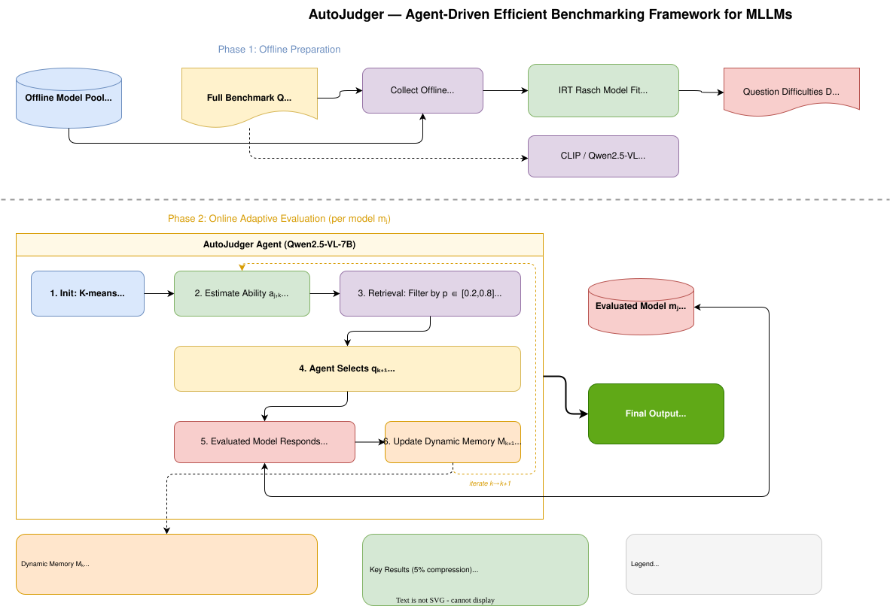
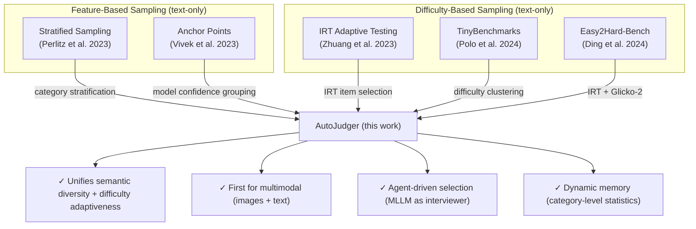

# AutoJudger: Agent-Driven Efficient MLLM Benchmarking

**Paper:** AutoJudger: An Agent-Driven Framework for Efficient Benchmarking of MLLMs
**Authors:** Xuanwen Ding, Chengjun Pan, Zejun Li, Jiwen Zhang, Siyuan Wang, Zhongyu Wei (Fudan University, USC)
**arXiv:** [2505.21389](https://arxiv.org/abs/2505.21389), May 2025
**Related pages:** [benchmarks index](./), [MMMU](./), [SEED-Bench](./)

## TL;DR

**What:** AutoJudger treats MLLM evaluation as an **adaptive interview** — an MLLM-powered agent iteratively selects the single most informative next question based on real-time model performance, replacing static random sampling.

**How:** Item Response Theory (IRT) estimates per-question difficulties offline from 60 reference models; during evaluation, a semantic-aware retrieval module filters candidates by difficulty-fit ($p \in [0.2, 0.8]$) and max-min diversity, then an agent (Qwen2.5-VL-7B) reasons across dynamic memory, ability estimate, candidates, and difficulties to pick the next question.

**The number:** AutoJudger achieves **92.06% ranking accuracy on MMT-Bench using only 5% of the data** (125 out of 31K+ questions), and reaches over 90% with just 4% — a ~25× cost reduction while preserving ranking fidelity. On AI2D it hits 94.85%.

## The Big Picture

*① **Offline Phase (once per benchmark):** 60 reference MLLMs evaluated on full benchmark → IRT Rasch model (variational Bayesian inference) estimates per-question difficulties $d_i$. CLIP ViT-B/32 encodes all questions into semantic embeddings. ② **Online Phase (per evaluated model):** K-means initialization from 10 clusters → estimate current ability $a_{j,k}$ via MLE + binary search → retrieve top-5 candidates filtered by $p \in [0.2, 0.8]$ and max-min semantic distance → agent selects next question → model responds → update dynamic memory table with category-level statistics. ③ Loop until budget $\delta \times |Q|$ exhausted. ④ Output: model ranking with high fidelity at fraction of the cost.*

## Why This Exists

Imagine you need to rank 17 MLLMs on MMT-Bench. The full benchmark has **31K+ questions** spanning 32 meta-tasks and 162 subtasks — from autonomous driving to embodied navigation to medical diagnosis. Each question includes an image, making input sequences far longer than text-only benchmarks. Running all 17 models through the full set costs **thousands of GPU-hours** and, when proprietary judge models like GPT-4o are used for scoring, hundreds of dollars in API fees.

Now ask: *do you really need to test every model on "How many chairs are in this image?"* A GPT-4o-level model will ace that question every time — it teaches you nothing about how it differs from Gemini Pro. But a weaker model like Janus-1.3B might still struggle. **The same question has zero information value for one model and high diagnostic value for another.**

Static sampling — picking the same subset for everyone — wastes compute on non-informative questions for strong models while potentially skipping the hard questions that actually separate top performers. Three concrete pain points:

| Problem | Consequence | AutoJudger's Answer |
|---------|-------------|---------------------|
| Benchmarks are massive (31K+ questions) | Evaluation costs grow linearly with model count | Adaptive subset selection ($\leq$ 5% of data) |
| Questions are semantically redundant | Wasted compute on near-duplicate questions | Semantic diversity via max-min retrieval |
| Large performance variance across models | Easy questions add zero info for strong models | IRT-gated difficulty matching per model |

We'll reuse this MMT-Bench ranking scenario throughout the page to see how each mechanism contributes.

## The Landscape

Prior work on efficient benchmarking splits into two parallel branches — feature-based sampling and difficulty-based sampling — both designed for text-only LLM benchmarks. AutoJudger is the first to unify them and the first designed for multimodal evaluation.

Multimodal benchmarks add three challenges that text-only methods don't address: (i) most multimodal benchmarks lack explicit difficulty labels, (ii) each image-question pair carries rich cross-modal semantics that coarse category labels miss, and (iii) performance variance across MLLMs is far wider than across text-only LLMs, making personalized question selection more impactful.

## The Core Idea

**AutoJudger frames benchmark evaluation as a dynamic interview.** Instead of pre-selecting a fixed subset of questions, an MLLM-powered interviewer agent continuously interacts with the evaluated model: it estimates the model's current ability from past answers, retrieves candidate questions that are neither too easy nor too hard, reasons about which question would reveal the most new information given what it already knows, asks that question, records the response, and updates its memory — repeating until the evaluation budget is spent. The key insight is that **question selection is a sequential decision-making problem under uncertainty**, and an MLLM agent with access to IRT-calibrated difficulties, semantic embeddings, and a running memory of category-level performance can make far better decisions than any static heuristic.

## Deep Dive

### IRT Difficulty Estimation

**What it does:** Before any evaluation begins, AutoJudger estimates a single difficulty score $d_i$ for every question in the benchmark using a one-parameter logistic (Rasch) Item Response Theory model fit via variational Bayesian inference.

**Why it matters:** Without difficulty labels, the agent is blind — it can't know whether a question is trivially easy for GPT-4o or impossibly hard for a 2B model. IRT separates question difficulty from model ability, unlike raw accuracy which conflates the two.

**How it works:**

| Step | Detail |
|------|--------|
| Collect | 60 offline MLLMs (disjoint from 17 test models) evaluated on full benchmark → binary response matrix $\{r_{ij}\}$ |
| Model | $p(\text{correct}) = \frac{1}{1 + e^{-(a_j - d_i)}}$ — probability depends on the gap between ability and difficulty |
| Priors | $p(a_j) = \mathcal{N}(0,1)$, $p(d_i) = \mathcal{N}(0,10^3)$ — vague priors reflecting minimal prior knowledge |
| Inference | Variational Bayesian: factorized Gaussian posteriors, ELBO optimized via reparameterization trick |
| Training | Adam, lr=0.1, 3,200 steps, mini-batch SGD; stops when $\Delta$ELBO $< 10^{-4}$ |
| Output | Fixed difficulty vector $\{d_i\}$ (variational means) used as prior for all subsequent evaluations |

**The intuition:** IRT models the probability a model answers correctly as a function of the *gap* between its ability and the question's difficulty. A question with $d = 2.0$ is hard regardless of who answers it — this is exactly how the GRE and SAT calibrate test items. Once estimated, these difficulties are reused forever.

**A concrete example:** On MMT-Bench, a visual reasoning question about a mechanical brake system has $d = -0.42$ (moderately easy), while a children's book illustration question ("counterpoint" in Rosie's Walk) has $d = -2.18$ — far easier. Without IRT, the agent might treat both as equally informative for a model scoring 60% overall. With IRT, it knows the brake-system question is diagnostic while the children's book question is a waste of budget for most models.

**Remember:** IRT difficulties are estimated once per benchmark and reused for all future evaluations — this is the only offline cost. Periodically re-estimate with stronger models as the field advances.

### Real-Time Ability Estimation

**What it does:** At each iteration $k$, AutoJudger estimates the evaluated model's current ability $a_{j,k}$ from its responses to the $k$ questions asked so far.

**Why it matters:** The ability estimate is the compass that guides all subsequent question selection — it determines which questions fall in the "just right" difficulty zone ($p \in [0.2, 0.8]$).

**How it works:** Maximum likelihood estimation using the Rasch model with question difficulties $\{d_i\}$ held fixed. A binary search over $[-30, 30]$ efficiently finds the optimum $a_{j,k}$, stopping when the log-likelihood change falls below $10^{-5}$. Initial ability is seeded by assuming the model answered 2.5/5 medium-difficulty questions correctly.

**The intuition:** After 10 questions, if a model got 8 right and they were all moderate difficulty ($d \approx 0$), its estimated ability is high ($a > 0$). If it got 2 right and they were easy ($d < -2$), the estimate drops low. The binary search efficiently zeroes in on the ability value that makes the observed response pattern most likely.

**A concrete example:** When evaluating MiniCPM-V-2 on MMMU, the ability estimate starts near 0, then drifts down as the model struggles with moderate-difficulty questions. AutoJudger's question selection adapts in lockstep: as the estimate drops, the retrieval module starts pulling easier candidates, keeping the success probability in the informative [0.2, 0.8] zone.

**Remember:** Ability estimation and question selection form a feedback loop — better question selection yields sharper ability estimates, which in turn enables better question selection. This is the core dynamic that static methods lack.

### Candidate Question Retrieval

**What it does:** Given the full benchmark $Q$ (too large for the agent to process directly), this module produces a compact candidate set $\mathcal{C}^*_k$ of 5 questions that are both difficulty-appropriate and semantically diverse relative to previously asked questions.

**Why it matters:** Without retrieval, the agent would drown in the full pool. With naive retrieval (e.g., just filtering by difficulty), questions could be semantically redundant. The two-stage filter — difficulty gating, then max-min diversity — ensures the agent sees a high-quality shortlist.

**How it works:**

| Stage | Operation | Detail |
|-------|-----------|--------|
| Initialization | K-means clustering ($k=10$) on CLIP embeddings → sample one question per cluster | Ensures broad semantic coverage from the start; repeated 50×, best retained |
| Filter 1: Difficulty gate | Retain only questions where $p \in [0.2, 0.8]$ under current ability $a_{j,k}$ | Eliminates questions too easy or too hard to be informative |
| Filter 2: Max-min diversity | For each filtered candidate $q$, compute $\min_{q' \in Q'_k} \text{dist}(q, q')$ → keep top-5 | Guarantees each selected candidate is maximally distant from all previously asked questions |

**The intuition:** Think of it as a funnel. The full benchmark (31K questions) → difficulty-filtered set (questions the model has a 20–80% chance of getting right) → top-5 most semantically novel questions. The agent only sees 5 options, but they're the 5 best options given everything known so far.

**A concrete example:** After 30 questions evaluating a mid-tier model on MMT-Bench, the retrieval module might return: (1) a mechanical engineering problem with brake torque calculation ($d = -0.42$), (2) an epidemiology contact-structure question ($d = -0.40$), (3) a Laplace transform problem ($d = 0.23$), (4) a children's literature question ($d = -2.18$, near the edge of the difficulty filter), and (5) a torsional spring constant derivation ($d = 0.11$). They span engineering, biology, math, and literature — maximizing diagnostic coverage.

**Remember:** The max-min diversity criterion is what makes the candidate set *semantically broad*. Without it, the module might return five nearly identical brake-system problems, wasting the agent's decision budget.

### Agent-Driven Question Selection

**What it does:** The interviewer agent (powered by Qwen2.5-VL-7B-Instruct) receives the candidate set $\mathcal{C}^*_k$, the current memory table $\mathcal{M}_k$, the estimated ability $a_{j,k}$, and candidate difficulties $D^*_k$ — then reasons about all four inputs to **select the single most informative next question**.

**Why it matters:** This is the core novelty and the biggest ablation impact. Removing the agent (`w/o agent`) drops MMT-Bench ranking accuracy from **93.38% to 86.62%** — a 6.76 percentage point drop. The agent's multimodal understanding captures fine-grained question semantics that pure embedding distances miss.

**How it works:**

| Input to agent | What it provides |
|----------------|------------------|
| Memory $\mathcal{M}_k$ | Category-level table: Count, Max/Min/Avg Difficulty, Accuracy per topic |
| Ability $a_{j,k}$ | Current IRT estimate of model proficiency |
| Candidates $\mathcal{C}^*_k$ | 5 questions with full image+text content |
| Difficulties $D^*_k$ | IRT difficulty for each candidate |

The agent is prompted to: (1) summarize patterns in the history, (2) identify underrepresented or problematic categories, (3) balance difficulty alignment against semantic novelty, and (4) output a JSON selection with reasoning. The full prompt is in Appendix F of the paper.

**The intuition:** The retrieval module gives the agent a shortlist. The agent applies *judgment* — it might notice that the model has been hammered on physics questions and struggling, so it picks a biology question at the same difficulty to test whether the weakness is domain-specific or general. A heuristic can't do this; an MLLM can.

**A concrete example:** In the MMMU case study (Figure 8 in the paper), the agent observes from memory that the model has low accuracy on engineering questions. It sees a brake-torque problem (engineering, $d = -0.42$) and a children's literature question (humanities, $d = -2.18$). Rather than picking the closest difficulty match, the agent selects the engineering problem to gather more evidence about whether the model's weakness is domain-specific — demonstrating reasoning that goes beyond simple difficulty matching.

**Remember:** The agent is the "brain" of AutoJudger. The other components (IRT, retrieval, memory) are its "senses." Removing the agent is like removing the interviewer from an interview — you're left with a generic test that can't adapt.

### Dynamic Memory

**What it does:** A markdown table that accumulates **category-level statistics** about all questions asked so far, with categories dynamically inferred by the agent from semantic features rather than relying on (often missing or noisy) benchmark labels.

**Why it matters:** Without memory, the agent over-relies on ability-difficulty matching, selecting questions whose difficulty is closest to the current ability estimate. The average ability-difficulty distance drops significantly, and semantic diversity suffers (see Figure 5 in the paper). Memory provides the global view needed for balanced coverage.

**How it works:**

| Category | Count | MaxDiff | MinDiff | AvgDiff | Accuracy |
|----------|-------|---------|---------|---------|----------|
| Art History | 20 | 1.01 | -5.20 | -0.83 | 0.71 |
| Cell Biology | 14 | 4.90 | -2.44 | -0.70 | 0.50 |
| Accounting | 5 | 5.21 | -1.02 | 1.15 | 0.60 |

Categories are assigned by prompting the agent to classify each new question, with new categories added dynamically as unseen topics appear. The table tracks: question count, difficulty range (max/min/average), and accuracy per category.

**The intuition:** The memory table is the agent's "notes" from the interview so far. It lets the agent notice patterns like "we've asked 20 Art History questions but only 5 Accounting questions — and the model is struggling with Accounting. Let's probe that weakness more."

**A concrete example:** After 40 questions evaluating a model on MMMU, the memory shows Art History has 20 questions with 71% accuracy (covered enough, performing fine), while Accounting has only 5 questions at 60% accuracy (under-sampled, uncertain). The agent prioritizes Accounting candidates in the next selection round.

**Remember:** Memory transforms AutoJudger from a greedy difficulty-matcher into a globally-aware interviewer. Ablation shows removing it drops MMT-Bench accuracy from 93.38% to 89.71%.

## Putting It Together

Here is how all mechanisms interact in a single evaluation of MiniCPM-V-2 ($\sim$3B params) on MMMU ($\sim$900 questions, 5% budget = ~45 questions):

1. **Offline prep (already done):** IRT difficulties $\{d_i\}$ estimated from 60 reference models. CLIP embeddings computed for all 900 questions.
2. **Init (questions 1–10):** K-means ($k=10$) on CLIP text embeddings → sample 1 question per cluster. Ask all 10, collect responses. Initialize memory table with inferred categories.
3. **Estimate (iteration 1):** Binary search MLE yields $a_{j,1} \approx -0.5$ — the model is below average.
4. **Retrieve (iteration 1):** Filter 900 questions to those with $p \in [0.2, 0.8]$ given $a=-0.5$. Apply max-min diversity → top-5 candidates: a brake-torque problem, an epidemiology question, a Laplace transform, a children's lit question, and a torsional spring problem.
5. **Agent selects (iteration 1):** Memory shows 2 engineering questions so far, 0 epidemiology. Agent picks the epidemiology contact-structure question ($d = -0.40$) to broaden coverage.
6. **Evaluate:** MiniCPM-V-2 answers. Gets it wrong.
7. **Update:** Memory updated — Epidemiology: count=1, accuracy=0.00. Ability re-estimated with the new wrong answer → $a_{j,2} \approx -0.7$.
8. **Repeat (iterations 2–35):** Each iteration tightens the ability estimate and diversifies category coverage. By question 20, the ability estimate has stabilized. By question 45, the agent has covered ~15 distinct categories with balanced sampling.
9. **Final output:** $a_{j,45}$ is the final ability estimate. Across all 17 test models, these estimates produce a ranking that is ~88% consistent with the full-benchmark ranking — using only 5% of the data.

## What This Buys You

### The headline claim

AutoJudger achieves ranking accuracy on par with or exceeding all static baselines across four benchmarks, while using **only 5% of the data** and exhibiting **significantly lower variance** (narrower confidence intervals).

### How we know

| Benchmark | Random | Stratified | IRT-only | **AutoJudger** | $\Delta$ vs best baseline |
|-----------|--------|------------|----------|----------------|--------------------------|
| AI2D | 93.82 ±3.71 | 93.97 ±3.08 | 89.71 | **94.85** ±0.00 | +0.88 |
| MMMU | 81.47 ±6.28 | 84.26 ±6.22 | 82.35 | **87.94** ±0.71 | +3.68 |
| MMT-Bench | 85.88 ±6.14 | 84.12 ±6.61 | 88.24 | **92.06** ±1.41 | +3.82 |
| SEEDBench | 92.65 ±4.74 | 90.88 ±3.82 | 91.91 | 90.74 ±0.71 | −1.17 |

All at 5% compression. AutoJudger dominates on complex benchmarks (MMMU, MMT-Bench). On SEEDBench, the dataset is ~4× larger than the others, so even 5% is already enough data for baselines to converge. Below a 1% compression rate on SEEDBench, AutoJudger's advantage becomes prominent (86.40% vs. 78.68% for the next best baseline).

**Ablation insights (MMT-Bench, 5% compression):**

| Variant | Ranking Accuracy | Drop |
|---------|:---:|:---:|
| Full AutoJudger | 93.38% | — |
| Without agent (`w/o agent`) | 86.62% | −6.76 pp |
| Without memory (`w/o memory`) | 89.71% | −3.67 pp |
| Without vision (`w/o visual`) | 91.18% | −2.20 pp |

### The mechanism behind the numbers

AutoJudger wins for three reasons:

1. **Adaptive difficulty matching.** Static methods waste budget on questions the model either always gets right or always gets wrong. AutoJudger keeps questions in the $p \in [0.2, 0.8]$ sweet spot where every answer provides information.
2. **Semantic diversity.** Random and stratified sampling can accidentally cluster on similar questions. Max-min retrieval guarantees broad coverage. The average semantic distance between AutoJudger-selected questions is **15–25% higher** than baselines across all benchmarks.
3. **Low variance.** Stochastic baselines have confidence intervals of ±3–6 percentage points — a single random seed can swing results meaningfully. AutoJudger's adaptive strategy produces intervals of ±0–1.4 points, making it far more reliable for one-shot evaluations.

### ⚠️ How to read these numbers

- **Ranking accuracy is NOT per-question accuracy.** 92.06% ranking accuracy means that when comparing any two models, the relative ordering produced by AutoJudger matches the full-benchmark ordering 92% of the time. It says nothing about whether individual question answers are correct.
- **The IRT-only baseline underperforms on MMMU because it's purely difficulty-driven.** It ignores semantic diversity and has no memory — it keeps picking questions at the same difficulty from the same narrow region of the embedding space. AutoJudger's agent + memory fixes this.
- **SEEDBench is an outlier** because at 5% compression, you're already sampling ~950 questions — enough for random sampling to converge. The real test is below 1%, where AutoJudger leads by 7+ points.

## Where It Breaks

| Failure mode | When it happens | Impact |
|---|---|---|
| Difficulty estimate drift | As MLLMs improve, previously "hard" questions ($d \gg 0$) become easier — the IRT calibration ages | Selected questions become too easy; ability estimates inflate; ranking degrades |
| Weak judger agent | Using a 7B agent to evaluate a 70B+ model -- the agent may misunderstand question semantics or misjudge difficulty appropriateness | Selection quality degrades; ranking accuracy drops 3–5 points (see 7B vs 32B scaling) |
| Sparse offline data | If the 60 reference models are too similar in capability or don't cover the difficulty spectrum | IRT estimates become noisy; difficulty gating selects wrong questions |
| Very small benchmarks | If $\lvert Q \rvert < 200$, the retrieval module has too few candidates to maintain diversity after difficulty filtering | Max-min diversity degenerates; AutoJudger reduces to IRT-only behavior |
| Unseen modalities or task types | Questions in formats not present in the offline training data (e.g., video, audio) | CLIP embeddings and IRT difficulties are uncalibrated; agent has no reference frame |
| High compression on easy benchmarks | On simple benchmarks like AI2D where most questions are easy, difficulty gating collapses the candidate pool | AutoJudger overfits to the narrow informative band; ranking accuracy plateaus early |

**Mitigation:** The paper recommends periodically re-estimating IRT difficulties with stronger, up-to-date models. For the judger agent, scaling to 32B (Qwen2.5-VL-32B) improves ranking accuracy by 3.3% at 0.2% compression on SEEDBench — suggesting the framework benefits from stronger agents.

## One Thing to Remember

AutoJudger proves that **evaluating MLLMs is a sequential decision-making problem, not a static sampling problem** — and treating it as an adaptive interview with an MLLM-powered agent, IRT-calibrated difficulty estimates, and category-level memory can compress benchmark evaluation by 25× while preserving ranking fidelity. The agent is the brain; IRT, retrieval, and memory are its senses. Remove any one and the system degrades, but removing the agent hurts most.

## Go Deeper

- **Read:** [arXiv 2505.21389](https://arxiv.org/abs/2505.21389)
- **Code:** [github.com/IMNearth/AutoJudger](https://github.com/IMNearth/AutoJudger)
- **Build on:** [Easy2Hard-Bench](https://arxiv.org/abs/2312.10008) (IRT + Glicko-2 difficulty estimation), [TinyBenchmarks](https://arxiv.org/abs/2402.14992) (difficulty-clustered efficient evaluation), [Anchor Points](https://arxiv.org/abs/2309.08638) (model-confidence-based question selection)
- **Understand the context:** [benchmarks index](./), [MMMU](./), [SEED-Bench](./)
- **Reproduce:** Code available at time of writing; uses VLMEvalKit for standardized evaluation; requires 8× RTX 4090 GPUs for full reproduction
