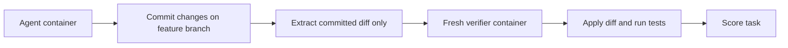

# DeepSWE v1.1: Execution and Scoring Changes

**Benchmark site:** DeepSWE v1.1
**Authors:** Wenqi Huang, Peter Jiang
**Updated benchmark snapshot:** July 1, 2026
**Code / benchmark:** <https://github.com/datacurve-ai/deep-swe>

**Related pages:** [DeepSWE: Long-Horizon Software Engineering Benchmark](../deepswe/index.md), [τ-bench: Tool-Agent-User Interaction Benchmark](../tau-bench.md)

## Summary

DeepSWE v1.1 keeps the same 113 long-horizon tasks as v1, but changes how agent outputs are executed, isolated, and graded. The core idea is to score only the agent's **committed patch** inside a fresh verifier container, which makes the benchmark easier to reproduce, harder to game, and easier to analyze at the individual-test level. Despite these infrastructure changes, the source says aggregate pass rates and broad model ordering stay close to v1.

## Visual Explainer

The diagram below summarizes why DeepSWE v1.1 was introduced, how the committed-diff scoring path works, and why the source treats the updated results as a cleaner measurement rather than a new benchmark.

## What Stayed the Same

- The benchmark still uses the same **113 tasks**.
- The long-horizon task design and general benchmark objective are unchanged from [DeepSWE v1](../deepswe/index.md).
- The source claims top-level ordering remains broadly similar to v1 even after the execution and scoring changes.

## Main v1.1 Changes

The source describes three primary execution and grading updates.

### 1. Isolated verification from the committed diff

In v1.1, the agent works in its own container, commits its changes, and the benchmark extracts the resulting git diff. Verification then happens in a **separate fresh container** that applies only that diff and runs the tests.

This means the score depends on the submitted patch itself, not on runtime modifications left behind in the agent's working environment.

### 2. Structured test reporting with CTRF

Tests now emit a **CTRF report** that records each task-defining test by name and status. The source frames this as an analysis improvement:

- easier per-test auditing,
- better visibility into partial progress,
- clearer detection of missing, skipped, or failed task-defining tests.

### 3. Cleaner and more natural git environment

Instead of a detached `HEAD`, the task starts on a visible `main` branch whose future history has been removed. Agents can branch and commit more naturally, while still being unable to inspect future upstream commits from the benchmark container.

The source explicitly says this reduces the risk of the benchmark being gamed through `git log` or related history inspection.

## Why v1.1 Was Introduced

The source presents v1.1 as a cleanup of the benchmark environment rather than a redesign of the tasks. It aims to fix three benchmark-quality issues:

1. **Reproducibility:** grading occurs in a clean verifier container.
2. **Auditability:** structured test reports expose exactly which benchmark tests passed or failed.
3. **Anti-gaming:** grading only the committed patch blocks shortcuts such as monkey-patching the test framework in the agent runtime.

The source also notes that they checked upstream repositories as of **June 5, 2026** for implementations similar to DeepSWE tasks and found no such instances, so they argue DeepSWE v1.0 was already free of that specific git-history cheating mode.

## Benchmark Snapshot

The v1.1 page is explicitly labeled **updated July 1, 2026** and shows these best listed results:

| Model | Pass@1 | Avg cost | Output tokens | Agent steps |
|---|---:|---:|---:|---:|
| claude-fable-5 [max] | 70% ± 4% | $21.63 | 119k | 88 |
| gpt-5.5 [xhigh] | 67% ± 6% | $7.23 | 46k | 82 |
| claude-opus-4.8 [max] | 59% ± 2% | $13.22 | 135k | 120 |
| claude-sonnet-5 [max] | 54% ± 4% | $26.40 | 214k | 268 |
| gpt-5.4 [xhigh] | 52% ± 2% | $5.65 | 71k | 70 |
| glm-5.2 [max] | 44% ± 2% | $3.92 | 78k | 129 |
| gemini-3.5-flash [medium] | 37% ± 2% | $7.34 | 276k | 86 |
| kimi-k2.7-code | 31% ± 1% | $2.82 | 59k | 149 |
| claude-sonnet-4.6 [high] | 30% ± 4% | $5.52 | 76k | 134 |
| gemini-3.1-pro [high] | 12% ± 2% | $9.48 | 196k | 81 |

The page adds new model entries relative to the original DeepSWE snapshot, including **Claude Fable 5** and **Kimi K2.7 Code**.

## Important Reporting Changes

- **Wall-clock time is removed** in v1.1 because the source considers it too dependent on host performance and provider load.
- The leaderboard emphasizes **cost**, **output tokens**, and **agent steps** alongside pass rate.
- The Claude Fable 5 sweep includes an explicit caveat: **73 of 2,260 trials did not complete** because access was suspended partway through the run, and pass rates are computed over completed trials only.

## Impact on Results

The source's main claim is that v1.1 does **not** materially reorder the benchmark:

- top ordering is broadly unchanged,
- most shared configurations move only a few points,
- aggregate results remain close to v1.

Examples shown on the page include:

| Configuration | v1 -> v1.1 |
|---|---:|
| gpt-5.5 [xhigh] | 70% -> 67% |
| gpt-5.5 [high] | 62% -> 64% |
| claude-opus-4.8 [max] | 58% -> 59% |
| gpt-5.4 [xhigh] | 56% -> 52% |
| gemini-3.5-flash [medium] | 28% -> 37% |
| claude-sonnet-4.6 [high] | 32% -> 30% |

So the source treats v1.1 as evidence that DeepSWE's earlier conclusions were not mainly artifacts of the previous execution environment.

## What Becomes Harder to Game

The source points to two concrete shortcut classes that v1.1 is meant to shut down:

1. **Test-environment tampering:** modifying the test framework or runtime environment in the agent container no longer helps, because only the committed patch is transferred into the verifier container.
2. **Silent test dropping or early exits:** CTRF reporting makes missing task-defining tests visible rather than allowing them to disappear into a noisy pass/fail boundary.

## Limitations and Interpretation

The source does not present v1.1 as a new benchmark corpus. It is still the same DeepSWE task set, so the main interpretation is about **measurement quality**, not broader task coverage.

One implication is that comparisons between v1 and v1.1 should be read as **environment and scoring sensitivity checks**. The fact that results stay close is itself part of the benchmark's evidence: the leaderboard signal appears fairly robust to the cleaner grading setup.

## Key Takeaways

- DeepSWE v1.1 is primarily an **execution and grading update**, not a new task collection.
- The most important change is **grading the committed diff in a fresh verifier container**.
- **CTRF per-test reporting** improves auditability and makes partial progress easier to inspect.
- The new `main`-branch setup keeps git usage natural while hiding future history.
- The reported leaderboard differences versus v1 are modest, so the source argues DeepSWE's original model ordering mostly holds up under cleaner evaluation.
