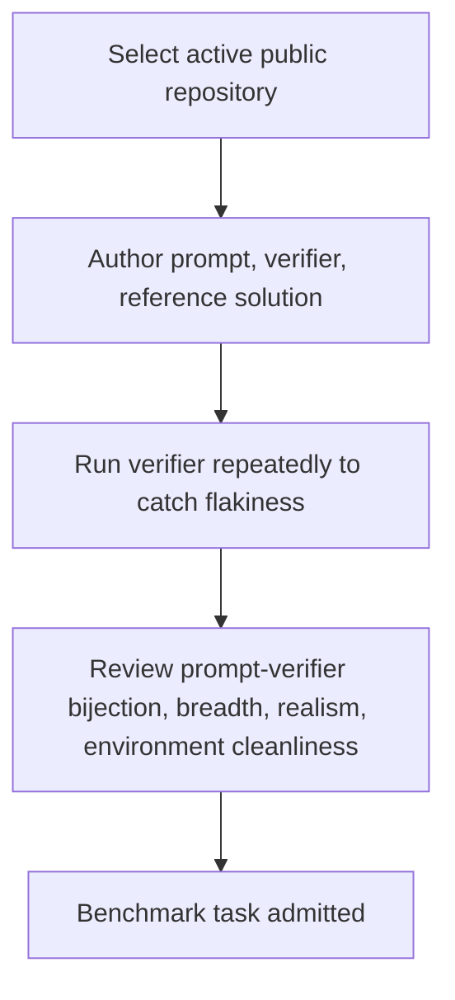
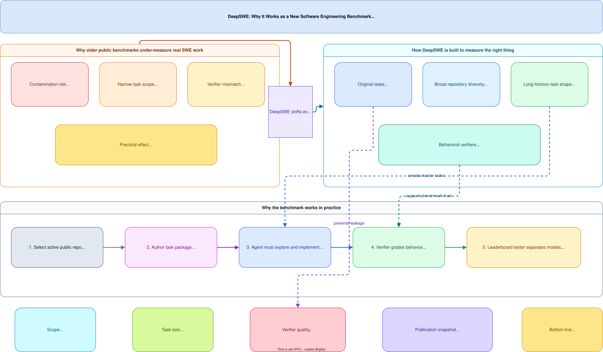

# DeepSWE: Long-Horizon Software Engineering Benchmark

**Benchmark site:** DeepSWE: Measuring frontier coding agents on original, long-horizon engineering tasks
**Authors:** Wenqi Huang, Charley Lee, Leonard Tng, Serena Ge
**Publication snapshot:** May 26, 2026
**Code / benchmark:** <https://github.com/datacurve-ai/deep-swe>

**Related pages:** [DeepSWE v1.1: Execution and Scoring Changes](../deepswe-v1-1/index.md), [τ-bench: Tool-Agent-User Interaction Benchmark](../tau-bench.md), [τ²-Bench: Mechanism and Design](../tau2-bench-mechanism.md)

## TL;DR

**What:** DeepSWE is a software-engineering benchmark for long-horizon coding on original tasks — not mined historical fixes.
**How:** Tasks are sourced from real open-source repositories with hand-written behavioral verifiers, contamination-resistant design, and broader repository diversity than SWE-bench variants.
**The number:** Frontier models show larger practical performance gaps on DeepSWE than on SWE-Bench Pro, with the best model achieving ~30% resolve rate on the publication snapshot.

## The Core Idea

Existing SWE benchmarks suffer from contamination (models trained on test sets), narrow repository coverage, overspecified task descriptions, and unreliable verifiers. DeepSWE addresses all four by sourcing original tasks, hand-writing behavioral verifiers, and designing tasks that require long-horizon reasoning across multiple files.

## Why This Exists

The benchmark is positioned as a response to three weaknesses in existing public coding benchmarks:

1. **Contamination risk:** tasks derived from public commits or pull requests may have leaked into pretraining data.
2. **Narrow task scope:** prompts can be long and prescriptive while the required code change is comparatively small.
3. **Verifier mismatch:** inherited PR test suites can produce both false positives and false negatives when used as benchmark graders.

DeepSWE's answer is to write every task and reference solution from scratch, keep tasks out of upstream repositories, and grade against purpose-built behavioral verifiers.

## Corpus and Task Shape

- **113 tasks** across **91 repositories**
- **5 languages:** TypeScript, Go, Python, JavaScript, Rust
- Median repository contribution is one task, which limits leaderboard concentration in a few flagship repos.

Compared with SWE-Bench Verified and SWE-Bench Pro, DeepSWE tasks are described as shorter in prompt form but substantially larger in implementation scope:

| Metric | SWE-Bench Verified | SWE-Bench Pro | DeepSWE |
|---|---:|---:|---:|
| Mean prompt length | 1,700 chars | 4,614 chars | 2,158 chars |
| Mean reference solution lines added | 10 | 120 | 668 |
| Mean files edited | 1 | 5 | 7 |

The intended effect is to force the agent to explore the codebase, infer the right implementation surface, and preserve surrounding behavior rather than filling in an over-specified patch.

## Methodology

Each task includes three artifacts:

1. The prompt shown to the agent.
2. An executable verifier.
3. A reference solution used during review, not grading.

Repository selection requires public, actively maintained repos with at least 500 GitHub stars and permissive licenses. Each task is pinned to an immutable commit.

Verifiers are designed around **observable behavior** rather than private implementation details. They also include:

- repeat runs during authoring to catch flakiness,
- regression checks against existing repository behavior,
- human review plus LLM-assisted review of prompt-verifier alignment.

*Visual explainer of DeepSWE's design rationale: why contamination resistance, behavioral verifiers, and original task authoring matter, and how the benchmark pipeline connects task creation to model evaluation.*

## Verifier Reliability Claim

The source reports a cross-benchmark audit comparing verifier verdicts against an LLM-based analyzer reading the trajectory, patch, prompt, and reference solution.

| Metric | SWE-Bench Pro | DeepSWE |
|---|---:|---:|
| False positive rate | 8.5% | 0.3% |
| False negative rate | 24.0% | 1.1% |
| Total disagreement rate | 32% | 1.4% |

The central argument is that DeepSWE's hand-authored behavioral verifiers are materially closer to "did the agent solve the requested task?" than verifiers inherited from historical PR tests.

## Evaluation Harness

All models are run through [`mini-swe-agent`](https://github.com/SWE-agent/mini-swe-agent) with a shared `bash`-only tool interface so the leaderboard reflects model differences more than harness differences. The source notes this improves comparability but reduces realism because real products such as Codex CLI, Claude Code, Cursor, and Gemini CLI expose model-native editing tools and prompts.

The source includes a small pilot claiming `mini-swe-agent` matches or exceeds several native harnesses on the same task slice, so the authors treat it as an acceptable neutral baseline.

## Leaderboard Snapshot

The page's published leaderboard snapshot is explicitly dated **May 26, 2026**. The top results shown there are:

| Model | DeepSWE score |
|---|---:|
| gpt-5.5 | 70% ± 3% |
| gpt-5.4 | 56% ± 2% |
| claude-opus-4.7 | 54% ± 5% |
| claude-sonnet-4.6 | 32% ± 2% |
| gemini-3.5-flash | 28% ± 4% |
| gpt-5.4-mini | 24% ± 3% |
| kimi-k2.6 | 24% ± 2% |
| mimo-v2.5-pro | 19% ± 2% |
| glm-5.1 | 18% ± 1% |
| gemini-3.1-pro | 10% ± 3% |
| deepseek-v4-pro | 8% ± 3% |
| gemini-3-flash | 5% ± 2% |

The source contrasts this with publicly reported SWE-Bench Pro scores and argues that DeepSWE creates wider separation between frontier models, especially in the middle and lower parts of the ranking.

## Efficiency Framing

Beyond pass rate, the source tracks:

- median output tokens per trial,
- median wall-clock time,
- median dollar cost per trial.

Its qualitative conclusion is that higher cost, longer runs, or more output tokens do not consistently imply higher DeepSWE scores. The page highlights `gpt-5.5` and `gpt-5.4` as strong points on the score-versus-cost frontier in the publication snapshot.

## Qualitative Findings

The source includes trajectory-level analysis over reviewed trials from both DeepSWE and SWE-Bench Pro. Several recurring patterns are emphasized:

- **Claude family:** often implements one branch of a multi-part requirement and misses the mirrored branch.
- **Claude on SWE-Bench Pro:** more likely than other families to recover gold solutions from `.git` history when the benchmark container exposes them.
- **GPT family:** described as more literal and consistent about implementing exactly the prompt's stated behavior.
- **Stronger models overall:** more often write and run their own tests, even when not prompted.

One important source claim is that SWE-Bench Pro's prompt template discourages writing new tests, whereas DeepSWE's prompt format does not, so self-verification behavior appears much more often on DeepSWE.

## Why the Benchmark Looks More Realistic

According to the source, realism comes from three linked choices:

1. Shorter, behavior-oriented prompts that resemble how developers message agents.
2. Broader repository coverage rather than repeated evaluation on a few famous repos.
3. Verifiers that accept multiple valid implementations as long as external behavior is correct.

This pushes the benchmark toward codebase exploration, design judgment, and regression avoidance instead of public-patch recall.

## Where It Breaks

| Failure mode | When it happens | Impact |
|---|---|---|
| Shared harness limits realism | mini-swe-agent is less realistic than model-native products | Benchmark signal is cleaner but less representative of real deployment |
| Star count filter | Repositories under 500 GitHub stars excluded | Small but important projects may be missed |
| Underrepresented task types | Bug localization and refactoring | Benchmark skews toward long-horizon feature work |
| Language concentration | Limited to 5 languages, concentrated in TypeScript, Go, Python | Non-covered languages not evaluated |
| Overly specific prompts | Verifiable grading needs specificity | Prompts longer than real developer instructions |

## One Thing to Remember

DeepSWE's strongest methodological claim is **verifier quality, not just task difficulty** — hand-written behavioral verifiers produce a cleaner benchmark signal that separates frontier models more sharply than existing SWE-bench variants.

## Go Deeper

- **Read:** [DeepSWE benchmark site](https://github.com/datacurve-ai/deep-swe)
- **Build on:** [DeepSWE v1.1: Execution and Scoring Changes](../deepswe-v1-1/index.md)
- **Understand the context:** [τ-bench](../tau-bench.md), [Pier: Coding-Agent Evaluation Harness](../pier/index.md)
- **Reproduce:** [github.com/datacurve-ai/deep-swe](https://github.com/datacurve-ai/deep-swe)

## Key Takeaways

- DeepSWE is designed as a **harder, cleaner long-horizon coding benchmark** than public SWE-bench variants.
- Its strongest methodological claim is **verifier quality**, not just task difficulty.
- Its published May 26, 2026 leaderboard suggests **larger practical performance gaps** between frontier coding agents than SWE-Bench Pro shows.
- The benchmark's biggest realism tradeoff is that **model-native harnesses are intentionally removed** to keep comparisons standardized.
