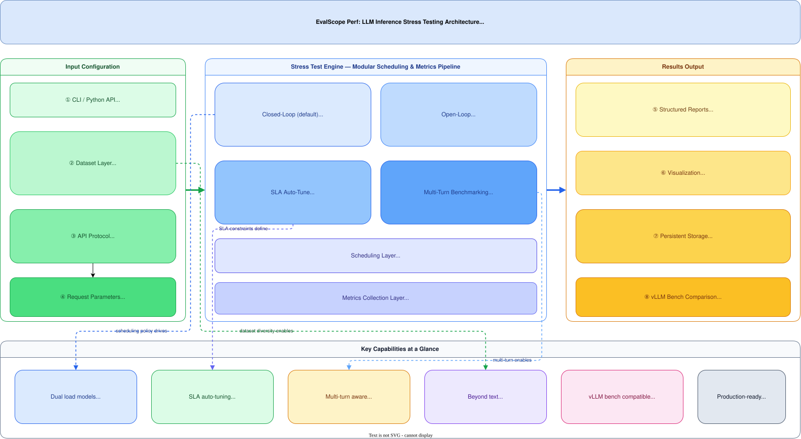

# EvalScope Perf: LLM Inference Stress Testing

**Tool:** EvalScope — Model Inference Performance Stress Testing (`evalscope perf`)
**Source:** EvalScope documentation, ModelScope project
**Website:** [evalscope.readthedocs.io](https://evalscope.readthedocs.io/zh-cn/latest/user_guides/stress_test/)

**Related pages:** [Benchmarks Overview](index.md)

## TL;DR

**What:** EvalScope Perf is a comprehensive LLM inference stress-testing tool that supports OpenAI-compatible APIs, local transformers/vLLM backends, embedding/rerank models, and multi-modal datasets — all through a single CLI and Python API.
**How:** It offers two distinct load-generation modes (closed-loop for controlled concurrency, open-loop for realistic traffic simulation), a binary-search SLA auto-tuner that finds maximum sustainable load under latency/throughput constraints, and multi-turn conversation benchmarking with trace-level metrics.
**The number:** Compared apples-to-apples with `vllm bench serve`, EvalScope Perf produces statistically consistent TTFT, TPOT, ITL, and throughput metrics, while adding SLA auto-tuning, multi-turn support, embedding/rerank testing, and multi-modal dataset generation — features that vLLM bench does not provide.

## The Big Picture



*① Configuration via CLI args or Python `Arguments` object. ② Dataset layer provides prompts from 12+ modes (random, ShareGPT, embedding, VL, etc.). ③ API protocol layer abstracts OpenAI-compatible, local transformers, and local vLLM backends. ④ The engine routes to one of four test modes: Closed-Loop (concurrency-limited with backpressure), Open-Loop (Poisson arrival without backpressure), SLA Auto-Tune (binary search for max sustainable load), or Multi-Turn (trace-level conversation benchmarking). ⑤ Structured reports include Performance Overview, Per-Request percentile distributions, Per-Trace metrics, and Workload Throughput. ⑥ Results visualized through WandB, SwanLab, or ClearML and persisted to SQLite.*

## Why This Exists

Consider a team deploying Qwen2.5-72B behind a vLLM server. They need to answer:

1. **What's the maximum concurrent users** before p99 latency exceeds 2 seconds?
2. **How does throughput degrade** as input length grows from 1K to 32K tokens?
3. **Is the service stable** under Poisson-arrival traffic that mimics real users?
4. **How do multi-turn conversations** affect cache hit rates and tail latency?

Before EvalScope Perf, answering these required cobbling together multiple tools: `vllm bench serve` for basic throughput, custom Locust scripts for open-loop traffic, and manual binary search for SLA boundaries. EvalScope Perf unifies all of this in a single tool with consistent metric definitions.

## The Core Idea

EvalScope Perf separates *load generation* from *metric collection* through a modular design: the dataset layer generates prompts, the API layer sends requests, the scheduler controls timing (closed-loop backpressure vs. open-loop Poisson), and the metrics layer computes statistics independently. This separation means you can swap any component — use random synthetic data for throughput tests, real ShareGPT conversations for quality-of-service tests, or embedding datasets for retrieval pipeline benchmarks — without changing the measurement infrastructure.

## Deep Dive

### Test Modes: Closed-Loop vs. Open-Loop

**What it does:** EvalScope Perf offers two fundamentally different load-generation strategies that answer different questions about your service.

**Why it matters:** Closed-loop measures "how fast can the server process N concurrent users?", while open-loop measures "how does the server behave when requests arrive at rate R regardless of processing speed?" These are different questions, and conflating them leads to wrong capacity planning.

**How it works:**

| Aspect | Closed-Loop (default) | Open-Loop (`--open-loop`) |
|---|---|---|
| Scheduling | N workers each send one request, wait for response, repeat | Requests dispatched at rate R following Poisson arrival |
| Concurrency | Bounded by `--parallel` | Unbounded (INF); requests don't wait |
| Rate control | `--rate`: pacing hint (-1 = no throttle), but still bounded by `--parallel` | `--rate`: **required**, supports multiple values for sweep |
| Backpressure | Yes — worker waits for response before next request | No — requests fire regardless of server state |
| Use case | "How many concurrent users can I serve?" | "What happens under real traffic at 50 req/s?" |
| Multi-rate sweep | `--parallel 1 10 50` with matching `--number` | `--rate 5 10 20` with matching `--number` |

**The intuition:** Closed-loop is like a call center with N phone lines — a new call starts only when a line frees up. Open-loop is like a website — users arrive randomly regardless of whether the server is busy.

**A concrete example:** To find the maximum sustainable load for a latency SLA of p99 < 2s: closed-loop tells you the max concurrency; open-loop tells you the max request rate. These are different numbers because at high rates, open-loop can accumulate unbounded queuing delay that closed-loop's backpressure hides.

**Remember:** Closed-loop measures server capacity under controlled load; open-loop measures server behavior under uncontrolled arrival.

### SLA Auto-Tuning

**What it does:** Binary search that automatically finds the maximum `--parallel` or `--rate` at which the service still satisfies user-defined latency/throughput constraints.

**Why it matters:** Manual capacity testing requires guessing concurrency levels and iterating. SLA auto-tune replaces hours of trial-and-error with a single command.

**How it works:**

1. **Baseline:** Start at the user-specified initial value (e.g., `--parallel 2`).
2. **Boundary probe:** Double the variable until SLA is violated or `--sla-upper-bound` is reached. If initial value already violates SLA, halve until satisfied.
3. **Binary search:** Within the discovered [lower, upper] window, binary-search for the exact boundary.
4. **Stabilization:** Each test point runs `--sla-num-runs` times (default 3), averaged, to reduce noise.
5. **Report:** Outputs a summary table showing each SLA criterion and the max satisfying value.

**Supported constraints:**

| Metric | Operators | Meaning |
|---|---|---|
| `avg_latency`, `p99_latency` | `<=`, `<`, `min` | End-to-end latency bounds |
| `avg_ttft`, `p99_ttft` | `<=`, `<`, `min` | Time-to-first-token bounds |
| `avg_tpot`, `p99_tpot` | `<=`, `<`, `min` | Per-output-token time bounds |
| `rps`, `tps` | `>=`, `>`, `max` | Throughput floors or maximization |

**Constraint logic:** Multiple metrics in one JSON object = AND (must all satisfy); separate objects in the array = OR (independent searches).

```
# Find max concurrency where p99 latency <= 2s AND avg TTFT <= 1s
--sla-params '[{"p99_latency": "<=2", "avg_ttft": "<=1"}]'

# Independently test two TTFT thresholds
--sla-params '[{"p99_ttft": "<0.05"}, {"p99_ttft": "<0.01"}]'

# Find concurrency that maximizes TPS
--sla-params '[{"tps": "max"}]'
```

**The intuition:** SLA auto-tune is a capacity planner that asks "how hard can I push this service before it breaks my SLO?" — and answers with a single number.

**A concrete example:** For a production deployment, you might run:
```
evalscope perf --sla-auto-tune --sla-variable parallel \
  --sla-params '[{"p99_latency": "<=2"}]' --sla-upper-bound 256
```
This automatically discovers that your service handles 64 concurrent users at p99 < 2s, but breaks at 128.

**Remember:** SLA auto-tune treats any test point with <100% success rate as a failure, so it automatically catches overload regimes where requests start erroring out.

### Dataset Flexibility

**What it does:** EvalScope Perf supports nine dataset modes spanning text, vision-language, embedding, rerank, and multi-turn conversation — with both synthetic (random) and real-data options.

**Why it matters:** Different workloads stress different parts of the serving stack. A synthetic fixed-length test measures raw decode speed; a real ShareGPT workload measures cache-hit behavior and variable-length batching efficiency.

**How it works:**

| Mode | Data Source | Use Case |
|---|---|---|
| `random` | Synthetic, tokenizer-generated | Controlled input/output length, pure decode throughput |
| `openqa` | ModelScope OpenQA dataset | Short-prompt (<100 tok), realistic QA traffic |
| `longalpaca` | ModelScope LongAlpaca-12k | Long-prompt (>6K tok), prefill-heavy workloads |
| `line_by_line` | Local TXT file | Custom prompt corpus |
| `random_vl` | Synthetic images + text | Multi-modal model throughput |
| `flickr8k` / `kontext_bench` | ModelScope image datasets | Real multi-modal workloads |
| `random_embedding` | Synthetic text | Embedding API throughput |
| `random_rerank` | Synthetic query-doc pairs | Rerank API throughput |
| `share_gpt_zh` / `share_gpt_en` | ModelScope ShareGPT (~70K) | Real multi-turn conversation traffic |
| `random_multi_turn` | Synthetic multi-turn | Controlled multi-turn stress testing |

**Key parameter:** `--dataset-args '{"target_input_len": 2048}'` truncates real datasets to a fixed input length — useful for controlled A/B comparisons that `--max-prompt-length` alone cannot achieve (it only filters, not truncates).

**The intuition:** `random` answers "how fast is the decode engine?"; real datasets answer "how will actual users experience the service?"

**Remember:** For random datasets, `--tokenizer-path` is mandatory; `--tokenize-prompt` can bypass server-side re-tokenization for exact length control when sending token IDs directly.

### Multi-Turn Benchmarking

**What it does:** Measures conversation-level performance where each "trace" spans multiple user-assistant turns, with metrics that distinguish cold-start (first turn) from cache-warm (subsequent turns) performance.

**Why it matters:** Single-turn benchmarks hide prefix-caching benefits and prompt-processing overhead that dominate real chatbot costs. Multi-turn testing reveals that subsequent turns can be 5-10× faster on TTFT when prefix caching is enabled.

**How it works:**

- `--multi-turn` enables trace-level benchmarking.
- `--number` counts total turns sent, `--parallel` counts concurrent turns in flight.
- Each trace is a complete conversation; the tool tracks which turn within the trace each request belongs to.
- `--max-turns` / `--min-turns` control conversation length.

**Multi-turn-specific metrics:**

| Metric | Meaning |
|---|---|
| Turns/Req | Average turns per request (always ≥1) |
| Cache Hit (%) | Approximate prefix-cache hit rate from `cached_tokens` |
| 1st-Turn TTFT | Cold prefill: first turn's TTFT (no cache) |
| Subseq. TTFT | Warm prefill: subsequent turns' TTFT (cache hits) |
| Per-Trace Metrics | Conversation-level latency/token distributions |

**The intuition:** First turn = cold engine start; subsequent turns = warm engine. Multi-turn benchmarking measures both and reports them separately.

**Remember:** `--duration` provides a soft-exit: when the time budget expires, no new traces start, but in-flight traces complete all remaining turns — a trace-level graceful shutdown.

### Metrics Coverage

**What it does:** EvalScope Perf computes a comprehensive set of metrics across multiple aggregation levels: per-configuration overview, per-request distributions, per-trace aggregates (multi-turn), and global workload throughput.

**Why it matters:** A single number like "average latency" hides tail behavior. EvalScope Perf reports full percentile distributions (10/25/50/75/90/95/98/99%) and separates concerns: latency vs. throughput, TTFT vs. TPOT vs. ITL, input vs. output tokens.

**Key metrics:**

| Category | Metrics |
|---|---|
| General | Test Duration, Concurrency, Request Rate, Total/Success/Failed |
| Throughput | Req Throughput (req/s), Output Throughput (tok/s), Total Throughput (tok/s) |
| Latency | Avg Latency, TTFT, TPOT, ITL — with full percentile breakdown |
| Tokens | Avg Input/Output Tokens, Decode Rate (tok/s) |
| Multi-Turn | Turns/Req, Cache Hit%, 1st-Turn TTFT, Subseq. TTFT |
| Speculative Decoding | Decoded Tok/Iter, Spec. Acceptance Rate |

**Output format:** Four tables — Performance Overview (scalar), Per-Request Metrics (distributions), Per-Trace Metrics (multi-turn), Workload Throughput (time-series). Plus per-configuration detailed breakdowns.

**The intuition:** Standard metrics across all modes mean you can compare a single-turn random test against a multi-turn ShareGPT test using the same definitions.

**Remember:** All metrics are saved to both human-readable logs (`benchmark.log`, `performance_summary.txt`) and a queryable SQLite database under `outputs/`.

### vLLM Bench Comparison

**What it does:** EvalScope provides a documented, parameter-aligned comparison with `vllm bench serve`, showing statistical consistency when parameters are matched.

**Why it matters:** Teams already using vLLM bench can migrate with confidence, knowing the numbers are comparable — and gain features vLLM bench lacks.

**How it works:** The EvalScope docs provide a parameter-mapping table:

| vLLM Bench | EvalScope Perf |
|---|---|
| `--max-concurrency` | `--parallel` |
| `--num-prompts` | `--number` |
| `--backend openai-chat` | `--api openai` |
| `--dataset-name random` | `--dataset random` |
| `--random-input-len N` | `--min-prompt-length N --max-prompt-length N` |
| `--random-output-len M` | `--max-tokens M` |
| `--ignore-eos` | `--extra-args '{"ignore_eos": true}'` |

In a controlled 50-concurrency / 1000-request test on Qwen2.5-0.5B-Instruct, both tools produced consistent TTFT (~73ms vs ~113ms mean — the difference stems from chat template overhead in EvalScope's default `/v1/chat/completions` path), TPOT (~3.85ms vs ~3.6ms), and throughput (~108 req/s vs ~105 req/s).

**The intuition:** EvalScope Perf is a superset of vLLM bench — it can do everything vLLM bench does (with consistent results) plus SLA tuning, multi-turn, embedding, rerank, multi-modal, and open-loop.

**Remember:** Key sources of divergence between the two tools: chat template differences (chat/completions vs completions endpoint), tokenizer version, warmup behavior, and connection pooling. The docs document all of these.

## Putting It Together

A typical production capacity-planning workflow with EvalScope Perf:

1. **① Baseline throughput:** `--dataset random --min-prompt-length 1024 --max-prompt-length 1024 --max-tokens 1024` — establishes raw decode speed at fixed input/output.
2. **② Concurrency sweep:** `--parallel 1 10 50 100 200 --number ...` — maps latency vs. concurrency curve.
3. **③ SLA auto-tune:** `--sla-auto-tune --sla-params '[{"p99_latency": "<=2"}]'` — finds maximum sustainable concurrency under production SLO.
4. **④ Open-loop validation:** `--open-loop --rate 10 20 50` — verifies behavior under realistic arrival patterns.
5. **⑤ Multi-turn realism:** `--multi-turn --dataset share_gpt_zh` — validates cache-hit benefits for real conversation traffic.
6. **⑥ Visualize:** `--visualizer wandb` — publishes results for team review.

## What This Buys You

### The headline claim

EvalScope Perf replaces multiple ad-hoc benchmarking scripts with a single, configurable tool that covers the full spectrum from raw throughput to production SLO validation — and produces metrics consistent with established tools like vLLM bench.

### How we know: feature coverage

| Capability | vLLM Bench | EvalScope Perf |
|---|---|---|
| Fixed-length random throughput | ✅ | ✅ |
| Closed-loop concurrency sweep | ✅ | ✅ |
| Open-loop Poisson traffic | ❌ | ✅ |
| SLA auto-tuning (binary search) | ❌ | ✅ |
| Multi-turn conversation benchmark | ❌ | ✅ |
| Embedding model testing | ❌ | ✅ |
| Rerank model testing | ❌ | ✅ |
| Multi-modal (VL) dataset | ❌ | ✅ |
| Real dataset testing (ShareGPT, OpenQA) | ❌ | ✅ |
| WandB/SwanLab/ClearML visualization | ❌ | ✅ |
| SQLite result database | ❌ | ✅ |
| Warmup phase | ❌ | ✅ |

### The mechanism behind the numbers

The separation of dataset generation, API protocol, scheduling policy, and metrics collection into independent modules is what enables this coverage. Each module can be extended (custom datasets, custom API protocols) without touching the measurement infrastructure — documented in the [custom usage guide](https://evalscope.readthedocs.io/zh-cn/latest/user_guides/stress_test/custom.html).

### ⚠️ How to read these numbers

- **TTFT comparison across tools:** EvalScope Perf defaults to `/v1/chat/completions` which applies a chat template, adding tokenization overhead vs. raw `/v1/completions`. For exact TTFT parity with vLLM bench, use `--tokenize-prompt` or compare at the completions endpoint.
- **Open-loop throughput:** In open-loop mode, if the server cannot keep up with the arrival rate, queuing delay inflates latency indefinitely. Always pair open-loop tests with SLA constraints.
- **Multi-turn cache hit:** The cache-hit metric is approximate — it relies on the server reporting `cached_tokens` in the response, which not all backends support.

## Where It Breaks

| Failure mode | When it happens | Impact |
|---|---|---|
| Random dataset token count drift | Chat template and tokenizer differences cause actual token counts to deviate from `--min/max-prompt-length` settings | Input/output lengths are approximate, not exact — use `--tokenize-prompt` for precision |
| Open-loop unbounded queue | `--rate` exceeds server capacity, causing request backlog | Latency grows without bound; always pair with `--sla-auto-tune` to find safe rates |
| Multi-turn cache metric missing | Server does not return `cached_tokens` in streaming responses | Cache Hit (%) shows 0; metric is silently unavailable |
| SLA auto-tune on unstable service | Network jitter or variable server load causes inconsistent results across `--sla-num-runs` | Binary search may converge to wrong boundary; increase `--sla-num-runs` or stabilize environment |
| `--duration` with very long traces | Multi-turn traces with `--max-turns`=20 and slow TTFT may exceed duration before all traces complete | Final trace may not finish; use generous duration budgets for multi-turn |
| Tokenizer mismatch in random datasets | `--tokenizer-path` points to a different model than the serving model | Generated prompt lengths don't match actual token counts; always match tokenizer to served model |
