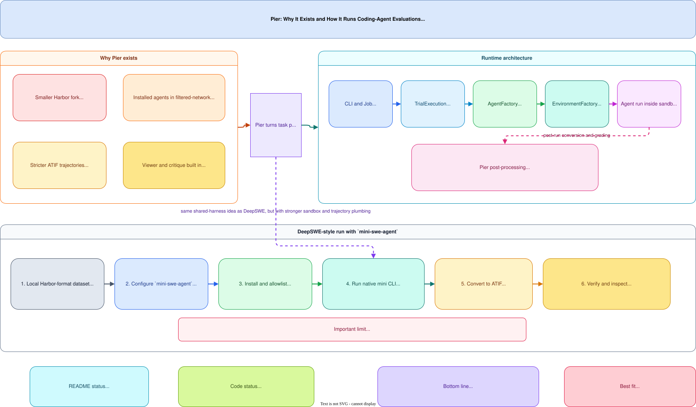

# Pier: Coding-Agent Evaluation Harness

**Codebase inspected:** local `pier` repository
**Related pages:** [DeepSWE: Long-Horizon Software Engineering Benchmark](../deepswe/index.md), [DeepSWE v1.1: Execution and Scoring Changes](../deepswe-v1-1/index.md)

## Summary

Pier is not a benchmark dataset. It is a **Harbor-compatible evaluation harness** for running coding agents inside sandboxed task environments, collecting full trajectories, and grading outputs with task verifiers. The main value proposition is not "more tasks", but better execution plumbing for installed agents such as Codex, Claude Code, Gemini CLI, Cursor CLI, OpenCode, and `mini-swe-agent`.

The codebase is especially opinionated about three things:

- **installed agents must work even in filtered-network tasks,**
- **native agent traces should be normalized into a stricter ATIF format,**
- **post-run inspection should be first-class rather than an afterthought.**

## Visual Explainer

The diagram below summarizes why Pier exists, how its runtime architecture is wired, and what the `mini-swe-agent` path looks like for a DeepSWE-style evaluation setup.



## Why Pier Exists

According to the inspected `README.md`, Pier is a **smaller, more opinionated Harbor fork**. The explicit motivation is that Harbor already defines a useful task format, but Pier wants stronger support for the parts that matter when the evaluated agent is itself an installed CLI running inside the sandbox.

That leads to four practical additions:

1. **Installed-agent support under `allow_internet = false`.** Pier lets each agent declare both an install recipe and a network allowlist, so the environment can keep the sandbox mostly air-gapped while still allowing the exact provider endpoints the agent needs.
2. **Augmented ATIF v1.7 trajectories.** Pier normalizes different agent-native logs into a common structure with explicit tool calls, reasoning separation, timestamps, and usage metrics.
3. **A viewer built around trajectories.** The `pier view` server is not a generic job dashboard; it is designed around inspecting trial results, trajectories, costs, steps, and critique outputs.
4. **Fresh-sandbox critique jobs.** `pier critique run` treats completed trials as artifacts that can be reviewed by another agent in a separate sandbox.

So Pier is best understood as **evaluation infrastructure for coding agents**, not as a benchmark paper or a task corpus.

## Architecture

The runtime path in code is clean and direct:

1. `pier` CLI commands are registered in `pier/src/pier/cli/main.py`.
2. `pier run` builds a `JobConfig` and hands it to `Job.create(...)`.
3. `Job` resolves local datasets and emits individual `TrialConfig` objects.
4. `TrialExecution.create(...)` builds the concrete agent and environment through `AgentFactory` and `EnvironmentFactory`.
5. The environment receives the agent's **install spec** and **network allowlist** before the sandbox starts.
6. The trial lifecycle then runs: environment start, healthcheck, agent setup, agent execution, artifact collection, verification, result save, cleanup.

This means the real architectural boundary in Pier is not "model API vs benchmark". It is:

- **task definition,**
- **sandbox environment,**
- **installed agent adapter,**
- **trajectory conversion,**
- **verification and inspection.**

That separation is the reason Pier can host multiple native agent CLIs while still writing comparable output files.

## What Makes the Agent Path Different

Pier treats installed agents as structured adapters rather than opaque shell commands.

Each installed-agent adapter can provide:

- an install recipe,
- CLI flag mapping,
- env var mapping,
- network-allowlist extraction,
- post-run trajectory conversion.

The `mini-swe-agent` adapter is the clearest example. Its implementation:

- installs `mini-swe-agent` with `uv tool install`,
- optionally adds provider-specific Python packages,
- refreshes LiteLLM's model-cost backup file during install,
- derives provider/network allowlists from env vars and optional embedded YAML config,
- runs `mini-swe-agent` inside the sandbox,
- converts the resulting native mini trajectory into ATIF,
- writes the normalized output as `agent/trajectory.json`.

That last step is important. Pier does not just archive the agent's original trace; it **reinterprets it into a stricter schema** that downstream verifiers, viewers, and analytics can use consistently.

## Trial Lifecycle and Artifacts

`pier/src/pier/trial/trial.py` shows the actual sequence:

1. start sandbox,
2. run environment healthcheck,
3. setup/install agent,
4. run the agent on the task instruction,
5. download agent logs if the environment is not host-mounted,
6. let the adapter populate post-run context,
7. optionally upload generated logs back into the sandbox so the verifier can read files such as `trajectory.json`,
8. collect artifacts,
9. run verification,
10. persist outputs under `jobs/<job>/<trial>/`.

This is a meaningful design choice. Pier assumes **the verifier may need transformed agent outputs**, not just source code diffs. That is why the framework bothers to re-upload locally generated logs back into the environment before verification.

## DeepSWE with mini-swe-agent: the practical path

DeepSWE's public benchmark framing uses `mini-swe-agent` as a common bash-only harness. Pier does not ship a first-party `deepswe` command, but it already contains the pieces needed to run the **same style of harness** with stricter sandbox and trajectory plumbing.

The important caveat is that this part is partly an **inference from code**, not a first-party DeepSWE integration claim.

Directly supported by the inspected Pier build:

- local Harbor-format task datasets,
- `mini-swe-agent` as an installed agent,
- deterministic dataset subsampling with `n_tasks` and `sample_seed`,
- documented `docker` and `modal` execution environments.

Not directly supported in this build:

- package/registry datasets,
- a DeepSWE downloader,
- a special-case DeepSWE runner command.

So the workable path is:

1. convert or export DeepSWE tasks into a local Harbor-style dataset directory,
2. point Pier at that local dataset path,
3. run the `mini-swe-agent` adapter inside Pier.

Representative config:

```yaml
environment:
  type: docker

agents:
  - name: mini-swe-agent
    model_name: openai/gpt-5.5
    env:
      OPENAI_API_KEY: ${OPENAI_API_KEY}
    kwargs:
      reasoning_effort: xhigh
      set_cache_control: default_end

datasets:
  - path: /absolute/path/to/deepswe-harbor
    n_tasks: 10
    sample_seed: 0
```

Run it with:

```bash
pier run -c pier-mini.yaml
```

Inside the sandbox, the adapter's effective execution pattern is:

```bash
mini-swe-agent --yolo --model=... --task=... --output=/logs/agent/mini-swe-agent.trajectory.json
```

After the run, Pier converts that native file into:

- `jobs/<job>/<trial>/agent/mini-swe-agent.trajectory.json`
- `jobs/<job>/<trial>/agent/trajectory.json`

The second file is the normalized ATIF trajectory that Pier's viewer and critique tooling expect.

## Why this matters for DeepSWE-style evaluation

DeepSWE intentionally standardizes on a shared harness so model comparisons are less confounded by product-native tools. Pier is useful in the same space for a different reason:

- it keeps the **shared-harness idea**,
- but improves the **sandbox, artifact, and trajectory story** around that harness.

In other words, DeepSWE asks, "what happens if every model uses the same basic coding loop?" Pier asks, "how do we run that loop inside a realistic sandbox and still keep high-quality traces for analysis?"

## Important limits and one code/README mismatch

Two limits stand out from the inspection:

- **Only local datasets are accepted in this build.** `DatasetConfig` rejects registry and package datasets, so the dataset must already exist on disk.
- **Pier is an execution harness, not a benchmark authoring system.** It assumes Harbor-style task packaging is already done.

There is also a small documentation mismatch:

- the README says the environments that work today are `docker` and `modal`,
- but `EnvironmentFactory` also registers a `daytona` implementation.

The safest reading is that Daytona exists in code, but the README only treats Docker and Modal as the primary supported paths today.

## One Thing to Remember

Pier's most distinctive contribution is its insistence on **high-quality, analyzable trajectories** — the harness trades some execution convenience for the ability to inspect exactly what the agent did, which is essential for debugging and improving coding agents.

## Go Deeper

- **Read:** [Pier repository](https://github.com/datacurve-ai/pier)
- **Build on:** [DeepSWE: Long-Horizon Software Engineering Benchmark](../deepswe/index.md), [DeepSWE v1.1](../deepswe-v1-1/index.md)
- **Understand the context:** [Harbor: Agent Evaluation Framework Design](../../frameworks/harbor-framework/index.md)
- **Reproduce:** [github.com/datacurve-ai/pier](https://github.com/datacurve-ai/pier)

## Key Takeaways

- Pier's main reason to exist is **installed-agent evaluation in sandboxed tasks**, not benchmark creation.
- Its central abstraction is **agent adapter + sandbox environment + ATIF conversion**, not just "run a command and save stdout".
- The `mini-swe-agent` path is already well integrated: install, allowlist, execution, and trajectory normalization are all implemented.
- Running DeepSWE-style evaluations with Pier is realistic **if** the task set is first available as a **local Harbor-format dataset**.
- The most distinctive part of Pier is probably not its CLI surface, but its insistence on **high-quality, analyzable trajectories** after the run.
