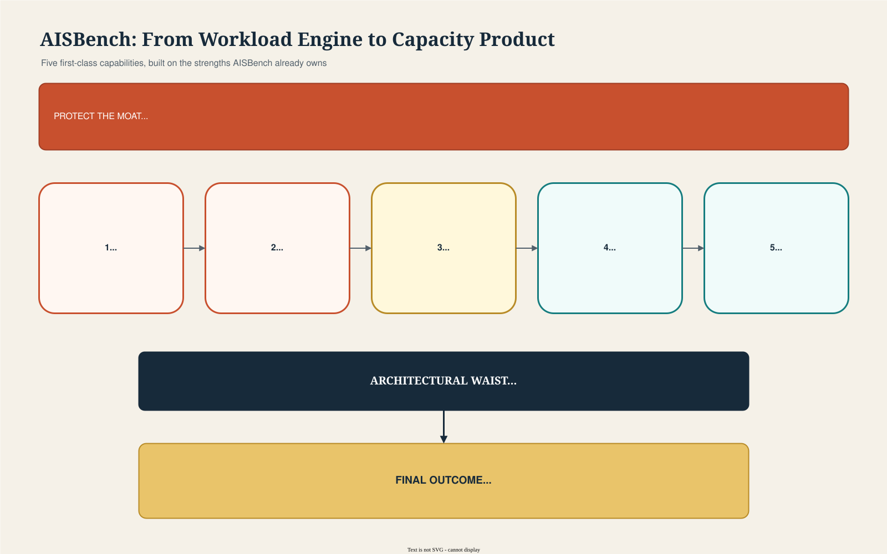

# AISBench First-Class Performance Roadmap

**Decision:** What must AISBench implement as core product capabilities to be a stronger inference performance benchmark than EvalScope Perf?
**Audience:** AISBench maintainers, architects, benchmark owners, and engineering leads
**Method:** Primary-source product and documentation analysis as of 2026-07-17; no controlled runtime comparison was performed

**Language:** [中文](zh-cn.md)

**Related pages:** [Full AISBench vs. EvalScope analysis](../aisbench-vs-evalscope-perf.md) · [EvalScope Perf deep dive](../evalscope-perf.md) · [Benchmarks overview](../../index.md)

## Executive Answer

AISBench should implement **five first-class capabilities**, in this order:

1. **Metric contract and conformance:** make every result mathematically and operationally trustworthy.
2. **Explicit load-model contract:** make closed-loop, open-loop, ramp, burst, pressure, and trace replay named scheduler modes with observable behavior.
3. **SLA capacity engine:** automatically find the maximum sustainable concurrency or request rate under user-defined service objectives.
4. **Canonical run and evidence store:** persist configs, raw events, requests, responses, derived metrics, validity, and comparisons in a queryable schema.
5. **One-command product facade:** expose the common path without forcing users to locate and edit Python task configs.

These are **first-class** because every dataset, backend, report, and future feature depends on them. Embedding, rerank, multimodal, distributed load generation, and hosted visualization matter, but they should build on these contracts rather than define them.

## The Big Picture



*① Protect the current AISBench moat: realistic workloads, stable-stage analysis, trace replay, and benchmark composition. ② Build a shared measurement plane before adding more workload types. ③ Add automated capacity discovery and durable evidence above that plane. ④ Expose the whole system through a one-command path while retaining advanced configs. ⑤ The result is a benchmark product that answers both "what happened?" and "how much load is safe?".*

## The Product Thesis

**AISBench already has the harder workload-modeling assets.** Its documented capabilities include burstiness distributions, linear and exponential ramp-up, stable-stage calculation, pressure testing, timestamped Mooncake trace replay, prefix-locality modeling through `hash_ids`, post-hoc metric recomputation, and OpenCompass-compatible benchmark composition.

EvalScope’s strongest advantage is packaging. It presents closed/open-loop behavior, SLA search, dataset/API selection, request controls, SQLite persistence, and custom extension as visible parts of one performance product.

The correct AISBench strategy is therefore:

> **Do not replace the richer workload engine. Productize it with explicit contracts, automated decisions, and durable evidence.**

## What "First-Class" Means

A capability is first-class only if it satisfies all of these conditions:

| Requirement | Meaning |
|---|---|
| Stable public contract | It has versioned CLI/config fields and documented semantics |
| Shared core implementation | Every compatible backend uses the same scheduler, event, or result contract |
| Persisted representation | The run store records exactly what was configured and observed |
| Machine-verifiable behavior | CI fixtures can prove the semantics and formulas |
| Composable | It works with synthetic, benchmark, multi-turn, and trace workloads |
| Visible failure | Invalid or unreliable results produce explicit status, not silent numbers |

A dataset-specific helper, undocumented config field, or output-only calculation is useful, but it is not first-class.

## Priority 1: Metric Contract and Conformance

### Product promise

**The same raw request events must always produce the same metric values, independent of backend and workload adapter.**

This is the foundation. SLA search, regressions, cross-run comparison, and public benchmark claims are unsafe if TTFT, TPOT, ITL, duration, token counts, or success status have ambiguous definitions.

### Required contract

| Metric area | Contract AISBench must define |
|---|---|
| E2E latency | Exact client timestamp used for request start and terminal response |
| TTFT | Whether the event is first byte, first SSE data chunk, first non-empty content, or first decoded token |
| TPOT | Exact formula and denominator, especially whether the first token is excluded |
| ITL | Token-level versus chunk-level behavior and treatment of multi-token chunks |
| Throughput | Numerator, duration window, success filtering, and stable versus whole-run variants |
| Tokens | Client tokenizer identity/revision, server-reported counts, and mismatch policy |
| Success | HTTP, protocol, empty response, partial stream, timeout, retry, and cancellation rules |
| Percentiles | Population, interpolation method, minimum sample count, and units |
| Multi-turn | Request-, turn-, and trace-level aggregation boundaries |

### Implementation boundary

Create a versioned `MeasurementSpec` and a canonical event sequence:

```text
request_scheduled
request_dispatched
connection_acquired
response_headers
first_content
stream_chunk*
request_completed | request_failed | request_cancelled
```

Adapters translate protocol-specific behavior into these events. Metric calculators consume only canonical events, never backend-specific response objects.

### Acceptance criteria

- A golden SSE fixture verifies E2E, TTFT, TPOT, ITL, tokens, and status in CI.
- Chat and completions fixtures expose template/token-count differences rather than hiding them.
- Every report includes `measurement_spec_version`.
- Every metric row states its population and duration window.
- Unsupported measurements are `unavailable` with a reason, never silently zero.

### EvalScope lesson

EvalScope reports the standard metric family and stores request-level information for later analysis. AISBench should adopt the durable contract, not merely copy the metric names.

## Priority 2: Explicit Load-Model Contract

### Product promise

**A user can state the arrival model independently from concurrency safety limits, and the report proves whether the client generated that model.**

EvalScope makes the key distinction explicit:

- Closed loop bounds in-flight requests and applies backpressure.
- Open loop schedules arrivals regardless of whether prior requests finished.

AISBench already supports `request_rate`, burstiness, ramps, pressure mode, and timestamp scheduling. The missing piece is one unified, named scheduler contract.

### Required modes

| Mode | Core semantics | Primary question |
|---|---|---|
| `closed` | At most N in-flight requests; completion releases the next request | How does the service behave for N waiting clients? |
| `open` | Arrivals follow a configured process; server backlog does not slow dispatch | What happens at R offered requests per second? |
| `ramp` | Offered rate changes continuously by a declared function | Where does latency collapse as load rises? |
| `burst` | Inter-arrival distribution controls clustering | Can the service absorb realistic spikes? |
| `pressure` | Workers recycle workloads for a duration under a concurrency policy | Can the service sustain prolonged saturation? |
| `trace` | Source timestamps determine dispatch; optional scaling/offset/window | How does production timing and prefix locality behave? |

### Required scheduler telemetry

Every request must persist:

- Target schedule timestamp.
- Actual dispatch timestamp.
- Scheduler lag.
- In-flight count at dispatch.
- Queue/backlog depth.
- Worker/process identity.
- Retry attempt.

Every run must report offered RPS, achieved RPS, scheduler-lag percentiles, peak in-flight requests, and client CPU/memory/network saturation indicators when available.

### Suggested interface

```bash
ais_bench perf \
  --url http://server/v1/chat/completions \
  --model served-model \
  --load-model open \
  --rate 100 \
  --requests 5000 \
  --max-in-flight unlimited
```

Advanced traffic becomes a structured profile:

```yaml
load:
  model: burst
  target_rps: 100
  inter_arrival:
    distribution: gamma
    shape: 0.5
  safety:
    max_in_flight: 2000
```

### Acceptance criteria

- Closed loop never exceeds its configured in-flight bound.
- Open loop does not wait for request completion before scheduling the next arrival.
- A deterministic fake clock verifies schedule generation for every mode.
- Reports fail validity when scheduler lag exceeds a configured threshold.
- Existing AISBench traffic configs migrate into the common schema without losing burst, ramp, stable-stage, or trace capability.

### EvalScope lesson

EvalScope’s `--open-loop` makes the behavioral distinction understandable. AISBench should match that clarity while retaining its stronger Gamma/uniform burstiness, continuous ramps, and timestamped trace replay.

## Priority 3: SLA Capacity Engine

### Product promise

**Given an SLO, AISBench returns the highest validated load that satisfies it, plus evidence around the boundary.**

EvalScope’s SLA auto-tuner searches concurrency or request rate, supports latency and throughput constraints, repeats each point, and uses a boundary-search workflow. This converts raw benchmarking into a capacity decision.

### Required SLA model

```yaml
capacity_search:
  variable: request_rate
  range: [1, 1000]
  constraints:
    - p99_ttft_ms: {op: "<=", value: 500}
    - p99_e2e_ms: {op: "<=", value: 5000}
    - success_rate: {op: ">=", value: 0.999}
  point_policy:
    warmup_requests: 20
    measured_requests: 1000
    repetitions: 3
  decision:
    required_passes: 3
    confidence: 0.95
```

### Search behavior

1. Validate a low-load baseline.
2. Expand until a failing boundary is found.
3. Search the bounded interval.
4. Repeat candidate points.
5. Retest the final pass and adjacent fail.
6. Return the maximum validated load, confidence information, and full search trace.

Binary search is efficient but assumes near-monotonic behavior. Dynamic batching can create noisy or non-monotonic measurements, so AISBench should retain all tested points and allow grid/refinement strategies.

### First release constraints

Support:

- `avg`, `p50`, `p90`, `p95`, and `p99` E2E/TTFT/TPOT.
- Request, output-token, and total-token throughput.
- Success rate, timeout rate, and scheduler-lag validity.
- AND constraints within one SLO.
- Search over concurrency or request rate.

Defer general OR expressions and arbitrary optimization until the basic decision contract is stable.

### Acceptance criteria

- Any failed request can invalidate a point when the success-rate SLO requires it.
- Search results include every tested load and repetition, not only the winner.
- Unstable/non-monotonic search emits a warning and falls back to refinement.
- The final answer distinguishes offered load from achieved throughput.
- A run can be resumed without rerunning completed valid points.

### EvalScope lesson

Copy the user outcome, not necessarily the exact search implementation. AISBench should answer “maximum safe load under this SLO” while adding stronger validity gates and preserving stable-stage/traffic-profile choices.

## Priority 4: Canonical Run and Evidence Store

### Product promise

**Every reported number can be traced to a run configuration, canonical events, raw request evidence, and a metric version.**

EvalScope writes test data, including requests and responses, to SQLite for post-test queries. AISBench writes configs, logs, per-request CSV, aggregate JSON, detailed JSON/HDF5, and HTML plots, and supports recomputation. AISBench should unify these strengths behind a stable schema.

### Minimum schema

| Entity | Required contents |
|---|---|
| `run` | ID, status, timestamps, tool commit/version, environment, measurement version |
| `configuration` | Endpoint/backend, model, tokenizer, generation settings, load model, dataset hash |
| `request` | Request/trace/turn IDs, schedule/dispatch/complete timestamps, status, token counts |
| `event` | Canonical event type, timestamp, sequence, payload metadata |
| `metric` | Name, value, unit, population, window, calculation version |
| `artifact` | Config dumps, raw responses, logs, plots, system telemetry |
| `comparison` | Baseline run, candidate run, thresholds, statistical result, verdict |
| `validity` | Check name, status, threshold, observed value, explanation |

SQLite is sufficient for a local first release. Parquet export should support large-scale analysis. Raw response storage must offer redaction and opt-out controls.

### User outcomes

```bash
ais_bench runs list --model qwen --since 7d
ais_bench runs show RUN_ID
ais_bench compare BASELINE CANDIDATE --policy serving-regression.yaml
ais_bench export RUN_ID --format parquet
```

### Acceptance criteria

- Reports are generated from the store, not from parallel ad-hoc data paths.
- Recalculation creates a new metric version without mutating raw evidence.
- Run IDs are stable and resumable.
- Large request payloads can be redacted while keeping measurement fields.
- Schema migrations are versioned and tested.

### EvalScope lesson

EvalScope demonstrates the value of request-level SQLite analysis and external visualizers. AISBench should first make the local evidence model authoritative; hosted integrations can consume that model later.

## Priority 5: One-Command Product Facade

### Product promise

**A new user can benchmark an endpoint correctly without editing a Python config, while expert users retain the full task system.**

AISBench’s model × dataset × summarizer composition is a strategic asset for benchmark campaigns. It should remain the advanced representation. The problem is making it mandatory for the simplest path.

### Required command

```bash
ais_bench perf \
  --url http://127.0.0.1:8000/v1/chat/completions \
  --model qwen \
  --dataset random \
  --tokenizer Qwen/Qwen3 \
  --input-len 2048 \
  --output-len 512 \
  --parallel 32 \
  --requests 1000
```

The CLI should compile into the same internal task/config objects used by advanced workflows. It must not create a second execution engine.

### Progressive disclosure

| User level | Interface |
|---|---|
| First run | Flags for URL, model, dataset, lengths, load, request count |
| Repeatable test | Generated YAML profile checked into version control |
| Advanced benchmark | Existing model/dataset/summarizer composition |
| Extension author | Stable protocol, dataset, scheduler, metric, and reporter interfaces |

### Acceptance criteria

- A valid first test requires no source-tree config edits.
- `--dry-run` prints the fully resolved configuration.
- `--save-profile` writes a reusable declarative profile.
- Invalid combinations fail before traffic is sent.
- CLI and advanced config paths produce identical resolved configs and results.

### EvalScope lesson

EvalScope’s compact CLI/Python API lowers adoption cost. AISBench should offer equivalent entry-level ergonomics without flattening its more powerful benchmark composition.

## Detailed EvalScope Feature Explanation

### 1. Unified protocol and execution surface

EvalScope exposes performance testing through `evalscope perf` and a Python arguments interface. The documented API types include:

- OpenAI-compatible chat/completions.
- OpenAI Responses.
- OpenAI-compatible embedding.
- OpenAI/Cohere-compatible rerank.
- Local Transformers inference.
- Local vLLM serving.
- Custom API implementations.

**Why it matters:** one command covers remote serving qualification and local speed testing across generation and retrieval model types.

**AISBench takeaway:** add a simple facade and stable protocol contract. Do not create separate load engines per endpoint type.

### 2. Closed-loop and open-loop scheduling

In default closed-loop mode, `--parallel` bounds requests in flight. Workers wait for completion before issuing more requests. `--rate` can pace scheduling, but backpressure remains.

With `--open-loop`, requests are emitted according to the configured rate without waiting for earlier requests to finish. `--parallel` is ignored and rates can be swept as independent test points.

**Why it matters:** these modes answer different questions. Closed loop measures controlled concurrent-user behavior; open loop exposes queue growth when arrival rate exceeds service capacity.

**AISBench takeaway:** promote scheduler behavior to a named contract and persist target-versus-actual dispatch telemetry.

### 3. Request lifecycle controls

EvalScope provides:

- Absolute or proportional warmup requests excluded from metrics.
- Total, connect, and read timeouts.
- Additional HTTP headers and API keys.
- Connection-test bypass.
- Request-count and duration stopping conditions.
- Soft exit: stop starting new work while allowing in-flight requests to finish.
- Sleep intervals between sweep points.

For multi-turn tests, soft exit operates at trace level: an already claimed conversation can finish its remaining turns.

**Why it matters:** correct benchmark lifecycle behavior prevents cold-start effects, truncated samples, and accidental overload between test points.

**AISBench takeaway:** define lifecycle state and stopping semantics once for all load models.

### 4. SLA auto-tuning

EvalScope can tune concurrency or request rate. It supports average and p99 latency, TTFT, TPOT, request throughput, and token throughput constraints, along with extrema such as maximizing TPS.

The documented workflow probes for a boundary and applies binary search. Each point runs multiple times by default to reduce noise.

**Why it matters:** it transforms a collection of measurements into an operational capacity answer.

**AISBench takeaway:** this is the highest-value missing product capability after measurement correctness.

### 5. Dataset and workload system

EvalScope’s performance datasets cover:

| Workload family | Examples | Purpose |
|---|---|---|
| Short/long real text | OpenQA, LongAlpaca | Realistic prefill/decode distributions |
| Controlled synthetic text | `random` | Fixed or sampled token-length studies |
| Local custom text | line-by-line and custom parser | Private workload replay |
| Vision-language | Flickr8k, random VL, other image datasets | Image and text serving pressure |
| Embedding | file, random, and batch variants | Vector endpoint throughput and batching |
| Rerank | query-document files and random pairs | Retrieval-stage service testing |
| Multi-turn | synthetic, ShareGPT, custom messages | Growing context and conversational load |
| Agentic traces | SWE-smith and trie-derived traces | Long-context, tool-rich, production-like conversations |

Dataset-specific arguments are schema checked. Real text can be truncated to a controlled token length, and data may come from ModelScope, Hugging Face, or local files.

**Why it matters:** users can move from controlled microbenchmarks to representative application workloads without changing the load engine.

**AISBench takeaway:** AISBench already has a strong dataset/task system. Prioritize shared contracts and add embedding/rerank adapters after the foundation is stable.

### 6. Multi-turn and agentic performance

EvalScope appends the model’s real reply to the conversation history, so later turns carry the accumulated context. It estimates the fraction of historical tokens that could benefit from prefix caching, while noting that actual cache hits depend on server behavior.

It supports synthetic conversations, ShareGPT, local OpenAI-message traces, SWE-smith coding trajectories, and production-oriented agentic trace datasets. Long-context trajectory construction can be prebuilt for repeatability or generated live.

**Why it matters:** single-turn load tests miss growing prefill cost, prefix reuse, trace completion time, and cache behavior.

**AISBench takeaway:** AISBench already supports ShareGPT/MTBench and Mooncake prefix locality. It should standardize request/turn/trace IDs and report trace-level metrics and cache evidence.

### 7. Metrics and reporting

EvalScope reports:

- Test duration, configured concurrency/rate, totals, success, and failure.
- Request, output-token, and total-token throughput.
- E2E latency, TTFT, TPOT, and ITL.
- Input/output tokens and decode rate.
- Percentile distributions.
- Multi-turn per-trace and cache-oriented metrics.
- Speculative-decoding metrics where available.

**Why it matters:** the report separates responsiveness, decode behavior, throughput, and workload shape.

**AISBench takeaway:** AISBench has comparable core metrics and additional steady/prefill views. The priority is a versioned formula/event contract and explicit availability, not more labels.

### 8. Persistence and custom analysis

EvalScope stores request and response data in SQLite. Users can query individual requests after a test, including successful requests with high first-chunk latency.

It also supports external result visualization through WandB, SwanLab, and ClearML.

**Why it matters:** performance testing becomes an evidence workflow instead of terminal output.

**AISBench takeaway:** unify current CSV/JSON/HDF5/config artifacts in a canonical run store, then add external integrations.

### 9. Extension points

EvalScope documents customization for:

- API request/response handling.
- Dataset parsing.
- Result analysis.

**Why it matters:** custom services and private workloads can reuse scheduling and metrics.

**AISBench takeaway:** make extension interfaces depend on canonical request, event, and result types. Avoid extensions that bypass the measurement plane.

## What AISBench Should Keep as Its Moat

| Existing AISBench strength | Why it should remain central |
|---|---|
| Burstiness distributions | More expressive arrival modeling than a single Poisson mode |
| Linear/exponential ramp-up | Reveals the overload transition continuously |
| Expected vs. actual RPS plots | Validates the load generator, not only the server |
| Stable-stage summarizer | Separates plateau behavior from ramp and drain |
| Mooncake timestamp/hash trace replay | Models production timing and prefix-cache locality |
| Metric recomputation | Supports new views without rerunning expensive inference |
| OpenCompass-compatible task composition | Connects performance to recognized benchmark workloads |
| Multi-task dashboard/orchestration | Supports benchmark campaigns, not only one endpoint test |

The roadmap should move these features under shared first-class contracts, not hide or replace them.

## What Not to Make First-Class Yet

| Feature | Decision | Reason |
|---|---|---|
| WandB/SwanLab/ClearML adapters | Later integration | They should consume the canonical result store |
| Embedding/rerank support | Next coverage tier | Valuable, but cannot compensate for weak measurement/load contracts |
| Distributed load generation | After scheduler telemetry | Distribution magnifies timing and validity problems |
| Arbitrary SLA expression language | Defer | Simple AND constraints cover the first operational use cases |
| More percentile aliases | Avoid | Metric definition matters more than label count |
| A second “simple” engine | Reject | The facade must compile to the same core execution path |

## Target Architecture

```text
CLI / YAML / existing task configs
                |
          Resolved RunSpec
                |
    +-----------+-----------+
    |                       |
Workload adapters      Protocol adapters
    |                       |
    +------> Load engine <---+
               |
        Canonical events
               |
     Measurement + validity
               |
       Run/evidence store
               |
  Reports / compare / SLA search
```

The **canonical event stream and evidence store are the architectural waist**. Everything above can evolve independently; everything below remains auditable.

## Delivery Plan

### Phase 0: Correctness foundation

Deliver in 4-6 weeks:

- `MeasurementSpec v1`.
- Canonical event types.
- Golden streaming fixtures.
- Explicit unavailable/error states.
- Run IDs and resolved config dump.

**Exit gate:** two different protocol adapters produce identical metrics from the same synthetic event fixture.

### Phase 1: Load and evidence plane

Deliver in 6-8 weeks:

- Unified `closed`, `open`, `ramp`, `burst`, `pressure`, and `trace` schema.
- Scheduler-lag and achieved-load telemetry.
- SQLite run/evidence schema.
- Reports generated from stored evidence.
- Migration adapters for current AISBench performance configs.

**Exit gate:** open-loop offered load remains independent of completion, and the report detects client scheduler saturation.

### Phase 2: Capacity product

Deliver in 4-6 weeks:

- SLA constraints.
- Concurrency/rate search.
- Repetitions and boundary confirmation.
- Resume.
- Search trace visualization.

**Exit gate:** a controlled mock server with a known capacity knee produces the expected maximum safe load.

### Phase 3: Product facade and regression workflow

Deliver in 4-6 weeks:

- `ais_bench perf` direct flags.
- `--dry-run` and `--save-profile`.
- Run comparison and regression policy.
- HTML presentation report.

**Exit gate:** a new user can run, save, repeat, and compare an endpoint test without editing repository Python files.

### Phase 4: Coverage

Then add:

- Embedding and batch embedding.
- Rerank.
- Broader multimodal profiles.
- Distributed generators.
- External visualizers.

## Definition of Done

AISBench has completed the first-class roadmap when a user can:

1. Run one command against an endpoint.
2. Choose an explicit, documented load model.
3. Prove that the client generated the intended load.
4. Trust versioned metric definitions.
5. Ask for maximum load under an SLO.
6. Inspect every tested point and raw request evidence.
7. Recompute reports without rerunning inference.
8. Compare a candidate against a stored baseline.
9. Reuse the same system for synthetic, benchmark, multi-turn, and trace workloads.
10. Extend protocols and datasets without bypassing the measurement core.

## Final Recommendation

**Build the measurement plane before expanding the feature surface.** The first release should combine AISBench’s existing workload fidelity with five first-class product contracts: metrics, load models, SLA capacity, evidence storage, and simple entry. This closes EvalScope’s strongest advantages while preserving the parts of AISBench that are genuinely harder to reproduce.

## Go Deeper

- **Competitive detail:** [AISBench Benchmark vs. EvalScope Perf](../aisbench-vs-evalscope-perf.md)
- **EvalScope feature detail:** [EvalScope Perf deep dive](../evalscope-perf.md)
- **AISBench performance guide:** [Service performance evaluation](https://ais-bench-benchmark.readthedocs.io/zh-cn/latest/base_tutorials/scenes_intro/performance_benchmark.html)
- **AISBench traffic model:** [RPS distribution control](https://ais-bench-benchmark.readthedocs.io/zh-cn/latest/advanced_tutorials/rps_distribution.html)
- **EvalScope performance guide:** [Model inference performance testing](https://evalscope.readthedocs.io/zh-cn/latest/user_guides/stress_test/)
- **EvalScope parameters:** [Performance parameters](https://evalscope.readthedocs.io/zh-cn/latest/user_guides/stress_test/parameters.html)
- **EvalScope multi-turn:** [Multi-turn stress testing](https://evalscope.readthedocs.io/zh-cn/latest/user_guides/stress_test/multi_turn.html)
- **EvalScope SLA:** [SLA auto-tuning](https://evalscope.readthedocs.io/zh-cn/latest/user_guides/stress_test/sla_auto_tune.html)
