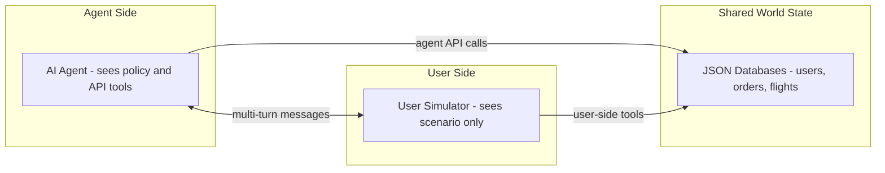
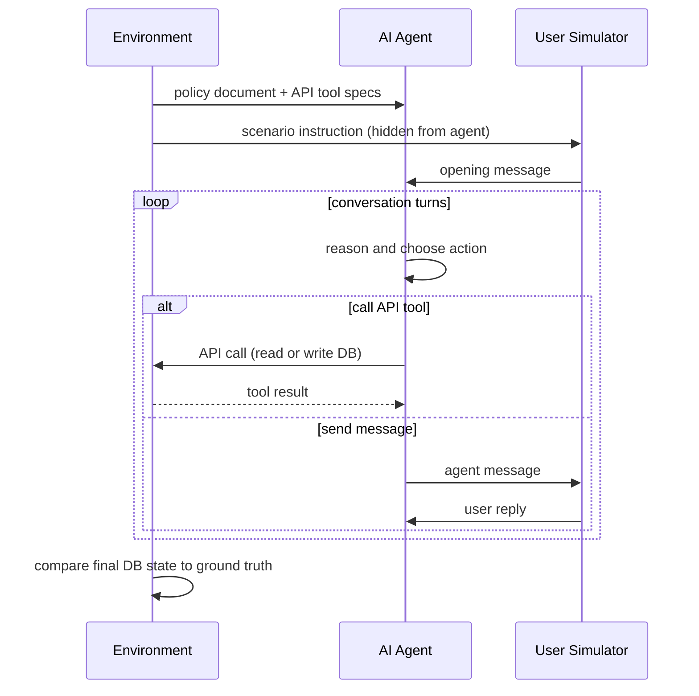
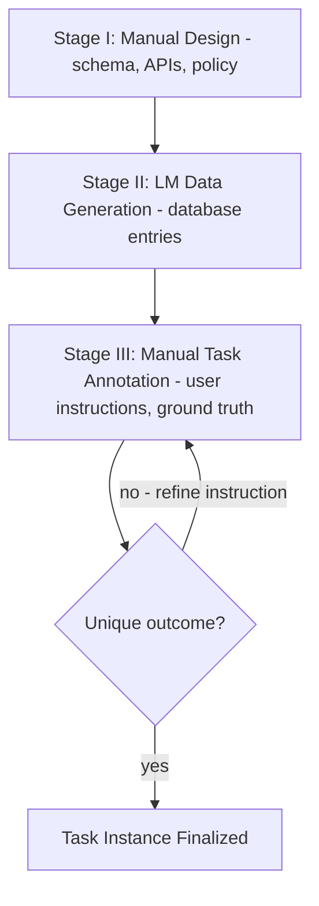

# τ-bench: Tool-Agent-User Interaction Benchmark

**Paper:** τ-bench: A Benchmark for Tool-Agent-User Interaction in Real-World Domains
**Authors:** Shunyu Yao, Noah Shinn, Pedram Razavi, Karthik Narasimhan (Sierra)
**arXiv:** 2406.12045v1 — 17 Jun 2024

**Related page:** [τ²-Bench Mechanism and Design](tau2-bench-mechanism.md)

## TL;DR

**What:** τ-bench benchmarks language agents that must interact with simulated users over multiple turns, use domain-specific API tools, and follow policy guidelines — all simultaneously.
**How:** Two customer-service domains (retail and airline) with database-backed state, a three-stage task construction pipeline, and the pass^k metric that measures consistency across repeated trials.
**The number:** Even state-of-the-art agents succeed on fewer than 50% of tasks at pass^1, and pass^k drops sharply — gpt-4o achieves 61.2% on τ-retail but only 35.2% on τ-airline.

## The Core Idea

Real-world agent deployment requires multi-turn interaction, policy adherence, and consistency at scale — but existing benchmarks test these properties in isolation. τ-bench combines all three in a single evaluation framework and shows that current models fail most dramatically on consistency (pass^k), not just average success.

## Why This Exists

Real-world agent deployment requires three properties simultaneously:

1. Multi-turn interaction with humans to gather information and resolve intents.
2. Accurate adherence to domain-specific policies and rules.
3. Consistency and reliability across millions of interactions.

Prior benchmarks test tool use or dialogue, but not both together under realistic stochasticity.

## Architecture

Each episode involves three interacting components:

- **AI Agent** — receives the domain policy document, calls agent-side API tools (read/write), and sends messages to the user.
- **User Simulator** — an LM given a scenario instruction (hidden from the agent), calls user-side tools, and responds naturally in open-ended language.
- **Shared World State** — JSON databases (users, orders/reservations, products/flights). The agent accesses it only via API; the user accesses it via separate user tools. Neither side has full visibility of the other's database.

**Episode flow** — how a single task episode runs:

## Two Domains

| | τ-retail | τ-airline |
|---|---|---|
| Databases | 500 users, 50 products, 1 000 orders | 500 users, 300 flights, 2 000 reservations |
| Write APIs | 7 | 6 |
| Non-write APIs | 8 | 7 |
| Tasks | 115 | 50 |

**τ-retail** — agent helps users cancel/modify pending orders and return/exchange delivered orders. Policy constraints include one-call-per-action rules, payment method restrictions, and refund routing rules.

**τ-airline** — agent helps users book, modify, or cancel flight reservations. Policy is more complex: membership-tier rules, checked-bag allowances, cabin-change constraints, travel insurance conditions, and certificate payment limits.

## Three-Stage Construction

**Stage I — Manual schema, API, and policy design.** Authors co-designed minimal but realistic schemas and APIs inspired by real-world counterparts. Policies are written in Markdown and passed verbatim to the agent's system prompt.

**Stage II — Automatic data generation with LMs.** A code snippet generated by gpt-4 samples scalable database entries (users, products, flights). Minor bugs fixed manually. Enables generation of thousands of entries on demand.

**Stage III — Manual task annotation and validation.** Each task instance has:
- A **user instruction** (hidden from agent) that specifies identity, intent, and preferences and guarantees exactly one valid database outcome.
- A **ground-truth annotation** listing the expected write tool calls and outputs.

Task validity is verified by running agent trials; instructions are iteratively refined until only one outcome is possible.

## Evaluation Metric: pass^k

For each task, $n$ i.i.d. trials are run; $c$ of them succeed (reward $r = 1$).

$$\text{pass}^k = \mathbb{E}_{\text{task}} \left[ \frac{\binom{c}{k}}{\binom{n}{k}} \right]$$

$$\text{pass}@k = 1 - \mathbb{E}_{\text{task}} \left[ \frac{\binom{n-c}{k}}{\binom{n}{k}} \right]$$

- $\text{pass}^k$ measures **reliability**: the probability of succeeding on all $k$ trials for the same task.
- $\text{pass}@k$ measures **coverage**: the probability of succeeding on at least one of $k$ trials.
- When $k = 1$, both equal $\mathbb{E}[r]$, the average task success rate.

The stochasticity comes from LM sampling of both agent and user messages, not from task variation — so pass^k directly captures conversational robustness.

## Empirical Results (pass^1 via function calling unless noted)

| Model | τ-retail | τ-airline | avg |
|---|---|---|---|
| gpt-4o | 61.2 % | 35.2 % | 48.2 % |
| gpt-4-turbo | 57.7 % | 32.4 % | 45.1 % |
| gpt-4-32k | 56.5 % | 33.0 % | 44.8 % |
| claude-3-opus | 44.2 % | 34.7 % | 39.5 % |
| claude-3-sonnet | 26.3 % | 27.6 % | 27.0 % |
| mistral-large | 30.7 % | 22.4 % | 26.6 % |
| mixtral-8x22b | 17.7 % | 31.6 % | 24.7 % |
| gemini-1.5-flash | 17.4 % | 26.0 % | 21.7 % |
| gemini-1.5-pro | 21.7 % | 14.0 % | 17.9 % |
| claude-3-haiku | 19.0 % | 14.4 % | 16.7 % |
| gpt-3.5-turbo | 20.0 % | 10.8 % | 15.4 % |
| meta-llama-3-70B* | 14.8 % | 14.4 % | 14.6 % |

*Llama-3 evaluated via text-ReAct; all others via function calling. Average is weighted by domains, not by tasks.

**Consistency (pass^k):** Even gpt-4o function calling, with pass^1 > 60 % on τ-retail, drops to pass^8 < 25 %. Consistent success across repeated trials is the dominant unsolved challenge.

## Method Comparison

- **Function calling > text-formatted methods** (Act, ReAct) for the same model.
- **ReAct > Act**: adding reasoning traces consistently helps by bridging the gap between observation and action formats.
- Adding a "think" function to function-calling agents did not improve performance (likely because FC models are not trained toward such internal reasoning).

## Domain Policy Ablation

Removing the domain policy document from the agent system prompt causes a sharp drop:

| Model | τ-retail (with → without policy) | τ-airline (with → without policy) |
|---|---|---|
| gpt-4o | 61.2 % → 56.8 % | 33.2 % → 10.8 % |
| gpt-3.5 | 20.0 % → 14.5 % | 10.8 % → 9.6 % |

τ-airline shows a larger drop because its rules are more complex and less covered by commonsense knowledge.

## Failure Analysis

Two dominant failure categories:

**Failure 1 — Wrong information (~55 % of failures):** The agent omits user-required information, calculates incorrect values, or provides inaccurate information that diverts the conversation. Weak models also hallucinate non-existent IDs (gpt-3.5-turbo FC: 2.08 bad ID calls per task vs. gpt-4o FC: 0.46).

**Failure 2 — Wrong decision-making (~25 % of failures):** The agent fails to understand domain-specific rules. Example: the policy states exchange tools can only be called once; the agent exchanges one item first, then cannot exchange the second.

## One Thing to Remember

τ-bench's most important finding is that **consistency (pass^k) is a qualitatively harder challenge than average success (pass^1)** — even models that occasionally succeed fail to do so reliably, and this reliability gap is what makes real-world deployment risky.

## Go Deeper

- **Read:** [τ-bench paper (arXiv:2406.12045)](https://arxiv.org/abs/2406.12045)
- **Build on:** [τ²-Bench: Mechanism and Design](tau2-bench-mechanism.md), [τ-Voice: Full-Duplex Voice Benchmark](tau-voice.md)
- **Understand the context:** [DeepSWE: Long-Horizon Software Engineering Benchmark](deepswe/index.md)
- **Reproduce:** [github.com/sierra-research/tau-bench](https://github.com/sierra-research/tau-bench)

## Key Conclusions

- No existing model reliably solves τ-bench. The highest pass^1 is 61.2 % (gpt-4o, τ-retail); τ-airline tops out at 35.2 %.
- Consistency (pass^k) is a qualitatively different and harder challenge than average success (pass^1).
- Both improved reasoning and better rule-following are needed — neither alone is sufficient.
- The benchmark is modular: new domains can be added by defining schemas, APIs, policies, and task instances.

## Open Questions

- Can retrieval-augmented or structured policy representations improve rule adherence?
- Is there a training method that specifically improves pass^k without hurting pass^1?
- How does benchmark performance correlate with real-world deployment reliability?
