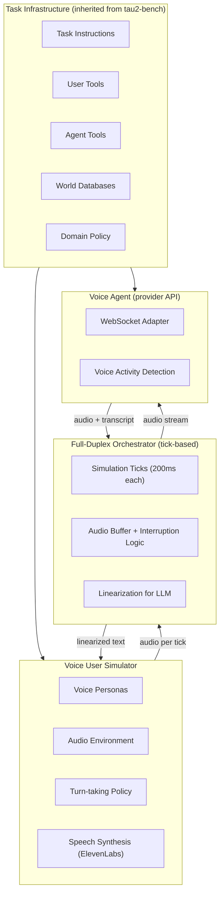
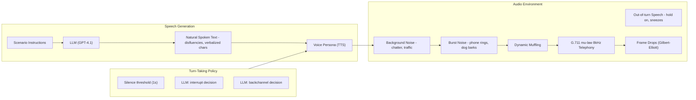
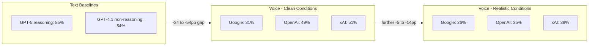

# τ-Voice: Benchmarking Full-Duplex Voice Agents on Real-World Domains

**Paper:** τ-Voice: Benchmarking Full-Duplex Voice Agents on Real-World Domains
**Authors:** Soham Ray, Keshav Dhandhania, Victor Barres, Karthik Narasimhan (Sierra.ai + Princeton)
**arXiv:** 2603.13686v1 — 14 Mar 2026

**Related pages:** [τ-bench](tau-bench.md) · [τ²-Bench Mechanism and Design](tau2-bench-mechanism.md)

## Summary

τ-Voice extends τ²-bench to full-duplex voice interaction. It is the first benchmark combining all three dimensions: **verifiable task completion** (correct API calls against real databases), **full-duplex audio** (simultaneous bidirectional speech with interruptions and backchannels), and **realistic audio environments** (noise, diverse accents, telephony degradation). The benchmark reveals a large voice–text gap: GPT-5 (text) achieves 85% pass@1, while voice agents reach only 31–51% under clean conditions and 26–38% under realistic conditions — retaining just 30–45% of text SOTA capability. Error analysis attributes 79–90% of failures to agent behavior rather than simulator artifacts.

## Motivation

Prior benchmarks evaluated task completion and conversational dynamics in isolation:

- τ-bench and τ²-bench: task completion in text-only, turn-based settings.
- Full-Duplex-Bench / v2: turn-taking and interruptions on synthetic tasks without real tool calls.
- VoiceBench, VocalBench, Audio MultiChallenge: speech understanding without task grounding.

Voice compounds text difficulty through speech disfluencies and fillers, missing punctuation, verbalization of special characters, audio environment degradation, and real-time turn-taking demands (interruptions, backchannels, silences). τ-Voice measures all of these against grounded, consequential tasks.

## System Architecture

τ-Voice extends τ²-bench (gray components) with voice-specific additions (green components). The core idea is a tick-based orchestrator that decouples simulation time from wall-clock time, allowing the user simulator LLM to run without real-time constraints.

### Full-Duplex Orchestrator

Audio is discretized into fixed-duration ticks ($\tau = 200\text{ms}$ default). Each tick, both parties exchange exactly $\tau$ ms of audio, enabling true full-duplex interaction. The agent-side buffer is formalized as:

$$a^t = (B^{t-1} \oplus \tilde{a}^t)[0:\tau]$$

$$B^t = \begin{cases} \emptyset & \text{if interrupted} \\ (B^{t-1} \oplus \tilde{a}^t)[\tau:] & \text{otherwise} \end{cases}$$

On interruption the buffer is cleared, truncating the agent's in-progress response. Overlapping speech is linearized to sequential text for the user simulator LLM using a containment-first rule.

### Voice User Simulator Pipeline

Seven voice personas span diverse accents and demographics:
- **Clean** (2): Matt Delaney (American Midwest), Lisa Brenner (suburban, impatient)
- **Realistic** (5): Mildred Kaplan (elderly US), Arjun Roy (Bengali accent), Wei Lin (Sichuan Mandarin), Mamadou Diallo (French accent), Priya Patil (Maharashtrian accent)

## Domains and Tasks

Three domains from τ²-bench, totaling 278 tasks:

| Domain | Tasks | Focus |
|---|---|---|
| Retail | 114 | Returns, exchanges, cancellations, address correction; heavy slot-filling |
| Airline | 50 | Flight changes, seat upgrades, booking modifications |
| Telecom | 114 | Plan changes, billing inquiries, authentication, account modifications |

Retail is the primary domain due to slot-filling challenges (collecting names, emails, order IDs, addresses) where end-to-end speech systems are known to struggle.

## Providers Evaluated

| Provider | Model | Release |
|---|---|---|
| OpenAI | gpt-realtime-1.5 | Feb 2026 |
| Google | gemini-live-2.5-flash-native-audio | Dec 2025 |
| xAI | grok-voice-agent | Dec 2025 |

All models use audio-native APIs with bidirectional audio streams and voice activity detection (VAD). All receive identical system prompts instructing letter-by-letter spelling for authentication.

## Evaluation Conditions

| Category | Setting | Clean | Realistic |
|---|---|---|---|
| Accents | Personas | American only | Diverse accents |
| Background noise | | None | Indoor/outdoor |
| Burst noise | | None | ~1/min |
| Frame drops | | None | ~2% (G-E model) |
| Telephony | | G.711 8kHz | G.711 8kHz |
| Muffling | | None | Dynamic |
| Involuntary sounds | | None | Coughs, sneezes |
| Non-agent-directed speech | | None | "hold on", "one sec" |
| Interruptions | | None | LLM-based |
| Backchanneling | | None | LLM-based |

Ablation conditions add one factor at a time (+Noise, +Accents, +Turn-taking) evaluated on Retail only.

## Metrics

**Task Completion:** pass@1 — comparing final database state against annotated ground truth. Spoken output verified by LLM evaluation (not string matching) to handle variability.

**Voice Interaction Quality** — four aggregate dimensions:

- **Responsiveness** = avg($R_R$, $R_Y$): $R_R$ = proportion of user turns receiving a response; $R_Y$ = proportion of interruptions where agent yields within 2s.
- **Latency** = avg($L_R$, $L_Y$): $L_R$ = time from user utterance end to agent response; $L_Y$ = time to stop speaking after interruption.
- **Interrupt** = $I_A$: proportion of turns where agent speaks before user finishes (>100% means multiple interruptions per turn).
- **Selectivity** = avg($S_{BC}$, $S_{VT}$, $S_{ND}$): correctly ignoring backchannels, vocal tics, and non-directed speech.

## Results: Task Completion

Full per-domain results (pass@1, GPT-5 text baseline):

| Domain | Provider | Text (GPT-5) | Clean | Realistic |
|---|---|---|---|---|
| All | Google | 85% | 31% (-54pp) | 26% (-59pp) |
| All | OpenAI | 85% | 49% (-36pp) | 35% (-50pp) |
| All | xAI | 85% | 51% (-34pp) | 38% (-46pp) |
| Retail | Google | 81% | 45% (-36pp) | 30% (-51pp) |
| Retail | OpenAI | 81% | 71% (-10pp) | 45% (-36pp) |
| Retail | xAI | 81% | 48% (-33pp) | 39% (-42pp) |
| Airline | Google | 83% | 28% (-55pp) | 30% (-53pp) |
| Airline | OpenAI | 83% | 48% (-35pp) | 40% (-43pp) |
| Airline | xAI | 83% | 46% (-37pp) | 36% (-47pp) |
| Telecom | Google | 90% | 20% (-70pp) | 18% (-72pp) |
| Telecom | OpenAI | 90% | 28% (-62pp) | 21% (-69pp) |
| Telecom | xAI | 90% | 58% (-32pp) | 40% (-50pp) |

**Key finding:** xAI leads slightly overall (51% Clean, 38% Realistic). Google is most robust — loses only 17% of its Clean performance vs 24–28% for others. OpenAI achieves the best single-domain score (71% Retail Clean). No provider masters all domains.

Statistical reliability confirmed by paired permutation tests (Holm-Bonferroni corrected, 100k permutations, n=114 tasks × 2 runs on Retail). All text-to-Clean and Clean-to-Realistic gaps are statistically significant (all p < 0.05, narrowest p = 0.032).

## Acoustic Ablation (Retail Domain)

| Condition | Google | OpenAI | xAI | All |
|---|---|---|---|---|
| Clean | 45% | 71% | 48% | 55% |
| +Noise | 40% (-4pp) | 67% (-4pp) | 46% (-2pp) | 51% (-4pp) |
| +Accents | 44% (-1pp) | 60% (-11pp) | 30% (-18pp) | 44% (-10pp) |
| +Turn-taking | 33% (-11pp) | 57% (-14pp) | 52% (+4pp) | 47% (-7pp) |
| Realistic (all) | 30% (-15pp) | 45% (-26pp) | 39% (-10pp) | 38% (-17pp) |

**Accents are the most damaging factor on average** (-10pp), but highly provider-specific: xAI loses 38% of its Clean capability (-18pp) while Google is nearly unaffected (-1pp). This has accessibility implications for xAI users with non-American accents. Turn-taking hurts Google most (-11pp, -25% relative). Factor interactions are complex: for xAI, accents alone devastate it but adding noise and turn-taking partially compensates.

## Voice Interaction Quality (Realistic Conditions)

| Provider | Latency | Responsiveness | Interrupt | Selectivity |
|---|---|---|---|---|
| Google | 1.14s | 69% | 21% | 54% |
| OpenAI | 0.90s | 100% | 14% | 6% |
| xAI | 1.15s | 83% | 84% | 57% |

Provider trade-offs:
- **OpenAI**: fastest latency (0.90s), perfect responsiveness (100%), lowest interrupt rate (14%), but worst selectivity (6%) — responds to nearly all backchannels and non-directed speech.
- **xAI**: best selectivity (57%), high responsiveness (83%), but highest interrupt rate (84%) — interrupts nearly once per turn.
- **Google**: lowest interrupt rate (21%), best selectivity alongside xAI (54%), but lowest responsiveness (69%) — fails to respond to 31% of user turns.

No provider achieves both reliable responsiveness and appropriate restraint simultaneously.

## Qualitative Error Analysis

Two failure cohorts were annotated across 91 failed simulations with 84% inter-rater agreement (100% after discussion):

- **Voice-Fragile**: tasks passing in text but failing in Clean audio (43 simulations, 20 tasks)
- **Noise-Fragile**: tasks passing in Clean but failing in Realistic audio (48 simulations, 19 tasks)

| Source | Error Type | Voice-Fragile | Noise-Fragile |
|---|---|---|---|
| Agent | Logical | 13 | 16 |
| Agent | Transcription | 10 | 16 |
| Agent | Hallucination | 6 | 6 |
| Agent | VAD/Unresponsive | 1 | 4 |
| Agent | Timeout | 4 | 1 |
| **Agent total** | | **34 (79%)** | **43 (90%)** |
| User | Logical | 9 | 1 |
| User | Early termination | 0 | 4 |
| **User total** | | **9 (21%)** | **5 (10%)** |

**Agent errors dominate**: 79% of Voice-Fragile failures and 90% of Noise-Fragile failures are attributed to the agent. This confirms the benchmark measures genuine agent limitations rather than simulator artifacts.

Authentication is the dominant bottleneck: agents fail to transcribe names and emails even when spelled letter-by-letter. Agents also frequently hallucinate completions (e.g., claiming to have updated an address without calling the tool) and lose track of multi-step requests. Under realistic conditions, these compound into unresponsive episodes and timeouts.

## Key Conclusions

- Voice agents retain only 30–45% of text SOTA capability under realistic conditions.
- The dominant gap is text-to-Clean, not Clean-to-Realistic — voice architecture itself is the primary barrier, not just noise.
- No single provider masters both task completion and conversational dynamics; each has a distinct weakness.
- Accents are the most damaging factor but highly provider-specific, raising accessibility concerns.
- Failures are primarily reasoning and grounding failures (logical errors + hallucinations), not purely ASR failures — the voice-text gap is not just a transcription problem.
- xAI comes closest overall (51% Clean, 38% Realistic) but leads in interrupt rate; OpenAI best in Retail; Google most robust to degradation.

## Limitations

- English only; TTS rather than recorded speech — accent findings are indicative, not definitive.
- No measurement of agent speech quality (tone, naturalness) or user satisfaction.
- Simulator is more patient than real users (perfect memory, instantaneous tool calls).
- Transcript injection bypasses ASR on the agent side (agent speech was intelligible in 100% of 91 sampled simulations, so impact is minimal).

## Open Questions

- Can cascaded ASR→LLM→TTS baselines isolate voice modality effects from architecture choices?
- Can models improve selectivity (ignoring non-directed speech) without sacrificing responsiveness?
- How do provider-specific accent vulnerabilities translate to real-world accessibility gaps with genuine recorded speech?
- Is there a training signal or architecture change that specifically targets the Clean-to-Realistic gap?

## Related Pages

- [τ-bench](tau-bench.md) — Original text-only benchmark (two domains, pass^k metric)
- [τ²-Bench Mechanism and Design](tau2-bench-mechanism.md) — Dec-POMDP dual-control formalism that τ-Voice inherits
