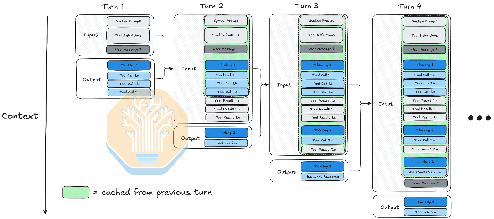
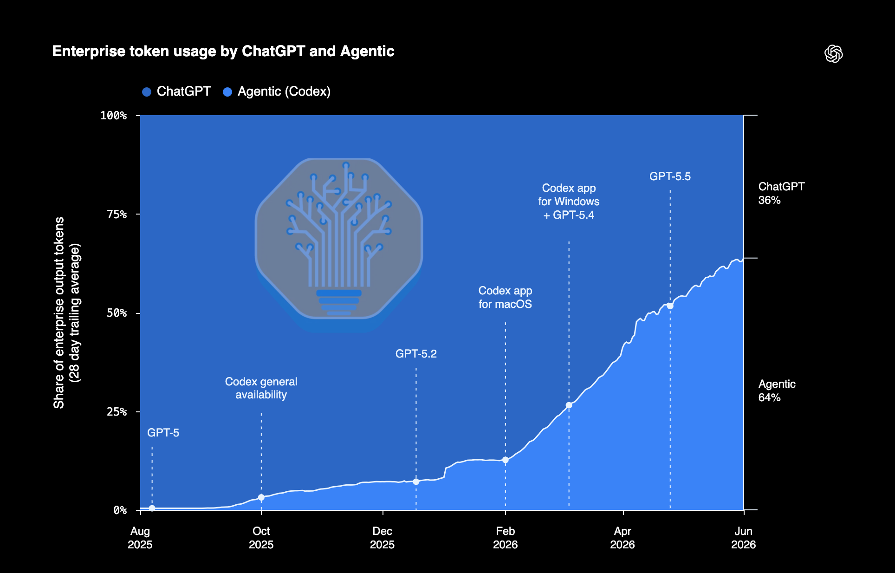
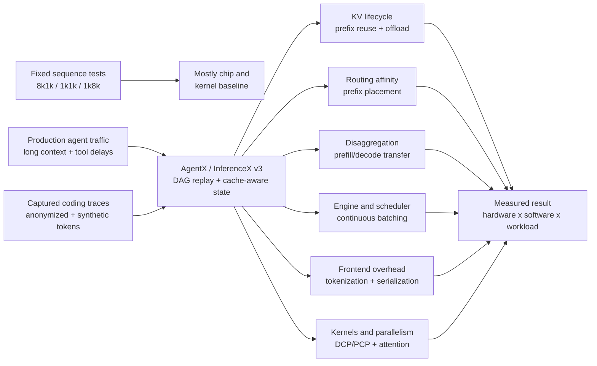

# AgentX / InferenceX v3: Does the CUDA Moat Hold?

**Source:** [AgentX - InferenceXv3: Does CUDA Moat Hold up in Agentic Inferencing?](https://newsletter.semianalysis.com/p/agentx-inferencexv3-does-cuda-moat)
**Author:** Cam Quilici
**Published:** 2026-08-24
**Captured:** 2026-08-25

**Related pages:** [Frameworks](../index.md), [vLLM](../vllm/index.md), [SGLang](../sglang/index.md), [vLLM prefill/decode disaggregation](../vllm/prefill-decode-disaggregated-deployment/index.md), [vLLM DCP and PCP](../vllm/vllm-context-parallelism.md), [KV Cache](../../terms/kv-cache.md), [Context Parallelism](../../terms/context-parallelism.md), [Speculative Decoding](../../terms/speculative-decoding.md), [Chunked Prefill](../../terms/chunked-prefill.md)

## TL;DR

**What:** AgentX is the agentic scenario added to InferenceX v3: it replays long-context, multi-turn coding sessions with repeated prefixes, tool delays, sub-agent bursts, and up to 1M-token context.

**How:** The benchmark captures anonymized request structure, reconstructs sessions as dependency graphs, warms cache state, and measures the whole serving stack: router, scheduler, engine, KV cache, transfer path, kernels, and frontend.

**The number:** The source reports a collection corpus of more than $3M in traffic across 8,000+ sessions, 3.4M requests, and 610B tokens, with a released AgentX subset of 393 sessions.

## The Big Picture

*Source: [captured SemiAnalysis article](https://newsletter.semianalysis.com/p/agentx-inferencexv3-does-cuda-moat). 1. Each turn carries forward the system prompt, tool definitions, and prior history. 2. Green regions are reusable prefix state rather than fresh prefill work. 3. Tool calls and results grow the next input. 4. Sub-agents create separate, bursty branches that compete for cache and scheduler capacity.*

The figure answers the first question a fixed-length benchmark hides: **what state does an agentic server carry from one request to the next?** The answer is not just a prompt and a response. It is a growing session, a set of tool-driven delays, and sometimes several concurrent branches.

## Why This Exists

Imagine a coding agent whose first request contains a system prompt, tool definitions, and a user task. The model thinks, calls several tools, and returns a short response. On the next turn, the client sends the accumulated history again, plus tool results and a new user message. If the prefix is resident, the server can reuse most of the old KV state and prefill only the changed suffix. If a sub-agent starts, a fresh context arrives in a burst while the main session is waiting.

A fixed `8k1k` test sees one 8k prefill and one 1k decode. It does not ask whether the main prefix survived the sub-agent burst, whether the request was routed to the worker holding that prefix, whether HBM overflow was absorbed by DRAM, or whether a disaggregated transfer arrived before the decode worker stalled. AgentX exists to make those questions visible.

*Source: [captured SemiAnalysis article](https://newsletter.semianalysis.com/p/agentx-inferencexv3-does-cuda-moat). This source chart is the article's motivation for treating agentic traffic as a first-class inference workload; it is not a hardware benchmark result.*

The article's practical framing is therefore **state management under repeated, irregular load**. Hardware still matters, but the measured result also depends on whether the software stack can preserve, locate, move, reconstruct, and schedule the state that agentic traffic creates.

## The Landscape

The editable source is [landscape.mmd](assets/landscape.mmd).

*Landscape synthesis from the captured article. Fixed-sequence scenarios remain useful for isolating kernel and chip progress; AgentX adds the stateful system effects that production agent traffic exercises. The branch relationships are an explanatory model, not a claim that one component alone determines every result.*

## The Core Idea

**Agentic inference is a state-management problem whose hardware score is mediated by software.** A GPU can have strong arithmetic, memory, and interconnect capabilities and still lose a realistic comparison if its engine drops useful prefixes, routes sessions away from their cache, serializes transfers, recompiles variable shapes, or lets prefill starve decode. AgentX does not prove that CUDA has or lacks a permanent moat; it shows that the relevant moat is partly the accumulated software ecosystem and the speed with which that ecosystem closes workload-specific gaps.

## Symbol Map

The article mixes standard serving metrics with AgentX-specific workload labels. `pXX` means the percentile across measured requests or sessions; a p90 value describes the slow tail rather than the average. `ISL` and `OSL` are sequence lengths, while `TTFT`, `TPOT`, and `E2EL` describe different parts of the user-visible response.

| Symbol or term | Human name | Scope | Plain meaning |
|---|---|---|---|
| `ISL` | input sequence length | per request | Number of input tokens, including cached and uncached context. |
| `OSL` | output sequence length | per request | Number of generated output tokens. |
| `TTFT` | time to first token | per request | Delay from request admission until the first output token. |
| `TPOT` | time per output token | decode stream | Average time between generated tokens; lower is more interactive. |
| `TPS` | tokens per second per user | user or run | The article's interactivity measure, approximately the inverse of TPOT. |
| `E2EL` | end-to-end latency | per request | Time from request start until the requested output completes. |
| `E2NI` | E2E normalized interactivity | derived metric | The article's experimental $OSL/E2EL$ metric, combining output length and completion latency. |
| `TCO` | total cost of ownership | deployment | Cost normalization used for hardware and system comparisons. |
| `KV` | key-value cache | request state | Stored attention keys and values reused across turns or related requests. |
| `HBM` | high-bandwidth memory | accelerator tier | Fast accelerator-local memory that limits resident KV working set. |
| `DRAM` | host dynamic RAM | offload tier | Larger, slower memory used to hold KV state after HBM fills. |
| `DCP / PCP` | decode / prefill context parallelism | distributed execution | DCP shards persistent KV context; PCP partitions prefill query work. |
| `PD disagg` | prefill/decode disaggregation | deployment topology | Separate prefill and decode workers connected by a KV-transfer path. |

The source defines `E2EL` approximately as `TTFT + OSL * TPOT` and therefore makes `E2NI` useful as a compact comparison, but it explicitly calls the metric experimental. It can penalize high TTFT heavily and does not capture every nuance of disaggregation.

## Deep Dive

### 1. AgentX models stateful traffic, not static prompts

**What it does:** AgentX adds multi-turn, long-context, high-prefix-reuse, and sub-agent behavior to InferenceX's fixed sequence scenarios.

**Why it matters:** The repeated prefix is where a serving system can save the most work, but it is also where cache capacity, eviction policy, routing, and offload behavior become coupled.

**How it works:**

| Workload property | Runtime consequence |
|---|---|
| Many turns | Earlier context is sent again and should become a prefix-cache hit. |
| Long context | KV state grows until HBM capacity or memory bandwidth becomes a boundary. |
| High prefix reuse | A cache hit can remove most of prefill, but only if the right state remains resident or can be fetched. |
| Sub-agent bursts | Fresh branches arrive while the main conversation remains live, creating irregular cache churn. |
| Tool-use delays | The client is idle between turns, so worker occupancy and cache lifetime become separate decisions. |

**The intuition:** A static benchmark asks how fast a server handles one wave; AgentX asks how well it remembers and schedules an evolving session.

**A concrete example:** The article reports that at 384 concurrent traces, a B300 vLLM configuration reached a 91% HBM cache hit rate plus a 1.36% DRAM hit rate, while a B200 configuration at concurrency 196 reached 73% HBM hits and nearly 20% DRAM hits. The difference is a capacity and working-set effect, not just a difference in arithmetic throughput.

**Remember:** In agentic serving, cache residency is part of the workload definition.

### 2. Trace collection preserves workload shape while hiding content

**What it does:** The source collects real request traces but releases anonymized, synthetic-content data so prefix structure and timing can be replayed without exposing prompts, code, tool arguments, or tool results.

**Why it matters:** Reusing the original request sizes and prefix relationships is essential for cache experiments, while replaying private content would be inappropriate.

**How it works:**

1. A proxy records HTTP request/response timing, conversation IDs, sub-agent IDs, and related metadata from Claude and Codex sessions.
2. The released subset replaces token content with session-scoped chained hashes grouped into 64-token blocks, so matching prefixes still match.
3. AIPerf fills those blocks deterministically from a synthetic coding/tool-use token pool at replay time.
4. The source removes Claude Code-specific monitor/title requests, anomalously over-counted inputs above 990k tokens, and duplicates caused by dropped connections.
5. Model-specific padding approximates hidden provider-side templates, tokenizers, tools, and multimodal token accounting.

**The intuition:** The benchmark preserves the shape of memory traffic, not the meaning of the conversations.

**A concrete example:** Two turns with the same accumulated prefix receive the same hash-prefix pattern and therefore can exercise a cache hit, even though the replay server never sees the original employee's source code or tool output.

**Remember:** AgentX is faithful to timing, lengths, branching, and reuse patterns, not to original semantic content.

### 3. DAG replay turns sub-agents into measurable concurrency

**What it does:** AIPerf represents a session as a directed acyclic graph in which requests are nodes and dependency edges carry inter-turn delays.

**Why it matters:** A main agent can overlap multiple sub-agents, and a later main request may wait for only one branch group. A linear request list would erase that scheduling pressure.

**How it works:**

| Trace element | Replay meaning |
|---|---|
| Main request | A node in the primary conversation chain. |
| Sub-agent branch | A separate request stream spawned from a recent main request. |
| Join request | The later main request that waits for a branch group to finish. |
| Edge delay | Tool-use or client-side time that must elapse before the next request is eligible. |
| Auxiliary request | A one-off branch that does not rejoin the main conversation. |

AIPerf infers spawn and join points from request ordering, IDs, and timestamps. The source keeps both the recorded main-path delay and branch completion constraint when timestamp data cannot reveal exact causality.

**The intuition:** The replayer turns a chat transcript into a small scheduling graph, so branch overlap becomes load rather than prose.

**A concrete example:** A main request can spawn sub-agents 001 and 002, then issue its next request once that group joins, while longer-running sub-agents 003 and 004 continue in parallel for a later join. The worker must serve all eligible branches without destroying the main prefix's cache state.

**Remember:** Sub-agent topology is an input to the benchmark, not an incidental detail in the logs.

### 4. Cache, routing, and transfer form one performance loop

**What it does:** AgentX makes prefix placement and movement visible across HBM, DRAM, prefill/decode workers, and distributed ranks.

**Why it matters:** A cache hit only helps if the matching state is reachable at the time the request is scheduled. A hit on the wrong rank can cost a full recomputation, and a hit in a slower tier can trade memory pressure for latency.

**How it works:**

1. A router chooses a worker or rank, ideally where the session's prefix already lives.
2. The engine scheduler admits prompt and decode work under token and memory budgets.
3. The KV manager retains complete or hybrid cache groups, evicts transient window state, and may offload reusable state.
4. A transfer engine moves KV between GPU memory, host DRAM, and remote prefill/decode workers.
5. Context-parallel execution can shard query or KV work, but the cache layout and attention reductions must agree with the topology.
6. The resulting TTFT, TPOT, cache hit rate, and throughput change the next closed-loop traffic state.

**The intuition:** The fastest cache is the one at the worker that can use it before the scheduler's deadline.

**A concrete example:** The article describes MiniMax M3 runs where data-parallel attention can route a 300k-token session to a rank that does not own its prefix. The request then recomputes despite a theoretical cache opportunity, showing why cache locality is a routing constraint.

**Remember:** KV cache is a distributed placement problem once the workload leaves one GPU and one turn.

### 5. Software maturity is part of the hardware comparison

**What it does:** The benchmark exposes optimization gaps and feeds fixes into engines, routers, cache managers, transfer libraries, and kernels.

**Why it matters:** The measured winner can change when the engine selects a better kernel, avoids a copy, retains a hybrid state, or removes a frontend synchronization. A hardware comparison that holds software maturity constant only answers a narrower question.

**How it works:**

| Layer | Examples described in the source | AgentX-sensitive cost |
|---|---|---|
| vLLM | Selective hybrid-cache retention, asynchronous lookups, hybrid CPU offload, delta-only stores | Keeping long prefixes and recurrent state reusable across turns. |
| SGLang | Sliding-window reclamation, cache-affinity routing, runtime context-length scalars, decode interval control | Avoiding cache churn, recompilation, and prefill starvation. |
| TensorRT-LLM | Boundary-aware incremental tokenization, chunked KV transfer, context graph producers | Reducing repeated frontend work and strided-transfer descriptor overhead. |
| Dynamo | Batched KV matching, ownership leases, expiry buckets, zero-copy request paths | Scaling router bookkeeping with long-lived shared prefixes. |
| LMCache and Mooncake | Chunked loading, hybrid-group storage, AMD transfer and wheel support | Making offload progress and portable installation possible under pressure. |
| AITER and context parallelism | 64-bit cache addressing, DCP/PCP paths, persistent long-context kernels | Keeping large caches and sharded attention correct and populated. |

The article reports examples such as vLLM hybrid CPU offload improving output throughput by 81.7% against recomputing an evicted prefix, SGLang's runtime-length change improving AgentX output throughput by 26.75%, Dynamo's batched router work improving output throughput by 22.2% at concurrency 512, and TensorRT-LLM incremental tokenization reducing mean processing time from 185.1 ms to 11.3 ms across 1,087 transitions. These are source-reported point measurements, not universal speedup factors.

**The intuition:** In realistic serving, many small state and bookkeeping costs multiply until they dominate a theoretically faster kernel.

**A concrete example:** The article reports that dropping an unused decode-side prompt transfer increased per-user output throughput by 18.0% and decode throughput per GPU by 12.7% on an AgentX GB300 run. Nothing about the model's arithmetic changed; the transfer was simply not needed by the decode forward.

**Remember:** A CUDA moat, or any competing advantage, includes the ecosystem's ability to turn hardware features into correct production paths.

## Putting It Together

Follow one main-agent session with a sub-agent branch through one closed-loop measurement:

| Step | Actor | Input state | Action | Output state |
|---:|---|---|---|---|
| 1 | Trace collector | Real client requests and timing | Records session, request, branch, and delay metadata | Private trace with conversation topology and growing prefixes |
| 2 | Dataset builder | Private content and request lengths | Hashes 64-token blocks, removes anomalies, and keeps prefix relationships | Released session-shaped trace without original content |
| 3 | AIPerf warmup | Deterministic seed and a selected 25%-75% session point | Primes active main and sub-agent streams, then advances ten short requests | Cache state resembles a running service rather than a cold start |
| 4 | Router | Main request plus possible sub-agent requests | Uses the deployment's routing and cache-affinity policy | Each request is assigned to a worker/rank with some local cache state |
| 5 | Engine and KV manager | Long input with cached and uncached regions | Matches prefix blocks, admits prompt/decode work, and fetches or offloads missing state | A request enters execution with a concrete cache hit/miss and memory tier |
| 6 | Distributed runtime | Main stream and a newly spawned branch | Transfers or shards KV through PD disaggregation, DCP/PCP, or a local engine path | Prefill and decode work overlap according to actual topology and transfer timing |
| 7 | Model runner and frontend | Variable batch, context length, and output lengths | Runs kernels, samples, tokenizes, serializes, and streams output | TTFT, TPOT, cache telemetry, and completed tokens for this turn |
| 8 | Closed-loop replayer | Completion plus measured inter-turn delay | Starts the next main or branch request and samples another session when one finishes | The next workload state depends on the system's own speed and cache behavior |

The final step is the crucial feedback loop: a faster configuration may complete more turns during the one-hour profile, observe a different mix of traces, and create a different live cache population than a slower configuration. AgentX therefore measures a service interacting with a workload, not an isolated kernel invocation.

## What This Buys You

### The headline claim

**AgentX makes inference performance accountable to the full agentic serving stack.** It is especially valuable for comparing how hardware and software behave when long-lived, cache-heavy, branching sessions cross memory, routing, and interconnect boundaries.

### How we know: source-reported evidence

| Evidence | What it establishes | Boundary |
|---|---|---|
| 393 released sessions; 175 with sub-agents; 1,697 sub-agent rollouts | The benchmark includes branching and repeated session state, not only fixed prompts. | The released corpus is a subset of the larger collection and is heavily informed by coding-agent traffic. |
| Median ISL 142k, OSL 444, inter-turn latency 3.84 seconds | The typical request has long input, short output, and client-side gaps unlike a simple 8k1k test. | Distributions depend on the harness, model tokenizer, and provider-side context that must be approximated. |
| One-hour profiling after two-stage warmup; deterministic seeds; five-minute idle cap | Runs begin from a controlled warm state and can be repeated under the same configuration. | Closed-loop completion rates still cause configurations to encounter different samples. |
| vLLM, SGLang, TensorRT-LLM, ATOM, AITER, Dynamo, LMCache, and Mooncake changes | The benchmark found actionable costs across the stack, from cache ownership to frontend serialization. | A PR's local gain is not a transferable speedup for every model, SKU, or deployment. |
| Date-scoped NVIDIA and AMD comparisons | Engine maturity, topology, HBM capacity, and software path can change the apparent hardware ranking. | Results are a snapshot as of the article's August 21, 2026 comparison points, not a permanent leaderboard. |

### The mechanism behind the numbers

Fixed sequence tests mostly isolate a chip and a kernel: load a prompt, prefill it, decode a fixed number of tokens, and discard the state. AgentX adds a state loop. Prefixes can be reused or evicted; requests can be routed to the wrong owner; offload can save capacity but add transfer latency; variable lengths can trigger compilation or tail effects; and a scheduler choice can improve throughput while hurting TTFT. The result is a systems measurement in which software determines how much of the hardware's theoretical capability reaches the user.

The article's hardware results illustrate this interaction rather than settle it. It reports B300 vLLM and B200 SGLang ahead of MI355X on several frontier-model comparisons, while MI355X ATOM wins selected performance-per-dollar or end-to-end regions against B200 vLLM and, in one range, GB300 vLLM. Because those comparisons use different engines and rapidly changing revisions, the defensible conclusion is conditional: **hardware ranking is a function of hardware, software stack, workload, and latency target.**

> **Warning:** Do not read a high TPS point as a complete user-experience win. The source repeatedly shows a tradeoff between interactivity and TTFT, and it treats E2E normalized interactivity as experimental. Compare the same model, engine family, topology, cache policy, and latency target before drawing a hardware conclusion.

## Where It Breaks

| Failure mode | When it happens | Impact |
|---|---|---|
| Synthetic content mismatch | Replay fills hashed blocks with synthetic coding/tool-use tokens rather than original provider content | Speculative-decoding acceptance and kernel behavior may differ from real semantic traffic even when length and reuse match. |
| Hidden provider context | Server-side templates, proprietary tokenizers, reasoning blocks, tools, images, and documents are only approximated | Reconstructed token counts and cache boundaries are estimates, not an exact view of the provider's internal request. |
| Claude Code and coding bias | The released corpus is a 393-session subset of a larger proxy collection and primarily reflects Claude Code-style traffic | Results should not be generalized automatically to every agent harness, modality, or tool pattern. |
| Closed-loop sample drift | Faster and slower configurations complete different numbers of turns during the one-hour run | Runs with identical seeds are reproducible, but configurations do not encounter perfectly identical live workloads. |
| Metric tradeoff | A configuration optimizes TPS or throughput while TTFT, p90 tail, or task completion worsens | One scalar or one Pareto coordinate can hide the latency behavior users actually feel. |
| Experimental E2E metric | E2E normalized interactivity uses $OSL/E2EL$ and does not capture every PD-disaggregation nuance | Use it as a supplemental comparison, not a universal replacement for TTFT, TPOT, and task-level completion. |
| Moving target | AgentX versions, upstream PRs, model support, and vendor kernels change quickly | Compare runs from the same minor harness version and record the exact software configuration. |
| Approximate impact count | The article describes AgentX influence as both "50+" and "70+" upstream PRs in different sections | Treat the number as an approximate ecosystem-impact claim, not an audited exact total. |

## One Thing to Remember

**AgentX measures whether an inference system can remember, find, move, and schedule a growing session state.** Its CUDA-moat lesson is not that one vendor always wins; it is that production advantage emerges from the product of hardware, serving software, memory hierarchy, routing, interconnect, and workload shape.

## Go Deeper

- **Read:** [AgentX / InferenceX v3 source article](https://newsletter.semianalysis.com/p/agentx-inferencexv3-does-cuda-moat)
- **Explore:** [InferenceX dashboard](https://inferencex.semianalysis.com/) and [public AgentX data](https://inferencex.semianalysis.com/datasets)
- **Use the dataset:** [AgentX Claude Code traces on Hugging Face](https://huggingface.co/datasets/semianalysisai/cc-traces-weka-062126) and the [256k truncated variant](https://huggingface.co/datasets/semianalysisai/cc-traces-weka-062126-256k)
- **Understand the runtime context:** [vLLM prefill/decode disaggregation](../vllm/prefill-decode-disaggregated-deployment/index.md), [vLLM DCP and PCP](../vllm/vllm-context-parallelism.md), [vLLM continuous batching](../vllm/vllm-continuous-batching/index.md), and [SGLang](../sglang/index.md)
- **Understand the state:** [KV Cache](../../terms/kv-cache.md), [Context Parallelism](../../terms/context-parallelism.md), [Speculative Decoding](../../terms/speculative-decoding.md), and [Chunked Prefill](../../terms/chunked-prefill.md)
- **Reproduce:** [InferenceX repository](https://github.com/SemiAnalysisAI/InferenceX) and [AIPerf](https://github.com/ai-dynamo/aiperf); this workspace did not reproduce the multi-GPU runs.
