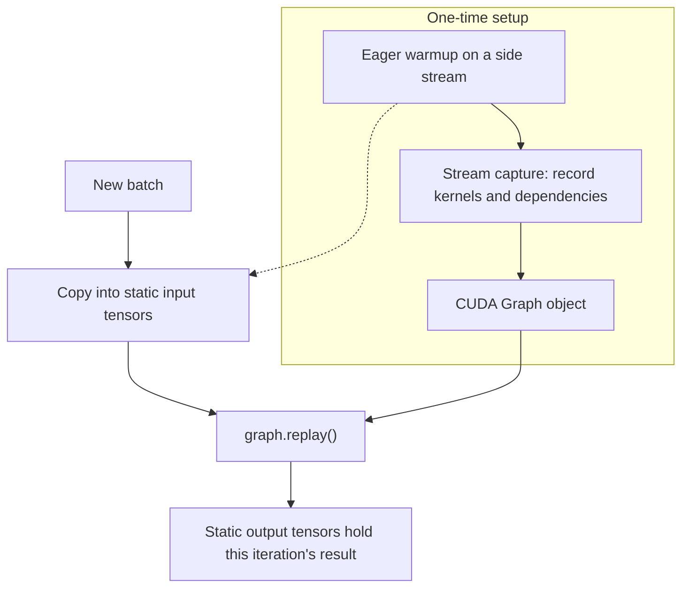
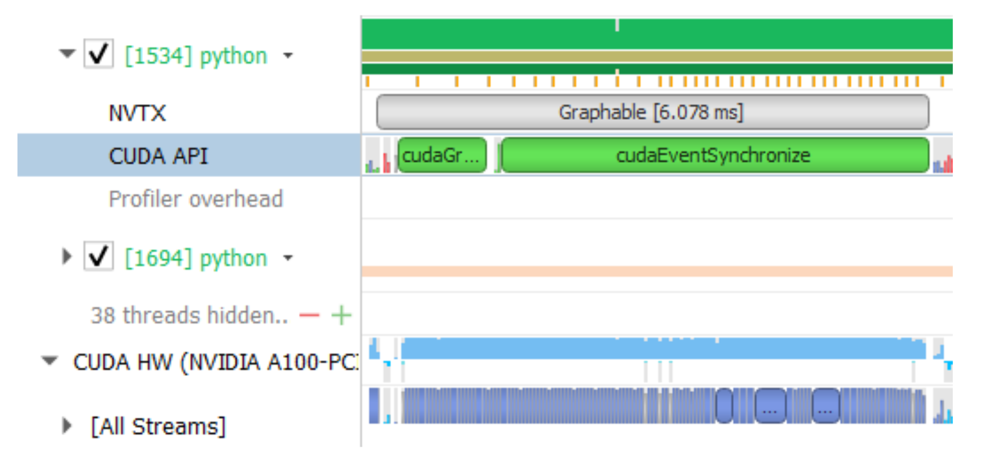

# CUDA Graphs in PyTorch: Capture Once, Replay Many

**Source:** [Accelerating PyTorch with CUDA Graphs](https://pytorch.org/blog/accelerating-pytorch-with-cuda-graphs/), captured on 2026-08-10.

**Authors:** Vinh Nguyen, Michael Carilli, Sukru Burc Eryilmaz, Vartika Singh, Michelle Lin, Natalia Gimelshein, Alban Desmaison, and Edward Yang.

**Related pages:** [CUDA Programming Model](../index.md), [vLLM Architecture and Code Organization Overview](../../vllm/vllm-overview.md), [vLLM-Ascend Architecture](../../vllm-ascend/architecture.md)

## TL;DR

**What:** A CUDA Graph bundles a repeated sequence of GPU operations into one replayable execution graph instead of asking the CPU to launch every kernel separately.

**How:** Warm up the workload, capture graph-safe work using stable input and output tensors, copy each new batch into those same tensor addresses, and call `graph.replay()`.

**The number:** The source reports up to 1.70x end-to-end speedup for its 272-GPU Mask R-CNN configuration, a 5x speedup for the graphed backbone itself, and 1.12x for its 4,096-GPU BERT configuration.

## The Big Picture


*Original Figure 1 from the [captured PyTorch article](https://pytorch.org/blog/accelerating-pytorch-with-cuda-graphs/). The upper timeline pays CPU launch latency before each short GPU kernel; the lower timeline builds one graph and submits the sequence as a single launch, so the repeated gaps largely disappear.*

The article's picture is the fastest way to remember the optimization: **the graph does not make the mathematical work disappear; it removes repeated work-submission overhead around that computation.** The first graph build is extra setup, so the benefit appears when the same workload repeats often enough to amortize capture.

The editable synthesized flow below connects the picture to the PyTorch API. Its source is [cuda-graphs-flow.mmd](assets/cuda-graphs-flow.mmd).



*Synthesized execution map, not a source figure. 1. Warmup lets allocators and kernels settle. 2. Capture records a fixed execution trace. 3. Each iteration updates the captured buffers and replays the trace.*

## Why This Exists

Consider a training step or inference request that runs five short GPU kernels: A, B, C, D, and E. In eager execution, Python, C++, the framework, and the CUDA driver help prepare and launch each operation separately. When the kernels themselves take only a few microseconds, the CPU-side submission work can leave visible idle gaps on the GPU timeline.

This is a **launch-bound** workload: the GPU is capable of doing the arithmetic quickly, but the CPU cannot feed it with enough work per submission. The problem becomes more visible with small batches, short kernels, faster GPUs, and distributed jobs where every rank must launch matching work.

CUDA Graphs turn the repeated sequence into a reusable object. The first execution pays for setup and capture; later iterations submit the whole recorded sequence through one graph launch. The optimization is therefore most useful when the same shape and control-flow path repeats many times.

## The Core Idea

A CUDA Graph is a recorded dependency graph of GPU work. During capture, operations issued to a CUDA stream become graph nodes instead of running normally. After capture, replay submits those nodes and their dependencies together. **The central trade is dynamic flexibility for low CPU overhead:** eager execution can decide arguments and shapes every iteration, while replay assumes the captured execution is still valid.

The word "graph" matters because the object is more than a list. CUDA records the operations and the dependencies between them, including kernels and supported communication work. The runtime can then launch the recorded structure with `cudaGraphLaunch` rather than repeating the entire dispatch path from Python through the CUDA driver.

## The Rules That Make Replay Possible

### Static shapes and control flow

A replay follows the captured path. The operations inside the graph should therefore see the same tensor shapes and the same control-flow structure on every iteration. Data values may change; the graph's structure may not.

Dynamic behavior can still live outside the graph. For example, a data-dependent branch can run eagerly and call one of several graphed modules. This is the purpose of `torch.cuda.make_graphed_callables`: graph the stable sections while leaving the decision logic eager.

### Stable memory addresses

The graph reuses the same pointer arguments captured during setup. A new Python tensor allocated for every batch is not automatically the graph's input. Instead, keep long-lived capture tensors and copy new values into them:

```python
static_input.copy_(new_input)
static_target.copy_(new_target)
graph.replay()
```

The copy changes the bytes at the known address; it does not change the graph's pointer arguments. The output and gradient tensors are similarly reused, so read them after replay before the next iteration overwrites them.

### Warmup before capture

Warm up the workload for a few eager iterations before capture, using a side stream that is ordered with the current stream. This lets lazy initialization, kernel selection, memory allocation, and optimizer state creation happen before the graph records its fixed execution.

For training, warmup must represent the real kind of work being captured. If `optimizer.step()` is inside the graph, use real warmup batches rather than only placeholder values, because the optimizer's state and allocation behavior are part of the captured path.

## A Minimal Full-Training Pattern

The following is a compact version of the source article's pattern. `model`, `loss_fn`, `optimizer`, and the model dimensions are assumed to have been created already. The important parts are the side-stream warmup, long-lived static tensors, capture context, and copy-then-replay loop.

```python
static_input = torch.randn(N, D_in, device="cuda")
static_target = torch.randn(N, D_out, device="cuda")

warmup_stream = torch.cuda.Stream()
warmup_stream.wait_stream(torch.cuda.current_stream())
with torch.cuda.stream(warmup_stream):
    for _ in range(3):
        optimizer.zero_grad(set_to_none=True)
        prediction = model(static_input)
        loss = loss_fn(prediction, static_target)
        loss.backward()
        optimizer.step()
torch.cuda.current_stream().wait_stream(warmup_stream)

graph = torch.cuda.CUDAGraph()
optimizer.zero_grad(set_to_none=True)
with torch.cuda.graph(graph):
    static_prediction = model(static_input)
    static_loss = loss_fn(static_prediction, static_target)
    static_loss.backward()
    optimizer.step()

for batch, target in batches:
    static_input.copy_(batch)
    static_target.copy_(target)
    graph.replay()
```

### What each phase is doing

| Phase | What happens | Why it matters |
|---|---|---|
| Allocate | `static_input`, `static_target`, and graph outputs are created once on CUDA | Their addresses become the graph's stable interface. |
| Warm up | Eager forward, backward, and optimizer steps run on a side stream | Lazy setup and memory behavior happen before capture. |
| Capture | `torch.cuda.graph(graph)` records the training step | The graph remembers the kernels, dependencies, and pointers. |
| Update | New batches are copied into the static input tensors | Values change without changing pointer arguments. |
| Replay | `graph.replay()` runs forward, backward, and optimizer step | One graph launch replaces repeated CPU dispatch. |

## Graph the Safe Islands, Keep the Rest Eager

End-to-end capture is not a requirement. Real networks often contain dynamic control flow, dynamic shapes, CPU-side decisions, or synchronization points that cannot be placed inside one graph. `torch.cuda.make_graphed_callables` accepts a module or callable plus sample inputs and returns a graphed replacement for the capture-safe portion.

A common shape is:

```python
graphed_module = torch.cuda.make_graphed_callables(module, (sample_input,))

if choose_fast_path:
    hidden = graphed_module(hidden)
else:
    hidden = fallback_module(hidden)
```

The branch stays eager, while either stable module can be graphed. The sample input's `requires_grad` state must match the real inputs that the graphed callable will receive. This partial strategy often gives a better engineering tradeoff than forcing every operation in a large model to become graph-safe.

## Distributed Training: NCCL Can Be Inside the Graph

The same submission problem applies to NCCL kernels for collective and peer-to-peer communication. In a data-parallel training step, the forward pass, backward pass, and `AllReduce` may otherwise require separate CPU launches. With graph-compatible NCCL work, those operations can be bundled into one replayable sequence.

There is a second benefit beyond fewer launches: every rank follows a recorded schedule with less CPU timing jitter. In a large distributed job, one slow rank can delay the collective for every other rank. A graph cannot fix an algorithmically unbalanced workload, but it can reduce launch-timing noise around the communication that all ranks must perform.

## What This Buys You

### The headline claim

CUDA Graphs help when CPU launch and synchronization overhead is a meaningful fraction of a repeated GPU workload. They are not a general replacement for kernel optimization, larger batches, or better communication algorithms.

### How we know: source benchmarks

| Workload | Configuration in the source | Reported result |
|---|---:|---:|
| Mask R-CNN | 272 GPUs | 1.70x overall speedup |
| Mask R-CNN backbone | Same optimization, graphed portion only | 31 ms to 6 ms, about 5x |
| BERT | 4,096 GPUs | 1.12x speedup |

The source also reports meaningful gains for a recommendation workload at small batch sizes, where many short kernels make CPU overhead especially visible.

### The mechanism behind the numbers



*Original Figure 4 from the [captured PyTorch article](https://pytorch.org/blog/accelerating-pytorch-with-cuda-graphs/). The graph launch is visible in the CUDA API row while the GPU timeline becomes a much tighter sequence of kernel work.*

The end-to-end result is usually smaller than the speedup of the graphed region. In the Mask R-CNN example, the backbone improved by about 5x, but the whole configuration improved by about 1.7x because data loading, ungraphed model sections, communication, and other work still contribute to total time. **Graph the portion that is both repeated and launch-bound, then measure the whole step.**

### How to read these numbers

The figures are historical results from the source article's PyTorch v1.10-era beta API and specific model configurations. Treat them as evidence for the mechanism, not as a current speedup promise for every GPU or PyTorch release. Your workload needs a profiler trace showing CPU launch gaps and a graph-safe repeated path before these numbers become a useful expectation.

## Putting It Together: One Repeated Training Step

1. **Prepare:** Allocate static CUDA input, target, output, gradient, and optimizer-state tensors that will live across iterations.
2. **Warm up:** Run several real-shaped eager steps on a side stream and order the main stream after the warmup stream.
3. **Capture:** Enter `torch.cuda.graph(...)` and execute the stable forward, backward, optimizer, and communication path once.
4. **Choose:** Keep dynamic control flow, dynamic shapes, CPU decisions, or unavoidable synchronization outside the graph, or graph only stable submodules.
5. **Feed:** Copy the next batch into the captured input buffers rather than replacing those tensors with newly allocated ones.
6. **Replay:** Call `graph.replay()`. The graph executes the same kernels with the new bytes and updates the static output and gradient buffers.
7. **Inspect:** Read the outputs and profile the complete iteration. Compare CPU launch gaps, GPU idle time, and end-to-end throughput against eager execution.
8. **Repeat:** Amortize the one-time capture and setup cost over the many iterations that reuse the same graph.

## Where It Breaks

| Failure mode | Concrete condition | Impact |
|---|---|---|
| Dynamic shape | A captured operation receives a different shape on replay | The fixed graph no longer describes the work; capture may fail or the path must be split by shape. |
| Dynamic control flow | A data-dependent branch changes which kernels should run | Replay follows the captured branch, so keep the decision eager or capture separate branches. |
| CPU synchronization | Code calls a synchronization-producing operation such as reading a CUDA value on the CPU | The CPU becomes part of the critical path and may make capture unsafe or erase the benefit. |
| Replaced input tensor | The loop assigns a new CUDA tensor instead of copying into the captured buffer | The graph still reads the old address, so it does not consume the intended batch. |
| Uncaptured allocation | An operation allocates or changes state in a way not prepared during warmup | Capture can fail, or replay can reuse state in an unexpected way. Warm up the real path. |
| Too little repetition | The workload runs only a few times | Capture and setup overhead are not amortized. Eager execution may be faster overall. |
| GPU-bound work | Kernels already occupy the GPU efficiently and CPU gaps are negligible | Removing launch overhead produces little change; optimize the kernels or memory path instead. |
| Incomplete graph scope | Most of the step remains eager or synchronization-heavy | The graphed region can improve while end-to-end throughput barely moves. |

## One Thing to Remember

**CUDA Graphs trade flexibility for feed efficiency.** Capture a stable GPU execution path once, keep its tensor addresses alive, copy new values into those addresses, and replay the path many times with one launch. The graph is worth the bookkeeping when repeated short kernels leave the GPU waiting for the CPU; it is the wrong tool when shapes, control flow, synchronization, or workload lifetime change too often.

## Go Deeper

- **Read the source:** [Accelerating PyTorch with CUDA Graphs](https://pytorch.org/blog/accelerating-pytorch-with-cuda-graphs/), with the immutable HTML and extracted Markdown cited in this page's front matter.
- **Use the API:** [`torch.cuda.CUDAGraph`](https://pytorch.org/docs/stable/generated/torch.cuda.CUDAGraph.html), [`torch.cuda.graph`](https://pytorch.org/docs/stable/generated/torch.cuda.graph.html), and [`torch.cuda.make_graphed_callables`](https://pytorch.org/docs/stable/generated/torch.cuda.make_graphed_callables.html).
- **Understand the CUDA substrate:** [CUDA stream capture](https://docs.nvidia.com/cuda/cuda-c-programming-guide/index.html#creating-a-graph-using-stream-capture) and [CUDA Graph Management](https://docs.nvidia.com/cuda/cuda-runtime-api/group__CUDART__GRAPH.html).
- **Connect to the hardware:** [CUDA Programming Model](../index.md) explains host/device execution, streams, SMs, warps, and the memory hierarchy that the captured kernels still use.
- **Compare another accelerator:** [vLLM-Ascend Architecture](../../vllm-ascend/architecture.md) explains ACL graph capture as the Ascend analogue to CUDA graph replay.
- **Reuse the diagram:** [cuda-graphs-flow.mmd](assets/cuda-graphs-flow.mmd) is the editable synthesized runtime map.
