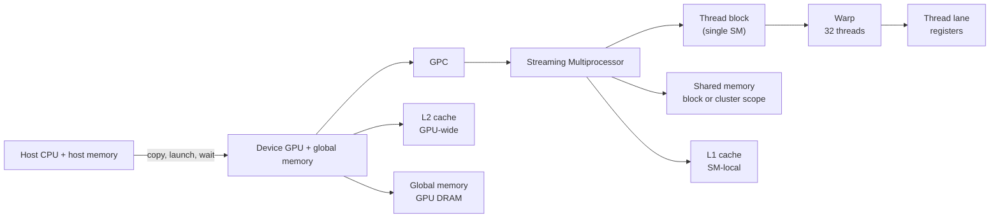
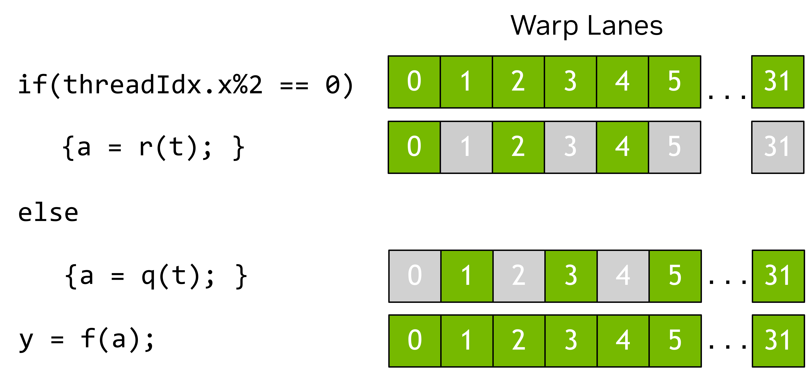

# CUDA Programming Model: From Host to SM, Warp, and Memory

**Sources:** [CUDA Programming Guide introduction](https://docs.nvidia.com/cuda/cuda-programming-guide/01-introduction/introduction.html) and [CUDA Programming Model](https://docs.nvidia.com/cuda/cuda-programming-guide/01-introduction/programming-model.html), captured on 2026-08-10.

**Related pages:** [CUDA Tile IR: The Design Philosophy of Tile Programming](tile-ir/index.md), [Triton: Tiled GPU Kernel Language](../triton/index.md), [Triton in vLLM and vllm-ascend](../triton/triton-in-vllm.md), [Global Memory](../../terms/global-memory.md), [Matrix Tiling](../../terms/matrix-tiling.md), [GEMM](../../terms/gemm.md)

**CUDA Graphs:** [Capture Once, Replay Many](cuda-graphs/index.md) explains the launch-overhead problem and the static-buffer replay pattern.

## TL;DR

**What:** CUDA is a heterogeneous programming model in which the CPU host launches device code, called kernels, onto a GPU built from many Streaming Multiprocessors (SMs).

**How:** A kernel launch creates a grid of thread blocks; each block runs on one SM, its threads execute in 32-thread warps, and those threads move data between global memory and faster on-chip registers, shared memory, and caches.

**The hardware rule:** Blocks in one grid must be safe to run in any order, in parallel or in series, because the GPU may have far fewer SMs than the grid has blocks and provides no general block-to-block ordering guarantee.

## The Big Picture

*Original source figure from the [CUDA Programming Model](https://docs.nvidia.com/cuda/cuda-programming-guide/01-introduction/programming-model.html). It anchors the physical split: host CPU and system memory connect to a device GPU, whose GPCs contain SMs and whose global memory feeds those SMs.*

The companion diagram is a compact, synthesized reading map of that figure and the surrounding execution rules. Its editable source is [cuda-execution-hierarchy.mmd](assets/cuda-execution-hierarchy.mmd).

*Synthesized execution map, not an NVIDIA source figure. 1. The host owns orchestration and host memory. 2. A launch creates a grid on the device. 3. The GPU schedules blocks onto SMs. 4. Warps execute threads, while the memory hierarchy determines how expensive each load and store is.*

## Why This Exists

Imagine adding two one-million-element arrays:

$$C[i] = A[i] + B[i]$$

A CPU could walk the elements serially. CUDA instead lets the host launch a kernel with 256 threads per block and

$$\left\lceil \frac{1{,}000{,}000}{256} \right\rceil = 3907$$

blocks. Each thread derives a unique element index, each block handles a disjoint range, and the GPU schedules whichever blocks fit on its available SMs.

That example exposes the whole model. The host prepares and launches the work; the grid describes the total logical work; blocks provide the independently schedulable units; warps provide the hardware execution groups; and global, shared, and register storage determine whether the arithmetic is fed efficiently. **CUDA is not merely "run this function on a GPU"; it is a contract between work decomposition and hardware scheduling.**

## The Mental Model in One Sentence

**The host orchestrates, the grid describes, blocks own independent work, warps execute it, and the memory hierarchy decides the cost.** Every design choice below is a refinement of that sentence.

## 1. Host and Device: Two Processors, One Application

CUDA assumes a heterogeneous system:

| Side | CUDA name | Owns | Main responsibility |
|---|---|---|---|
| CPU and directly attached memory | Host | Host code and host memory | Start the application, allocate or prepare data, launch kernels, issue copies, and wait for completion. |
| GPU and directly attached memory | Device | Device code and device memory | Execute kernels across many SMs and read or write device-resident data. |

Applications start on the CPU. Host code uses CUDA APIs to copy data between host and device memory, start GPU work, and wait for copies or kernels. The CPU and GPU can execute simultaneously, so a good program keeps the CPU preparing future work while the GPU processes current work when the dependency structure allows it.

The physical connection matters: the source figure shows an interconnect such as PCIe or NVLink between CPU and GPU. A kernel may be extremely fast and still deliver poor end-to-end performance if too much data crosses that boundary or if the GPU repeatedly waits for the host.

### Kernel and launch

The function that runs on the GPU is a **kernel**. Launching a kernel means creating many GPU threads that execute the same kernel code over different logical data items. The launch configuration supplies the grid and block dimensions, with optional settings such as a stream, cluster size, or SM configuration introduced in later CUDA sections.

The kernel is device code; the launch is host-side orchestration. Keeping those roles separate makes the runtime trace easier to reason about:

1. Host code chooses data and an execution configuration.
2. The device schedules the resulting blocks.
3. Threads compute and exchange data within the permitted scope.
4. Host code observes completion or consumes copied results.

## 2. GPU Hardware: GPCs Contain SMs

CUDA presents the GPU as a collection of **Streaming Multiprocessors (SMs)** organized into **Graphics Processing Clusters (GPCs)**. An SM contains a local register file, a unified data cache, and functional units. The unified data cache provides physical resources for L1 cache and shared memory, with the balance configurable at runtime; exact sizes and functional-unit counts vary by GPU architecture.

| Hardware level | CUDA programming consequence |
|---|---|
| GPU | Owns device execution and global memory. A grid can be much larger than the physical GPU. |
| GPC | Groups SMs; cluster-level execution can constrain blocks to one GPC on supported devices. |
| SM | The home of a thread block during execution, with registers, shared memory, L1 resources, and functional units. |
| Functional units | Perform the arithmetic and other instructions issued by the SM. |

The programming model intentionally abstracts the physical layout. A GPU generation may change how work is carried out without changing the correctness contract. Optimize against documented CUDA behavior first; treat undocumented physical scheduling details as implementation details rather than synchronization guarantees.

## 3. Grid, Block, Thread: The Execution Contract

*Original Figure 3 from the [CUDA Programming Model](https://docs.nvidia.com/cuda/cuda-programming-guide/01-introduction/programming-model.html). The grid is a logical collection of equal-shaped thread blocks; only some blocks are active on the available SMs at one time.*

A kernel launch creates a **grid** of **thread blocks**. Grids and blocks can be one-, two-, or three-dimensional, which makes it natural to map threads to elements in vectors, matrices, images, or volumes.

| Level | Identity | Hardware and communication scope | Safe assumption |
|---|---|---|---|
| Grid | All blocks launched for one kernel | May span all GPCs and SMs | Blocks can be assigned in any order. |
| Thread block | A group of threads launched together | All threads execute on one SM and share block-scoped shared memory | Threads in the block may communicate and synchronize efficiently. |
| Thread | One logical worker inside a block | Has a unique position in its block and grid | Use built-in indices to determine which data item or operation it owns. |

The essential portability property is **block independence**. A grid may contain millions of blocks while the GPU has only tens or hundreds of SMs. Because blocks may execute in parallel or in series, one block must not require a result from another block in the same grid unless a higher-level mechanism explicitly establishes that relationship.

### Thread block clusters

On GPUs with compute capability 9.0 and higher, CUDA adds an optional grouping called a **thread block cluster**. Adjacent blocks in a cluster are scheduled simultaneously within one GPC. They can communicate through software interfaces and access one another's shared memory as distributed shared memory. Cluster size is hardware dependent.

Clusters add a stronger locality and synchronization scope, but they do not change the grid dimensions or the ordinary block position within the grid. Think of a cluster as an optional middle layer between the grid and an individual block, not as a replacement for the basic model.

## 4. Scheduling: Why Blocks Must Be Reorderable

*Original Figure 4 from the [CUDA Programming Model](https://docs.nvidia.com/cuda/cuda-programming-guide/01-introduction/programming-model.html). The GPU keeps several active blocks on each SM, but the order in which grid blocks are assigned is not guaranteed.*

The GPU scheduler repeatedly places blocks on SMs as resources become available. A block stays on one SM for its execution, and in most cases runs to completion there. The grid therefore scales across GPUs of different sizes:

- A small GPU runs fewer blocks concurrently.
- A large GPU runs more blocks concurrently.
- The logical grid and block code stay the same.
- The result is correct only when block order does not matter.

This is why a block is more than a convenient group of threads. It is the unit that CUDA can move, delay, or run concurrently without consulting other blocks. If a reduction needs a global synchronization between phases, split it into separate kernel launches or use an explicitly supported cooperative mechanism; do not assume an implicit grid-wide barrier.

## 5. Warps and SIMT: The Hardware Execution Group

*Original Figure 7 from the [CUDA Programming Model](https://docs.nvidia.com/cuda/cuda-programming-guide/01-introduction/programming-model.html). A warp contains 32 lanes; when lanes take different branches, inactive lanes are masked while the selected path runs.*

Inside a thread block, CUDA groups threads into **warps of 32**. A warp executes in a **Single-Instruction Multiple-Threads (SIMT)** model:

- The threads in a warp issue the same instruction together.
- Each thread has its own registers and lane identity.
- Threads may take different branches, but lanes not taking the current path are masked.
- The more a warp's threads disagree about control flow, the less of the issued work produces useful results.

For example, if only even lanes execute the body of an `if` statement, roughly half of the warp's lanes are inactive for that body. This is warp divergence. The model allows divergent code, but utilization is usually better when neighboring threads follow the same path.

A block size does not have to be a multiple of 32, but a non-multiple leaves unused lanes in the final warp. As a first design heuristic, choose a block size divisible by 32 and then check register, shared-memory, occupancy, and algorithm-specific constraints.

SIMT is related to SIMD but not identical. SIMD follows one control-flow path over a fixed-width vector; SIMT gives each thread its own logical control flow while executing the warp as a coordinated group. This distinction matters when reasoning about branches, coalesced global-memory access, and shared-memory access patterns.

## 6. CUDA Memory: Where the Data Lives Changes the Cost

The GPU contains several memory spaces with different scope, capacity, and access cost. The exact capacities vary by architecture, but the ownership rules are stable enough to guide kernel design.

| Memory space | Scope | Typical owner | What to remember |
|---|---|---|---|
| Registers | One thread | Compiler and thread | Fast local state; register demand is multiplied by the number of threads in the block. |
| Shared memory | One block, or a cluster through distributed shared memory | Threads in the block/cluster | Fast on-chip scratch space for cooperation and data reuse. |
| L1 cache | One SM | Hardware | Part of the SM's unified data-cache resources; competes conceptually with shared-memory capacity. |
| L2 cache | Whole GPU | Hardware | Shared cache behind the SM-local L1 resources. |
| [Global memory](../../terms/global-memory.md) | All SMs on the device | Device DRAM | Large capacity, but accesses and transfers are much more expensive than on-chip reuse. |
| Host/system memory | CPU side | Host | Crossing the CPU-GPU interconnect adds a transfer boundary. |
| Unified memory | CPU and GPU addressable allocation | CUDA runtime and hardware | Simplifies placement, but migration and remote access can still cost performance. |

The register file and shared memory are finite. CUDA cannot schedule a block if its per-thread register demand multiplied by the block's thread count exceeds available register capacity. Shared memory is allocated at block scope, so increasing block size or staging more data can reduce the number of blocks that fit concurrently on an SM.

### Explicit copies and unified memory

With explicit allocations, host code copies data between host and device allocations at deliberate points. Unified memory lets both CPU and GPU code access an allocation while the runtime or hardware manages placement and migration. It is a convenience, not a free removal of the memory hierarchy: the source recommends minimizing migration and keeping accesses close to the processor directly attached to the data.

For a performance-sensitive kernel, ask two separate questions:

1. **Can the GPU reach the data?** This is the host/device ownership and transfer question.
2. **Can the SM reuse the data?** This is the global-memory, cache, shared-memory, and register question.

## 7. Tile Programming: A Higher-Level Kernel Model

CUDA supports both ordinary SIMT programming and a tile programming model. In SIMT, the programmer writes per-thread code and controls each thread's indexing. In tile programming, the programmer writes code for an entire block and describes multidimensional **tiles**; the compiler maps tile operations onto the block's threads.

The companion [CUDA Tile IR insight](tile-ir/index.md) explains why this abstraction exists: tile programs make logical tensor work explicit while the compiler owns the volatile mapping to threads, memory, and tensor cores.

| Concept | SIMT programming | Tile programming |
|---|---|---|
| Programmer's unit | Individual thread | Entire thread block and its tiles |
| Thread mapping | Explicit in source | Chosen by the compiler from tile operations |
| Control flow | Threads may diverge within a warp | The block follows one control-flow path |
| Data movement | Thread-level loads and stores | Tile loads and stores through tile space |
| Hardware substrate | Same grids, blocks, SMs, and memory spaces | Same grids, blocks, SMs, and memory spaces |

Do not confuse a **block**, which is an execution unit, with a **tile**, which is a data unit. One block can create and operate on many tiles of different shapes and data types.

### Arrays, tiles, and boundaries

An array is a mutable multidimensional object stored in device memory. A tile is a block-local, immutable collection of values produced and consumed by tile code. A tile may live in registers, shared memory, or another SM resource; the compiler chooses the representation.

Tile dimensions must be compile-time-known powers of two. Loads conceptually partition an array into an equally sized tile space and return the tile at a chosen tile-space index. At an array boundary, a load can fill out-of-bounds elements with a chosen value such as zero; stores can discard writes outside the array. Tile operations include elementwise arithmetic, matrix multiplication, reductions, reshape, transpose, and type conversion.

This is the bridge to [matrix tiling](../../terms/matrix-tiling.md) and [GEMM](../../terms/gemm.md): a large operation is decomposed into pieces that can be loaded, reused, and computed inside an SM. The abstraction is higher level, but it still inherits the same hardware limits: global-memory traffic, on-chip capacity, block scheduling, and the synchronization scope of the block.

### When to choose which model

Tile programming is a per-kernel choice, not a replacement for SIMT. Use SIMT when fine-grained thread control or an unusual communication pattern is the point of the kernel. Use tiles when a regular multidimensional operation, such as a matrix multiply or reduction, is easier to express as block-level data movement and computation. Both kinds of kernels can operate on the same device arrays in one application.

## Putting It Together: One Vector-Add Launch

Follow the one-million-element example from host code to hardware:

1. **Prepare:** The CPU allocates or receives `A` and `B`, and obtains a device allocation for the result `C`.
2. **Transfer:** If the inputs start in host memory, CUDA copies them across the CPU-GPU interconnect into device memory. With unified memory, the runtime may migrate pages when the processors access them.
3. **Configure:** The host chooses `blockDim = 256` and `gridDim = 3907`. The extra threads in the final block are masked by a bounds check for `i < 1,000,000`.
4. **Schedule:** The GPU assigns ready thread blocks to available SMs. The assignment order is not part of the program's correctness contract.
5. **Execute:** Each block's 256 threads form eight warps. Each thread calculates its own index, loads `A[i]` and `B[i]` from global memory, adds them, and stores `C[i]`.
6. **Reuse:** For vector addition there is little cross-thread reuse, so the kernel is usually more sensitive to memory traffic than to arithmetic. A tiled matrix operation would make more use of shared memory and registers.
7. **Complete:** The host waits for the relevant GPU work before consuming the result, or schedules other independent host/device work when dependencies allow it.
8. **Return:** If the consumer is the CPU, CUDA copies `C` back to host memory; if the next operation is another GPU kernel, keeping `C` on the device avoids that transfer.

The same trace scales to matrix multiplication, attention, and neural-network layers. Only the work assigned to each thread or tile changes; the host/device boundary, grid/block scheduling contract, warp execution model, and memory scopes remain.

## What This Buys You

### Portability across GPU sizes

The grid can be much larger than the available SM count because blocks are independently schedulable. The same kernel can therefore run on a smaller or larger GPU without changing its logical decomposition.

### Throughput from occupancy and reuse

The GPU trades single-thread speed for many concurrent threads, while each SM uses registers, shared memory, caches, and functional units to keep those threads productive. A large grid supplies work; a useful block shape fits the SM's finite resources; regular warps reduce wasted execution; and data reuse reduces expensive global-memory traffic.

### A clean abstraction boundary

CUDA exposes enough hardware structure to write efficient code without requiring every program to know the physical layout of every GPU generation. The source's warning is important: the actual hardware implementation may vary, but code should depend on the programming-model contract, not on an assumed block order or undocumented warp scheduling detail.

### How to read performance claims

These two source pages explain the programming model, not a benchmark result. They justify why a kernel can scale and where bottlenecks can arise, but they do not promise a speedup for a particular block size, memory pattern, GPU generation, or host-device transfer schedule. Performance still requires measurement and architecture-specific tuning.

## Design Checklist

Before writing or tuning a CUDA kernel, ask:

1. **Ownership:** Which host or device allocation contains each input and output?
2. **Decomposition:** Which element, row, tile, or output region does one thread block own?
3. **Independence:** Can every block run before or after every other block?
4. **Block shape:** Is the number of threads a multiple of 32, and do registers and shared memory fit?
5. **Warp behavior:** Do neighboring lanes usually follow the same control-flow path?
6. **Memory path:** Which values are read from global memory, reused through L1/L2 or shared memory, and retained in registers?
7. **Synchronization:** Is each communication pattern inside the block, inside a supported cluster, or across kernel launches?
8. **Abstraction:** Is SIMT or tile programming the clearer expression for this kernel?
9. **Boundary:** Can host-device copies or unified-memory migration dominate the kernel itself?

## Where It Breaks

| Failure mode | Concrete condition | Impact |
|---|---|---|
| Cross-block dependency | One block reads a value another block writes during the same grid launch | Results depend on an ordering CUDA does not guarantee. |
| Register pressure | Per-thread registers multiplied by block size exceed the SM register file | The block is not launchable at that configuration. |
| Shared-memory pressure | Block-scoped staging consumes too much of the SM's shared-memory budget | Fewer blocks fit concurrently, or the launch fails. |
| Warp underfill | Block size is not divisible by 32 | The final warp contains lanes that remain unused. |
| Warp divergence | Threads in one warp take different branches | Some lanes are masked while the path executes, reducing useful utilization. |
| Transfer-bound execution | Inputs or outputs repeatedly cross the CPU-GPU interconnect | End-to-end time is dominated by movement rather than device arithmetic. |
| Unified-memory migration | CPU and GPU repeatedly access pages owned by the other processor | Runtime migration or remote access adds latency and reduces locality. |
| Unsupported cluster assumption | The target GPU does not support compute capability 9.0+ clusters | Cluster-level communication and distributed shared memory are unavailable. |
| Physical-layout assumption | Code relies on a particular block order or undocumented warp behavior | It may break or change behavior across GPU architectures. |

## One Thing to Remember

**Blocks are the portability unit.** The host launches a logical grid that may be far larger than the GPU, and the hardware maps independently runnable blocks onto whatever SMs are available. Warps explain how threads inside a block execute; registers, shared memory, caches, and global memory explain the cost; but correctness begins with a block that does not depend on another block's timing.

## Go Deeper

- **Read:** [CUDA Programming Guide introduction](https://docs.nvidia.com/cuda/cuda-programming-guide/01-introduction/introduction.html) and [CUDA Programming Model](https://docs.nvidia.com/cuda/cuda-programming-guide/01-introduction/programming-model.html).
- **Compare abstractions:** [Triton: Tiled GPU Kernel Language](../triton/index.md) explains a tile-first programming model that removes much of the explicit thread and shared-memory management; [Triton in vLLM and vllm-ascend](../triton/triton-in-vllm.md) shows how the abstraction appears in real inference kernels.
- **Follow the memory story:** [Global Memory](../../terms/global-memory.md), [Matrix Tiling](../../terms/matrix-tiling.md), and [GEMM](../../terms/gemm.md).
- **Reuse the visual:** [cuda-execution-hierarchy.mmd](assets/cuda-execution-hierarchy.mmd) is the editable execution map used by this page.
- **Evidence boundary:** The raw HTML, metadata, and derived Markdown paths for both NVIDIA pages are listed in this page's front matter. The captures were downloaded through a permitted public HTTP path and supplied to the repository extractor as local HTML, so their metadata records that HTTP status and response headers were unavailable.
