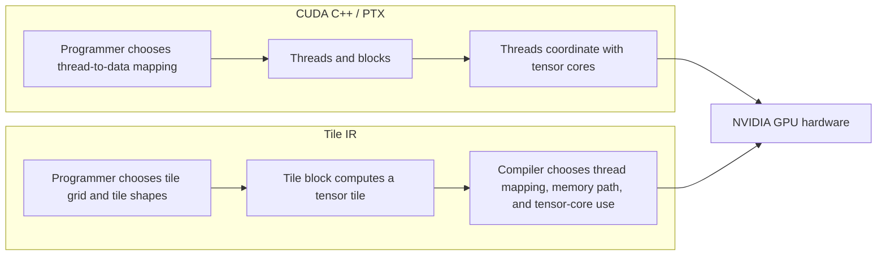
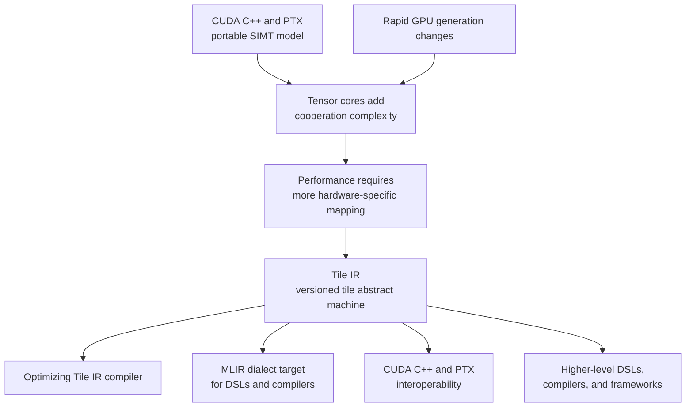

# CUDA Tile IR: The Design Philosophy of Tile Programming

**Sources:** [Introduction - Tile IR](https://docs.nvidia.com/cuda/tile-ir/latest/sections/introduction.html) and [Programming Model - Tile IR](https://docs.nvidia.com/cuda/tile-ir/latest/sections/prog_model.html), captured on 2026-08-10.

**Related pages:** [CUDA Programming Model](../index.md), [Triton: Tiled GPU Kernel Language and Compiler](../../triton/index.md), [TileLang Design and Code Learning Path](../../tilelang/index.md), [Matrix Tiling](../../../terms/matrix-tiling.md), [GEMM](../../../terms/gemm.md)

## TL;DR

**What:** Tile IR is a portable, low-level tile virtual machine and instruction set in which a logical tile block computes over a multidimensional tensor tile.

**How:** The programmer defines tile kernels, tile grids, tensor shapes, and tile operations; the Tile IR compiler chooses how those logical tiles map onto CUDA threads, memory hierarchy, and tensor cores.

**The design payoff:** Tile IR moves the most change-prone hardware mapping decisions below the programming model while keeping enough structure, views, alignment assumptions, and optimization hints to recover performance.

## The Big Picture

[Editable diagram source](assets/tile-ir-design-philosophy.mmd)

*Synthesized explanation from the [Tile IR introduction](https://docs.nvidia.com/cuda/tile-ir/latest/sections/introduction.html) and [programming model](https://docs.nvidia.com/cuda/tile-ir/latest/sections/prog_model.html). The important shift is 1. SIMT exposes thread-to-data mapping. 2. Tile IR exposes tile-level work and tensor structure. 3. The compiler owns the mapping to threads, memory, and tensor cores.*

## Why This Exists

Consider a `4096 x 4096` GEMM using `64 x 64` output tiles. In a traditional SIMT kernel, the author must decide which threads own which elements, how those threads cooperate with tensor cores, how pointers advance through the K reduction, and how the tile fits the memory hierarchy. A new GPU generation can change the best answer to every one of those questions.

Tile IR starts from the same algorithm but exposes a different responsibility boundary. The programmer says that one logical tile block produces one output tile and that the computation is a reduction of input tiles. The compiler is then responsible for mapping that tile computation onto the underlying thread organization and hardware resources. **The problem is not that threads are useless; it is that thread-to-tensor-core mapping is too volatile to be the main portability contract.**

## The Landscape

[Editable landscape source](assets/tile-ir-landscape.mmd)

*Landscape synthesis. CUDA C++ and PTX remain the SIMT parent model; tensor cores and fast-changing hardware create the mapping gap; Tile IR adds a tile-oriented virtual machine and compiler boundary that higher-level systems can target.*

## The Core Idea

**Tile IR makes the logical tile, not the hardware thread, the primary unit of thought.** A tile kernel describes a grid of logical tile blocks, each operating on tensor values and views. The compiler can change the physical thread mapping, memory placement, and tensor-core instructions when the GPU changes, while the source program continues to describe the same data-parallel decomposition.

## Symbol Map

Tile IR uses `tile<...>` types to make rank, shape, and element type visible in the program. A rank-0 tile is a scalar; higher-rank tiles are rectangular tensor values. A `tensor_view` adds the shape and stride information needed to interpret a raw device pointer as a structured tensor, while a `partition_view` divides that tensor into logical tiles.

| Symbol or term | Human name | Shape or scope | Plain meaning |
|---|---|---|---|
| `tile<128xf32>` | one-dimensional value tile | 128 elements | A tensor value that one logical tile computation can load, transform, or store. |
| `tile<64x64xf32>` | matrix tile | 64 by 64 elements | A two-dimensional fragment, such as one GEMM operand or accumulator tile. |
| tile kernel | logical kernel function | N parallel instances | An entry function invoked as multiple tile-block instances. |
| tile block | logical execution instance | one grid coordinate | The unit that computes one logical region of the problem; it is not a CUDA hardware thread. |
| tile grid | instance space | 1D, 2D, or 3D | The launch space that gives each tile block its coordinates. |
| `tensor_view<?x?xf32, strides=[?,1]>` | structured tensor view | dynamic shape and stride | A typed view over [global memory](../../../terms/global-memory.md) with runtime shape and stride metadata. |
| `partition_view<tile=(128x128), ...>` | tiled tensor view | tile-sized regions | A view that lets the kernel load and store logical tiles by index instead of recomputing every pointer offset. |
| tensor of pointers | unstructured pointer tile | arbitrary addresses | A flexible gather/scatter representation that can express irregular access but may be harder to optimize. |

## Deep Dive

### 1. Tile blocks replace thread fragments as the programming unit

**What it does:** A tile kernel runs as many parallel instances, and each instance represents one logical tile block operating on a multidimensional tile.

**Why it matters:** Tensor-core programming makes the old question, "which thread owns this element?", much more complicated because many threads must cooperate with specialized hardware.

**How it works:** The kernel is launched over a 1D, 2D, or 3D tile grid. Each instance can query its tile-block coordinates and the grid dimensions. The source describes the computation at that level; the mapping of tile blocks and tile elements to physical CUDA threads is handled by the compiler.

**The intuition:** A tile block is a small matrix program with a coordinate, not a single CUDA lane.

**A concrete example:** A vector-add kernel with a `128`-element tile is written once for one tile block. Launching a larger tile grid repeats that same logical computation over other vector regions; the source does not manually assign 128 CUDA threads to 128 values.

**Remember:** Tile IR's portability unit is the logical tile block and its data region.

### 2. Tensor values make data movement explicit without spelling out hardware threads

**What it does:** It represents scalar and multidimensional data as typed tensor values, including tiles of pointers, values, and accumulators.

**Why it matters:** The algorithm can expose shape, broadcasting, and matrix structure directly, giving the compiler information that a scalar loop over unrelated addresses would hide.

**How it works:** The programming-model examples build a `128`-element pointer tile from a base pointer by creating an `iota` offset, reshaping a scalar pointer, broadcasting it, and applying the offsets. The kernel then loads a value tile, performs elementwise addition or matrix multiply, and stores a result tile. The code follows one logical control stream; the compiler determines the physical parallel execution.

**The intuition:** The source says "load this rectangle and add it" instead of narrating every lane's part of the rectangle.

**A concrete example:** In vector addition, `iota` names the positions `0` through `127`, `broadcast` turns one base pointer into a pointer tile, and `offset` forms the addresses. The final `addf` operates on `tile<128xf32>` values rather than on 128 separately written thread operations.

**Remember:** Tile values are compiler-managed data objects; they are not promises about whether the hardware stores them in registers, shared memory, or another resource.

### 3. Tensor views trade pointer freedom for compiler-visible structure

**What it does:** A tensor view attaches shape and stride metadata to a raw device pointer, and a partition view exposes tile-sized regions of that tensor.

**Why it matters:** Arbitrary tensors of pointers are expressive, but a completely disjoint pointer tensor can turn into unrelated loads and stores that lose vectorization, tensorization, cache locality, and thread locality.

**How it works:** A kernel can first construct `make_tensor_view` from a pointer, shape, and strides. It can then construct `make_partition_view` with a tile shape and use indexed view loads and stores. Dynamic shapes remain possible because the overall dimensions and strides can be runtime values; the tile shape remains the structured unit the compiler can reason about. Alignment and divisibility assumptions can be supplied when dynamic metadata prevents the compiler from inferring them.

**The intuition:** A raw pointer says where memory begins; a tensor view says what organized tensor lives there.

**A concrete example:** In dynamic GEMM, views describe A, B, and C with runtime dimensions and strides. Partition views expose `128 x 64`, `64 x 128`, and `128 x 128` tiles, so the K loop loads matching fragments and stores one output tile without rebuilding all pointer offsets on every iteration.

**Remember:** Tile IR has an explicit escape hatch: use arbitrary pointer tiles for maximum expressivity, then use structured views when regularity matters for performance.

### 4. The examples teach progressive specialization

**What it does:** The programming model moves from a single tile block to a full dynamic GEMM, introducing only one new abstraction at a time.

**Why it matters:** This sequence separates the semantic idea of tile computation from the optimization techniques needed to make real memory layouts and problem shapes efficient.

**How it works:** The source progresses through four stages:

| Stage | New idea | What the programmer learns |
|---|---|---|
| Vector add | one tile block and tensor values | A tile kernel is a single logical tensor computation. |
| Single-block GEMM | `mmaf` or `mmai` on matrix tiles | Tile operations can express tensor-core-shaped work. |
| Grid GEMM | block coordinates and a K loop | A grid of tile blocks covers a large output, while each block owns one output tile. |
| Dynamic GEMM with views | shapes, strides, partitions, and assumptions | Structured metadata replaces much manual offset arithmetic without giving up dynamic inputs. |

**The intuition:** Learn the abstraction at its smallest useful scale, then add the information the compiler needs to make it robust.

**A concrete example:** The `4096 x 4096` GEMM first demonstrates a static `64 x 64` tile and explicit offsets. The later dynamic version keeps the same tile-level MMA idea but moves shape, stride, partition, and alignment information into views and assumptions.

**Remember:** The teaching order mirrors the design order: semantics first, regularity and optimization metadata second.

### 5. Tile IR is a virtual-machine boundary for hardware evolution

**What it does:** It defines a versioned tile abstract machine and bytecode, an optimizing compiler available through the CUDA driver and toolkit, and an MLIR dialect that other compilers can target.

**Why it matters:** A tile DSL or compiler needs a stable target that can outlive one particular arrangement of threads, tensor cores, and memory resources.

**How it works:** Higher-level systems can lower tile-oriented programs to Tile IR. The Tile IR compiler then performs the target-specific mapping. The introduction also treats CUDA C++ and PTX interoperability as a goal, so Tile IR extends the CUDA ecosystem rather than requiring every application to abandon existing low-level code.

**The intuition:** Tile IR is the contract between a tensor algorithm and the GPU generation that will execute it.

**A concrete example:** A higher-level DSL can keep its own syntax and scheduling choices while targeting the Tile IR MLIR dialect. The same logical tile program can then be recompiled as the hardware mapping changes, with explicit hints available when the general compiler needs guidance.

**Remember:** Tile IR is both a programming model and a compiler target; it is not merely a nicer spelling for CUDA thread code.

## Putting It Together

Trace the source's dynamic GEMM design from input pointers to one output tile:

1. **Describe the boundary:** The kernel receives device pointers for A, B, and C, plus runtime dimensions and strides. Tile kernels consume and produce data through their parameters rather than returning a value.
2. **Launch tile instances:** The host chooses a tile grid whose coordinates identify output regions. Each tile-block instance reads its own grid coordinates.
3. **Attach structure:** The kernel builds tensor views for the input and output allocations, then creates partition views with tile shapes that match the intended MMA operands and accumulator.
4. **Find the reduction space:** The kernel queries the partitioned K dimension and enters a structured loop. Each iteration loads one A fragment and one B fragment.
5. **Compute at tile level:** An MMA operation accumulates the fragments into a `128 x 128` output tile. The source does not prescribe which physical threads, memory levels, or tensor-core instruction sequence realizes the operation.
6. **Store the result:** The kernel stores the accumulator through the C partition view at the tile block's grid coordinate. Shape and stride metadata handles the logical-to-physical address calculation.
7. **Compile for the GPU:** Tile IR's compiler maps the tile program to the target GPU and can use alignment or divisibility assumptions as optimization hints. Existing CUDA C++ and PTX code can remain part of the surrounding application.

The runtime story is therefore simple at the algorithm level: **one tile block owns one logical region, one loop advances through the reduction tiles, and the compiler owns the physical realization.**

## What This Buys You

### The headline claim

Tile IR makes tensor-shaped work a stable programming contract while allowing NVIDIA to change the thread, memory, and tensor-core implementation underneath it.

### How we know: design evidence

| Aspect | CUDA C++ / PTX SIMT model | Tile IR model |
|---|---|---|
| Programmer's unit | Individual threads and their data mapping | Logical tile block and tensor tile |
| Thread mapping | Chosen explicitly by the programmer | Abstracted and chosen by the compiler |
| Tensor-core use | Threads must coordinate with specialized hardware | Tile-level MMA expresses the operation; mapping is compiler-owned |
| Memory description | Raw pointers and manually constructed offsets are common | Raw pointers remain possible, but views and partitions expose shape and stride |
| Compiler target | PTX represents SIMT execution | Versioned tile abstract machine and bytecode represent tile execution |
| Ecosystem boundary | CUDA's established low-level model | Adds tile-native code generation while retaining CUDA interoperability |

### The mechanism behind the claim

Portability comes from removing details that change frequently, not from hiding every performance decision. Tile shapes, grid decomposition, tensor views, partitions, alignment assumptions, and optimization hints remain visible because they express algorithmic structure or useful knowledge about the data. Physical thread layout and resource placement move below the interface because those are the details most likely to change with tensor-core and SM design.

### How to read the performance promise

The captured pages are a specification and programming-model tutorial, not a benchmark report. Their goals of performance portability, low abstraction overhead, and user controls are design targets. They do not establish a speedup for a particular GPU, tile shape, memory layout, or compiler version; those claims require a compiled and measured implementation.

## Where It Breaks

| Failure mode | When it happens | Impact |
|---|---|---|
| Unstructured pointer access | A tensor of pointers describes mostly disjoint addresses | Loads and stores may lose vectorization, tensorization, cache locality, and thread locality. |
| Missing view metadata | The kernel uses raw pointers for regular dynamic tensors without shape and stride information | The programmer must reconstruct more offsets and the compiler has less structure to optimize. |
| Unknown alignment | Dynamic pointers or strides do not carry usable divisibility assumptions | The compiler may miss aligned access opportunities or a fast lowering path. |
| Tile shape mismatch | A chosen tile shape does not fit the target's useful memory or compute organization | The logical program remains valid, but performance portability can degrade and retuning may be required. |
| Cross-tile dependency | One tile block needs another tile block's intermediate result | The simple independent-grid model no longer suffices; explicit atomics or synchronization introduce complexity and potential contention. |
| Portability overclaim | A program assumes that Tile IR's compiler will automatically recover the best mapping everywhere | The introduction promises low overhead and provides hints, but it does not promise identical performance across GPUs. |
| Specification versus runtime confusion | The page is read as proof of numerical correctness or benchmark performance | The source explains semantics and examples; execution, correctness testing, and performance measurement remain separate checks. |

## One Thing to Remember

**Tile IR changes what the programmer promises.** The programmer promises a useful decomposition into logical tile blocks and structured tensor operations; the compiler promises to map that intent onto the current GPU's threads, memory hierarchy, and tensor cores. Tensor views, partitions, and hints are the handles for giving the compiler enough structure when a fully automatic mapping would be too vague.

## Go Deeper

- **Read:** [Introduction - Tile IR](https://docs.nvidia.com/cuda/tile-ir/latest/sections/introduction.html) and [Programming Model - Tile IR](https://docs.nvidia.com/cuda/tile-ir/latest/sections/prog_model.html).
- **Compare the lower-level model:** [CUDA Programming Model](../index.md) explains host/device execution, grids, blocks, warps, and the memory hierarchy that Tile IR abstracts.
- **Compare a tile compiler:** [Triton: Tiled GPU Kernel Language and Compiler](../../triton/index.md) elevates tiles into a language and compiler with SPMD execution and automatic hierarchical tiling.
- **Follow a modern DSL:** [TileLang Design and Code Learning Path](../../tilelang/index.md) shows how a Python tile DSL preserves tile intent until a backend-owned lowering pipeline specializes it.
- **Understand the kernel primitive:** [Matrix Tiling](../../../terms/matrix-tiling.md) and [GEMM](../../../terms/gemm.md) explain the data-reuse pattern used by the programming-model examples.
- **Reproduce:** The captured pages include reference programs, but this insight did not compile or run Tile IR code or measure a GPU.
