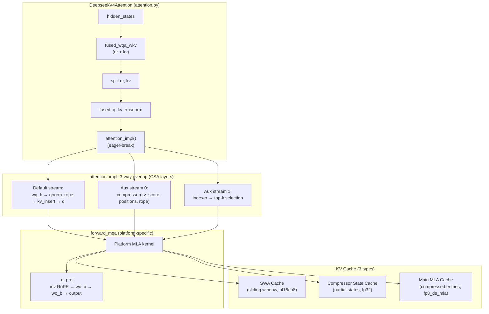
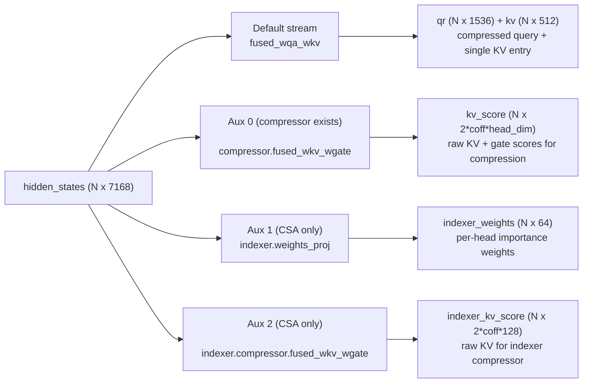
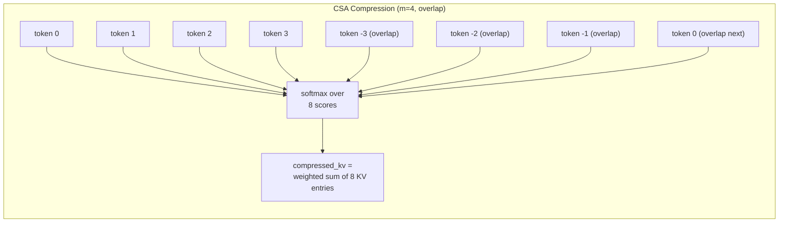
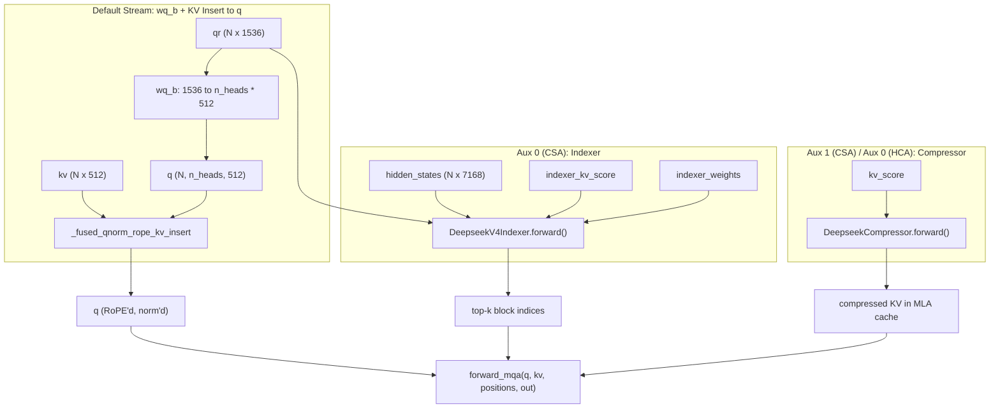

# DeepSeek V4 Attention: Code Reading Map

**Repositories:**

- [vllm-project/vllm](https://github.com/vllm-project/vllm) @ `d18ed2304a2703e3211fc384a58607e754f5b723` (main, clean)
- [vllm-project/vllm-ascend](https://github.com/vllm-project/vllm-ascend) @ `8645122088f5cad1701205310573c5ee05c809f5` (main, clean)

**Related pages:** [DeepSeek-V4 Paper](../../training/deepseek/deepseek-v4/index.md), [DeepSeek-V2 MLA](../../algorithms/attention-variants/deepseek-v2-mla.md), [DeepSeek-V3.2 Sparse Attention](../../algorithms/deepseek-v3.2/index.md), [MiniMax Sparse Attention](../../training/efficient-attention/minimax-sparse-attention/index.md), [vLLM Code Learning Path](../vllm/vllm-code-learning-path.md)

## TL;DR

**What:** Both vLLM and vllm-ascend implement DeepSeek V4's hybrid compressed attention — CSA (4× compression + top-k sparse), HCA (128× compression + dense), and sliding window — as production-grade serving code with platform-specific kernel backends.

**How:** vLLM dispatches to FlashMLA, FlashInfer, or Triton kernels depending on GPU architecture; vllm-ascend uses a custom AscendDSA (Deepseek Sparse Attention) NPU operator. Both share the same `DeepseekV4Attention` base class and heterogeneous KV cache design.

**Where to start:** <a class="code-link" href="../../../external-repos/vllm-d18ed2304a27/vllm/models/deepseek_v4/attention.py#L71" data-code-repo="vllm-d18ed2304a27" data-code-path="vllm/models/deepseek_v4/attention.py" data-code-line="71"><code>vllm/models/deepseek_v4/attention.py</code></a> — the ~700-line `DeepseekV4Attention` class is the single source of truth for the attention pipeline, with platform subclasses in `nvidia/`, `amd/`, and `xpu/`.

## What This Repo Is For

The DeepSeek V4 attention code is a production serving implementation of the hybrid compressed attention architecture described in the [DeepSeek-V4 technical report](../../training/deepseek/deepseek-v4/index.md). It must handle:

- **Heterogeneous layer types:** CSA (compress_ratio=4), HCA (compress_ratio=128), and SWA-only (compress_ratio=1) layers in the same model
- **Three KV cache types:** SwA cache (sliding window), compressor state cache (partial compression states in float32), and main MLA cache (compressed entries in fp8/bf16)
- **Multi-platform dispatch:** NVIDIA (FlashMLA / FlashInfer / Triton), AMD ROCm (AITER), Intel XPU, Huawei Ascend NPU (DSA)
- **Multi-stream overlap:** Up to 4-way overlap of input GEMMs, indexer, and compressor on CUDA; NPU stream overlap on Ascend
- **FP8/MXFP4 quantization:** UE8M0 block-scaled fp8 (`fp8_ds_mla` layout) for main KV cache; MXFP4 for indexer keys

## How To Navigate It

| If you want to... | Start here |
|---|---|
| Understand the attention pipeline end-to-end | <a class="code-link" href="../../../external-repos/vllm-d18ed2304a27/vllm/models/deepseek_v4/attention.py#L71" data-code-repo="vllm-d18ed2304a27" data-code-path="vllm/models/deepseek_v4/attention.py" data-code-line="71"><code>vllm/models/deepseek_v4/attention.py</code></a> → `DeepseekV4Attention.forward()` |
| See how KV compression works | <a class="code-link" href="../../../external-repos/vllm-d18ed2304a27/vllm/models/deepseek_v4/compressor.py#L39" data-code-repo="vllm-d18ed2304a27" data-code-path="vllm/models/deepseek_v4/compressor.py" data-code-line="39"><code>vllm/models/deepseek_v4/compressor.py</code></a> → `DeepseekCompressor` |
| See the fused compressor+kernel+insert | <a class="code-link" href="../../../external-repos/vllm-d18ed2304a27/vllm/models/deepseek_v4/common/ops/fused_compress_quant_cache.py#L32" data-code-repo="vllm-d18ed2304a27" data-code-path="vllm/models/deepseek_v4/common/ops/fused_compress_quant_cache.py" data-code-line="32"><code>vllm/models/deepseek_v4/common/ops/fused_compress_quant_cache.py</code></a> |
| See the Lightning Indexer (sparse top-k) | <a class="code-link" href="../../../external-repos/vllm-d18ed2304a27/vllm/v1/attention/backends/mla/indexer.py#L46" data-code-repo="vllm-d18ed2304a27" data-code-path="vllm/v1/attention/backends/mla/indexer.py" data-code-line="46"><code>vllm/v1/attention/backends/mla/indexer.py</code></a> → `DeepseekV4IndexerBackend` |
| See how fused indexer Q RoPE + quant works | <a class="code-link" href="../../../external-repos/vllm-d18ed2304a27/vllm/models/deepseek_v4/common/ops/fused_indexer_q.py#L15" data-code-repo="vllm-d18ed2304a27" data-code-path="vllm/models/deepseek_v4/common/ops/fused_indexer_q.py" data-code-line="15"><code>vllm/models/deepseek_v4/common/ops/fused_indexer_q.py</code></a> |
| Understand the FlashMLA sparse backend | <a class="code-link" href="../../../external-repos/vllm-d18ed2304a27/vllm/models/deepseek_v4/sparse_mla.py#L35" data-code-repo="vllm-d18ed2304a27" data-code-path="vllm/models/deepseek_v4/sparse_mla.py" data-code-line="35"><code>vllm/models/deepseek_v4/sparse_mla.py</code></a> → `DeepseekV4FlashMLABackend` |
| Understand FlashInfer sparse MLA dispatch | <a class="code-link" href="../../../external-repos/vllm-d18ed2304a27/vllm/models/deepseek_v4/nvidia/flashinfer_sparse.py#L36" data-code-repo="vllm-d18ed2304a27" data-code-path="vllm/models/deepseek_v4/nvidia/flashinfer_sparse.py" data-code-line="36"><code>vllm/models/deepseek_v4/nvidia/flashinfer_sparse.py</code></a> |
| See how the NVIDIA model wires everything together | <a class="code-link" href="../../../external-repos/vllm-d18ed2304a27/vllm/models/deepseek_v4/nvidia/model.py#L82" data-code-repo="vllm-d18ed2304a27" data-code-path="vllm/models/deepseek_v4/nvidia/model.py" data-code-line="82"><code>vllm/models/deepseek_v4/nvidia/model.py</code></a> → `DeepseekV4ForCausalLM` |
| Understand the Ascend NPU DSA implementation | <a class="code-link" href="../../../external-repos/vllm-ascend-8645122088f5/vllm_ascend/attention/dsa_v1.py#L62" data-code-repo="vllm-ascend-8645122088f5" data-code-path="vllm_ascend/attention/dsa_v1.py" data-code-line="62"><code>vllm-ascend/vllm_ascend/attention/dsa_v1.py</code></a> → `AscendDSABackend` |
| See Ascend KV cache specialization | <a class="code-link" href="../../../external-repos/vllm-ascend-8645122088f5/vllm_ascend/models/deepseek_v4.py#L95" data-code-repo="vllm-ascend-8645122088f5" data-code-path="vllm_ascend/models/deepseek_v4.py" data-code-line="95"><code>vllm-ascend/vllm_ascend/models/deepseek_v4.py</code></a> → `AscendCompressorStateCache` |
| Understand heterogeneous KV cache shapes | <a class="code-link" href="../../../external-repos/vllm-d18ed2304a27/vllm/v1/kv_cache_interface.py#L33" data-code-repo="vllm-d18ed2304a27" data-code-path="vllm/v1/kv_cache_interface.py" data-code-line="33"><code>vllm/v1/kv_cache_interface.py</code></a> → `MLAAttentionSpec`, `SlidingWindowMLASpec` |

## The Big Picture



*① Input hidden states go through fused GEMM to produce compressed query representation `qr` and KV entry `kv`. ② After RMSNorm, the attention_impl orchestrates multi-stream overlap: default stream does wq_b + kv_insert, aux streams run compressor and indexer in parallel. ③ Platform-specific `forward_mqa` writes attention output into pre-allocated buffer. ④ Grouped output projection with inverse-RoPE. ⑤ Three KV cache types store different granularities of attention state.*

## How Indexer, Compressor, and Sliding Window Work Together

This is the most commonly misunderstood part. Here's the key insight: **the sliding window (SWA) is not a separate attention mechanism — it's the uncompressed, high-fidelity KV cache for the most recent tokens. The compressor reduces older tokens into fewer entries. The indexer (CSA only) selects which compressed blocks are most relevant. `forward_mqa` attends to ALL of them together.**

Think of it as a camera: SWA gives you a magnifying glass on the last 128 tokens. The compressor gives you wide-angle photos of the distant context (every 4 or 128 tokens summarized into 1). The indexer picks which wide-angle photos to actually look at.

### Two-Phase Execution

Each attention layer runs in two phases, both using multi-stream parallelism for overlap.

### Phase 1: `attn_gemm_parallel_execute()` — Produce Raw Materials

This launches up to 4 matrix multiplications in parallel on different CUDA streams:



| Stream | GEMM | Output | Shape | Purpose |
|---|---|---|---|---|
| Default | `fused_wqa_wkv` | `qr_kv` | `[N, 1536+512]` | Split into `qr` (latent query) and `kv` (single KV per token for SWA cache) |
| Aux 0 | `compressor.fused_wkv_wgate` | `kv_score` | `[N, 2·coff·head_dim]` | Raw material for the MLA compressor (KV + gate scores) |
| Aux 1 | `indexer.weights_proj` | `indexer_weights` | `[N, 64]` | Per-head importance weights for indexer scoring |
| Aux 2 | `indexer.compressor.fused_wkv_wgate` | `indexer_kv_score` | `[N, 2·coff·128]` | Raw material for the indexer's own smaller compressor |

After all GEMMs finish, `qr` and `kv` are RMSNorm'd via `fused_q_kv_rmsnorm`.

### What Are the Gate Scores?

The output of `compressor.fused_wkv_wgate` is `[N, 2 * coff * head_dim]`. It is **split into two equal halves**:

- **First half (`kv`)**: raw KV embeddings — per-token learned vectors that encode key/value information
- **Second half (`score`)**: gate scores — per-token learned scalars that determine how much each token contributes to the compressed block

These are NOT the MoE router gates. Think of them as "attention weights for compression": the model learns, for each token, how important it is within its compression block. The `coff` factor means:

- **CSA (coff=2, overlap)**: produces two KV series — one for the primary window (`head_offset=0`) and one for the overlapping window (`head_offset=512`)
- **HCA (coff=1, no overlap)**: produces a single KV series

All four GEMM weights are **learned `nn.Parameters` loaded from the model checkpoint** (`fused_wqa_wkv`, `compressor.fused_wkv_wgate`, `indexer.weights_proj`, `indexer.compressor.fused_wkv_wgate`), plus the compressor's `ape` (Absolute Positional Encoding, frozen at inference) and all RMSNorm weights.

### How Does Compression Actually Work?

Compression is a **softmax-weighted sum** over $m$ consecutive tokens, driven by the learned gate scores. Here's the exact Triton kernel logic from <a class="code-link" href="../../../external-repos/vllm-d18ed2304a27/vllm/models/deepseek_v4/common/ops/fused_compress_quant_cache.py#L32" data-code-repo="vllm-d18ed2304a27" data-code-path="vllm/models/deepseek_v4/common/ops/fused_compress_quant_cache.py" data-code-line="32"><code>fused_compress_quant_cache.py</code></a>:

```text
For each token at position p where (p+1) % COMPRESS_RATIO == 0:

  1. LOAD m tokens from CompressorStateCache:
     - For CSA (m=4, overlap): load 8 tokens (positions p-7 to p)
       * First 4: primary window (from kv/tokens 0-3 in the block)
       * Last 4: overlapping window (from kv/tokens -3 to 0, head_offset=512)
     - For HCA (m=128, no overlap): load 128 tokens (positions p-127 to p)

  2. SOFTMAX the gate scores:
     score = softmax(loaded_scores, dim=0)  # learnable per-token importance

  3. WEIGHTED SUM:
     compressed_kv = sum(loaded_kv[i] * score[i] for i in range(m))

  4. RMSNorm the compressed KV

  5. Apply RoPE to the last 64 dims (rotary position encoding)

  6. FP8 quantize the non-RoPE dims (448 dims) with UE8M0 block scaling

  7. STORE to the main MLA KV cache
```

Key design choices:

- **State cache is float32**: `CompressorStateCache` stores partial KV + score states at full precision to avoid accumulation of quantization errors
- **APE (Absolute Positional Encoding)**: a learnable parameter `[compress_ratio, coff * head_dim]` added to each token's state when stored to the state cache, encoding the token's position within the compression block
- **Overlap (CSA only)**: the overlapping window means each compressed block shares information with its neighbor — tokens at the boundary contribute to BOTH the current and previous compressed entries, softening the block boundary artifact



The compressor does **not** use a fixed average or a learned convolution — it's a data-dependent softmax gate computed per-block at inference time.

### Phase 2: `attention_impl()` — KV Insert + Compress + Index (3-way overlap)

This is the metadata-dependent eager-break region. Three operations run in parallel:



#### What happens on each stream:

**Default stream — `wq_b_kv_insert()`:**

1. `wq_b(qr)` projects the 1536-dim latent query to `n_heads × 512` dimensions, reshaped to `[N, n_heads, 512]`
2. `_fused_qnorm_rope_kv_insert(q, kv, positions, metadata)` does three things at once:

   - Per-head RMSNorm on each of the `n_heads` query heads
   - GPT-J style RoPE on the last 64 dims of each query head AND on `kv`
   - **Stores `kv` into the SWA (Sliding Window Attention) cache** — this is the uncompressed, full-fidelity KV for the most recent 128 tokens

**Aux stream 0 (CSA only) — `indexer.forward()`:**

1. `wq_b(qr)` projects to `[N, 64, 128]` (64 indexer heads × 128 dim)
2. Fuses RoPE + FP8/MXFP4 quantization on indexer queries
3. Runs the indexer's own compressor on `indexer_kv_score` — stores compressed indexer keys to the indexer KV cache
4. `SparseAttnIndexer` computes per-block attention scores between indexer Q and compressed indexer K, selects **top-k** compressed blocks
5. Returns `topk_indices` — which blocks of the main MLA cache to attend to

**Aux stream 1 (CSA) / Aux 0 (HCA) — `compressor.forward()`:**

1. Splits `kv_score` into KV portion and score (gate) portion
2. Stores partial KV + score states to `CompressorStateCache` (float32 accumulator for numerical stability)
3. Applies APE (Absolute Positional Encoding) to the accumulated state
4. Fused kernel: compress (weighted sum of m tokens → 1 entry) → RMSNorm → RoPE → FP8 quant → **store to main MLA KV cache**

### Phase 3: `forward_mqa()` — The Actual Attention

After Phase 2, all three KV caches are populated:

- **SWA cache**: last 128 tokens at full fidelity (from `_fused_qnorm_rope_kv_insert`)
- **Main MLA cache**: compressed historical entries at 4× or 128× compression (from compressor)
- **Indexer KV cache**: compressed indexer keys for block selection (from indexer's compressor)

`forward_mqa(q, kv, positions, out)` calls the platform-specific sparse MLA kernel, which:

1. Reads the **top-k block indices** (from indexer) to know which compressed MLA blocks to load
2. Loads selected compressed KV entries from the **main MLA cache**
3. Loads recent tokens from the **SWA cache** (sliding window)
4. Optionally loads **sink** attention values
5. Computes MQA-style attention over ALL these KVs together
6. Writes output to the pre-allocated `out` buffer `[N, padded_heads, 512]`

### Layer-Type Summary

Here's what's active in each layer type:

| Component | SWA-only (`cr=1`) | HCA (`cr=128`) | CSA (`cr=4`) |
|---|---|---|---|
| SWA cache (sliding window) | ✅ | ✅ | ✅ |
| Compressor | ❌ | ✅ (128×, single-series) | ✅ (4×, dual-series overlap) |
| Indexer + indexer compressor | ❌ | ❌ | ✅ |
| Compression stored to MLA cache | ❌ | ✅ | ✅ |
| `forward_mqa` attends to | SWA only | SWA + all compressed MLA entries | SWA + top-k compressed MLA entries |
| Sparse selection | ❌ | ❌ (dense over compressed) | ✅ (top-k via Lightning Indexer) |
| CUDA streams used | 1 | 2 (default + compressor) | 3 (default + indexer + compressor) |

### Concrete Trace: A CSA Layer Processing Token 500,000

Here's what happens step-by-step for one token at position 500,000 in a CSA layer:

1. **Phase 1 (GEMMs in parallel):**

   - Default stream: `hidden_states[500000]` → `qr` [1536] + `kv` [512]
   - Aux 0: `hidden_states[500000]` → `kv_score` [2·2·512 = 2048]
   - Aux 1: `hidden_states[500000]` → `indexer_weights` [64]
   - Aux 2: `hidden_states[500000]` → `indexer_kv_score` [2·2·128 = 512]

2. **RMSNorm:** `qr` and `kv` get normalized.

3. **Phase 2 (3-way overlap):**

   - Default: `wq_b(qr)` → `q` [128 heads, 512 dim], then `kv` [512] gets RoPE'd and written to SWA cache at position 500,000
   - Aux 0 (indexer): Projects `qr` to indexer Q [64 heads, 128 dim], quantizes it, compresses `indexer_kv_score` and stores to indexer KV cache, runs sparse indexer to select top-1024 compressed blocks
   - Aux 1 (compressor): Takes `kv_score`, accumulates with previous states in `CompressorStateCache` at block position 500000//4=125000, then every 4 tokens the accumulated state is compressed → norm'd → RoPE'd → stored to MLA cache

4. **Phase 3 (`forward_mqa`):**

   - Loads token 500,000's SWA entry + last 127 SWA entries (128 total, full fidelity)
   - Loads top-1024 compressed MLA blocks (selected by indexer) from the ~125,000 available
   - Computes MQA attention over ~1152 total KV entries (128 SWA + 1024 compressed)
   - Writes output

Without compression and sparsity, this token would need to attend to all 500,000 entries — ~435× more.

### SWA-only Layers (Layers 1-2, `compress_ratio=1`)

These early layers have NO compressor and NO indexer. They only do:

1. Phase 1: `hidden_states` → `qr` + `kv` (default stream only, no parallelism)
2. RMSNorm
3. Phase 2: `wq_b(qr)` → `q`, then `_fused_qnorm_rope_kv_insert` stores `kv` to SWA cache
4. Phase 3: `forward_mqa` attends ONLY to SWA entries (128 tokens, full fidelity)

These layers provide high-resolution local context before the compressed layers take over.

## Main Runtime Flow (Code-Level)

### 1. `DeepseekV4Attention.forward()` — the entry point

```python
# vllm/models/deepseek_v4/attention.py
def forward(self, positions, hidden_states, llama_4_scaling=None):
    o_padded = torch.empty(num_tokens, padded_heads, head_dim)
    qr_kv, kv_score, indexer_kv_score, indexer_weights = \
        self.attn_gemm_parallel_execute(hidden_states)
    qr, kv = qr_kv.split([q_lora_rank, head_dim], dim=-1)
    qr, kv = fused_q_kv_rmsnorm(qr, kv, ...)
    self.attention_impl(hidden_states, qr, kv, kv_score,
                         indexer_kv_score, indexer_weights,
                         positions, o_padded)
    o = o_padded[:, :n_local_heads, :]
    return self._o_proj(o, positions)
```

The `forward()` is designed for **breakable CUDAGraph capture**: the metadata-independent input GEMMs and RMSNorm stay in the captured graph; `attention_impl()` is wrapped with `@eager_break_during_capture`, so the metadata-dependent attention op runs eagerly between captured segments.

### 2. `attn_gemm_parallel_execute()` — multi-stream input GEMMs

```python
def attn_gemm_parallel_execute(self, hidden_states):
    aux_fns = [None, None, None]
    if self.compressor is not None:
        aux_fns[0] = lambda: torch.mm(hidden_states,
            compressor.fused_wkv_wgate.weight.T, out_dtype=torch.float32)
    if self.indexer is not None:
        aux_fns[1] = lambda: indexer.weights_proj(hidden_states)[0]
        aux_fns[2] = lambda: torch.mm(hidden_states,
            indexer.compressor.fused_wkv_wgate.weight.T, out_dtype=torch.float32)
    # All 4 GEMMs run in parallel; returns (qr_kv, kv_score, indexer_weights, indexer_kv_score)
    return execute_in_parallel(
        lambda: self.fused_wqa_wkv(hidden_states)[0],  # default stream
        aux_fns,  # aux streams 0..2
        ...
    )
```

### 3. `attention_impl()` — the eager-break region

```python
@eager_break_during_capture
def attention_impl(self, hidden_states, qr, kv, kv_score,
                    indexer_kv_score, indexer_weights, positions, out):
    if self.indexer is not None:  # CSA layer (cr=4)
        q, _ = execute_in_parallel(
            wq_b_kv_insert,                  # default: wq_b + qnorm + RoPE + SWA insert
            [lambda: indexer(...),            # aux 0: indexer Q + top-k
             lambda: compressor(...)],        # aux 1: compress + MLA cache insert
            ...
        )
    elif self.compressor is not None:  # HCA layer (cr=128)
        q, _ = maybe_execute_in_parallel(
            wq_b_kv_insert,                  # default
            lambda: compressor(...),          # aux 0: compress
            ...
        )
    else:  # SWA-only layer (cr=1)
        q = wq_b(qr).view(...)
        q = _fused_qnorm_rope_kv_insert(q, kv, positions, metadata)
    
    self.forward_mqa(q, kv, positions, out)  # attends to SWA + MLA caches
```

### 4. `_fused_qnorm_rope_kv_insert()` — Where SWA Happens

This is the method that stores the uncompressed KV into the sliding window cache:

```python
def _fused_qnorm_rope_kv_insert(self, q, kv, positions, attn_metadata):
    swa_metadata = attn_metadata[self.swa_cache_layer.prefix]
    swa_kv_cache = self.swa_cache_layer.kv_cache  # [num_blocks, block_size, head_dim]
    # Fused kernel: per-head RMSNorm on q + GPT-J RoPE on q/kv + store kv to SWA cache
    return torch.ops._C.fused_deepseek_v4_qnorm_rope_kv_rope_quant_insert(
        q, kv, swa_kv_cache, swa_metadata.slot_mapping, positions, cos_sin_cache, ...
    )
```

The SWA cache holds the **last 128 uncompressed KV entries** for every sequence. When the sliding window advances, old entries are evicted.

### 5. Compressor: `DeepseekCompressor`

```python
# vllm/models/deepseek_v4/compressor.py
class DeepseekCompressor(nn.Module):
    def __init__(self, ..., compress_ratio, hidden_size, head_dim, ...):
        self.fused_wkv_wgate = MergedColumnParallelLinear(
            hidden_size, [coff * head_dim, coff * head_dim], ...
        )
        self.norm = RMSNorm(head_dim, eps)
        self.state_cache = CompressorStateCache(
            state_dim=2 * coff * head_dim,  # kv_state + score_state
            dtype=torch.float32,
            compress_ratio=compress_ratio,
        )
        self.ape = nn.Parameter(...)  # Absolute Positional Encoding
```

The compressor's forward dispatches to a fused Triton kernel:

- `compress_norm_rope_store_triton` for head_dim=512 (CSA/HCA: nope=448 FP8 + rope=64 bf16)
- `compress_norm_rope_store_triton` for head_dim=128, FP8 (indexer path)
- `compress_norm_rope_store_triton` for head_dim=128, MXFP4 (indexer path with MXFP4 cache)

A two-stage variant exists for ROCm where deep-gather benefits from splitting stages.

### 6. Platform-specific `forward_mqa`

The base class declares `forward_mqa` as abstract. Each platform subclass implements it:

- **NVIDIA FlashMLA**: `DeepseekV4FlashMLAAttention` — dispatches to FlashMLA's sparse MLA kernel for SM9x/SM10x
- **NVIDIA FlashInfer**: `DeepseekV4FlashInferMLAAttention` (SM10x) / `DeepseekV4FlashInferSM120Attention` (SM12x) — uses `flashinfer_trtllm_batch_decode_sparse_mla_dsv4`
- **AMD ROCm**: `DeepseekV4ROCMAiterMLAAttention` — uses `rocm_aiter_ops`
- **Intel XPU**: XPU-specific sparse MLA kernel
- **Ascend NPU**: `AscendDSAAttentionImpl` — uses the `AscendDeepseekSparseAttention` NPU operator

## Important Modules

### `vllm/models/deepseek_v4/` — the core module

| File | Lines | Role |
|---|---|---|
| <a class="code-link" href="../../../external-repos/vllm-d18ed2304a27/vllm/models/deepseek_v4/attention.py#L71" data-code-repo="vllm-d18ed2304a27" data-code-path="vllm/models/deepseek_v4/attention.py" data-code-line="71"><code>attention.py</code></a> | ~700+ | `DeepseekV4Attention` base class, fused GEMM dispatch, multi-stream overlap |
| <a class="code-link" href="../../../external-repos/vllm-d18ed2304a27/vllm/models/deepseek_v4/compressor.py#L39" data-code-repo="vllm-d18ed2304a27" data-code-path="vllm/models/deepseek_v4/compressor.py" data-code-line="39"><code>compressor.py</code></a> | ~350 | `DeepseekCompressor`, `CompressorStateCache`, `CompressorBackend` |
| <a class="code-link" href="../../../external-repos/vllm-d18ed2304a27/vllm/models/deepseek_v4/sparse_mla.py#L35" data-code-repo="vllm-d18ed2304a27" data-code-path="vllm/models/deepseek_v4/sparse_mla.py" data-code-line="35"><code>sparse_mla.py</code></a> | ~150 | `DeepseekV4FlashMLABackend`, `DeepseekV4FlashMLAMetadata` |
| <a class="code-link" href="../../../external-repos/vllm-d18ed2304a27/vllm/models/deepseek_v4/__init__.py#L10" data-code-repo="vllm-d18ed2304a27" data-code-path="vllm/models/deepseek_v4/__init__.py" data-code-line="10"><code>__init__.py</code></a> | ~40 | Platform dispatch: picks `nvidia/`, `amd/`, or `xpu/` implementation |
| <a class="code-link" href="../../../external-repos/vllm-d18ed2304a27/vllm/models/deepseek_v4/quant_config.py#L29" data-code-repo="vllm-d18ed2304a27" data-code-path="vllm/models/deepseek_v4/quant_config.py" data-code-line="29"><code>quant_config.py</code></a> | ~ | `DeepseekV4FP8Config` |
| <a class="code-link" href="../../../external-repos/vllm-d18ed2304a27/vllm/models/deepseek_v4/nvidia/model.py#L82" data-code-repo="vllm-d18ed2304a27" data-code-path="vllm/models/deepseek_v4/nvidia/model.py" data-code-line="82"><code>nvidia/model.py</code></a> | ~600+ | `DeepseekV4ForCausalLM`, mHC integration, `DeepseekV4MegaMoE`, `SiluAndMulWithClamp` |
| <a class="code-link" href="../../../external-repos/vllm-d18ed2304a27/vllm/models/deepseek_v4/nvidia/flashinfer_sparse.py#L36" data-code-repo="vllm-d18ed2304a27" data-code-path="vllm/models/deepseek_v4/nvidia/flashinfer_sparse.py" data-code-line="36"><code>nvidia/flashinfer_sparse.py</code></a> | ~200 | `DeepseekV4FlashInferMLASparseBackend` (SM10x/SM12x) |
| <a class="code-link" href="../../../external-repos/vllm-d18ed2304a27/vllm/models/deepseek_v4/nvidia/flashmla.py#L33" data-code-repo="vllm-d18ed2304a27" data-code-path="vllm/models/deepseek_v4/nvidia/flashmla.py" data-code-line="33"><code>nvidia/flashmla.py</code></a> | ~ | `DeepseekV4FlashMLAAttention` |
| <a class="code-link" href="../../../external-repos/vllm-d18ed2304a27/vllm/models/deepseek_v4/nvidia/ops/o_proj.py#L13" data-code-repo="vllm-d18ed2304a27" data-code-path="vllm/models/deepseek_v4/nvidia/ops/o_proj.py" data-code-line="13"><code>nvidia/ops/o_proj.py</code></a> | ~ | `deep_gemm_fp8_o_proj`, FP8 einsum output projection |
| <a class="code-link" href="../../../external-repos/vllm-d18ed2304a27/vllm/models/deepseek_v4/common/ops/fused_compress_quant_cache.py#L32" data-code-repo="vllm-d18ed2304a27" data-code-path="vllm/models/deepseek_v4/common/ops/fused_compress_quant_cache.py" data-code-line="32"><code>common/ops/fused_compress_quant_cache.py</code></a> | ~400 | 3 Triton kernels for fused compress+norm+RoPE+quant+insert |
| <a class="code-link" href="../../../external-repos/vllm-d18ed2304a27/vllm/models/deepseek_v4/common/ops/fused_indexer_q.py#L15" data-code-repo="vllm-d18ed2304a27" data-code-path="vllm/models/deepseek_v4/common/ops/fused_indexer_q.py" data-code-line="15"><code>common/ops/fused_indexer_q.py</code></a> | ~200 | Fused indexer Q RoPE + FP8/MXFP4 quantize kernel |
| <a class="code-link" href="../../../external-repos/vllm-d18ed2304a27/vllm/models/deepseek_v4/common/ops/fused_qk_rmsnorm.py#L9" data-code-repo="vllm-d18ed2304a27" data-code-path="vllm/models/deepseek_v4/common/ops/fused_qk_rmsnorm.py" data-code-line="9"><code>common/ops/fused_qk_rmsnorm.py</code></a> | ~ | Fused Q/K RMSNorm kernel |
| <a class="code-link" href="../../../external-repos/vllm-d18ed2304a27/vllm/models/deepseek_v4/common/ops/cache_utils.py#L37" data-code-repo="vllm-d18ed2304a27" data-code-path="vllm/models/deepseek_v4/common/ops/cache_utils.py" data-code-line="37"><code>common/ops/cache_utils.py</code></a> | ~ | Cache layout utilities |

### `vllm/v1/attention/backends/mla/` — V1 attention infrastructure

| File | Role |
|---|---|
| <a class="code-link" href="../../../external-repos/vllm-d18ed2304a27/vllm/v1/attention/backends/mla/indexer.py#L46" data-code-repo="vllm-d18ed2304a27" data-code-path="vllm/v1/attention/backends/mla/indexer.py" data-code-line="46"><code>indexer.py</code></a> | `DeepseekV4IndexerBackend` — sparse indexer KV cache, top-k selection, slot mapping |
| <a class="code-link" href="../../../external-repos/vllm-d18ed2304a27/vllm/v1/attention/backends/mla/sparse_swa.py#L43" data-code-repo="vllm-d18ed2304a27" data-code-path="vllm/v1/attention/backends/mla/sparse_swa.py" data-code-line="43"><code>sparse_swa.py</code></a> | `DeepseekV4SWACache` — sliding window attention cache |
| <a class="code-link" href="../../../external-repos/vllm-d18ed2304a27/vllm/v1/attention/backends/mla/compressor_utils.py#L9" data-code-repo="vllm-d18ed2304a27" data-code-path="vllm/v1/attention/backends/mla/compressor_utils.py" data-code-line="9"><code>compressor_utils.py</code></a> | `get_compressed_slot_mapping` — expanded→compressed slot index mapping |

### `vllm_ascend/` — Ascend NPU adaptation

| File | Role |
|---|---|
| <a class="code-link" href="../../../external-repos/vllm-ascend-8645122088f5/vllm_ascend/models/deepseek_v4.py#L95" data-code-repo="vllm-ascend-8645122088f5" data-code-path="vllm_ascend/models/deepseek_v4.py" data-code-line="95"><code>models/deepseek_v4.py</code></a> | `AscendDeepseekV4ForCausalLM`, Ascend-specific KV cache subclasses |
| <a class="code-link" href="../../../external-repos/vllm-ascend-8645122088f5/vllm_ascend/models/layer/attention/layer.py#L32" data-code-repo="vllm-ascend-8645122088f5" data-code-path="vllm_ascend/models/layer/attention/layer.py" data-code-line="32"><code>models/layer/attention/layer.py</code></a> | `DSAAttention` — Ascend MLA attention layer |
| <a class="code-link" href="../../../external-repos/vllm-ascend-8645122088f5/vllm_ascend/attention/dsa_v1.py#L62" data-code-repo="vllm-ascend-8645122088f5" data-code-path="vllm_ascend/attention/dsa_v1.py" data-code-line="62"><code>attention/dsa_v1.py</code></a> | `AscendDSABackend` — DSA backend with NPU stream overlap, Hadamard rotation |
| <a class="code-link" href="../../../external-repos/vllm-ascend-8645122088f5/vllm_ascend/attention/context_parallel/dsa_cp.py#L40" data-code-repo="vllm-ascend-8645122088f5" data-code-path="vllm_ascend/attention/context_parallel/dsa_cp.py" data-code-line="40"><code>attention/context_parallel/dsa_cp.py</code></a> | Context-parallel DSA |
| <a class="code-link" href="../../../external-repos/vllm-ascend-8645122088f5/vllm_ascend/ops/dsa.py#L41" data-code-repo="vllm-ascend-8645122088f5" data-code-path="vllm_ascend/ops/dsa.py" data-code-line="41"><code>ops/dsa.py</code></a> | `AscendDeepseekSparseAttention` — the actual NPU-optimized DSA kernel |
| <a class="code-link" href="../../../external-repos/vllm-ascend-8645122088f5/vllm_ascend/ops/rope_dsv4.py#L12" data-code-repo="vllm-ascend-8645122088f5" data-code-path="vllm_ascend/ops/rope_dsv4.py" data-code-line="12"><code>ops/rope_dsv4.py</code></a> | `ComplexExpRotaryEmbedding` — Ascend-native RoPE |

## Extension Points

The codebase is designed for platform extensibility:

1. **New GPU backend:** Create a subclass of `DeepseekV4Attention` implementing `forward_mqa()`, `get_padded_num_q_heads()`, `_o_proj()`, and `backend_cls`. Register in <a class="code-link" href="../../../external-repos/vllm-d18ed2304a27/vllm/models/deepseek_v4/__init__.py#L10" data-code-repo="vllm-d18ed2304a27" data-code-path="vllm/models/deepseek_v4/__init__.py" data-code-line="10"><code>__init__.py</code></a>.

2. **New quantization format:** Extend <a class="code-link" href="../../../external-repos/vllm-d18ed2304a27/vllm/models/deepseek_v4/common/ops/fused_compress_quant_cache.py#L32" data-code-repo="vllm-d18ed2304a27" data-code-path="vllm/models/deepseek_v4/common/ops/fused_compress_quant_cache.py" data-code-line="32"><code>fused_compress_quant_cache.py</code></a> with a new kernel variant, add a dtype branch in `compress_norm_rope_store_triton()`, and update `_resolve_dsv4_kv_cache_dtype()`.

3. **New compressor strategy:** The `DeepseekCompressor` class can be subclassed or configured via `compress_ratio`. The `_prefer_two_stage_compressor()` hook allows platform-specific dispatch to the two-stage variant.

4. **Custom KV cache layout:** Subclass `CompressorStateCache` (as vllm-ascend does with `AscendCompressorStateCache`) to override `get_kv_cache_spec()` with platform-specific block sizes and page padding.

## Where It Breaks

| Failure mode | When it happens | Impact |
|---|---|---|
| Compressor state vs. KV block tensor sharing mismatch | `CompressorStateCache` block sizes (4/8) don't match KV page sizes | Silent correctness bugs in prefix caching; block_size must match due to shared physical tensors |
| Top-k padding alignment in FlashMLA | `topk_length` not aligned to `B_TOPK` (64/128) | FlashMLA decode kernel crash; mitigated by `_C128A_TOPK_ALIGNMENT = 128` |
| fp8_ds_mla layout on wrong SM arch | Using `fp8_ds_mla` on SM10x FlashInfer | Backend rejects with clear error; SM10x uses plain per-tensor FP8, SM12x uses fp8_ds_mla |
| MXFP4 indexer recall | FP4 quantization of indexer keys misses 0.3% of KV entries | Acceptable accuracy trade-off for 2× indexer top-k speedup |
| Compressor state dtype mismatch | CompressorStateCache uses float32; mixing with fp8 kv_cache | Silent precision loss if dtype assumptions are violated |
| CUDAGraph capture with multi-stream | `attention_impl()` uses `@eager_break_during_capture`; streams must sync before graph resume | Deadlocks if stream sync points are misconfigured |
| Ascend A5 fp8 dtype override | `get_ascend_device_type()` returns A5 → dtype forced to `float8_e4m3fn` | Overrides user's KV cache dtype config silently |

## Reading Path

For a first-time reader, follow this order:

1. **Start with the paper insight page** ([DeepSeek-V4](../../training/deepseek/deepseek-v4/index.md)) to understand the architecture conceptually.
2. **Read** <a class="code-link" href="../../../external-repos/vllm-d18ed2304a27/vllm/models/deepseek_v4/attention.py#L71" data-code-repo="vllm-d18ed2304a27" data-code-path="vllm/models/deepseek_v4/attention.py" data-code-line="71"><code>attention.py</code></a> — focus on `forward()` and `attention_impl()` to see the pipeline. Skip the platform-specific `forward_mqa` for now.
3. **Read** <a class="code-link" href="../../../external-repos/vllm-d18ed2304a27/vllm/models/deepseek_v4/compressor.py#L39" data-code-repo="vllm-d18ed2304a27" data-code-path="vllm/models/deepseek_v4/compressor.py" data-code-line="39"><code>compressor.py</code></a> — understand how KV compression is fused with norm, RoPE, quantization, and cache insertion.
4. **Read** <a class="code-link" href="../../../external-repos/vllm-d18ed2304a27/vllm/models/deepseek_v4/common/ops/fused_compress_quant_cache.py#L32" data-code-repo="vllm-d18ed2304a27" data-code-path="vllm/models/deepseek_v4/common/ops/fused_compress_quant_cache.py" data-code-line="32"><code>common/ops/fused_compress_quant_cache.py</code></a> — see the Triton kernel that does the heavy lifting.
5. **Read** <a class="code-link" href="../../../external-repos/vllm-d18ed2304a27/vllm/models/deepseek_v4/nvidia/flashinfer_sparse.py#L36" data-code-repo="vllm-d18ed2304a27" data-code-path="vllm/models/deepseek_v4/nvidia/flashinfer_sparse.py" data-code-line="36"><code>nvidia/flashinfer_sparse.py</code></a> — understand how the NVIDIA backend dispatches to FlashInfer's sparse MLA kernel.
6. **Read** <a class="code-link" href="../../../external-repos/vllm-ascend-8645122088f5/vllm_ascend/attention/dsa_v1.py#L62" data-code-repo="vllm-ascend-8645122088f5" data-code-path="vllm_ascend/attention/dsa_v1.py" data-code-line="62"><code>vllm_ascend/attention/dsa_v1.py</code></a> — contrast with the Ascend NPU approach (custom DSA operator, NPU stream overlap, Hadamard rotation).
7. **Read** <a class="code-link" href="../../../external-repos/vllm-d18ed2304a27/vllm/v1/attention/backends/mla/indexer.py#L46" data-code-repo="vllm-d18ed2304a27" data-code-path="vllm/v1/attention/backends/mla/indexer.py" data-code-line="46"><code>vllm/v1/attention/backends/mla/indexer.py</code></a> — understand the Lightning Indexer and how top-k sparse selection works at serving time.

## Go Deeper

- **Read the paper:** [DeepSeek-V4 Technical Report](../../training/deepseek/deepseek-v4/index.md)
- **Build on:** [vLLM Code Learning Path](../vllm/vllm-code-learning-path.md) — understand the broader vLLM serving framework
- **Understand the context:** [DeepSeek-V2 MLA](../../algorithms/attention-variants/deepseek-v2-mla.md), [DeepSeek-V3.2 Sparse Attention](../../algorithms/deepseek-v3.2/index.md), [MiniMax Sparse Attention](../../training/efficient-attention/minimax-sparse-attention/index.md)
- **Reproduce:** Both checkouts are clean at the pinned commits; the code is self-contained under `vllm/models/deepseek_v4/` and `vllm_ascend/`
