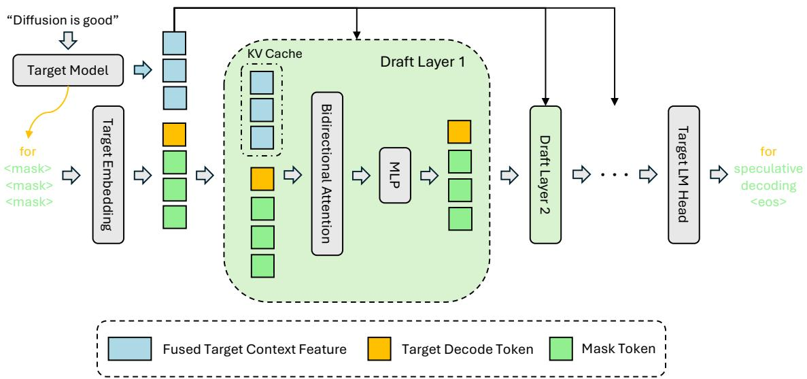
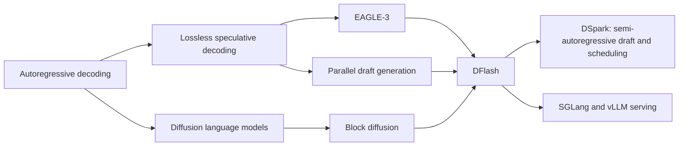
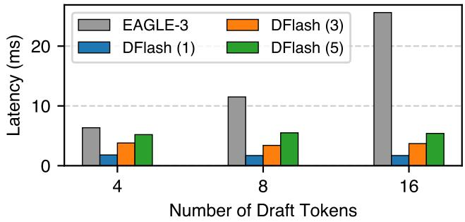
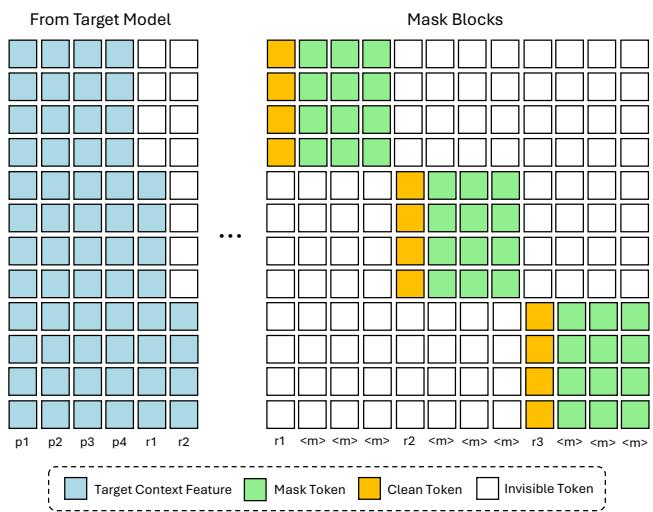
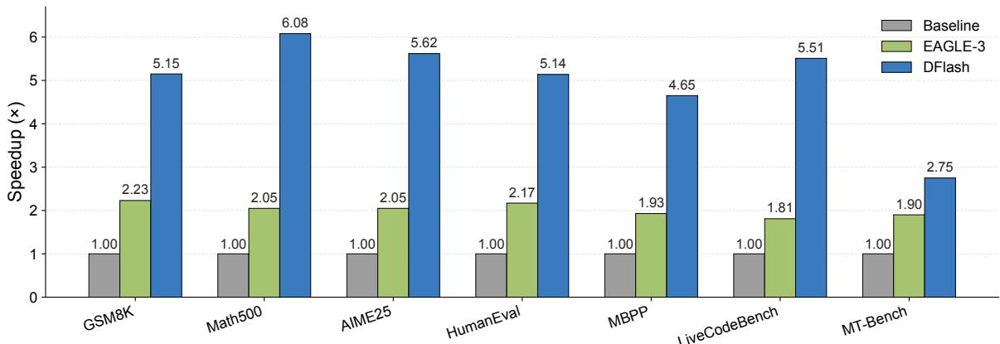

# DFlash: Block Diffusion for Flash Speculative Decoding

**Paper:** DFlash: Block Diffusion for Flash Speculative Decoding  
**Authors:** Jian Chen, Yesheng Liang, Zhijian Liu  
**arXiv:** [2602.06036v2](https://arxiv.org/abs/2602.06036v2) - 29 May 2026

**Related pages:** [EAGLE-3: Training-Time Test for Speculative Decoding](../eagle-3/index.md) · [DSpark: Confidence-Scheduled Speculative Decoding](../dspark/index.md) · [SGLang: Structured Language Model Programs](../sglang/index.md) · [vLLM](../vllm/index.md)

> **Evidence:** This page uses the complete 13-page MinerU precise extraction at `derived/pdf-markdown/frameworks/dflash-block-diffusion-flash-speculative-decoding/dflash-block-diffusion-flash-speculative-decoding.md`. Equations and table cells were normalized against the extracted source figures and the local PDF; reported measurements retain the paper's hardware, model, backend, and concurrency conditions.

## TL;DR

**What:** DFlash is a lightweight block-diffusion drafter for [speculative decoding](../../terms/speculative-decoding.md), where the target model still verifies every proposed prefix losslessly.  
**How:** It fuses hidden states from several target layers and injects the fused context into every draft layer's K/V cache, letting a small masked block predict many tokens in one forward pass.  
**The number:** DFlash reports up to 6.1x speedup on Qwen3-8B, about 2.4x the speedup of EAGLE-3 with a matched 16-token draft budget, and useful gains through concurrency 32 in SGLang and vLLM tests.

## The Big Picture

*Source: [DFlash, Figure 2](https://arxiv.org/abs/2602.06036v2). 1. The target model produces hidden context features and a target decode token. 2. A projection fuses the selected target layers. 3. The fused feature is injected as persistent K/V context into every draft layer. 4. The draft model attends bidirectionally over the target context, the clean anchor, and masked positions before the LM head emits the speculative block.*

The diagram's central lesson is **DFlash gives the small drafter the target's context without making the small drafter reproduce the target's full reasoning**. Diffusion supplies parallel masked-token prediction; target features supply the information that a tiny standalone drafter would otherwise have to rediscover.

## Why This Exists

Consider a target model that has just produced a bonus token after a prompt and now needs to generate the next 16 tokens. An autoregressive drafter such as EAGLE-3 must make several sequential draft passes, while a standalone small diffusion model can predict the block in parallel but may not know enough about the prompt's exact reasoning path. A five-layer diffusion drafter without target context reaches only roughly 2x-3x speedup in the paper's ablation.

The failure is a choice between **serial quality and parallel ignorance**. DFlash keeps the target model as the verifier, but reuses its internal representations to guide a small parallel drafter. The target remains the authority for correctness; the diffusion adapter only has to propose a useful block cheaply.

## The Landscape

*Editable source: [dflash-landscape.mmd](./assets/dflash-landscape.mmd).* **DFlash is the convergence point**: it imports diffusion's block parallelism into speculative decoding, retains target-feature conditioning from the EAGLE line, and leaves the target verifier responsible for exact output distribution. DSpark later uses a DFlash-style backbone and adds local sequential correction plus load-aware verification scheduling.

## The Core Idea

DFlash turns a diffusion language model into a target-conditioned adapter rather than a standalone generator. During the target pass, it compresses hidden states from several depths into a context feature; during the draft pass, it makes that feature available as K/V context in every draft layer while the anchor and masked tokens interact bidirectionally. **The target supplies knowledge, diffusion supplies parallel proposals, and strict verification supplies correctness.**

## Symbol Map

The paper uses $t$ for target-side features, $d$ for draft-side states, $i$ for a draft-layer index, $k$ for a position inside a masked block, and $\tau$ for accepted tokens per speculative cycle. A superscript in parentheses identifies a target layer, while $H_t$ and $H_d$ distinguish context features from draft representations.

| Symbol | Human name | Shape or scope | Plain meaning |
|---|---|---|---|
| $\gamma$ | draft block size | Per speculation cycle | Number of masked positions proposed by DFlash; the default Qwen3 setting is 16. |
| $\tau$ | accepted length | Per cycle | Expected accepted draft tokens plus the target-generated bonus token. |
| $T_{\mathrm{draft}}$ | draft cost | Per cycle | Time for the diffusion adapter to propose the block. |
| $T_{\mathrm{verify}}$ | verification cost | Per cycle | Time for the target model to score the draft block. |
| $H^{(l_j)}$ | target hidden feature | One target layer and token position | Hidden states selected from target layers spanning shallow to deep computation. |
| $H_t$ | fused target context | Target-context sequence | The projected, normalized combination of the selected target hidden features. |
| $H_d$ | draft representation | Masked block | The small diffusion drafter's token and hidden-state sequence. |
| $W_c$ | context projection | $D \times mD$ | Projects $m$ concatenated target features back to the draft hidden dimension $D$. |
| $Q_i,K_i,V_i$ | draft attention projections | Draft layer $i$ | Queries come from draft states; keys and values contain both target context and draft tokens. |
| $p^t, p^d$ | target and draft distributions | Vocabulary vectors | The target distribution used for verification and the DFlash distribution used for proposing tokens. |
| $w_k$ | position loss weight | Position $k$ in a block | Exponentially decays with position so early prediction errors receive more training weight. |

## Deep Dive

### The Target Verifier Remains the Correctness Anchor

**What it does:** DFlash proposes a block, and the target model verifies the block with the standard lossless speculative-decoding rule.

**Why it matters:** A fast drafter is useful only when its extra tokens can replace several serial target steps without changing the target distribution.

**How it works:** If DFlash proposes token $\hat{x}_k$ from $p_k^d$ and the target assigns probability $p_k^t(\hat{x}_k)$, the target accepts that token with probability

$$
\min\left(1, \frac{p_k^t(\hat{x}_k)}{p_k^d(\hat{x}_k)}\right).
$$

Verification stops at the first rejection. The target then samples a correction from the residual distribution and discards the remaining suffix; if the entire block survives, the target emits a bonus token. The average latency per generated token is

$$
L = \frac{T_{\mathrm{draft}} + T_{\mathrm{verify}}}{\tau}.
$$

**The intuition:** DFlash is allowed to guess aggressively because the target, not the drafter, decides what becomes output.

**A concrete example:** If the first three proposed tokens survive but the fourth does not, the first three remain valid, the target supplies the fourth token, and proposals five through sixteen disappear.

**Remember:** DFlash changes the proposal path, not the target-model distribution.

### Target Hidden States Supply the Missing Context

**What it does:** DFlash extracts hidden states from several target layers and fuses them into one compact context feature sequence.

**Why it matters:** A small diffusion model that predicts a future block from token embeddings alone must reconstruct long-range semantics and task-specific reasoning from scratch.

**How it works:** For selected target layers $l_1,\ldots,l_m$, DFlash concatenates their hidden states and applies a shared projection with normalization:

$$
H_t = \operatorname{RMSNorm}\left(W_c[H^{(l_1)};\ldots;H^{(l_m)}]\right).
$$

The paper's standard setup selects five layers uniformly from the second layer through the third-to-last layer. The target's shallow, middle, and deep representations therefore arrive together instead of forcing the drafter to rely on one top-layer signal.

**The intuition:** The target has already interpreted the prompt; DFlash borrows that interpretation instead of rebuilding it in a tiny model.

**A concrete example:** For a math prompt, the fused context can carry the target's representation of the problem and its reasoning direction before the masked block is denoised.

**Remember:** The target features are the quality source that makes a small parallel drafter competitive.

### Per-Layer K/V Injection Prevents Context Dilution

**What it does:** It inserts the fused target context into the key and value projections of every DFlash layer, rather than feeding it only once at the input.

**Why it matters:** If target information enters only at the first layer, deeper draft layers can gradually dilute it as they transform the masked block.

**How it works:** At draft layer $i$, draft states produce queries, while target context and draft states are concatenated in the key and value sequences:

$$
Q_i = W_i^QH_d,\qquad
K_i = [W_i^KH_t; W_i^KH_d],\qquad
V_i = [W_i^VH_t; W_i^VH_d].
$$

The target features bypass the draft model's query projection, output projection, self-attention update, and feed-forward path. They remain available as stable external context at every layer. The paper's ablation shows that K/V injection beats input fusion for both autoregressive and block-diffusion drafting.

**The intuition:** Repeating the context address at every layer is more reliable than handing it over once and hoping the draft network preserves it.

**A concrete example:** A five-layer DFlash drafter can still attend directly to the target's fused features in layer five, even after four layers have transformed the masked-block states.

**Remember:** DFlash conditions depth by extending attention context, not by making the draft model larger.

### Block Diffusion Makes Draft Cost Nearly Independent of Block Length

*Source: [DFlash, Figure 3](https://arxiv.org/abs/2602.06036v2). A five-layer DFlash drafter's latency rises modestly as the block grows from 4 to 16 tokens, while the sequential EAGLE-3 cost rises much more sharply.*

**What it does:** It replaces sequential draft steps with one bidirectional denoising pass over an anchor followed by masked positions.

**Why it matters:** Autoregressive draft cost grows with the number of proposed tokens, which forces the drafter to stay shallow or use a small speculation budget.

**How it works:** An autoregressive drafter pays approximately

$$
T_{\mathrm{draft}} = \gamma t_{\mathrm{step}},
$$

whereas DFlash performs the block in one parallel pass:

$$
T_{\mathrm{draft}} = t_{\mathrm{parallel}}.
$$

The draft input contains the clean target-produced anchor plus mask tokens. Masked positions attend bidirectionally within the block, so all proposed positions are produced together. The target later restores the causal contract through verification.

**The intuition:** DFlash moves serial dependence out of the expensive draft computation and leaves exact left-to-right selection to the target verifier.

**A concrete example:** A 16-token DFlash block can be proposed by one five-layer pass, while EAGLE-3 must repeatedly advance its autoregressive draft state to build an equivalent horizon.

**Remember:** The block size becomes a throughput knob rather than a direct multiplier on draft passes.

### Training Rehearses the Same Masked Blocks Used at Runtime

*Source: [DFlash, Figure 4](https://arxiv.org/abs/2602.06036v2). Clean target context features are visible to each block, tokens interact bidirectionally inside their own masked block, and invisible tokens prevent information leakage across blocks.*

**What it does:** DFlash trains on randomly sampled anchor positions and masked blocks, using sparse attention to pack many independent draft blocks into one training sequence.

**Why it matters:** Standard diffusion training does not necessarily match speculative decoding, where every draft cycle starts from a clean target-produced anchor and must respect causal block boundaries.

**How it works:** The target processes a clean prompt-response sequence and supplies hidden features. DFlash samples anchors from the response, keeps each anchor clean, masks the following block positions, and trains the drafter to predict them in parallel. Within one block, masked positions attend bidirectionally; across blocks, attention is blocked. Flex Attention allows the packed sparse mask to run as one forward and backward pass. The number of blocks per sequence is fixed, while anchor locations are resampled each epoch for data augmentation and bounded long-context cost.

**The intuition:** Training draws the same small movie that inference will replay: a known anchor, a masked future block, and no information leaking from another block.

**A concrete example:** If an anchor is sampled at response position $r_2$, the following masked positions can see $r_2$ and their own block context, but not the tokens in a neighboring block beginning at $r_3$.

**Remember:** Random anchors and block-local masks align training with the target-to-drafter handoff at inference.

### Early Positions Receive More Learning Budget

**What it does:** It weights the draft loss more heavily near the beginning of each block.

**Why it matters:** Prefix verification makes an early error more expensive: it discards every later proposal in the block.

**How it works:** For position $k$, DFlash uses

$$
w_k = \exp\left(-\frac{k-1}{\gamma}\right).
$$

The weight is applied to the token-level cross-entropy objective. The drafter also shares the target embedding and LM head, both frozen, so training updates only the draft Transformer layers and the context projection path.

**The intuition:** The first few guesses deserve more practice because they decide whether the rest of the block gets a chance to count.

**A concrete example:** Improving the first token of a 16-token block can preserve fifteen later opportunities, while improving only the last token changes at most one accepted position.

**Remember:** DFlash trains for prefix survival, not uniform per-position accuracy.

## Putting It Together

Follow one speculative cycle for a prompt whose target model has just produced anchor token $x_0$ and whose next draft block has size $\gamma=16$.

| Step | Actor | Input state | Action | Output state |
|---:|---|---|---|---|
| 1 | Target model | Prompt prefix plus current [KV cache](../../terms/kv-cache.md) | Run the target step and retain the selected hidden features and anchor $x_0$. | Target context $H_t$ and a clean anchor for the next draft cycle. |
| 2 | Context projection | Five target-layer feature sequences | Concatenate, project, and normalize the target features. | One fused context sequence ready for all draft layers. |
| 3 | DFlash draft | $x_0$ plus 15 mask tokens | Run the five-layer block-diffusion adapter; every layer receives $H_t$ as K/V context and masked positions attend within the block. | Sixteen draft distributions and a proposed token block. |
| 4 | Target verifier | Target state plus the proposed block | Score all positions in parallel and apply the lossless acceptance rule from left to right. | Accepted prefix, a target correction at the first rejection, and discarded suffix tokens. |
| 5 | Serving loop | Corrected target state and accepted tokens | Treat the new target output as the next anchor and repeat. | Several serial target steps are replaced by one draft-plus-verify cycle. |

The handoff that matters is step 3 to step 4: **DFlash can be wrong safely because the target verifies the block before any token becomes user-visible output.**

## What This Buys You

### The headline claim

DFlash moves the speculative-decoding frontier by making the drafter both deeper and more parallel: target conditioning raises acceptance while block diffusion keeps draft cost low.

*Source: [DFlash, Figure 1](https://arxiv.org/abs/2602.06036v2). On Qwen3-8B with the Transformers backend, DFlash reaches 4.65x-6.08x speedup across the shown tasks, while EAGLE-3 remains near 1.8x-2.2x.*

### How we know: draft quality and serving

| Evidence slice | Reported result | What it isolates |
|---|---:|---|
| Qwen3-8B, no thinking, Transformers | 4.9x average speedup; 2.4x over EAGLE-3 (16) | DFlash's block-diffusion draft quality and cost under matched offline conditions. |
| Qwen3-8B, thinking enabled | Roughly 4.5x greedy and 3.9x sampling speedup | The drafter remains useful on long reasoning traces. |
| Qwen3-8B, SGLang, Math500 | 5.1x at concurrency 1; 2.8x at concurrency 32 | End-to-end serving gain persists, but shrinks as concurrency increases. |
| Qwen3.5-9B, vLLM, MT-Bench | 3.0x at concurrency 1; 1.3x at concurrency 32 | The method transfers beyond SGLang and remains positive near saturation in this setup. |

### The mechanism behind the numbers

The gain is multiplicative across two independent levers. Figure 3 shows that a deeper DFlash drafter can still be cheaper than EAGLE-3 at the same proposed-token count because it performs one parallel block pass instead of many serial draft steps. The K/V ablation then shows why the parallel model is accurate enough: target features remain available in every draft layer, rather than being diluted after the input layer. Finally, the block-local training mask and position-decayed loss teach the adapter to prioritize the prefixes that determine accepted length.

### How to read these numbers

> **Warning:** These are system measurements, not universal model speedups. The paper uses H200 for most offline experiments, B200 for SGLang serving, target-specific hidden-feature extraction, strict target verification, and backend-specific scheduling. At higher concurrency the target has less spare parallel capacity, so the speedup falls from the low-single-request results rather than remaining fixed.

## Where It Breaks

| Failure mode | When it happens | Impact |
|---|---|---|
| Target and drafter are mismatched | The target model, tokenizer, hidden dimension, selected layers, or shared LM head changes. | The context projection and draft checkpoint no longer align; DFlash needs target-specific training or adaptation. |
| The context window exceeds training coverage | The base Qwen3.5-27B drafter trained at 4K context is used far beyond that range without long-context fine-tuning. | Acceptance length degrades; the paper reports lightweight LongAlign fine-tuning is needed to recover long-context behavior. |
| Verification is compute-bound | Concurrency is high or the target batch is already saturated. | Extra draft tokens cost more to verify, so the serving gain shrinks; vLLM MT-Bench falls to 1.3x at concurrency 32 in the reported setup. |
| Block sizes are mismatched | Inference uses a size unlike training, especially a small-trained model asked to use a larger block. | Acceptance drops asymmetrically; a block-16 model generalizes down to block 8 better than the reverse. |
| Feature extraction or caching dominates | More target layers are selected, or offline training caches long target hidden states. | Training storage grows linearly with the number of features, and target-side context work can reduce the net serving gain. |
| A standalone diffusion model is used | The drafter does not receive target hidden context. | The paper's five-layer no-context ablation reaches only modest roughly 2x-3x speedups. |

## One Thing to Remember

DFlash's durable frame is **target-conditioned parallel speculation**: let the target model contribute its rich hidden context, let a small block-diffusion adapter propose many masked tokens at once, and let strict verification decide the exact output. The method wins because it separates knowledge, parallelism, and correctness instead of asking one small drafter to provide all three.

## Go Deeper

- **Read:** [DFlash on arXiv](https://arxiv.org/abs/2602.06036v2) or the local [source PDF](../../../raw/frameworks/dflash-block-diffusion-flash-speculative-decoding--arxiv-2602.06036v2.pdf).
- **Build on:** [EAGLE-3](../eagle-3/index.md) for autoregressive feature drafting and [DSpark](../dspark/index.md) for semi-autoregressive correction and load-aware verification.
- **Understand the serving context:** [SGLang](../sglang/index.md), [vLLM](../vllm/index.md), and [Speculative Decoding](../../terms/speculative-decoding.md).
- **Reuse the synthesis:** [dflash-landscape.mmd](./assets/dflash-landscape.mmd) is the editable evolutionary map for diffusion-based speculative drafting.
- **Reproduce:** [DFlash code](https://github.com/z-lab/dflash) and [DFlash checkpoints](https://hf.co/collections/z-lab/dflash) are linked by the paper.
