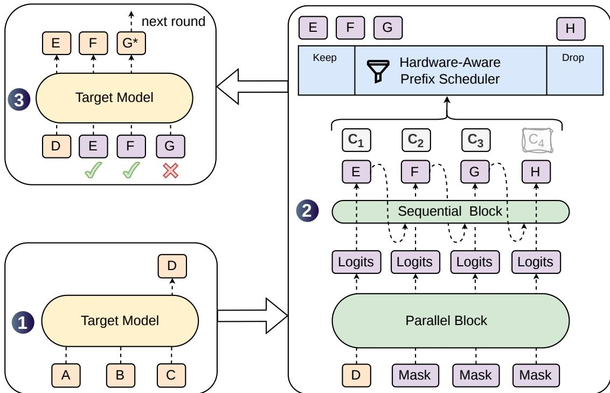
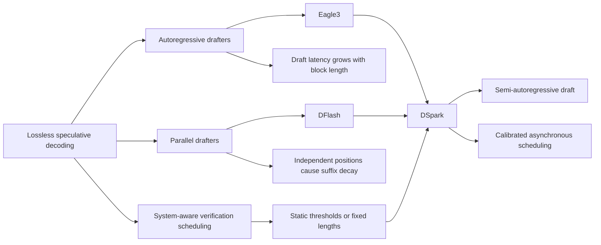
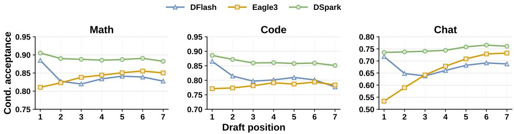
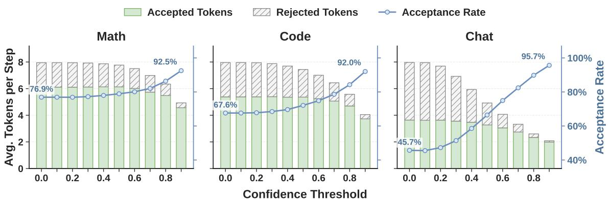
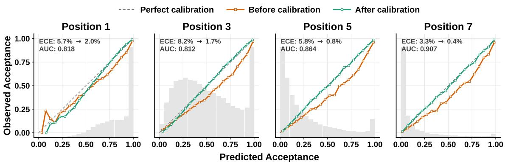
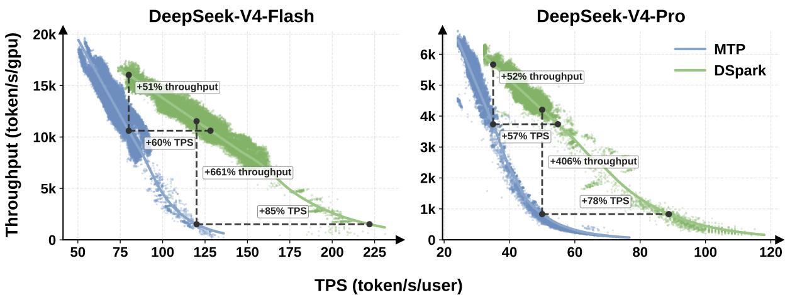
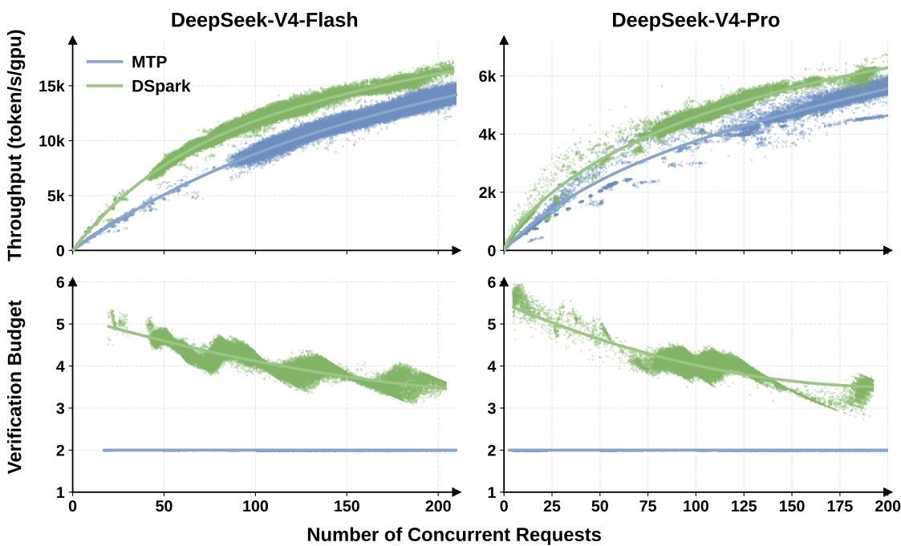

# DSpark: Confidence-Scheduled Speculative Decoding

**Paper:** DSpark: Confidence-Scheduled Speculative Decoding with Semi-Autoregressive Generation  
**Authors:** Xin Cheng, Xingkai Yu, Chenze Shao, Jiashi Li, Yunfan Xiong, Yi Qian, Jiaqi Zhu, Shirong Ma, Xiaokang Zhang, Jiasheng Ye, Qinyu Chen, Chengqi Deng, Jiping Yu, Damai Dai, Zhengyan Zhang, Yixuan Wei, Yixuan Tan, Wenkai Yang, Runxin Xu, Yu Wu, Zhean Xu, Xuanyu Wang, Muyang Chen, Rui Tian, Xiao Bi, Zhewen Hao, Shaoyuan Chen, Huanqi Cao, Wentao Zhang, Anyi Xu, Huishuai Zhang, Dongyan Zhao, Wenfeng Liang  
**arXiv:** 2607.05147v1 - 6 Jul 2026

**Related pages:** [DeepSeek-V4 Inference on Ascend](../vllm-ascend/deepseek-v4-inference.md) · [vLLM Continuous Batching](../vllm/vllm-continuous-batching/index.md) · [DeepSeek-V4: Million-Token Context](../../training/deepseek/deepseek-v4/index.md) · [SGLang: Structured Language Model Programs](../sglang/index.md) <!-- termlint-ignore: continuous-batching -- Navigation label already links the dedicated continuous-batching insight. -->

> **Evidence:** This page uses the completed PDF extraction at `derived/pdf-markdown/frameworks/dspark-confidence-scheduled-speculative-decoding.md` for the paper's equations, figures, experiments, and deployment details. A few extracted symbols were malformed by PDF layout conversion; they were checked against the source PDF and the surrounding definitions before being normalized here.

## TL;DR

**What:** DSpark is a speculative decoding framework that improves both the draft block and the target-model verification decision.
**How:** A parallel backbone proposes the block, a lightweight sequential head restores prefix dependence, and a calibrated scheduler allocates verification capacity using the engine's measured throughput curve.
**The number:** In DeepSeek-V4 live serving, DSpark improves matched-capacity per-user generation speed by 60%-85% on V4-Flash and 57%-78% on V4-Pro over the MTP-1 baseline.

## The Big Picture

*Source: [DSpark, Figure 1](https://arxiv.org/abs/2607.05147). 1. The target model emits an anchor token from the prompt. 2. A parallel block produces draft logits, then a sequential head samples draft tokens and confidence scores from left to right. 3. The prefix scheduler keeps only the worthwhile draft prefix before target verification, where the target accepts a prefix and emits a corrected bonus token.*

The figure's central lesson is **DSpark is a drafter and a batch-capacity allocator**. It uses a fast parallel proposal to create options, then spends target-model work only on the prefix extensions that have enough expected value under current load.

## Why This Exists

Imagine a busy batch in which one request is heading toward the phrase "of course, I can help." A fully parallel drafter can produce "of problem" or "no course": each position is individually plausible, but later positions were not conditioned on the sampled earlier token.

Speculative verification accepts only a contiguous prefix. If the third draft token is rejected, later proposals are discarded even if they would have matched the target model. Verifying those weak suffixes also consumes target-model batch capacity that could serve another request. **The paper therefore treats suffix quality and verification budget as one coupled serving problem.**

## The Landscape

*Editable source: [dspark-landscape.mmd](./assets/dspark-landscape.mmd).* **DSpark combines the strongest useful properties of the competing paths**: the initial capacity of a deep parallel drafter, local prefix dependence from autoregression, and system-aware verification instead of a fixed length or threshold.

## The Core Idea

DSpark makes speculative decoding a two-stage control loop: first make a long draft block internally coherent without paying for a full autoregressive draft, then choose how much of that block the target model should verify based on calibrated prefix survival and the current batch-throughput tradeoff.

## Symbol Map

The paper uses $k$ for a position inside one draft block and $r$ for a request in the active batch. The symbol $B$ is overloaded: $B_k$ is a transition bias, while $B$ in the scheduler is the target-model token batch size.

| Symbol | Human name | Shape or scope | Plain meaning |
|---|---|---|---|
| $x_0$ | anchor token | One token per request | The target-model token that starts the next draft cycle. |
| $\gamma$ | maximum draft length | Per cycle | The largest number of draft tokens proposed by the drafter. |
| $U_k$ | base logits | Vocabulary vector at position $k$ | The parallel backbone's prediction before sequential correction. |
| $B_k$ | transition bias | Vocabulary vector at position $k$ | A prefix-dependent correction added to $U_k$. |
| $c_{r,k}$ | conditional survival probability | One scalar per request and position | Probability that token $k$ survives, assuming the earlier prefix survived. |
| $a_{r,j}$ | prefix survival probability | One scalar per request and prefix length | Probability that the first $j$ draft tokens survive together. |
| $\ell_r$ | scheduled verification length | One integer per request | How many draft tokens request $r$ sends to target verification. |
| $B$ | target batch size | Total tokens in a verification pass | $B = \sum_r (1 + \ell_r)$ under the paper's simplifying model. |
| $\mathrm{SPS}(B)$ | engine capacity curve | Profiled lookup over batch sizes | Target-model steps per second at token batch size $B$. |
| $\Theta$ | expected token throughput | One scalar for a candidate schedule | Expected accepted tokens multiplied by $\mathrm{SPS}(B)$. |

## Deep Dive

### Lossless Verification Turns Draft Quality into Prefix Survival

**What it does:** Speculative decoding samples a draft block and lets the target model accept the longest valid prefix, followed by one target-generated bonus token.

**Why it matters:** A token's value is not independent of earlier tokens. A rejection at position $k$ discards every proposed token after $k$, so early positions have greater leverage than late positions.

**How it works:** At each position, rejection sampling compares draft and target distributions with acceptance probability $\min(1, p^t_k(x_k) / p^d_k(x_k))$. The target distribution remains exact because the accepted prefix and bonus token are produced by the standard lossless correction rule. If $c_{r,k}$ is the conditional survival probability, the expected survival of prefix $j$ is

$$
a_{r,j} = \prod_{i=1}^{j} c_{r,i}.
$$

The ordinary per-token latency is governed by draft time, verification time, and accepted length. DSpark improves all three levers indirectly: it keeps the parallel draft pass cheap, raises accepted length, and avoids verifying low-value suffixes.

**The intuition:** Speculative decoding is a chain, so a weak link near the front throws away more work than a weak link at the end.

**A concrete example:** In the "of course" request, an incorrect first token prevents every later draft token from contributing, even if those later tokens were individually reasonable.

**Remember:** DSpark optimizes prefix survival, not isolated token accuracy.

### Parallel Capacity Plus a Small Sequential Head

**What it does:** DSpark keeps the expensive draft backbone parallel and adds a cheap sequential correction that conditions each sampled token on the prefix actually sampled.

**Why it matters:** Autoregressive drafters preserve dependencies but their draft latency grows with $\gamma$; fully parallel drafters keep latency nearly fixed but suffer suffix decay.

**How it works:** The DFlash-style backbone consumes the anchor plus $\gamma - 1$ mask embeddings and emits $\gamma$ base-logit vectors in one pass. The sequential stage samples left to right from

$$
p_k(v \mid x_0, x_{<k}) = \operatorname{softmax}\left(U_k(v) + B_k(x_0, x_{<k}, v)\right).
$$

The default Markov head uses a low-rank transition matrix $B = W_1 W_2$ with rank 256 in the paper's default configuration. The RNN head keeps a recurrent state for the whole in-block prefix; it offers marginal extra gains at longer lengths but is more complex, so the Markov head is used by default in experiments and deployment.

**The intuition:** Let the large parallel module decide what is plausible, and let a tiny serial module keep the sampled suffix on one semantic path.

**A concrete example:** Once the first draft token is sampled as "of," the Markov head can boost "course" and suppress the competing continuation "problem" at the next position.

**Remember:** A little autoregression repairs the exact failure mode of independent parallel positions without making the whole draft autoregressive.

### Confidence Head and Sequential Temperature Scaling

**What it does:** DSpark predicts each token's conditional survival probability and calibrates the resulting prefix probabilities before scheduling.

**Why it matters:** A scheduler needs absolute probabilities to estimate expected accepted tokens, not just a ranking of which candidate looks better.

**How it works:** The confidence head projects the backbone hidden state and the previous-token embedding through a sigmoid. Its soft target is the analytical acceptance probability

$$
c_k^* = 1 - \frac{1}{2}\lVert p_k^d - p_k^t \rVert_1.
$$

Because prefix survival is a product of conditional probabilities, Sequential Temperature Scaling calibrates those cumulative products from left to right on held-out data. The one-dimensional temperature search reduces overconfidence while preserving the candidate ranking.

*Source: [DSpark, Figure 2](https://arxiv.org/abs/2607.05147). DFlash starts strongly because its parallel backbone can be deeper, but its conditional acceptance decays across positions; DSpark keeps a high, flatter curve by restoring local dependence.*

**The intuition:** Calibration answers "how likely is this prefix to survive?" rather than merely "which prefix looks best?"

**A concrete example:** If two requests have similarly ranked suffixes but one confidence estimate is overconfident, an uncalibrated scheduler may spend capacity on a prefix that rarely survives.

**Remember:** STS is part of the scheduling mechanism, not a cosmetic confidence post-processing step.

### Hardware-Aware Prefix Scheduling

**What it does:** DSpark allocates different verification lengths to active requests to maximize expected batch token throughput.

**Why it matters:** Verifying an extra token is cheap when the engine has spare capacity and expensive when it pushes the target model onto a lower-throughput part of its batch curve.

**How it works:** For request $r$, the scheduler considers every prefix extension $(r,j)$ with survival $a_{r,j}$, sorts candidates by survival, and evaluates

$$
  au = \sum_{r=1}^{R}\left(1 + \sum_{j=1}^{\ell_r} a_{r,j}\right),
\qquad
\Theta = \tau \cdot \mathrm{SPS}(B).
$$

The offline algorithm admits candidates along this greedy path while $\Theta$ improves. The paper's crucial causality result is that a retrospective search over current candidates can leak a sampled token into the decision that should precede it. The theoretical algorithm therefore stops at the first throughput decline when a unimodal SPS curve is assumed.

**The intuition:** The scheduler is spending a shared target-model budget, one prefix extension at a time.

**A concrete example:** If request A's fourth token has low survival but request B's second token has high survival, the global ranking can extend B without blindly extending A.

**Remember:** The optimization target is expected accepted tokens per unit of target-model capacity, not the longest draft block.

### Production Scheduling Adds a Causal Delay

**What it does:** The production scheduler adapts the theoretical allocation to jagged hardware capacity curves, CUDA graph replay, and Zero-Overhead Scheduling (ZOS).

**Why it matters:** The ideal algorithm's global search assumes a smooth, unimodal capacity curve and dynamic decisions available before the next engine step. Real SPS curves are discrete and graph-replay systems need future batch sizes early.

**How it works:** DSpark makes two related decisions at different times:

| Decision | Information used | Purpose |
|---|---|---|
| Current candidate ranking | Current cumulative confidence values | Prioritize the most promising draft tokens. |
| Upcoming capacity limit | Confidence outputs from two steps earlier | Set a dynamic top-$k$ limit without stalling the current step. |

The delayed capacity signal is a causal barrier: it cannot depend on the current draft token that has not yet been sampled. That lets production remove the theoretical early-stop break and search across jagged SPS cliffs while preserving the non-anticipating property required for exact target-distribution recovery.

For variable-length verification, DeepSeek flattens tokens from different requests and passes their sequence relationships through a marker tensor in sparse attention. The paper reports that only the DeepSeek-V4 index-attention and compress kernels need modification for this routing.

**The intuition:** The system plans capacity from an earlier snapshot while ranking today's candidates with today's scores, keeping the GPU moving without letting future token realizations choose their own admission.

**A concrete example:** The engine can enter the next graph replay with a capacity limit already known, even while the current batch is still producing the confidence values used to rank its draft prefixes.

**Remember:** The two-step delay is the production mechanism that reconciles dynamic scheduling with lossless speculation and low scheduling overhead.

### Training Makes Early Prefixes Count

**What it does:** DSpark trains the parallel backbone, sequential head, and confidence head against the frozen target model.

**Why it matters:** Next-token accuracy alone does not teach the drafter which errors destroy an entire suffix or give the scheduler trustworthy probabilities.

**How it works:** The objective combines position-weighted cross entropy, total-variation distribution matching, and confidence binary cross entropy:

| Loss | Target | Why it is included |
|---|---|---|
| Cross entropy | Ground-truth token | Keeps the draft distribution useful for language modeling. |
| Total variation | Target distribution | Directly optimizes a proxy for rejection-sampling acceptance. |
| Confidence loss | Soft acceptance target $c_k^*$ | Teaches the scheduler's probability signal. |

The position weight is $w_k = \exp(-(k-1)/\gamma)$, emphasizing early positions. The target model and the shared embedding and language-model head stay frozen. During scalable training, the authors communicate hidden states rather than full vocabulary logits and pack independently sampled anchor blocks with token-level attention indices.

**The intuition:** The loss function knows that an early mistake wastes more future work than a late mistake.

**A concrete example:** The first token in the "of course" block receives more leverage in the objective because its rejection prevents every later token from being accepted.

**Remember:** DSpark trains for prefix survival and calibrated decisions, not only for local next-token likelihood.

## Putting It Together

Follow one request with prompt ending in `ABC` inside a larger active batch. The target model emits `D` as the anchor, and the request is eligible for at most five draft tokens.

| Step | Actor | Input state | Action | Output state |
|---:|---|---|---|---|
| 1 | Target model | Prompt ending in `ABC` | Run one target step. | Anchor `D` starts the next cycle. |
| 2 | Parallel backbone | `D` plus four mask embeddings | Produce five base-logit vectors in one forward pass. | Candidate distributions $U_1, \ldots, U_5$. |
| 3 | Sequential head | $U_k$ plus the sampled prefix | Sample `E`, then condition the next positions on the tokens already sampled. | A coherent draft such as `E F G H I` and conditional scores $c_1, \ldots, c_5$. |
| 4 | Confidence head and STS | Conditional scores for this request | Convert them to calibrated prefix survival $a_j = \prod_{i \le j} c_i$. | A survival estimate for every possible prefix. |
| 5 | Batch scheduler | All active requests, current rankings, and the two-step-old capacity signal | Rank current prefix extensions and apply the delayed dynamic top-$k$ capacity limit. | A per-request verification length $\ell_r$; low-value suffixes are dropped. |
| 6 | Target model | Flattened variable-length prefixes | Verify the selected prefixes in one batch. | The longest valid prefix is accepted; a target-generated bonus token repairs the first rejection. |
| 7 | Serving loop | Accepted tokens and new target state | Feed the new anchor into the next cycle. | The process repeats with no change to the target distribution. |

This trace shows why **DSpark's unit of optimization is the active batch**. Draft quality decides which prefixes can survive; the scheduler decides which of those prefixes deserve target-model capacity now.

## What This Buys You

### The headline claim

DSpark moves the serving Pareto frontier outward by combining a stronger long-block drafter with verification budgets that expand under spare capacity and contract as concurrency saturates the engine.

### How we know: offline draft quality

The offline evaluation disables confidence scheduling so that accepted-length results measure the drafter alone. Across Qwen3-4B, 8B, and 14B targets, DSpark improves macro-average accepted length as follows:

| Comparison | Qwen3-4B | Qwen3-8B | Qwen3-14B |
|---|---:|---:|---:|
| DSpark over Eagle3 | +30.9% | +26.7% | +30.0% |
| DSpark over DFlash | +16.3% | +18.4% | +18.3% |

The effect generalizes to Gemma4-12B. On Qwen3-4B, DSpark's accepted length averages about 5.57 on math, 5.12 on code, and 3.49 on chat, showing why one fixed verification length cannot fit all domains.

The position-wise result explains the aggregate gain: DFlash starts with strong first-position capacity but decays across the block, while DSpark stays flatter. The paper also reports that a two-layer DSpark beats a five-layer DFlash across domains, and that increasing proposal length from 7 to 15 widens DSpark's relative gain from roughly 16%/15%/18% to 30%/26%/22% on math/code/chat. Increasing draft length from 4 to 16 adds only 0.2%-1.3% to full-round latency in the reported batch-128 setup.

*Source: [DSpark, Figure 2](https://arxiv.org/abs/2607.05147). The paper's diagnostic isolates each position after conditioning on an accepted earlier prefix, revealing parallel capacity at the front and suffix decay at the tail.*

### How we know: confidence pruning and calibration

*Source: [DSpark, Figure 5](https://arxiv.org/abs/2607.05147). Thresholding is a diagnostic, not the final production policy: as the threshold rises, acceptance increases from 76.9% to 92.5% on math, 67.6% to 92.0% on code, and 45.7% to 95.7% on chat while fewer tokens are verified.*

The threshold sweep shows that confidence can identify low-value suffixes, especially in open-ended chat. Production cannot use a static threshold safely because the opportunity cost of a verification token changes with load.

*Source: [DSpark, Figure 6](https://arxiv.org/abs/2607.05147). Raw confidence is discriminative but overconfident; sequential temperature scaling reduces the reported expected calibration error from roughly 3%-8% to about 1% on the illustrated evaluation.*

### How we know: live traffic serving

*Source: [DSpark, Figure 7](https://arxiv.org/abs/2607.05147). The green DSpark frontier lies outside the MTP baseline across the measured V4-Flash and V4-Pro traffic regimes.*

The production comparison is DSpark-5 against MTP-1 in preview DeepSeek-V4-Flash and V4-Pro serving.

| Engine | Moderate interactivity target | Strict interactivity target | Matched-capacity per-user speed |
|---|---|---|---|
| DeepSeek-V4-Flash | +51% aggregate throughput at 80 tok/s/user | +661% at 120 tok/s/user | +60%-85% |
| DeepSeek-V4-Pro | +52% aggregate throughput at 35 tok/s/user | +406% at 50 tok/s/user | +57%-78% |

*Source: [DSpark, Figure 8](https://arxiv.org/abs/2607.05147). DSpark grows from roughly four to six verified tokens per request when capacity is available, then reduces its budget as concurrency rises; the MTP-1 reference remains near a fixed two-token budget in the plotted deployment.*

### The mechanism behind the numbers

The offline gain comes from the drafter: a deeper parallel backbone improves the first position, and the sequential head prevents the later positions from drifting into incompatible modes. The live gain comes from the scheduler: it uses idle target capacity at moderate concurrency and prunes risky suffixes when the target-model batch curve becomes expensive.

### How to read these numbers

> **Warning:** The +661% and +406% strict-SLA ratios are not ordinary speedups over a well-utilized baseline. At those interactivity targets, MTP-1 collapses toward a low-concurrency operating point; the more stable claim is that DSpark keeps useful throughput at a frontier the baseline cannot efficiently sustain.

## Where It Breaks

| Failure mode | When it happens | Impact |
|---|---|---|
| Draft overhead is unrecoverable | A request has very low acceptance or a short continuation | The fixed cost of generating the initial $\gamma$-token block can exceed the saved target work. |
| Calibration shifts out of domain | Confidence is used on workloads unlike the held-out calibration set | Expected accepted-token estimates become biased, leading to poor capacity allocation. |
| Hardware profile is stale | $\mathrm{SPS}(B)$ does not match the deployed engine, model, or kernel configuration | The scheduler may choose verification lengths that land on the wrong throughput regime. |
| Load changes faster than the delay | The two-step-old capacity signal no longer predicts the upcoming batch regime | The rank-preserving policy can remain correct but less throughput-optimal. |
| Causal scheduling is implemented incorrectly | A current sampled token influences the admission decision for that same token | The non-anticipating condition can fail, invalidating the lossless distribution guarantee. |
| Variable-length execution is inefficient | The serving stack pads or poorly balances flattened prefix tokens | Kernel overhead can erase the algorithmic scheduling gain. |
| Offline and live regimes differ | Domain mix, concurrency, SLA, or target model differs from the reported evaluation | Accepted-length improvements may not translate into the same serving frontier. |

## One Thing to Remember

DSpark's durable frame is **speculative decoding as causal batch-capacity allocation**: make the draft suffix depend on the prefix that was actually sampled, estimate which prefixes will survive, and use a delayed hardware signal to spend target-model verification only where the expected accepted tokens justify the cost.

## Go Deeper

- **Read:** [DSpark: Confidence-Scheduled Speculative Decoding with Semi-Autoregressive Generation](https://arxiv.org/abs/2607.05147) and the local [raw PDF](../../../raw/frameworks/dspark-confidence-scheduled-speculative-decoding--arxiv-2607.05147v1.pdf).
- **Build on:** [DFlash](https://arxiv.org/abs/2602.06036), [EAGLE-3](https://openreview.net/forum?id=4exx1hUffq), and MTP-1, the production baseline used by the paper.
- **Understand the serving context:** [DeepSeek-V4 Inference on Ascend](../vllm-ascend/deepseek-v4-inference.md), [vLLM Continuous Batching](../vllm/vllm-continuous-batching/index.md), [PagedAttention](../../terms/pagedattention.md), and [Mixture of Experts](../../terms/mixture-of-experts.md). <!-- termlint-ignore: continuous-batching -- Navigation label already links the dedicated continuous-batching insight. -->
- **Reuse the visual:** [dspark-landscape.mmd](./assets/dspark-landscape.mmd) is the editable synthesis of the paper's related-work relationships.
- **Reproduce:** The paper announces DSpark checkpoints and the DeepSpec training repository; no corresponding local code source is registered in this knowledge base.
