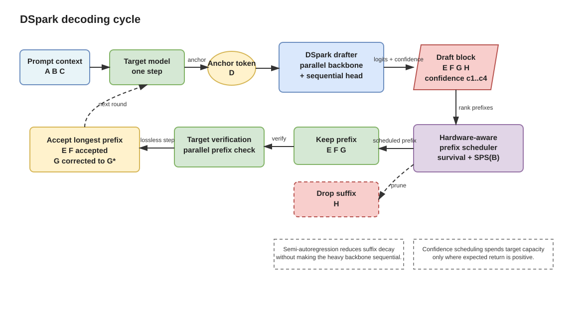
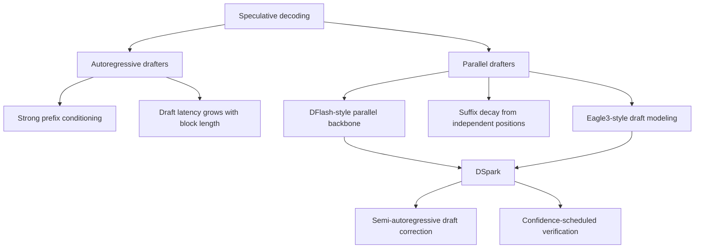

# DSpark: Confidence-Scheduled Speculative Decoding

**Paper:** DSpark: Confidence-Scheduled Speculative Decoding with Semi-Autoregressive Generation  
**Authors:** Xin Cheng, Xingkai Yu, Chenze Shao, Jiashi Li, Yunfan Xiong, Yi Qian, Jiaqi Zhu, Shirong Ma, Xiaokang Zhang, Jiasheng Ye, Qinyu Chen, Chengqi Deng, Jiping Yu, Damai Dai, Zhengyan Zhang, Yixuan Wei, Yixuan Tan, Wenkai Yang, Runxin Xu, Yu Wu, Zhean Xu, Xuanyu Wang, Muyang Chen, Rui Tian, Xiao Bi, Zhewen Hao, Shaoyuan Chen, Huanqi Cao, Wentao Zhang, Anyi Xu, Huishuai Zhang, Dongyan Zhao, Wenfeng Liang  
**arXiv:** 2607.05147v1 - 6 Jul 2026

**Related pages:** [vLLM: PagedAttention Serving Framework](../vllm-framework.md), [SGLang: Structured Language Model Programs](../sglang-framework.md)

## TL;DR

**What:** DSpark is a speculative decoding framework for high-concurrency LLM serving that improves both draft quality and verification scheduling.
**How:** It keeps a parallel draft backbone, adds a lightweight sequential head so draft suffixes depend on earlier sampled draft tokens, then uses calibrated confidence scores and hardware throughput curves to choose per-request verification lengths.
**The number:** In DeepSeek-V4 production serving, DSpark improves matched-capacity per-user generation speed by 60%-85% for V4-Flash and 57%-78% for V4-Pro versus the previous MTP-1 baseline.

## The Big Picture



*1. A parallel backbone proposes a multi-token draft block. 2. A lightweight sequential head corrects the suffix using the sampled draft prefix. 3. A calibrated confidence scheduler decides how much of each request is worth verifying on the target model.*

The editable Draw.io source is [dspark-decoding-cycle.drawio](./dspark-decoding-cycle.drawio). The diagram's key point is that **DSpark is not just a better drafter**: it also decides when verifying an extra draft token is a good use of scarce target-model batch capacity.

## Why This Exists

Imagine a busy serving batch where one request is drafting the phrase "of course, I can help." A fully parallel drafter may propose later tokens without knowing which earlier draft token was actually sampled. That can create a mixed suffix: the first tokens follow one plausible continuation, while the later tokens drift toward another.

Speculative verification accepts only a contiguous prefix. If the third draft token fails, the fourth and fifth proposed tokens cannot be used even if they looked locally plausible. Under high concurrency, asking the target model to verify those weak suffixes wastes batch slots that could have served another request.

DSpark exists because **speculative decoding has two coupled bottlenecks**: the drafter must produce draft blocks whose suffixes survive verification, and the serving engine must avoid spending target-model capacity on suffixes unlikely to survive.

## The Landscape



DSpark sits between the two older drafter families. **Autoregressive drafters condition well but become slow for long blocks**; parallel drafters are fast but tend to lose suffix quality. DSpark keeps the parallel backbone's throughput advantage while adding just enough sequential dependency to make later draft positions less brittle.

## The Core Idea

DSpark treats speculative decoding as a joint model-and-systems problem: first make the proposed draft block internally consistent, then verify only the prefix lengths that are likely to pay off on the current hardware load.

## Deep Dive

### Semi-Autoregressive Draft Generation

**What it does:** DSpark generates a draft block with a parallel backbone, then samples each draft token with a lightweight prefix-dependent correction.

**Why it matters:** This targets the "of course, I can help" failure case where a parallel drafter's suffix does not condition on the prefix that was actually sampled.

**How it works:**

| Stage | Mechanism | Role |
|---|---|---|
| Parallel backbone | DFlash-style hidden states and base logits for all draft positions in one pass | Keeps draft latency low for multi-token blocks |
| Sequential head | Prefix-dependent transition bias before each draft-token sample | Makes later positions depend on earlier sampled draft tokens |
| Target verification | Full model checks the draft block in parallel | Preserves exact target-model distribution recovery |

The paper studies two sequential heads:

| Head | Mechanism | Deployment interpretation |
|---|---|---|
| Markov head | Low-rank first-order transition bias from the immediately previous token | Default choice; simple and efficient |
| RNN head | Recurrent state over the draft-block prefix | Slightly stronger at long draft lengths, but more complex |

One implementation detail is that DSpark treats the anchor token as the first prediction position, so `anchor + gamma - 1` mask inputs produce `gamma` draft logits.

**The intuition:** DSpark lets the expensive part stay parallel and gives the cheap part responsibility for keeping the suffix on the same path as the sampled prefix.

**A concrete example:** If the first sampled draft token commits the phrase toward "of course," the sequential head nudges later draft positions toward that same continuation instead of letting them drift toward a separate plausible phrase such as "no problem."

**Remember:** The sequential head is small, but it attacks the exact place where parallel drafting loses accepted length: suffix consistency.

### Confidence-Scheduled Verification

**What it does:** DSpark predicts how likely each draft prefix is to survive target verification and chooses verification lengths per request.

**Why it matters:** In a busy batch, the weak fourth or fifth token from the example should not automatically consume target-model capacity.

**How it works:**

DSpark's confidence head predicts a conditional survival probability `c_k` for each draft position: the probability that token `k` will pass target verification, assuming all previous draft tokens in the block have already been accepted.

Because speculative verification accepts only a contiguous prefix, DSpark converts conditional scores into prefix survival probabilities:

```text
a_r,j = product_i<=j c_r,i
```

For a batch of active requests, the scheduler chooses verification lengths `l_r` to maximize expected system throughput:

```text
Theta = expected accepted tokens * SPS(B)
```

Here `SPS(B)` is a profiled steps-per-second curve for target-model batch size `B`. Candidate prefix extensions are globally ranked by survival probability, then admitted while expected throughput improves.

**The intuition:** The scheduler treats each extra verified draft token as a budget decision, not a fixed threshold decision.

**A concrete example:** If the fourth token in the "of course" request has low prefix survival probability while another request has a high-confidence second token, DSpark can spend the target-model batch slot on the second request instead.

**Remember:** Verification length is a load-aware allocation problem, not merely a model-confidence cutoff.

### Confidence Calibration

**What it does:** Sequential Temperature Scaling (STS) aligns DSpark's predicted prefix survival probabilities with observed acceptance rates.

**Why it matters:** The scheduler needs absolute probabilities to decide whether verifying another token is worth the hardware cost.

**How it works:**

| Signal | Scheduler needs | Calibration issue |
|---|---|---|
| Raw confidence scores | Rank candidate prefix extensions | Scores can be overconfident |
| Prefix survival probabilities | Estimate expected accepted tokens | Absolute probability errors distort throughput optimization |
| STS-calibrated confidence | Match cumulative survival estimates to observed rates | Alpaca reliability diagrams improve from about 3%-8% ECE to about 1% average ECE |

**The intuition:** Ranking tells the scheduler which token looks better; calibration tells it whether the token is good enough to spend capacity on.

**A concrete example:** If the "of course" request's fifth token is ranked above another candidate but both probabilities are overestimated, the scheduler may overfill verification work unless the confidence values are calibrated.

**Remember:** DSpark's scheduler depends on calibrated probabilities because it multiplies expected accepted tokens by a hardware throughput curve.

### Training Objective

**What it does:** DSpark trains the draft backbone, sequential head, and confidence head while keeping the target model frozen.

**Why it matters:** The drafter must both predict useful draft tokens and expose confidence information that the serving scheduler can trust.

**How it works:**

| Loss | Purpose |
|---|---|
| Cross entropy | Predict the ground-truth next tokens |
| Total-variation matching | Match draft distributions to target distributions, directly improving expected acceptance |
| Confidence loss | Predict analytical soft acceptance labels derived from draft-target total variation distance |

The draft model shares the target embedding layer and language-model head, also frozen. All losses are position-weighted to emphasize earlier draft positions, since an early rejection discards the whole suffix.

**The intuition:** Training is shaped around prefix survival, not just next-token accuracy.

**A concrete example:** In the phrase example, the first uncertain token deserves more training weight than a later token because a miss near the front prevents the rest of the draft block from being accepted.

**Remember:** Prefix verification makes early draft positions disproportionately important.

### Production Serving Adaptation

**What it does:** DeepSeek adapts DSpark to CUDA graph replay, Zero-Overhead Scheduling, and variable-length verification in DeepSeek-V4 serving.

**Why it matters:** A theoretically good scheduler can still lose its gains if dynamic decisions stall GPU execution.

**How it works:**

| Production component | DSpark adaptation |
|---|---|
| Drafter | Three MoE backbone layers, maximum block size `gamma = 5`, Markov head |
| Scheduler | Uses confidence information from two steps earlier to choose the upcoming capacity limit |
| Current-token ranking | Ranks candidate tokens by current cumulative confidence |
| Kernels | Flatten variable-length verified prefixes and use marker tensors inside sparse attention |

The paper argues that the delayed capacity decision creates a causal barrier that preserves exact target-distribution recovery while avoiding scheduling stalls. For DeepSeek-V4, it says only the index-attention and compress kernels needed modification.

**The intuition:** DSpark moves the expensive planning decision far enough ahead that the GPU can keep replaying efficient execution graphs.

**A concrete example:** When the busy batch includes the low-confidence "of course" suffix, the engine can already have a capacity limit ready instead of pausing the GPU to compute one synchronously.

**Remember:** The production gain depends on making dynamic verification scheduling compatible with the serving engine's execution model.

## Putting It Together

1. The request reaches a speculative decoding step with an anchor token and a maximum draft block length.
2. The parallel backbone proposes base logits for the draft positions in one pass.
3. The sequential head samples the draft block one token at a time, nudging suffix tokens toward the sampled prefix.
4. The confidence head estimates conditional survival probabilities and converts them into prefix survival probabilities.
5. The scheduler compares candidate prefix extensions across all active requests against the profiled `SPS(B)` throughput curve.
6. The target model verifies only the selected prefix lengths, accepts the longest valid prefix for each request, and appends the target-generated bonus token.

This end-to-end path is why **DSpark's unit of optimization is not a single request**. It is the whole serving batch: which draft tokens across all requests deserve target-model verification right now?

## What This Buys You

### The headline claim

DSpark shifts the production throughput-versus-interactivity frontier by improving draft accepted length and avoiding low-value verification work under load.

### How we know: offline draft quality

The offline evaluation disables confidence scheduling to isolate draft quality. DSpark is compared with Eagle3 and DFlash on Qwen3-4B, Qwen3-8B, Qwen3-14B, and Gemma4-12B across math, code, and chat benchmarks.

| Baseline | Qwen3-4B | Qwen3-8B | Qwen3-14B |
|---|---:|---:|---:|
| Eagle3 | +30.9% | +26.7% | +30.0% |
| DFlash | +16.3% | +18.4% | +18.3% |

The accepted length is higher on structured tasks than open-ended chat. For Qwen3-4B, DSpark averages about 5.57 on math, 5.12 on code, and 3.49 on chat, which helps explain why a static verification budget is brittle.

### How we know: live traffic serving

The production comparison is DSpark-5 versus MTP-1, the previous production baseline.

| Engine | Moderate SLA result | Strict SLA result | Matched-capacity per-user speed |
|---|---|---|---|
| DeepSeek-V4-Flash | +51% aggregate throughput at 80 tok/s/user SLA | +661% aggregate throughput at 120 tok/s/user SLA | +60%-85% |
| DeepSeek-V4-Pro | +52% aggregate throughput at 35 tok/s/user SLA | +406% aggregate throughput at 50 tok/s/user SLA | +57%-78% |

### The mechanism behind the numbers

Parallel drafters can use deeper networks because draft latency is not multiplied by draft length, so their first-token accuracy can be high. DSpark keeps that first-token capacity while the sequential head reduces suffix decay. The confidence scheduler then expands verification budgets when capacity is available and restricts them when target-model throughput saturates.

### How to read these numbers

The very large strict-SLA ratios are not representative multiplicative speedups over a well-utilized baseline. They mainly show that MTP-1 collapses into a low-concurrency regime under strict interactivity targets, while DSpark can still sustain useful throughput.

## Where It Breaks

| Failure mode | When it happens | Impact |
|---|---|---|
| Fixed draft-side overhead is not recovered | Requests have inherently low acceptance rates or short useful continuations | The initial `gamma`-token draft work may cost more than the accepted tokens save |
| Scheduler depends on hardware profiling | The `SPS(B)` curve is stale, wrong for the deployment, or mismatched to the serving engine | Verification lengths can be misallocated across requests |
| Confidence errors distort capacity allocation | Predicted prefix survival probabilities are poorly calibrated outside the calibration distribution | The scheduler may over-verify weak suffixes or under-verify useful drafts |
| Kernel and engine support are missing | The serving stack cannot efficiently flatten variable-length verified prefixes or encode marker tensors | The algorithmic gain may be eaten by implementation overhead |
| Offline gains do not transfer cleanly | Workload mix, concurrency, SLA target, or prompt domain differs from the evaluated setup | Accepted-length improvements may not produce the same live traffic throughput gains |

## One Thing to Remember

DSpark's memorable frame is **speculative decoding as batch-capacity allocation**: make the draft block more internally consistent, estimate which prefixes will survive, and spend target-model verification only where the expected accepted tokens justify the hardware cost.

## Go Deeper

- **Read:** `raw/sp-infer/2607.05147v1.pdf`
- **Build on:** Eagle3, DFlash, and MTP-1 as the main comparison points discussed by the paper.
- **Understand the context:** [vLLM: PagedAttention Serving Framework](../vllm-framework.md) and [SGLang: Structured Language Model Programs](../sglang-framework.md)
- **Reproduce:** Code is not listed in this repository at the time of writing.
